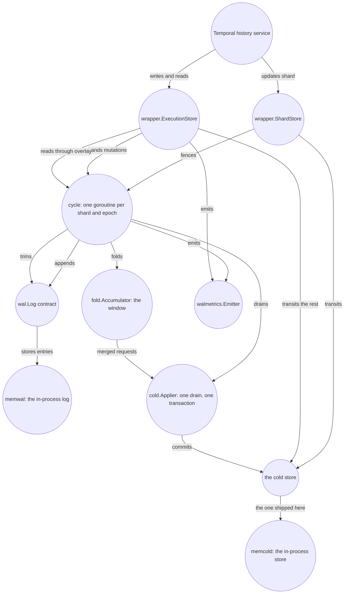

# The layer at a glance

## A workflow writes more history than it keeps

Temporal's history service is write-heavy by construction. A single workflow can move through
hundreds of state transitions. Each transition produces an `ExecutionStore` write that the
persistence layer must make durable before reporting success to the caller. Against a persistence
implementation that is already well built, each of those writes is one immediate transaction: it
rewrites the workflow's rows and inserts a row per task the transition creates. Nothing about that
transaction is wasteful on its own, which is the point [chapter
12](12-the-write-before-the-layer.md#one-transaction-holds-the-whole-world-of-a-shard) makes at
length. What grows is not the cost of *one* write; it is the number of writes.

A workflow that lives for a few seconds and dies writes and rewrites the same mutable-state rows
dozens of times, and creates task rows that are consumed and deleted long before anybody would have
wanted them stored. Many thousands of such short workflows, each moving through hundreds of
transitions in seconds, is the deployment this design targets. That profile is an assumption rather
than a measurement; [chapter 14](14-where-the-defaults-came-from.md#the-premise-under-all-of-them)
says what rests on it.

Follow one such workflow on one history shard. The first update writes a
new mutable-state row and creates a timer task. The next update rewrites the same state. Before the
workflow finishes, the timer is consumed and its task range is completed. The database has paid
for every version of the row and for a task whose entire lifetime fitted between two nearby
transitions.

`ExecutionStore` holds two kinds of data with different shapes, and only one of them can be
collapsed. **Event history** is what a workflow replays against: a transition *appends* batches of
events to their own tables and never rewrites a batch it already wrote. **Mutable state** is the
current state of one run — which activities are started and how often they were retried, which
timers are set, which children are outstanding, where the history ends and what version all of it is
at. A transition rewrites the run's row **whole**, and adds and deletes the rows of its collections
one at a time. `InternalWorkflowMutation` carries exactly that shape: the entire `ExecutionInfoBlob`
even for a delta, plus a per-member upsert and delete map for each collection.

That asymmetry is why the layer intercepts mutable state and lets event history pass straight
through to the store. An appended batch is never rewritten by the next transition, so holding it
back saves nothing. A run row rewritten dozens of times in one short workflow's lifetime can be held
back and written once.

The tempting solution is to batch those writes, and two things go wrong if you batch them naively.
An ordinary batch makes the caller wait until the batch commits, which turns an efficiency mechanism
into a latency queue. And a buffer that holds writes without answering reads breaks the server on
the very next call, because the server reads back what it just wrote across the same interface
([chapter 13](13-designs-that-were-rejected.md#a-buffer-inside-the-history-service)). To answer the
caller before the cold store has the write, the system needs some other way to make it durable
first.

The shape of that answer is not new: a durable append-only log in front of the real store, an
acknowledgement as soon as the log record is on a quorum, and aggregated updates travelling to the
store later. That is how storage engines are built internally. By published description it is also
how Temporal Cloud's own custom persistence layer works; the [post describing
it](https://temporal.io/blog/higher-throughput-and-lower-latency-temporal-clouds-custom-persistence-layer)
gives the semantics and not the implementation, so everything here is an independent design that
lands on the same trade.

What is not standard is doing it under a server that must not know. Temporal goes on believing that
it writes to a database, reads from a database, and that what it read is true. Every mechanism in
this book sits at one place where that belief breaks.

## An early acknowledgement creates a second truth

waltz puts a durable per-shard log in front of the database, which this book calls the **cold
store**: Temporal's own persistence, with its own schema, unchanged and unaware of the layer. Every
intercepted write becomes one log entry. In the shipped windowed configuration described by this
chapter, once the append is durable the cycle folds the mutation into an in-memory accumulator —
the **window** — and returns to the caller, unless this write is the one that fills the window. The
workflow's mutable-state rows in the cold store have not changed yet. The diagnostic `sync` setting
deliberately changes this order by making the caller wait for the drain; chapter 08 names that
exception once rather than teaching it as an operating mode.

That separation is what buys the collapse, and it is the source of nearly everything else in this
book. A confirmed write now exists in the log and the window, but not in the cold store. As a result:

* the stored row is missing writes the caller has already been told are safe, so a read is answered
  from the window as well as from the cold store;
* a process that dies can leave confirmed work behind, so its successor must replay the log;
* a former owner must not keep writing after a successor appears, so both the log append and the
  later cold-store transaction are fenced by the same epoch;
* the amount of confirmed-but-unsettled work must be bounded, because acknowledgement has turned it
  into a promise the system may not discard.

The confirmed-but-unsettled work in that last bullet has a name the book uses throughout: the
**tail** is the stretch of log entries that are acknowledged and not yet settled in the cold store.
The window is the in-memory, folded front of the tail, not merely a buffer of pending writes.
Starting a drain clears the window, but the entries it held stay charged to the tail until the
drain's outcome is known. [Chapter 02](02-concepts-and-invariants.md#three-positions-not-two)
defines the three seqno positions this needs — `appliedSeqno`, `resolved` and `commitSeqno` — and
shows why the tail is the interval `(resolved, commitSeqno]` and not `(appliedSeqno, commitSeqno]`.

Folding is what makes settling the tail cheaper than the writes it replaced. Repeated writes to one
workflow collapse into one merged request, and a task creation can cancel against a later range
deletion before either reaches the cold store. When a mutation, byte or age trigger fires, one drain
puts the folded batch, the epoch check and the new `appliedSeqno` into a single transaction.

## One write, and the interval it opens

1. The history service calls `UpdateWorkflowExecution` on `wrapper.ExecutionStore`.
2. The wrapper encodes the call as a `mutation.Mutation` and hands it to that shard's cycle.
3. The cycle checks the caller's condition and its own tail bound before writing anything.
4. It appends the record at the next seqno under the shard's current epoch. The log now contains a
   durable, ordered promise.
5. The cycle charges that promise to the tail and folds it into the window. If this write fires no
   drain trigger, it now returns to the caller: the append makes that answer safe. A write that fills
   the window waits while its own call performs the resulting drain.
6. A read during this interval combines the old cold row with the window. If the process disappears,
   the next owner reconstructs the same interval by replaying the log.
7. Eventually a drain starts — fired by the mutation trigger, the byte trigger, the age
   timer, a read, a replay, a window the accumulator cannot fold any further, or an explicit call
   at shutdown. One transaction writes the folded requests and advances `appliedSeqno`. A later
   trim may remove the log entries that transaction covered.

Step 4 is the irreversible boundary. Before the append, an error still belongs to this caller: the
write can be refused without consuming a seqno, and nothing is in the log. After the append,
the record exists and cannot be withdrawn, so it will be settled by this process's next drain or,
if this process dies, by whoever replays the log. The caller does not hear about it until step 5.

That boundary is also what makes a drain failure hard to attribute. A drain runs on some caller's
call — the one whose write tripped a trigger, at step 5 — and that caller does get the error back.
But the other 255 mutations in the batch belong to callers who were acked long ago and have gone, so
one caller is handed a failure for work that is mostly not its own, and its own mutation is durable
in the log whatever the answer says. The failure is real, it reaches somebody, and it identifies
nobody. (Sync mode is the one exception, and chapter 08 is where it is described.) [Chapter
05](05-write-path.md) follows that distinction through every failure class.

## The system map

This diagram shows one shard's write path, from the history service at the top to the log and cold
store at the bottom.

How to read this. Nothing crosses the shard boundary: every arrow out of `wrapper.ExecutionStore`
that is not a transit goes to *that shard's* cycle goroutine, which is the only thing that touches
that shard's accumulator, log and drain.

Three kinds of path reach the cold store, and the diagram draws two of them. **Transits** are the
calls the layer has no record shape for; they go to the base store unchanged. **The applier** is the
layer's only door to the base store's own transactions, one per drain. The third path is undrawn:
the layer also uses the base store on its own account. An intercepted write puts its event slots
down through it before the append, a read the window cannot answer falls through to it, and an
assertion the window cannot settle by itself is checked against it.

The arrows to `walmetrics.Emitter` are one-way: the emitter may not import anything it measures.

Two of the boxes are seams rather than layer code. `wal.Log` is the log's contract and `wal/memwal`
is the one implementation in the tree; `cold.Store` is the cold store's contract and
`cold/memcold` is the one implementation of that. Both shipped backends run in this process and die
with it. That is enough to boot a real Temporal server over them and exercise everything above them;
it is not somewhere to keep data, so a deployment supplies both. Everything between the two seams is
what waltz is.

The layer has five roles, and the diagram is arranged around them: `wrapper` decides which
persistence calls enter the layer; `cycle` owns one shard's ordered decisions; `wal` makes them
durable; `fold` holds the collapsed form a read can be answered from; and the applier moves that
form into the cold store. The remaining packages support or compose those roles. Their exact
inventory belongs to [chapter 03](03-components.md); the table below is a reference for readers
moving from the diagram into the tree.

### Reference: packages in the write path

| Package | What it is |
|---|---|
| `wal/` | the log's contract: one fenced, gap-free, totally ordered sequence of entries per shard, with `Fence`, `Append`, `ReadFrom` and `Trim`, and nothing about Temporal in it |
| `wal/memwal/` | the one shipped implementation of that contract, in process memory, so everything above the log can be tested without a cluster |
| `wal/waltest/` | the conformance suite: a candidate `wal.Log` runs it against itself to find out whether it satisfies the contract |
| `mutation/` | what one entry *is*: the protobuf record of one persistence call, plus the record kinds |
| `fold/` | the accumulator: folds a window of mutations into one merged request per dirty workflow, preserves the assertions that request stands on, answers reads through the overlay, and merges task pages |
| `baserow/` | the cold store's two mutable-state reads as the write path needs them — one run's row, and the current-execution row with `last_write_version` beside it. `wrapper`, `cycle` and `apply` all need the pair and none of them may import another's copy, so it lives here and imports nothing of the layer |
| `cold/` | the cold store's contract: `Store`, which is what a deployment implements — the `Applier` a drain lands on and the `Watermarker` that reads back the seqno the last drain committed, embedded in one interface because one value has to answer both — and the four things an implementation owes — one transaction per drain, the watermark inside it, the epoch asserted first, and the outcome reported in `apply`'s five classes |
| `cold/memcold/` | the one implementation of that contract here: Temporal's own SQL execution store, embedded whole, over an in-process SQLite database, with the folded window's transaction added beside its 28 inherited methods |
| `apply/` | what a drain's outcome demands of its caller: the five classes an error sorts into, and the attribution a violated invariant carries |
| `cycle/` | one goroutine per (shard, epoch) owning the accumulator, the drain, the trim, the reads and replay — the layer's state machine |
| `wrapper/` | the seam into a running server: a decorator over a base data store factory, whose `ExecutionStore` and `ShardStore` the history service talks to |
| `waltz` (the module root) | the composition a server builds: the `wal` section of the datastore options, and the components it names |
| `walmetrics/` | the layer's metric definitions and the emitter, on the server's own metrics handler |

[Chapter 03](03-components.md#the-packages-in-dependency-order) takes each of these apart
in the same order, naming the import ban that holds each in place and what owns what at run time;
[chapter 04](04-contracts.md) states what they promise each other, seam by seam.

## What one write costs, with and without the layer

Without the layer, one `UpdateWorkflowExecution` is one immediate transaction that rewrites the
workflow's mutable-state rows and inserts one row per task it carries. N transitions of one hot
workflow cost N such transactions and N sets of rows.

With the layer, that same call is:

* one **append**, which a log implementation is expected to serve with one immediate write over
  adjacent keys of its own storage — no indexes, no changefeeds, no reads of other tables. That
  expectation is invariant [I9](02-concepts-and-invariants.md#the-invariants). It is what makes an
  append cheaper than the cold-store transaction it replaces, and nothing in this tree can check it
  for a backend it has never seen;
* plus a **share** of one later apply transaction. At the shipped triggers that transaction
  carries up to 256 mutations.

The layer therefore still performs one durability write per call: it replaces each cold-store
transaction with a log append and amortises only the later cold-store work. What that buys does not
depend on the append being cheaper than the transaction it replaced: N transitions become N appends
plus one cold-store transaction per 256 of them, whatever an append costs. Whether each *call* also
gets faster is a different question, and one this layer does not promise — see the note on latency
below.

Event history costs the same on both sides of that comparison, because the layer does not touch it.
`wrapper.ExecutionStore.appendEvents` puts each of the mutation's event slots down through the base
store's `AppendHistoryNodes` before the mutation is acked — the same work the incumbent does, in a
different shape, which [chapter 12](12-the-write-before-the-layer.md#event-history-rides-separately-and-first)
takes apart. History rows are append-only and were never amplified, so there is nothing there for
the layer to collapse. Whatever share of a deployment's write volume is event history is a share the
layer cannot reduce, and it is therefore the ceiling on everything the layer can save
([chapter 15](15-the-limits-of-the-evidence.md#event-history-stays-outside-the-log)).

Two consequences follow, and they are the project's actual goals:

* **write amplification against the cold store falls.** The rows a hot workflow rewrites N times
  are written once per drain, not once per transition. By what factor is unmeasured: the claim is
  structural, and
  [chapter 15](15-the-limits-of-the-evidence.md#write-amplification-against-the-incumbent-has-never-been-measured)
  says what the instruments that come close do and do not establish.
* **tasks can die in the window.** A range deletion folded into the window removes the tasks that
  window is already holding, so a task created and consumed inside one window is never written to
  the cold store at all. What fraction of tasks that is depends on the ratio of drains to queue
  checkpoints, so the layer emits `wal_dropped_tasks` and `wal_written_tasks` per category and a
  deployment measures the fraction for its own workload. Invariant
  [I7](02-concepts-and-invariants.md#the-invariants) is what makes the saving safe: the layer
  applies the range deletions it was given, in the order it was given them, and models no ack level
  of its own.

The saving is not free. The system now has two durable positions to reconcile, an in-memory view
that reads must consult, a replay gate on a new owner, and a bounded tail of work whose callers have
already received success. A drain also makes one unlucky caller or timer pay for the whole batch.
The layer trades simpler, repeated cold-store transactions for a more complicated interval between
durability and application.

**Latency is explicitly not a goal.** A mutation was already one immediate transaction before the
layer existed, so a log append into the same class of storage costs about the same. The benefit is
fewer and smaller later writes to the cold store, not a promise that the original call returns
faster. A latency win would require a log that is cheaper to append to than the cold store is to
commit to; that possibility is why `wal.Log` is a contract rather than a fixed choice.

## What "mode" names here

Two settings decide how the layer behaves. They are **independent axes**, not one dial with four
positions:

* **what the wrapper does** — passthrough or intercept, chosen by whether the node's config has a
  `wal` section (`wrapper.Options.Layer` nil or not). It decides whether writes go into the log at
  all.
* **what window the cycle keeps** — sync or windowed, chosen by `cycle.Config.Sync`, the `sync` key
  of that same section. It decides how many mutations one apply transaction carries.

Intercept says nothing about the window, and the window means nothing without intercept.

Only one of those four positions is a deployment: intercept, windowed. `sync` sets the window to one
mutation, so nothing collapses and a write costs an append *plus* an apply transaction — more than
the store alone. It exists to make a single write attributable while you are measuring, and
[chapter 08](08-configuration.md#2-table-1--the-wal-sections-keys) says so at length. The rest of
this book describes the windowed path and names sync only where it changes an answer.

**Passthrough vs intercept.** The switch is exactly one field, `wrapper.Options.Layer`: nil is
passthrough, non-nil is intercept. In passthrough every call goes to the base store untouched, and
the wrapper observes nothing — not even a metric. There is no cycle, so there is no window to size.
In intercept the wrapper takes **eleven** of `ExecutionStore`'s 28 methods into the layer,
**refuses a twelfth**, and transits the rest:

* **eight writes become log records** — `CreateWorkflowExecution`, `UpdateWorkflowExecution`,
  `ConflictResolveWorkflowExecution`, `SetWorkflowExecution`, `DeleteWorkflowExecution`,
  `DeleteCurrentWorkflowExecution`, `AddHistoryTasks`, `RangeCompleteHistoryTasks`;
* **three reads are answered by the layer** — `GetWorkflowExecution` and `GetCurrentExecution`
  through the overlay, `GetHistoryTasks` through the task merge;
* **one is refused** — `CompleteHistoryTask`, with `wrapper.ErrCompleteHistoryTaskUnsupported`,
  because the log's deletion record is a range per category and has no shape for a single key;
* **the other sixteen transit**, exactly as they do in passthrough.

[Chapter 04](04-contracts.md#wrapperexecutionstore--28-methods) has the method table; [chapter
07](07-read-path.md) has the three reads; and what makes the two task calls records at all — they
name no run and assert nothing — is the **task record** entry of [chapter
02](02-concepts-and-invariants.md#the-glossary-in-reading-order). Why the two exclusions above are
excluded is argued where each belongs: [chapter
13](13-designs-that-were-rejected.md#the-shards-own-writes-deferred-into-the-log) for the shard's
own writes, and [chapter
12](12-the-write-before-the-layer.md#event-history-rides-separately-and-first) for event history.

Two things about the shipped windowed configuration are worth knowing early. The first:
**a caller's condition is judged before the append**, from the window itself plus a read of the
pre-window rows — the rows the window has nothing to say about. A caller whose condition fails gets
the store's own error, and a failed condition never halts the shard. That is why
`wal_answered_condition_failures` stays at zero under a window: no condition
reaches a drain to be answered there. Sync mode is the exception that series exists for. There the
pre-window read is skipped, the ack is provisional, and a condition that fails inside the drain is
reported to the one caller in that window and counted in the series.

The second: **a drain can still meet a failed assertion** — a condition the layer itself vouched
for, failing inside the transaction. Fencing makes the layer the shard's only writer, so nothing
legitimate can have moved a row the accumulator stood behind. When this fires, it is the layer's
self-audit catching a bug, not a condition an operator should plan around. It halts the shard,
because every write in the batch was acked before the drain started and there is no caller left to
tell. Nothing is lost when it fires: the log keeps its entries and the trim stops. [Path 6 of
chapter 05](05-write-path.md#6-failed-drain--an-invariant-was-violated) is the whole story; halts
and replay in general are [chapter 06](06-shard-lifecycle.md#5-halts-the-two-classes), and what an
operator does about a halt is [chapter
09](09-operations.md#b-a-shard-halted--and-which-of-the-two-classes).

## What this is not

* **Not a persistence implementation.** The layer stores nothing itself. The log is whatever
  satisfies `wal.Log`; the cold store is whatever satisfies `cold.Store`. A
  drain hands the applier a folded batch rather than rows, so the cold store's schema stays the base
  implementation's and no package of the layer ever names a column. One implementation of each seam
  ships beside the layer — `wal/memwal` and `cold/memcold` — so that everything above them can be
  run without installing anything. Neither is somewhere to keep data: both die with the process.
* **Not a cross-shard log.** The unit is one shard's log with one writer, made single by epoch
  fencing. There is no multi-writer shard and no cross-cluster story. The limit is in the layer's
  interface rather than in the store: the layer offers no operation that atomically changes two
  shards, however capable the store underneath may be.
* **Not a general-purpose queue.** The log carries `ExecutionStore` mutations and history-task
  calls only. Shard writes (`GetOrCreateShard`, `UpdateShard`, `AssertShardOwnership`) go straight
  to the store, because rangeID is both the fencing token and the task-id allocator; event history
  goes straight through too, and matching, visibility and cluster metadata never enter the layer at
  all.
* **Not a sidecar.** The layer is a library inside a custom `temporal-server` main, reached through
  the standard data store factory extension point. Process death is therefore an ordinary
  history-node failure.
* **Not a migration tool.** Shadow mode, canaries and online migration are out of scope by design.
* **Not visible to anything reading the cold store directly.** Between an ack and the drain that
  settles it, the truth about a shard is the accumulated window in one process's memory. A direct
  query against the store's tables, a backup, a dump or a second service reading those rows sees the
  shard as of the last committed drain — behind by up to a whole window (256 mutations, 256 KiB or
  5 s at the shipped triggers), and by the whole tail while an applier is stalled. Nothing marks
  those rows as stale; they answer confidently. A consumer that must not miss acknowledged work goes
  through the layer's own read path, which is
  [chapter 07](07-read-path.md#1-route-only-reads-whose-answer-can-be-split).

### The boundaries of what has been demonstrated

Two boundaries belong with the design rather than with the suites. First, **no performance claim is
made**. The two backends that ship here run in this process so that the layer can be exercised;
there is no configuration whose latency or throughput would mean anything. Where these pages do
carry numbers off a running cluster, those numbers came from the research prototype this library was
extracted from, and they are named as such at every appearance. Second, **the workload the design is
aimed at is an assumption** — many thousands of short workflows, each moving through hundreds of
transitions — so every saving named above is conditional on it.

[Chapter 15](15-the-limits-of-the-evidence.md) is the collected boundary — what each green target
does and does not establish, which limits are measurements nobody has taken and which are the shape
of a decision. [Chapter 11](11-verification.md) states each claim with the instrument that produced
it. Running a server and reading its numbers is [chapter 09](09-operations.md); every knob named
above is [chapter 08](08-configuration.md).

## Where this lives in the code

* [`../../baserow/baserow.go`](../../baserow/baserow.go) — the two cold-store reads that
  `wrapper`, `cycle` and `apply` all need, and why none of them may hold its own copy.
* [`../../wal/wal.go`](../../wal/wal.go) — the log contract: `Fence`, `Append`,
  `ReadFrom`, `Trim`, and the guarantees stated on each.
* [`../../wal/memwal/memwal.go`](../../wal/memwal/memwal.go) — that contract in process memory,
  which is the only implementation this library ships.
* [`../../fold/histtasks.go`](../../fold/histtasks.go) — I7 inside the window: the range
  deletions, and which tasks they drop before a drain ever sees them.
* [`../../wrapper/execution_store.go`](../../wrapper/execution_store.go) — the
  eleven-of-28 partition and the refused twelfth, method by method.
* [`../../wrapper/shard_store.go`](../../wrapper/shard_store.go) — the one window onto
  shard ownership, and how an acquire is told from a heartbeat.
* [`../../cycle/cycle.go`](../../cycle/cycle.go) — the state machine and `cycle.Defaults()`'s
  shipped triggers.
* [`../../cold/cold.go`](../../cold/cold.go) — `Store` and its two halves, which are the whole of
  what the layer asks of a cold store, and [`../../cold/memcold/memcold.go`](../../cold/memcold/memcold.go)
  is the one that ships.
* [`../../apply/failure.go`](../../apply/failure.go) — the five classes a drain's outcome sorts
  into, and which of them may be retried.
* [`../../fold/merge.go`](../../fold/merge.go) — what "rewrites the run's row whole"
  means to the fold: the last blob wins, and the collections merge member by member.
* [`../../config.go`](../../config.go) — the `wal` section: `sync`,
  `drain_on_read`, and what an absent or malformed section means.
