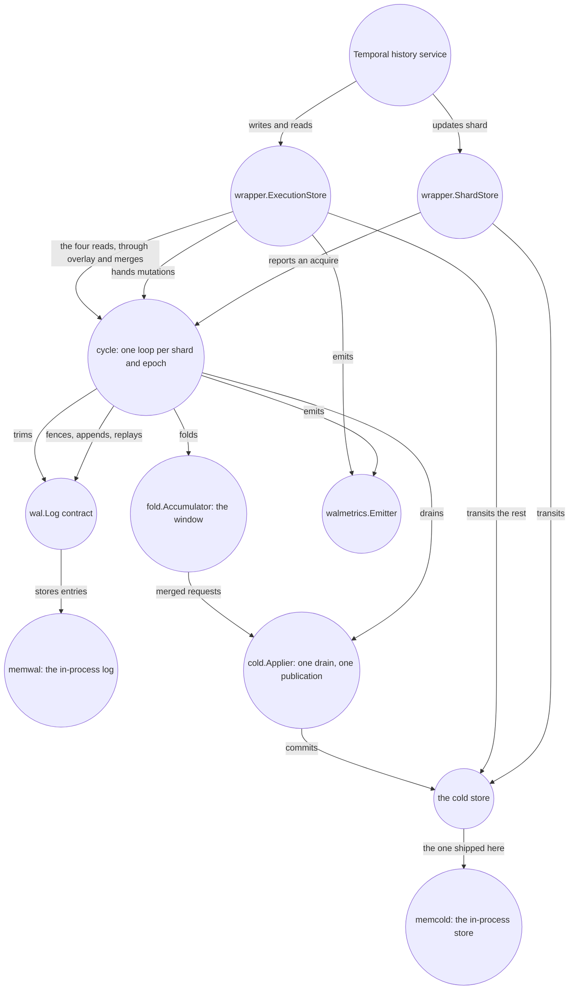

# The layer at a glance

Temporal's history service writes a lot. A single workflow can move through hundreds of state
transitions, and each transition is an `ExecutionStore` write that must be durable before the
caller hears success. Against a well-built persistence implementation, each write is one
*immediate transaction*, one a store settles without a distributed coordinator: it rewrites the
workflow's rows and inserts a row per task the transition creates. That transaction is not
wasteful on its own ([chapter
12](12-the-write-before-the-layer.md#one-transaction-holds-the-whole-world-of-a-shard)). The
problem is how many of them there are.

Follow one short workflow on one history shard. The first update writes a new mutable-state row and
creates a timer task. The next update rewrites the same row. Before the workflow finishes, the timer
is consumed and its task range is completed. The database has paid for every version of the row and
for a task whose whole lifetime fitted between two nearby transitions. The deployment this design
targets runs many thousands of such workflows, each moving through hundreds of transitions in
seconds. That profile is an assumption, not a measurement; [chapter
14](14-where-the-defaults-came-from.md#the-premise-under-all-of-them) says what rests on it.

## Two kinds of data, and only one folds

`ExecutionStore` holds two kinds of data.

* *Event history* is what workflow code is re-executed against. A transition appends batches of
  events to their own tables and never rewrites a batch it already wrote.
* *Mutable state* is the current state of one run: which activities are started and how often they
  were retried, which timers are set, which children are outstanding, where the history ends and
  what version all of it is at. A transition rewrites the run's row whole, and adds and deletes the
  rows of its collections one at a time. `InternalWorkflowMutation` has that shape: the entire
  `ExecutionInfoBlob` even for a delta, plus a per-member upsert and delete map for each collection.

So waltz, the layer this book describes, folds mutable state and never folds event history. To
*fold* is to merge many writes to one run into one. A run row rewritten dozens of times can be held
back and written once. An appended batch has nothing to collapse. The batches still travel with the
mutation that produced them, unfolded, one row out for every row in, and the *cold store*
(Temporal's own persistence underneath, defined in the next section) decides who writes them, by
whether it declares `cold.HistoryApplier` ([chapter 04](04-contracts.md#wrapperexecutionstore--28-methods)).

## Why plain batching does not work

Batching the writes naively fails in two ways. If the caller waits until the batch commits, an
efficiency mechanism becomes a latency queue. If a buffer holds writes without answering reads, the
server breaks on its next call, because it reads back what it just wrote across the same interface
([chapter 13](13-designs-that-were-rejected.md#a-buffer-inside-the-history-service)). To answer the
caller before the cold store has the write, the write must be made durable somewhere else first.

The known answer is a durable append-only log in front of the real store: acknowledge once the log
record is on a quorum, and send aggregated updates to the store later. Storage engines are built
this way internally. By its published description, Temporal Cloud's custom persistence layer works
this way too; the [post describing
it](https://temporal.io/blog/higher-throughput-and-lower-latency-temporal-clouds-custom-persistence-layer)
gives the semantics, not the implementation, so waltz is an independent design that lands on the
same trade.

What is unusual is doing it under a server that must not know. Temporal goes on believing that it
writes to a database, reads from a database, and that what it read is true. Every mechanism in this
book sits at a place where that belief would otherwise break.

## An early acknowledgement creates a second truth

waltz keeps Temporal's own persistence underneath, unchanged and unaware of the layer. This book
calls it the *cold store*, and the layer reaches it only through `cold.Store`. In front of it waltz
puts a durable per-shard *log* (`wal.Log`). Every intercepted write becomes one log entry, and a write
is *acknowledged* once its append returns.

After the append, the write is not sent to the cold store. (Under the diagnostic sync setting the
caller waits for the drain instead; see [What "mode" names here](#what-mode-names-here).) The shard's *cycle*, the one goroutine
that owns the shard's in-memory state, folds the mutation into the *window*: an in-memory accumulator
of acknowledged mutations, merged into one request per workflow. Later a *drain* writes the folded
window to the cold store in one transaction. *Triggers* decide when: 256 mutations, 256 KiB or 5 s at
the shipped defaults, and six other causes listed in [chapter 05](05-write-path.md#the-drain-triggers).

This separation buys the collapse. Repeated writes to one workflow become one merged request, and a
task creation can cancel against a later range deletion before either reaches the cold store. It
also means an acknowledged write exists in the log and the window but not yet in the cold store. The
stretch of acknowledged entries not yet settled in the cold store is the *tail*. Starting a drain
empties the window, but its entries stay in the tail until the drain's outcome is known. [Chapter
02](02-concepts-and-invariants.md#three-positions-not-two) defines the three log positions behind
this, and why the tail is measured from what is settled rather than from what the cold store holds.

Four consequences follow, and most of this book is about them:

* Reads. The stored row is missing writes the caller was told are safe, so a read is answered from
  the window as well as the cold store.
* Replay. A process that dies can leave acknowledged work behind, so its successor must replay the
  log.
* Fencing. A former owner must not keep writing after a successor appears. Both the log append and
  the later cold-store transaction carry the shard's *epoch*, an ownership token that is Temporal's
  rangeID. A stale epoch is rejected.
* Backpressure. Acknowledged-but-unsettled work is a promise the system may not discard, so the tail must
  be bounded.

## One write, and the interval it opens

Here is one write, step by step.

1. The history service calls `UpdateWorkflowExecution` on `wrapper.ExecutionStore`.
2. The wrapper wraps the call in a `mutation.Mutation` and hands it to that shard's cycle, which
   encodes it.
3. Before writing anything, the cycle checks backpressure and the caller's condition, the
   request's precondition (such as the run version it expects to overwrite) that the store would
   otherwise check.
   *Backpressure* means refusing a write before its append when the tail is at its bound, when a
   previous drain's outcome is still unknown, or when the log has asked for no new appends.
4. The cycle appends the record at the next *seqno*, the entry's gap-free position in the shard's
   log, under the shard's current epoch. The log now holds a durable, ordered promise.
5. The cycle charges the entry to the tail and folds it into the window. If the write fires no drain
   trigger, it returns to the caller; the append makes that answer safe. A write that fills the
   window waits while its own call performs the drain.
6. A read during this interval combines the old cold row with the window. If the process dies, the
   next owner rebuilds the same interval by replaying the log.
7. Eventually a drain runs. One transaction writes the folded requests and advances `appliedSeqno`,
   the highest seqno the cold store has applied, also called the *watermark*. A later *trim* may
   delete the log entries at or below the watermark.

Step 4 is the point of no return. Before the append, an error belongs to this caller: the write can
be refused without consuming a seqno, and nothing is in the log. After the append, the record cannot
be withdrawn. It will be settled by this process's next drain or, if the process dies, by whoever
replays the log.

The same boundary makes a drain failure hard to attribute. A drain that a write trips runs on that
caller's call, and that caller gets the error. But the rest of the batch, up to 255 more mutations at
the shipped mutation trigger and fewer when the byte trigger fires first, belongs to callers who were
acknowledged earlier and have gone. So the caller that tripped the drain gets an error for a batch
that is mostly other callers' work, while its own mutation is already durable in the log. [Chapter 05](05-write-path.md) follows this through every failure class.

Two failures that look alike end differently. A failed condition is refused before the append. It
is judged from the window plus a read of the pre-window rows, the cold rows for anything the window
holds nothing about. The caller gets the store's own error, and the shard never halts ([chapter
05](05-write-path.md#3-failed-write--the-condition-did-not-hold)).

A failed assertion inside a drain is different. It is a condition the layer itself vouched for, and
fencing makes the layer the shard's only writer, so it is the layer's self-audit catching a bug. It
halts the shard because every writer in the batch was already acknowledged and the failure cannot
be pinned on one of them. Nothing acknowledged is lost: the log keeps its entries and trim stops
([chapter 05](05-write-path.md#6-failed-drain--an-invariant-was-violated), [chapter
06](06-shard-lifecycle.md#5-halts-the-two-classes)). What an operator does about a halt is [chapter
09](09-operations.md#b-a-shard-halted--and-which-of-the-two-classes).

## The system map

The diagram below shows one shard's write path, from the history service at the top to the log and
the cold store at the bottom.

```mermaid
graph TD
  HS(("Temporal history service"))
  ES(("wrapper.ExecutionStore"))
  SS(("wrapper.ShardStore"))
  CY(("cycle: one loop per shard and epoch"))
  ACC(("fold.Accumulator: the window"))
  LOG(("wal.Log contract"))
  MW(("memwal: the in-process log"))
  MC(("memcold: the in-process store"))
  AP(("cold.Applier: one drain, one publication"))
  CS(("the cold store"))
  MET(("walmetrics.Emitter"))

  HS -->|writes and reads| ES
  HS -->|updates shard| SS
  SS -->|reports an acquire| CY
  SS -->|transits| CS
  ES -->|hands mutations| CY
  ES -->|the four reads, through overlay and merges| CY
  ES -->|transits the rest| CS
  CY -->|fences, appends, replays| LOG
  CY -->|folds| ACC
  CY -->|drains| AP
  CY -->|trims| LOG
  LOG -->|stores entries| MW
  CS -->|the one shipped here| MC
  ACC -->|merged requests| AP
  AP -->|commits| CS
  CY -->|emits| MET
  ES -->|emits| MET
```

Nothing crosses the shard boundary. Every arrow out of `wrapper.ExecutionStore` that is not a
transit or a metric goes to that shard's cycle goroutine. The cycle is the only thing that touches
the shard's accumulator and drain, and the only thing that appends to its log.

Three kinds of path reach the cold store, and the diagram draws two of them.

* *Transits* are the calls the layer has no record shape for. They go unchanged to the *base store*:
  the persistence implementation's `ExecutionStore` and `ShardStore` that the wrapper decorates.
  Here `memcold` is both the base store and the cold
  store, so the diagram draws them as one node.
* *The applier* is the layer's only door to the base store's own transactions, one per drain.
* The undrawn third path is the layer using the base store on its own account. Over a cold store
  that does not declare `cold.HistoryApplier`, an intercepted write puts its event slots down
  through it before the append. A read the window cannot answer falls through to it, an assertion
  the window cannot settle is checked against it, and a cycle reads the watermark back through
  `cold.Watermarker` when it starts and when a drain's outcome is unknown.

The arrows to `walmetrics.Emitter` are one-way: the emitter may not import anything it measures.
`wal.Log` and `cold.Store` are seams, not layer code; `memwal` and `memcold` are the implementations
in this tree ([What this is not](#what-this-is-not)). Everything between the two seams is waltz.

The layer has five roles. `wrapper` decides which persistence calls enter the layer. `cycle` owns
one shard's ordered decisions. `wal` makes them durable. `fold` holds the collapsed form a read can
be answered from. The applier moves that form into the cold store. The other packages support or
compose these roles. [Chapter 03](03-components.md#the-packages-in-dependency-order) lists every
package in dependency order, and [chapter 04](04-contracts.md) states what they promise each other.

## What one write costs, with and without the layer

Without the layer, one `UpdateWorkflowExecution` is one immediate transaction that rewrites the
workflow's mutable-state rows and inserts one row per task it carries. N transitions of one hot
workflow cost N such transactions and N sets of rows.

With the layer, the same call costs:

* one append, which a log implementation is expected to serve with one immediate write over
  adjacent keys of its own storage: no indexes, no changefeeds, no reads of other tables. That
  expectation is invariant [I9](02-concepts-and-invariants.md#the-invariants). Nothing in this tree
  can check it for a backend it has never seen;
* plus a share of one later apply transaction, which carries up to 256 mutations at the shipped
  triggers.

So the layer still makes one durability write per call. It replaces each cold-store transaction
with a log append and amortises only the later cold-store work. N transitions become N appends plus
one cold-store transaction per 256 of them, whatever an append costs.

Event history costs the same rows with and without the layer, because the layer never folds it, so
its share of a deployment's write volume caps what the layer can save. Who writes the batches, the
drain or the wrapper before the append, depends on whether the cold store declares
`cold.HistoryApplier` ([chapter 04](04-contracts.md#wrapperexecutionstore--28-methods)); [chapter
15](15-the-limits-of-the-evidence.md#where-event-history-lands-is-the-cold-stores-and-neither-path-is-measured)
says neither path is measured.

### The two goals

* Write amplification against the cold store falls. The rows a hot workflow rewrites N times are
  written once per drain, not once per transition. By what factor is unmeasured; the claim is
  structural, and
  [chapter 15](15-the-limits-of-the-evidence.md#write-amplification-against-the-incumbent-has-never-been-measured)
  says what the nearest instruments do and do not establish.
* Tasks can die in the window. A range deletion folded into the window removes the tasks the window
  already holds, so a task created and consumed inside one window is never written to the cold store.
  The fraction depends on the ratio of drains to queue checkpoints, so the layer emits
  `wal_dropped_tasks` and `wal_written_tasks` per category and a deployment measures it for its own
  workload. Invariant [I7](02-concepts-and-invariants.md#the-invariants) makes this safe: the layer
  applies the range deletions it was given, in the order given, and models no ack level of its own.

### What it costs, and what it does not promise

The saving has a price. The system now has two durable positions to reconcile, an in-memory view
that reads must consult, a replay gate on a new owner, and a bounded tail of work whose callers have
already been told it succeeded. A drain also makes one unlucky caller or timer pay for the whole
batch. This buys fewer cold-store writes at the cost of a more complicated interval between
durability and application.

Latency is not a goal. A mutation was already one immediate transaction, so an append into the same
class of storage costs about the same. The benefit is fewer and smaller later writes to the cold
store, not a faster call. A latency win needs a log that is cheaper to append to than the cold store
is to commit to. That possibility is why `wal.Log` is a contract rather than a fixed choice.

## What "mode" names here

Two independent switches decide how the layer runs:

* What the wrapper does: *passthrough* or *intercept*. The switch is one field,
  `wrapper.Options.Layer`, set by whether the node's config has a `wal` section: nil is passthrough,
  non-nil is intercept. It decides whether writes go into the log at all.
* What window the cycle keeps: *sync* or *windowed*, set by `cycle.Config.Sync`, the `sync` key of
  that same section. It decides how many mutations one apply transaction carries.

Intercept says nothing about the window, and the window means nothing without intercept. Of the four
combinations, only intercept with windowed is a deployment that runs the layer. Sync is a diagnostic
setting that drains every write on its own call; what it changes is [chapter
08](08-configuration.md#2-table-1--the-wal-sections-keys). The rest of this book describes the
windowed path.

In passthrough every call goes to the base store untouched, and the wrapper observes nothing, not
even a metric. There is no cycle, so there is no window. In intercept the wrapper takes twelve of
`ExecutionStore`'s 28 methods into the layer, refuses a thirteenth, and transits the rest:

* eight writes become log records: `CreateWorkflowExecution`, `UpdateWorkflowExecution`,
  `ConflictResolveWorkflowExecution`, `SetWorkflowExecution`, `DeleteWorkflowExecution`,
  `DeleteCurrentWorkflowExecution`, `AddHistoryTasks`, `RangeCompleteHistoryTasks`;
* four reads are answered by the layer: `GetWorkflowExecution` and `GetCurrentExecution` through the
  overlay (the cold row plus what the window holds), `GetHistoryTasks` through the task merge,
  `ReadHistoryBranch` through the history merge;
* one is refused: `CompleteHistoryTask`, with `wrapper.ErrCompleteHistoryTaskUnsupported`, because
  the log's deletion record is a range per category and has no shape for a single key;
* the other fifteen transit, as they do in passthrough.

[Chapter 04](04-contracts.md#wrapperexecutionstore--28-methods) has the method table and [chapter
07](07-read-path.md) the four reads. Why the two task calls can be records at all (they name no run
and assert nothing) is the task record entry in [chapter
02](02-concepts-and-invariants.md#the-glossary-in-reading-order). The shard's own writes stay out of
the log ([chapter 13](13-designs-that-were-rejected.md#the-shards-own-writes-deferred-into-the-log)).
A standalone history append stays out because it has no mutation whose condition, epoch and
acknowledgement it could share ([chapter
12](12-the-write-before-the-layer.md#event-history-rides-separately-and-first)).

## What this is not

* Not a persistence implementation. waltz stores nothing itself. The log is whatever satisfies
  `wal.Log` and the cold store is whatever satisfies `cold.Store`. A drain hands the applier a folded
  batch rather than rows, so the cold store's schema stays the base implementation's and no package
  of the layer names a column. One implementation of each seam ships beside the layer, `wal/memwal`
  and `cold/memcold`. They are enough to boot a real Temporal server over them and exercise
  everything above them without installing anything. Both run in
  this process and die with it, so neither is somewhere to keep data and a deployment supplies both.
* Not a cross-shard log. The unit is one shard's log with one writer, made single by epoch fencing.
  There is no multi-writer shard and no cross-cluster story. The limit is in the layer's interface,
  not the store: the layer offers no operation that atomically changes two shards.
* Not a general-purpose queue. The log carries `ExecutionStore` mutations and history-task calls
  only. Shard writes (`GetOrCreateShard`, `UpdateShard`, `AssertShardOwnership`) go straight to the
  store, because rangeID is both the fencing token and the task-id allocator. A standalone
  `AppendHistoryNodes` goes straight through too, and matching, visibility and cluster metadata never
  enter the layer. An intercepted write's own event batches always reach the layer, and the cold
  store decides whether they ride the record.
* Not a sidecar. The layer is a library inside a custom `temporal-server` main, reached through the
  standard data store factory extension point. Process death is an ordinary history-node failure.
* Not a migration tool. Shadow mode, canaries and online migration are out of scope by design.
* Not visible to anything reading the cold store directly. Between an acknowledgement and the drain
  that settles it, the truth about a shard is the window in one process's memory. A direct query, a
  backup, a dump or a second service reading the store's tables sees the shard as of the last
  committed drain: behind by up to a whole window (256 mutations, 256 KiB or 5 s at the shipped
  triggers), and by the whole tail while an applier is stalled. Nothing marks those rows as stale. A
  consumer that must not miss acknowledged work goes through the layer's read path ([chapter
  07](07-read-path.md#1-route-only-reads-whose-answer-can-be-split)).

### What has not been demonstrated

No performance claim is made. The two shipped backends run in process, so no latency or throughput
measured here would mean anything. The few numbers from a running cluster come from the research
prototype this library was extracted from and are named as such. The target workload is an
assumption, so every saving above is conditional on it. [Chapter
15](15-the-limits-of-the-evidence.md) collects these limits, and [chapter 11](11-verification.md)
states each claim with the instrument that produced it.

## Summary

Temporal's history service rewrites the same mutable-state rows and creates short-lived task rows
many times per workflow, and each write is its own transaction. waltz acknowledges each write once it
is appended to a durable per-shard log, folds acknowledged mutations into an in-memory window, and
drains the window to the cold store in one transaction. Event history is never folded and caps what
the layer can save.

Acknowledging early creates a tail of work that is durable but not yet in the cold store. Reads must
merge the window, a new owner must replay the log, the epoch must fence the old owner, and the tail
must be bounded. The append is the point of no return: errors before it belong to the caller, and
everything after it is settled by a drain or a replay.

The layer buys fewer cold-store writes and tasks that never reach the store, at the cost of a more
complicated interval between durability and application. It promises no latency win. Chapter 02
defines the vocabulary, chapter 03 the packages, and chapters 05 to 07 follow the write, the shard's
life and the read. Running a server and reading its numbers is [chapter 09](09-operations.md);
every knob named above is [chapter 08](08-configuration.md).

## Where this lives in the code

* [`../../baserow/baserow.go`](../../baserow/baserow.go) — the two cold-store reads that
  `wrapper`, `cycle` and `apply` all need.
* [`../../wal/wal.go`](../../wal/wal.go) — the log contract: `Fence`, `Append`, `ReadFrom`, `Trim`,
  `Close`, and the guarantees on each.
* [`../../wal/memwal/memwal.go`](../../wal/memwal/memwal.go) — that contract in process memory, the
  only implementation shipped.
* [`../../fold/histtasks.go`](../../fold/histtasks.go) — I7 inside the window: the range deletions
  and the tasks they drop before a drain sees them.
* [`../../wrapper/execution_store.go`](../../wrapper/execution_store.go) — the twelve-of-28
  partition and the refused thirteenth, method by method.
* [`../../wrapper/shard_store.go`](../../wrapper/shard_store.go) — the view onto shard ownership,
  and how an acquire is told from a heartbeat.
* [`../../cycle/cycle.go`](../../cycle/cycle.go) — the state machine and `cycle.Defaults()`'s
  shipped triggers.
* [`../../cold/cold.go`](../../cold/cold.go) — `Store` and its two halves, the whole of what the
  layer asks of a cold store; [`../../cold/memcold/memcold.go`](../../cold/memcold/memcold.go) is
  the one that ships.
* [`../../apply/failure.go`](../../apply/failure.go) — the five classes a drain's outcome sorts
  into, and which may be retried.
* [`../../fold/merge.go`](../../fold/merge.go) — "rewrites the run's row whole" to the fold: the
  last blob wins, and the collections merge member by member.
* [`../../config.go`](../../config.go) — the `wal` section: `sync`, `drain_on_read`, and what an
  absent or malformed section means.
