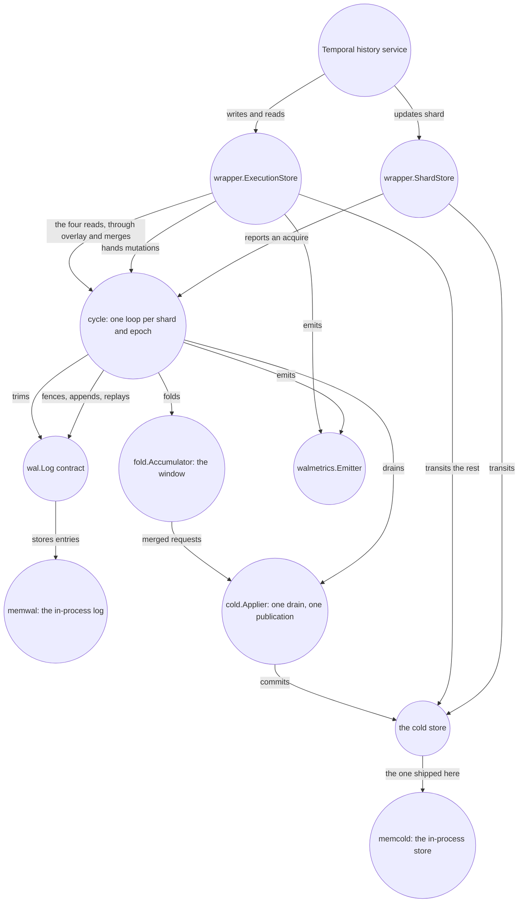

# The layer at a glance

A Temporal workflow can move through hundreds of state transitions, each an `ExecutionStore` write
that must be durable before the caller hears success. Each is one *immediate transaction* (one the
store settles without a distributed coordinator) that rewrites the workflow's rows and inserts a row
per task it creates. One such transaction is not wasteful ([chapter
12](12-the-write-before-the-layer.md#one-transaction-holds-the-whole-world-of-a-shard)); the
problem is how many there are.

Take one short workflow on one history shard. The first update writes a mutable-state row and
creates a timer task; the next rewrites the same row; before the workflow finishes, the timer is
consumed and its task range completed. Every version of the row, and the short-lived task, cost a
write. The target deployment runs many thousands of such workflows, each through hundreds of
transitions in seconds: an assumption, not a measurement ([chapter
14](14-where-the-defaults-came-from.md#the-premise-under-all-of-them)).

## Two kinds of data, and only one folds

* *Event history* is what workflow code is re-executed against. A transition appends batches of
  events to their own tables and never rewrites one.
* *Mutable state* is the current state of one run: started activities and their retries, set
  timers, outstanding children, where the history ends and at what version. A transition rewrites
  the run's row whole and adds and deletes its collections' rows one at a time:
  `InternalWorkflowMutation` carries the entire `ExecutionInfoBlob` even for a delta, plus a
  per-member upsert and delete map for each collection.

So waltz, the layer this book describes, *folds* mutable state, merging many writes to one run into
one, and never folds event history: a row rewritten dozens of times can be written once, but an
appended batch has nothing to collapse. The batches travel unfolded with the mutation that produced
them, and the *cold store*, Temporal's own persistence underneath, decides who writes them: the
drain, if it declares `cold.HistoryApplier`, otherwise the wrapper before the append ([chapter
04](04-contracts.md#wrapperexecutionstore--28-methods)).

## Why plain batching does not work

If the caller waits for the batch to commit, batching becomes a latency queue. A buffer that holds
writes without answering reads breaks the server, which reads back what it just wrote ([chapter
13](13-designs-that-were-rejected.md#a-buffer-inside-the-history-service)). To answer the caller
before the cold store has the write, the write must first be durable somewhere else.

The known answer, used inside storage engines and, by its [published
description](https://temporal.io/blog/higher-throughput-and-lower-latency-temporal-clouds-custom-persistence-layer),
by Temporal Cloud's persistence layer, is a durable append-only log in front of the real store:
acknowledge once the record is on a quorum, send aggregated updates to the store later. What is
unusual here is doing it under a server that must not know: Temporal goes on believing what it
reads from its database, and every mechanism in this book sits where that belief would otherwise
break.

## An early acknowledgement creates a second truth

The cold store stays unchanged and unaware of the layer, reached only through `cold.Store`. In
front of it waltz puts a durable per-shard *log* (`wal.Log`). Every intercepted write becomes one
log entry and is *acknowledged* once its append returns.

The shard's *cycle*, the one goroutine that owns the shard's in-memory state, folds the write into
the *window*: an in-memory accumulator of acknowledged mutations, merged into one request per
workflow, so a task creation can cancel against a later range deletion before either reaches the
cold store. Later a *drain* writes the window to the cold store in one transaction. *Triggers*
decide when: 256 mutations, 256 KiB or 5 s at the shipped defaults, and six other causes ([chapter
05](05-write-path.md#the-drain-triggers)).

The price is the *tail*, the acknowledged entries whose fate is not yet settled. A drain empties
the window on starting, but its entries stay in the tail until its outcome is known ([chapter
02](02-concepts-and-invariants.md#three-positions-not-two) has the three log positions). Four
consequences follow, and most of this book is about them:

* Reads. The stored row lacks acknowledged writes, so a read is answered from the window as well as
  the cold store.
* Replay. A process that dies can leave acknowledged work behind, so its successor replays the log.
* Fencing. A former owner must not keep writing after a successor appears, so the log append and
  the cold-store transaction both carry the shard's *epoch*, an ownership token that is Temporal's
  rangeID, and a stale epoch is rejected.
* Backpressure. Acknowledged work may not be discarded, so the tail is bounded.

## One write, and the interval it opens

1. The history service calls `UpdateWorkflowExecution` on `wrapper.ExecutionStore`.
2. The wrapper wraps the call in a `mutation.Mutation` and hands it to that shard's cycle, which
   encodes it.
3. The cycle checks backpressure and the caller's condition, the precondition the store would
   otherwise check (such as the run version it expects to overwrite). *Backpressure* refuses a
   write before its append when the tail is at its bound, when a previous drain's outcome is still
   unknown, or when the log has asked for no new appends.
4. The cycle appends the record at the next *seqno*, the entry's gap-free position in the shard's
   log, under the shard's current epoch.
5. The cycle charges the entry to the tail and folds it into the window. A write that fires no drain
   trigger returns to the caller, safe because of the append; one that does performs the drain on
   its own call.
6. One drain transaction writes the folded requests and advances `appliedSeqno`, the highest seqno
   the cold store has applied, also called the *watermark*. A later *trim* may delete the log
   entries at or below it.

Step 4 is the point of no return. Before the append, an error belongs to this caller: the write is
refused without consuming a seqno. After it, the record cannot be withdrawn; this process's next
drain settles it or, if the process dies, whoever replays the log.

So a drain failure is hard to attribute. The caller whose write tripped the drain gets the error
for a batch that is mostly other callers' acknowledged work: up to 255 more mutations at the
shipped mutation trigger, fewer when the byte trigger fires first. Its own mutation is already
durable in the log ([chapter 05](05-write-path.md) follows every failure class).

Two failures that look alike end differently. A failed condition is refused before the append,
judged from the window plus the cold rows for anything the window holds nothing about; the caller
gets the store's own error and the shard never halts ([chapter
05](05-write-path.md#3-failed-write--the-condition-did-not-hold)). A failed assertion inside a
drain is a condition the layer vouched for as the shard's only writer (fencing makes it so), so it
is a bug: every writer in the batch was already acknowledged and none can be blamed, and the shard
halts. Nothing acknowledged is lost: the log keeps its entries and trim stops ([chapter
05](05-write-path.md#6-failed-drain--an-invariant-was-violated), [chapter
06](06-shard-lifecycle.md#5-halts-the-two-classes), operator response in [chapter
09](09-operations.md#b-a-shard-halted--and-which-of-the-two-classes)).

## The system map

Figure: one shard's write path, from the history service down to the log and the cold store.

```mermaid
graph TD
  HS(("Temporal history service"))
  ES(("wrapper.ExecutionStore"))
  SS(("wrapper.ShardStore"))
  CY(("cycle: one loop per shard and epoch"))
  ACC(("fold.Accumulator: the window"))
  LOG(("wal.Log contract"))
  MW(("memwal: the in-process log"))
  MC(("memcold: the in-process store"))
  AP(("cold.Applier: one drain, one publication"))
  CS(("the cold store"))
  MET(("walmetrics.Emitter"))

  HS -->|writes and reads| ES
  HS -->|updates shard| SS
  SS -->|reports an acquire| CY
  SS -->|transits| CS
  ES -->|hands mutations| CY
  ES -->|the four reads, through overlay and merges| CY
  ES -->|transits the rest| CS
  CY -->|fences, appends, replays| LOG
  CY -->|folds| ACC
  CY -->|drains| AP
  CY -->|trims| LOG
  LOG -->|stores entries| MW
  CS -->|the one shipped here| MC
  ACC -->|merged requests| AP
  AP -->|commits| CS
  CY -->|emits| MET
  ES -->|emits| MET
```

Nothing crosses the shard boundary. Every arrow out of `wrapper.ExecutionStore` that is not a
transit or a metric goes to that shard's cycle, the only goroutine that touches its accumulator and
drain or appends to its log. The arrows to `walmetrics.Emitter` are one-way: the emitter may not
import anything it measures.

Three kinds of path reach the cold store; the diagram draws two.

* *Transits* are calls the layer has no record shape for. They go unchanged to the *base store*,
  the persistence implementation's `ExecutionStore` and `ShardStore` that the wrapper decorates.
  Here `memcold` is both base store and cold store, so the diagram draws one node.
* *The applier* is the layer's only door to the base store's own transactions, one per drain.
* Undrawn, the layer uses the base store on its own account: event slots written before the append
  (over a cold store without `cold.HistoryApplier`), reads the window cannot answer, assertions it
  cannot settle, and the watermark, read back through `cold.Watermarker` when a cycle starts and
  when a drain's outcome is unknown.

Everything between the seams `wal.Log` and `cold.Store` is waltz, in five roles: `wrapper` decides
which calls enter the layer, `cycle` owns one shard's ordered decisions, `wal` makes them durable,
`fold` holds the collapsed form reads are answered from, and the applier moves that form into the
cold store. [Chapter 03](03-components.md#the-packages-in-dependency-order) lists the packages that
support or compose these, and [chapter 04](04-contracts.md) states what they promise each other.

## What one write costs, with and without the layer

Without the layer, N transitions of one hot workflow cost N immediate transactions. With it, they
cost N appends plus one cold-store transaction per 256 mutations at the shipped triggers: the layer
still makes one durability write per call, and only the cold-store work is amortised. A log
implementation is expected to serve an append with one immediate write over adjacent keys of its
own storage: no indexes, no changefeeds, no reads of other tables. That expectation is invariant
[I9](02-concepts-and-invariants.md#the-invariants), and nothing in this tree can check it for a
backend it has never seen.

Event history costs the same rows either way, so its share of a deployment's write volume caps the
saving. Neither of its two paths into the cold store is measured ([chapter
15](15-the-limits-of-the-evidence.md#where-event-history-lands-is-the-cold-stores-and-neither-path-is-measured)).

### The two goals

* Write amplification against the cold store falls: rows a hot workflow rewrites N times are written
  once per drain. The factor is unmeasured; the claim is structural
  ([chapter 15](15-the-limits-of-the-evidence.md#write-amplification-against-the-incumbent-has-never-been-measured)).
* Tasks can die in the window: a range deletion folded into it removes the tasks it holds, so a task
  created and consumed inside one window never reaches the cold store. The fraction depends on the
  ratio of drains to queue checkpoints; the layer emits `wal_dropped_tasks` and
  `wal_written_tasks` per category for a deployment to measure. Invariant
  [I7](02-concepts-and-invariants.md#the-invariants) makes this safe: the layer applies the range
  deletions it was given, in the order given, and models no ack level of its own.

### What it does not promise

Beyond the four consequences, someone pays for each drain: the caller whose write tripped it, or a
timer. Latency is not a goal. An append into the same class of storage costs about what the
immediate transaction did; a latency win needs a log cheaper to append to than the cold store is to
commit to, which is why `wal.Log` is a contract rather than a fixed choice.

## What "mode" names here

Two independent switches decide how the layer runs:

* *Passthrough* or *intercept*: whether writes go into the log at all. It is the one field
  `wrapper.Options.Layer`, nil when the node's config has no `wal` section.
* *Sync* or *windowed*: how many mutations one apply transaction carries. It is
  `cycle.Config.Sync`, the `sync` key of that section.

Only intercept with windowed runs the layer: the window means nothing without intercept, and sync
is a diagnostic setting that drains every write on its own call ([chapter
08](08-configuration.md#2-table-1--the-wal-sections-keys)). This book describes the windowed path.

In passthrough every call goes to the base store untouched, with no metric and no cycle. In
intercept the wrapper takes twelve of `ExecutionStore`'s 28 methods into the layer, refuses a
thirteenth, and transits the rest:

* eight writes become log records: `CreateWorkflowExecution`, `UpdateWorkflowExecution`,
  `ConflictResolveWorkflowExecution`, `SetWorkflowExecution`, `DeleteWorkflowExecution`,
  `DeleteCurrentWorkflowExecution`, `AddHistoryTasks`, `RangeCompleteHistoryTasks`;
* four reads are answered by the layer: `GetWorkflowExecution` and `GetCurrentExecution` through the
  overlay (the cold row plus what the window holds), `GetHistoryTasks` through the task merge,
  `ReadHistoryBranch` through the history merge;
* one is refused: `CompleteHistoryTask`, with `wrapper.ErrCompleteHistoryTaskUnsupported`, because
  the log's deletion record is a range per category and has no shape for a single key;
* the other fifteen transit, as they do in passthrough.

[Chapter 04](04-contracts.md#wrapperexecutionstore--28-methods) has the method table and [chapter
07](07-read-path.md) the four reads. The two task calls can be records because they name no run and
assert nothing (the task record entry in [chapter
02](02-concepts-and-invariants.md#the-glossary-in-reading-order)).

## What this is not

* Not a persistence implementation. waltz stores nothing itself: the log is whatever satisfies
  `wal.Log`, the cold store whatever satisfies `cold.Store`. A drain hands the applier a folded
  batch, not rows, so the schema stays the base implementation's and no layer package names a
  column. One in-process implementation of each seam ships, `wal/memwal` and `cold/memcold`: enough
  to boot a real Temporal server with nothing installed, but neither keeps data past the process,
  so a deployment supplies both.
* Not a cross-shard log. The unit is one shard's log with one writer, made single by epoch fencing.
  No operation atomically changes two shards, and there is no cross-cluster story.
* Not a general-purpose queue. The log carries `ExecutionStore` mutations and history-task calls
  only. Shard writes (`GetOrCreateShard`, `UpdateShard`, `AssertShardOwnership`) go straight to the
  store, because rangeID is both the fencing token and the task-id allocator ([chapter
  13](13-designs-that-were-rejected.md#the-shards-own-writes-deferred-into-the-log)). So does a
  standalone `AppendHistoryNodes`, which has no mutation whose condition, epoch and acknowledgement
  it could share ([chapter
  12](12-the-write-before-the-layer.md#event-history-rides-separately-and-first)). Matching,
  visibility and cluster metadata never enter the layer.
* Not a sidecar. The layer is a library inside a custom `temporal-server` main, reached through the
  standard data store factory extension point. Process death is an ordinary history-node failure.
* Not a migration tool. Shadow mode, canaries and online migration are out of scope.
* Not visible to anything reading the cold store directly. Until a drain settles it, an
  acknowledged write is in the log and one process's window, not in the tables. A direct query,
  backup, dump or second service sees the shard as of the last committed drain: behind by up to a
  whole window (256 mutations, 256 KiB or 5 s at the shipped triggers), and by the whole tail while
  an applier is stalled. Nothing marks those rows stale. A consumer that must not miss acknowledged
  work goes through the layer's read path ([chapter
  07](07-read-path.md#1-route-only-reads-whose-answer-can-be-split)).

No performance claim is made: both shipped backends run in process, so timings would mean nothing.
The few cluster numbers come from the research prototype this library was extracted from and say
so, and every saving above assumes the workload. [Chapter 15](15-the-limits-of-the-evidence.md)
collects these limits; [chapter 11](11-verification.md) pairs each claim with its instrument.

## Summary

Temporal rewrites the same mutable-state rows and creates short-lived task rows many times per
workflow, each write its own transaction. waltz acknowledges a write once it is appended to a
durable per-shard log, folds acknowledged mutations into an in-memory window, and drains the window
to the cold store in one transaction. Event history is never folded and caps the saving.

The early acknowledgement opens a tail of entries whose fate is not yet settled: reads merge the
window, a new owner replays the log, the epoch fences the old owner, and the tail is bounded. The
append is the point of no return. The layer buys fewer cold-store writes and tasks that never reach
the store, and promises no latency win. Chapter 02 has the vocabulary; 05 to 07 follow a write, a
shard's life and a read.

## Where this lives in the code

* [`../../baserow/baserow.go`](../../baserow/baserow.go) — the two cold-store reads that
  `wrapper`, `cycle` and `apply` all need.
* [`../../wal/wal.go`](../../wal/wal.go) — the log contract: `Fence`, `Append`, `ReadFrom`, `Trim`,
  `Close`, and the guarantees on each.
* [`../../wal/memwal/memwal.go`](../../wal/memwal/memwal.go) — that contract in process memory.
* [`../../fold/histtasks.go`](../../fold/histtasks.go) — I7 inside the window: the range deletions
  and the tasks they drop before a drain sees them.
* [`../../wrapper/execution_store.go`](../../wrapper/execution_store.go) — the twelve-of-28
  partition and the refused thirteenth, method by method.
* [`../../wrapper/shard_store.go`](../../wrapper/shard_store.go) — the view onto shard ownership,
  and how an acquire is told from a heartbeat.
* [`../../cycle/cycle.go`](../../cycle/cycle.go) — the state machine and `cycle.Defaults()`'s
  shipped triggers.
* [`../../cold/cold.go`](../../cold/cold.go) — `Store` and its two halves, all the layer asks of a
  cold store; [`../../cold/memcold/memcold.go`](../../cold/memcold/memcold.go) is the shipped one.
* [`../../apply/failure.go`](../../apply/failure.go) — the five classes a drain's outcome sorts
  into, and which may be retried.
* [`../../fold/merge.go`](../../fold/merge.go) — the fold of a run's row: the last blob wins, the
  collections merge member by member.
* [`../../config.go`](../../config.go) — the `wal` section: `sync`, `drain_on_read`, and what an
  absent or malformed section means.
