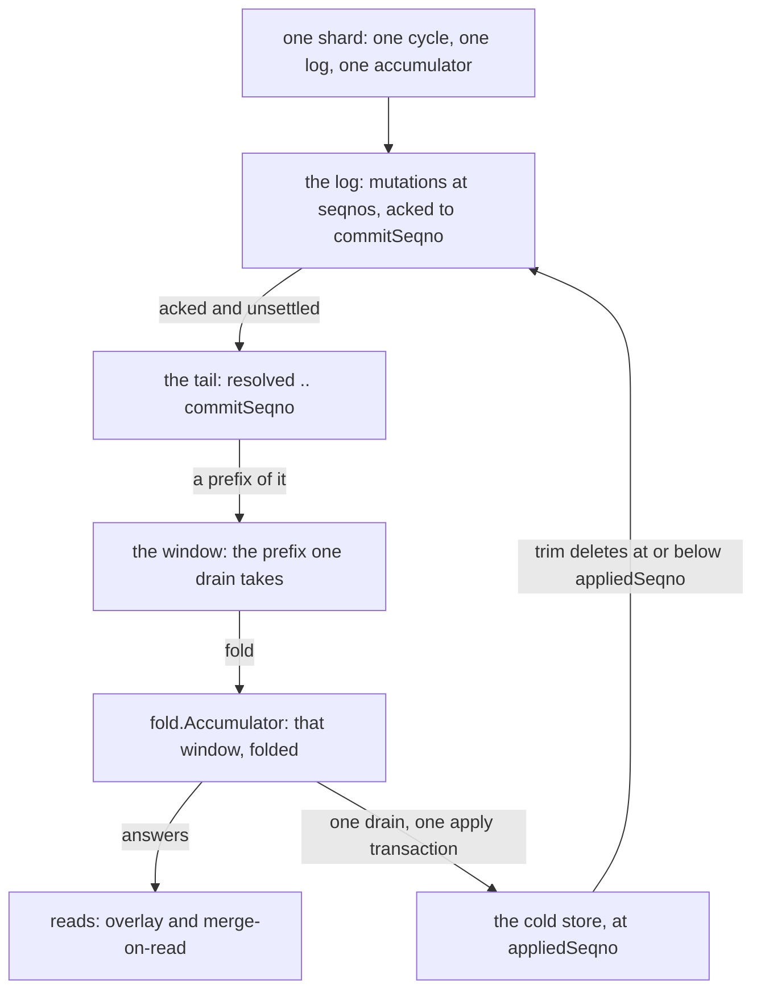
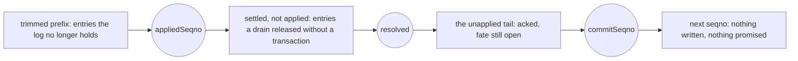
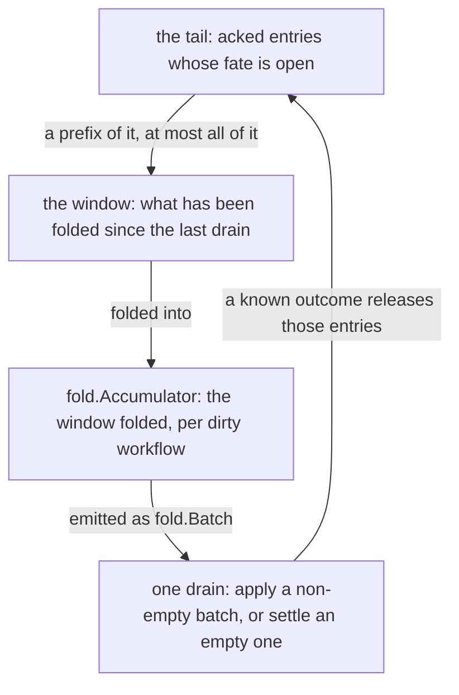

# The geometry of an acknowledged write

## Three positions, not two

Suppose a caller has received success, but the corresponding mutable-state row in the cold store
has not yet changed.
The write is neither pending nor complete in the ordinary database sense. It is durable in the log,
visible through the layer, and waiting to be folded into the cold store. Most of this design follows
from taking that interval seriously.

One shard therefore has three significant positions:

```text
appliedSeqno <= resolved <= commitSeqno < next seqno
```

`commitSeqno` is the highest entry the log has acknowledged. `appliedSeqno` is the highest entry
whose effects a cold-store transaction contains. Between them, `resolved` marks the highest entry
whose fate is known. Usually `resolved` and `appliedSeqno` move together. They separate when a
window folds to no database work: its entries are finished, but there was no transaction in which
to advance the persistent watermark.

This third position prevents two tempting mistakes. Measuring the tail as
`commitSeqno - appliedSeqno` charges already-settled entries against the memory bound. Advancing
`appliedSeqno` without a transaction lets trimming erase entries that a new owner still needs for
replay. The tail is consequently the interval `(resolved, commitSeqno]`: durable work whose outcome
is still open.

The same entries also have an in-memory shape, called a **window**, but the window is not the tail.
The tail is a range of log positions. The window is a slice of that range, folded into one summary
per dirty workflow; a partial drain may take only a prefix. A drain empties the window when it starts
and releases the corresponding tail only after the outcome is known. If the outcome cannot be read,
the window is empty and the tail is still charged, which is exactly what the process can say: those
entries were acknowledged, and nobody here knows whether they were applied.

Those three positions and the window are the whole geometry, and the rest of this chapter is the
vocabulary and the rules that hang off them. It defines every term the handbook uses in a narrow
sense, then states every numbered invariant with the file that enforces it and the suite that would
catch a violation. Three things to know before reading it:

* The vocabulary here is the repository's own, kept in [`../../CONTEXT.md`](../../CONTEXT.md) beside
  its Russian aliases; the entries below are that glossary translated rather than paraphrased.
* It is the vocabulary of the **layer**. What judges the layer from outside — the checker and the
  witness — is [chapter 11](11-verification.md#the-words-for-what-judges-the-layer).
* When two words look interchangeable in this repository they usually are not, and the last section
  names the pairs.

---

## The words a reader arrives with

Ten words are expensive precisely because they look familiar. If you operate Temporal or a database
you already own them; this handbook uses them for something else, and nothing in the sentence warns
you that the meaning changed. Each is introduced by explicit contrast at its first use and then
means exactly one thing. The table comes before the glossary proper because a misread here is a
misread of everything after it.

| word | what a Temporal or database user means | what it means here | how they are kept apart |
|---|---|---|---|
| **shard** | a storage partition | a Temporal history shard: the key range one history process owns | a store's own units are written "partition", never "shard" |
| **task** | the activity or workflow task a worker polls off a task queue | a history task: the deferred-work row a transition writes, read by a queue inside the history service | nothing in the layer polls or matches a task queue; every count and every fold is over rows |
| **queue** | a task queue | one task category's stream and its reader in the history service | as above |
| **history** | a workflow's event history | the history *service*, or a history *task* | "event history" and "history service" are written out in full |
| **replay** | re-running workflow code over its event history | what a new owner does with an inherited tail | the Temporal sense is never used, only contrasted |
| **watermark** | a queue's deletion watermark | unqualified, appliedSeqno | the drain's size thresholds are `window.Watermarks` in code and its age threshold is `cycle.Config.Age`; all three are **triggers** everywhere else, which is also what the metric tag calls them |
| **node** | a history node, meaning a process | `node`, the composition a process builds; and `history_node`, a row of the event tree | the composition sense is always the package; event-tree rows are never called nodes in prose |
| **range** | the shard's rangeID | a task deletion range, or a task read range | `rangeID` is always one word |
| **immediate** | nothing in particular | two different things, and they never appear in one sentence: an *immediate transaction* is one a store settles without a distributed coordinator, while an *immediate category* is a task category keyed on task id rather than on a fire time | the noun after the word is always written |
| **state** | a workflow's mutable state | `cycle.State`, one of `running`, `halted-lost`, `halted-invariant` | the three values are written in full, never "halted" or "lost"; the workflow's is always "mutable state" |

**Watermark** is the one that will bite you in these pages rather than in principle: this chapter
uses it for the applied position within a few lines of the drain's triggers, and the code calls the
triggers `window.Watermarks`.

## The glossary, in reading order

The entries follow the log's own order — positions first, then what moves them — so related terms
remain adjacent when this section is used as a reference. An early entry may name an operation whose
own entry comes later.

**Shard.** A Temporal history shard, the unit of everything here. One shard has one log, one
in-memory accumulator, one goroutine and one owner; nothing in the layer crosses a shard boundary.
`wal.ShardID` is the identifier, and it is the raw shard number rather than any store's own mapping
of it. Which shard a workflow belongs to is a hash and nothing else:
`common.WorkflowIDToHistoryShard` fingerprints `namespaceID + "_" + workflowID`, takes it modulo the
cluster's history shard count and adds one — so shard ids are 1-based, and the count is written into
cluster metadata at the cluster's first start and does not change afterwards.
*Not to be confused with:* a storage partition, which is how a table is physically laid out. One
shard's rows may lie in any number of partitions, and one partition may hold rows of many shards.

**Epoch (`wal.Epoch`).** The shard-ownership token every log append carries and every drain's
transaction asserts. It is *identical to Temporal's rangeID* — one token, not two mechanisms.

* **It may grow without an ownership change**, because the server renews rangeID whenever a shard
  exhausts its task-ID range.
* **Zero is not a valid epoch** (`wal.ErrZeroEpoch`), and whoever hands epochs out owes the log a
  strictly greater one per acquire: fencing cannot separate two writers holding the same epoch.

This is **fencing, not locking**, and the difference is the whole of how ownership works here. A lock
does not let a second claimant inside, so it has to know who is inside and be able to take the
entrance away from one that hung. A fence stops nobody from entering: it stands at the point of the
write. `rangeID` is a fence token in the exact sense — a monotonic number checked by the *accepting*
side rather than by the claimant, inside the same transaction as the write itself. So a zombie owner
never has to be told that it is a zombie and nobody waits for it to work that out; its write does not
happen and then get rolled back, it does not happen. On the happy path the check costs nothing,
because it rides a transaction that had to be made anyway. Why not a lease with a timer instead:
[chapter 13](13-designs-that-were-rejected.md#a-lease-with-a-timer).

*Not to be confused with:* term, generation — the same concept in other literature, and neither word
is used here.

**seqno (`wal.Seqno`).** The position of an entry in one shard's log: a per-shard LSN the single
writer assigns itself. Total order within a shard and no gaps, both contractual. The first entry
sits at `wal.FirstSeqno`, which is 1; lower numbers are reserved for a backend's own bookkeeping.

**commitSeqno.** The highest seqno the log has durably acknowledged. The ack is *cumulative*: an ack
of n means every entry at or below n is durable. A mutation is confirmed to its caller if and only
if its seqno is at or below commitSeqno — that is invariant I2, and it is inherited from the log
contract rather than implemented above it.

**appliedSeqno.** The highest seqno whose effects are in the cold store. It is persisted atomically
with each apply batch, in that batch's own transaction, and replay starts just above it.

**resolved.** The highest seqno whose fate is settled, whether or not the cold store holds it:
appliedSeqno, plus anything above it that a drain released without writing a transaction. It is the
position the tail is measured from, it lives only in memory, and a new owner starts it at the
watermark it reads.

**Tail.** The entries that are durable in the log and not yet settled — a count and a byte total
over a seqno range, not a container. The entries themselves are in the log; what is in memory is the
*window's* folded form of them (**fold, and the accumulator**, below). The tail and that window
differ twice over:

* **not the same set** — the window empties when a drain starts, the tail only when that drain
  commits;
* **not entry-shaped** — a window's worth of mutations folds per dirty workflow, usually into one
  merged request; a tombstone and the run created behind it are two requests.

It is emphatically **not** `commitSeqno − appliedSeqno`: a drain can release entries without moving
appliedSeqno, so the tail is measured from `resolved`. `tailstate.Tail.Entries` is the one spelling
of it, and [the log picture](#the-log-picture) below is the whole geometry.

**Mutation.** One `ExecutionStore`-level write request the log carries, and the unit of atomicity:
one mutation is one log entry. Eight request shapes exist — create, update, conflict-resolve, set,
delete, delete-current, and the two task calls.
*Not to be confused with:* "operation", "write", "update" — all three are ambiguous about
granularity, and "mutation" no longer implies mutable state (see the next entry).

The two deletions — `DeleteWorkflowExecution` and `DeleteCurrentWorkflowExecution` — travel through
the log for a reason of their own, and not the one the two task calls have. A deletion must take
effect after the writes it removes, and the window may be holding creates and updates for the very
run being deleted. The two obvious routes each fail:

* **let the delete transit straight to the cold store.** It would have to drain the window first, on
  every such call, with the caller waiting on that transaction. That is the cost the layer exists to
  avoid, paid on a call nobody expected to pay it on.
* **record the delete and perform it later.** Between the acknowledgement and the deferred delete
  the execution is still there to be read by a caller that was told it was gone.

So in the accumulator a deletion becomes a tombstone (`fold.RunTombstone`, `fold.CurrentGone`)
instead. A read after an acknowledged delete returns not-found, and no transaction has run.

**Task record.** The two mutations that are about a queue rather than about a workflow:
`AddHistoryTasks` and `RangeCompleteHistoryTasks`. They name no run and assert nothing.

Both travel through the log, and that is one decision rather than two: routing the add and the range
delete differently would let the delete take effect at a different moment than the writes it covers,
and that fails in both directions.

* A delete that **transits** straight to the cold store runs before the drain writes the rows it was
  meant to cover, and leaves them behind.
* A delete **deferred alone** covers a timer created after the caller's checkpoint, because the
  store's range delete works by fire-time interval rather than by task id.

In the log they take effect in the order the caller wrote them.

Every task belongs to a **category**, and a category is one of two kinds, which decides what its rows
are keyed and ranged on: an **immediate** category (transfer, visibility, replication) is keyed on
task id, a **scheduled** category (timers) on fire time. The distinction is Temporal's rather than
the layer's, and it survives into every range the layer carries.
*Not to be confused with:* "task write", which names only half of it.

**Deletion range (`fold.TaskRange`).** A `[InclusiveMin, ExclusiveMax)` of one task category, as the
caller's own checkpoint states it. It does not outlive the drain that carries it, and what that
means for the tasks on either side of it is [I7 below](#i7-at-more-length).
*Not to be confused with:* ack level, bound — both describe the compensation this design replaced.

**Window.** The slice of the tail that one apply batch folds. In the general case it is the whole
tail; a partial drain takes a prefix. Fold's rule is stated over a window: for each run, the
assertion that reaches the drain is the one carried by the *first* mutation of that run in the
window, and the data is everything folded after it (**condition authority**, below).
`cycle/window.Window` counts what has been folded since the last drain, and its bytes are not the
tail's.

**Fold, and the accumulator.** Fold is the compaction of a window: merging one workflow's mutations
into one summary update. `fold.Accumulator` is the value that holds it. The rules are mechanical
only — no Temporal business logic — and there are three of them worth memorising:

* a snapshot-bearing mutation **resets** that run's accumulator;
* an update **merges**;
* a deletion turns it into a **tombstone**.

Two things about the shape of that, both of which read as arbitrary until they are stated:

* **the unit is the workflow, not the run.** One merged request can carry more than one run — that
  is what continue-as-new and conflict resolution look like — and the current-execution facts are the
  workflow's rather than any one run's, so `fold.WorkflowRecord` holds them once (the head-of-window
  assertion, the row the window would write, and whether the window's net effect was to remove it).
  Apply registers them at the request `fold.Emitted.FirstOfWorkflow()` marks, which is also why the
  collapse ratio's denominator counts workflows.
* **the rules are mechanical because a rule stated in Temporal's terms would be a second
  implementation of the server's semantics.** The layer sits under a component that changes on its
  own schedule; anything it re-derives about that component's meaning is a copy it must keep in step,
  with nothing to notice when it falls behind. It is also what leaves "the fold is correct" with
  exactly one meaning: the folded path leaves the cold store where the sequential path would have
  left it. That follows from the rules being mechanical, not from a choice of instrument.

**Collapse ratio.** Mutations in a window divided by the dirty workflows the window folds to;
`fold.Stats.CollapseRatio` computes it, and the two metric series `wal_drained_mutations` and
`wal_drained_workflows` are its numerator and denominator. It is a function of the *window*, not a
constant of the layer: a corpus that never re-touches a workflow reports 1.0, which reads like a
pass and measures nothing.

**Drain.** One pass of the apply cycle over a folded window. A non-empty batch is written in one
transaction and moves appliedSeqno; an empty batch writes no transaction and settles its entries in
memory without moving the watermark. A transactional drain is all-or-nothing, and appliedSeqno is
the witness to whether that transaction committed.
*Not to be confused with:* stopping a layer or a node, which is `Shutdown` (it drains *and* closes).

**Apply.** The step that turns folded summary updates into cold-store writes: one transaction
carrying the merged requests, the appliedSeqno bump and the epoch compare-and-swap. Who performs it
is `cold.Applier`, which this library does not implement — the drain hands over a `fold.Batch` and
never a column. What the layer keeps of it is `apply`, the package that says what a drain's outcome
demands of its caller: the five classes an error sorts into — committed, refused, shard lost,
invariant violated, unknown outcome — and what each one obliges the cycle to do next.

**Base row, base version.** Two names for what a delegated assertion stands on, read after the epoch
is acquired and never before.

* The **base row** is the cold store's own copy of the two rows: one run's row, and the workflow's
  current-execution row with its `last_write_version` beside it. `baserow.Rows` is one value
  carrying both reads rather than two separate readers, because whatever delegates an assertion
  needs both. Absence is folded in: a row that is not there arrives as a nil row, not as an error.
* The **base version** is the `db_record_version` of the run's row *as of the last drain*: what the
  folded request asserts, as distinct from the version it writes.

*Not to be confused with:* "current version", which is ambiguous between the two; and "cold read",
which names every read this layer makes.

**Condition authority.** The rule that every assertion a mutation carries is verified **before** that
mutation is acked. The append is the ack and the ack is the answer to the caller, so a check made
after it has neither an addressee nor an undo. The accumulator answers only some of those assertions
itself — exactly the ones the fold discards — and hands the rest on; that partition is below.

Why there is anything to verify at all: a state transition is read-decide-write, and the decision is
made strictly before the write. The history service takes the current mutable state — usually from
its own cache — applies to it whatever happened (a worker's response, an arriving signal, a fired
timer) and computes the next state, and time passes between the take and the write. An unconditional
write at that moment means "erase whatever happened while I was thinking", and by then the shard may
have been re-acquired, the state rebuilt, or a competing start of the same workflow id landed. Every
mutable-state write therefore carries an assertion about the world the decision was made in. What
the store does with those assertions, and why a failed one commits a transaction that wrote nothing,
is [chapter 12](12-the-write-before-the-layer.md#the-write-is-one-query-not-a-transaction-of-many-statements).

Assertions partition in two, and the partition is what "nothing is checked twice" means: no
assertion is evaluated against both the window and the base row.

* ***recorded*** — this mutation heads its run, so the assertion is handed to apply as
  `fold.Delegated` and rides the drain's transaction as a claim about the pre-window row;
* ***discarded*** — an earlier mutation of the window already heads that run, so the state the
  assertion stands on is the window's own, and `fold.Accumulator.Check` evaluates it here.

A recorded assertion is nevertheless *evaluated* twice, and the two evaluations answer different
questions. Before the append the cycle reads the pre-window row and verifies the assertion against
it, because that is the last moment the caller is still there to be told. In the drain the same
assertion is registered as a statement of the transaction, because only there is it atomic with the
write it guards. The first is for the caller and the second is for correctness; in sync mode the
first is skipped, since the drain runs inside the call and its outcome is what the caller is told.

The predicate is read-only on the accumulator, and an assertion the window cannot determine is
**refused** (`fold.ErrRefused`) rather than admitted — the refusal hands it to the next window,
where it is a head again.

Answering here is answering *instead of* the store, so a discarded assertion that does not hold owes
the caller the store's own payload, not merely an error of the right Go type. `fold.currentConflict`
rebuilds `*p.CurrentWorkflowConditionFailedError` from the very state blob the store would have
deserialised — request ids, run id, execution state and status, last write version — because the
server takes a current-row failure apart to decide whether to answer "already started" and whether to
reuse the previous run. A run-row failure carries much less (a message, a next event id, a db record
version) precisely because nothing dispatches on it.
*Not to be confused with:* validation, precondition check — both suggest something the store would
repeat, and this is what answers *instead of* the store.

**Watermark.** Unqualified, it means appliedSeqno: the position a drain moves. The apply cycle's
age and size **triggers** are a different thing and are always called triggers.

**Cut point.** The highest seqno a partial drain may acknowledge: the entry before the first one it
did not apply, which after a condition failure is one below the lowest entry answering for any
diverged row. `apply.InvariantViolationError.CutSeqno` is the spelling, and a zero there means
nothing may be acknowledged at all. Applying past a cut point, and acknowledging up to a cut point
set above what was applied, are the same bug.

**Replay.** What a new owner does with the tail it inherits: read `(appliedSeqno, commitSeqno]` from
the retained log, fold it into a fresh accumulator, drain. Three things about where it sits:

* it runs on the shard's first request, not at the acquire itself. The acquire fences the log and
  installs a fresh cycle; the first read or write then reads the watermark, replays and drains
  before it is served. That request is not refused — it parks on the cycle's loop behind the replay,
  and that placement *is* the readiness gate. There is no "replaying" flag for anyone to check;
* a read triggers it as much as a write does;
* it does not bound itself by the tail limit: that bound is on what a running cycle acks, and an
  over-sized inherited tail must still be replayed or the shard is unrecoverable.

*Not to be confused with:* recovery — the layer's *other* recovery is one drain whose outcome was
lost; what the two share is the rule "read the watermark first, never re-derive from base versions".
Nor with Temporal's own **workflow replay**, which re-executes workflow code against an event history
and is the thing determinism is about: that happens above persistence, while this executes no user
code, reads no event history and carries acknowledged log entries into the cold store.

**Trim.** Lazy deletion of log entries at or below appliedSeqno, with no safety lag — recovery reads
the watermark rather than the log. It runs beside the cycle rather than in it; a failed trim is
retried at the next cadence and halts nothing. It is part of the latency budget rather than hygiene:
a log that is never trimmed grows without bound, and a backend's reads get dearer as its log gets
longer, so trimming sits on the drain's budget rather than being a background chore.

**Backpressure.** The refusal a shard's write meets before it is appended. Three things raise it,
and the metric's `limit` tag says which:

* `entries` — the tail has reached the hard limit in entries;
* `bytes` — the tail has reached the hard limit in bytes;
* `unresolved` — the shard's applier cannot read whether its last drain committed. This one is not
  a size at all, and it is checked ahead of the other two.

Three things about how the refusal is raised:

* **before the append**, so a refused mutation is provably not in the log;
* **unwrapped**, as a `*serviceerror.ResourceExhausted` with the same cause and scope as the server's
  own persistence limiter uses, because the shard's write path matches concrete types and anything it
  does not recognise becomes a background re-acquire;
* **never on the `ShardStore` path**, since refusing a rangeID renewal would turn degradation into a
  lost shard. Neither size bound is ever raised on a read either. `unresolved` is: a cycle that
  cannot say what its last drain did has nothing to answer a read from.

*Not to be confused with:* throttling, rate limit — both name a pace, and this is a bound on memory.

**Overlay.** The read interface of the fold accumulator: a read is the base row from the cold store
plus what the window holds for that workflow, gated at commitSeqno. `fold.RunShape` is the whole of what
a reader branches on — absent, snapshot, delta, tombstone.

**Merge-on-read.** One page of a task read answered from the window and the cold store at once:
ascending, deduplicated, inside the requested range and no longer than the caller's batch size,
minus the window's undrained deletion ranges — which are subtracted from the cold store's half of
it. The dedup is a safety net rather than the mechanism, since the two sources are disjoint by
construction; what makes the page honest is the order the rows are emitted in.
*Not to be confused with:* the overlay, which renders one run's state; this concatenates two sources
and paginates.

**Cold store.** Whatever a deployment's persistence implementation writes its rows into: the
permanent target of apply, reached only through `cold.Applier` and `cold.Watermarker`. No package of
the layer names a column, and none may name a store. `cold/memcold` is the one implementation of
those two interfaces here — Temporal's own SQL persistence over a database in this process, which is
what everything above the seam is exercised against, and which is a real store rather than a stub:
it is judged by Temporal's own persistence suites and not by any of ours. A deployment supplies its
own, and what it owes is the four obligations in
[chapter 04](04-contracts.md#the-recovery-rule-the-watermark-exists-for).
*Not to be confused with:* "main storage", "base" — both overloaded.

**WAL backend.** An implementation of the log contract: order, fencing, cumulative ack,
gap-freedom, readback. `wal/memwal` is the one this library ships — the same contract in process
memory, which is what everything above the log is tested on, and which is a real implementation
rather than a stub: it refuses a stale epoch, keeps seqnos gapless and survives a trim the same way
a durable log has to. A deployment supplies its own, and `wal/waltest` is how it finds out whether
what it supplied is one. The contract exists so that a faster log can replace another without
touching an invariant, and the five guarantees are the whole of what everything above the log is
allowed to assume.

**Cycle.** The layer's state machine, one goroutine per (shard, epoch). It owns the accumulator,
decides when to drain, drives apply, answers reads and task pages from the window, replays an
inherited tail and runs trim beside itself. Its three states are decisions rather than defensive
branches:

* `StateRunning` — the shard is this cycle's to write, and it is the only state that accepts work;
* `StateHaltedLost` — the shard was fenced away, which is fencing working. The tail is dropped,
  nothing is trimmed, and the next owner continues the log;
* `StateHaltedInvariant` — an assertion failed in a window whose failure could not be pinned on one
  caller. A divergence this process owns: no retry and no failover.

*Not to be confused with:* worker, loop — both understate that placing a read on this goroutine is
what makes the read correct.

**Wrapper.** The seam into a running server: a decorator over a base `DataStoreFactory` that
takes eleven persistence methods into the layer, refuses a twelfth and transits the rest. Named for
what it does structurally — wrap, don't fork — and it may import no persistence implementation at
all, so which store sits underneath is the binary's business.
*Not to be confused with:* adapter, proxy — both suggest translation, and this one decides routing.

**Node, or composition.** What a running server composes the layer out of: the `wal` section of the
custom datastore's options plus the policy settings the server's dynamic config carries, the
components they name, and the registry's lifecycle. A composition, not a cluster member — the server
is the node, and this is what it builds. Every key is [chapter 08](08-configuration.md).

Terms from elsewhere in the handbook, stated once so they are not re-derived:

* **passthrough / intercept** is what the wrapper does —
  [chapter 01](01-overview.md#what-mode-names-here) owns it;
* the **checker** and the **witness** are what judges the layer rather than parts of it —
  [chapter 11](11-verification.md#the-words-for-what-judges-the-layer) owns their vocabulary.

### How the terms relate to each other

The entries above build one object. A **shard** is the unit: one **cycle** goroutine, one log, one
accumulator, and nothing crossing to another shard.
The log carries **mutations**, one per entry, each at a **seqno**, and is acked to **commitSeqno**.
What is acked and not yet settled is the **tail**; the prefix of it one drain will take is the
**window**; **fold** compacts that window into the **accumulator**, and how far it compacts is the
**collapse ratio**. The accumulator is then two things at once — what answers reads, through the
**overlay** and **merge-on-read**, and what a **drain** hands to **apply** as one transaction. That
transaction moves **appliedSeqno**, the unqualified **watermark**, and **trim** deletes the log at or
below it.



That is the spine rather than the whole vocabulary. What is deliberately not on it:

* **wrapper** and **node** — the seam that puts a mutation on the line at all;
* **epoch**, **condition authority**, **base row** and **backpressure** — rules every step is
  subject to rather than steps of their own, and so are the **cut point** and the two mutation
  shapes, the **task record** and its **deletion range**;
* **replay** — the same line walked again by a new owner, over a tail it inherited, and the **WAL
  backend** is whatever implements the log underneath it.

---

## The log picture

One shard's log, left to right, with the two watermarks and the third position the tail is actually
measured from.



How to read this. Circles are positions, boxes are stretches of log between them, and seqnos grow to
the right.

* **At or below `commitSeqno`** — durable and confirmed to its caller. To the right of it nothing
  exists yet, because the layer keeps no speculative entries: the append happens before the
  accumulator sees the mutation.
* **At or below `appliedSeqno`** — in the cold store. Trim eventually removes it from the log, up to
  the committed watermark with no safety lag.
* **The `settled, not applied` box** is why **tail is not `commitSeqno − appliedSeqno`**. A drain
  whose batch carries no transaction — an `AddHistoryTasks` with no rows is the common shape — still
  releases the entries its window folded, and those entries are acked and dead. Counting them would
  make the memory bound guard memory nobody holds; moving `appliedSeqno` over them would strand a
  recovering owner, since a trim goes to `appliedSeqno`. So a third position, `resolved`, sits
  between them, and the tail is `commitSeqno − resolved`.
* **A condition that did not hold at the drain settles the same way**, and it is the other shape of
  entry that lands in that box. The entry stays in the log forever: an append is not undoable, and
  gap-freedom is what a seqno means. But nobody holds it and no drain will ever carry it, so I10's
  accounting has to stop counting it — otherwise a run of such failures wedges the shard against
  writers holding nothing. The watermark does neither obvious thing with it. It does not move with
  the entry, because a trim past what the cold store holds strands a recovering owner. It does not
  stick on the entry either: the next drain that commits moves the watermark past it, and the trim
  follows. Every settle of this kind says so in one word, `tailstate.KeepWatermark`. It arises only
  where a drain can still answer a caller — sync mode's one-mutation window, and a provisional entry
  dropped at replay — which is why `wal_answered_condition_failures` reads zero in the shipped
  windowed configuration.

Where the window sits relative to all that:



How to read this. The two of them empty at different moments:

* the **window** empties when a drain *starts*;
* the **tail** releases that window when the transaction commits, or immediately when the batch is
  empty and no transaction is needed.

That is why an unreadable drain outcome leaves entries charged against the tail with no window left
to release them. That stalled state is itself a refusal reason for new writes;
[chapter 06](06-shard-lifecycle.md) owns it.

---

## Why the distinctions are load-bearing

Every distinction above has a simpler-looking alternative, so it is worth saying what each one is
*for*. The simplifications fail only after a crash or a race, which is what makes them dangerous
rather than merely wrong:

* Acknowledging only after the cold-store write would remove the interval, but it would also put
  every caller back behind that write and remove the decoupling that lets several mutations share
  one transaction. Compaction, rather than a claimed latency win, is the benefit this layer exists
  to provide.
* Acknowledging before the log append is durable creates a success that neither replay nor the cold
  store can recover.
* Treating the accumulator as the source of truth loses acknowledged writes with the process.
* Checking a discarded condition during a later drain answers a caller that has already gone away;
  checking it before append makes refusal definitive.
* Letting task inserts bypass the log while range deletes use it changes their relative order and
  can either resurrect a covered task or delete a later one.
* Giving the log and the cold store different ownership tokens leaves a gap in which an old owner
  can be fenced from one and still write the other.
* Draining a run at a time rather than a window at a time hands back the collapse the fold bought,
  and leaves nowhere to put the progress mark atomically: five transactions over five runs leave
  four intermediate states, and nothing in the cold store tells them apart.
* Moving appliedSeqno in a second transaction after the batch's own makes an unknown outcome
  unresolvable rather than merely ambiguous — the mark did not move and the data may already be
  applied, so the one question the whole recovery path asks stops having one answer.

Two simplifications a reader is likely to propose are not on that list, because refusing them is an
argument rather than a definition: fencing only at the cold store, and putting the shard's own
writes through the log. [Chapter 13](13-designs-that-were-rejected.md) holds both, beside the rest
of what was tried and rejected.

The numbered invariants below turn that reasoning into claims code and tests can enforce.

---

## The invariants

Eleven invariants, numbered. The numbers are the layer's own: they appear in the code and in the
tests. They follow the order the layer was built in rather than any order of exposition, so do not
read the list as an argument — read it as an index. The suites in the last column belong to
[chapter 11](11-verification.md), which owns `waltest` and the guards.

Three of them are claims about things this library does not implement, and they are stated anyway
because a deployment that breaks any of them loses acknowledged data. I4's cold-store half and I5
are both obligations on the `cold.Applier` a deployment supplies: nothing here can check them, and
the "how it is verified" column says so rather than naming a suite that does not judge them. I9 is
the same shape one seam lower, on the log.

| # | What it claims | Enforced in | How it is verified |
|---|---|---|---|
| **I1** | A mutation is one log entry, whole. No path writes parts of a mutation as separate entries. | [`mutation/mutation.go`](../../mutation/mutation.go) — one `oneof`, one payload | `mutation`'s field-set and kind guards; `wrapper/intercept_test.go` asserts the record format has exactly eight shapes |
| **I2** | A mutation is confirmed to its caller ⟺ its seqno ≤ commitSeqno. No ack before durability. | [`wal/wal.go`](../../wal/wal.go) guarantee 3 (cumulative ack); the cycle answers after `Append` returns | the log conformance suite [`wal/waltest`](../../wal/waltest/waltest.go), which every implementation runs |
| **I3** | Readers see state as of commitSeqno: everything confirmed, nothing unconfirmed. | [`fold/overlay.go`](../../fold/overlay.go) and [`cycle/read.go`](../../cycle/read.go) — reads run on the cycle's own goroutine | `cycle`'s read tests over a window that is deliberately left undrained |
| **I4** | Fencing is end to end: the log append is protected by the contract's fence semantics, and the cold-store write by the same epoch in the same transaction. | [`wal/wal.go`](../../wal/wal.go) (`Log.Fence`); the cold-store half is the applier's, which is handed the epoch on every `Apply` | `waltest`'s `FenceCutsOffLowerEpochs` (the zombie ex-owner) and `TwoWritersContendForOneShard` cover the log half; the applier's half is a deployment's obligation and nothing here judges it |
| **I5** | appliedSeqno is persisted atomically with each batch, and a batch it already covers is never applied twice. | the applier's own transaction: `cold.Applier` is handed a batch and `cold.Watermarker` reads back what it committed | `cycle`'s recovery tests, over an applier whose outcome the test chooses; that the real one is atomic is a deployment's obligation |
| **I6** | Log entries are self-contained state deltas, not commands: applying an entry needs nothing but the entry. | [`mutation/encode.go`](../../mutation/encode.go) — the record mirrors the persistence request field for field | the codec's field-set guard: one recorded decision per mirrored field |
| **I7** | The layer does not model an ack level: it applies the range deletions it was asked for, in the order it was asked. | [`fold/histtasks.go`](../../fold/histtasks.go), handed to the applier inside the drain's `fold.Batch` | `fold`'s task tests and the task-page corpus test; the `wal_dropped_tasks` / `wal_written_tasks` pair |
| **I8** | Compaction barriers: a snapshot resets what was accumulated for the run, an update merges, a deletion is a tombstone. | [`fold/fold.go`](../../fold/fold.go) and [`fold/merge.go`](../../fold/merge.go) | `fold`'s barrier tests, and the condition corpus that drives a generated stream through the accumulator the way a cycle does |
| **I9** | An append is one immediate write over adjacent keys of the log's own storage: no indexes, no changefeeds, no reads of other tables. | the `wal.Log` implementation, whichever one a deployment supplies | nothing in this tree: it is a cost claim about storage this library does not own, and a backend that breaks it is slow rather than wrong |
| **I10** | Exceeding the tail bound is degradation, not loss: what was refused is not in the log, what was acked is. | [`cycle/decide.go`](../../cycle/decide.go) (`writeRefused`) over [`cycle/tailstate`](../../cycle/tailstate/tailstate.go) | `internal/verify/guard`'s three backpressure-boundary tests; `cycle`'s edge tests over both units |
| **I11** | The epoch is the shard's own counter: one token rather than two mechanisms; it may grow without an ownership change, and the shard's own writes bypass the log. | [`wal/wal.go`](../../wal/wal.go) (`Epoch`), [`wrapper/shard_store.go`](../../wrapper/shard_store.go) | `waltest`'s `EpochGrowsWithoutChangingOwner`; `wrapper`'s `TestTheEpochTravelsWithTheWrite`, which asserts the request's rangeID is the epoch the mutation is written under, and its `ShardStore` tests, which assert the acquire is reported before the rangeID moves |

### I7, at more length

An **ack level** is what a category's queue derives above the store: a category can have several
readers, and the meaningful "everything below this is done" is the minimum, over all of them, of each
reader's lowest not-yet-completed key. It lives *above* the persistence interface and there is
nothing in that interface to express it — no `ExecutionStore` call carries one, so a component under
the boundary cannot consult it, recompute it or be told it. What crosses is the consequence:
`[InclusiveMin, ExclusiveMax)` of one category, which needs no interpretation because it already
says every row in that range is garbage. So I7 is forced by the interface rather than preferred.

The obvious design for task deletion is to keep an ack level per category and skip anything below
it. This layer does not: it carries the caller's own `[InclusiveMin, ExclusiveMax)` through the log
as a mutation like any other, and resolves it the way it resolves every write-then-delete pair.

* a range folding into the window **drops the tasks the window already holds inside it**;
* the range itself **becomes a statement in the drain that carries it**;
* a task arriving *after* a range is **kept**, because that is what the sequential path would do.

`fold.TaskRange.Covers` is the store's own DELETE predicate, and it is the single answer to three
questions at once — what the cold store loses, what the window drops, and what a merged read hides.

Two consequences follow, and both are
[chapter 07](07-read-path.md#5-invariant-i7--the-tasks-a-drain-does-not-write)'s, which owns I7's read
side and the two counters used to measure it:

* a task created and completed inside one window is never written to the cold store at all;
* the drop and the leak are the same number. For every task row the drop declines to write there is
  exactly one row that would otherwise have been permanent garbage, sitting below a boundary its
  queue had already completed.

### I8, at more length

I8's barriers govern the run's **state**, and three rules sit beside them. Each is one a reader would
otherwise have to infer from a merged request, and the last two fail silently when they are not
known.

* **Tasks are exempt from both destructive barriers, not just the tombstone.** The tombstone half is
  the familiar one: a deleted run's tasks survive as orphaned tasks on the emitted delete, because a
  task already acknowledged has to end up either in the cold store or still in the window. The
  snapshot half is the same rule stated the other way round — a create, conflict-resolve or set
  resets everything else about the run and leaves its accumulated tasks alone, concatenating them
  through the barrier, because tasks are queue records rather than workflow state and rewriting a
  workflow's state wholesale does not cancel work already promised. `fold.mergeTasks` is called from
  the merge, the snapshot-delta and the snapshot-replacing paths alike, and the last of them saves
  the prior task map across the replacement.
* **Upsert and delete of one key are resolved inside the accumulator, per key, before anything is
  emitted.** The store's transaction does not emit statements in the order they were registered: it
  emits every delete family first and then every upsert. So a window that emitted an unresolved pair
  for the same key would have them applied backwards, and the upsert would resurrect a key the caller
  deleted last. `fold.mergeItems` applies the arriving mutation's deletes first and then its upserts,
  so the later operation wins and the key leaves the other set entirely. This is a constraint on
  anyone adding a keyed collection to the fold: merging one without the resolution compiles, passes
  any test that compares merged requests, and shows up as a row that should be gone and is not.
* **Buffered events do not merge**, which is a fourth barrier rule beside I8's three. Each arriving mutation's
  `NewBufferedEvents` blob is stripped out of the merged request and appended to a per-run list in
  arrival order, so the merged request's own slot is always nil, and at drain time each accumulated
  batch becomes a row of its own. The batch carries its run id (`fold.BufferedBatch`) rather than
  reading it off the request, because a window whose merged state is a snapshot has no mutation to
  read it from. `ClearBufferedEvents` is a barrier of its own and a different one from a snapshot: it
  drops the batches the window accumulated before it *and* marks the merged request so the drain
  clears the run's pre-window rows in the cold store — two halves, because the window and the store
  hold different generations of the same rows. Concatenating two batches into one row is the failure
  this rule exists to prevent, and no comparison of merged requests would see it.

### I10, at more length

The bound has two units — entries and bytes — and both come off `tailstate.Tail`, not off the window.
They are not two spellings of one budget: **bytes bound memory**, the resident cost of an unapplied
tail in the heap of the process that also runs the history service, and **entries bound recovery
time**, since a successor must decode and fold every inherited entry and that work is per entry
rather than per byte. Whichever trips first raises the refusal, and the `limit` tag says which. Why
neither unit works alone, and where the two defaults come from, is
[chapter 14](14-where-the-defaults-came-from.md#why-the-bound-counts-entries-as-well-as-bytes).

* **entries** going up means the applier is behind, and that a failover would take longer than it
  should;
* **bytes** going up means a workflow near the server's own blob limits: a large payload trips the
  byte counter long before the entry counter.

Three properties matter more than the numbers:

* the refusal is raised **before** the append — that is the "not loss" half of the claim, and
  `internal/verify/guard`'s `TestTheBackpressureRefusalIsDefinitelyNotCommitted` is the guard on it;
* the bound reads the tail **as it stands**, never the tail the incoming mutation would make. So no
  mutation is ever refused for its own size, and the tail overshoots the bound by at most one entry;
* a *stalled* applier — one that cannot read whether its last drain committed — is refused as such,
  ahead of the size check, even when the tail is also full. It is the reason an operator can act on,
  and unlike a full tail it will not clear by waiting.

The rest of the refusal is elsewhere:

* the exact cause and scope the unwrapped `*serviceerror.ResourceExhausted` carries, and what one
  `%w` around it would cost — [chapter 05](05-write-path.md#4-failed-write--backpressure-i10);
* where the numbers live and what they default to — [chapter 08](08-configuration.md);
* what an operator does about sustained refusals —
  [chapter 09](09-operations.md#a-a-shard-stopped-accepting-writes--backpressure-or-an-unresolved-drain).

One boundary of the claim, and no setting moves it. The situation the bound is for — the cold store
refusing writes while the log keeps acking — presumes an asymmetric failure, and a log that lives in
the same database as the cold store cannot fail asymmetrically from it: one incident is an incident
of both halves at once. **The bound makes a cold-store degradation's consequences bounded; it does
not make the two halves independent.** Which they are is a deployment choice rather than a property
of the layer, and it is the main thing a deployment decides when it picks the pair. Putting the log
somewhere the cold store cannot take down is what the contract exists to allow.

### The invariants without a number

Not every claim made about this layer carries a number, and the absence is deliberate: an unnumbered
claim is one that has no such name inside the layer. It is one of three things:

* a property of the incumbent system;
* a property of an instrument that judges the layer — the witness's named claims;
* a mechanism local to one chapter.

Do not renumber them into the list, and do not invent I12.

---

## One name, one thing

This last section is for whoever adds a name to the tree, not for whoever is reading it. The glossary
above is the vocabulary of the *design*, and it holds. It never governed the vocabulary of the
*identifiers*, and that is where words multiplied. Two rules, narrower than "pick distinct names":

* **A name may mean two things in two packages.** `waltz.Config`, `cycle.Config` and the
  configuration type of whatever store sits underneath are not a defect — the package is the
  disambiguator, which is what package names are for. Do not rename across this line.
* **A name may not mean two things a reader meets together** — in one package, in one file, in one
  function body, or on two types a call site holds at once. That is where the package name stops
  disambiguating and the reader has to.

Two shapes are worse than a repeated word, and they are the ones to look for.

* **One name, two return types.** `Tail.Stalled` answers with the stall itself, while the same
  question on `tailstate.Mirror` — the copy of those counters that goroutines other than the loop
  read — answers with a seqno. So the mirror's method is `StalledAt`: a position says so in its name.
* **One question, two answers that disagree.** `CurrentView.Held` and `workflowAcc.assertsCurrent`
  are both "does the window hold this row", and they part company on a guarded current row,
  correctly — one is a read question and the other a partition question. Neither name said which.

A pair like that passes every review, because each half is right.

The words that are already taken:

| word | it is | it is not |
|---|---|---|
| **Registry** | `cycle.Manager`, the shards this node holds | `waltz.Registry`, which is task categories |
| **Held** | a read: the window has something to say about this row | carrying a head assertion, which is `asserts*` |
| **Policy** | `cycle.Policy`, a source of `Config` read at the decision | `WAL.StaticConfig()`, which is a `Config` value |
| **Take** | `Window.Take`, which *empties* the window | building a read's view, which is `takeView` |
| **ranges** | undrained range deletes (`fold.Accumulator.ranges`) | task rows, which are `addedTasks` |

The list is not closed and is not a checklist to run: it is where a name goes when it turns out to
have been two. There is deliberately no test over any of it — a check on spelling cannot see either
of the two shapes above, which are the ones that cost something.

---

## Where this lives in the code

* [`../../CONTEXT.md`](../../CONTEXT.md) — the glossary this chapter translates, plus the "one name,
  one thing" section.
* [`../../wal/wal.go`](../../wal/wal.go) — the five contract guarantees, `Seqno`,
  `Epoch`, and the four errors a caller is expected to handle.
* [`../../mutation/mutation.go`](../../mutation/mutation.go) — the record format:
  the eight request shapes, and what a payload's format and provisional flag mean.
* [`../../fold/fold.go`](../../fold/fold.go) and
  [`../../fold/check.go`](../../fold/check.go) — the accumulator, and the condition
  authority's recorded/discarded partition.
* [`../../fold/overlay.go`](../../fold/overlay.go) and
  [`../../fold/taskpage.go`](../../fold/taskpage.go) — the overlay's four run shapes and
  the merge-on-read pagination rule.
* [`../../fold/merge.go`](../../fold/merge.go) — I8's mechanics: the per-key
  upsert-versus-delete resolution, and the task concatenation that survives every barrier.
* [`../../fold/histtasks.go`](../../fold/histtasks.go) — I7: ranges, what they drop, and
  `TaskRange.Covers`.
* [`../../cycle/tailstate/tailstate.go`](../../cycle/tailstate/tailstate.go) — the
  tail's arithmetic in one place: commit, applied, resolved, bytes and the stall.
* [`../../cycle/decide.go`](../../cycle/decide.go) — I10's refusal, its precedence rules
  and the exact error shape it returns.
* [`../../cycle/replay.go`](../../cycle/replay.go) — replay: the inherited tail read back
  above appliedSeqno, folded into a fresh accumulator and drained.
* [`../../apply/failure.go`](../../apply/failure.go) — the five outcome classes, including the
  unknown one that makes I5's "read the watermark first" rule the only safe recovery.
