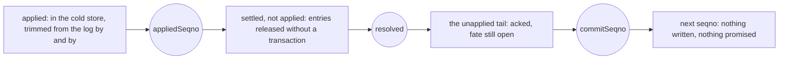
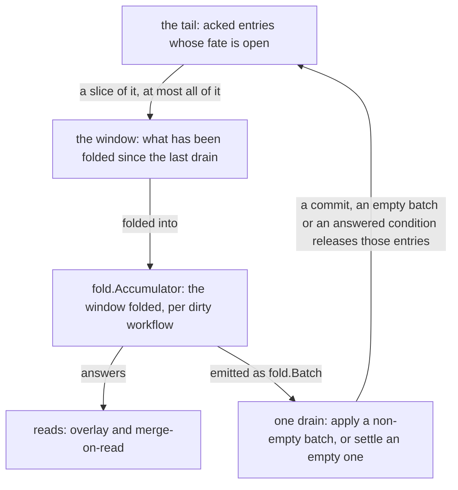

# The geometry of an acknowledged write

Suppose a caller has received success, but the workflow's mutable-state row in the cold store has
not changed yet. The write is durable in the log, visible through the layer, and waiting to be
folded into the cold store. Most of this design follows from taking that interval seriously.

This chapter names the parts of that interval, defines the handbook's terms, and states the eleven
numbered invariants with the code and suite behind each. The vocabulary, with its Russian aliases,
is in [`../../CONTEXT.md`](../../CONTEXT.md); the words for what judges the layer are in [chapter
11](11-verification.md#the-words-for-what-judges-the-layer).

---

## The words a reader arrives with

Ten familiar words mean something narrower in this book.

| word | what a Temporal or database user means | what it means here | how they are kept apart |
|---|---|---|---|
| **shard** | a storage partition | a Temporal history shard: the key range one history process owns | a store's own units are written "partition", never "shard" |
| **task** | the activity or workflow task a worker polls off a task queue | a history task: the deferred-work row a transition writes, read by a queue in the history service | nothing in the layer polls a task queue; every count and fold is over rows |
| **queue** | a task queue | one task category's stream and its reader in the history service | as above |
| **history** | a workflow's event history | the history *service*, or a history *task* | "event history" and "history service" are written out in full |
| **replay** | re-running workflow code over its event history | what a new owner does with an inherited tail | the Temporal sense is never used, only contrasted |
| **watermark** | a queue's deletion watermark | unqualified, appliedSeqno | the drain's size thresholds (`window.Watermarks` in code) and age threshold (`cycle.Config.Age`) are **triggers** everywhere else, as the metric tag calls them |
| **node** | a history node, meaning a process | a history process; separately, "the node's budget" and "the node's config" mean `waltz.Layer`, the composition that process builds | the composition is named where the difference matters; `history_node` rows of the event tree are never called nodes |
| **range** | the shard's rangeID | a task deletion range, or a task read range | `rangeID` is always one word |
| **immediate** | nothing in particular | two things, never in one sentence: an *immediate transaction* is one a store settles without a distributed coordinator; an *immediate category* is a task category keyed on task id rather than fire time | the noun after the word is always written |
| **state** | a workflow's mutable state | `cycle.State`: `running`, `halted-lost` or `halted-invariant` | the values are written in full, never "halted" or "lost"; the workflow's is always "mutable state" |

## Three positions, not two

One shard has three significant positions:

```text
appliedSeqno <= resolved <= commitSeqno < next seqno
```

`commitSeqno` is the highest entry the log has acknowledged. `appliedSeqno`, the watermark, is the
highest entry whose effects a cold-store transaction contains. `resolved` is the highest entry whose
fate is known. It parts from `appliedSeqno` only when a drain, the pass that writes accumulated
mutations to the cold store in one transaction, settles entries without a transaction in which to
advance the watermark. [The log picture](#the-log-picture) shows when.

The third position prevents two mistakes. Measuring the tail as `commitSeqno - appliedSeqno` would
charge settled entries against the tail bound, so a run of them could wedge the shard against
writers holding nothing. Advancing `appliedSeqno` without a transaction would let trim, which
deletes log entries at or below it, erase entries a new owner still needs to replay. So the tail is
`(resolved, commitSeqno]`: durable work whose outcome is still open.

The window, the mutations acknowledged since the last drain, is a slice of the tail held in memory
and folded into one summary per dirty workflow (usually one merged request, though a tombstone and
the run created behind it are two). Tail and window release at different moments, as the second
figure shows.

## The log picture

Figure: one shard's log, with the two durable positions (`commitSeqno` in the log, `appliedSeqno`
in the cold store) and the in-memory one the tail is measured from.


```mermaid
graph LR
  P["applied: in the cold store, trimmed from the log by and by"]
  A(("appliedSeqno"))
  S["settled, not applied: entries released without a transaction"]
  R(("resolved"))
  U["the unapplied tail: acked, fate still open"]
  C(("commitSeqno"))
  N["next seqno: nothing written, nothing promised"]
  P --> A
  A --> S
  S --> R
  R --> U
  U --> C
  C --> N
```

Circles are positions, boxes the stretches of log between them; seqnos grow to the right.

* At or below `commitSeqno`, an entry is durable and confirmed to its caller. Nothing lies to its
  right: the append happens before the accumulator sees the mutation, so there are no speculative
  entries.
* At or below `appliedSeqno`, an entry is in the cold store, and trim removes it from the log with
  no safety lag.
* "Settled, not applied" holds acked, dead entries a drain released without a transaction: an empty
  batch, such as an `AddHistoryTasks` with no rows, or a condition that failed at the drain and was
  answered to its caller there. Such an entry stays in the log, because an append cannot be undone
  and gap-freedom is what a seqno means. The tail bound (I10) stops counting it; the watermark stays
  put until the next committed drain moves past it. The settle is marked `tailstate.KeepWatermark`.
  An empty batch can arise in either mode. An answered condition failure arises only where a drain
  can still answer a caller (sync mode, where the window holds one mutation and the drain runs
  inside the call, or a provisional entry dropped at replay), so `wal_answered_condition_failures`
  reads zero in the shipped windowed configuration.

Figure: the window and the accumulator relative to the tail.


```mermaid
graph TD
  TAIL["the tail: acked entries whose fate is open"]
  WIN["the window: what has been folded since the last drain"]
  ACC["fold.Accumulator: the window folded, per dirty workflow"]
  RD["reads: overlay and merge-on-read"]
  DR["one drain: apply a non-empty batch, or settle an empty one"]
  TAIL -->|"a slice of it, at most all of it"| WIN
  WIN -->|"folded into"| ACC
  ACC -->|"answers"| RD
  ACC -->|"emitted as fold.Batch"| DR
  DR -->|"a commit, an empty batch or an answered condition releases those entries"| TAIL
```

The window empties when a drain starts; the tail releases those entries when the transaction
commits, or at once when the batch is empty. If the outcome cannot be read, the window is empty and
the tail is still charged, because nobody knows whether the acknowledged entries were applied. That
stalled state refuses new writes ([chapter
05](05-write-path.md#7-failed-drain--the-outcome-could-not-be-read)). Task records are not drawn:
they fold by category, not by workflow.

---

## The glossary, in reading order

The groups follow one write: the log it lands in, the window that holds it, the conditions it
carries, the reads that see it, the owner that recovers it, the task rows it may carry, and the
seams at either end. An entry that needs a later term says (below).

### The log

**Shard.** A Temporal history shard, the unit of everything here: one log, one in-memory
accumulator, one goroutine and one owner. Nothing in the layer crosses a shard boundary.
`wal.ShardID` is the raw shard number, not any store's mapping of it. A workflow's shard is a hash:
`common.WorkflowIDToHistoryShard` fingerprints `namespaceID + "_" + workflowID`, takes it modulo the
cluster's history shard count and adds one, so shard ids are 1-based. The count is written into
cluster metadata at the cluster's first start and never changes.
*Not to be confused with:* a storage partition. One shard's rows may lie in many partitions, and one
partition may hold rows of many shards.

**Mutation.** One `ExecutionStore`-level write request the log carries, and the unit of atomicity:
one mutation is one log entry. There are eight request shapes: create, update, conflict-resolve,
set, delete, delete-current, and the two task calls (*task record*, below).
*Not to be confused with:* "operation", "write", "update", all ambiguous about granularity.
"Mutation" does not imply mutable state.

The two deletions, `DeleteWorkflowExecution` and `DeleteCurrentWorkflowExecution`, travel through
the log too and become a tombstone in memory (`fold.RunTombstone`, `fold.CurrentGone`), so a read
after an acknowledged delete returns not-found before any transaction has run. Routed any other way,
a delete either waits on a drain or leaves the execution readable after the caller was told it was
gone.

**seqno (`wal.Seqno`).** An entry's position in one shard's log: a per-shard LSN the single writer
assigns itself. Seqnos are totally ordered within a shard and gap-free; both are contractual. The
first entry is `wal.FirstSeqno`, which is 1; lower numbers are reserved for a backend's own
bookkeeping.

**commitSeqno, appliedSeqno, resolved, tail.** The positions of [Three positions, not
two](#three-positions-not-two). The log's ack is cumulative: an ack of n means every entry at or
below n is durable, so a mutation is confirmed to its caller if and only if its seqno is at or below
commitSeqno (I2, from the log contract, not from code above it). appliedSeqno is persisted in each
drain's own transaction, and replay starts just above it. resolved lives only in memory; a new owner
starts it at the watermark it reads. The tail is a count and a byte total over a seqno range, not a
container: the entries are in the log, and memory holds only the window's folded form of them.
`tailstate.Tail.Entries` is its one spelling.

**Epoch (`wal.Epoch`).** The shard-ownership token every log append carries and every drain's
transaction asserts. It is Temporal's rangeID: one token, not two mechanisms. What it owes the log
(strictly greater per acquire, never zero, free to grow without an ownership change) is in [chapter
06](06-shard-lifecycle.md#2-use-the-ownership-token-temporal-already-has).

This is fencing, not locking: nobody is kept out, but the side accepting a write checks a monotonic
number inside the write's own transaction. A zombie, a former owner still running, is never told:
its append is refused and its apply fails its compare-and-swap. Why not a lease with a timer:
[chapter 13](13-designs-that-were-rejected.md#a-lease-with-a-timer).
*Not to be confused with:* term, generation, which other literature uses for the same concept.

**WAL backend.** An implementation of the log contract's five guarantees: order, fencing,
cumulative ack, gap-freedom, readback. They are all code above the log may assume, so one log can
replace another without touching an invariant ([chapter 04](04-contracts.md)). `wal/memwal`, the
one shipped, is the contract in process memory. A deployment supplies its own and runs
`wal/waltest` against it.

### The window and the drain

**Window.** The slice of the tail folded since the last drain, often all of it.
`cycle/window.Window` counts it; the tail bound (I10) reads `tailstate.Tail`, never the window.

**Fold, and the accumulator.** Fold compacts a window by merging one workflow's mutations into one
summary update, held in `fold.Accumulator`. The three rules are mechanical, with no Temporal
business logic:

* a snapshot-bearing mutation resets that run's accumulator;
* an update merges;
* a deletion turns it into a tombstone.

Mechanical rules give "the fold is correct" one meaning: the folded path leaves the cold store where
the sequential path would. Rules in Temporal's terms would be a second copy of the server's
semantics, drifting as it changes.

The unit is the workflow, not the run. One merged request can carry several runs (continue-as-new,
conflict resolution), and the current-execution facts belong to the workflow. `fold.WorkflowRecord`
holds them once ([chapter 04](04-contracts.md#the-drain-and-the-batch)), and apply registers them on
the one request `fold.Emitted.FirstOfWorkflow()` marks, so two requests of one workflow cannot
assert the same row twice or disagree.

**Collapse ratio.** Mutations in a window divided by the dirty workflows it folds to, computed by
`fold.Stats.CollapseRatio`; the series `wal_drained_mutations` and `wal_drained_workflows` are its
numerator and denominator. It describes a window, not the layer: a corpus that never touches a
workflow twice reports 1.0, which looks like a pass and measures nothing.

**Drain.** One pass of the apply cycle over a folded window. A non-empty batch is written in one
transaction and moves appliedSeqno. An empty batch writes no transaction and settles its entries in
memory without moving the watermark. A transactional drain is all-or-nothing over everything it
publishes, except event history, which may be written ahead of the transaction and must be durable
no later than it. appliedSeqno moves in that transaction because it is the witness to whether the
transaction committed: moved in a second one, it could stand still while the data was applied, and
an unknown outcome would be unresolvable.
*Not to be confused with:* stopping a layer or a node, which is `Shutdown` (it drains *and*
closes).

**Apply.** The step that turns a drain's batch into cold-store writes: one transaction carrying the
merged requests, the appliedSeqno bump and the epoch compare-and-swap. `cold.Applier` performs it;
no package of the layer implements one, and the drain hands over a `fold.Batch`, never a column. The
`apply` package sorts a drain's error into five classes (committed, refused, shard lost, invariant
violated, unknown outcome) and says what each obliges the cycle to do next.

**Cut point.** The highest seqno a partial re-drain could acknowledge after a condition failure: one
below the lowest entry answering for any diverged row. Nothing re-drains partially, so the field
(`apply.InvariantViolationError.CutSeqno`) is forensic; zero means nothing may be acknowledged
([chapter 04](04-contracts.md#applyinvariantviolationerror--the-attribution)).

### Conditions

**Condition authority.** The rule that every assertion a mutation carries is verified before the
mutation is acknowledged: the append is the ack and the answer to the caller, so a check made after
it has nobody to tell and nothing to undo. Writes carry assertions because the history service
decides from mutable state it read earlier, often from its cache; by the time it writes, the shard
may have been re-acquired or a competing start of the same workflow id may have landed. What the
store does with a failed assertion is in [chapter
12](12-the-write-before-the-layer.md#the-write-is-one-query-not-a-transaction-of-many-statements).

Assertions split in two, and none is evaluated against both the window and the cold store's row:

* *Recorded*: this mutation is the run's first in the window, so the assertion is handed to apply
  as `fold.Delegated` and rides the drain's transaction as a claim about the pre-window row; the
  data is everything folded after it.
* *Discarded*: an earlier mutation in the window already heads that run, so the assertion stands on
  the window's own state, and `fold.Accumulator.Check` evaluates it there.

A recorded assertion is evaluated twice: before the append, against the pre-window row, the last
moment the caller can be told; and in the drain, as a statement of the transaction, the only place
it is atomic with the write it guards. Sync mode skips the first check, since the drain's outcome
is what the caller is told.

The check is read-only on the accumulator. An assertion the window cannot determine is refused
(`fold.ErrRefused`) rather than admitted, and the recovery is always to drain the window and retry
the mutation at the head of a fresh one, where its assertion is recorded.
`fold.Accumulator.AddOrDrain` and `fold.Accumulator.CheckOrDrain` implement it once. It terminates
because an empty window determines every assertion, so a second refusal of the same mutation is
itself an invariant violation.

A failed discarded assertion is answered instead of the store, with the store's own error payload:
`fold.currentConflict` rebuilds a current-row failure from the window's state blob, because the
server reads its fields ([chapter 05](05-write-path.md#3-failed-write--the-condition-did-not-hold)).
A run-row failure carries only a message, a next event id and a db record version, because nothing
dispatches on it.
*Not to be confused with:* validation, precondition check. Both suggest something the store would
repeat; this answers instead of the store.

**Base row, base version.** What a recorded assertion stands on, read after the epoch is acquired,
never before.

* The *base row* is the cold store's copy of two rows: the run's row, and the workflow's
  current-execution row with its `last_write_version`. `baserow.Rows` carries both in one value,
  because whatever records an assertion needs both. An absent row arrives as a nil row, not as an
  error.
* The *base version* is the `db_record_version` of the run's row as of the last drain: what the
  folded request asserts, as distinct from the version it writes.

*Not to be confused with:* "current version", ambiguous between the two, and "cold read", which
names every read this layer makes.

**Provisional entry.** An entry whose condition had not been verified when it became durable,
because the drain carrying it answers its caller. Every write in sync mode is one. Its promise is
"this will be applied, or its caller will be told it was not", so a condition failure on it at
replay is a drop, where on any other entry it is a halt. The two cannot be told apart afterwards,
so the writer marks the entry at the append (`mutation.EncodeProvisional` rather than
`mutation.Encode`) and replay reads the bit back.
*Not to be confused with:* unconfirmed, speculative. Both describe an entry that is not acked; this
one is.

### Reads

**Overlay.** The accumulator's read interface: the cold store's base row plus what the window holds
for that workflow, gated at commitSeqno. A run read branches on `fold.RunShape` (absent, snapshot,
delta, tombstone), a current-execution read on `fold.CurrentShape` (unheld, written, gone,
guarded); nothing else.

**Merge-on-read.** One page of a task read, answered from the window and the cold store at once:
ascending, deduplicated, inside the requested range, and no longer than the caller's batch size.
The window's undrained deletion ranges are subtracted from the cold store's half only. Correctness
rests on where the page cuts: the cold store's pagination token is the plugin's own bytes, which the
layer may neither parse nor synthesise, so a page ends where a cold-store page ends or before its
first row, never halfway through it ([chapter
07](07-read-path.md#4-merge-tasks-two-ordered-sources-one-page)). A history-branch page merges the
same way, with nothing to subtract (`fold.Accumulator.HistoryPage`).
*Not to be confused with:* the overlay, which renders one run's state. Merge-on-read concatenates
two sources and paginates.

### Ownership and recovery

**Cycle.** The layer's state machine: one goroutine per (shard, epoch) that owns the accumulator,
decides when to drain, drives apply, answers reads, replays an inherited tail and runs trim beside
itself. Its three states (`cycle.State`):

* `running` (`StateRunning`): the shard is this cycle's to write, and the only state that accepts
  work.
* `halted-lost` (`StateHaltedLost`): the shard was fenced away, which is fencing working. The window
  is dropped, nothing is trimmed, and its entries stay in the log for the next owner to replay.
* `halted-invariant` (`StateHaltedInvariant`): an assertion failed in a window whose failure could
  not be pinned on one caller. This process owns a divergence: no retry and no failover.

*Not to be confused with:* worker, loop. Both hide that running a read on this goroutine is what
makes it correct.

**Replay.** What a new owner does with the tail it inherits: read `(appliedSeqno, commitSeqno]` from
the retained log, fold it into a fresh accumulator, drain. It runs on the shard's first request,
read or write, not at the acquire: that placement is the readiness gate ([chapter
06](06-shard-lifecycle.md#the-first-request-is-the-readiness-gate)).
*Not to be confused with:* recovery of one drain whose outcome was lost, which shares the rule
"read the watermark first, never re-derive from base versions"; nor with Temporal's workflow
replay. This one runs no user code and reads no event history back: it carries acknowledged
entries, with their event batches, into the cold store.

**Trim.** Lazy deletion of log entries at or below appliedSeqno. It runs beside the cycle, decided
when a drain commits rather than on a clock of its own. Its cadence, what forces it and what a
failure does are in [chapter 06](06-shard-lifecycle.md#7-trim-as-part-of-the-lifecycle).

**Backpressure.** The refusal a shard's write meets before it is appended, raised as an unwrapped
`*serviceerror.ResourceExhausted`. The `limit` tag names one of four causes:

* `entries`: the tail has reached its hard limit in entries;
* `bytes`: the tail has reached its hard limit in bytes;
* `unresolved`: the applier cannot read whether the last drain committed;
* `storage_pressure`: the WAL backend asked for no new appends until its storage recovers
  ([chapter 04](04-contracts.md#walpressuresource--the-optional-pressure-face)).

Because the refusal comes before the append, a refused mutation is provably not in the log. It is
never raised on the `ShardStore` path, since refusing a rangeID renewal would turn degradation into
a lost shard. `unresolved` also refuses reads, since the cycle has nothing to answer them from; size
and storage pressure never do. Precedence, error shape and the checks: [chapter
05](05-write-path.md#4-failed-write--backpressure-i10).
*Not to be confused with:* throttling, rate limit. Both name a pace; this is a bound on the tail.

### Tasks

**Task record.** The two mutations about a queue rather than a workflow: `AddHistoryTasks` and
`RangeCompleteHistoryTasks`. They name no run and assert nothing.

Both travel through the log, so they take effect in the order the caller wrote them. A range delete
routed any other way can leave behind rows it was meant to cover, or cover a timer created after the
caller's checkpoint, because the store's range delete works by fire-time interval, not by task id.

**Category.** A task category is one of two kinds, which decides what its rows are keyed and ranged
on: an *immediate category* (transfer, visibility, replication) on task id, a *scheduled category*
(timers) on fire time. The distinction is Temporal's, and it survives into every range the layer
carries.
*Not to be confused with:* "task write", which names only half of it.

**Deletion range (`fold.TaskRange`).** An `[InclusiveMin, ExclusiveMax)` of one task category, as
the caller's own checkpoint states it. It does not outlive the drain that carries it; see [I7
below](#i7-at-more-length).
*Not to be confused with:* an ack level, a standing per-category cursor a queue keeps above the
store. A deletion range is one caller's request.

### The seams

**Cold store.** Whatever a deployment's persistence implementation writes its rows into: the
permanent target of apply, reached only through `cold.Applier` and `cold.Watermarker`. No package of
the layer names a column, and none may name a store. `cold/memcold`, the one shipped, is Temporal's
own SQL persistence over an in-process SQLite database ([chapter
04](04-contracts.md#the-implementation-shipped-at-this-seam)). A deployment's own `cold.Store`
answers both halves and owes four things: one drain is one publication (every history row the batch
carried durable no later than it), the watermark commits inside it, the epoch is asserted first,
and the outcome comes back in `apply`'s five classes. It also bounds its own calls ([chapter
04](04-contracts.md#apply--what-a-drains-outcome-demands), and [the recovery
rule](04-contracts.md#the-recovery-rule-the-watermark-exists-for) there).
*Not to be confused with:* "main storage", "base", both overloaded.

**Wrapper.** The seam into a running server: a decorator over a base `DataStoreFactory` that takes
twelve persistence methods into the layer, refuses a thirteenth (`CompleteHistoryTask`, with
`wrapper.ErrCompleteHistoryTaskUnsupported`) and transits the rest. It wraps the base plugin rather
than forking it and may import no persistence implementation, so the store underneath is the
binary's business.
*Not to be confused with:* adapter, proxy. Both suggest translation; this one decides routing.

**Composition.** What a running server builds the layer out of: the `wal` section of the custom
datastore's options, the policy settings in the server's dynamic config, the backends they run over,
and the task-category registry a tail is decoded with. The server is the node; this is what it
builds. `waltz.Compose` is the call and `waltz.Layer` the result. Every key is in [chapter
08](08-configuration.md).

*Passthrough / intercept* (what the wrapper does) and *sync / windowed* (what window the cycle
keeps) are defined in [chapter 01](01-overview.md#what-mode-names-here).

---

## Why each distinction matters

Each distinction above has a simpler-looking alternative that fails only after a crash or a race,
so happy-path tests do not catch it.

* Acknowledging only after the cold-store write removes the interval, and with it what the layer
  exists to provide: several mutations sharing one transaction (compaction, not a latency win).
* Acknowledging before the log append is durable creates a success that neither replay nor the cold
  store can recover.
* Treating the accumulator as the source of truth loses acknowledged writes with the process.
* Giving the log and the cold store different ownership tokens leaves a gap in which an old owner
  is fenced from one and still writes the other.
* Draining a run at a time gives back the collapse the fold bought and leaves nowhere to put the
  progress mark atomically: five transactions over five runs leave four intermediate states that
  nothing in the cold store tells apart.

Fencing only at the cold store and putting the shard's own writes through the log are refused in
[chapter 13](13-designs-that-were-rejected.md).

---

## The invariants

There are eleven. The numbers are the code's own and follow build order, so read the list as an
index, not an argument. Three bind what a deployment supplies, and nothing in this tree checks them:
I4's cold-store half and I5 bind the `cold.Applier` (break either and acknowledged data is lost),
and I9 binds the `wal.Log` (break it and the log is slow, not wrong). The suites are in [chapter
11](11-verification.md).

| # | What it claims | Enforced in | How it is verified |
|---|---|---|---|
| **I1** | A mutation is one log entry, whole: no path writes its parts as separate entries. | [`mutation/mutation.go`](../../mutation/mutation.go) — exactly one request per mutation, one `oneof` in `mutation.proto`, one payload | `mutation`'s field-set and kind guards; `wrapper/intercept_test.go` asserts the record format has exactly eight shapes |
| **I2** | A mutation is confirmed to its caller ⟺ its seqno ≤ commitSeqno. No ack before durability. | [`wal/wal.go`](../../wal/wal.go) guarantee 3 (cumulative ack); the cycle answers after `Append` returns | the log conformance suite [`wal/waltest`](../../wal/waltest/waltest.go), which every implementation runs |
| **I3** | Readers see state as of commitSeqno: everything confirmed, nothing unconfirmed. | [`fold/overlay.go`](../../fold/overlay.go) and [`cycle/read.go`](../../cycle/read.go) — reads run on the cycle's own goroutine | `cycle`'s read tests over a window left undrained |
| **I4** | Fencing is end to end: the log append by the contract's fence, the cold-store write by the same epoch in the same transaction. | [`wal/wal.go`](../../wal/wal.go) (`Log.Fence`); the cold-store half is the applier's, handed the epoch on every `Apply` | `waltest`'s `FenceCutsOffLowerEpochs` (the zombie ex-owner) and `TwoWritersContendForOneShard` cover the log half; the acceptance suite's `TestAShardThatLosesItsEpochMidRun` holds `cold/memcold` to the cold-store half; a deployment's own applier is its obligation |
| **I5** | appliedSeqno is persisted atomically with each batch, and a batch it already covers is never applied twice. | the applier's own transaction: `cold.Applier` is handed a batch and `cold.Watermarker` reads back what it committed | `cycle`'s recovery tests, over an applier whose outcome the test chooses; the real one's atomicity is a deployment's obligation |
| **I6** | Log entries are self-contained state deltas, not commands: applying an entry needs nothing but the entry. | [`mutation/encode.go`](../../mutation/encode.go) — the record mirrors the persistence request field for field | the codec's field-set guard: one recorded decision per mirrored field |
| **I7** | The layer does not model an ack level: it applies the range deletions it was asked for, in the order it was asked. | [`fold/histtasks.go`](../../fold/histtasks.go), handed to the applier inside the drain's `fold.Batch` | `fold`'s task tests and the task-page corpus test; the `wal_dropped_tasks` / `wal_written_tasks` pair |
| **I8** | Compaction barriers: a snapshot resets what was accumulated for the run, an update merges, a deletion is a tombstone. | [`fold/fold.go`](../../fold/fold.go) and [`fold/merge.go`](../../fold/merge.go) | `fold`'s barrier tests, and the condition corpus, which drives a generated stream through the accumulator as a cycle does |
| **I9** | An append is one immediate write over adjacent keys of the log's own storage: no indexes, no changefeeds, no reads of other tables. | the `wal.Log` implementation a deployment supplies | nothing in this tree: a cost claim about storage this library does not own |
| **I10** | Exceeding the tail bound is degradation, not loss: what was refused is not in the log, what was acked is. | [`cycle/decide.go`](../../cycle/decide.go) (`writeRefused`) over [`cycle/tailstate`](../../cycle/tailstate/tailstate.go) | `internal/verify/guard`'s three backpressure-boundary tests; `cycle`'s edge tests over both units |
| **I11** | The epoch is the shard's own counter: one token rather than two mechanisms; it may grow without an ownership change, and the shard's own writes bypass the log. | [`wal/wal.go`](../../wal/wal.go) (`Epoch`), [`wrapper/shard_store.go`](../../wrapper/shard_store.go) | `waltest`'s `EpochGrowsWithoutChangingOwner`; `wrapper`'s `TestTheEpochTravelsWithTheWrite` (the request's rangeID is the epoch the mutation is written under) and its `ShardStore` tests (the acquire is reported before the rangeID moves) |


### I7, at more length

An *ack level* is what a category's queue derives above the store: the minimum, over its readers,
of each reader's lowest not-yet-completed key. No `ExecutionStore` call carries one, so a component
under the persistence interface cannot consult, recompute or be told it. What crosses is the
consequence, an `[InclusiveMin, ExclusiveMax)` of one category whose every row is garbage, so the
interface forces I7.

The layer carries the caller's range through the log as a mutation like any other. A task row the
range covers is not written; a task the caller wrote after the range is kept. A task created and
completed inside one window never reaches the cold store. The predicate (`fold.TaskRange.Covers`)
and the leak it prevents are in [chapter
07](07-read-path.md#5-invariant-i7--the-tasks-a-drain-does-not-write).

### I8, at more length

I8's barriers govern the run's state. Three more rules sit beside them, and the last two fail
silently when broken.

* Tasks pass through both destructive barriers: an acknowledged task ends up in the cold store or
  stays in the window. A deleted run's tasks survive as orphaned tasks on the emitted delete. A
  create, conflict-resolve or set resets everything else about the run but concatenates its
  accumulated tasks, because rewriting mutable state does not cancel work already promised.
  `fold.mergeTasks` is called from the merge, snapshot-delta and snapshot-replacing paths alike; the
  last saves the prior task map across the replacement.
* Upsert and delete of one key are resolved per key inside the accumulator, before anything is
  emitted. The store's transaction issues, per collection, every upsert and then every delete,
  whatever the registration order, so a window that emitted both for one key would lose an
  acknowledged write. `fold.mergeItems` takes the arriving mutation's deletes and then its upserts,
  so the later operation wins and the key leaves the other set. A keyed collection added to the fold
  without this compiles, passes any test that compares merged requests, and shows up as a missing
  row.
* Buffered events do not merge. Each arriving mutation's `NewBufferedEvents` blob is stripped from
  the merged request (whose own slot is always nil) and appended to a per-run list in arrival order;
  at drain time each batch becomes its own row. The batch carries its run id
  (`fold.BufferedBatch`), because a window whose merged state is a snapshot has no mutation left to
  read it from. `ClearBufferedEvents` is a barrier separate from a snapshot: it drops the batches
  accumulated before it and marks the merged request so the drain also clears the run's older
  pre-window rows in the cold store. Two batches concatenated into one row, the failure this
  prevents, is invisible to any comparison of merged requests.

### I10, at more length

The bound has two units, entries and bytes. Encoded bytes stand in for memory: the resident cost of
an unapplied tail in the heap of the process that also runs the history service. Entries bound
recovery time, since a successor decodes and folds every inherited entry. A large payload trips the
byte counter long before the entry counter; whichever trips first refuses, and the `limit` tag says
which. The bound reads the tail as it stands, so the tail overshoots it by at most one entry. The
"not loss" half, a refusal raised before the append, is guarded by `internal/verify/guard`'s
`TestTheBackpressureRefusalIsDefinitelyNotCommitted`. Why neither unit works alone, and where the
defaults come from: [chapter
14](14-where-the-defaults-came-from.md#why-the-bound-counts-entries-as-well-as-bytes). The checks,
their precedence, the error's cause and scope, and what one `%w` around it would cost: [chapter
05](05-write-path.md#4-failed-write--backpressure-i10). The keys and defaults: [chapter
08](08-configuration.md). The operator's response: [chapter
09](09-operations.md#a-a-shard-stopped-accepting-writes--backpressure-or-an-unresolved-drain).

One limit no setting removes: the bound covers an asymmetric failure, the cold store refusing writes
while the log keeps acknowledging. A log in the same database as the cold store fails with it.
Independence of the two halves is a deployment choice, made when picking the log and the cold
store, and the contract exists to allow it.

### The invariants without a number

Some claims carry no number because the code gives them none. Each is one of three things:

* a property of the system without this layer ([chapter 12](12-the-write-before-the-layer.md));
* a property of an instrument that judges the layer, such as the witness's named claims
  ([chapter 11](11-verification.md));
* a mechanism local to one chapter, stated where it is used.

Do not renumber them into the list, and do not invent I12.

---

## One name, one thing

An identifier may mean two things in two packages, but not where a reader meets both: in one
package, file or function body, or on two types a call site holds at once. The words already taken
are listed in [`CONTEXT.md`](../../CONTEXT.md)'s "One name, one thing".

---

## Summary

A write is acknowledged once it is durable in a shard's log, before the cold store holds it. Three
positions describe that interval: `commitSeqno` (acknowledged), `appliedSeqno`, the watermark
(contained in a committed drain), and `resolved` between them (settled, applied or not). The tail,
`(resolved, commitSeqno]`, is acknowledged work whose fate is open; the window is the folded,
in-memory slice of it the next drain takes.

Mutations land at gap-free seqnos under an epoch that fences any older owner. The accumulator folds
a window per workflow, answers reads, and hands one batch per drain to the cold store, whose
transaction moves the watermark. Every assertion is verified before the ack. A new owner replays
the tail above the watermark, trim deletes the log below it, and backpressure refuses a write before
its append rather than lose one after it. The eleven invariants make these rules checkable; three
bind what a deployment supplies. Chapter 03 maps the packages.

## Where this lives in the code

* [`../../CONTEXT.md`](../../CONTEXT.md) — the glossary, and "one name, one thing".
* [`../../wal/wal.go`](../../wal/wal.go) — the five contract guarantees, `Seqno`, `Epoch`, and the
  four errors a caller is expected to handle.
* [`../../mutation/mutation.go`](../../mutation/mutation.go) — the record format: the eight request
  shapes, the payload format and the provisional flag.
* [`../../fold/fold.go`](../../fold/fold.go) and [`../../fold/check.go`](../../fold/check.go) — the
  accumulator, and the recorded/discarded partition.
* [`../../fold/overlay.go`](../../fold/overlay.go) and
  [`../../fold/taskpage.go`](../../fold/taskpage.go) — the overlay's run and current-execution
  shapes, and the merge-on-read pagination rule.
* [`../../fold/merge.go`](../../fold/merge.go) — I8: per-key upsert-versus-delete resolution and
  task concatenation.
* [`../../fold/histtasks.go`](../../fold/histtasks.go) — I7: ranges and `TaskRange.Covers`.
* [`../../cycle/tailstate/tailstate.go`](../../cycle/tailstate/tailstate.go) — the tail's
  arithmetic: commit, applied, resolved, bytes and the stall.
* [`../../cycle/decide.go`](../../cycle/decide.go) — I10's refusal, its precedence and error shape.
* [`../../cycle/replay.go`](../../cycle/replay.go) — replay of the inherited tail.
* [`../../apply/failure.go`](../../apply/failure.go) — the five outcome classes, including the
  unknown one that makes "read the watermark first" the only safe recovery.
