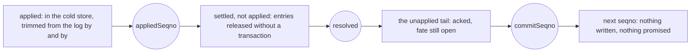
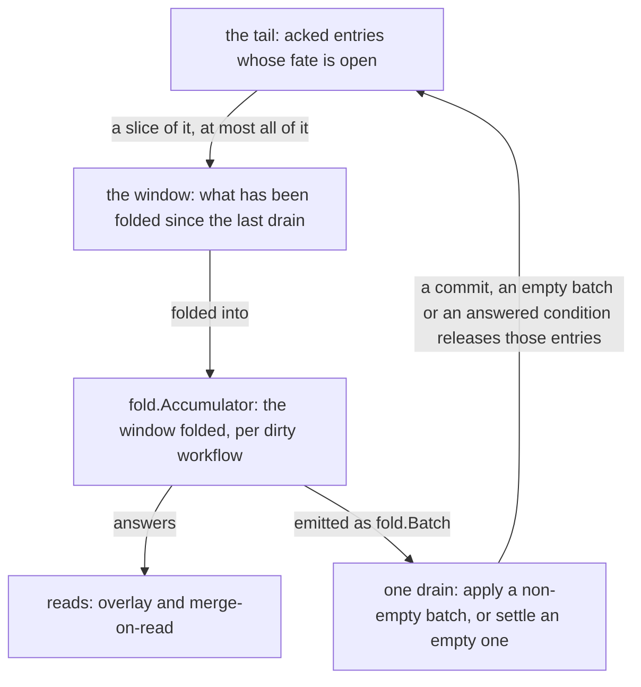

# The geometry of an acknowledged write

Suppose a caller has received success, but the workflow's mutable-state row in the cold store has
not changed yet. In the ordinary database sense the write is neither pending nor complete. It is
durable in the log, visible through the layer, and waiting to be folded into the cold store. Most
of this design follows from taking that interval seriously.

This chapter names the parts of that interval. It shows how the three positions of a shard's log
relate, defines every term the handbook uses in a narrow sense, and states the eleven numbered
invariants with the code that enforces each one and the suite that would catch a violation. The
vocabulary is the repository's own, kept with its Russian aliases in
[`../../CONTEXT.md`](../../CONTEXT.md). It is the vocabulary of the layer. The words for what judges
the layer from outside, the checker, the witness and the oracle, are in
[chapter 11](11-verification.md#the-words-for-what-judges-the-layer).

---

## The words a reader arrives with

Ten familiar words mean something narrower in this book. The table gives the usual meaning, the
meaning here, and how the two are kept apart.

| word | what a Temporal or database user means | what it means here | how they are kept apart |
|---|---|---|---|
| **shard** | a storage partition | a Temporal history shard: the key range one history process owns | a store's own units are written "partition", never "shard" |
| **task** | the activity or workflow task a worker polls off a task queue | a history task: the deferred-work row a transition writes, read by a queue inside the history service | nothing in the layer polls or matches a task queue; every count and every fold is over rows |
| **queue** | a task queue | one task category's stream and its reader in the history service | as above |
| **history** | a workflow's event history | the history *service*, or a history *task* | "event history" and "history service" are written out in full |
| **replay** | re-running workflow code over its event history | what a new owner does with an inherited tail | the Temporal sense is never used, only contrasted |
| **watermark** | a queue's deletion watermark | unqualified, appliedSeqno | the drain's size thresholds are `window.Watermarks` in code and its age threshold is `cycle.Config.Age`; all three are **triggers** everywhere else, which is also what the metric tag calls them |
| **node** | a history node, meaning a process | a history process, as everywhere in Temporal; and separately `waltz.Layer`, the composition such a process builds, which is what "the node's budget" and "the node's config" are about | the composition is called the composition where the difference matters; `history_node` rows of the event tree are never called nodes in prose |
| **range** | the shard's rangeID | a task deletion range, or a task read range | `rangeID` is always one word |
| **immediate** | nothing in particular | two different things, and they never appear in one sentence: an *immediate transaction* is one a store settles without a distributed coordinator, while an *immediate category* is a task category keyed on task id rather than on a fire time | the noun after the word is always written |
| **state** | a workflow's mutable state | `cycle.State`, one of `running`, `halted-lost`, `halted-invariant` | the three values are written in full, never "halted" or "lost"; the workflow's is always "mutable state" |

## Three positions, not two

The interval from the chapter's opening has a precise shape. One shard has three significant
positions:

```text
appliedSeqno <= resolved <= commitSeqno < next seqno
```

`commitSeqno` is the highest entry the log has acknowledged. `appliedSeqno`, the watermark, is the
highest entry whose effects a cold-store transaction contains. Between them, `resolved` is the
highest entry whose fate is known. Usually `resolved` and `appliedSeqno` move together. They
separate when a drain, the pass that writes accumulated mutations to the cold store in one
transaction, settles entries without writing anything: the entries are finished, but there was no
transaction in which to advance the persistent watermark. [The log picture](#the-log-picture) shows
the two cases that do this.

The third position prevents two mistakes. Measuring the tail as `commitSeqno - appliedSeqno` would
charge settled entries against the tail bound. Advancing `appliedSeqno` without a transaction would
let trim, which deletes log entries at or below it, erase entries a new owner still needs to
replay. So the tail is `(resolved, commitSeqno]`: durable work whose outcome is still open.

The tail is not the window. The tail is a range of log positions. The window, the mutations
acknowledged since the last drain, is a slice of that range held in memory and folded into one
summary per dirty workflow. Usually that is one merged request, though a tombstone and the run
created behind it are two. The two release at different moments, as the second figure shows.

## The log picture

The first figure shows one shard's log, left to right, with the two durable positions
(`commitSeqno` in the log, `appliedSeqno` in the cold store) and the in-memory one the tail is
measured from.


```mermaid
graph LR
  P["applied: in the cold store, trimmed from the log by and by"]
  A(("appliedSeqno"))
  S["settled, not applied: entries released without a transaction"]
  R(("resolved"))
  U["the unapplied tail: acked, fate still open"]
  C(("commitSeqno"))
  N["next seqno: nothing written, nothing promised"]
  P --> A
  A --> S
  S --> R
  R --> U
  U --> C
  C --> N
```

Circles are positions, boxes are stretches of log between them, and seqnos grow to the right.

* At or below `commitSeqno`, an entry is durable and confirmed to its caller. Nothing exists to the
  right of it, because the layer keeps no speculative entries: the append happens before the
  accumulator sees the mutation.
* At or below `appliedSeqno`, an entry is in the cold store. Trim eventually removes it from the
  log, up to the committed watermark, with no safety lag.
* The "settled, not applied" box holds entries a drain released without a transaction, such as an
  `AddHistoryTasks` with no rows. They are acked and dead.
* A condition that did not hold at the drain, and was answered to its caller there, also lands in
  that box. The entry stays in the log, because an append cannot be undone and gap-freedom is what
  a seqno means. Nobody holds it, so the tail bound (I10, below) stops counting it; otherwise a run
  of such failures would wedge the shard against writers holding nothing. The watermark does not
  move with the entry, since trim would then pass what the cold store holds. The next committed
  drain moves the watermark past it, and trim follows. Such a settle is marked
  `tailstate.KeepWatermark`. It arises only where a drain can still answer a caller (sync mode's
  one-mutation window, and a provisional entry, defined below, dropped at replay), which is why
  `wal_answered_condition_failures` reads zero in the shipped windowed configuration.

The second figure places the window and the accumulator relative to the tail.


```mermaid
graph TD
  TAIL["the tail: acked entries whose fate is open"]
  WIN["the window: what has been folded since the last drain"]
  ACC["fold.Accumulator: the window folded, per dirty workflow"]
  RD["reads: overlay and merge-on-read"]
  DR["one drain: apply a non-empty batch, or settle an empty one"]
  TAIL -->|"a slice of it, at most all of it"| WIN
  WIN -->|"folded into"| ACC
  ACC -->|"answers"| RD
  ACC -->|"emitted as fold.Batch"| DR
  DR -->|"a commit, an empty batch or an answered condition releases those entries"| TAIL
```

The accumulator answers reads (the overlay and merge-on-read, both in the glossary below) and is
also what a drain hands to apply. The window empties when a
drain starts; the tail releases those entries when the transaction commits, or at once when the
batch is empty. If the outcome cannot be read, the window is empty and the tail is still charged.
That is exactly what the process knows: those entries were acknowledged, and nobody here knows
whether they were applied. That stalled state refuses new writes
([chapter 05](05-write-path.md#7-failed-drain--the-outcome-could-not-be-read)). Task records are
not drawn: they fold by category, not by workflow.

---

## The glossary, in reading order

Most entries use only terms above them; where one needs a later term, it says (below). The groups
follow one write: the log it lands in, the
window that holds it, the conditions it carries, the reads that see it, the owner that recovers it,
the task rows it may carry, and the seams at either end.

### The log

**Shard.** A Temporal history shard, the unit of everything here. One shard has one log, one
in-memory accumulator, one goroutine and one owner. Nothing in the layer crosses a shard boundary.
`wal.ShardID` is the identifier: the raw shard number, not any store's own mapping of it. A
workflow's shard is a hash and nothing else. `common.WorkflowIDToHistoryShard` fingerprints
`namespaceID + "_" + workflowID`, takes it modulo the cluster's history shard count and adds one.
So shard ids are 1-based. The count is written into cluster metadata at the cluster's first start
and does not change afterwards.
*Not to be confused with:* a storage partition, which is how a table is physically laid out. One
shard's rows may lie in any number of partitions, and one partition may hold rows of many shards.

**Mutation.** One `ExecutionStore`-level write request the log carries, and the unit of atomicity:
one mutation is one log entry. There are eight request shapes: create, update, conflict-resolve,
set, delete, delete-current, and the two task calls (*task record*, below).
*Not to be confused with:* "operation", "write", "update", which are all ambiguous about
granularity. "Mutation" does not imply mutable state.

The two deletions, `DeleteWorkflowExecution` and `DeleteCurrentWorkflowExecution`, travel through
the log too. A deletion must take effect after the writes it removes, and the layer may still hold
acknowledged writes for the same run in memory (the *window*, below). Sending the delete straight
to the cold store would mean draining the window first, with the caller waiting on that
transaction, which is the cost the layer exists to avoid. Performing it later would leave the
execution readable after the caller was told it was gone. So a deletion becomes a tombstone in
memory (`fold.RunTombstone`, `fold.CurrentGone`): a read after an acknowledged delete returns
not-found, and no transaction has run.

**seqno (`wal.Seqno`).** An entry's position in one shard's log: a per-shard LSN the single writer
assigns itself. Seqnos are totally ordered within a shard and have no gaps; both are contractual.
The first entry sits at `wal.FirstSeqno`, which is 1. Lower numbers are reserved for a backend's
own bookkeeping.

**commitSeqno.** The highest seqno the log has durably acknowledged. The acknowledgement is
cumulative: an ack of n means every entry at or below n is durable. A mutation is confirmed to its
caller if and only if its seqno is at or below commitSeqno. That is invariant I2, and it comes from
the log contract rather than from code above it.

**appliedSeqno.** The highest seqno whose effects are in the cold store. Each drain (below)
persists it atomically, in that drain's own transaction. Replay (below) starts just above it.

**Watermark.** Unqualified, appliedSeqno; see [the table above](#the-words-a-reader-arrives-with).

**resolved.** The highest seqno whose fate is settled, whether or not the cold store holds it:
appliedSeqno, plus anything above it that a drain released without a transaction
([Three positions, not two](#three-positions-not-two)). The tail is
measured from it. It lives only in memory, and a new owner starts it at the watermark it reads.

**Tail.** The entries that are durable in the log and not yet settled: `(resolved, commitSeqno]`.
It is a count and a byte total over a seqno range, not a container. The entries are in the log;
memory holds only the window's (below) folded form of them. `tailstate.Tail.Entries` is the one
spelling of it. Why it is measured from `resolved` is
[Three positions, not two](#three-positions-not-two).

**Epoch (`wal.Epoch`).** The shard-ownership token every log append carries and every drain's (below)
transaction asserts. It is Temporal's rangeID: one token, not two mechanisms. What it owes the log
(strictly greater per acquire, never zero, free to grow without an ownership change) is
[chapter 06](06-shard-lifecycle.md#2-use-the-ownership-token-temporal-already-has).

This is fencing, not locking. A lock keeps a second claimant out, so something must track and
revoke it. A fence keeps nobody out: it is a monotonic number checked by the side that accepts the
write, inside the write's own transaction. A zombie, a former owner still running and still believing the shard is its own, is never told it
is one. Its append is
refused and its apply transaction fails its compare-and-swap, so there is nothing to roll back, and
on the happy path the check rides a transaction that had to happen anyway. Why not a lease with a
timer: [chapter 13](13-designs-that-were-rejected.md#a-lease-with-a-timer).
*Not to be confused with:* term, generation. Other literature uses them for the same concept; this
book does not.

**WAL backend.** An implementation of the log contract: order, fencing, cumulative ack,
gap-freedom, readback. Those five guarantees are all that code above the log may assume, so one log
can replace another without touching an invariant ([chapter 04](04-contracts.md)). `wal/memwal`
is the one this library ships: the contract in process memory, a real implementation that refuses
a stale epoch, keeps seqnos gapless and survives a trim, and the log everything above is tested on.
A deployment supplies its own and runs `wal/waltest` against it.

### The window and the drain

**Window.** The acknowledged mutations folded since the last drain. It is a slice of the tail,
and in the general case all of it. Fold's rule is stated over a window: for each run, the
assertion that reaches the drain is the one carried by the run's *first* mutation in the window,
and the data is everything folded after it (*condition authority*, below). `cycle/window.Window`
counts what has been folded since the last drain. Its bytes are not the tail's.

**Fold, and the accumulator.** Fold compacts a window by merging one workflow's mutations into one
summary update. `fold.Accumulator` holds the result. The rules are mechanical, with no Temporal
business logic, and there are three:

* a snapshot-bearing mutation resets that run's accumulator;
* an update merges;
* a deletion turns it into a tombstone.

Two properties of that shape:

* The unit is the workflow, not the run. One merged request can carry several runs
  (continue-as-new, conflict resolution), and the current-execution facts belong to the workflow.
  `fold.WorkflowRecord` holds them once: the head-of-window assertion on the current row, the row
  the window would write, and whether the window's net effect removed it. Apply registers those
  assertions on the one request `fold.Emitted.FirstOfWorkflow()` marks, so two requests of one
  workflow cannot assert the same row twice or disagree. It is also why the collapse ratio's
  denominator counts workflows.
* The rules are mechanical because a rule in Temporal's terms would be a second copy of the
  server's semantics, drifting as the server changes. Mechanical rules also give "the fold is
  correct" one meaning: the folded path leaves the cold store where the sequential path would.

**Collapse ratio.** Mutations in a window divided by the dirty workflows it folds to.
`fold.Stats.CollapseRatio` computes it, and the metric series `wal_drained_mutations` and
`wal_drained_workflows` are its numerator and denominator. It describes a window, not the layer. A
corpus that never touches a workflow twice reports 1.0, which looks like a pass and measures
nothing.

**Drain.** One pass of the apply cycle over a folded window. A non-empty batch is written in one
transaction and moves appliedSeqno. An empty batch writes no transaction and settles its entries in
memory without moving the watermark. A transactional drain is all-or-nothing over everything it
publishes, except event history, which may be written ahead of the transaction and must be durable
no later than it. appliedSeqno is the witness to whether the transaction committed.
*Not to be confused with:* stopping a layer or a node, which is `Shutdown` (it drains *and*
closes).

**Apply.** The step that turns folded updates into cold-store writes: one transaction carrying the
merged requests, the appliedSeqno bump and the epoch compare-and-swap, with the batch's event
history durable in it or before it. `cold.Applier` performs it, and no package of the layer
implements one: the drain hands over a `fold.Batch`, never a column. The layer's part is the
`apply` package, which sorts a drain's error into five classes (committed, refused, shard lost,
invariant violated, unknown outcome) and says what each obliges the cycle to do next.

**Cut point.** The highest seqno a partial re-drain would be entitled to acknowledge after a
condition failure: one below the lowest entry answering for any diverged row. Applying anything
above it would leave entries applied above any watermark the drain could set. Nothing re-drains
partially today, so the field (`apply.InvariantViolationError.CutSeqno`) is forensic. Zero there
means nothing may be acknowledged at all.

### Conditions

**Condition authority.** The rule that every assertion a mutation carries is verified before the
mutation is acknowledged. The append is the ack and the ack is the answer to the caller, so a check
made after it has nobody to tell and nothing to undo.

Writes carry assertions because a state transition is read-decide-write. The history service
computes the next state from mutable state it read earlier, often from its cache. By the time it
writes, the shard may have been re-acquired, the state rebuilt, or a competing start of the same
workflow id landed. So every mutable-state write asserts something about the world the decision
was made in. What the store does with a failed one is
[chapter 12](12-the-write-before-the-layer.md#the-write-is-one-query-not-a-transaction-of-many-statements).

Assertions split in two, and no assertion is evaluated against both the window and the cold store's
row:

* *Recorded*: this mutation heads its run in the window, so the assertion is handed to apply as
  `fold.Delegated` and rides the drain's transaction as a claim about the pre-window row.
* *Discarded*: an earlier mutation in the window already heads that run, so the assertion stands on
  the window's own state, and `fold.Accumulator.Check` evaluates it there.

A recorded assertion is still evaluated twice. Before the append, the cycle checks it against the
pre-window row, the last moment the caller can be told. In the drain, it is a statement of the
transaction, the only place it is atomic with the write it guards. The first is for the caller, the
second for correctness. Sync mode, where the window holds one mutation and the drain runs inside
the call, skips the first, since the drain's outcome is what the caller is told.

The check is read-only on the accumulator. An assertion the window cannot determine is refused
(`fold.ErrRefused`) rather than admitted. The recovery is always the same: drain the window, then
retry the mutation at the head of a fresh one, where its assertion is recorded. `fold.Accumulator.AddOrDrain`
and `fold.Accumulator.CheckOrDrain` implement that recovery once. It terminates because an empty
window determines every assertion, so a second refusal of the same mutation is itself an invariant
violation.

A discarded assertion that fails is answered instead of the store, so the caller gets the store's
own error payload, not just the right Go type. `fold.currentConflict` rebuilds it from the window's
state blob, because the server reads the fields of a current-row failure
([chapter 05](05-write-path.md#3-failed-write--the-condition-did-not-hold)). A run-row failure
carries much less, a message, a next event id and a db record version, because nothing dispatches
on it.
*Not to be confused with:* validation, precondition check. Both suggest something the store would
repeat; this answers instead of the store.

**Base row, base version.** What a delegated assertion stands on. Both are read after the epoch is
acquired, never before.

* The *base row* is the cold store's own copy of two rows: the run's row, and the workflow's
  current-execution row with its `last_write_version`. `baserow.Rows` carries both reads in one
  value, because whatever delegates an assertion needs both. A row that is absent arrives as a nil
  row, not as an error.
* The *base version* is the `db_record_version` of the run's row as of the last drain: what the
  folded request asserts, as distinct from the version it writes.

*Not to be confused with:* "current version", which is ambiguous between the two, and "cold read",
which names every read this layer makes.

**Provisional entry.** An entry whose condition had not been verified when it became durable,
because the drain carrying it is what answers its caller. Every write in sync mode is one. Its
promise is "this will be applied, or its caller will be told it was not". So a condition failure on
it at replay is a drop, where the same failure on any other entry is a halt. The two classes cannot
be told apart afterwards, so the writer marks the entry at the append (`mutation.EncodeProvisional`
rather than `mutation.Encode`) and replay reads the bit back.
*Not to be confused with:* unconfirmed, speculative. Both describe an entry that is not acked; this
one is.

### Reads

**Overlay.** The read interface of the accumulator. A read is the cold store's base row plus what
the window holds for that workflow, gated at commitSeqno. A run read branches on `fold.RunShape`
(absent, snapshot, delta, tombstone). A current-execution read branches on `fold.CurrentShape`
(unheld, written, gone, guarded). Those two are all of it.

**Merge-on-read.** One page of a task read, answered from the window and the cold store at once:
ascending, deduplicated, inside the requested range, and no longer than the caller's batch size.
The window's undrained deletion ranges are subtracted from the cold store's half only; the window's
half was swept as each range folded in. The sources are disjoint by construction, so the dedup is a
safety net. Correctness rests on where the page may cut: at the end of a base page or below its
first row, never inside one. The cold store's pagination token is the plugin's own bytes, which the
layer may neither parse nor synthesise, so a half-emitted base page would lose rows on one side and
duplicate them on the other. A history-branch page merges the same way, with nothing to subtract
(`fold.Accumulator.HistoryPage`).
*Not to be confused with:* the overlay, which renders one run's state. Merge-on-read concatenates
two sources and paginates.

### Ownership and recovery

**Cycle.** The layer's state machine: one goroutine per (shard, epoch). It owns the accumulator,
decides when to drain, drives apply, answers reads and task pages from the window, replays an
inherited tail and runs trim beside itself. Its three states (`cycle.State`) are decisions, not
defensive branches:

* `running` (`StateRunning`): the shard is this cycle's to write. It is the only state that accepts
  work.
* `halted-lost` (`StateHaltedLost`): the shard was fenced away, which is fencing working. The window
  is dropped, nothing is trimmed, and its entries stay in the log for the next owner to replay.
* `halted-invariant` (`StateHaltedInvariant`): an assertion failed in a window whose failure could
  not be pinned on one caller. This process owns a divergence: no retry and no failover.

*Not to be confused with:* worker, loop. Both understate that running a read on this goroutine is
what makes the read correct.

**Replay.** What a new owner does with the tail it inherits: read `(appliedSeqno, commitSeqno]` from
the retained log, fold it into a fresh accumulator, drain. It runs on the shard's first request,
read or write, not at the acquire, and that placement is the readiness gate. Why, and the rules it
applies entry by entry, are [chapter 06](06-shard-lifecycle.md#the-first-request-is-the-readiness-gate).

*Not to be confused with:* recovery of one drain whose outcome was lost, which shares the rule
"read the watermark first, never re-derive from base versions". Nor with Temporal's workflow
replay, which re-executes workflow code. This replay runs no user code, reads no event history back
from the store, and carries acknowledged entries, with their event batches, into the cold store.

**Trim.** Lazy deletion of log entries at or below appliedSeqno. It runs beside the cycle, not in
it, and is decided when a drain commits rather than on a clock of its own. Its cadence, what forces it and what a failure does are
[chapter 06](06-shard-lifecycle.md#7-trim-as-part-of-the-lifecycle).

**Backpressure.** The refusal a shard's write meets before it is appended, raised as an unwrapped
`*serviceerror.ResourceExhausted`. The `limit` tag says which of four causes raised it:

* `entries`: the tail has reached its hard limit in entries;
* `bytes`: the tail has reached its hard limit in bytes;
* `unresolved`: the applier cannot read whether the last drain committed;
* `storage_pressure`: the WAL backend asked for no new appends until its storage recovers
  ([chapter 04](04-contracts.md#walpressuresource--the-optional-pressure-face)).

Because the refusal comes before the append, a refused mutation is provably not in the log. It is
never raised on the `ShardStore` path, since refusing a rangeID renewal would turn degradation into
a lost shard. Reads are never refused for size or storage pressure, but `unresolved` refuses them
too: a cycle that cannot say what its last drain did has nothing to answer a read from. Precedence,
error shape and the two checks are in
[chapter 05](05-write-path.md#4-failed-write--backpressure-i10).
*Not to be confused with:* throttling, rate limit. Both name a pace; this is a bound on the tail.

### Tasks

**Task record.** The two mutations about a queue rather than a workflow: `AddHistoryTasks` and
`RangeCompleteHistoryTasks`. They name no run and assert nothing.

Both travel through the log, so they take effect in the order the caller wrote them. Routed
differently, the delete fails either way. Sent straight to the cold store, it runs before the drain
writes the rows it was meant to cover and leaves them behind. Deferred on its own, it covers a
timer created after the caller's checkpoint, because the store's range delete works by fire-time
interval, not by task id.

**Category.** Every task belongs to a category, and a category is one of two kinds, which decides
what its rows are keyed and ranged on. An *immediate category* (transfer, visibility, replication)
is keyed on task id. A *scheduled category* (timers) is keyed on fire time. The distinction is
Temporal's, and it survives into every range the layer carries.
*Not to be confused with:* "task write", which names only half of it.

**Deletion range (`fold.TaskRange`).** An `[InclusiveMin, ExclusiveMax)` of one task category, as
the caller's own checkpoint states it. It does not outlive the drain that carries it. What that
means for the tasks on either side of it is [I7 below](#i7-at-more-length).
*Not to be confused with:* an ack level, a standing per-category cursor a queue keeps above the
store. A deletion range is one caller's request.

### The seams

**Cold store.** Whatever a deployment's persistence implementation writes its rows into: the
permanent target of apply, reached only through `cold.Applier` and `cold.Watermarker`. No package of
the layer names a column, and none may name a store. `cold/memcold` is the one implementation shipped
here (`internal/verify/coldtest` is the double beside it): Temporal's own SQL persistence, embedded
whole, over a SQLite database that lives in this process and dies with it. It is a real store, and
Temporal's own persistence suites judge it as they judge a plugin. A deployment supplies its own as
one `cold.Store` answering both halves of the seam. It owes four things: one drain is one
publication (with every history row the batch carried durable no later than it), the watermark
commits inside it, the epoch is asserted first, and the outcome comes back in `apply`'s five
classes. It also bounds its own calls. Details:
[chapter 04](04-contracts.md#apply--what-a-drains-outcome-demands) and
[the recovery rule](04-contracts.md#the-recovery-rule-the-watermark-exists-for) there.
*Not to be confused with:* "main storage", "base". Both are overloaded.

**Wrapper.** The seam into a running server: a decorator over a base `DataStoreFactory` that takes
twelve persistence methods into the layer, refuses a thirteenth (`CompleteHistoryTask`, with
`wrapper.ErrCompleteHistoryTaskUnsupported`) and transits the rest. It wraps the base plugin rather
than forking it, and it may import no persistence implementation, so the store underneath is the
binary's business.
*Not to be confused with:* adapter, proxy. Both suggest translation; this one decides routing.

**Composition.** What a running server builds the layer out of: the `wal` section of the custom
datastore's options, the policy settings in the server's dynamic config, the backends they run over,
and the task-category registry a tail is decoded with. It is a composition, not a cluster member:
the server is the node, and this is what it builds. `waltz.Compose` is the call and `waltz.Layer`
is the result. Every key is in [chapter 08](08-configuration.md).

Some terms have their home elsewhere:

* *passthrough / intercept* is what the wrapper does, and *sync / windowed* is what window the cycle
  keeps. Both are [chapter 01](01-overview.md#what-mode-names-here); the key is in
  [chapter 08](08-configuration.md).
* The *checker*, the *witness* and the *oracle* judge the layer rather than being part of it:
  [chapter 11](11-verification.md#the-words-for-what-judges-the-layer).

---

## Why each distinction matters

Each distinction above has a simpler-looking alternative. The simplifications fail only after a
crash or a race, so tests on the happy path do not catch them.

* Acknowledging only after the cold-store write removes the interval, but puts every caller back
  behind that write and removes the decoupling that lets several mutations share one transaction.
  That compaction, not a latency win, is the benefit this layer exists to provide.
* Acknowledging before the log append is durable creates a success that neither replay nor the cold
  store can recover.
* Treating the accumulator as the source of truth loses acknowledged writes with the process.
* Checking a discarded condition during a later drain answers a caller that has gone. Checking it
  before the append makes refusal definitive.
* Letting task inserts bypass the log while range deletes use it changes their relative order, and
  can either resurrect a covered task or delete a later one.
* Giving the log and the cold store different ownership tokens leaves a gap in which an old owner
  is fenced from one and still writes the other.
* Draining a run at a time rather than a window at a time gives back the collapse the fold bought
  and leaves nowhere to put the progress mark atomically. Five transactions over five runs leave
  four intermediate states, and nothing in the cold store tells them apart.
* Moving appliedSeqno in a second transaction makes an unknown outcome unresolvable. Recovery asks
  one question, "did the last drain commit?", and answers it by reading the watermark back. Split
  across two transactions, the mark can stand still while the data is already applied.

Two other simplifications, fencing only at the cold store and putting the shard's own writes
through the log, are refused in [chapter 13](13-designs-that-were-rejected.md).

The numbered invariants below turn that reasoning into claims that code and tests can enforce.

---

## The invariants

There are eleven, and the numbers are the code's own: most appear in the code and the tests. They
follow the order the layer was built in, so read the list as an index, not an argument. Three are
obligations on what a deployment supplies, which nothing in this tree checks: I4's cold-store half
and I5 bind the `cold.Applier` (break either and acknowledged data is lost), and I9 binds the
`wal.Log` (break it and the log is slow, not wrong). The suites in the last column are described in
[chapter 11](11-verification.md).

| # | What it claims | Enforced in | How it is verified |
|---|---|---|---|
| **I1** | A mutation is one log entry, whole. No path writes parts of a mutation as separate entries. | [`mutation/mutation.go`](../../mutation/mutation.go) — exactly one request per mutation, one `oneof` in `mutation.proto`, one payload | `mutation`'s field-set and kind guards; `wrapper/intercept_test.go` asserts the record format has exactly eight shapes |
| **I2** | A mutation is confirmed to its caller ⟺ its seqno ≤ commitSeqno. No ack before durability. | [`wal/wal.go`](../../wal/wal.go) guarantee 3 (cumulative ack); the cycle answers after `Append` returns | the log conformance suite [`wal/waltest`](../../wal/waltest/waltest.go), which every implementation runs |
| **I3** | Readers see state as of commitSeqno: everything confirmed, nothing unconfirmed. | [`fold/overlay.go`](../../fold/overlay.go) and [`cycle/read.go`](../../cycle/read.go) — reads run on the cycle's own goroutine | `cycle`'s read tests over a window that is deliberately left undrained |
| **I4** | Fencing is end to end: the log append is protected by the contract's fence semantics, and the cold-store write by the same epoch in the same transaction. | [`wal/wal.go`](../../wal/wal.go) (`Log.Fence`); the cold-store half is the applier's, which is handed the epoch on every `Apply` | `waltest`'s `FenceCutsOffLowerEpochs` (the zombie ex-owner) and `TwoWritersContendForOneShard` cover the log half; the acceptance suite's `TestAShardThatLosesItsEpochMidRun` holds `cold/memcold` to the cold-store half, and a deployment's own applier is its obligation, which nothing here judges |
| **I5** | appliedSeqno is persisted atomically with each batch, and a batch it already covers is never applied twice. | the applier's own transaction: `cold.Applier` is handed a batch and `cold.Watermarker` reads back what it committed | `cycle`'s recovery tests, over an applier whose outcome the test chooses; that the real one is atomic is a deployment's obligation |
| **I6** | Log entries are self-contained state deltas, not commands: applying an entry needs nothing but the entry. | [`mutation/encode.go`](../../mutation/encode.go) — the record mirrors the persistence request field for field | the codec's field-set guard: one recorded decision per mirrored field |
| **I7** | The layer does not model an ack level: it applies the range deletions it was asked for, in the order it was asked. | [`fold/histtasks.go`](../../fold/histtasks.go), handed to the applier inside the drain's `fold.Batch` | `fold`'s task tests and the task-page corpus test; the `wal_dropped_tasks` / `wal_written_tasks` pair |
| **I8** | Compaction barriers: a snapshot resets what was accumulated for the run, an update merges, a deletion is a tombstone. | [`fold/fold.go`](../../fold/fold.go) and [`fold/merge.go`](../../fold/merge.go) | `fold`'s barrier tests, and the condition corpus that drives a generated stream through the accumulator the way a cycle does |
| **I9** | An append is one immediate write over adjacent keys of the log's own storage: no indexes, no changefeeds, no reads of other tables. | the `wal.Log` implementation, whichever one a deployment supplies | nothing in this tree: it is a cost claim about storage this library does not own, and a backend that breaks it is slow rather than wrong |
| **I10** | Exceeding the tail bound is degradation, not loss: what was refused is not in the log, what was acked is. | [`cycle/decide.go`](../../cycle/decide.go) (`writeRefused`) over [`cycle/tailstate`](../../cycle/tailstate/tailstate.go) | `internal/verify/guard`'s three backpressure-boundary tests; `cycle`'s edge tests over both units |
| **I11** | The epoch is the shard's own counter: one token rather than two mechanisms; it may grow without an ownership change, and the shard's own writes bypass the log. | [`wal/wal.go`](../../wal/wal.go) (`Epoch`), [`wrapper/shard_store.go`](../../wrapper/shard_store.go) | `waltest`'s `EpochGrowsWithoutChangingOwner`; `wrapper`'s `TestTheEpochTravelsWithTheWrite`, which asserts the request's rangeID is the epoch the mutation is written under, and its `ShardStore` tests, which assert the acquire is reported before the rangeID moves |


### I7, at more length

An *ack level* is what a category's queue derives above the store. A category can have several
readers, and the meaningful "everything below this is done" is the minimum, over all of them, of each
reader's lowest not-yet-completed key. It lives above the persistence interface, and no
`ExecutionStore` call carries one, so a component under that boundary cannot consult it, recompute
it or be told it. What crosses is the consequence: an `[InclusiveMin, ExclusiveMax)` of one
category, which already says every row in that range is garbage. So the interface forces I7.

The rule, then: the layer carries the caller's range through the log as a mutation like any other,
and a task row the range covers is not written, while a task the caller wrote after the range is
kept. A task created and completed inside one window never reaches the cold store. The mechanism,
its predicate and the leak it prevents are
[chapter 07](07-read-path.md#5-invariant-i7--the-tasks-a-drain-does-not-write).

### I8, at more length

I8's barriers govern the run's state. Three more rules sit beside them. A reader would otherwise
have to infer each from a merged request, and the last two fail silently when they are not known.

* Tasks are exempt from both destructive barriers, not just the tombstone. A task the layer has
  acknowledged must end up either in the cold store or still in the window, so neither barrier may
  drop one. A deleted run's tasks survive as orphaned tasks on the emitted delete. A create,
  conflict-resolve or set resets everything else about the run and concatenates its accumulated
  tasks through the barrier, because tasks are queue records, and rewriting mutable state does not
  cancel work already promised. `fold.mergeTasks` is called from the merge, snapshot-delta and
  snapshot-replacing paths alike; the last saves the prior task map across the replacement.
* Upsert and delete of one key are resolved inside the accumulator, per key, before anything is
  emitted. The store's transaction does not issue statements in registration order: for each
  collection it issues every upsert, then every delete. A window that emitted both for one key
  would have them applied in that order whatever the caller meant, so a key re-upserted after a
  delete would be written and then deleted again, and an acknowledged write would be gone.
  `fold.mergeItems` takes the arriving mutation's deletes and then its upserts, so across mutations
  the later operation wins and the key leaves the other set. A keyed collection added to the fold
  without this resolution compiles, passes any test that compares merged requests, and shows up as
  a missing row.
* Buffered events do not merge, which is a fourth barrier rule beside I8's three. Each arriving
  mutation's `NewBufferedEvents` blob is stripped from the merged request and appended to a per-run
  list in arrival order, so the merged request's own slot is always nil. At drain time each
  accumulated batch becomes its own row. The batch carries its run id (`fold.BufferedBatch`) rather
  than reading it off the request, because a window whose merged state is a snapshot has no mutation
  left to read it from. `ClearBufferedEvents` is a separate barrier from a snapshot: it drops the
  batches accumulated before it and marks the merged request so the drain clears the run's
  pre-window rows in the cold store, because the window and the store hold different generations of
  the same rows. The failure this rule prevents, two batches concatenated into one row, is invisible
  to any comparison of merged requests.

### I10, at more length

The bound has two units, entries and bytes, and both come off `tailstate.Tail`, not off the window.
They measure different costs. Bytes, encoded, stand in for memory: the resident cost of an
unapplied tail in the heap of the process that also runs the history service. Entries bound
recovery time, since a successor must decode and fold every inherited entry, and that work is per
entry. Whichever trips first raises the refusal, and the `limit` tag says which. Why neither unit
works alone, and where the defaults come from, is
[chapter 14](14-where-the-defaults-came-from.md#why-the-bound-counts-entries-as-well-as-bytes).

* Entries going up means the applier is behind and a failover would take longer than it should.
* Bytes going up means the same, or a workflow near the server's own blob limits: a large payload
  trips the byte counter long before the entry counter.

Three properties matter more than the numbers:

* The refusal is raised before the append. That is the "not loss" half of the claim, and
  `internal/verify/guard`'s `TestTheBackpressureRefusalIsDefinitelyNotCommitted` guards it.
* The bound reads the tail as it stands, so the tail overshoots it by at most one entry.
* A stalled applier is refused as such, ahead of the size check.

How both are checked, the error's cause and scope, and what one `%w` around it would cost, are in
[chapter 05](05-write-path.md#4-failed-write--backpressure-i10). The keys and defaults are in
[chapter 08](08-configuration.md), and the operator's response is
[chapter 09](09-operations.md#a-a-shard-stopped-accepting-writes--backpressure-or-an-unresolved-drain).

The claim has one boundary that no setting moves. The bound is for an asymmetric failure, the cold
store refusing writes while the log keeps acknowledging. A log in the same database as the cold
store fails with it. The bound limits the consequences of a cold-store degradation; it does not
make the two halves independent. Independence is a deployment choice, the main one made when
picking the log and the cold store, and the contract exists to allow it.

### The invariants without a number

Some claims in this handbook carry no number, because they have no such name in the code. Each is
one of three things:

* a property of the system without this layer ([chapter 12](12-the-write-before-the-layer.md));
* a property of an instrument that judges the layer, such as the witness's named claims
  ([chapter 11](11-verification.md));
* a mechanism local to one chapter, stated where it is used.

Do not renumber them into the list, and do not invent I12.

---

## One name, one thing

This section is for whoever adds a name to the tree. The glossary governs the design's vocabulary,
not the identifiers, and identifiers are where words multiplied. Two rules apply:

* A name may mean two things in two packages. `waltz.Config`, `cycle.Config` and the configuration
  type of whatever store sits underneath are not a defect: the package name disambiguates. Do not
  rename across this line.
* A name may not mean two things a reader meets together: in one package, one file, one function
  body, or on two types a call site holds at once. There the package name stops disambiguating and
  the reader has to.

Two shapes are worse than a repeated word:

* One name, two return types. `Tail.Stalled` answers with the stall itself, while the same question
  on `tailstate.Mirror` (the copy of those counters that goroutines other than the loop read)
  answers with a seqno. So the mirror's method is `StalledAt`: a position says so in its name.
* One question, two answers that disagree. `CurrentView.Held` and `workflowAcc.assertsCurrent` both
  ask "does the window hold this row", and they correctly differ on a guarded current row, one the
  window has only `DeleteCurrentWorkflowExecution` guards over with no write above them
  (`fold.CurrentGuarded`). One is a read question and the other a partition question, and neither
  name said which.

Each half of such a pair is right on its own, so review does not catch it. These words are already
taken:

| word | it is | it is not |
|---|---|---|
| **Registry** | `cycle.Manager`, the shards this node holds | `waltz.Registry`, which is task categories and is written qualified: the task-category registry |
| **Held** | a read: the window has something to say about this row | carrying a head assertion, which is `asserts*` |
| **Policy** | `cycle.Policy`, a source of `Config` read at the decision | `WAL.StaticConfig()`, which is a `Config` value |
| **Take** | `Window.Take`, which *empties* the window | building a read's view, which is `takeView` |
| **ranges** | undrained range deletes (`fold.Accumulator.ranges`) | task rows, which are `addedTasks` |

The list is open: a name goes there when it turns out to have been two. No test checks it, because
a spelling check cannot see either of the two shapes above.

---

## Summary

A write in this layer is acknowledged once it is durable in a shard's log, before the cold store
holds it. That interval is described by three positions: `commitSeqno` (what the log has
acknowledged), `appliedSeqno`, the watermark (what a committed drain contains), and `resolved`
between them (what is settled, applied or not). The tail, `(resolved, commitSeqno]`, is the
acknowledged work whose fate is open. The window is the in-memory, folded slice of it that the next
drain takes.

Mutations land in the log at gap-free seqnos under an epoch that fences any older owner. The
accumulator folds a window per workflow, answers reads, and hands one batch per drain to the cold
store, whose transaction moves the watermark. Every assertion is verified before the ack. A new
owner replays the tail above the watermark, trim deletes the log below it, and backpressure refuses
a write before its append rather than lose one after it. The eleven invariants state these rules as
checkable claims; three bind what a deployment supplies. Chapter 03 maps the packages that
implement them.

## Where this lives in the code

* [`../../CONTEXT.md`](../../CONTEXT.md) — the glossary this chapter translates, plus the "one name,
  one thing" section.
* [`../../wal/wal.go`](../../wal/wal.go) — the five contract guarantees, `Seqno`,
  `Epoch`, and the four errors a caller is expected to handle.
* [`../../mutation/mutation.go`](../../mutation/mutation.go) — the record format:
  the eight request shapes, and what a payload's format and provisional flag mean.
* [`../../fold/fold.go`](../../fold/fold.go) and
  [`../../fold/check.go`](../../fold/check.go) — the accumulator, and the condition
  authority's recorded/discarded partition.
* [`../../fold/overlay.go`](../../fold/overlay.go) and
  [`../../fold/taskpage.go`](../../fold/taskpage.go) — the overlay's four run shapes, its four
  current-execution shapes, and the merge-on-read pagination rule.
* [`../../fold/merge.go`](../../fold/merge.go) — I8's mechanics: the per-key
  upsert-versus-delete resolution, and the task concatenation that survives every barrier.
* [`../../fold/histtasks.go`](../../fold/histtasks.go) — I7: ranges, what they drop, and
  `TaskRange.Covers`.
* [`../../cycle/tailstate/tailstate.go`](../../cycle/tailstate/tailstate.go) — the
  tail's arithmetic in one place: commit, applied, resolved, bytes and the stall.
* [`../../cycle/decide.go`](../../cycle/decide.go) — I10's refusal, its precedence rules
  and the exact error shape it returns.
* [`../../cycle/replay.go`](../../cycle/replay.go) — replay: the inherited tail read back
  above appliedSeqno, folded into a fresh accumulator and drained.
* [`../../apply/failure.go`](../../apply/failure.go) — the five outcome classes, including the
  unknown one that makes I5's "read the watermark first" rule the only safe recovery.
