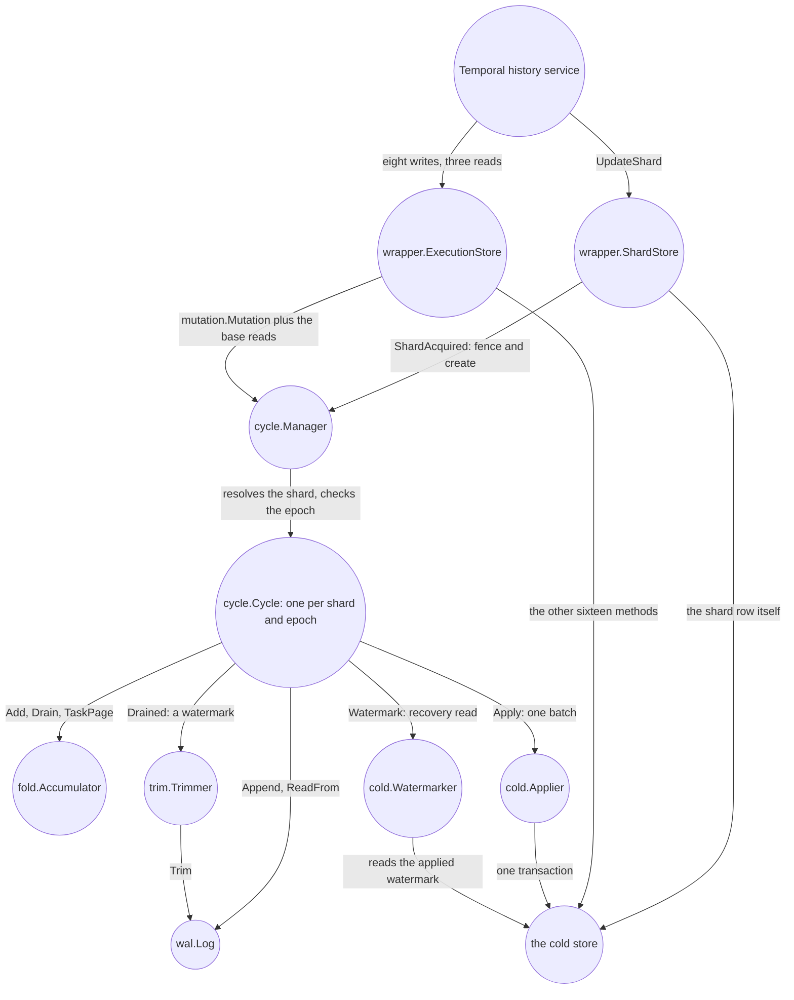
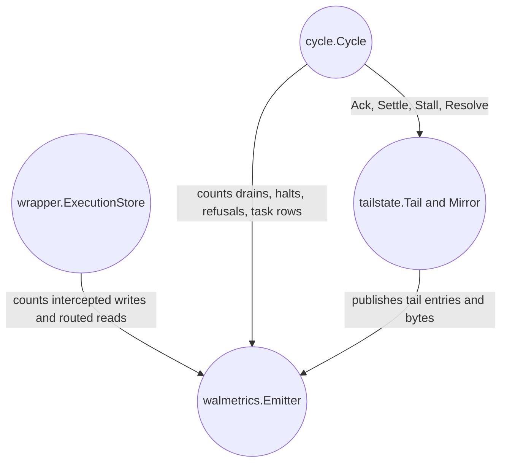
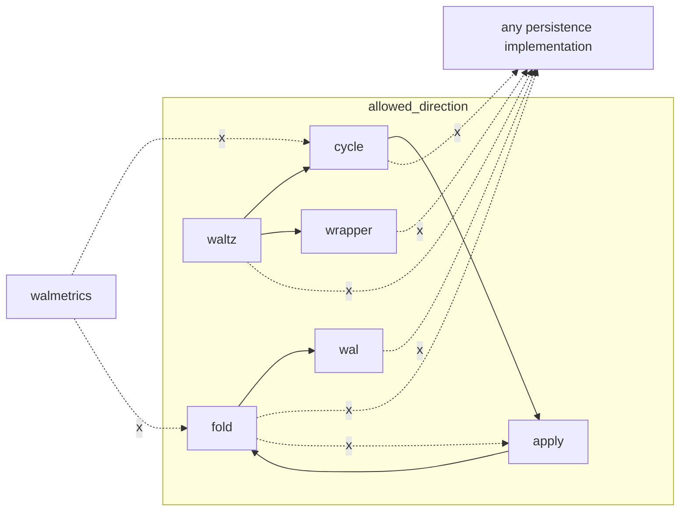
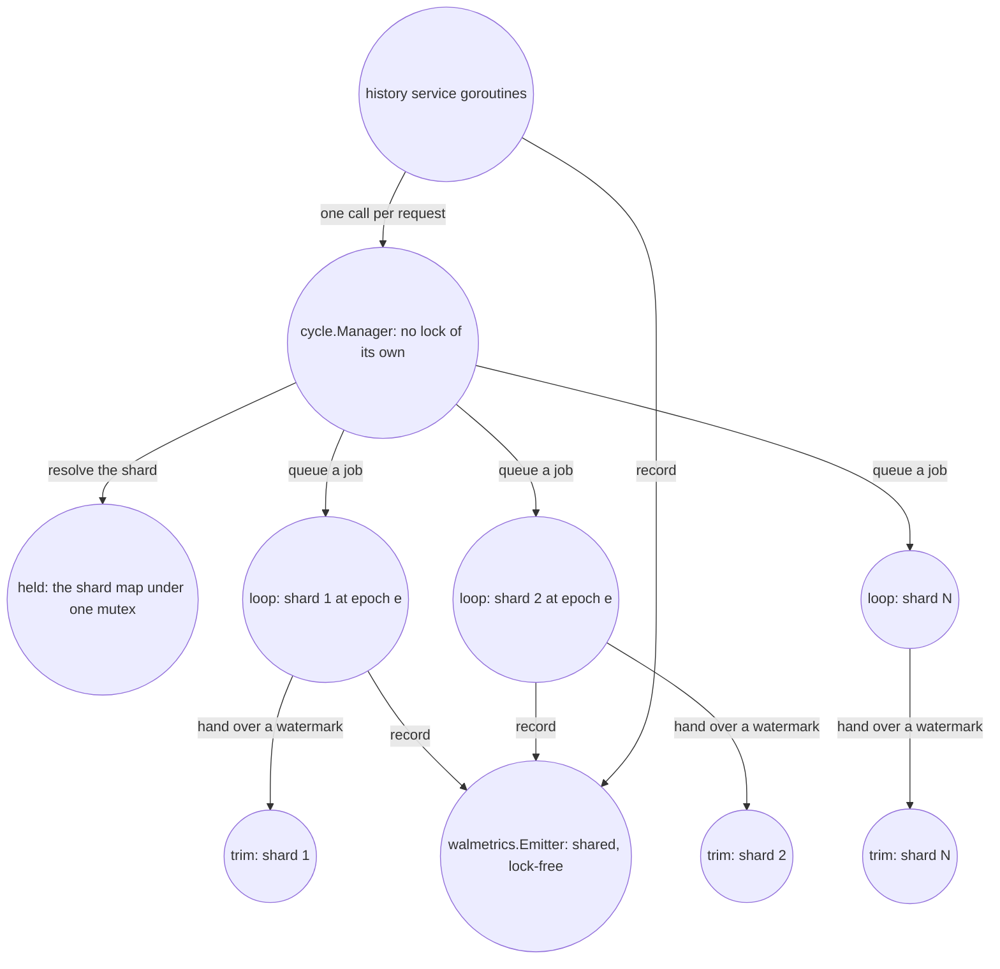

# Components: ownership, knowledge and calls

## Two boundaries that look alike and are not

A mutation crosses the same handful of packages at run time: the wrapper intercepts it, the cycle
orders it, the log makes it durable, fold compacts it, and the applier writes the result. It is
tempting to read that sequence as the import graph. It is not one. Two different boundaries are at
work here, and telling them apart explains most of the tree's shape.

A **run-time boundary** says who may call whom while serving a shard. A **knowledge boundary** says
which concepts a package is allowed to name at compile time. `cycle`, for example, calls a log and
an applier, but it knows no storage of any kind — both arrive as interfaces. `fold` handles
Temporal-shaped mutations, but knows no cold store and no log. `apply` knows what a drain's outcome
demands, but not the log whose entries caused that transaction.

Each of those omissions buys a test you could not otherwise write. `apply` names no log, so you can
vary a drain's outcome without one. `fold` names no store, so you can fold a generated stream of
mutations with nothing running. `wal` names no Temporal type, so a new backend is judged by the
contract suite and nothing else.

The boundaries also keep policy in one owner. If the applier could trim the log, it would need to
know replay policy and the cycle's unresolved state. If `fold` could read the store, a pure
mechanical merge would become a timing-dependent operation. If the wrapper could append directly, the
cycle would no longer be the single place that orders condition checks, tail accounting and
acknowledgement.

This chapter first follows knowledge through the tree, then compares the run-time and import
diagrams, and finally assigns each mutable value to a goroutine or mutex. Keep it open while reading
[chapter 05](05-write-path.md) and [chapter 06](06-shard-lifecycle.md).

## The tree has two halves

The repository's Go code lives in two source groups:

* **the module root and its packages** — what runs inside a production `temporal-server` process.
* **`internal/verify/`** — what judges it. Nothing here runs alongside the layer in production.

One rule holds the split in place: **no package outside `internal/verify/` may import a package under
`internal/verify/` in a non-test file.** The first such import puts test scaffolding into the binary
an operator runs. Test files are exempt and must be: `fold`'s own tests fold a generated mutation
stream from `internal/verify/mutgen`, and `cycle`'s build mutations with
`internal/verify/mutbuild` and page tasks through `internal/verify/coldtasks`.

`cold/memcold` sits in the first group and is the one thing there that is not the layer: it is a
*store*, sitting under the cold seam where a deployment's own store sits. It is not under
`internal/verify/` because it is not a judge and not a double — it is Temporal's own SQL persistence
over an in-memory SQLite database, and a server composed over it serves real workflows. That
database dies with the process, so nothing here calls `memcold` a production store.

Neither group holds a `main` package. waltz is a library: the composition it produces is handed to a
`temporal-server` main somebody else writes, through `temporal.WithCustomDataStoreFactory`.

## The packages, in dependency order

Most of these directories are siblings at the module root even where one imports another. `cycle`
imports `fold`, but so does `apply`, and `fold` imports neither. A nested directory says the parent
owns what is under it, so the only packages under `cycle/` are the three nothing outside the cycle
uses: `window`, `tailstate` and `trim`. The order below is the order a mutation actually travels.

| Package | Role, in one line | Key exported types | May not import — and why |
|---|---|---|---|
| `wal` | The log's contract: one fenced, gap-free, totally ordered sequence of entries per shard, payloads opaque. | `Log`, `Entry`, `ShardID`, `Seqno`, `Epoch`, `ErrFenced`, `ErrAlreadyWritten`, `ErrGap`, `ErrZeroEpoch` | the Temporal server, and every package above it — the contract is backend-independent, so an implementer gets the log and not Temporal |
| `wal/memwal` | The contract in process memory: the one implementation this library ships, so everything above the log tests without a cluster. | `Backend`, `New` | the same, for the same reason |
| `wal/waltest` | The conformance suite an implementation runs, plus `Faulty`, a log wrapped so a chosen call fails. | `RunContractSuite`, `Faulty`, `Fault`, `Once`, `Always` | the same, **plus every implementation including `memwal`** — a suite that could name one would special-case it and stop being about the contract |
| `mutation` | What one log entry *is*: the protobuf record of one persistence call, and the eight kinds. | `Mutation`, `Kind`, `Part`, `Encode`, `Decode` | any persistence implementation — the record mirrors Temporal's requests; the store that eventually writes them is the applier's business |
| `baserow` | The cold store's two mutable-state reads as the write path needs them: one run's row, and the current-execution row with `last_write_version` beside it. | `Store`, `Rows`, `New`, `Of`, `ErrNoVersionedRead` | any persistence implementation, and everything else of this layer — `wrapper`, `cycle` and `apply` all need this pair and none of them may name another's copy, so it imports Temporal's persistence and nothing more |
| `fold` | The accumulator: a window of mutations folded into one merged request per dirty workflow, the assertions it stands on, the overlay that answers reads, the task-page merge. | `Accumulator`, `Batch`, `Emitted`, `Stats`, `RunView`, `CurrentView`, `TaskWork`, `TaskRange`, `Delegated`, `Refusal`, `BasePage` | any persistence implementation, `apply` — fold folds what it is handed: no cold store, no log |
| `cold` | The cold store's contract: the applier one drain lands on, the watermarker that reads back what one committed, and the four things an implementation owes. | `Applier`, `Watermarker` | any persistence implementation, and `cold/memcold` most of all — the seam is stated for the author of a store that is not in this repository |
| `cold/memcold` | That contract satisfied, and the one cold store this repository ships: Temporal's own SQL persistence over an in-memory SQLite database, embedded whole, with the folded window's transaction added beside its 28 inherited methods. It sits *under* the layer rather than being part of it. | `Store`, `New`, `SetWatermark`, `AbstractDataStoreFactory`, `NewAbstractDataStoreFactory` | everything of this layer — a store that could see the layer would be judged by the thing sitting on top of it |
| `apply` | What a drain's outcome demands of its caller: the five classes an error sorts into, and the attribution a violated invariant carries. | `Class`, `Classify`, `Diverged`, `InvariantViolationError` | `wal.Log` and `wal.Entry` — pacing and trim are the cycle's policy, not the outcome's |
| `cycle/window` | The size and age of what a cycle folded since its last drain, as a type whose counters cannot be written from outside. | `Window`, `Taken`, `Watermarks`, `Trip` | `fold`, `walmetrics` — the window counts, it does not fold, and it publishes nothing |
| `cycle/tailstate` | The tail's arithmetic in one place: everything invariant [I10](02-concepts-and-invariants.md#the-invariants) bounds, plus the off-loop mirror of it. | `Tail`, `Mirror`, `New`, `NewMirror`, `WatermarkMove`, `Unresolved` | `fold` — the tail is arithmetic over what the loop acked, not the log those seqnos index nor the window they outlive |
| `cycle/trim` | The lazy deletion of entries the cold store already holds: the cadence, the one trim in flight, the two counters. | `Trimmer`, `New`, `Cadence` | `fold`, `cycle/tailstate` — a cadence over a watermark it is handed; it may reach neither the thing that moves that watermark nor the thing that folds |
| `cycle` | The state machine: one goroutine per (shard, epoch) owning the accumulator, the drain, the trim, the three reads and replay, plus the node's registry of them. | `Cycle`, `Manager`, `NewManager`, `Deps`, `Config`, `Defaults`, `Policy`, `Fixed`, `Live`, `Moving`, `State`, `Stats`, `Totals`, `Counters` | any persistence implementation — the cold store arrives as `cold.Applier` and `cold.Watermarker`, and there may be no second door |
| `wrapper` | The seam into a running server: a decorator over a base data store factory whose `ExecutionStore` and `ShardStore` the history service talks to. | `Options`, `ShardLayer`, `ShardObserver`, `ShardWriter`, `ShardReader`, `MetricsSink`, `AbstractDataStoreFactory`, `NewAbstractDataStoreFactory`, `DataStoreFactory`, `NewDataStoreFactory`, `ErrCompleteHistoryTaskUnsupported` | any persistence implementation, and `cycle` — wrap, don't fork: the decorator is defined over upstream's interface, and composing it with a base store is the binary's job |
| `waltz` (the module root) | The composition a server builds: the `wal` config section, the dynamic-config settings, the components they name, the lifecycle, and the factory that is the door out. | `Compose`, `Layer`, `Backends`, `Config`, `WAL`, `Parse`, `Registry`, `TaskCategories`, `DefaultTaskCategories`, `NewPolicy`, `AbstractFactory` | — (it composes everything, which is the point) |
| `walmetrics` | Where the numbers go: the metric definitions and the emitter, on the server's own handler. | `Emitter`, `New`, and the `metrics.*Def` values (`InterceptedWrites`, `Drains`, `TailBytes`, …) | `wal`, `fold`, `apply`, `cycle`, `wrapper`, `mutation` — the metric names are the layer's vocabulary, so nothing that can be measured may be imported here |

Four packages fold, classify and count what they are handed: `fold`, `apply`, `cycle/tailstate` and
`cycle/window`. They may use `wal`'s value types — `Seqno` above all — but may **not name the
operational types `wal.Log` or `wal.Entry`**. `cycle/trim` is the one sub-package that may name
`wal.Log`, and that is the same rule seen from the other side: the trim's whole job is the log, and
giving it a package of its own is what keeps `wal.Log` off `tailstate.Tail`, the type the watermark
moves on.

The wrapper's row says *wrap, don't fork*, and the seam it wraps is not one this layer found. **Temporal
decorates the same `DataStoreFactory` twice in its own tree** — `common/persistence/faultinjection` and
`common/persistence/telemetry`, each holding a base factory and returning wrapped `ExecutionStore` and
`ShardStore` implementations, method for method. The factory is also the only extension point a custom
`main` reaches: a binary composing its own server substitutes a factory and nothing deeper. That bounds
the layer as much as it licenses it — **the layer sees exactly what crosses the persistence interface
and nothing above it**, which is why shard ownership has to be inferred from an `UpdateShard` rather
than announced ([chapter 06](06-shard-lifecycle.md#2-use-the-ownership-token-temporal-already-has)).

Every metric series named above is [chapter 10](10-metrics.md); every config key is
[chapter 08](08-configuration.md).

## The component diagram — run-time calls

**This diagram is about calls at run time, not about imports.** An arrow means "A calls B while the
process is serving"; the labels say what flows. The import rules are the *next* diagram and they do
not have the same shape.

How to read this. Nothing crosses a shard boundary below `cycle.Manager`: the manager resolves a
shard to its one cycle, and everything under that cycle belongs to that shard alone. Two paths reach
the cold store from the layer, and both are interfaces the deployment implements — `cold.Applier`,
the layer's only *write* door, and `cold.Watermarker`, which reads back what the last drain
committed when its outcome was unknown. The wrapper's own arrows to the cold store are the transits:
the calls the layer has no shape for.

The cold store's two mutable-state reads do not appear as an arrow out of `cycle`, and that is
deliberate — the cycle may not name a store. They arrive as a `*baserow.Rows` and as closures the
wrapper passes in with each call, and are invoked *inside* the goroutine that owns the window.

Two components sit beside the path rather than on it:

How to read this. The emitter is a sink and nothing more: every arrow into it is one-way. Every
mutator on `tailstate.Tail` ends in a publish, so *moving the tail is publishing it* — the metric
emission is not a step a call site can forget.

## The import diagram — compile-time bans

**This diagram is about `import` statements, not about calls.** A dashed arrow labelled `x` is an
import that is forbidden; a package may still *reach* the target transitively where the rule is
written as "may not import" rather than "may not depend on".

How to read this. Each solid arrow is a legal import, drawn the same way round as the dashed ones —
`wal` is at the bottom, the root package at the top. The dashed `x` arrows are the bans that matter
most:

* **`wal` and its implementations may not import the Temporal server.** The contract is
  backend-independent, which is a requirement rather than an aspiration: a log worth replacing the
  cold store's durability with is one written by somebody who never has to learn what a shard is.
* **`fold` may not import `apply`.** A fold that could reach the write path would fetch
  the base row it is supposed to be given.
* **`wrapper` may not import `cycle`.** It is why the wrapper talks to the layer through
  `wrapper.ShardWriter` and `wrapper.ShardReader`, and why translating a cycle's answer into the
  store's error types lives in `cycle` (`write.go`'s one write door, over `decide.go`'s `storeError`)
  rather than in the wrapper.
* **No package of the layer names a persistence implementation at all** — not even the root, which
  composes everything. That is the whole of what makes waltz a library: the log arrives as a
  `wal.Log`, the cold store as a `cold.Applier` and a `cold.Watermarker`, and the base store as
  whatever factory the caller hands `wrapper.NewAbstractDataStoreFactory`. `cycle` is where the ban
  costs the most and matters the most: it holds the log, the accumulator and the write path at once,
  so one import of a store would give the shard a second write path beside the one every suite here
  judges. **`cold/memcold` is the one package in the tree that *is* a store**, and the ban reads the
  same way from its side: nothing in the layer may import it, and it may import nothing of the
  layer. It sits under the seam, where a deployment's own store sits.
* **`walmetrics` is named by both ends of the layer** — the wrapper counts what crosses it, the
  cycle counts what the accumulator did — so it must be reachable from both, which is exactly why it
  may reach neither. The hazard is specific: a metric is easiest to add where the number already is,
  so an import of `fold` here would put "just read `Stats`" one line away, and the emitter would end
  up holding the component it measures.

Two more bans have no place on the diagram because they are about sub-packages:
**`cycle/tailstate` and `cycle/window` may not import `fold`**, and they are listed
separately from `cycle` in the table above because a rule stated over the parent covers
neither. The window's bytes and the tail's bytes are two numbers on purpose, and either type that
could see the accumulator is one merge away from bounding the wrong one.

**None of these rules is checked by a test.** They are prose, with the reasoning beside each one —
see [chapter 11](11-verification.md#1-a-test-asserts-behaviour-never-shape) for the house rule that
keeps them out of one. Where a rule *could* be made mechanical it was made a compile error instead,
which is why `tailstate` and `window` are packages: `s.tail.resolved = 0` does not build in `cycle`
at all.

## Ownership and concurrency

### One goroutine per (shard, epoch)

`cycle.New` starts one goroutine — `Cycle.run` — and that goroutine is the sole owner of the shard's
mutable state at that epoch. What it owns:

* the `fold.Accumulator` (the window's folded contents);
* the `window.Window` (the window's mutation count, byte count and age);
* the `tailstate.Tail` (acked-but-unsettled entries and their bytes);
* the drain, including the applier's transaction;
* the three reads — `GetWorkflowExecution`, `GetCurrentExecution` and `GetHistoryTasks`;
* replay, on the first request after an acquire.

That is what makes the accumulator single-threaded with no lock at all. Work reaches the loop as a
`job`, which is `func(*state)`: a closure over its own arguments and its own result. The consequence
worth internalising before you add one: **everything on this goroutine is serialised behind the
accumulator and the drain**, so a job that waits on the cold store holds up every write on the shard.

Placing the *reads* on the same goroutine is a correctness decision rather than tidiness. The window
empties when a drain *starts* and the tail only when its transaction *commits*, so a read served
anywhere else can fall into the interval where a mutation is in neither source — not a stale answer,
but a write undone, and for a task page a task lost rather than late. The interval and both
consequences are [chapter 07](07-read-path.md#why-a-read-served-anywhere-else-is-not-merely-stale).

### What lives off the loop

| Thing | Owner | How it is safe |
|---|---|---|
| `tailstate.Mirror` | published by every `Tail` mutator | atomics; read by `Cycle.write` *before* it queues anything, and by a retired cycle's read path |
| `Cycle.State()` | the loop writes, anyone reads | one `atomic.Int32`, so a stopped cycle still reports the state it stopped in |
| `Cycle.finished` | written by the loop on its way out | read by `Cycle.Retire` only after the loop's `done` channel is closed — that is the happens-before, and the reason there is no lock |
| `trim.Trimmer` | its own goroutine, beside the loop | a `Trimmer` is handed a watermark *by value*; one trim in flight at a time; `Trimmer.Wait` is how a caller waits for it |
| `walmetrics.Emitter` | shared, one per node | every method is an atomic load and a `Record`; `Emitter.Use` is the only mutation and takes the first handler it is given |
| the shard map | `cycle.held` | one mutex; every method finishes its map arithmetic and returns without touching a `*Cycle` |

Two of those need more than a table cell.

**The trim is off the loop because a stuck log must not stop a shard from acking and applying.** It
is a package of its own precisely so the `go` statement lives where no `*state` can be named — the
ownership rule becomes the compiler's job rather than prose. A failed trim halts nothing: it is
logged and retried at the next cadence.

**There is no mutex on `cycle.Manager`.** The mutex belongs to the unexported `held` type, which owns
the shard map and the retired counters. That is deliberate and it is a lock-inversion story: every
read path resolves through `Manager.Shard`, which wants that mutex, so any code holding it while
calling into a cycle's goroutine would stop every shard on the node — one cycle blocked inside a base
read and the whole registry waiting behind it. So: **ask a cycle for anything, `Stats` most of all,
outside the lock.**

### The goroutines on one node

How to read this. The only shared mutable state on the node is the shard map behind `held`'s mutex
and the emitter, which is lock-free. Everything else is per-shard and single-threaded.

### Lifetimes

* **`waltz.Layer` — exactly one per process**, not one per data store factory. A shard's cycle carries
  its epoch from the acquire through the writes that follow, so two registries would be two windows
  for one shard, each unaware of the other.
* **A `Cycle` is created by `Manager.ShardAcquired`**, which fences the log at the new epoch and then
  starts the cycle, in that order — the log's epoch may never lag the database's.
* **A `Cycle` is retired by a higher epoch superseding it, or by the node closing.** Nothing else
  reaps one: an acquire is observable and a shard *close* is not, because closing a shard makes no
  persistence call. So an idle cycle costs a goroutine and an empty accumulator until its node stops
  — a bounded leak, taken knowingly.
* **The layer's lifecycle brackets the server's.** `waltz.Compose` runs before the server is built,
  so a failed budget assertion stops the binary; `Layer.Shutdown(ctx, budget)` runs after the server
  has stopped, so the shutdown drain still has a store to write to. The budget goes on a context of
  the layer's own, detached from the caller's — a shutdown drain runs exactly where a context has
  just been cancelled. Start and stop order in full is
  [chapter 09](09-operations.md#2-start-and-stop-order).

## Where the composition happens

`waltz.Compose` is the one graph every process running intercept mode builds, and there may not be a
second. It opens nothing, reaches nothing and takes no context. It takes five inputs:

* `Backends` — the log, the applier and the watermarker;
* a `cycle.Policy`;
* a `waltz.Registry` of task categories;
* an optional `log.Logger`, which nil replaces with a noop;
* an optional `metrics.Handler`, which nil replaces with a noop.

That is the whole of the door in, and it is deliberately the only one. Every earlier revision of
this layer had a second constructor that opened a client from a config file, and it is exactly the
constructor a library must not have: opening storage is what the caller already knows how to do, and
a composition that does it too has two configurations of the same thing with nothing to reconcile
them.

The door out is `Layer.AbstractFactory(base)`, which returns the value a custom `main` hands to
`temporal.WithCustomDataStoreFactory`. A caller that wants the pieces separately takes
`Layer.Options()` and builds the factory itself; `waltz.AbstractFactory(base, opts)` is that pairing
as one call.

The metrics handler travels the opposite way to everything else: the server's `metrics.Handler`
exists later than the layer does, so it comes *down* the same seam the stores come up, through
`wrapper.MetricsSink` — one method, first call wins, with the sequence in
[chapter 10](10-metrics.md#1-how-the-numbers-get-out). Building a second handler
from the same configuration was tried and rejected: with the Prometheus reporter it is a second
listener on the address the server's own handler binds, so one of the two fails to start.

## `internal/verify/` in brief

Nothing here runs in production. What lives here splits in two, and which half a package is in is the
thing to know before opening it:

* **instruments** measure or drive, and assert nothing — `mutgen`, `mutbuild`, `drive`, `foldrun`,
  `coldtest`, `basetest`, `coldtasks`, `checker`, `witness`;
* **judgements** say yes or no — `acceptance`, `e2e`, `guard`.

What each one claims is [chapter 11](11-verification.md#the-map-of-internalverify). None of them needs a
cluster, and that is now a stronger statement than "none of them can have one": both seams have an
implementation that runs in this process, so `internal/verify/e2e` boots four Temporal services over the
layer without installing anything. What no package here can have is *storage that survives the
process*, which is where the limits in [chapter 15](15-the-limits-of-the-evidence.md) begin.

## Where this lives in the code

* [`../../wal/wal.go`](../../wal/wal.go) — the contract's five guarantees, stated on
  `Log` and its five methods.
* [`../../cycle/cycle.go`](../../cycle/cycle.go) — `Cycle`, its `job` channel, the fields
  that live off the loop, and `Deps`.
* [`../../cold/cold.go`](../../cold/cold.go) — `Applier` and `Watermarker`, and the four
  things an implementation of them owes; [`../../cold/memcold/memcold.go`](../../cold/memcold/memcold.go)
  is the one that ships, and [`apply.go`](../../cold/memcold/apply.go) is the drain's transaction
  statement by statement.
* [`../../cycle/manager.go`](../../cycle/manager.go) — the registry the wrapper's shard
  hook talks to, and `Totals`.
* [`../../cycle/held.go`](../../cycle/held.go) — the node's one mutex, and why no method
  on it may call into a `*Cycle`.
* [`../../cycle/trim/trim.go`](../../cycle/trim/trim.go) — the trim beside the loop, and
  why it is a package.
* [`../../cycle/tailstate/tailstate.go`](../../cycle/tailstate/tailstate.go) and
  [`../../cycle/window/window.go`](../../cycle/window/window.go) — the two counter types
  whose fields the compiler protects.
* [`../../wrapper/wrapper.go`](../../wrapper/wrapper.go) — `Options`, `ShardLayer` and
  its four faces, and where the server's metrics handler enters the layer.
* [`../../waltz.go`](../../waltz.go) — `Compose`, `Backends`, `Layer.Options`,
  `Layer.AbstractFactory` and the layer's lifecycle.
* [`../../walmetrics/walmetrics.go`](../../walmetrics/walmetrics.go) — the emitter and
  every metric definition.
