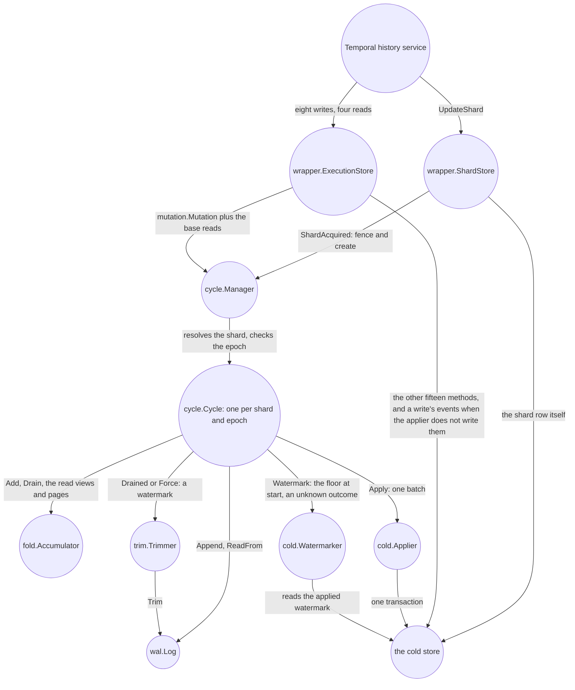
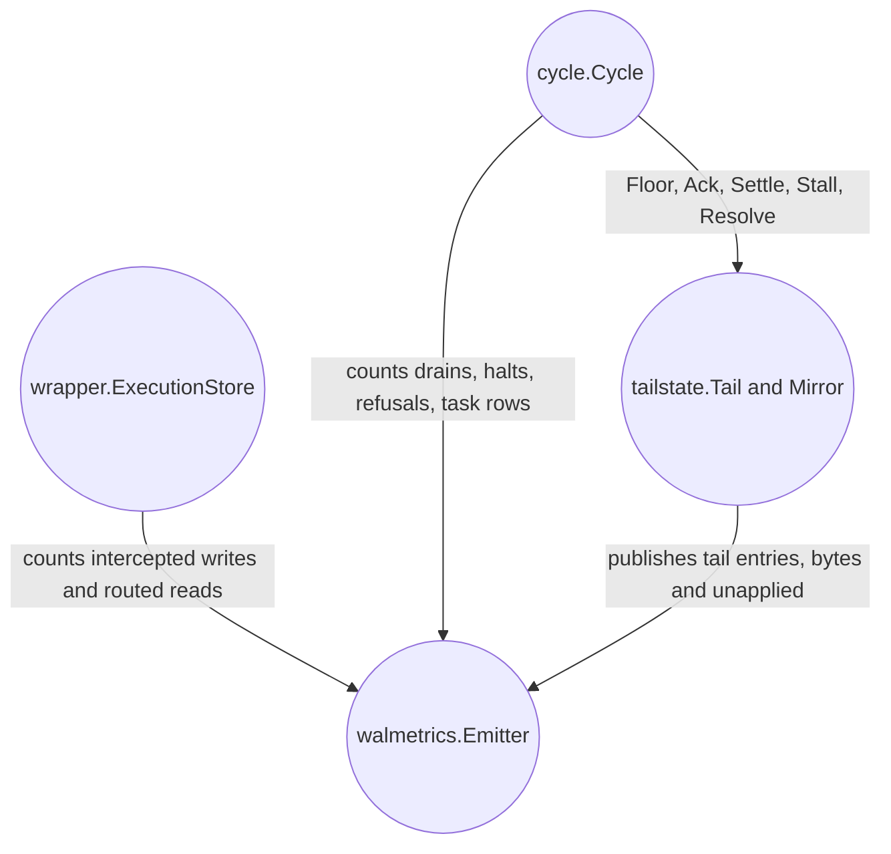
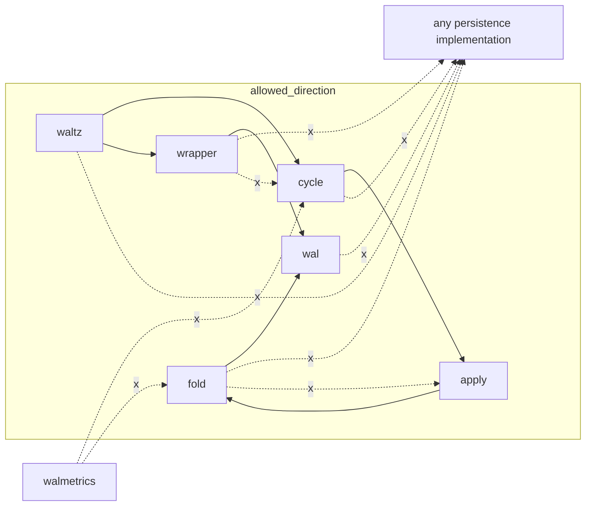
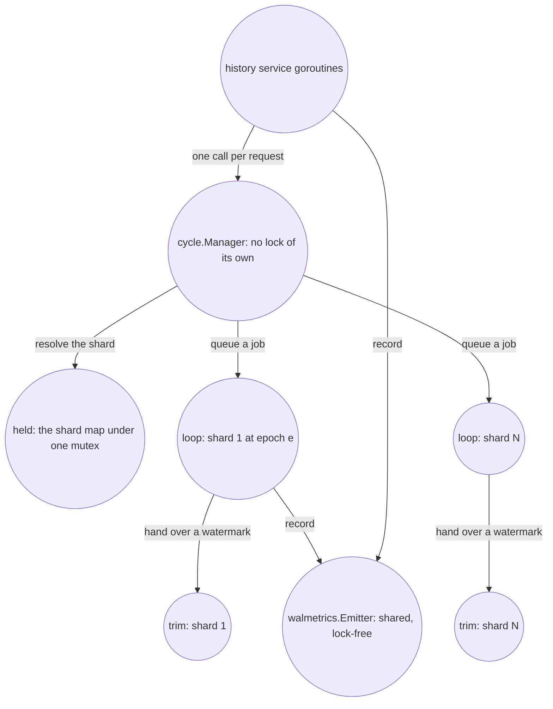

# Components: ownership, knowledge and calls

A mutation crosses the same few packages at run time: the wrapper intercepts it, the cycle orders
it, the log makes it durable, `fold` compacts it, and the applier writes the result. That sequence
is not the import graph. This chapter maps both: what each package may know, who calls whom while a
shard is served, and which goroutine owns each mutable value.

## Run-time calls versus compile-time knowledge

A *run-time boundary* says who may call whom while serving a shard. A *knowledge boundary* says
which concepts a package may name at compile time. `cycle` calls a log and an applier but knows no
storage: both arrive as interfaces. `fold` handles Temporal-shaped mutations but knows no cold store
and no log. `apply` knows what a drain's outcome demands but not the log whose entries caused it.

Each omission buys a test. `apply` names no log, so a test can vary a drain's outcome without one.
`fold` names no store, so a test can fold a generated stream with nothing running. `wal` names no
Temporal type, so a new backend is judged by the contract suite alone.

They also keep each policy with one owner. An applier that could trim would need replay policy; a
`fold` that could read the store would make a mechanical merge timing-dependent; a wrapper that
could append would end the cycle's role as the one place that orders condition checks, tail
accounting and acknowledgement.

## The tree has two halves

The module root and its packages are what runs inside a production `temporal-server` process.
`internal/verify/` is what judges it, and none of it runs in production. No package outside
`internal/verify/` may import one under it in a non-test file, because that would put test
scaffolding into the binary an operator runs. Test files are exempt and need to be:
`fold`'s tests fold a generated stream from `internal/verify/mutgen`, and `cycle`'s tests build
mutations with `internal/verify/mutbuild` and page tasks through `internal/verify/coldtasks`.

`cold/memcold` sits in the first group but is not part of the layer. It is a *store* under the cold
seam, neither judge nor double: Temporal's own SQL persistence over an in-memory SQLite database,
on which a server serves real workflows. The database dies with the process, so it is not a
production store.

Neither group holds a `main` package. waltz is a library, handed to a `temporal-server` main
somebody else writes through `temporal.WithCustomDataStoreFactory`.

## The packages, in dependency order

Most packages are siblings at the module root even where one imports another: `cycle` and
`apply` both import `fold` and `fold` imports neither, which nesting cannot express. A nested
directory means the parent owns it, so `cycle/` holds only the three packages nothing else uses:
`window`, `tailstate` and `trim`. The table runs bottom-up, so the log's contract comes first.

| Package | Role, in one line | Key exported types | May not import |
|---|---|---|---|
| `wal` | The log's contract: one fenced, gap-free, totally ordered sequence of entries per shard, payloads opaque. | `Log`, `Entry`, `ShardID`, `Seqno`, `Epoch`, `ErrFenced`, `ErrAlreadyWritten`, `ErrGap`, `ErrZeroEpoch`, `PressureSource`, `PressureLevel` | the Temporal server and every package above it (below) |
| `wal/memwal` | The contract in process memory, the one implementation shipped, so everything above the log tests without a cluster. | `Backend`, `New` | the same |
| `wal/waltest` | The conformance suite, the two checks only a deployment can run (reopen, retention), and `Faulty`, a log whose chosen call fails. | `RunContractSuite`, `CheckReopen`, `CheckRetention`, `Faulty`, `Fault`, `Once`, `Always` | the same, plus every implementation including `memwal`, so no backend is special |
| `mutation` | What one log entry *is*: the protobuf record of one persistence call, and the eight kinds. | `Mutation`, `Kind`, `Part`, `Encode`, `Decode` | any persistence implementation: writing the record is the applier's business |
| `baserow` | The cold store's two mutable-state reads the write path makes: one run's row, and the current-execution row with `last_write_version`. | `Store`, `Rows`, `New`, `Of`, `ErrNoVersionedRead` | any persistence implementation and the rest of the layer, so `wrapper`, `cycle` and `apply` share it |
| `fold` | The accumulator: one merged request per dirty workflow, its assertions, the read overlay, the task-page and history-branch merges. | `Accumulator`, `Batch`, `Emitted`, `Stats`, `RunView`, `CurrentView`, `TaskWork`, `TaskRange`, `Delegated`, `Refusal`, `BasePage`, `HistoryBasePage` | any persistence implementation, `apply` (below) |
| `cold` | The cold store's contract: the applier a drain lands on, the watermarker that reads back what it committed, and the four things an implementation owes. `Store` pairs them: a watermark read from another store proves nothing. | `Store`, `Applier`, `HistoryApplier`, `Watermarker` | any persistence implementation, `cold/memcold` above all: the seam is written for an outside store |
| `cold/memcold` | Temporal's SQL store over in-memory SQLite (above), embedded whole, with the folded window's transaction beside its 28 inherited methods. | `Store`, `New`, `SetWatermark`, `AbstractDataStoreFactory`, `NewAbstractDataStoreFactory` | `cycle`, `wrapper` and the root package, so it is judged only against the contract; of this tree it imports only the contract's vocabulary: `cold`, `fold`, `wal`, `apply`, `baserow`, `mutation` |
| `apply` | What a drain's outcome demands: the five classes an error sorts into, and a violated invariant's attribution. | `Class`, `Classify`, `Diverged`, `InvariantViolationError` | `wal.Log` and `wal.Entry`: pacing and trim are the cycle's policy |
| `cycle/window` | The size and age of what a cycle folded since its last drain, in counters nothing outside can write. | `Window`, `Taken`, `Watermarks`, `Trip` | `fold`, `walmetrics`: it counts, and neither folds nor publishes (below) |
| `cycle/tailstate` | The tail's arithmetic: everything invariant [I10](02-concepts-and-invariants.md#the-invariants) bounds, plus its off-loop mirror. | `Tail`, `Mirror`, `New`, `NewMirror`, `WatermarkMove`, `Unresolved` | `fold`: the tail is arithmetic over what the loop acked, not over the window (below) |
| `cycle/trim` | Lazy deletion of entries the cold store already holds: the cadence, the one trim in flight, two counters. | `Trimmer`, `New`, `Cadence` | `fold`, `cycle/tailstate`: it is handed a watermark and reaches nothing that moves it |
| `cycle` | The state machine: one goroutine per (shard, epoch) (below), plus the node's registry of them. | `Cycle`, `Manager`, `NewManager`, `Deps`, `Config`, `Defaults`, `Policy`, `Fixed`, `Live`, `Moving`, `State`, `Stats`, `Totals`, `Counters` | any persistence implementation (below) |
| `wrapper` | The seam into a running server: a decorator over a base data store factory, whose `ExecutionStore` and `ShardStore` the history service calls. | `Options`, `ShardLayer`, `ShardObserver`, `ShardWriter`, `ShardReader`, `MetricsSink`, `AbstractDataStoreFactory`, `NewAbstractDataStoreFactory`, `DataStoreFactory`, `NewDataStoreFactory`, `ErrCompleteHistoryTaskUnsupported` | any persistence implementation, `cycle` (below) |
| `waltz` (the module root) | The composition: the `wal` config section, the dynamic-config settings, the components they name, the lifecycle, and the factory that is the door out (keys: [chapter 08](08-configuration.md)). | `Compose`, `Layer`, `Backends`, `Config`, `WAL`, `Parse`, `Registry`, `TaskCategories`, `DefaultTaskCategories`, `NewPolicy`, `AbstractFactory` | no persistence implementation (below) |
| `walmetrics` | The metric definitions and the emitter, on the server's own handler. | `Emitter`, `New`, and the `metrics.*Def` values (`InterceptedWrites`, `Drains`, `TailBytes`, …) | `wal`, `fold`, `apply`, `cycle`, `wrapper`, `mutation` (below) |

Four packages fold, classify and count what they are handed: `fold`, `apply`, `cycle/tailstate`
and `cycle/window`. They may use `wal`'s value types, `Seqno` above all, but not the operational
types `wal.Log` or `wal.Entry`. `cycle/trim` is the one sub-package that may name `wal.Log`: its job
is the log, and a package of its own keeps `wal.Log` off `tailstate.Tail`, the type the watermark
moves on.

The wrapper wraps rather than forks, as Temporal's own `common/persistence/faultinjection` and
`common/persistence/telemetry` decorate the same `DataStoreFactory` method for method. The factory
is the only extension point a custom `main` reaches, so the layer sees what crosses the persistence
interface and nothing above it. Shard ownership therefore has to be inferred from an `UpdateShard`
([chapter 06](06-shard-lifecycle.md#2-use-the-ownership-token-temporal-already-has)).

## The component diagram — run-time calls

Figure: calls at run time. An arrow means "A calls B while serving", and its label says what flows.

```mermaid
graph TD
  HS(("Temporal history service"))
  ES(("wrapper.ExecutionStore"))
  SS(("wrapper.ShardStore"))
  MGR(("cycle.Manager"))
  CY(("cycle.Cycle: one per shard and epoch"))
  ACC(("fold.Accumulator"))
  TR(("trim.Trimmer"))
  AP(("cold.Applier"))
  WM(("cold.Watermarker"))
  LOG(("wal.Log"))
  CS(("the cold store"))

  HS -->|"eight writes, four reads"| ES
  HS -->|"UpdateShard"| SS
  SS -->|"ShardAcquired: fence and create"| MGR
  SS -->|"the shard row itself"| CS
  ES -->|"mutation.Mutation plus the base reads"| MGR
  ES -->|"the other fifteen methods, and a write's events when the applier does not write them"| CS
  MGR -->|"resolves the shard, checks the epoch"| CY
  CY -->|"Append, ReadFrom"| LOG
  CY -->|"Add, Drain, the read views and pages"| ACC
  CY -->|"Apply: one batch"| AP
  CY -->|"Drained or Force: a watermark"| TR
  CY -->|"Watermark: the floor at start, an unknown outcome"| WM
  TR -->|"Trim"| LOG
  AP -->|"one transaction"| CS
  WM -->|"reads the applied watermark"| CS
```

Nothing crosses a shard boundary below `cycle.Manager`, which resolves a shard to its one cycle.
Two paths reach the cold store through interfaces the deployment implements: `cold.Applier`, the
drain's write door, and `cold.Watermarker`. `cold.Watermarker` reads back what the last drain
committed: once at cycle start, for the floor replay starts above, and again after any drain whose
outcome was unknown.

The wrapper's own arrows to the cold store are transits plus one write: where the applier does not
declare `cold.HistoryApplier`, an intercepted write's new history events go to the store below
before its mutation is appended, and the record carries none. Of the 28 `wrapper.ExecutionStore`
methods, intercept mode answers twelve, refuses `CompleteHistoryTask` and passes fifteen through
([chapter 04](04-contracts.md#wrapperexecutionstore--28-methods)).

The write path's two mutable-state reads, `baserow.Rows.Run` and `baserow.Rows.Current`, have no
arrow. The wrapper passes a `*baserow.Rows` with every write
and a base closure with every read, and the cycle invokes them on the goroutine that owns the
window.

Figure: the two components beside the path.

```mermaid
graph TD
  ES2(("wrapper.ExecutionStore"))
  CY2(("cycle.Cycle"))
  TS(("tailstate.Tail and Mirror"))
  EM(("walmetrics.Emitter"))

  ES2 -->|"counts intercepted writes and routed reads"| EM
  CY2 -->|"counts drains, halts, refusals, task rows"| EM
  CY2 -->|"Floor, Ack, Settle, Stall, Resolve"| TS
  TS -->|"publishes tail entries, bytes and unapplied"| EM
```

Every mutator on `tailstate.Tail` ends in a publish, so no call site can forget the metric.

## The import diagram — compile-time bans

Figure: `import` statements, not calls. A dashed arrow labelled `x` is a forbidden import. "May not
import" still allows reaching the target transitively; "may not depend on" does not.

```mermaid
graph LR
  subgraph allowed_direction
    W["wal"]
    F["fold"]
    A["apply"]
    C["cycle"]
    WR["wrapper"]
    N["waltz"]
    F --> W
    A --> F
    C --> A
    N --> C
    N --> WR
    WR --> W
  end
  STORE["any persistence implementation"]
  MET["walmetrics"]

  W -.->|"x"| STORE
  F -.->|"x"| STORE
  C -.->|"x"| STORE
  WR -.->|"x"| STORE
  N -.->|"x"| STORE
  F -.->|"x"| A
  WR -.->|"x"| C
  MET -.->|"x"| C
  MET -.->|"x"| F
```

Every solid chain starts at the root package and ends at `wal`, which imports nothing else in this
tree. The dashed arrows are the five bans that matter most.

### `wal` may not import the Temporal server

`wal` and its implementations may not import the Temporal server; the diagram draws only the
narrower half, no persistence implementation. An entry's payload is opaque bytes and `wal.Log`'s five
methods name no Temporal type, so the author of a new backend satisfies one contract, the one
`waltest.RunContractSuite` drives, without learning what a history shard is.

### `fold` may not import `apply`

`apply` names `baserow`, so importing it would put `fold` one hop from the cold store's rows.
Instead, an assertion the window cannot settle comes back as a `fold.Delegated`. `Delegated.Settle`
hands each obligation to the caller, which reads the row and judges it with
`DelegatedCurrent.Verify` or `DelegatedRun.Verify`. The fold is given base rows and never fetches
one.

### `wrapper` may not import `cycle`

The wrapper reaches the layer through the `wrapper.ShardWriter` and `wrapper.ShardReader`
interfaces, not a `*cycle.Cycle`, so `cycle` translates its answers into the history service's
error types: `write.go` holds the one write door, and `decide.go`'s `storeError` translates.

### No package of the layer names a persistence implementation

The root package included. The log arrives as a `wal.Log`, the cold store as a `cold.Applier` and
a `cold.Watermarker`, and the base store as whatever factory the caller hands
`wrapper.NewAbstractDataStoreFactory`. The ban matters most in `cycle`, which holds the log, the
accumulator and the write path at once: one store import there would give the shard a second write
path beside the one every suite judges.

### `walmetrics` may import neither end of the layer

Both the wrapper and the cycle record into `walmetrics`, so it may reach neither. Importing `fold`
would put "just read `Stats`" one line away, and the emitter would end up holding what it measures.

### The sub-package ban, and how the rules are kept

`cycle/tailstate` and `cycle/window` may not import `fold`; a rule stated over `cycle` covers
neither. The window's bytes and the tail's bytes differ: the window empties when a drain starts,
the tail when it commits. A counter that could import `fold` would have the accumulator's byte
count one line away, and counting both with it would leave I10 bounding the window instead of the
tail ([chapter 02](02-concepts-and-invariants.md#three-positions-not-two)).

No test checks these rules; they are prose with the reasoning beside each
([chapter 11](11-verification.md#1-a-test-asserts-behaviour-never-shape)). Where a rule could be
made mechanical it became a compile error: that is why `tailstate` and `window` are packages, so
`s.tail.resolved = 0` does not build in `cycle`.

## Ownership and concurrency

### One goroutine per (shard, epoch)

`cycle.New` starts one goroutine, `Cycle.run`, which alone owns the shard's mutable state at that
epoch: the `fold.Accumulator` (the window's folded contents), the `window.Window` (its mutation
count, byte count and age), the `tailstate.Tail` (acknowledged-but-unsettled entries and their
bytes), the drain including the applier's transaction, the four reads (`GetWorkflowExecution`,
`GetCurrentExecution`, `GetHistoryTasks`, `ReadHistoryBranch`), and replay on the first request
after an acquire.

Work reaches the loop as a `job`, a `func(*state)` closing over its own arguments and result, so the
accumulator needs no lock. This buys lock-freedom at the cost of serialisation: a job that waits on
the cold store holds up every write to the shard. The reads run on the loop for correctness, since
between a drain's start and its commit a mutation is in neither the window nor the store
([chapter 07](07-read-path.md#why-a-read-served-anywhere-else-is-not-merely-stale)).

### What lives off the loop

| Thing | Owner | How it is safe |
|---|---|---|
| `tailstate.Mirror` | published by every `Tail` mutator | atomics; read by `Cycle.write` before it queues anything, and by a retired cycle's read path |
| `Cycle.State()` | the loop writes, and `Cycle.Retire` as it stops one; anyone reads | one `atomic.Int32`, so a stopped cycle still reports the state it stopped in |
| `Cycle.finished` | written by the loop on its way out | read by `Cycle.Retire` only after the loop's `done` channel closes, which gives the happens-before without a lock |
| `trim.Trimmer` | the loop owns its cadence; each trim runs on a detached goroutine | handed a watermark by value; its own mutex covers the one trim in flight and the one follow-up queued behind it; `Trimmer.Wait` waits for it |
| `walmetrics.Emitter` | shared, one per node | every method is an atomic load and a `Record`; `Emitter.Use`, the only mutation, keeps the first non-nil handler |
| the shard map | `cycle.held` | one mutex, never held while calling into a `*Cycle` (below) |

The trim runs off the loop so that a stuck log cannot stop a shard from acknowledging and applying,
and in a package of its own so that its `go` statement lives where no `*state` can be named. A
failed trim halts nothing: it is logged and retried at the next cadence, or forced again while
storage pressure stands ([chapter 06](06-shard-lifecycle.md#7-trim-as-part-of-the-lifecycle)).

`cycle.Manager` has no mutex of its own. The mutex belongs to the unexported `held` type, which owns
the shard map and the retired counters, and every read path takes it through `Manager.Shard`. Held
while calling into a cycle, it would stop every shard on the node behind one cycle blocked in a base
read. So each method on `held` does its map arithmetic and returns, and `held.totals` hands back the
live cycles for `Manager.Totals` to question afterwards. Ask a cycle for anything, `Stats` above all,
outside the lock.

### The goroutines on one node

Figure: every goroutine on a node and what each one touches.

```mermaid
graph TD
  SRV(("history service goroutines"))
  MGRG(("cycle.Manager: no lock of its own"))
  HELD(("held: the shard map under one mutex"))
  L1(("loop: shard 1 at epoch e"))
  T1(("trim: shard 1"))
  LN(("loop: shard N"))
  TN(("trim: shard N"))
  EMG(("walmetrics.Emitter: shared, lock-free"))

  SRV -->|"one call per request"| MGRG
  MGRG -->|"resolve the shard"| HELD
  MGRG -->|"queue a job"| L1
  MGRG -->|"queue a job"| LN
  L1 -->|"hand over a watermark"| T1
  LN -->|"hand over a watermark"| TN
  L1 -->|"record"| EMG
  SRV -->|"record"| EMG
```

The only shared mutable state on the node is the shard map behind `held`'s mutex and the lock-free
emitter. Everything else is per shard.

### Lifetimes

* One `waltz.Layer` per process. The server calls `NewFactory` once per service, and each call
  decorates that service's factory with the same layer, so every service's stores share one
  registry. Two registries would mean two windows for one shard, each unaware of the other.
* `Manager.ShardAcquired` creates a `Cycle`. It fences the log at the new epoch first and starts the
  cycle second, so the log's epoch never lags the database's.
* A `Cycle` is retired by a higher epoch, by the node closing, or by a caller naming its epoch.
  Closing a shard makes no persistence call, so the layer reaps none by itself: a shard the server
  quietly stopped serving keeps a goroutine and an empty accumulator until its node stops, a bounded
  leak the layer accepts. `Layer.RetireShard(shard, epoch)` retires without draining, and the
  stopped cycle stays registered as `halted-lost` if it was `running`, because its tail is
  acknowledged entries still in the log ([chapter 06](06-shard-lifecycle.md#6-stopping-a-node)).
* The layer's lifecycle brackets the server's. `waltz.Compose` runs before the server is built, so
  its startup assertions (a policy must be given, `cycle.Config.CheckBudget`, a task-category
  registry must not be nil) stop the binary rather than a shard. `Layer.Shutdown(ctx, budget)` runs
  after the server stops, so the shutdown drain still has a store
  ([chapter 09](09-operations.md#2-start-and-stop-order)).

## Where the composition happens

`waltz.Compose` builds the one graph every process running intercept mode uses. It opens nothing
and takes no context, because everything that talks to a cluster has happened before it runs. Its
five inputs are `Backends` (the log and the cold store), a `cycle.Policy`, a `waltz.Registry` of
task categories, an optional `log.Logger` (nil means a noop), and an optional `metrics.Handler`,
nil in production (below).

No constructor opens a client from a config file: one that did would leave two configurations of
the same storage with nothing to reconcile them. The backends stay the caller's and must outlive the
layer.

The door out is `Layer.AbstractFactory(base)`, the value a custom `main` hands to
`temporal.WithCustomDataStoreFactory`. A caller that wants the pieces takes `Layer.Options()` and
builds the factory itself; `waltz.AbstractFactory(base, opts)` is that pairing as one call.

The server's `metrics.Handler` does not exist when `Compose` runs, so it arrives later through
`wrapper.MetricsSink`: one method, `Use`, whose first call wins, made by the factory as it builds
the stores ([chapter 10](10-metrics.md#1-how-the-numbers-get-out)). The layer does not build its own
handler: with the Prometheus reporter that would be a second listener on the server's address, and
one of the two would fail to start.

## `internal/verify/` in brief

Instruments measure or drive and assert nothing: `mutgen`, `mutbuild`, `drive`, `foldrun`,
`coldtest`, `basetest`, `coldtasks`, `checker`, `witness`. Judgements say yes or no: `acceptance`,
`e2e`, `guard`. [Chapter 11](11-verification.md#the-map-of-internalverify) says what each one
claims.

`internal/verify/e2e` boots Temporal's frontend, history, matching and worker services over the
layer with nothing installed, which is where the limits in
[chapter 15](15-the-limits-of-the-evidence.md) begin.

## Summary

The tree is shaped by knowledge boundaries, not by the path a mutation takes. Each package names as
little as it can, which makes a test possible and keeps each policy with one owner. The import bans
are prose or compile errors, never tests.

At run time the wrapper hands intercepted calls to `cycle.Manager`, which resolves the shard's one
cycle. One goroutine per (shard, epoch) owns that shard's mutable state, buying a lock-free
accumulator by serialising everything behind the drain. `waltz.Compose` is the door in and
`Layer.AbstractFactory` the door out. Chapter 04 states the contract at each seam.

## Where this lives in the code

* [`../../wal/wal.go`](../../wal/wal.go) — the contract's five guarantees on `Log`.
* [`../../cycle/cycle.go`](../../cycle/cycle.go) — `Cycle`, its `job` channel, the fields
  that live off the loop, and `Deps`.
* [`../../cold/cold.go`](../../cold/cold.go) — `Store`, its two halves, and the four
  things an implementation owes; [`../../cold/memcold/memcold.go`](../../cold/memcold/memcold.go)
  is the shipped one, and [`apply.go`](../../cold/memcold/apply.go) the drain's transaction.
* [`../../cycle/manager.go`](../../cycle/manager.go) — the registry, and `Totals`.
* [`../../cycle/held.go`](../../cycle/held.go) — the node's one mutex, and why no method
  on it may call into a `*Cycle`.
* [`../../cycle/trim/trim.go`](../../cycle/trim/trim.go) — the trim beside the loop, and
  why it is a package.
* [`../../cycle/tailstate/tailstate.go`](../../cycle/tailstate/tailstate.go) and
  [`../../cycle/window/window.go`](../../cycle/window/window.go) — the two counter types
  whose fields the compiler protects.
* [`../../wrapper/wrapper.go`](../../wrapper/wrapper.go) — `Options`, `ShardLayer` and
  its four faces, and where the server's metrics handler enters the layer.
* [`../../waltz.go`](../../waltz.go) — `Compose`, `Backends`, `Layer.Options`,
  `Layer.AbstractFactory` and the layer's lifecycle.
* [`../../walmetrics/walmetrics.go`](../../walmetrics/walmetrics.go) — the emitter and
  every metric definition.
