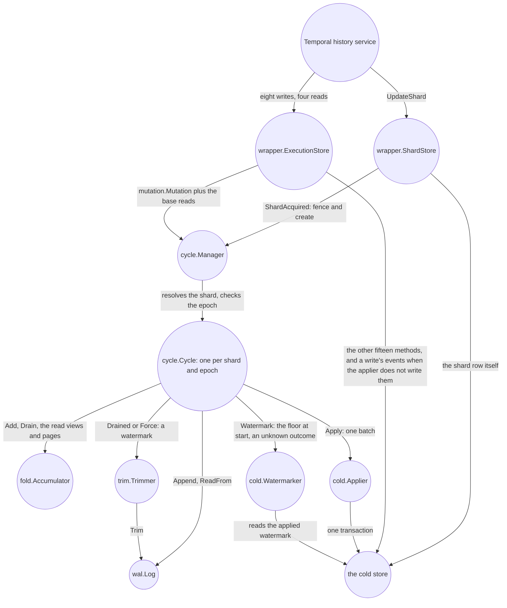
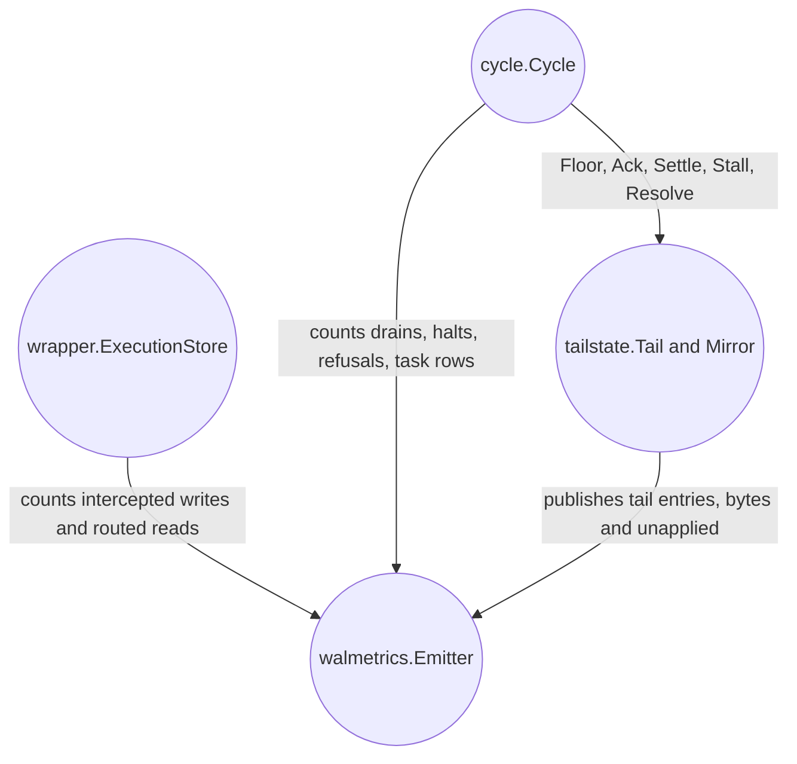
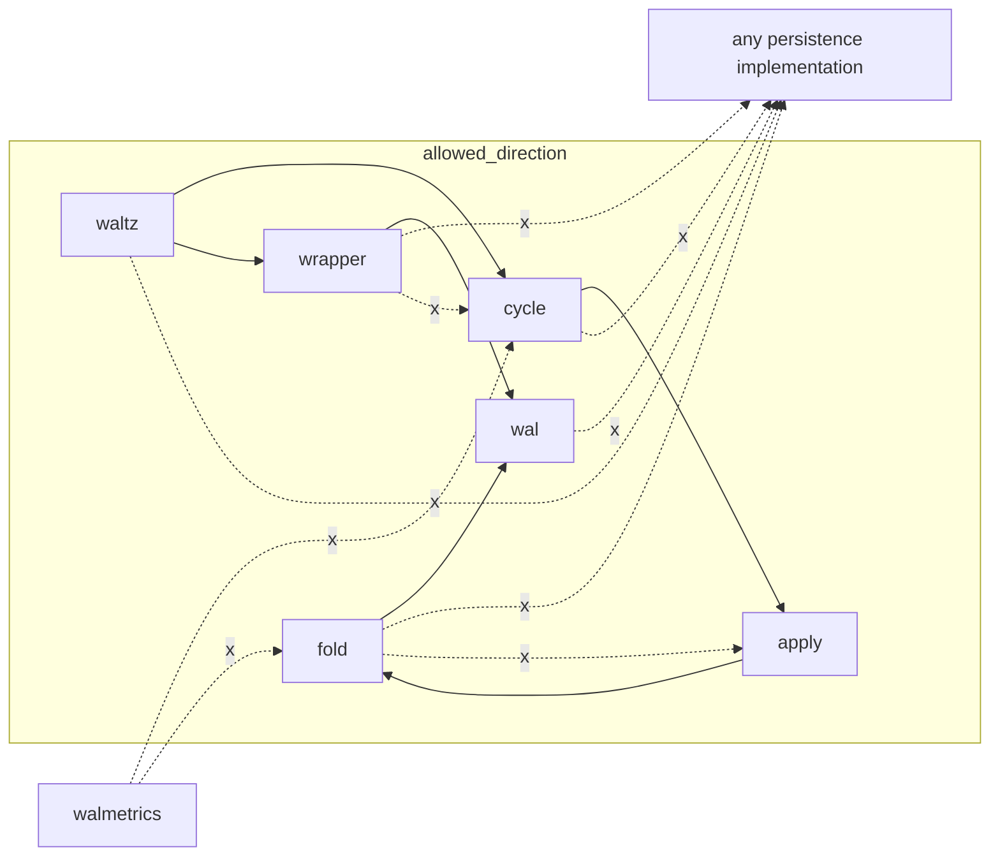
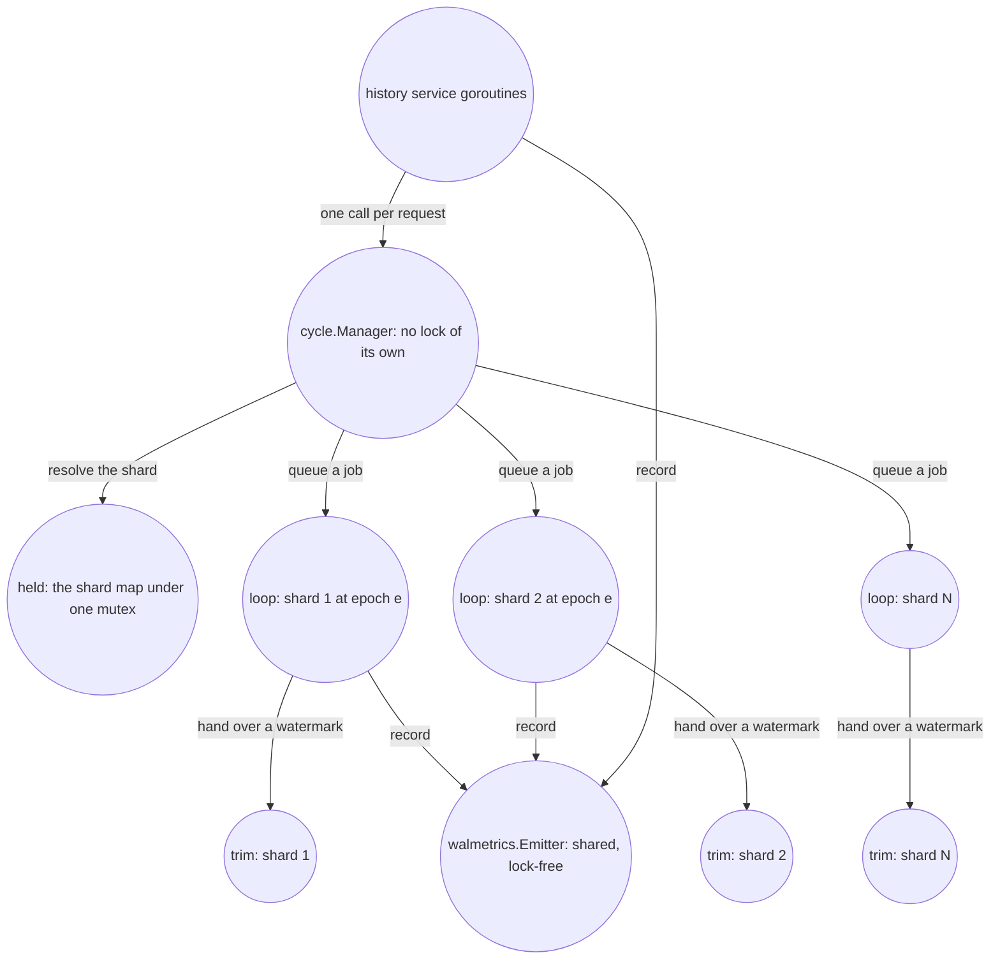

# Components: ownership, knowledge and calls

This chapter maps the layer's packages: what each one may know, who calls whom while a shard is
served, and which goroutine owns each mutable value. Chapters 05 and 06 lean on it, so keep it open
beside them.

## Run-time calls versus compile-time knowledge

A mutation crosses the same few packages at run time. The wrapper intercepts it, the cycle orders
it, the log makes it durable, `fold` compacts it, and the applier writes the result. That sequence
is not the import graph. Two different boundaries are at work, and telling them apart explains most
of the tree's shape.

A *run-time boundary* says who may call whom while serving a shard. A *knowledge boundary* says
which concepts a package may name at compile time. `cycle` calls a log and an applier, but knows no
storage: both arrive as interfaces. `fold` handles Temporal-shaped mutations, but knows no cold
store and no log. `apply` knows what a drain's outcome demands, but not the log whose entries
caused that transaction.

Each omission buys a test. `apply` names no log, so a test can vary a drain's outcome without one.
`fold` names no store, so a test can fold a generated stream with nothing running. `wal` names no
Temporal type, so a new backend is judged by the contract suite alone.

The boundaries also keep each policy with one owner. An applier that could trim the log would need
to know replay policy and the cycle's unresolved state. A `fold` that could read the store would
turn a mechanical merge into a timing-dependent one. A wrapper that could append directly would
take away the cycle's role as the single place that orders condition checks, tail accounting and
acknowledgement.

## The tree has two halves

The repository's Go code lives in two groups:

* the module root and its packages: what runs inside a production `temporal-server` process;
* `internal/verify/`: what judges it. Nothing there runs beside the layer in production.

One rule holds the split: no package outside `internal/verify/` may import a package under
`internal/verify/` in a non-test file. Such an import would put test scaffolding into the binary an
operator runs. Test files are exempt, and need to be: `fold`'s tests fold a generated stream from
`internal/verify/mutgen`, and `cycle`'s tests build mutations with `internal/verify/mutbuild` and
page tasks through `internal/verify/coldtasks`.

`cold/memcold` sits in the first group but is not part of the layer. It is a *store*, under the cold
seam where a deployment's own store sits. It is not under `internal/verify/` because it is neither a
judge nor a double: it is Temporal's own SQL persistence over an in-memory SQLite database, and a
server composed over it serves real workflows. That database dies with the process, so `memcold` is
not a production store.

Neither group holds a `main` package. waltz is a library. Its composition is handed to a
`temporal-server` main somebody else writes, through `temporal.WithCustomDataStoreFactory`.

## The packages, in dependency order

Most packages are siblings at the module root, even where one imports another: `cycle` imports
`fold`, so does `apply`, and `fold` imports neither, which nesting cannot express. A nested
directory means the parent owns what is under it, so the only packages under `cycle/` are the three
nothing outside the cycle uses: `window`, `tailstate` and `trim`. The table runs bottom-up, not in
the order a mutation travels, so the log's contract comes first.

| Package | Role, in one line | Key exported types | May not import — and why |
|---|---|---|---|
| `wal` | The log's contract: one fenced, gap-free, totally ordered sequence of entries per shard, payloads opaque. | `Log`, `Entry`, `ShardID`, `Seqno`, `Epoch`, `ErrFenced`, `ErrAlreadyWritten`, `ErrGap`, `ErrZeroEpoch`, `PressureSource`, `PressureLevel` | the Temporal server and every package above it: an implementer gets the log, not Temporal |
| `wal/memwal` | The contract in process memory: the one implementation this library ships, so everything above the log tests without a cluster. | `Backend`, `New` | the same, for the same reason |
| `wal/waltest` | The conformance suite an implementation runs, the two checks only a deployment can (reopen, retention), and `Faulty`, a log wrapped so a chosen call fails. | `RunContractSuite`, `CheckReopen`, `CheckRetention`, `Faulty`, `Fault`, `Once`, `Always` | the same, plus every implementation including `memwal`, so no backend is special-cased |
| `mutation` | What one log entry *is*: the protobuf record of one persistence call, and the eight kinds. | `Mutation`, `Kind`, `Part`, `Encode`, `Decode` | any persistence implementation: writing the record is the applier's business |
| `baserow` | The cold store's two mutable-state reads as the write path needs them: one run's row, and the current-execution row with `last_write_version` beside it. | `Store`, `Rows`, `New`, `Of`, `ErrNoVersionedRead` | any persistence implementation and the rest of the layer, so `wrapper`, `cycle` and `apply` share one copy |
| `fold` | The accumulator: a window of mutations folded into one merged request per dirty workflow, the assertions it stands on, the overlay that answers reads, the task-page and history-branch merges. | `Accumulator`, `Batch`, `Emitted`, `Stats`, `RunView`, `CurrentView`, `TaskWork`, `TaskRange`, `Delegated`, `Refusal`, `BasePage`, `HistoryBasePage` | any persistence implementation, `apply`: it folds what it is handed |
| `cold` | The cold store's contract: the applier a drain lands on, the watermarker that reads back what it committed, and the four things an implementation owes. `Store` is the pair as one value, because a watermark read from a different store than the drains landed in proves nothing. | `Store`, `Applier`, `HistoryApplier`, `Watermarker` | any persistence implementation, `cold/memcold` above all: the seam is written for an outside store |
| `cold/memcold` | The one cold store this repository ships: Temporal's own SQL persistence over an in-memory SQLite database, embedded whole, with the folded window's transaction added beside its 28 inherited methods. It sits under the layer, not in it. | `Store`, `New`, `SetWatermark`, `AbstractDataStoreFactory`, `NewAbstractDataStoreFactory` | `cycle`, `wrapper` and the root package, so it is judged only against the contract. It does import the contract's vocabulary: `fold`, `wal`, `apply`, `baserow`, `mutation` |
| `apply` | What a drain's outcome demands of its caller: the five classes an error sorts into, and the attribution a violated invariant carries. | `Class`, `Classify`, `Diverged`, `InvariantViolationError` | `wal.Log` and `wal.Entry`: pacing and trim are the cycle's policy |
| `cycle/window` | The size and age of what a cycle folded since its last drain, as a type whose counters cannot be written from outside. | `Window`, `Taken`, `Watermarks`, `Trip` | `fold`, `walmetrics`: it counts, and neither folds nor publishes |
| `cycle/tailstate` | The tail's arithmetic in one place: everything invariant [I10](02-concepts-and-invariants.md#the-invariants) bounds, plus the off-loop mirror of it. | `Tail`, `Mirror`, `New`, `NewMirror`, `WatermarkMove`, `Unresolved` | `fold`: the tail is arithmetic over what the loop acked, not over the window |
| `cycle/trim` | The lazy deletion of entries the cold store already holds: the cadence, the one trim in flight, the two counters. | `Trimmer`, `New`, `Cadence` | `fold`, `cycle/tailstate`: it is handed a watermark and reaches nothing that moves it |
| `cycle` | The state machine: one goroutine per (shard, epoch) owning the accumulator, the drain, the trim's cadence, the four reads and replay, plus the node's registry of them. | `Cycle`, `Manager`, `NewManager`, `Deps`, `Config`, `Defaults`, `Policy`, `Fixed`, `Live`, `Moving`, `State`, `Stats`, `Totals`, `Counters` | any persistence implementation: the cold store arrives only as `cold.Applier` and `cold.Watermarker` |
| `wrapper` | The seam into a running server: a decorator over a base data store factory whose `ExecutionStore` and `ShardStore` the history service talks to. | `Options`, `ShardLayer`, `ShardObserver`, `ShardWriter`, `ShardReader`, `MetricsSink`, `AbstractDataStoreFactory`, `NewAbstractDataStoreFactory`, `DataStoreFactory`, `NewDataStoreFactory`, `ErrCompleteHistoryTaskUnsupported` | any persistence implementation, `cycle`: it decorates upstream's interface, and the binary picks the base store |
| `waltz` (the module root) | The composition a server builds: the `wal` config section, the dynamic-config settings, the components they name, the lifecycle, and the factory that is the door out. | `Compose`, `Layer`, `Backends`, `Config`, `WAL`, `Parse`, `Registry`, `TaskCategories`, `DefaultTaskCategories`, `NewPolicy`, `AbstractFactory` | no persistence implementation (below) |
| `walmetrics` | Where the numbers go: the metric definitions and the emitter, on the server's own handler. | `Emitter`, `New`, and the `metrics.*Def` values (`InterceptedWrites`, `Drains`, `TailBytes`, …) | `wal`, `fold`, `apply`, `cycle`, `wrapper`, `mutation`: nothing it measures |

Four packages fold, classify and count what they are handed: `fold`, `apply`, `cycle/tailstate`
and `cycle/window`. They may use `wal`'s value types, `Seqno` above all, but may not name the
operational types `wal.Log` or `wal.Entry`. `cycle/trim` is the one sub-package that may name
`wal.Log`. That is the same rule from the other side: the trim's whole job is the log, and a package
of its own keeps `wal.Log` off `tailstate.Tail`, the type the watermark moves on.

The wrapper wraps rather than forks. Temporal itself decorates the same `DataStoreFactory` twice,
in `common/persistence/faultinjection` and `common/persistence/telemetry`: each holds a base factory
and returns wrapped `ExecutionStore` and `ShardStore` implementations, method for method. The
factory is also the only extension point a custom `main` reaches. This bounds the layer as much as
it licenses it: the layer sees what crosses the persistence interface and nothing above it. So shard
ownership has to be inferred from an `UpdateShard` rather than announced
([chapter 06](06-shard-lifecycle.md#2-use-the-ownership-token-temporal-already-has)).

Every metric series named above is in [chapter 10](10-metrics.md), and every config key in
[chapter 08](08-configuration.md).

## The component diagram — run-time calls

The first diagram shows calls at run time. An arrow means "A calls B while the process is serving",
and its label says what flows. The import rules are the next diagram, and they have a different
shape.

```mermaid
graph TD
  HS(("Temporal history service"))
  ES(("wrapper.ExecutionStore"))
  SS(("wrapper.ShardStore"))
  MGR(("cycle.Manager"))
  CY(("cycle.Cycle: one per shard and epoch"))
  ACC(("fold.Accumulator"))
  TR(("trim.Trimmer"))
  AP(("cold.Applier"))
  WM(("cold.Watermarker"))
  LOG(("wal.Log"))
  CS(("the cold store"))

  HS -->|"eight writes, four reads"| ES
  HS -->|"UpdateShard"| SS
  SS -->|"ShardAcquired: fence and create"| MGR
  SS -->|"the shard row itself"| CS
  ES -->|"mutation.Mutation plus the base reads"| MGR
  ES -->|"the other fifteen methods, and a write's events when the applier does not write them"| CS
  MGR -->|"resolves the shard, checks the epoch"| CY
  CY -->|"Append, ReadFrom"| LOG
  CY -->|"Add, Drain, the read views and pages"| ACC
  CY -->|"Apply: one batch"| AP
  CY -->|"Drained or Force: a watermark"| TR
  CY -->|"Watermark: the floor at start, an unknown outcome"| WM
  TR -->|"Trim"| LOG
  AP -->|"one transaction"| CS
  WM -->|"reads the applied watermark"| CS
```

Nothing crosses a shard boundary below `cycle.Manager`: the manager resolves a shard to its one
cycle, and everything under that cycle belongs to that shard alone. Two paths reach the cold store
through interfaces the deployment implements. `cold.Applier` is the drain's write door.
`cold.Watermarker` reads back what the last drain committed: once when the cycle starts, for the
floor it replays above, and again whenever a drain's outcome was unknown.

The wrapper's own arrows to the cold store are the transits, plus one write. Where the applier does
not declare `cold.HistoryApplier`, an intercepted write's new history events go down through the
store below before its mutation is appended, and the record carries none. Of the 28
`wrapper.ExecutionStore` methods, intercept mode answers twelve itself (the eight writes and four
reads on the diagram), refuses `CompleteHistoryTask` with
`wrapper.ErrCompleteHistoryTaskUnsupported`, and passes fifteen through
([chapter 04](04-contracts.md#wrapperexecutionstore--28-methods) has the table).

The diagram has no arrow for the two mutable-state reads the write path makes against the cold
store: `baserow.Rows.Run` for one run's row and `baserow.Rows.Current` for the current-execution
row. The cycle may not name a store, so these reach it as arguments. The wrapper passes a
`*baserow.Rows` with every write and a base closure with every read, and the cycle invokes them
inside the goroutine that owns the window.

Two components sit beside the path rather than on it.

```mermaid
graph TD
  ES2(("wrapper.ExecutionStore"))
  CY2(("cycle.Cycle"))
  TS(("tailstate.Tail and Mirror"))
  EM(("walmetrics.Emitter"))

  ES2 -->|"counts intercepted writes and routed reads"| EM
  CY2 -->|"counts drains, halts, refusals, task rows"| EM
  CY2 -->|"Floor, Ack, Settle, Stall, Resolve"| TS
  TS -->|"publishes tail entries, bytes and unapplied"| EM
```

The emitter is a sink: every arrow into it is one-way. Every mutator on `tailstate.Tail` ends in a
publish, so moving the tail publishes it, and no call site can forget the metric.

## The import diagram — compile-time bans

This diagram shows `import` statements, not calls. A dashed arrow labelled `x` is a forbidden
import. Where a rule says "may not import" rather than "may not depend on", the package may still
reach the target transitively.

```mermaid
graph LR
  subgraph allowed_direction
    W["wal"]
    F["fold"]
    A["apply"]
    C["cycle"]
    WR["wrapper"]
    N["waltz"]
    F --> W
    A --> F
    C --> A
    N --> C
    N --> WR
    WR --> W
  end
  STORE["any persistence implementation"]
  MET["walmetrics"]

  W -.->|"x"| STORE
  F -.->|"x"| STORE
  C -.->|"x"| STORE
  WR -.->|"x"| STORE
  N -.->|"x"| STORE
  F -.->|"x"| A
  WR -.->|"x"| C
  MET -.->|"x"| C
  MET -.->|"x"| F
```

Every arrow points from the importer to the package it would import. The solid arrows are legal
imports: every chain starts at the root package and ends at `wal`, which imports nothing else in
this tree. The dashed arrows are the five bans that matter most.

### `wal` may not import the Temporal server

`wal` and its implementations may not import the Temporal server. The diagram shows only part of
that rule: they may not import a persistence implementation. An entry's payload is opaque bytes,
and `wal.Log`'s five methods name no Temporal type. So an author of a log over a new backend has
one contract to satisfy, the one `waltest.RunContractSuite` drives, and never needs to learn what a
history shard is.

### `fold` may not import `apply`

`apply` names `baserow`, so a `fold` that imported it would be one hop from the cold store's rows.
Instead, an assertion the window cannot settle comes back as a `fold.Delegated`. `Delegated.Settle`
hands each obligation to the caller, which reads the row and judges it with
`DelegatedCurrent.Verify` or `DelegatedRun.Verify`. The fold is given the base row and never fetches
one.

### `wrapper` may not import `cycle`

The wrapper reaches the layer through the `wrapper.ShardWriter` and `wrapper.ShardReader`
interfaces, not a `*cycle.Cycle`. For the same reason, turning a cycle's answer into the error
types the history service understands happens in `cycle`: `write.go` holds the one write door, and
`decide.go`'s `storeError` does the translation.

### No package of the layer names a persistence implementation

The root package included. This is what makes waltz a library: the log arrives
as a `wal.Log`, the cold store as a `cold.Applier` and a `cold.Watermarker`, and the base store as
whatever factory the caller hands `wrapper.NewAbstractDataStoreFactory`. The ban matters most in
`cycle`, which holds the log, the accumulator and the write path at once. One import of a store
there would give the shard a second write path beside the one every suite judges.

The ban reads the same from `cold/memcold`, the one store in the tree: nothing in the layer may
import it, and it imports only the contract's vocabulary (its row in the package table).

### `walmetrics` may import neither end of the layer

Both the wrapper and the cycle record into `walmetrics`, so it may reach neither. A metric is
easiest to add where the number already is: an import of `fold` here would put "just read `Stats`"
one line away, and the emitter would end up holding the component it measures.

### The sub-package ban, and how the rules are kept

One more ban is about sub-packages, so it is not on the diagram: `cycle/tailstate` and
`cycle/window` may not import `fold`. A rule stated over `cycle` covers neither, which is why the
package table lists them separately. A counter type that could import `fold` would have the
accumulator's byte count one line away. Used for both, it would leave I10 bounding the window
instead of the acknowledged-but-unsettled entries
([chapter 02](02-concepts-and-invariants.md#three-positions-not-two) explains why the two differ).

None of these rules is checked by a test. They are prose with the reasoning beside each one
([chapter 11](11-verification.md#1-a-test-asserts-behaviour-never-shape) has the house rule). Where
a rule could be made mechanical, it was made a compile error instead. That is why `tailstate` and
`window` are packages: `s.tail.resolved = 0` does not build in `cycle`.

## Ownership and concurrency

### One goroutine per (shard, epoch)

`cycle.New` starts one goroutine, `Cycle.run`, and that goroutine alone owns the shard's mutable
state at that epoch:

* the `fold.Accumulator` (the window's folded contents);
* the `window.Window` (the window's mutation count, byte count and age);
* the `tailstate.Tail` (acknowledged-but-unsettled entries and their bytes);
* the drain, including the applier's transaction;
* the four reads: `GetWorkflowExecution`, `GetCurrentExecution`, `GetHistoryTasks` and
  `ReadHistoryBranch`;
* replay, on the first request after an acquire.

So the accumulator is single-threaded and needs no lock. Work reaches the loop as a `job`, a
`func(*state)` closing over its own arguments and result. This buys lock-freedom at the cost of
serialisation: everything on the goroutine waits behind the accumulator and the drain, so a job that
waits on the cold store holds up every write to the shard.

The reads run on the loop for correctness. Between a drain's start and its commit, a mutation is in
neither the window nor the store, and a read served elsewhere could return a write undone
([chapter 07](07-read-path.md#why-a-read-served-anywhere-else-is-not-merely-stale)).

### What lives off the loop

| Thing | Owner | How it is safe |
|---|---|---|
| `tailstate.Mirror` | published by every `Tail` mutator | atomics; read by `Cycle.write` *before* it queues anything, and by a retired cycle's read path |
| `Cycle.State()` | the loop writes, and `Cycle.Retire` as it stops one; anyone reads | one `atomic.Int32`, so a stopped cycle still reports the state it stopped in |
| `Cycle.finished` | written by the loop on its way out | read by `Cycle.Retire` only after the loop's `done` channel closes, which gives the happens-before without a lock |
| `trim.Trimmer` | the loop owns its cadence; each trim in flight runs on a detached goroutine beside it | handed a watermark by value. One mutex of its own covers the one trim in flight and the one follow-up queued behind it. `Trimmer.Wait` waits for it |
| `walmetrics.Emitter` | shared, one per node | every method is an atomic load and a `Record`. `Emitter.Use`, the only mutation, takes the first non-nil handler it is given |
| the shard map | `cycle.held` | one mutex, never held while calling into a `*Cycle` (below) |

Two rows need more than a table cell.

The trim runs off the loop so that a stuck log cannot stop a shard from acknowledging and applying.
It is a package of its own so that its `go` statement lives where no `*state` can be named, and the
compiler enforces the ownership rule. A failed trim halts nothing. It is logged and retried at the
next cadence, or, if storage pressure forced it, forced again while the pressure stands
([chapter 06](06-shard-lifecycle.md#7-trim-as-part-of-the-lifecycle) has the cadence).

`cycle.Manager` has no mutex of its own. The mutex belongs to the unexported `held` type, which owns
the shard map and the retired counters, and it guards against lock inversion. Every read path
resolves its shard through `Manager.Shard`, which takes that mutex. Code that held it while calling
into a cycle's goroutine would stop every shard on the node: one cycle blocked inside a base read,
and the whole registry waiting behind it. So each method on `held` takes the lock, finishes its map
arithmetic and returns. `held.totals` hands back the live cycles for `Manager.Totals` to question
afterwards. Ask a cycle for anything, `Stats` above all, outside the lock.

### The goroutines on one node

The next diagram shows every goroutine on a node and what each one touches.

```mermaid
graph TD
  SRV(("history service goroutines"))
  MGRG(("cycle.Manager: no lock of its own"))
  HELD(("held: the shard map under one mutex"))
  L1(("loop: shard 1 at epoch e"))
  T1(("trim: shard 1"))
  L2(("loop: shard 2 at epoch e"))
  T2(("trim: shard 2"))
  LN(("loop: shard N"))
  TN(("trim: shard N"))
  EMG(("walmetrics.Emitter: shared, lock-free"))

  SRV -->|"one call per request"| MGRG
  MGRG -->|"resolve the shard"| HELD
  MGRG -->|"queue a job"| L1
  MGRG -->|"queue a job"| L2
  MGRG -->|"queue a job"| LN
  L1 -->|"hand over a watermark"| T1
  L2 -->|"hand over a watermark"| T2
  LN -->|"hand over a watermark"| TN
  L1 -->|"record"| EMG
  L2 -->|"record"| EMG
  SRV -->|"record"| EMG
```

The only shared mutable state on the node is the shard map behind `held`'s mutex and the lock-free
emitter. Everything else is per shard: owned by the loop, or one of the off-loop things in the table.

### Lifetimes

* One `waltz.Layer` per process, not one per data store factory. The server calls `NewFactory` once
  per service, and each call decorates that service's factory with the same layer, so every
  service's stores share one registry. A shard's cycle carries its epoch from the acquire through
  the writes that follow, so two registries would mean two windows for one shard, each unaware of
  the other.
* `Manager.ShardAcquired` creates a `Cycle`. It fences the log at the new epoch first and starts the
  cycle second, so the log's epoch never lags the database's.
* A `Cycle` is retired by a higher epoch superseding it, by the node closing, or by a caller naming
  its epoch. The layer reaps none by itself: an acquire bumps the rangeID and is visible, but closing
  a shard makes no persistence call. So a shard the server quietly stopped serving leaves a
  goroutine and an empty accumulator until its node stops. The layer accepts this bounded leak. A
  caller that knows the shard is gone can call `Layer.RetireShard(shard, epoch)`, which retires
  without draining. The stopped cycle stays registered, reporting `halted-lost` if it was `running`,
  because its tail is acknowledged entries still in the log
  ([chapter 06](06-shard-lifecycle.md#6-stopping-a-node)).
* The layer's lifecycle brackets the server's. `waltz.Compose` runs before the server is built, so
  its startup assertions (a policy must be given, `cycle.Config.CheckBudget`, a task-category
  registry must not be nil) stop the binary rather than a shard. `Layer.Shutdown(ctx, budget)` runs
  after the server has stopped, so the shutdown drain still has a store to write to, on a budget
  detached from the caller's cancelled context
  ([chapter 09](09-operations.md#2-start-and-stop-order) has the full order).

## Where the composition happens

`waltz.Compose` builds the one graph every process running intercept mode uses, and there is no
second. It opens nothing, reaches nothing and takes no context. It takes five inputs:

* `Backends`: the log and the cold store;
* a `cycle.Policy`;
* a `waltz.Registry` of task categories;
* an optional `log.Logger`, which nil replaces with a noop;
* an optional `metrics.Handler`. Nil is the production value, because the server's own handler
  arrives after `Compose` has run (below).

This is the only door in. No second constructor opens a client from a config file. Everything that
talks to a cluster has happened before `Compose` runs, which is why it needs no context. The
backends stay the caller's and must outlive the layer. A constructor that opened storage itself
would leave two configurations of the same thing with nothing to reconcile them.

The door out is `Layer.AbstractFactory(base)`, which returns the value a custom `main` hands to
`temporal.WithCustomDataStoreFactory`. A caller that wants the pieces takes `Layer.Options()` and
builds the factory itself; `waltz.AbstractFactory(base, opts)` is that pairing as one call.

The metrics handler arrives the other way round. The server's `metrics.Handler` does not exist when
`Compose` runs, so it reaches the layer later through `wrapper.MetricsSink`: one method, `Use`,
whose first call wins, made by the factory as it builds the stores
([chapter 10](10-metrics.md#1-how-the-numbers-get-out) has the sequence). The layer does not build
its own handler from the same configuration: with the Prometheus reporter that would be a second
listener on the server's address, and one of the two would fail to start.

## `internal/verify/` in brief

Nothing here runs in production. Instruments measure or drive and assert nothing: `mutgen`,
`mutbuild`, `drive`, `foldrun`, `coldtest`, `basetest`, `coldtasks`, `checker`, `witness`.
Judgements say yes or no: `acceptance`, `e2e`, `guard`. [Chapter
11](11-verification.md#the-map-of-internalverify) says what each one claims.

None needs a cluster, because `wal/memwal` and `cold/memcold` run in this process. That lets
`internal/verify/e2e` boot Temporal's frontend, history, matching and worker services over the
layer with nothing installed. No package here has storage that survives the process, which is
where the limits in [chapter 15](15-the-limits-of-the-evidence.md) begin.

## Summary

The tree is shaped by knowledge boundaries, not by the path a mutation takes. Each package names as
little as it can, which makes a test possible and keeps each policy with one owner. No production
file imports `internal/verify/`, and the import bans are prose or compile errors, never tests.

At run time the wrapper hands intercepted calls to `cycle.Manager`, which resolves the shard's one
cycle. One goroutine per (shard, epoch) owns that shard's mutable state: a lock-free accumulator,
bought by serialising everything behind the drain. `waltz.Compose` is the door in and
`Layer.AbstractFactory` the door out. Chapter 04 states the contract at each seam.

## Where this lives in the code

* [`../../wal/wal.go`](../../wal/wal.go) — the contract's five guarantees, stated on
  `Log` and its five methods.
* [`../../cycle/cycle.go`](../../cycle/cycle.go) — `Cycle`, its `job` channel, the fields
  that live off the loop, and `Deps`.
* [`../../cold/cold.go`](../../cold/cold.go) — `Store`, its two halves, and the four
  things an implementation of them owes; [`../../cold/memcold/memcold.go`](../../cold/memcold/memcold.go)
  is the one that ships, and [`apply.go`](../../cold/memcold/apply.go) is the drain's transaction
  statement by statement.
* [`../../cycle/manager.go`](../../cycle/manager.go) — the registry the wrapper's shard
  hook talks to, and `Totals`.
* [`../../cycle/held.go`](../../cycle/held.go) — the node's one mutex, and why no method
  on it may call into a `*Cycle`.
* [`../../cycle/trim/trim.go`](../../cycle/trim/trim.go) — the trim beside the loop, and
  why it is a package.
* [`../../cycle/tailstate/tailstate.go`](../../cycle/tailstate/tailstate.go) and
  [`../../cycle/window/window.go`](../../cycle/window/window.go) — the two counter types
  whose fields the compiler protects.
* [`../../wrapper/wrapper.go`](../../wrapper/wrapper.go) — `Options`, `ShardLayer` and
  its four faces, and where the server's metrics handler enters the layer.
* [`../../waltz.go`](../../waltz.go) — `Compose`, `Backends`, `Layer.Options`,
  `Layer.AbstractFactory` and the layer's lifecycle.
* [`../../walmetrics/walmetrics.go`](../../walmetrics/walmetrics.go) — the emitter and
  every metric definition.
