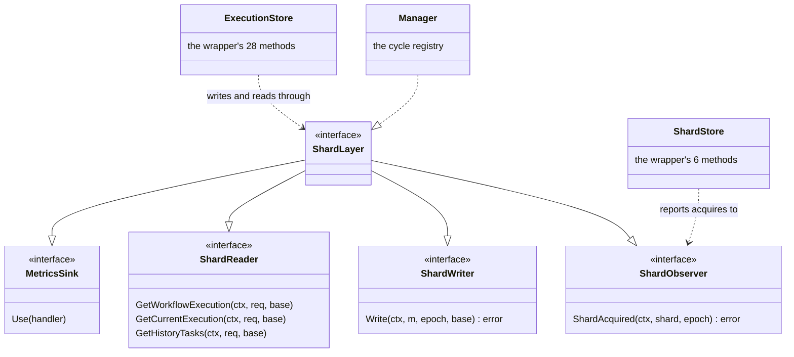
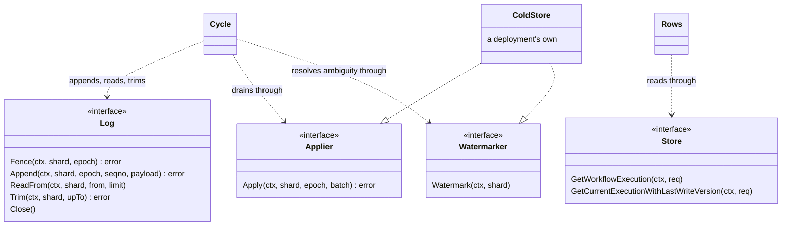

# Contracts at the failure boundaries

## What a boundary must let its caller conclude

An interface matters most when a call does not return the answer its caller wanted. Three examples
show why.

First, `Append` is cancelled while the request is in flight. The log may have committed it even
though the caller did not receive the acknowledgement. The contract must preserve that ambiguity;
inventing a definite failure would allow the caller to reuse a seqno that may already be durable.

Second, a drain returns an infrastructure error. Retrying blindly may apply the batch twice, while
discarding it may lose acknowledged writes. The applier therefore classifies what it knows, and the
cycle reads the persistent watermark when the outcome itself is unknown.

Third, a stale owner races a current owner. Reporting a mutable-state condition failure would send
the old owner down the wrong recovery path. The transaction therefore registers the epoch assertion
first, so that losing ownership outranks the failures that only make sense for an owner.

Those three failures are what give the interfaces their shape. A useful contract specifies more than successful
output. It says what may have changed on failure, which conclusions an error supports, whether the
caller must retry or stop, and which fact is authoritative after an ambiguous return. The method
tables below are the reference for those decisions.

This chapter is the reference for the interfaces themselves. For the mechanism behind them, read
[chapter 03](03-components.md) for who stands where, [chapter 05](05-write-path.md) for a write end
to end, [chapter 06](06-shard-lifecycle.md) for ownership and replay, and [chapter
07](07-read-path.md) for the overlay and the task merge. The invariants cited by number below — I1,
I2, I4, I5, I7, I9, I10 and I11 — are stated in [chapter 02](02-concepts-and-invariants.md), and the
metrics that watch them are in [chapter 10](10-metrics.md).

## The seams, at a glance

Five seams let the component on either side be replaced or run without a cluster:

| Seam | Contract | Who implements it | Who calls it |
|---|---|---|---|
| the log | `wal.Log` | `memwal` here; a deployment's own log otherwise | `cycle` |
| one entry | `mutation.Mutation` + `Encode`/`Decode` | — (a value type and a codec) | `wrapper`, `cycle` |
| the server's stores | `wrapper.ShardLayer` (four faces) | `cycle.Manager` | `wrapper.ExecutionStore`, `wrapper.ShardStore` |
| the cold store | `cold.Applier`, `cold.Watermarker` | `memcold` here; a deployment's own store otherwise, and `internal/verify/coldtest` where a suite has to vary a drain's outcome | `cycle` |
| the two pre-window reads | `baserow.Store` | `memcold` here; the base `ExecutionStore` the wrapper decorates otherwise, and `internal/verify/basetest` in tests | `wrapper`, `cycle`, `apply` |

Two of the five seams are storage, and each has exactly one implementation in this tree, running in
this process: `wal/memwal` and `cold/memcold`. Neither is a test double. Both keep the whole
contract, which is what makes a green suite above them mean something. Neither is durable, though,
and that is where their evidence stops: a deployment replaces both. Everything between them is
waltz.

The interfaces the server's stores talk to, and the one type that satisfies all four faces at once:

How to read this. The hollow triangles are interface embedding — `ShardLayer` *is* the four faces
at once, which is why a layer that cannot take a metrics handler does not compile. The dashed
triangle is implementation: `cycle.Manager` is the only production `ShardLayer`. The two stores are
consumers, and neither can reach the layer any other way.

The interfaces below the cycle, where the cold store is:

How to read this. `cycle` names no storage at all. Everything below it arrives as one of these
interfaces: the log, the applier, the watermarker, and — handed down per write rather than held —
the pre-window reads behind `baserow.Store`. That is what lets a test vary a drain's outcome without
a cluster, and it is why `memwal` can be a whole implementation of the log rather than a stub with
the interesting parts missing.

## `wal.Log` — the write-ahead log contract

### The five guarantees

Everything above the log — fold, apply, overlay, replay — depends on these and on nothing else,
which is why the log underneath can be replaced.

1. **Total order per shard.** The writer, single by virtue of epoch fencing, assigns seqnos itself.
2. **`Fence` atomically cuts off appends of all lower epochs.**
3. **Cumulative ack.** A successful `Append` up to seqno *n* means every entry ≤ *n* is durable, so
   "confirmed ⟺ seqno ≤ commitSeqno" is inherited rather than implemented.
4. **Gap-freedom.** An append never skips a seqno, so a shard's log is one unbroken run. `Trim`
   moves its lower end and `Append` its upper end; nothing puts a hole in the middle, so replay
   needs no hole tracking.
5. **Readback.** `ReadFrom` returns every entry a completed append acked and no trim has removed, in
   seqno order. `Trim` moves the log's lower end and nothing else, so what it leaves stays readable
   from that new lower end, and the shard's ownership and its next seqno survive it.

A payload is opaque bytes here: there are no Temporal types in `wal` or in its implementations.

The five are obligations a backend owes, not descriptions of what any particular one happens to do.
**Guarantee 4 is the one deliberate trade among them.** Gap-freedom rules out an entire class of
implementations: the ones that buy write throughput by letting several senders claim seqnos blind
and reconcile the holes afterwards. A log that may hold a hole forces every consumer above it,
forever, to tell "the entry was never written" from "the entry is still in flight", and the only
answer to that question is a timeout. The trade costs little, because the writer on a shard is
already single by virtue of epoch fencing: blind inserts could only ever have saved the retry that a
pipelined append pays when it arrives out of order (`wal.ErrGap`). Guarantee 4 is also the one a new
backend is likeliest to relax by accident while still passing a smoke test.

### What the contract does not say: what an append costs

None of the five guarantees says anything about what an append costs. Cost is a property of a
backend, and that is both the point of the contract and its trap: every implementation satisfies the
same five guarantees, so a cycle cannot tell a fast log from a slow one by behaviour, and nothing
above the log will report the difference. One decision therefore stays with the deployment, and this
library can neither make it nor check it afterwards: whether the log you supply is cheaper to append
to than your cold store is to commit to. If it is not, everything here works and nothing is gained.

Two obligations sit in that gap, stated here because no suite in this tree can reach them.

* **An append should be one immediate write over adjacent keys of the log's own storage** — invariant
  [I9](02-concepts-and-invariants.md#the-invariants). No index, no changefeed, no read of another
  table. A backend that satisfies the five guarantees while taking a distributed transaction per
  append is a correct log and a pointless one.
* **The log should be able to fail separately from the cold store.** A log in the same database as
  the cold store cannot: one incident is an incident of both, and the tail bound then bounds the
  consequences of a failure it cannot make asymmetric
  ([I10, at more length](02-concepts-and-invariants.md#i10-at-more-length)).

**`memwal` is an implementation and not a test double.** The obvious reason for it is that everything
above the log needs *a* log and nothing whatsoever from a cluster. The second reason is epistemic: a
suite that has only ever run against one backend cannot tell a contract from an implementation, and
may long since have been asserting the internals of the only backend it has seen. That is why every
obligation is stated once, in `waltest.RunContractSuite`, rather than in any one backend's local
tests — payload ownership and the spentness of trimmed seqnos are both stated there — and why a
backend written outside this tree is judged by running exactly the assertions `memwal` is judged by.

`memwal` therefore has no knobs and no fault-injection points. `New()` takes nothing, and
`memwal.Backend` exposes the five contract methods and nothing else, because a backend with a back
door would let a test above the log assert something no real backend has to satisfy. A caller that
needs a failing log wraps a real one with `waltest.NewFaulty`, which asks a `waltest.Fault` before
each call and delegates everything the fault admits.

**The contract has no batch, and that is a decision rather than an omission.** `Append` takes one
payload. A batch would have to say what a partial write leaves behind. Cut between two of its own
rows, it leaves the log's end mid-write, and a replay then meets `ErrAlreadyWritten`'s stated
precondition while only part of the batch is in the log — so `ErrAlreadyWritten` would stop being
the ack the contract says it is. Avoiding that costs either a fourth outcome on the contract or a
per-row header framing each entry with its batch's bounds. One entry per append makes the
half-written state unable to arise at all, and since the writer on a shard is single anyway, the
only thing it costs is the retry a pipelined append pays.

### The vocabulary

| Type | What it is |
|---|---|
| `wal.ShardID` (`uint32`) | one Temporal history shard; every shard has its own log |
| `wal.Seqno` (`uint64`) | an entry's position in one shard's log — a per-shard LSN the writer assigns itself |
| `wal.Epoch` (`uint64`) | the ownership token every append carries, identical to Temporal's rangeID (invariant I11) |
| `wal.FirstSeqno` (= 1) | the seqno of a shard's first entry; anything below it is backend bookkeeping, not an entry |
| `wal.Entry` | `{Seqno, Epoch, Payload}` — one record of a shard's log |

An epoch may grow without an ownership change, because the server renews rangeID whenever a shard
exhausts its ID range. Whoever hands epochs out owes the log a **strictly greater epoch per
acquire**: fencing cannot separate two writers holding the same epoch, and they race for seqnos and
lose.

### Method by method

| Method | Promises | Refuses | Leaves behind on failure |
|---|---|---|---|
| `Fence(ctx, shard, epoch) error` | claims the log for `epoch`, atomically cutting off every append of a lower epoch (I4); idempotent per epoch, so a restart without an ownership change may replay its acquire; entries stay and the new owner continues the log at the next seqno | a lower epoch than the one held (`ErrFenced`); epoch 0 (`ErrZeroEpoch`) | nothing — ownership included |
| `Append(ctx, shard, epoch, seqno, payload) error` | writes `payload` as the entry at `seqno`, under `epoch`; returning nil means every entry up to and including `seqno` is durable, so the caller's commitSeqno becomes `seqno` | `ErrFenced`, `ErrAlreadyWritten`, `ErrGap`; a `seqno` below `FirstSeqno`; a nil payload (an empty one is an entry); epoch 0 | none of the three errors writes anything |
| `ReadFrom(ctx, shard, from, limit) ([]Entry, error)` | up to `limit` entries at or above `from`, in seqno order; a read after a successful `Fence` sees every entry the log held when the fence took it | a non-positive `limit` | reads change nothing |
| `Trim(ctx, shard, upTo) error` | deletes entries at or below `upTo`; the log stays appendable at the next seqno and ownership stays put | nothing that is merely already absent — trimming entries that are not there is not an error | a log appendable at the next seqno, owned by the same epoch, whatever `upTo` said and whether or not it deleted anything: a failed trim is retried at the next cadence and costs a partly shorter log at worst |
| `Close()` | releases what the backend holds around the log: a connection, a lease, the goroutine some backends keep ownership alive from. Called once, after the last append and after any drain | nothing | the entries, and whoever fenced a shard owning it until that ownership expires or a successor takes it — a close is neither a drain nor a fence |

Six things the table cannot hold:

* **An ordinary append error has an unknown commit outcome.** Only the three sentinel errors promise
  that nothing was written. Any other error, including cancellation in flight, may leave the entry
  durable.
* **`from` is clamped, not refused.** A `from` below `FirstSeqno` reads from `FirstSeqno`; fewer than
  `limit` entries means the log ends there. `wal.Entries(ctx, log, shard, from, page)` is that loop
  as an `iter.Seq2[Entry, error]`: it ends at a short page, yields the zero entry with the error on a
  failed read and stops, and refuses a full page ending below the seqno it asked for — a backend
  that ignores `from` would otherwise spin until the context gave out.
* **A trim may keep the log's last entry.** A backend may keep entries it needs in order to promise
  appendability — one that checks gap-freedom against the entry below the append keeps that one. The
  seqnos it removed stay spent: an append at one is refused and writes nothing. Whether the refusal
  is `ErrAlreadyWritten` or `ErrGap` depends on how the backend keeps its position, and the contract
  picks neither, since a backend that derives the answer from its rows has deleted them.
* **Context semantics are the same for all four methods that take one.** A context already cancelled
  when the call begins is observed before the log changes, so such a call leaves the log exactly as
  it was. Cancellation *in flight* is the case the contract does not resolve: an `Append` cut off
  between the request and its ack may be durable, which is why a cancelled append counts as an
  attempt like any other. Errors caused by the context satisfy `errors.Is` against
  `context.Canceled` or `context.DeadlineExceeded`. A call that is both cancelled and malformed
  reports the argument.
* **An append is one entry, and there is no batch.** None of the three sentinels can describe a
  batch that landed only in part: each says the write is whole, one way or the other (see **The
  contract has no batch** above, under "What the contract does not say: what an append costs"). Many
  backends could carry a batch atomically — one transaction, one statement, one replicated command —
  and are not asked to, because some cannot: a log whose unit of atomicity is the row leaves a
  prefix behind when a fence lands mid-batch. A contract only most implementations can keep is not a
  contract.
* **Payload ownership runs both ways.** In: the payloads stay the caller's — no backend retains or
  reads a slice after `Append` returns, whatever it returns, so an encoder's scratch buffer may be
  reused immediately. Out: an `Entry.Payload` is the reader's to keep, aliasing neither the log's own
  state nor another entry of the same read, and never nil.

Every method is safe for concurrent use, which is not a licence for two writers: concurrent appends
to one shard race for seqnos and lose.

### The four sentinel errors

Match with `errors.Is`; implementations wrap them with context. Anything else is an ordinary error
and means a programming mistake or an infrastructure failure.

| Error | Meaning | Returned when | What the caller must do |
|---|---|---|---|
| `wal.ErrFenced` | the log is not the caller's to write — another epoch has fenced it, or the caller never fenced it at its own epoch | `Fence` at a lower epoch than the one held; `Append` under an epoch that is not the fenced one, or with no fence at all | stop writing: shard ownership is gone, or was never taken |
| `wal.ErrAlreadyWritten` | the seqno the append asked for is taken | `Append` at a seqno the log already holds | read it as the ack. After an ambiguous append it is the answer to "did it land?" — it did |
| `wal.ErrGap` | the append would leave a hole: the entry below the requested seqno is missing (guarantee 4) | `Append` whose predecessor seqno is absent | retry once the predecessor lands; it is the expected outcome of a pipelined append that arrived out of order |
| `wal.ErrZeroEpoch` | epoch 0 is the "nobody owns this" reading of an absent fence, so nothing can be claimed with it | `Fence` or `Append` with `epoch == 0` | fix the caller: it forgot to set an epoch |

**Precedence.** Where more than one applies, `ErrFenced` wins. `ErrAlreadyWritten` is an ack, and a
zombie handed one would take the word of the writer that took the shard from it as its own
commitSeqno. Because an append writes one entry, `ErrAlreadyWritten` is an ack without
qualification: the seqno is taken or it is not, and there is no half of it for the answer to be
about. The precedence costs the caller one thing. A writer whose epoch grew across an ambiguity is
answered `ErrFenced` rather than the ack, so it must replay under the epoch it holds now, or read
the log, to learn whether the first attempt landed.

Backend authors do not re-derive any of this. [`wal/refuse.go`](../../wal/refuse.go) holds the
argument checks — `CheckFence`, `CheckAppend`, `CheckRead` (which also returns the clamped start
seqno) and `CheckTrim` (which answers whether the trim reaches any entry at all) — and the diagnosis
in the contract's own order: `FenceRefusal`, and `AppendRefusal` over an `AppendState{Owner, Taken,
HasPredecessor}`. `RefuseAtNext` is `AppendRefusal` for a backend that keeps the seqno its log
continues at instead of answering `Taken` and `HasPredecessor` separately. A backend that diagnoses
in its own order answers a different contract.

## `mutation` — what one entry is

One `mutation.Mutation` is **one `ExecutionStore`-level write request and the unit of atomicity**:
one mutation is one WAL entry (invariant I1). It is a struct of eight pointer fields of which
exactly one is set; `Mutation.Kind()` reports which, and `KindInvalid` is what a mutation holding
none or several reports. Every caller fanning out over the kinds wraps the single error
`mutation.ErrNotExactlyOneRequest`, so one `errors.Is` matches them all.

The kinds, read off `mutation/kinds.go` — eight of them plus `KindInvalid`, with
`mutation.KindCount` one past the last:

| Kind | `Kind.String()` | The request it carries | Carries a rangeID | Carries new history events |
|---|---|---|---|---|
| `KindCreate` | `create` | `InternalCreateWorkflowExecutionRequest` | yes | yes (1 slot) |
| `KindUpdate` | `update` | `InternalUpdateWorkflowExecutionRequest` | yes | yes (2 slots) |
| `KindConflictResolve` | `conflict-resolve` | `InternalConflictResolveWorkflowExecutionRequest` | yes | yes (3 slots) |
| `KindSet` | `set` | `InternalSetWorkflowExecutionRequest` | yes | no |
| `KindDelete` | `delete` | `DeleteWorkflowExecutionRequest` | no | no |
| `KindDeleteCurrent` | `delete-current` | `DeleteCurrentWorkflowExecutionRequest` | no | no |
| `KindAddTasks` | `add-tasks` | `InternalAddHistoryTasksRequest` | yes | no |
| `KindRangeCompleteTasks` | `range-complete-tasks` | `RangeCompleteHistoryTasksRequest` | no | no |

What each kind *claims about the store* is a separate axis. It is derived per kind and per mode in
`fold/assert.go`, and asserted at the drain in the order the applier registers them — the current
row before the run rows — beside the epoch CAS every drain carries anyway:

| Kind | What it asserts about the current row | What it asserts about run rows |
|---|---|---|
| `KindCreate` | it must not exist (`BrandNew`); or it names `PreviousRunID` at `PreviousLastWriteVersion` (`UpdateCurrent`); nothing at all, and no write to it, under `BypassCurrent` | the new run must not exist |
| `KindUpdate` | it names the mutated run (`UpdateCurrent`); it does not name it (`BypassCurrent`); nothing under `IgnoreCurrent` | the mutated run at `DBRecordVersion − 1`, plus a must-not-exist for the second run a continue-as-new carries |
| `KindConflictResolve` | it names the run the store believes current — the mutated current run where there is one, the reset run otherwise (`UpdateCurrent`); or it does not name the reset run (`BypassCurrent`) | the reset run at its version, a current-run mutation at its own, and a must-not-exist for a new run |
| `KindSet` | **nothing** — a set is a repair of one run's state, not a claim about which run is current | the run at `DBRecordVersion − 1` |
| `KindDelete`, `KindDeleteCurrent`, `KindAddTasks`, `KindRangeCompleteTasks` | nothing | nothing |

Deleting a workflow is **not one atomic operation at this boundary**. `KindDelete` and
`KindDeleteCurrent` are independent mutations, and the fold handles either alone: a call arriving on
its own must fold to what the sequential path would have done for that one call. The ordinary
deletion flow does send both, but that pairing is a property of the server and the layer depends on
none of it — a fold rule phrased as "a delete always comes with a delete-current" would be a piece of
Temporal's semantics living inside the layer.

Four accessors carry every consumer:

* `ShardID() int32` is the routing key: one shard is one log and one apply transaction. It answers 0
  for `KindInvalid`.
* `RangeID() int64` is the epoch the caller wrote under. It is read off the request and **never**
  carried in the payload.
* `TaskSlot(part)` returns one part's history-task map, and `TaskSlots()` every one the request
  carries, in `PartSnapshot`, `PartNewSnapshot`, `PartMutation` order. The pointer aliases the map's
  home in the request, so callers such as a range delete write through it, and the order is part of
  the contract because callers concatenate the slots.
* `EventSlots()` returns every slice of new history events the request carries, in the order they
  must reach the store. The payload drops these, so **whoever writes a mutation writes the events
  first**: a mutation acked over history nodes nobody wrote is a mutable state the cold store can
  never be brought to.

The codec is four functions. `Encode(m)` and `EncodeProvisional(m)` produce a payload;
`Decode(payload, registry)` and `DecodeEntry(payload, registry) (Mutation, bool, error)` read one
back. The bool `DecodeEntry` returns is the provisional flag, and it tells replay that a condition
failure on this entry is a drop rather than a halt. Windowed writes use `Encode`, because their
conditions are decided before the append. Sync mode uses `EncodeProvisional`, because its drain
answers the caller directly, so replay may safely drop an entry whose delegated condition later
fails.

Two errors are the caller's to handle. `Decode` returns `ErrUnknownCategory` when an entry names a
task category this process does not have; fail the replay rather than skip the group, which would
drop that group's tasks silently. `Encode` returns `ErrCassandraBlob` when a CHASM node — a component of the server's newer
state-machine framework, which persists its own blobs alongside the mutable state — carries a
Cassandra-encoded blob that the record has no field for. What the record is a mirror of, and why
that matters, is the next section.

The registry is a parameter rather than a package default because it is the one input that is not a
function of the bytes: the same payload decodes on one node and fails on another. `Encode`, by
contrast, is a function of its argument alone — collections travel as repeated entries in sorted key
order, so the same mutation always encodes to the same bytes, in this process and in every other.
`Decode` rejects a payload whose `format` is not this build's, and rejects unknown protobuf fields
anywhere in the tree, because an entry written by a newer codec would otherwise replay silently
short a piece.

### Why the record is a hand-written mirror

The record mirrors the persistence request structs field for field. It is explicit because no
reflective encoder survives those structs: the `Tasks` map is keyed by `tasks.Category`, which
marshals and does not unmarshal, and `gob` refuses the type outright.

**The cost is precise: a field Temporal adds is a field this format silently omits** — the encode
compiles, the entry is durable, and state has stopped travelling. That cost is paid by a guard
rather than by attention: `TestFieldSetGuard` in `mutation/fieldset_test.go` walks `reflect`
over every mirrored request struct and fails on a field with no recorded decision. A decision is one
of *carried*, *derived* or *dropped*, with a reason required for the last two. Which structs it
walks is decided by `kinds.go` rather than by a hand-kept list, and
`TestEveryKindsRequestStructIsWalked` holds it to that. A Temporal bump that adds a field is
*expected* to fail this test; that failure is the mechanism. The guard holds two things and a bump
usually trips both: the per-field decisions, and a `fingerprint` — one hex digest per request struct,
recorded in `mutation/fieldset_test.go` — that catches a struct changing shape without a field being
named. Recording the new digest is never the fix on its own; the field it moved needs a decision.

## `fold` — the exported surface

A window of those entries folds into one accumulator. Every section after this one names its types,
so it comes before them.

`fold.New(shard) *Accumulator` folds one shard's window. It is **not safe for concurrent use**: the
shard's single-threaded apply loop owns it. `Add(seqno, m)` either folds the mutation as a whole or
returns an error, leaving the accumulator exactly as it was. It also **takes ownership of what it is
handed**, because requests are merged in place, so a caller that needs the mutation afterwards must
copy it first. Seqnos must be strictly increasing across drains: one accumulator follows one log.

Three errors partition what `Add` can refuse:

| Error | What it reports |
|---|---|
| `ErrAfterTombstone` | a mutation on a run the window already deleted. `Check` refuses such a mutation before it is acked, so a log that still produces one is corrupt |
| `ErrInvalidStream` | a mutation that cannot follow the window's mutations in any acked stream: a create of a run the window holds live, or a second continue-as-new out of the same run |
| `ErrRefused` | a *valid* window this accumulator cannot express as merged requests. One shape of it is an assertion on a current row a delete-current has already tainted: that delete asserts nothing, so an assertion recorded past it would be a mid-window claim dressed as a head-of-window one |

Only `ErrRefused` has a recovery, and it is always the same one. The accumulator is left exactly as
it was, so the caller drains and starts the refused mutation on a fresh window. `AddOrDrain(seqno,
m, drain)` and `CheckOrDrain(m, drain)` are that recovery written once. Both answer with a
`Refusal{Drained, DrainFailed}`, where `Drained` says the window was closed to make room and
`DrainFailed` says the error is the drain callback's own — already classified, so a caller that
type-switches on it must not read it as a fold invariant violation.

**The condition authority.** `Check(m) (Delegated, error)` reports what the store would have
answered, as far as this window determines it. It is read-only on the accumulator, which is what
makes a refusal safe to retry. A nil error does **not** mean every assertion held; it means nothing
this window determines refuses the mutation. The assertions that stand on the pre-window row come
back in `Delegated{Current *DelegatedCurrent, Runs []DelegatedRun}` instead. `Any()` reports whether
the mutation costs a cold-store read at all. `Settle(current, run)` hands each obligation to a
caller that can read the row, in the plugin's own registration order — the current row before the
run rows — and stops at the first non-nil answer. The predicates that come with the obligations are
`DelegatedCurrent.Verify(base, lastWriteVersion)` and `DelegatedRun.Verify(base)`.

**The overlay.** `ViewRun(namespaceID, workflowID, runID) RunView` and `ViewCurrent(namespaceID,
workflowID) CurrentView` are the whole of what a reader branches on: `RunView.Shape` is one of
`RunAbsent`, `RunSnapshot`, `RunDelta`, `RunTombstone`, and `CurrentView.Shape` one of
`CurrentUnheld`, `CurrentWritten`, `CurrentGone`, `CurrentGuarded`; `NeedsBase()`, `Held()` and
`Render(base)` are the rest. A view is valid only until the next mutation folds in. What each shape
means for an answer is [chapter 07](07-read-path.md).

**The drain.** `Drain() Batch` emits the window and resets the accumulator. Only `Drain` builds a
`Batch`, which is why apply's write path can stand on what a batch guarantees instead of re-deriving
it: requests in tail-seqno order, one shard (`Shard()`), and a `Watermark()` at or above every seqno
they carry.

Every request in a batch names a `WorkflowRecord`, which holds the workflow's head-of-window
assertion (`Current`), the current row the window would write (`CurrentWrite`) and whether the
window's net effect was to remove that row (`CurrentRemoved`). Orphaned tasks appear only on a
tombstone: they are the tasks of the mutations the tombstone collapsed. The `Delete` has no task
slot of its own to hold them, and losing them would break I7.

`Batch` also answers `Empty()`, `Len()`, `Stats()`, `Settles() (wal.Seqno, bool)`, `Tasks()
TaskWork` and `Each() iter.Seq[*Emitted]`; `Settles` is false for a window that folded nothing at
all. One `Emitted` is one merged request — `NamespaceID`, `WorkflowID`, `HeadSeqno`, `TailSeqno`,
`Request`, `BufferedBatches`, plus `RunAssertions()`, `OrphanedTasks()`, `Workflow()` and
`FirstOfWorkflow()`. `TaskWork` is the shard-level half beside them, because a task names no run and
asserts nothing.

**Buffered events are the one collection that does not merge**, and the reason is a shape in the
request rather than a policy: a mutation has exactly one `NewBufferedEvents` slot, so two mutations
in a window carry two independent batches with no way to express both in one request. The accumulator
strips each blob out of the merged request — whose own slot is therefore always nil — and appends it
to a per-run list; `Emitted.BufferedBatches` is that list in arrival order, each batch carrying the
run that produced it. An applier spreads it across rows, one buffered-events row per batch under a
freshly minted event id that nothing ever reads back. A window whose merged state came out a
*snapshot* has no mutation to put a batch in at all, which is why the batch carries its own run id
rather than reading it off a request that may not be there.

`Accumulator.TaskPage(req, base BasePage)` is the merge-on-read. `BasePage` is `func(batch int,
token []byte) ([]p.InternalHistoryTask, []byte, error)`: a batch size and a token rather than a
request, since those are the only two things the merge decides — the range, the category and the
shard stay the caller's. The token is the base's own bytes, passed through unparsed, and a
zero-length one back means the base is exhausted. The base is called at most once per page, and not
at all once its token says it is exhausted. Its error is returned unwrapped and never swallowed,
because a page that quietly omitted the store's rows would lose them.

## `wrapper` — the method tables

The mode switch is exactly one field, `wrapper.Options.Layer`: nil is passthrough, non-nil is
intercept. `Options.Metrics` is a `*walmetrics.Emitter` and nil records nowhere.

### `wrapper.ExecutionStore` — 28 methods

Eleven are answered differently in intercept mode and a twelfth is refused; passthrough changes
none.

| Method | Disposition in intercept mode |
|---|---|
| `CreateWorkflowExecution` | intercepted — one log entry (`KindCreate`) |
| `UpdateWorkflowExecution` | intercepted — one log entry (`KindUpdate`) |
| `ConflictResolveWorkflowExecution` | intercepted — one log entry (`KindConflictResolve`) |
| `SetWorkflowExecution` | intercepted — one log entry (`KindSet`) |
| `DeleteWorkflowExecution` | intercepted — one log entry (`KindDelete`) |
| `DeleteCurrentWorkflowExecution` | intercepted — one log entry (`KindDeleteCurrent`) |
| `AddHistoryTasks` | intercepted — one log entry (`KindAddTasks`) |
| `RangeCompleteHistoryTasks` | intercepted — one log entry (`KindRangeCompleteTasks`) |
| `GetWorkflowExecution` | answered from the layer — the overlay, with the base read handed down as a closure |
| `GetCurrentExecution` | answered from the layer — the overlay |
| `GetHistoryTasks` | answered from the layer — the task merge |
| `CompleteHistoryTask` | **refused** with `wrapper.ErrCompleteHistoryTaskUnsupported` |
| `Close`, `GetName`, `GetHistoryBranchUtil` | transit |
| `ListConcreteExecutions` | transit |
| `PutReplicationTaskToDLQ`, `GetReplicationTasksFromDLQ`, `DeleteReplicationTaskFromDLQ`, `RangeDeleteReplicationTaskFromDLQ`, `IsReplicationDLQEmpty` | transit |
| `AppendHistoryNodes`, `DeleteHistoryNodes`, `ReadHistoryBranch`, `ForkHistoryBranch`, `DeleteHistoryBranch`, `GetHistoryTreeContainingBranch`, `GetAllHistoryTreeBranches` | transit |

That is 8 intercepted writes + 3 reads answered from the layer + 1 refusal + 16 transits = 28.
`ErrCompleteHistoryTaskUnsupported` is a `serviceerror.NewUnimplemented`: the log's deletion record
is a range per category, not a key, and a second deletion shape would be another thing every reader,
drain and replay has to agree about. A range is also the shape the caller already has: a queue
checkpoint is a `[old, new)` interval, and the log's deletion record is that checkpoint restated.
Its one caller is the admin handler's `RemoveTask`, and that caller is already unreliable against an
intercepting node — a delete forwarded to the cold store for a task still sitting in the window
finds no row, removes nothing and reports success. The choice is between a refusal an operator sees
and a success an operator believes. On a node in intercept mode the admin remove-task API is
therefore unavailable, by design rather than by omission.

Obligations of the intercepted path, which the store discharges:

* **The events go down first.** Every intercepted write calls `AppendHistoryNodes` on the base store
  for each of the mutation's `EventSlots()` *before* the mutation reaches the log.
* **Errors are returned exactly as they arrive.** `ContextImpl.handleWriteErrorLocked` in the
  history service type-switches on concrete values, so one `%w` would turn an expected condition
  failure into a background re-acquire.
* **Construction can fail.** `NewExecutionStore(base, opts)` returns `baserow.ErrNoVersionedRead`
  when intercept mode is asked for over a base store that cannot read a current row's
  `last_write_version`. The refusal happens where the server is still starting and can be told what
  its store is missing, rather than at the first create of the first workflow.

`ExecutionStore.Counts() Counts` reports what the store itself saw: `Intercepted` (mutable-state
writes that took the WAL path), `TasksWritten` (`AddHistoryTasks`), `TasksCompleted`
(`RangeCompleteHistoryTasks`), `Overlaid` (mutable-state reads routed through the layer) and
`TaskReads` (`GetHistoryTasks` pages routed at the merge). Every field counts on the way *in*, so a
write the tail refused is included in the count, and all are zero in passthrough mode.

### `wrapper.ShardStore` — 6 methods

| Method | Disposition |
|---|---|
| `UpdateShard` | observed, then transits — the layer's only window onto shard ownership |
| `Close`, `GetName`, `GetClusterName` | transit |
| `GetOrCreateShard` | transit |
| `AssertShardOwnership` | transit |

`UpdateShard` calls `ShardObserver.ShardAcquired` **before** delegating, and only when
`request.RangeID != request.PreviousRangeID`. The history service sends `UpdateShard` from two
places with the same shape and different meaning, and labels neither: `renewRangeLocked` sends
`RangeID = PreviousRangeID + 1` on an acquire or a rangeID exhaustion, and `updateShardInfo` sends
`RangeID == PreviousRangeID` as a heartbeat. Comparing the two fields is the whole of the
distinction. The test is inequality rather than "greater than", so a rangeID that went backwards
reaches the observer to be refused instead of passing as a heartbeat. An error from the observer
fails the acquire without the base store being called, so a failed fence never leaves a moved
rangeID behind.

Two of the transits are worth naming. `GetOrCreateShard` looks like the acquire signal and is not
one: it runs on first load only, and the admin `GetShard` API calls it with no shard context behind
it. `AssertShardOwnership` does probe the epoch, but dynamic config can switch off the shard
controller loop that drives it, so nothing may be keyed on it.

### The wrapper's own interfaces

* **`ShardObserver`** — `ShardAcquired(ctx context.Context, shard wal.ShardID, epoch wal.Epoch)
  error`. The epoch is the new rangeID (I11). `ShardAcquired`'s error reaches the shard controller
  unwrapped. Nothing reports the other direction: closing a shard makes no persistence call.
* **`ShardWriter`** — `Write(ctx context.Context, m mutation.Mutation, epoch wal.Epoch, base
  *baserow.Rows) error`. The mutation names its own shard. **The layer takes ownership of `m`'s
  request**: in a windowed mode it is retained past this call and the drain stamps its rangeID, so a
  caller may not read or reuse it once `Write` has returned. `epoch` is the rangeID the caller wrote
  under, so a write from a fenced-out shard context is refused rather than re-stamped with this
  node's epoch; zero means "the caller named no epoch", not "epoch 0" — the two deletes and the
  range delete carry none, and the drain's own epoch CAS fences them instead. The error is the
  store's own — condition failure, fenced shard, tail at its bound — and comes back unwrapped. In a
  windowed mode a condition failure is this caller's own, because fold's `Check` decides it before
  the entry is appended; under `Sync` the drain decides it, and the window is one mutation, so it is
  this caller's there too. `base` is called inside the goroutine that owns the window, at most once
  per asserted row.
* **`ShardReader`** — three reads, each taking the caller's request and the cold store's own answer
  as a closure, so the layer decides whether to call it. `GetWorkflowExecution` and
  `GetCurrentExecution` take `base func(context.Context) (…, error)`; `GetHistoryTasks` takes `base
  func(context.Context, *p.GetHistoryTasksRequest) (…, error)`, because the merge asks a different
  question than the caller did — `BatchSize` minus what the window contributes, resumed from the
  base's own token. The token it returns is this layer's, carrying the base's token inside it. The two
  mutable-state reads fall through to the base for a shard the layer does not hold; the task read is
  **refused** there instead, because its one caller would otherwise ack past a page missing tail entries.
  Errors come back unwrapped.
* **`MetricsSink`** — `Use(h metrics.Handler)`. Called with the handler the server gave
  `NewFactory`, before the stores it built have served anything, and once per persistence graph: an
  implementation takes the first handler and ignores the rest.
* **`ShardLayer`** — all four faces at once. One interface rather than four fields, because every
  half-composed layer fails quietly: a writer with no reader reads stale, a write path never told
  about an acquire refuses every write for that shard, and a layer nobody handed the metrics handler
  to emits nothing while every suite stays green. The acquire case is the one that most repays the
  shape. Seen from outside, "never told about the acquire" is indistinguishable from lost ownership,
  so the layer cannot report it as a misconfiguration and the caller reacts by re-acquiring. For the
  same reason there is no separate "the layer is on" flag: a flag and a nil layer could come to
  disagree, and one of the two would have to win silently.

## `apply` — what a drain's outcome demands

The drain itself is a deployment's to write. `cold.Applier` is one method —
`Apply(ctx, shard, epoch, batch) error` — and it must write the batch's merged requests, the epoch
compare-and-swap and the applied watermark in **one all-or-nothing transaction**. Nothing here can
check that, and every invariant downstream of the ack rests on it.

The `apply` package is the vocabulary the answer comes back in: the classes an `Apply` error sorts
into (`Classify`), the attribution a violated invariant carries (`Attribute`), and the marker an
applier puts on a refusal of its own (`Refuse`). It writes nothing itself.

`fold.Accumulator.Drain` establishes what a batch is internally consistent about — tail-seqno order,
one shard, a `Watermark()` at or above every seqno it carries — and nothing else can build a
`fold.Batch`, so an applier need not re-derive any of it. In return, an applier must mark its own
refusals. `apply.Refuse(err)` wraps an error raised **before** anything was sent to the store, and
that wrapper is what makes `Classify` answer `ClassRefused`. An unmarked pre-flight refusal is read
as an unknown outcome, and the shard then goes looking for a transaction that never existed.

The requests carry no epoch. The applier stamps it, from the epoch it was handed.

### What a drain asserts, and what it must not

Two negative rules carry the tombstone path. Neither shows up in the assertions a drain does
register, and both are obligations on the applier.

**A drain asserts nothing about a row it deletes.** The ordinary shape of a batched conditional
write is this: the store evaluates every assertion, then gates every write statement on "no
assertion failed". That is what lets one transaction carry a conditional write at all, and it turns
a single failed assertion into a transaction that commits having written nothing. An assertion about
a row the same transaction removes can fail exactly that way, and silence every statement after it.
So the rows a batch deletes must be gathered **before** the first request is driven: the row a drain
deletes may be deleted by a *later* request than the one that would have asserted it. What a
tombstone stands on is the epoch CAS and nothing else — still strictly more than the sequential
delete asserts.

**The delete-current guard stays a guard.** `DeleteCurrentWorkflowExecution` removes the row only if
it names the run the request carries, and that guard is never synthesised into an assertion. A
mismatch is ordinary traffic rather than divergence: the sequential path evaluates it at its own
position in the stream, where it just means "nothing to delete". Asserting `current == run` at the
drain would turn that legal no-op into a false invariant violation, which is a halted shard. It also
asks a different question at a different time, because a folded window's assertions are all
head-of-window and are evaluated before any statement runs. Where the window itself wrote the row it
is deleting (`fold.WorkflowRecord.CurrentRemoved`), no guard is passed at all: the guard asks about
the pre-window row, and the window already knows what it held.

A third rule is about the shape of the query rather than its assertions: **a drain's statement text
must be a function of assertion kinds and delete families, never of how many mutations the window
folded.** Why that is a requirement rather than a nicety is [chapter
13](13-designs-that-were-rejected.md#a-folded-window-as-a-concatenation-of-the-stores-own-queries).

### `apply.Class` — sorting the outcome

`Classify(err) Class` is how a cycle sorts what `Apply` returned. Anything it cannot prove refused,
fenced or condition-failed is an unknown outcome: calling a commit a failure is how a batch gets
applied twice.

| Class | `String()` | What happened | What the caller must do |
|---|---|---|---|
| `ClassCommitted` | `committed` | the drain committed, watermark included | continue |
| `ClassRefused` | `refused` | the applier refused before anything reached the store (matches `errors.Is(err, ErrRefused)`, which is what `apply.Refuse` marks) | there is no outcome to recover, only an input to fix |
| `ClassShardLost` | `shard lost` | the epoch CAS failed — a `*p.ShardOwnershipLostError` | stop writing under this epoch; do not retry the drain |
| `ClassInvariantViolated` | `invariant violated` | a version or current-row assertion failed | halt the shard, do not retry. Under fencing this layer is the shard's only writer, so a failed assertion is a broken invariant and not contention. The exception is the drain's own `callerRule`: a one-mutation sync window answers its caller instead, and a replayed provisional entry is dropped. The cycle picks between the three |
| `ClassUnknownOutcome` | `unknown outcome` | an ambiguous code reached the cycle; the transaction may or may not have committed | read the watermark before anything else; re-folding by version instead corrupts |

The three assertion-failure types `Classify` recognises are Temporal's own —
`*p.WorkflowConditionFailedError`, `*p.CurrentWorkflowConditionFailedError` and
`*p.ConditionFailedError` — so an applier that reports a failed assertion the way the persistence
interface already does needs to do nothing else to be classified correctly.

### `*apply.InvariantViolationError` — the attribution

A store's own condition failure reports one failing assertion and names no workflow.
`apply.Attribute(ctx, rows, cause, shard, batch)` reads back every row the drain asserted and builds
the error that does name them. It reads only, and **it must run after the transaction, never
before**: a base row read before the epoch is held can see a previous owner's in-flight transaction
land underneath it, and the divergence it would then report is not a bug.

| Field | What it holds |
|---|---|
| `Cause` | the store's own condition failure, as it reached the classifier; `Unwrap` returns it |
| `Diverged []Diverged` | every row the readback found to differ from what fold asserted. It can be empty — the divergence may have been repaired between the transaction and the readback — which changes nothing about the class |
| `CutSeqno` | the highest seqno a partial re-drain may acknowledge: one below the lowest entry answering for any diverged row. **Zero means nothing may be acknowledged**, and covers three cases that demand the same thing — no divergence found, the window's first entry diverged, and a failed readback. The field is forensic: no code re-drains partially today, so what it carries is what an operator or a future partial re-drain would be entitled to |
| `ReadbackErr` | set when the attribution read itself failed; `Diverged` is then incomplete |

One `Diverged` names one row, with four parts:

* `NamespaceID`, `WorkflowID` and `RunID` — the last is empty when the row is the workflow's
  current-execution row;
* `AssertedBase` and `ActualBase`, both −1 when there is no version to report: a must-not-exist
  assertion, an absent row, or any current-row divergence;
* a `Detail` that always says what was asserted and what the cold store holds;
* the `HeadSeqno` and `TailSeqno` of the window slice answering for the row.

### The recovery rule the watermark exists for

`cold.Watermarker` is one method — `Watermark(ctx, shard) (wal.Seqno, bool, error)` — and it is the
only read this layer makes through the `cold` seam. It is not the layer's only read of the cold
store — the cycle drives `baserow.Rows.Run`, `baserow.Rows.Current` and `fold.BasePage` against it
too — but those go through the base store the wrapper decorates. The rule it exists for is: **after an
unknown outcome, read `appliedSeqno` before anything else, whatever the drain appeared to do.**

The watermark rides the drain's own transaction, so it moved if and only if the batch committed, and
nothing else can tell you. The weaker statement of the same fact is this: **a drain whose assertion
failed may still commit.** Where every statement of the transaction is gated on "no assertion
failed", a refused drain and a drain that never ran leave byte-identical state, and there is nothing
to roll back. The single bit an ambiguous transport code leaves unknown is whether the commit
landed, and the watermark is the only place that bit is recorded.

Read the answer like this. At or above a drain's seqno means that drain committed; below means it
did not; `ok` false means no drain ever committed for the shard. The caller owns seqno discipline
(I5): the seqno asked about must name one drain and no other. And "it did not commit" is **not** an
instruction to re-apply — the window is already drained, so a batch rebuilt from it would stand on
mutated state.

What happens to the acknowledged writes in that batch, then, is the question this rule leaves open,
and the answer is that they are still in the log. A shard that reads its watermark below the drain
it was asking about halts on the invariant side, which keeps the entries and stops the trim, so the
next owner replays them — [chapter 05](05-write-path.md#7-failed-drain--the-outcome-could-not-be-read)
follows that path and [chapter 06](06-shard-lifecycle.md) has the halt.

One obligation on the composition rather than on either interface: **the `Applier` and the
`Watermarker` must be the same cold store.** A writer moving one watermark while a watermarker reads
another answers every ambiguous drain with "it did not commit", which halts a shard over a drain that
had written. `memcold.Store` and `internal/verify/coldtest.Cold` are each one value satisfying both, for
exactly that reason.

### The implementation shipped at this seam

`cold/memcold` is the one cold store in this tree, and it is Temporal's own. `memcold.Store` embeds
the `persistence.ExecutionStore` that `sql.NewFactory` vends over a SQLite database living in this
process — `modernc.org/sqlite`, pure Go, so no cgo, no container, no port and no file — and shadows
none of that store's 28 methods. The schema, the row layouts, the serialisation and the error
classes are upstream's. Beside them it adds the three things Temporal has no method for: `Apply`,
the folded window's single transaction; the watermark, as the method `Watermark` and the
package-level `SetWatermark(ctx, tx, shard, seqno)` an applier calls inside its own transaction,
over a `waltz_watermarks` table of memcold's own; and `GetCurrentExecutionWithLastWriteVersion`, the
one read `baserow.Store` asks for beyond the standard interface.

The reason to embed rather than write one is not economy. A history shard's store is the hardest
thing here to get right and the easiest to get *plausibly* wrong, and a store this repository wrote
would be judged by this repository's opinion of what a store owes. Temporal's four exported
persistence suites — `NewShardSuite`, `NewExecutionMutableStateSuite`,
`NewExecutionMutableStateTaskSuite`, `NewHistoryEventsSuite` — judge this one exactly as they judge
a plugin. Writing 28 correct methods to obtain one new one is a cost with no payer.

**The transferable part is where the transaction is opened.** `persistence.ExecutionStore` has
nowhere to declare a write spanning many workflows, so the store keeps the `sqlplugin.DB` handle
beside the embedded interface and calls `BeginTx` on it. An implementer whose driver offers nothing
below the per-workflow interface cannot satisfy this contract by trying harder inside it, and should
say so rather than land a batch in pieces.

Two orderings inside that transaction are the contract rather than transcription, and an engine that
reorders a transaction's statements has to reproduce both some other way:

* **the epoch first**, so a drain that lost the shard reports a lost shard rather than the version
  failure a fenced writer finds underneath it;
* **the task range deletes before any task row the drain writes.** Fold deliberately *keeps* a task
  that arrived after a range in the same window, and a delete running after that insert would take
  it away — a timer that never fires rather than a row left behind.

`memcold` gets one thing for free that a client on another engine may not: statements take effect in
the order they are issued. An assertion therefore reads the rows as every earlier request of the
same batch left them, so a run tombstoned and recreated inside one window needs no special case.

## `cycle` — policy, dependencies and what a cycle reports

### `Policy`, `Moving`, `Fixed` and `Live`

`type Policy func() Config`. A cycle calls it **at each decision, not at the acquire**, so a policy
that moved changes the next drain rather than the next epoch. Never cache its `Config` on a cycle.
Every call must answer a complete `Config`, and the filling is unexported, so build one with a
constructor rather than by hand:

* `Fixed(c Config) Policy` — the policy that does not move, filled once. What a caller holding a
  `Config` as a Go literal has.
* `Live(static Config, m Moving) Policy` — the mode, the bounds and the clock read once from
  `static`, and five getters re-read per call. `Moving` carries exactly `Mutations func() int`,
  `Bytes func() int`, `Age func() time.Duration`, `TrimEvery func() int` and `TrimAfter func()
  time.Duration`. A nil getter means the static value stands, not the zero; a getter that *answers*
  zero is read as that zero: `Mutations`, `Bytes`, `TrimEvery` and `TrimAfter` then trip at every
  eligible decision. `Age` has no zero reading and is filled with the default instead, avoiding an
  always-ready timer.

`Sync`, `DrainOnRead` and the four bounds — `HardMaxEntries`, `HardMaxBytes`, `MaxShards`,
`TailBudgetBytes` — are deliberately not in `Moving`. `Sync` and `DrainOnRead` are the mode, and a
mode that changed mid-flight would change what a caller already inside a write was promised. The
four bounds are `CheckBudget`'s arithmetic, whose purpose is to refuse a node before it boots.

### `cycle.Config`, field by field

| Field | Unit | Meaning of the zero value | `Defaults()` |
|---|---|---|---|
| `Mutations` | mutations | drain every write | 256 |
| `Bytes` | bytes | drain every write | 262144 (256 KiB) |
| `Age` | duration | *filled with the default* — a zero would re-arm the loop's timer instantly, forever, at a whole CPU per shard | 5s |
| `TrimEvery` | drains | trim at every drain | 16 |
| `TrimAfter` | duration | trim at every drain | 60s |
| `Sync` | bool | the write is acked to the log and applied at a later drain | false |
| `DrainOnRead` | bool | reads are answered by the overlay rather than by draining first | false |
| `HardMaxEntries` | entries | *filled with the default* | 8192 |
| `HardMaxBytes` | bytes | *filled with the default* | 8388608 (8 MiB) |
| `MaxShards` | shards this node may own at once | *filled with the default* | 256 |
| `TailBudgetBytes` | bytes | *filled with the default* | 2147483648 (2 GiB) |

A one-mutation window is not the same configuration as `Sync`, though both drain once per write:
under `Sync` the delegated pre-window reads are skipped, the entry is encoded provisional, and a
condition failure at the drain is returned to its caller instead of halting the shard. Setting
`Mutations` to 1 keeps all three of those the windowed way.

The knobs pair up. `Mutations` and `Bytes` are the two size triggers, whichever trips first.
`TrimEvery` and `TrimAfter` are the trim cadence, whichever trips first. `HardMaxEntries` and
`HardMaxBytes` are invariant I10's bound on one shard's tail — what has been acked and not yet
settled — and neither unit works alone: one workflow near the server's 8 MB mutable-state limit
turns an entries-only bound into a byte budget with no ceiling, and bytes alone bound no replay.

`CheckBudget() error` asserts the node's arithmetic: `HardMaxBytes × MaxShards` must fit
`TailBudgetBytes`, and it returns `ErrBudget` otherwise. It bounds encoded bytes, not RSS. The clock
is not configurable — it is an unexported field, filled with a real time source. For every knob as
an operator writes it, see [chapter 08](08-configuration.md).

`Sync` configures this cycle rather than routing around it. There is one `Cycle.add` body with two
arms: the same halts, the same unknown-outcome resolution, the same trim and the same counters, and
exactly one outcome read differently — a condition failure discovered inside the drain is returned
to the caller instead of halting the shard. A `drainCause` is what keeps that attribution confined.
It pairs one of [the drain triggers](05-write-path.md#the-drain-triggers) with a `callerRule` saying
whether that drain has a caller to answer at all. Almost none do, their windows holding work whose
writers were acked long ago, so the legal pairs are a fixed list with no constructor: an attribution
one shade too permissive reports a failure to a caller who did not write the mutation.

### `cycle.Deps` and the two interfaces below it

`Deps` is `{Log wal.Log, Writer cold.Applier, Recoverer cold.Watermarker, Logger log.Logger,
Registry tasks.TaskCategoryRegistry, Metrics *walmetrics.Emitter}`. All are shared across shards and the
cycle owns none of them. `Registry` is **required** — `NewManager` returns `ErrNoRegistry` for a nil
one, because replay decodes a payload's task groups through it and nil would be recovery silently
switched off. It must be the server's own registry, since the archival category exists only where
archival is configured. A nil `Logger` becomes a noop logger and a nil `Metrics` a noop emitter.

* `cold.Applier` — `Apply(ctx, shard wal.ShardID, epoch wal.Epoch, batch fold.Batch) error`.
  `memcold.Store` satisfies it, and so does `internal/verify/coldtest.Cold`.
* `cold.Watermarker` — `Watermark(ctx, shard wal.ShardID) (wal.Seqno, bool, error)`. The recovery
  half of the same seam, and the only read this package makes through the `cold` seam.

### The package's own errors

| Error | What it reports |
|---|---|
| `ErrHalted` | matches, via `errors.Is`, every refusal a halted cycle answers with; the class is in `Cycle.State()` and the cause travels wrapped, so a caller can still reach the `*apply.InvariantViolationError` |
| `ErrTailNotEmpty` | an append refused because the log already holds the seqno the cycle meant to write — a cycle replays past the whole tail before it appends, so this means a second writer at this cycle's own epoch. It halts |
| `ErrBudget` | a policy whose `HardMaxBytes × MaxShards` does not fit `TailBudgetBytes` |
| `ErrNoRegistry` | a nil `Deps.Registry` |
| `ErrNoBaseRow` | the condition authority delegated an assertion to the cold store and the caller brought no `*baserow.Rows`. It is a refusal, not a skip: a refused write provably acked nothing, whereas a skip would ack an assertion nobody evaluated |

### `Manager` — the door to every cycle

`NewManager(deps, policy) (*Manager, error)` refuses a policy that fails `CheckBudget`, and refuses
a nil registry — a binary with no registry has no cycle at all, so that error is the layer refusing
to start. Its surface:

| Method | Who calls it, and what it promises |
|---|---|
| `ShardAcquired(ctx, shard, epoch) error` | the `ShardStore` wrapper. Fences the log at the new epoch **first**, then installs a fresh cycle: the log's epoch may never lag the database's. Idempotent at an epoch a cycle already holds; refused with `wal.ErrFenced` at a lower one; a superseded cycle is retired without a drain, its entries staying in the log for the new owner |
| `Write(ctx, mut, epoch, base) error` | the `ExecutionStore` wrapper. A shard this node holds no cycle for, or a write carrying a non-zero epoch other than the cycle's, is answered with `*p.ShardOwnershipLostError` — falling through to the store below would be a write around the log |
| `GetWorkflowExecution`, `GetCurrentExecution`, `GetHistoryTasks` | the `ExecutionStore` wrapper's three reads. See [chapter 07](07-read-path.md) |
| `Use(h metrics.Handler)` | the wrapper's `MetricsSink`. First call wins; a nil handler is ignored |
| `Shard(shard) *Cycle` | internal callers that have already resolved a shard; nil when this node has not acquired it |
| `Totals() Totals` | a witness |
| `Close(ctx)` | shutdown — drains and stops every cycle. The one moment a tail is drained without a size or age trigger asking for it; the drain is tagged `trigger="explicit"` |

`cycle.BaseTasks` is a type **alias** for the task-read closure, deliberately: the two packages that
must agree on the signature may not import each other, so `wrapper.ShardReader` spells the function
type out and a defined type here would not satisfy it.

A `*Cycle` itself exposes `Shard()`, `Epoch()`, `State()`, `Stats()`, `Close(ctx)` and `Retire()`.
The write and the three reads are unexported on purpose: a caller holding a `*Cycle` cannot know
whether it is still the shard's cycle, and the epoch check lives on `Manager.Write`. `Retire()`
stops a cycle without draining and answers with what it counted, because stopping it and taking its
count are one thing rather than two a caller has to order.

### `Stats`, `Counters` and `Totals`

`Stats` is one cycle's own reading, asked of its goroutine:

* `State`;
* `Epoch` (which never moves, so a stopped cycle still reports it);
* `Mutations` and `Bytes`, the window's size since the last drain;
* `CommitSeqno`, the last seqno acked into the log, and `AppliedSeqno`, the last one a drain
  committed and as far as a trim may go;
* `TailEntries` and `TailBytes`, what I10 bounds — the acked entries whose fate is not yet settled
  and the bytes they hold, a count that is *not* `CommitSeqno − AppliedSeqno`
  ([chapter 02](02-concepts-and-invariants.md#three-positions-not-two) says what parts them);
* the embedded `Counters`;
* `LastStats`, fold's counters from the last drain.

`Counters` is the summable half, embedded by both `Stats` and `Totals` so a counter added to it
appears in every witness: `Drains`, `Trims`, `TrimsCommitted`, `Refusals`, `Replayed`, `Dropped`,
`Reads`, `ReadsHeld`, `TaskReads`, `TaskReadsMerged`, `TaskCollisions`, `AckedRanges`,
`DroppedTasks`, `WrittenTasks` and `Kinds [mutation.KindCount]int`. Every field must be summable —
an int or an array of ints — which is why positions in a log may not be included.

`Totals` is every cycle this node has held, added up. It carries:

* `Shards` — held now — and `Epochs`, every cycle ever created, so `Epochs > Shards` is a node that
  has re-acquired;
* the embedded `Counters`;
* `Acked`, `Applied` and `TailEntries`, taken from the cycles held *now*. These are positions in a
  log that outlives the cycle, so they stay outside the merge;
* `Halted []string`, naming every shard whose current cycle is not running.

What these mean for a witness is [chapter 11](11-verification.md); for an operator,
[chapter 09](09-operations.md).

## `waltz` — composing one process's layer

`Compose(backends, policy, categories, logger, handler) (*Layer, error)` is the only composition. It
opens nothing, reaches nothing and takes no context: everything that talks to storage happened while
the `Backends` were built, by the caller. `policy` and `categories` are required, and `Compose`
refuses a nil policy rather than dereferencing it at the first decision. `logger` is optional and
becomes a noop logger. `handler` is optional too, and nil is the production value, the server
handing one down later through `MetricsSink`.

`Backends{Log, Writer, Recoverer}` is where a composed layer's bytes go, and it is `Compose`'s
parameter rather than something it builds — that is the point of the type, and the point of the
library. All three are seams through which the layer is testable without a cluster, and the layer
itself implements none of them: the implementations shipped here, `wal/memwal` for the log and
`cold/memcold` for the other two, sit *under* the seam, where a deployment's own storage sits.
`Registry` is constructible only by `TaskCategories(dc, cfg)` or `DefaultTaskCategories()`: a
composition accepting upstream's interface directly would accept the plain default registry too,
which is a second answer to which registry a node decodes a tail with.

`Layer`'s narrow surface:

| Method | For whom |
|---|---|
| `Options() wrapper.Options` | whoever builds the wrapper: the manager as `ShardLayer`, and this node's one emitter |
| `AbstractFactory(base) client.AbstractDataStoreFactory` | a custom `main`, for `temporal.WithCustomDataStoreFactory`. A method as well as the package function `AbstractFactory(base, opts)`, because a layer composed but never handed to a factory is a node running passthrough with a `wal` section that says otherwise, and nothing reports that |
| `Policy() cycle.Policy` | a caller asking what this node runs at, rather than sampling the dynamic config again — two samples of a start-up setting can differ |
| `Totals() cycle.Totals` | a witness: the number that says the layer was not empty |
| `ShardStats(shard) (cycle.Stats, bool)` | one shard's counters, epoch and existence. A value and not the cycle, which also carries `Retire` and `Close` |
| `RetireShard(shard) bool` | a harness staging what a process that died leaves behind — it stops a cycle without draining, which is why it is named apart from `Shutdown`: a drain writes, and a kill does not |
| `Shutdown(ctx, budget)` | the binary, after the server has stopped. The budget goes on a context **detached** from the caller's cancellation — a shutdown drain runs where a context has just been cancelled, and one inheriting that cancellation returns at once, leaving a tail behind and nothing in the log that says so. A drain the budget cuts short leaves a tail, not lost data (I2) |

## `baserow` — the two cold-store reads everybody needs

`baserow` exists because three packages need the same pair of reads and none of them may name
another's copy. The wrapper holds a store and may import nothing that reaches the plugin; the cycle
stands a delegated assertion on a pre-window row and may not name a store at all; `apply` reads the
same two rows back to attribute a condition failure. `baserow` imports upstream Temporal and nothing
of this layer, so all three may reach it.

`Store` is the pair as Temporal's own store spells them: `GetWorkflowExecution` and
`GetCurrentExecutionWithLastWriteVersion`. The second is **an obligation on the base store the
wrapper decorates**, and it is the one thing waltz asks of a persistence implementation beyond the
standard interface. It carries `last_write_version`, which a create asserts on and which
`InternalGetCurrentExecutionResponse` has nowhere to hold. A layer deciding that condition through
the plain read could confirm it and never refuse it, and the bill would arrive later and elsewhere.
The assertion falls between the two authorities: the window does not determine it, and the cold
store can only confirm it. So a mutation carrying that assertion is acknowledged as a success, and
the shard halts on an invariant when the drain finally evaluates it and finds it false. The layer
therefore requires the read to project the column rather than compensating for its absence, and no
compensating path exists.

`Of(store p.ExecutionStore) (*Rows, error)` is the conversion, because that is how the store
arrives, and it returns `ErrNoVersionedRead` when the base store does not answer that read;
`New(store Store) *Rows` is for a caller that already has the narrow interface.

`Rows` owns the three things every caller was repeating: the shard is stamped onto the request,
**absence arrives as a nil row rather than as an error**, and the current row's version travels
beside it. `Run(ctx, shard, namespaceID, workflowID, runID)` returns the run's row or nil;
`Current(ctx, shard, namespaceID, workflowID)` returns the current row and its version, or nil and
zero. A nil `*Rows` is a caller that brought no store, which every caller of a delegated assertion
has to answer for itself — see `cycle.ErrNoBaseRow`.

## Where this lives in the code

* [`../../wal/wal.go`](../../wal/wal.go) — the five guarantees, the five methods and the
  four sentinel errors, stated on the interface itself.
* [`../../wal/refuse.go`](../../wal/refuse.go) — the argument checks and the refusal
  order every backend inherits instead of re-deriving.
* [`../../wal/read.go`](../../wal/read.go) — `wal.Entries`, the paging loop and its
  termination rule.
* [`../../wal/memwal/memwal.go`](../../wal/memwal/memwal.go) — the one implementation here, and
  what it deliberately does not offer a test.
* [`../../wal/waltest/waltest.go`](../../wal/waltest/waltest.go) — the obligations stated once,
  including the two that belong to no single backend: payload ownership, and the spentness of
  trimmed seqnos.
* [`../../mutation/mutation.go`](../../mutation/mutation.go) — the record format,
  and the rule that nothing may ever be renumbered or reused.
* [`../../mutation/kinds.go`](../../mutation/kinds.go) — one row per kind: name, slot,
  shard, rangeID and event slots.
* [`../../fold/assert.go`](../../fold/assert.go) — what each kind claims about the store,
  per mode.
* [`../../wrapper/execution_store.go`](../../wrapper/execution_store.go) — the 28
  methods, the interception table and the refused twelfth.
* [`../../wrapper/shard_store.go`](../../wrapper/shard_store.go) — six methods, and how
  an acquire is told from a heartbeat.
* [`../../wrapper/wrapper.go`](../../wrapper/wrapper.go) — `Options`, the four faces of
  `ShardLayer`, and the factory decorators.
* [`../../apply/failure.go`](../../apply/failure.go) — `Class`, `Classify`, `Refuse`,
  `Attribute` and the attribution an applier hands back.
* [`../../cold/cold.go`](../../cold/cold.go) — `Applier`, `Watermarker` and the four things
  an implementation owes; [`../../cold/memcold/apply.go`](../../cold/memcold/apply.go) is the one
  implementation of them here, with the transaction's order stated statement by statement, and
  [`memcold.go`](../../cold/memcold/memcold.go) is what the embedding does and does not cover.
* [`../../cycle/cycle.go`](../../cycle/cycle.go) — `Config`, `Defaults`, `Deps`,
  `Stats` and the states; [`policy.go`](../../cycle/policy.go) for
  `Policy`, `Moving`, `Fixed` and `Live`; [`manager.go`](../../cycle/manager.go) for the
  registry and `Totals`.
* [`../../fold/fold.go`](../../fold/fold.go) — the accumulator, `Batch`, `Emitted` and
  the three fold errors; [`check.go`](../../fold/check.go) for the condition authority.
* [`../../waltz.go`](../../waltz.go) — `Compose`, `Backends`, `Layer` and its lifecycle.
* [`../../baserow/baserow.go`](../../baserow/baserow.go) — the two reads, and why neither
  caller may hold its own copy.
