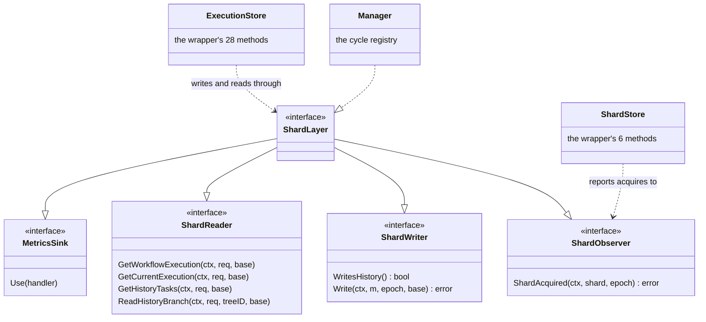
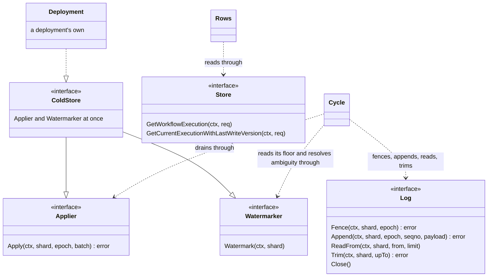

# Contracts at the failure boundaries

## What a boundary must let its caller conclude

An interface matters most when a call does not return the answer its caller wanted. Three examples
show why.

First, `Append` is cancelled while the request is in flight. The log may have committed the entry
even though the caller never saw the acknowledgement. The contract must keep that ambiguity. If it
invented a definite failure, the caller could reuse a seqno that is already durable.

Second, a drain (the transaction that applies a window of acked entries to the cold store) returns
an infrastructure error. Retrying blindly may apply the batch twice, and discarding it may lose
acknowledged writes. So the applier (the cold store's side of the seam) classifies what it knows,
and when the outcome itself is unknown the cycle (the per-shard loop that appends, drains and trims)
reads the persistent watermark: `appliedSeqno`, the highest seqno the cold store has applied,
written in the drain's own transaction.

Third, a stale owner races the current one. If the old owner saw a mutable-state condition failure,
it would take the wrong recovery path. So the transaction registers the epoch assertion (a check
that this owner's epoch still holds the shard) first, and losing ownership outranks every failure
that only makes sense for an owner.

A useful contract therefore says more than what success returns. It says what may have changed on
failure, which conclusions an error supports, whether the caller must retry or stop, and which fact
is authoritative after an ambiguous return. This chapter gives those answers for every seam, method
by method. Drain, cycle and the invariants cited by number (I1 to I11) are defined in
[chapter 02](02-concepts-and-invariants.md#the-invariants). The mechanism behind these contracts is
in chapters [03](03-components.md), [05](05-write-path.md), [06](06-shard-lifecycle.md) and
[07](07-read-path.md), and the metrics that watch the invariants are in
[chapter 10](10-metrics.md).

## The seams, at a glance

A deployment implements two seams: `wal.Log`, the log, and `cold.Store`, the cold store. It also
supplies the versioned current-row read on its base store. Every other seam is internal to waltz.
Five seams in all let the component on either side be replaced or run without a cluster:

| Seam | Contract | Who implements it | Who calls it |
|---|---|---|---|
| the log | `wal.Log` | `memwal` here; a deployment's own log otherwise | `cycle` |
| one entry | `mutation.Mutation` + `Encode`/`Decode` | — (a value type and a codec) | `wrapper`, `cycle` |
| the server's stores | `wrapper.ShardLayer` (four faces) | `cycle.Manager` | `wrapper.ExecutionStore`, `wrapper.ShardStore` |
| the cold store | `cold.Store` (`cold.Applier` + `cold.Watermarker`) | `memcold` here; a deployment's own store otherwise, and `internal/verify/coldtest` where a suite has to vary a drain's outcome | `cycle` |
| the two pre-window reads | `baserow.Store` | `memcold` here; the base `ExecutionStore` the wrapper decorates otherwise, and `internal/verify/basetest` in tests | `wrapper`, `cycle`, `apply` |

The first diagram shows the interfaces the server's stores talk to, and the one type that satisfies
all four faces at once.


```mermaid
classDiagram
  class ShardObserver {
    <<interface>>
    ShardAcquired(ctx, shard, epoch) error
  }
  class ShardWriter {
    <<interface>>
    WritesHistory() bool
    Write(ctx, m, epoch, base) error
  }
  class ShardReader {
    <<interface>>
    GetWorkflowExecution(ctx, req, base)
    GetCurrentExecution(ctx, req, base)
    GetHistoryTasks(ctx, req, base)
    ReadHistoryBranch(ctx, req, treeID, base)
  }
  class MetricsSink {
    <<interface>>
    Use(handler)
  }
  class ShardLayer {
    <<interface>>
  }
  class Manager {
    the cycle registry
  }
  class ExecutionStore {
    the wrapper's 28 methods
  }
  class ShardStore {
    the wrapper's 6 methods
  }
  ShardLayer --|> ShardObserver
  ShardLayer --|> ShardWriter
  ShardLayer --|> ShardReader
  ShardLayer --|> MetricsSink
  Manager ..|> ShardLayer
  ExecutionStore ..> ShardLayer : writes and reads through
  ShardStore ..> ShardObserver : reports acquires to
```

Hollow triangles are interface embedding. `ShardLayer` is the four faces at once, so a layer that
cannot take a metrics handler does not compile. The dashed triangle is implementation:
`cycle.Manager` is the only production `ShardLayer`. The two stores are consumers and reach the
layer no other way.

The second diagram shows the interfaces below the cycle, where the log and the cold store are.


```mermaid
classDiagram
  class Log {
    <<interface>>
    Fence(ctx, shard, epoch) error
    Append(ctx, shard, epoch, seqno, payload) error
    ReadFrom(ctx, shard, from, limit)
    Trim(ctx, shard, upTo) error
    Close()
  }
  class Applier {
    <<interface>>
    Apply(ctx, shard, epoch, batch) error
  }
  class Watermarker {
    <<interface>>
    Watermark(ctx, shard)
  }
  class ColdStore {
    <<interface>>
    Applier and Watermarker at once
  }
  class Store {
    <<interface>>
    GetWorkflowExecution(ctx, req)
    GetCurrentExecutionWithLastWriteVersion(ctx, req)
  }
  class Cycle
  class Rows
  class Deployment {
    a deployment's own
  }
  ColdStore --|> Applier
  ColdStore --|> Watermarker
  Deployment ..|> ColdStore
  Rows ..> Store : reads through
  Cycle ..> Log : fences, appends, reads, trims
  Cycle ..> Applier : drains through
  Cycle ..> Watermarker : reads its floor and resolves ambiguity through
```

`cycle` names no storage. Everything below it arrives as one of these interfaces: the log, the
applier, the watermarker, and the pre-window reads behind `baserow.Store` (the `Store` node;
`ColdStore` is `cold.Store`), which are handed down per write rather than held. That is what lets a
test vary a drain's outcome without a cluster. The cycle consumes the applier and the watermarker
separately, while a deployment supplies one value for both. `cold.Store` exists to hold that
asymmetry.

## `wal.Log` — the write-ahead log contract

### The five guarantees

Everything above the log (fold, apply, overlay, replay) depends on these five guarantees and on
nothing else. That is why the log underneath can be replaced.

1. **Total order per shard.** The writer assigns seqnos itself. Epoch fencing keeps it single.
2. **`Fence` atomically cuts off appends of all lower epochs.**
3. **Cumulative ack.** A successful `Append` up to seqno *n* means every entry ≤ *n* is durable.
   So "confirmed ⟺ seqno ≤ commitSeqno" is inherited from the log rather than implemented above it.
4. **Gap-freedom.** An append never skips a seqno, so a shard's log is one unbroken run. `Trim`
   moves its lower end and `Append` its upper end. Nothing puts a hole in the middle, so replay
   needs no hole tracking.
5. **Readback.** `ReadFrom` returns every entry a completed append acked and no trim has removed,
   in seqno order. `Trim` moves the lower end and nothing else: what it leaves stays readable, and
   the shard's ownership and next seqno survive it. A trim is the only removal allowed. A retention
   window, a TTL on the table or a compaction that drops old records each break this guarantee
   silently. `waltest.CheckRetention` is the check a deployment runs for it, since the millisecond
   suite cannot express time.

A payload is opaque bytes. There are no Temporal types in `wal` or its implementations.

The five are obligations a backend owes, not descriptions of what one backend happens to do.
Guarantee 4 is the one real trade among them. It rules out logs that buy throughput by letting
several senders claim seqnos blind and reconcile the holes later. A log that may hold a hole forces
every consumer to tell "never written" from "still in flight", and only a timeout can answer that.
The trade costs little, because epoch fencing already makes the writer single: blind inserts would
only save the retry a pipelined append pays when it arrives out of order (`wal.ErrGap`). Guarantee
4 is also the one a new backend is likeliest to relax by accident while still passing a smoke test.

### What the contract does not say: what an append costs

The guarantees say nothing about cost. Every implementation satisfies the same five, so a cycle
cannot tell a fast log from a slow one, and nothing above the log reports the difference. One
decision therefore stays with the deployment, and waltz can neither make it nor check it: whether
the log is cheaper to append to than the cold store is to commit to. If it is not, everything works
and nothing is gained.

Two obligations sit in that gap. No suite in this tree can reach them.

* **An append should be one immediate write over adjacent keys of the log's own storage**
  (invariant [I9](02-concepts-and-invariants.md#the-invariants)): no index, no changefeed, no read
  of another table. A backend that takes a distributed transaction per append is a correct log and
  a pointless one.
* **The log should be able to fail separately from the cold store.** A log in the same database as
  the cold store cannot: one incident is an incident of both
  ([I10, at more length](02-concepts-and-invariants.md#i10-at-more-length)).

The conformance suite drives one `wal.Log` value, so it cannot see the storage under it: a backend
that acks into memory it never persists passes every case. `waltest.CheckReopen` covers half of
that by opening the storage again; a fence racing a displaced owner's append needs two writers and
stays the deployment's own test
([chapter 11](11-verification.md#what-the-contract-suite-cannot-see)).

`memwal` is an implementation, not a test double. Everything above the log needs a log and nothing
from a cluster. And a suite that has only run against one backend cannot tell a contract from an
implementation. So every obligation, payload ownership and the spentness of trimmed seqnos
included, is stated once, in `waltest.RunContractSuite`, and an outside backend is judged by
the same assertions `memwal` is judged by. `memwal` has no knobs and no fault-injection points:
`New()` takes nothing, and `memwal.Backend` exposes the five contract methods and nothing else. A
caller that needs a failing log wraps a real one with `waltest.NewFaulty`, which asks a
`waltest.Fault` before each call and delegates everything the fault admits.

The contract has no batch: `Append` takes one payload. One entry per append means a half-written
append cannot arise, so `ErrAlreadyWritten` stays an unqualified ack. A batch would need a fourth
outcome on the contract or a per-row header framing each entry with its batch's bounds. The cost of
having none is the retry a pipelined append pays. [Chapter 13](13-designs-that-were-rejected.md#a-batch-of-entries-in-one-append)
has the batch design and why it was removed.

### The vocabulary

| Type | What it is |
|---|---|
| `wal.ShardID` (`uint32`) | one Temporal history shard; every shard has its own log |
| `wal.Seqno` (`uint64`) | an entry's position in one shard's log — a per-shard LSN the writer assigns itself |
| `wal.Epoch` (`uint64`) | the ownership token every append carries, identical to Temporal's rangeID (invariant I11) |
| `wal.FirstSeqno` (= 1) | the seqno of a shard's first entry; anything below it is backend bookkeeping, not an entry |
| `wal.Entry` | `{Seqno, Epoch, Payload}` — one record of a shard's log |

Whoever hands epochs out owes the log a strictly greater epoch per acquire, because fencing cannot
separate two writers holding the same epoch. An epoch may also grow without an ownership change
([chapter 06](06-shard-lifecycle.md#2-use-the-ownership-token-temporal-already-has)).

### Method by method

| Method | Promises | Refuses | Leaves behind on failure |
|---|---|---|---|
| `Fence(ctx, shard, epoch) error` | claims the log for `epoch`, atomically cutting off every append of a lower epoch (I4); idempotent per epoch, so a restart may replay its acquire; entries stay and the new owner continues at the next seqno | a lower epoch than the one held (`ErrFenced`); epoch 0 (`ErrZeroEpoch`) | nothing — ownership included |
| `Append(ctx, shard, epoch, seqno, payload) error` | writes `payload` as the entry at `seqno`, under `epoch`; returning nil means every entry up to and including `seqno` is durable, so the caller's commitSeqno becomes `seqno` | `ErrFenced`, `ErrAlreadyWritten`, `ErrGap`; a `seqno` below `FirstSeqno`; a nil payload (an empty one is an entry); epoch 0 | none of these refusals writes anything |
| `ReadFrom(ctx, shard, from, limit) ([]Entry, error)` | up to `limit` entries at or above `from`, in seqno order; a read after a successful `Fence` sees every entry the log held when the fence took it | a non-positive `limit` | reads change nothing |
| `Trim(ctx, shard, upTo) error` | deletes entries at or below `upTo`; the log stays appendable at the next seqno and ownership stays put | nothing: trimming entries that are already absent is not an error | a log appendable at the next seqno, owned by the same epoch, whatever `upTo` said and whether or not it deleted anything. A failed trim is retried at the next cadence, or forced again while storage pressure stands (see `wal.PressureSource` below), and costs a partly shorter log at worst |
| `Close()` | releases what the backend holds around the log: a connection, a lease, a goroutine keeping ownership alive. Called once, after the last append and any drain | nothing | the entries, and the fencing owner still owning each shard until that ownership expires or a successor takes it: a close is neither a drain nor a fence |

Five rules do not fit the table:

* **An ordinary append error has an unknown commit outcome.** Only `ErrFenced`, `ErrAlreadyWritten`
  and `ErrGap`, and the refusal of an argument the contract does not admit, promise that nothing was
  written. Any other error, including cancellation in flight, may leave the entry durable.
* **`from` is clamped, not refused.** A `from` below `FirstSeqno` reads from `FirstSeqno`. Fewer
  than `limit` entries means the log ends there. `wal.Entries(ctx, log, shard, from, page)` is that
  loop as an `iter.Seq2[Entry, error]`. It ends at a short page, yields the zero entry with the
  error on a failed read and stops, and refuses a full page ending below the seqno it asked for, so
  a backend that ignores `from` cannot make it spin until the context gives out.
* **A trim may keep the log's last entry.** A backend may keep entries it needs to promise
  appendability; one that checks gap-freedom against the entry below the append keeps that one.
  Removed seqnos stay spent: an append at one is refused and writes nothing. The contract does not
  say whether the refusal is `ErrAlreadyWritten` or `ErrGap`, since a backend that derives the
  answer from its rows has deleted them.
* **Context semantics are the same for all four methods that take one.** A context already
  cancelled when the call begins is observed before the log changes, so the call leaves the log as
  it was. Cancellation in flight is not resolved: an `Append` cut off between request and ack may be
  durable, so a cancelled append counts as an attempt like any other. Context errors satisfy
  `errors.Is` against `context.Canceled` or `context.DeadlineExceeded`. A call that is both
  cancelled and malformed reports the argument. The suite's `ACancelledContextChangesNothing` drives
  the resolved cases.
* **Payload ownership runs both ways.** In: no backend retains or reads a slice after `Append`
  returns, whatever it returns, so an encoder may reuse its scratch buffer at once. Out: an
  `Entry.Payload` is the reader's to keep. It aliases neither the log's state nor another entry of
  the same read, and is never nil.

Every method is safe for concurrent use. That is not a licence for two writers: concurrent appends
to one shard race for seqnos and lose.

### The four sentinel errors

Match with `errors.Is`; implementations wrap them with context. Anything else is an ordinary error
and means a programming mistake or an infrastructure failure.

| Error | Meaning | Returned when | What the caller must do |
|---|---|---|---|
| `wal.ErrFenced` | the log is not the caller's to write: another epoch has fenced it, or the caller never fenced it at its own epoch | `Fence` at a lower epoch than the one held; `Append` under an epoch that is not the fenced one, or with no fence at all | stop writing: shard ownership is gone, or was never taken |
| `wal.ErrAlreadyWritten` | the seqno the append asked for is taken | `Append` at a seqno the log already holds | read it as the ack: after an ambiguous append, it says the append landed |
| `wal.ErrGap` | the append would leave a hole: the entry below the requested seqno is missing (guarantee 4) | `Append` whose predecessor seqno is absent | retry once the predecessor lands; this is the normal outcome of a pipelined append that arrived out of order |
| `wal.ErrZeroEpoch` | epoch 0 means "nobody owns this", so nothing can be claimed with it | `Fence` or `Append` with `epoch == 0` | fix the caller: it forgot to set an epoch |

Where more than one error applies, `ErrFenced` wins. `ErrAlreadyWritten` is an ack, and a
zombie handed one would take the new owner's write as its own commitSeqno. The precedence costs the
caller one thing: a writer whose epoch grew across an ambiguity gets `ErrFenced` rather than the
ack. To learn whether the first attempt landed, it must replay under its current epoch or read the
log.

Backend authors do not re-derive any of this. [`wal/refuse.go`](../../wal/refuse.go) holds the
argument checks and the diagnosis in the contract's order:

* `CheckFence`, `CheckAppend`, `CheckRead` (which also returns the clamped start seqno) and
  `CheckTrim` (which answers whether the trim reaches any entry at all);
* `FenceRefusal`, and `AppendRefusal` over an `AppendState{Owner, Taken, HasPredecessor}`;
* `RefuseAtNext`, which is `AppendRefusal` for a backend that keeps the seqno its log continues at
  instead of answering `Taken` and `HasPredecessor` separately.

A backend that diagnoses in its own order answers a different contract.

### `wal.PressureSource` — the optional pressure face

Some backends can commit an append and, in the same response, warn that their storage is running
low. Failing the append instead would report an entry the log holds as one it does not, which is
the lie the first rule forbids. So the warning travels beside the contract, not through its errors:

```go
type PressureSource interface {
    Pressure(shard ShardID) PressureLevel
}
```

A backend without such a signal does not implement the interface, and the layer behaves as
described so far. One that does keeps a *level* current from whatever its own operations observe,
and lowers it itself once the condition clears. The levels are `PressureNone`, `PressureDrain` and
`PressureStop`, ordered, each asking everything the ones below it ask. The layer polls the level
around every write and on the apply cycle's age tick, rather than consuming events. The level
describes the storage, not the call that noticed, so which operation raised it does not travel with
it.

What each level makes the layer do:

* **`PressureDrain`**: stop accumulating. Every accepted windowed write drains the window at
  whatever size it has (`wal_drains{trigger="storage_pressure"}`; a sync write drains anyway, under
  its own trigger). Every committed drain trims at the new watermark with the cadence bypassed. An
  acquire trims what the previous owner left applied before the first new append. The age tick
  covers a shard nothing is writing to, and retries a forced trim that failed.
* **`PressureStop`**: in addition, new appends are refused before they reach the log, with the same
  unwrapped `ResourceExhausted` as I10's bound and
  `wal_backpressure_refusals{limit="storage_pressure"}`. Reads still answer. The first write after
  the backend lowers the level goes through; there is nothing to reset.

The level never changes the answer of the append whose response carried it: that append stays a
durable acknowledgement. And it never moves the trim past the watermark, so trim safety is
unchanged.

## `mutation` — what one entry is

One `mutation.Mutation` is one `ExecutionStore`-level write request, and it is the unit of
atomicity: one mutation is one log entry (invariant I1). It is a struct of eight pointer fields, of
which exactly one is set. `Mutation.Kind()` reports which; a mutation holding none or several
reports `KindInvalid`. Every caller that fans out over the kinds wraps the single error
`mutation.ErrNotExactlyOneRequest`, so one `errors.Is` matches them all.

### The kinds

There are eight kinds plus `KindInvalid`, read off `mutation/kinds.go`; `mutation.KindCount` is one
past the last:

| Kind | `Kind.String()` | The request it carries | Carries a rangeID | Carries new history events |
|---|---|---|---|---|
| `KindCreate` | `create` | `InternalCreateWorkflowExecutionRequest` | yes | yes (1 slot) |
| `KindUpdate` | `update` | `InternalUpdateWorkflowExecutionRequest` | yes | yes (2 slots) |
| `KindConflictResolve` | `conflict-resolve` | `InternalConflictResolveWorkflowExecutionRequest` | yes | yes (3 slots) |
| `KindSet` | `set` | `InternalSetWorkflowExecutionRequest` | yes | no |
| `KindDelete` | `delete` | `DeleteWorkflowExecutionRequest` | no | no |
| `KindDeleteCurrent` | `delete-current` | `DeleteCurrentWorkflowExecutionRequest` | no | no |
| `KindAddTasks` | `add-tasks` | `InternalAddHistoryTasksRequest` | yes | no |
| `KindRangeCompleteTasks` | `range-complete-tasks` | `RangeCompleteHistoryTasksRequest` | no | no |

### What each kind asserts

What each kind claims about the store is a separate axis. `fold/assert.go` derives it per kind and
per mode. The drain asserts it in the order the applier registers the assertions, current row before
run rows, beside the epoch CAS every drain carries anyway:

| Kind | What it asserts about the current row | What it asserts about run rows |
|---|---|---|
| `KindCreate` | it must not exist (`BrandNew`); or it names `PreviousRunID` at `PreviousLastWriteVersion` (`UpdateCurrent`); nothing at all, and no write to it, under `BypassCurrent` | the new run must not exist |
| `KindUpdate` | it names the mutated run (`UpdateCurrent`); it does not name it (`BypassCurrent`); nothing under `IgnoreCurrent` | the mutated run at `DBRecordVersion − 1`, plus a must-not-exist for the second run a continue-as-new carries |
| `KindConflictResolve` | it names the run the store believes current — the mutated current run where there is one, the reset run otherwise (`UpdateCurrent`); or it does not name the reset run (`BypassCurrent`) | the reset run at its version, a current-run mutation at its own, and a must-not-exist for a new run |
| `KindSet` | nothing: a set is a repair of one run's state, not a claim about which run is current | the run at `DBRecordVersion − 1` |
| `KindDelete`, `KindDeleteCurrent`, `KindAddTasks`, `KindRangeCompleteTasks` | nothing | nothing |

Deleting a workflow is not one atomic operation at this boundary. `KindDelete` and
`KindDeleteCurrent` are independent mutations, and the fold handles either alone: a call arriving
on its own folds to what the sequential path would have done for it. The server's ordinary deletion
flow sends both, but the layer depends on none of that pairing. A fold rule such as "a delete always
comes with a delete-current" would put Temporal's semantics inside the layer.

### The accessors

Four accessors serve every consumer:

* `ShardID() int32` is the routing key: one shard is one log and one apply transaction. It answers
  0 for `KindInvalid`.
* `RangeID() int64` is the epoch the caller wrote under. It is read off the request and never
  carried in the payload.
* `TaskSlot(part)` returns one part's history-task map, and `TaskSlots()` every one the request
  carries, in `PartSnapshot`, `PartNewSnapshot`, `PartMutation` order. The pointer aliases the map's
  home in the request, so a caller such as a range delete writes through it. The order is part of
  the contract, because callers concatenate the slots.
* `EventSlots()` returns every slice of new history events the request carries, in the order they
  must reach the store; `ClearEvents()` drops them in place. The payload carries whatever is still
  there, so the events are durable no later than the state that names them. A mutation acked over
  history rows nobody wrote is a mutable state the cold store can never reach. A writer that puts
  the events down through the store clears them once they are down. So a mutation reaching the
  layer carries exactly the batches nobody has written yet, and the codec and the fold need no mode
  of their own.

### The codec

The codec is four functions. `Encode(m)` and `EncodeProvisional(m)` produce a payload.
`Decode(payload, registry)` and `DecodeEntry(payload, registry) (Mutation, bool, error)` read one
back. The bool is the provisional flag: it tells replay that a condition failure on this entry is a
drop rather than a halt. Windowed writes use `Encode`, because their conditions are decided before
the append. Sync mode uses `EncodeProvisional`: its drain answers the caller directly, so replay may
safely drop an entry whose delegated condition later fails.

Five errors are the caller's to handle:

* `ErrUnknownCategory` (`Decode`): the entry names a task category this process does not have. Fail
  the replay; skipping the group would drop its tasks silently.
* `ErrCassandraBlob` (`Encode`): a CHASM node (a component of the server's newer state-machine
  framework, which persists its own blobs beside the mutable state) carries a Cassandra-encoded blob
  the record has no field for.
* `ErrUncarriedProto` (`Encode`): a request's parsed execution info or state is set with no blob
  carrying it.
* `ErrBlobEncoding` (`Encode`): one of those two blobs is in an encoding `Decode` cannot parse.
* `ErrMalformedHistory` (both): an event batch lacks something the fold keys on or the applier
  writes.

`Encode` refuses here because it is the last place that can: past the append, the entry is acked
and every owner inherits it.

The task-category registry is a parameter, not a package default, because it is the one input that
is not a function of the bytes: the same payload decodes on one node and fails on another. `Encode`
is a function of its argument alone. Collections travel as repeated entries in sorted key order, so
the same mutation always encodes to the same bytes, in any process. `Decode` rejects a payload whose
`format` is not this build's, and rejects unknown protobuf fields anywhere in the tree, because an
entry written by a newer codec would otherwise replay silently short a piece.

### Why the record is a hand-written mirror

The record mirrors the persistence request structs field for field. It is explicit because no
reflective encoder survives those structs: the `Tasks` map is keyed by `tasks.Category`, which
marshals and does not unmarshal, and `gob` refuses the type outright.

This buys a working codec at a known cost: a field Temporal adds is a field this format silently
omits. The encode compiles, the entry is durable, and state has stopped travelling. A guard pays
that cost. `TestFieldSetGuard` in `mutation/fieldset_test.go` walks `reflect` over every mirrored
request struct and fails on a field with no recorded decision. A decision is *carried*, *derived* or
*dropped*, with a reason required for the last two. `kinds.go` decides which structs it walks, not a
hand-kept list, and `TestEveryKindsRequestStructIsWalked` holds it to that. The guard compares the
recorded list against the struct's own, in order, so a field added, removed or moved each fails by
name. A Temporal bump that adds a field is expected to fail this test. Recording the field is never
the fix on its own; it needs a decision.

## `fold` — the exported surface

A window of entries folds into one accumulator, whose types the wrapper, apply and cycle sections
below use.

### The accumulator and `Add`

`fold.New(shard) *Accumulator` folds one shard's window. It is not safe for concurrent use: the
shard's single-threaded apply loop owns it. `Add(seqno, m)` folds the mutation whole or returns an
error and leaves the accumulator as it was. It takes ownership of what it is handed, because
requests are merged in place, so a caller that needs the mutation afterwards copies it first.
Seqnos must be strictly increasing across drains: one accumulator follows one log.

A seqno not above the last, a mutation of another shard, and one holding no single request are the
caller's bug and come back as ordinary errors. Three errors partition what `Add` can refuse of a
well-formed call:

| Error | What it reports |
|---|---|
| `ErrAfterTombstone` | a mutation on a run the window already deleted. `Check` refuses such a mutation before it is acked, so a log that still produces one is corrupt |
| `ErrInvalidStream` | a mutation that cannot follow the window's mutations in any acked stream: a create of a run the window holds live, or a second continue-as-new out of the same run |
| `ErrRefused` | a *valid* window this accumulator cannot express as merged requests. One shape of it is an assertion on a current row a delete-current has already tainted: that delete asserts nothing, so an assertion recorded past it would be a mid-window claim dressed as a head-of-window one |

Only `ErrRefused` has a recovery, and it is always the same: the accumulator is unchanged, so the
caller drains and starts the refused mutation on a fresh window. `AddOrDrain(seqno, m, drain)` and
`CheckOrDrain(m, drain)` implement that recovery once. Both answer with a `Refusal{Drained,
DrainFailed}`. `Drained` says the window was closed to make room. `DrainFailed` says the error is
the drain callback's own and already classified, so a caller that type-switches on it must not read
it as a fold invariant violation.

### The condition authority

`Check(m) (Delegated, error)` reports what the store would have answered, as far as this window
determines it. It is read-only on the accumulator, which makes a refusal safe to retry. A nil error
does not mean every assertion held. It means nothing this window determines refuses the mutation.
The assertions that stand on the pre-window row come back in `Delegated{Current *DelegatedCurrent,
Runs []DelegatedRun}`. `Any()` reports whether the mutation costs a cold-store read at all.
`Settle(current, run)` hands each obligation to a caller that can read the row, in the plugin's own
registration order (current row before run rows), and stops at the first non-nil answer. The
predicates are `DelegatedCurrent.Verify(base, lastWriteVersion)` and `DelegatedRun.Verify(base)`.

### The overlay

`ViewRun(namespaceID, workflowID, runID) RunView` and `ViewCurrent(namespaceID, workflowID)
CurrentView` are all a reader branches on. `RunView.Shape` is one of `RunAbsent`, `RunSnapshot`,
`RunDelta`, `RunTombstone`. `CurrentView.Shape` is one of `CurrentUnheld`, `CurrentWritten`,
`CurrentGone`, `CurrentGuarded`. `NeedsBase()`, `Held()` and `Render(base)` complete the API. A view
is valid only until the next mutation folds in. [Chapter 07](07-read-path.md) says what each shape
means for an answer.

### The drain and the batch

`Drain() Batch` emits the window and resets the accumulator. Only `Drain` builds a `Batch`, so the
apply side can rely on what a batch guarantees instead of re-deriving it: requests in tail-seqno
order, one shard (`Shard()`), and a `Watermark()` at or above every seqno they carry.

`Batch` also answers:

* `Empty()`, `Len()`, `Stats()`;
* `Settles() (wal.Seqno, bool)`, false for a window that folded nothing at all;
* `Tasks() TaskWork`, the shard-level half: a task names no run and asserts nothing;
* `History()`, the window's event batches in log order, which any applier handed them owes, whether
  or not it declares `cold.HistoryApplier`;
* `Each() iter.Seq[*Emitted]`.

One `Emitted` is one merged request: `NamespaceID`, `WorkflowID`, `HeadSeqno`, `TailSeqno`,
`Request`, `BufferedBatches`, plus `RunAssertions()`, `OrphanedTasks()`, `Workflow()` and
`FirstOfWorkflow()`. Every request names a `WorkflowRecord`, which holds the workflow's
head-of-window assertion (`Current`), the current row the window would write (`CurrentWrite`) and
whether the window's net effect removed that row (`CurrentRemoved`). Orphaned tasks appear only on a
tombstone: they are the tasks of the mutations the tombstone collapsed. The `Delete` has no task
slot of its own to hold them, and losing them would break I8.

Buffered events are the one collection that does not merge, because a request has only one
`NewBufferedEvents` slot. `Emitted.BufferedBatches` lists each mutation's batch in arrival order,
each carrying its own run id, and the merged request's own slot is always nil. An applier writes one
buffered-events row per batch, after the merged request that may have cleared the rows already
there ([chapter 02](02-concepts-and-invariants.md#i8-at-more-length) has the rule).

### The page merges

`Accumulator.TaskPage(req, base BasePage)` is the merge-on-read for tasks, and
`Accumulator.HistoryPage(req, treeID, base HistoryBasePage)` the same for one history branch.
`BasePage` is `func(batch int, token []byte) ([]p.InternalHistoryTask, []byte, error)`. It takes a
batch size and a token rather than a request, since those are the only two things the merge
decides; the range, the category and the shard stay the caller's. The token is the base's own bytes,
passed through unparsed, and a zero-length token back means the base is exhausted. The base is
called at most once per page, and not at all once its token says it is exhausted. Its error is
returned unwrapped and never swallowed, because a page that quietly omitted the store's rows would
lose them.

The merge builds a page's reach out of what the base last returned, not out of a cursor of its own.
So four things are required of the base, and each is checked:

| Requirement | Error | What breaks without it |
|---|---|---|
| every row is inside the range asked for | `fold.ErrBaseRowOutsideRange` | rows are filtered against the window's undrained deletes and nothing else, and `queues/slice.go` panics on a key outside the range, with no recover in the reader loop |
| no later page holds a key at or below the last key of an earlier one | `fold.ErrBasePageNotAscending` | that key bounds the window's half of the page and is what the token carries; `queues/iterator.go` silently skips what does not ascend, and nobody asks for that task again |
| a page with no rows means the range is exhausted | `fold.ErrBasePageEmptyBesideAToken` | a token beside an empty page is read as the end, so the queue completes its range over rows it was never shown, deleting acknowledged task rows |
| a page holds at most the batch it was asked for | `fold.ErrBasePageTooLarge` | where the window alone overflows a page the ask is one row, and a row sent unasked is one the cursor passes unemitted and the range completion deletes |

Temporal's own SQL and Cassandra plugins satisfy all four, so no run here has needed the checks;
they exist because a failing read is cheaper than deleted task rows.

`HistoryBasePage` is held to three of the four (page size, the store's own order, no empty page
beside a token). The range check does not apply: the store filters its rows by node id and the merge
filters the window's the same way. It owes one more, which `BasePage` needs too and does not state:
a token handed back must answer the same rows, because a base page the cut emits nothing from is
reached again only through its own token.

## `wrapper` — the method tables

The mode switch is one field, `wrapper.Options.Layer`: nil is passthrough, non-nil is
intercept. `Options.Metrics` is a `*walmetrics.Emitter` and nil records nowhere.

### `wrapper.ExecutionStore` — 28 methods

Twelve are answered differently in intercept mode and a thirteenth is refused; passthrough changes
none.

| Method | Disposition in intercept mode |
|---|---|
| `CreateWorkflowExecution` | intercepted — one log entry (`KindCreate`) |
| `UpdateWorkflowExecution` | intercepted — one log entry (`KindUpdate`) |
| `ConflictResolveWorkflowExecution` | intercepted — one log entry (`KindConflictResolve`) |
| `SetWorkflowExecution` | intercepted — one log entry (`KindSet`) |
| `DeleteWorkflowExecution` | intercepted — one log entry (`KindDelete`) |
| `DeleteCurrentWorkflowExecution` | intercepted — one log entry (`KindDeleteCurrent`) |
| `AddHistoryTasks` | intercepted — one log entry (`KindAddTasks`) |
| `RangeCompleteHistoryTasks` | intercepted — one log entry (`KindRangeCompleteTasks`) |
| `GetWorkflowExecution` | answered from the layer — the overlay, with the base read handed down as a closure |
| `GetCurrentExecution` | answered from the layer — the overlay |
| `GetHistoryTasks` | answered from the layer — the task merge |
| `ReadHistoryBranch` | answered from the layer — the history merge, always, with the base read handed down as a closure |
| `CompleteHistoryTask` | refused with `wrapper.ErrCompleteHistoryTaskUnsupported` |
| `Close`, `GetName`, `GetHistoryBranchUtil` | transit |
| `ListConcreteExecutions` | transit |
| `PutReplicationTaskToDLQ`, `GetReplicationTasksFromDLQ`, `DeleteReplicationTaskFromDLQ`, `RangeDeleteReplicationTaskFromDLQ`, `IsReplicationDLQEmpty` | transit |
| `AppendHistoryNodes`, `DeleteHistoryNodes`, `ForkHistoryBranch`, `DeleteHistoryBranch`, `GetHistoryTreeContainingBranch`, `GetAllHistoryTreeBranches` | transit |

That is 8 intercepted writes + 4 reads answered from the layer + 1 refusal + 15 transits = 28.
The history read always merges, because a tail written under a store that took the batches may be
replayed by a node composed with one that does not.

`ErrCompleteHistoryTaskUnsupported` is a `serviceerror.NewUnimplemented`. The log's deletion record
is a range per category, not a key, and a second deletion shape would be one more thing every
reader, drain and replay must agree on. A range is also the shape the caller already has: a queue
checkpoint is a `[old, new)` interval, and the deletion record is that checkpoint restated. The one
caller of `CompleteHistoryTask` is the history handler's `RemoveTask`, behind the admin API of that
name. Forwarding it would not work either: a delete sent to the cold store for a task still in the
window finds no row, removes nothing and reports success. So the choice is between a refusal an
operator sees and a success an operator believes. On a node in intercept mode the admin remove-task
API is unavailable by design.

The intercepted path carries three obligations, which the store discharges:

* **The events are durable no later than the state that names them, and the cold store decides
  which writer makes them so.** Over a store that does not declare `cold.HistoryApplier`, every
  intercepted write calls `AppendHistoryNodes` on the base store for each of the mutation's
  `EventSlots()` before the mutation reaches the log, and strips them off it. Over one that does,
  they stay on the mutation, ride its record, and the drain writes them no later than it publishes
  the state. Either way a mutable state is never acked over history rows nobody wrote.
* **Errors are returned as they arrive, unwrapped.** `ContextImpl.handleWriteErrorLocked` in the
  history service type-switches on concrete values, so one `%w` would turn an expected condition
  failure into a background re-acquire.
* **Construction can fail.** `NewExecutionStore(base, opts)` returns an error wrapping
  `baserow.ErrNoVersionedRead` when intercept mode is asked for over a base store that cannot read a current row's
  `last_write_version`. The server learns what its store is missing while it is still starting, not
  at the first create of the first workflow.

`ExecutionStore.Counts() Counts` reports what the store itself saw: `Intercepted` (the mutable-state
writes and the two tombstones that took the WAL path), `TasksWritten` (`AddHistoryTasks`),
`TasksCompleted` (`RangeCompleteHistoryTasks`), `Overlaid` (mutable-state reads routed through the
layer), `TaskReads` (`GetHistoryTasks` pages routed at the merge) and `HistoryReads`
(`ReadHistoryBranch` pages routed at the merge). Every field counts on the way in, so a write the
tail refused is counted. All are zero in passthrough mode.

### `wrapper.ShardStore` — 6 methods

| Method | Disposition |
|---|---|
| `UpdateShard` | observed, then transits — the layer's only window onto shard ownership |
| `Close`, `GetName`, `GetClusterName` | transit |
| `GetOrCreateShard` | transit |
| `AssertShardOwnership` | transit |

`UpdateShard` calls `ShardObserver.ShardAcquired` before delegating, and only when
`request.RangeID != request.PreviousRangeID`; an equal pair is a heartbeat. An error from the
observer fails the acquire without calling the base store, so a failed fence never leaves a moved
rangeID behind. [Chapter 06](06-shard-lifecycle.md#1-first-exclude-the-failed-owner) has the two
call sites and why the test is inequality.

Two transits look like ownership signals and are not. `GetOrCreateShard` runs on first load only,
and the admin `GetShard` API calls it with no shard context behind it. `AssertShardOwnership` checks
whatever the base plugin decides: Temporal's own SQL and Cassandra shard stores both return `nil`
without looking, and dynamic config can switch off the shard controller loop that drives it.
Nothing may be keyed on either.

### The wrapper's own interfaces

* **`ShardObserver`** — `ShardAcquired(ctx context.Context, shard wal.ShardID, epoch wal.Epoch)
  error`. The epoch is the new rangeID (I11). `ShardAcquired`'s error reaches the shard context
  unwrapped. Nothing reports the other direction: closing a shard makes no persistence call.
* **`ShardWriter`** — `WritesHistory() bool` and `Write(ctx context.Context, m mutation.Mutation,
  epoch wal.Epoch, base *baserow.Rows) error`. `WritesHistory` says whether an intercepted write's
  event batches ride the record; false means the store owes them to the base store before it calls
  `Write`, and strips them off the mutation once they are down. The mutation names its own shard.
  The layer takes ownership of `m`'s request: in a windowed mode it is retained past this call and
  merged in place with the window's other requests, so a caller may not read or reuse it once
  `Write` has returned. `epoch` is the rangeID the caller wrote under, so a write from a fenced-out
  shard context is refused rather than re-stamped with this node's epoch. Zero means "the caller
  named no epoch", not "epoch 0": the two deletes and the range delete carry none, and the drain's
  own epoch CAS fences them instead. The error is the store's own (condition failure, fenced shard,
  tail at its bound) and comes back unwrapped. A condition failure is always this caller's own. In a
  windowed mode it is settled before the append, by fold's `Check` or the pre-window read it
  delegates. Under `Sync` the drain decides it, and the window is one mutation. `base` is called
  inside the goroutine that owns the window, at most once per asserted row.
* **`ShardReader`** — four reads, each taking the caller's request and the cold store's own answer
  as a closure, so the layer decides whether to call it. `GetWorkflowExecution` and
  `GetCurrentExecution` take `base func(context.Context) (…, error)`; `GetHistoryTasks` takes `base
  func(context.Context, *p.GetHistoryTasksRequest) (…, error)`, because the merge asks a different
  question than the caller did: `BatchSize` minus what the window contributes, resumed from the
  base's own token. The token it returns is this layer's, carrying the base's token inside it.
  `ReadHistoryBranch` takes a `treeID string` beside its request, parsed from the branch token by the
  wrapper because the codec is the base store's, and `base func(context.Context,
  *p.InternalReadHistoryBranchRequest) (…, error)`. The two mutable-state reads and the branch read
  fall through to the base for a shard the layer does not hold. The task read is refused there
  instead, because its one caller would otherwise ack past a page missing tail entries.
  Errors come back unwrapped.
* **`MetricsSink`** — `Use(h metrics.Handler)`. Called with the handler the server gave
  `NewFactory`, before the stores it built have served anything, and once per persistence graph: an
  implementation takes the first handler and ignores the rest.
* **`ShardLayer`** — all four faces at once. It is one interface rather than four fields because
  every half-composed layer fails quietly. A writer with no reader reads stale. A write path never
  told about an acquire refuses every write for that shard, and from outside that looks like lost
  ownership, so the caller re-acquires instead of seeing a misconfiguration. A layer nobody handed
  the metrics handler emits nothing while every suite stays green. For the same reason there is no
  separate "the layer is on" flag: a flag and a nil layer could disagree, and one would have to win
  silently.

## `apply` — what a drain's outcome demands

The drain itself is the deployment's to write. `cold.Applier` is one method,
`Apply(ctx, shard, epoch, batch) error`. It must write the batch's merged requests, the epoch
compare-and-swap and the watermark in one all-or-nothing transaction. Nothing in waltz can check
that, and every invariant downstream of the ack rests on it.

The `apply` package is the vocabulary the answer comes back in. `Classify` sorts an `Apply` error
into classes, `Attribute` builds the attribution a violated invariant carries, and `Refuse` marks a
refusal of the applier's own. The package writes nothing itself.

An applier need not re-derive what a batch guarantees, since only `fold.Accumulator.Drain` builds a
`fold.Batch`. In return, it must mark its own refusals. `apply.Refuse(err)` wraps an error raised
before anything was sent to the store, and that wrapper is what makes `Classify` answer
`ClassRefused`. An unmarked pre-flight refusal reads as an unknown outcome, and the shard then goes
looking for a transaction that never existed.

The requests name no epoch the applier may use, because a replayed request lost its rangeID with the
payload. Every drain asserts under the epoch `Apply` was handed.

An applier must bound its own calls. The context `Apply` receives often has no deadline: five
drains (the age tick's, both size triggers', the refusal drain's and the storage-pressure drain's)
run detached, because they carry earlier writers' acked mutations and one expired client deadline
must not fail them. An `Apply` that blocks forever blocks the shard's whole loop, writes and reads
alike, and makes `Layer.Shutdown` outlast its budget
([chapter 09](09-operations.md#2-start-and-stop-order)). The layer imposes no timeout of its own: a
drain it cut short is an unknown outcome, which stalls the shard, so the bound would trade a hang
for the worst state in this design. The store's driver, statement or request timeout is the only
thing between a wedged store and a wedged node.

### What a drain asserts, and what it must not

Two negative rules carry the tombstone path. Neither appears among the assertions a drain
registers, and both are obligations on the applier.

A drain asserts nothing about a row it deletes. A batched conditional write usually works like
this: the store evaluates every assertion, then gates every write statement on "no assertion
failed". One failed assertion then makes the transaction commit having written nothing. An
assertion about a row the same transaction removes can fail that way and silence every statement
after it. So the applier gathers the rows a batch deletes before driving the first request, because
a later request may delete the row an earlier one would have asserted. A tombstone stands on the
epoch CAS alone, which is still more than the sequential delete asserts.

The delete-current guard stays a guard. `DeleteCurrentWorkflowExecution` removes the row only if it
names the run the request carries, and that guard is never turned into an assertion. A mismatch is
ordinary traffic: the sequential path evaluates it at its own position in the stream, where it means
"nothing to delete". Asserting `current == run` at the drain would turn that legal no-op into a
false invariant violation and halt the shard. It would also ask at the wrong time, since a folded
window's assertions are all head-of-window and are evaluated before any statement runs. Where the
window itself wrote the row it deletes (`fold.WorkflowRecord.CurrentRemoved`), no guard is passed
at all: the guard asks about the pre-window row, and the window already knows what it held.

A third rule concerns the query's shape: a drain's statement text must be a function of assertion
kinds and delete families, never of how many mutations the window folded.
[Chapter 13](13-designs-that-were-rejected.md#a-folded-window-as-a-concatenation-of-the-stores-own-queries)
explains why.

### `apply.Class` — sorting the outcome

`Classify(err) Class` sorts what `Apply` returned. Anything it cannot prove refused, fenced or
condition-failed is an unknown outcome, because calling a commit a failure is how a batch gets
applied twice.

| Class | `String()` | What happened | What the caller must do |
|---|---|---|---|
| `ClassCommitted` | `committed` | the drain committed, watermark included | continue |
| `ClassRefused` | `refused` | the applier refused before anything reached the store (matches `errors.Is(err, ErrRefused)`, which is what `apply.Refuse` marks) | there is no outcome to recover, only an input to fix |
| `ClassShardLost` | `shard lost` | the epoch CAS failed: a `*p.ShardOwnershipLostError` | stop writing under this epoch; do not retry the drain |
| `ClassInvariantViolated` | `invariant violated` | a version or current-row assertion failed | halt the shard, do not retry. Under fencing this layer is the shard's only writer, so a failed assertion is a broken invariant and not contention. The exception is the drain's own `callerRule`: a one-mutation sync window answers its caller instead, and a replayed provisional entry is dropped. The cycle picks between the three |
| `ClassUnknownOutcome` | `unknown outcome` | an ambiguous code reached the cycle; the transaction may or may not have committed | read the watermark before anything else; re-folding by version instead corrupts |

`Classify` recognises Temporal's own three assertion-failure types:
`*p.WorkflowConditionFailedError`, `*p.CurrentWorkflowConditionFailedError` and
`*p.ConditionFailedError`. An applier that reports a failed assertion the way the persistence
interface already does is classified correctly with no extra work.

### `*apply.InvariantViolationError` — the attribution

A store's own condition failure reports one failing assertion and names no workflow.
`apply.Attribute(ctx, rows, cause, shard, batch)` reads back every row the drain asserted and builds
the error that does name them. It only reads, and it must run after the transaction, never before:
a base row read before the epoch is held can see a previous owner's in-flight transaction land
underneath it, and the divergence it would report is not a bug.

| Field | What it holds |
|---|---|
| `Cause` | the store's own condition failure, as it reached the classifier; `Unwrap` returns it |
| `Diverged []Diverged` | every row the readback found to differ from what fold asserted. It can be empty, if the divergence was repaired between the transaction and the readback; that changes nothing about the class |
| `CutSeqno` | the highest seqno a partial re-drain may acknowledge: one below the lowest entry answering for any diverged row. Zero means nothing may be acknowledged, and covers three cases: no divergence found, the log's first seqno (`wal.FirstSeqno`) diverged, and a failed readback. The field is forensic: no code re-drains partially, so it records what an operator or a future partial re-drain would be entitled to |
| `ReadbackErr` | set when the attribution read itself failed; `Diverged` is then incomplete |

One `Diverged` names one row, with four parts:

* `NamespaceID`, `WorkflowID` and `RunID`; the last is empty when the row is the workflow's
  current-execution row;
* `AssertedBase` and `ActualBase`, each −1 when its side has no version to report: `AssertedBase`
  under a must-not-exist assertion, `ActualBase` for an absent row, and both for any current-row
  divergence;
* a `Detail` that always says what was asserted and what the cold store holds;
* the `HeadSeqno` and `TailSeqno` of the window slice answering for the row.

### The recovery rule the watermark exists for

`cold.Watermarker` is one method, `Watermark(ctx, shard) (wal.Seqno, bool, error)`, and it is the
only read the layer makes through the `cold` seam. The cycle also reads the cold store through
`baserow.Rows.Run`, `baserow.Rows.Current`, `fold.BasePage` and `fold.HistoryBasePage`, but those go
through the base store the wrapper decorates. The rule the watermark exists for: after an unknown
outcome, read `appliedSeqno` before anything else, whatever the drain appeared to do.

The watermark rides the drain's own transaction, so it moved if and only if the batch committed.
Nothing else can tell you that. Note that a drain whose assertion failed may still commit: where
every statement is gated on "no assertion failed", a refused drain and a drain that never ran leave
byte-identical state, and there is nothing to roll back. The one bit an ambiguous transport code
leaves unknown is whether the commit landed, and the watermark is the only place it is recorded.

The answer is read by equality, not "at or above":

* Equal to the drain's own seqno: that drain committed, since an applier sets the watermark to the
  batch's own `Watermark()` and nothing else.
* Below it, or `ok` false: it did not commit.
* Above it: another owner moved it. Nothing of this cycle's can commit over an unresolved drain, so
  the shard is gone. Reading this as "mine committed" would hand a caller somebody else's
  transaction as its own.

The caller owns seqno discipline (I5): the seqno asked about must name one drain and no other. And
"it did not commit" is not an instruction to re-apply. The window is already drained, so a batch
rebuilt from it would stand on mutated state.

The acknowledged writes in that batch are still in the log, and the halt keeps them there for the
next owner. What the cycle does with each answer, and the stall when the watermark cannot be read at
all, are in [chapter 05](05-write-path.md#7-failed-drain--the-outcome-could-not-be-read); the halt
classes are in [chapter 06](06-shard-lifecycle.md#5-halts-the-two-classes).

The `Applier` and the `Watermarker` must be the same cold store. If a writer moves one watermark
while a watermarker reads another, every ambiguous drain reads as "it did not commit", and a shard
halts over a drain that had written. `cold.Store` embeds both in one interface, and it is what
`waltz.Backends.Cold` takes, so through `Compose` the mistake cannot be expressed. `cycle.Deps`
still holds the two halves in separate fields, because a suite that wants the watermark to stop
answering while the applier keeps committing has no other way to say so. The obligation therefore
falls only on a caller who builds a `cycle.Manager` by hand. `memcold.Store` and
`internal/verify/coldtest.Cold` are each one value satisfying both.

### The implementation shipped at this seam

`cold/memcold` is the one cold store in this tree, and it is Temporal's own. `memcold.Store` embeds
the `persistence.ExecutionStore` that `sql.NewFactory` vends over an in-process SQLite database
(`modernc.org/sqlite`, pure Go: no cgo, no container, no port, no file). It shadows none of that
store's 28 methods. The schema, row layouts, serialisation and error classes are upstream's. It
adds the three things Temporal has no method for:

* `Apply`, the folded window's single transaction;
* the watermark: the method `Watermark`, and the package-level `SetWatermark(ctx, tx, shard,
  seqno)` an applier calls inside its own transaction, over a `waltz_watermarks` table of memcold's
  own;
* `GetCurrentExecutionWithLastWriteVersion`, the one read `baserow.Store` asks for beyond the
  standard interface.

It also declares `cold.HistoryApplier`, so a window's event batches ride the record and are written
inside the same transaction.

Embedding buys an independent judge. A history shard's store is the hardest thing here to get right
and the easiest to get plausibly wrong, and a store this repository wrote would be judged by this
repository's opinion of what a store owes. Temporal's four exported persistence suites
(`NewShardSuite`, `NewExecutionMutableStateSuite`, `NewExecutionMutableStateTaskSuite`,
`NewHistoryEventsSuite`) judge this one as they judge any plugin.

The transferable part is where the transaction opens. `persistence.ExecutionStore` has nowhere to
declare a write spanning many workflows, so the store keeps the `sqlplugin.DB` handle beside the
embedded interface and calls `BeginTx` on it. An implementer whose driver offers nothing below the
per-workflow interface cannot satisfy this contract by trying harder inside it, and should say so
rather than land a batch in pieces.

The order of statements inside that transaction is part of the contract: the epoch first, event
history before anything that points at it, task range deletes before any task row the drain writes
([chapter 05](05-write-path.md#2-the-drain-itself) explains each). An engine that reorders a
transaction's statements must reproduce all three some other way. A store whose bulk history path
cannot join the transaction may write the history before it opens, since the order is pinned and
not the mechanism. `memcold` also gets for free something a client on another engine may not:
statements take effect in the order issued, so an assertion sees the rows as every earlier request
of the batch left them, and a run tombstoned and recreated inside one window needs no special case.

## `cycle` — policy, dependencies and what a cycle reports

### `Policy`, `Moving`, `Fixed` and `Live`

`type Policy func() Config`. A cycle calls it at each decision, not at the acquire, so a policy
that moved changes the next drain rather than the next epoch. Never cache its `Config` on a cycle.
Every call must answer a complete `Config`, and the filling is unexported, so build a policy with a
constructor:

* `Fixed(c Config) Policy` is the policy that does not move, filled once. A caller holding a
  `Config` as a Go literal uses it.
* `Live(static Config, m Moving) Policy` reads the mode, the bounds and the clock once from
  `static`, and re-reads five getters per call. `Moving` carries `Mutations func() int`,
  `Bytes func() int`, `Age func() time.Duration`, `TrimEvery func() int` and `TrimAfter func()
  time.Duration`. A nil getter means the static value stands. A getter that answers zero is read
  as that zero: `Mutations`, `Bytes`, `TrimEvery` and `TrimAfter` then trip at every eligible
  decision. `Age` has no zero reading and is filled with the default instead, avoiding an
  always-ready timer.

`Sync`, `DrainOnRead` and the four bounds (`HardMaxEntries`, `HardMaxBytes`, `MaxShards`,
`TailBudgetBytes`) are not in `Moving`. `Sync` and `DrainOnRead` are the mode, and a mode that
changed mid-flight would change what a caller already inside a write was promised. The four bounds
are I10's per-shard bound and `CheckBudget`'s arithmetic, which exists to refuse a node before it
boots.

### `cycle.Config`, field by field

| Field | Unit | Meaning of the zero value | `Defaults()` |
|---|---|---|---|
| `Mutations` | mutations | drain every write | 256 |
| `Bytes` | bytes | drain every write | 262144 (256 KiB) |
| `Age` | duration | *filled with the default* — a zero would re-arm the loop's timer instantly, forever, at a whole CPU per shard | 5s |
| `TrimEvery` | drains | trim at every drain | 16 |
| `TrimAfter` | duration | trim at every drain | 60s |
| `Sync` | bool | the write is acked to the log and applied at a later drain | false |
| `DrainOnRead` | bool | reads are answered by the overlay rather than by draining first | false |
| `HardMaxEntries` | entries | *filled with the default* | 8192 |
| `HardMaxBytes` | bytes | *filled with the default* | 8388608 (8 MiB) |
| `MaxShards` | shards this node may own at once | *filled with the default* | 256 |
| `TailBudgetBytes` | bytes | *filled with the default* | 2147483648 (2 GiB) |

The knobs pair up, and in each pair whichever trips first wins: `Mutations` and `Bytes` are the
two size triggers, `TrimEvery` and `TrimAfter` the trim cadence, and `HardMaxEntries` and
`HardMaxBytes` invariant I10's bound on one shard's tail. Why neither unit of that bound works alone
is in [chapter 14](14-where-the-defaults-came-from.md#why-the-bound-counts-entries-as-well-as-bytes).

`CheckBudget() error` asserts the node's arithmetic: `HardMaxBytes × MaxShards` must fit
`TailBudgetBytes`, or it returns `ErrBudget`. It bounds encoded bytes, not RSS. The clock is not
configurable: it is an unexported field filled with a real time source.
[Chapter 08](08-configuration.md) has every knob as an operator writes it.

`Sync` configures the same cycle rather than routing around it: one `Cycle.add` body, the same
halts, unknown-outcome resolution, trim and counters. A one-mutation window is still not `Sync`,
though both drain once per write. Under `Sync` the delegated pre-window reads are skipped, the entry
is encoded provisional, and a condition failure at the drain is returned to its caller instead of
halting the shard. Setting `Mutations` to 1 keeps all three the windowed way. Which drains may answer
a caller is fixed per [drain trigger](05-write-path.md#the-drain-triggers) by its `drainCause`: the trigger paired with whether that drain may answer a caller and whether it is detached from the caller's cancellation. Chapter 05 lists the ten.

### `cycle.Deps` and the two interfaces below it

`Deps` is `{Log wal.Log, Writer cold.Applier, Recoverer cold.Watermarker, Logger log.Logger,
Registry tasks.TaskCategoryRegistry, Metrics *walmetrics.Emitter}`. All are shared across shards and the
cycle owns none of them. `Registry` is required: `NewManager` returns `ErrNoRegistry` for a nil one,
because replay decodes a payload's task groups through it, and nil would switch recovery off
silently. It must be the server's own task-category registry, since the archival category exists
only where archival is configured. A nil `Logger` becomes a noop logger and a nil `Metrics` a noop emitter.

* `cold.Applier` — `Apply(ctx, shard wal.ShardID, epoch wal.Epoch, batch fold.Batch) error`.
  `memcold.Store` satisfies it, and so does `internal/verify/coldtest.Cold`.
* `cold.Watermarker` — the recovery half of the same seam, whose one method is under
  [the recovery rule](#the-recovery-rule-the-watermark-exists-for).

### The package's own errors

| Error | What it reports |
|---|---|
| `ErrHalted` | matches, via `errors.Is`, every refusal a halted cycle's loop answers with. It is not always what the caller sees: `Manager.Write` turns a write refused by a `halted-lost` cycle into a `*p.ShardOwnershipLostError`. The class is in `Cycle.State()` and the cause travels wrapped, so a caller can still reach the `*apply.InvariantViolationError` |
| `ErrTailNotEmpty` | the log holds the seqno the cycle meant to write. A cycle replays past the whole tail before it appends, and an append that failed ambiguously is read back at once and settled, so what is left is a second writer holding this cycle's own epoch. It halts |
| `ErrBudget` | a policy whose `HardMaxBytes × MaxShards` does not fit `TailBudgetBytes` |
| `ErrNoRegistry` | a nil `Deps.Registry` |
| `ErrClosed` | an acquire arriving after `Manager.Close` has emptied the registry. The shard would be taken by a cycle acking into a log the layer is releasing, drained by nothing and named in no shutdown answer |
| `ErrNoBaseRow` | the condition authority delegated an assertion to the cold store and the caller brought no `*baserow.Rows`. It is a refusal, not a skip: a refused write provably acked nothing, while a skip would ack an assertion nobody evaluated |

### `Manager` — the door to every cycle

`NewManager(deps, policy) (*Manager, error)` refuses a policy that fails `CheckBudget` and a nil
task-category registry. A binary with no `Manager` has no cycle, so either refusal is the layer
refusing to start. Its surface:

| Method | Who calls it, and what it promises |
|---|---|
| `ShardAcquired(ctx, shard, epoch) error` | the `ShardStore` wrapper. Fences the log at the new epoch first, then installs a fresh cycle: the log's epoch may never lag the database's. Idempotent at an epoch a cycle already holds; refused with `wal.ErrFenced` at a lower one, and with `cycle.ErrClosed` once `Manager.Close` has emptied the registry; a superseded cycle is retired without a drain, its entries staying in the log for the new owner |
| `Write(ctx, mut, epoch, base) error` | the `ExecutionStore` wrapper. A shard this node holds no cycle for, or a write carrying a non-zero epoch other than the cycle's, is answered with `*p.ShardOwnershipLostError`: falling through to the store below would be a write around the log |
| `GetWorkflowExecution`, `GetCurrentExecution`, `GetHistoryTasks`, `ReadHistoryBranch` | the `ExecutionStore` wrapper's four reads. See [chapter 07](07-read-path.md) |
| `WritesHistory() bool` | the `ExecutionStore` wrapper, per intercepted write carrying events. True exactly when `Deps.Writer` declares `cold.HistoryApplier`; there is no setting, so who writes the batches and who is told to cannot be configured apart |
| `Use(h metrics.Handler)` | the wrapper's `MetricsSink`. First call wins; a nil handler is ignored |
| `Shard(shard) *Cycle` | internal callers that have already resolved a shard; nil when this node has not acquired it |
| `Totals() Totals` | a witness |
| `Close(ctx) []Residue` | shutdown. Drains (tagged `trigger="explicit"`) and stops every cycle, and answers with a `Residue` (shard, epoch, entries, the drain's error) for every shard whose tail it could not empty; those entries stay in the log for the next owner. A cycle that halted inside its replay is mishandled here (an open defect: [chapter 06](06-shard-lifecycle.md#an-abandoned-attempt-gives-back-what-it-took)) |

`cycle.BaseTasks` and `cycle.BaseHistory` are type aliases for the task-read and branch-read
closures, not defined types. The two packages that must agree on the signature may not import each
other, so `wrapper.ShardReader` spells the function type out, and a defined type here would not
satisfy it.

A `*Cycle` exposes `Shard()`, `Epoch()`, `State()`, `Stats()`, `Close(ctx)` and `Retire()`. The
write and the four reads are unexported: a caller holding a `*Cycle` cannot know whether it is still
the shard's cycle, and the epoch check lives on `Manager.Write`. `Retire()` stops a cycle without
draining and answers with what it counted, so a caller never has to order the two
([chapter 06](06-shard-lifecycle.md#6-stopping-a-node)).

### `Stats`, `Counters` and `Totals`

`Stats` is one cycle's own reading, asked of its goroutine:

* `State`;
* `Epoch` (which never moves, so a stopped cycle still reports it);
* `Mutations` and `Bytes`, the window's size since the last drain;
* `CommitSeqno`, the last seqno acked into the log, and `AppliedSeqno`, the last one a drain
  committed and as far as a trim may go;
* `TailEntries` and `TailBytes`, what I10 bounds: the acked entries whose fate is not yet settled
  and their bytes. This is not `CommitSeqno − AppliedSeqno`
  ([chapter 02](02-concepts-and-invariants.md#three-positions-not-two));
* the embedded `Counters`;
* `LastStats`, fold's counters from the last drain.

`Counters` is the summable half, embedded by both `Stats` and `Totals` so a counter added to it
appears in every witness: `Drains`, `Trims`, `TrimsCommitted`, `Refusals`, `Replayed`, `Dropped`,
`Reads`, `ReadsHeld`, `TaskReads`, `TaskReadsMerged`, `TaskCollisions`, `AckedRanges`,
`DroppedTasks`, `WrittenTasks` and `Kinds [mutation.KindCount]int`. Every field must be summable
(an int or an array of ints), so positions in a log may not be included.

`Totals` is every cycle this node has held, added up. It carries:

* `Shards`, held now, and `Epochs`, every cycle ever created, so `Epochs > Shards` is a node that
  has re-acquired;
* the embedded `Counters`;
* `Acked`, `Applied` and `TailEntries`, taken from the cycles held now. These are positions in a
  log that outlives the cycle, so they stay outside the merge;
* `Halted []string`, naming every shard whose current cycle is not running.

[Chapter 11](11-verification.md) says what these mean for a witness, and
[chapter 09](09-operations.md) for an operator.

## `waltz` — composing one process's layer

`Compose(backends, policy, categories, logger, handler) (*Layer, error)` is the only composition. It
opens nothing, reaches nothing and takes no context: the caller did everything that talks to
storage while building the `Backends`. `policy` and `categories` are required, and `Compose`
refuses a nil policy rather than dereferencing it at the first decision. `logger` is optional and
becomes a noop logger. `handler` is optional too; nil is the production value, since the server
hands one down later through `MetricsSink`.

`Backends{Log, Cold}` is where a composed layer's bytes go. It is a parameter of `Compose` rather
than something it builds, because the layer implements neither seam. The implementations shipped
here, `wal/memwal` for the log and `cold/memcold` for the store, sit under the seam, where a
deployment's own storage sits.

`waltz.Registry` is constructible only by `TaskCategories(dc, cfg)` or `DefaultTaskCategories()`. A
composition accepting upstream's interface directly would also accept the plain default
task-category registry, which is a second answer to which task-category registry a node decodes a
tail with.

`Layer`'s surface:

| Method | For whom |
|---|---|
| `Options() wrapper.Options` | whoever builds the wrapper: the manager as `ShardLayer`, and this node's one emitter |
| `AbstractFactory(base) client.AbstractDataStoreFactory` | a custom `main`, for `temporal.WithCustomDataStoreFactory`. It is a method as well as the package function `AbstractFactory(base, opts)`, because a layer composed but never handed to a factory is a node running passthrough with a `wal` section that says otherwise, and nothing reports that |
| `Policy() cycle.Policy` | a caller asking what this node runs at, rather than sampling the dynamic config again: two samples of a start-up setting can differ |
| `Totals() cycle.Totals` | a witness: the number that says the layer was not empty |
| `ShardStats(shard) (cycle.Stats, bool)` | one shard's counters, epoch and existence. A value, not the cycle, which also carries `Retire` and `Close` |
| `RetireShard(shard, epoch) bool` | a harness staging what a dead process leaves behind: it stops a cycle without draining, which is why it is named apart from `Shutdown`. `epoch` names the acquisition being retired, and a mismatch retires nothing ([chapter 06](06-shard-lifecycle.md#6-stopping-a-node)) |
| `Shutdown(ctx, budget) error` | the binary, after the server has stopped. The budget goes on a context detached from the caller's cancellation, because a shutdown runs where a context has just been cancelled, and a drain inheriting that cancellation would return at once and leave a tail with nothing saying so. A drain the budget cuts short leaves a tail, not lost data (I2), and the answer is an `*UndrainedError` listing every shard's `cycle.Residue`; nil is the only evidence that removing the `wal` section strands nothing. A budget of zero or below is refused. [Chapter 09](09-operations.md#2-start-and-stop-order) has the order |

## `baserow` — the two cold-store reads everybody needs

Three packages need the same pair of reads, and none may name another's copy. The wrapper holds a
store and may import nothing that reaches the plugin. The cycle stands a delegated assertion on a
pre-window row and may not name a store at all. `apply` reads the same two rows back to attribute a
condition failure. `baserow` imports upstream Temporal and nothing of this layer, so all three may
reach it.

`Store` is the pair as Temporal's own store spells them: `GetWorkflowExecution` and
`GetCurrentExecutionWithLastWriteVersion`. The second is an obligation on the base store the
wrapper decorates, and the one thing waltz asks of a persistence implementation beyond the standard
interface. It carries `last_write_version`, which a create asserts on and which
`InternalGetCurrentExecutionResponse` has nowhere to hold. That assertion falls between the two
authorities: the window does not determine it, and the cold store can only confirm it. Through the
plain read, a mutation carrying it would be acknowledged as a success, and the shard would halt on
an invariant when the drain found it false. So the layer requires the read to project the column,
and no compensating path exists.

`Of(store p.ExecutionStore) (*Rows, error)` is the conversion, because that is how the store
arrives. It returns an error wrapping `ErrNoVersionedRead` when the base store does not answer that
read. `New(store Store) *Rows` is for a caller that already has the narrow interface.

`Rows` does three things every caller was repeating: it stamps the shard onto the request, returns
absence as a nil row rather than an error, and carries the current row's version beside it.
`Run(ctx, shard, namespaceID, workflowID, runID)` returns the run's row or nil.
`Current(ctx, shard, namespaceID, workflowID)` returns the current row and its version, or nil and
zero. A nil `*Rows` is a caller that brought no store, and every caller of a delegated assertion
must handle that itself (see `cycle.ErrNoBaseRow`).

## Summary

Each seam is defined by what its caller may conclude when a call fails. The log promises five
things: total order, fencing, cumulative ack, gap-freedom and readback. Only three sentinel errors
and a refused argument prove nothing was written; any other append error leaves the outcome unknown.
It promises nothing about cost, which stays the deployment's decision. A backend may add
`wal.PressureSource` to ask the layer to drain, trim or refuse, without ever withdrawing an ack.

One mutation is one log entry. Its kind fixes what it asserts, its codec refuses anything it cannot
carry before the append, and a guard keeps the hand-written record in step with Temporal's structs.
The fold turns a window into a `Batch` with known guarantees, settles what the window determines,
and delegates the rest to a read of the base row. The wrapper intercepts 8 writes, answers 4 reads,
refuses 1 method and passes 15 through.

A drain is one all-or-nothing transaction that the deployment writes. `apply.Classify` sorts its
outcome into five classes. When the outcome is unknown, the watermark settles it by equality, and
the acknowledged entries stay in the log whatever the answer. The applier must bound its own calls,
because the layer will not cut a drain short.

Above that, `cycle` holds the policy, the per-shard bounds and the registry of cycles, and `waltz`
composes one process's layer from two backends. [Chapter 05](05-write-path.md) follows one write
through these contracts.

## Where this lives in the code

* [`../../wal/wal.go`](../../wal/wal.go) — the five guarantees, the five methods and the
  four sentinel errors, stated on the interface itself, and the optional `PressureSource` face.
* [`../../wal/refuse.go`](../../wal/refuse.go) — the argument checks and the refusal
  order every backend inherits instead of re-deriving.
* [`../../wal/read.go`](../../wal/read.go) — `wal.Entries`, the paging loop and its
  termination rule.
* [`../../wal/memwal/memwal.go`](../../wal/memwal/memwal.go) — the one implementation here, a
  backend and not a test double: why its next seqno is state, and why payloads are copied in and out.
* [`../../wal/waltest/waltest.go`](../../wal/waltest/waltest.go) — the obligations stated once,
  including the two that belong to no single backend: payload ownership, and the spentness of
  trimmed seqnos.
* [`../../mutation/mutation.proto`](../../mutation/mutation.proto) — the record format itself, and
  the rule that nothing in it may ever be renumbered or reused;
  [`mutation.go`](../../mutation/mutation.go) is the type, the codec's four functions and the four
  kinds of accessor, and [`history.go`](../../mutation/history.go) is `ErrMalformedHistory` and the
  checks behind it.
* [`../../mutation/kinds.go`](../../mutation/kinds.go) — one row per kind: name, slot,
  shard, rangeID and event slots.
* [`../../fold/assert.go`](../../fold/assert.go) — what each kind claims about the store,
  per mode.
* [`../../wrapper/execution_store.go`](../../wrapper/execution_store.go) — the 28
  methods, the interception table and the refused thirteenth.
* [`../../wrapper/shard_store.go`](../../wrapper/shard_store.go) — six methods, and how
  an acquire is told from a heartbeat.
* [`../../wrapper/wrapper.go`](../../wrapper/wrapper.go) — `Options`, the four faces of
  `ShardLayer`, and the factory decorators.
* [`../../apply/failure.go`](../../apply/failure.go) — `Class`, `Classify`, `Refuse`,
  `Attribute` and the attribution an applier hands back.
* [`../../cold/cold.go`](../../cold/cold.go) — `Store`, its two halves, the four things
  an implementation owes and the bound on its own calls it owes besides; [`../../cold/memcold/apply.go`](../../cold/memcold/apply.go) is the one
  implementation of them here, with the transaction's order stated statement by statement, and
  [`memcold.go`](../../cold/memcold/memcold.go) is what the embedding does and does not cover.
* [`../../cycle/cycle.go`](../../cycle/cycle.go) — `Config`, `Defaults`, `Deps`,
  `Stats` and the states; [`policy.go`](../../cycle/policy.go) for
  `Policy`, `Moving`, `Fixed` and `Live`; [`manager.go`](../../cycle/manager.go) for the
  registry and `Totals`.
* [`../../fold/fold.go`](../../fold/fold.go) — the accumulator, `Batch`, `Emitted` and
  the three errors `Add` refuses with and the page errors; [`check.go`](../../fold/check.go) for the
  condition authority; [`history.go`](../../fold/history.go) for `Batch.History`, the event batches
  the window carries in WAL order.
* [`../../waltz.go`](../../waltz.go) — `Compose`, `Backends`, `Layer` and its lifecycle.
* [`../../baserow/baserow.go`](../../baserow/baserow.go) — the two reads, and why neither
  caller may hold its own copy.
