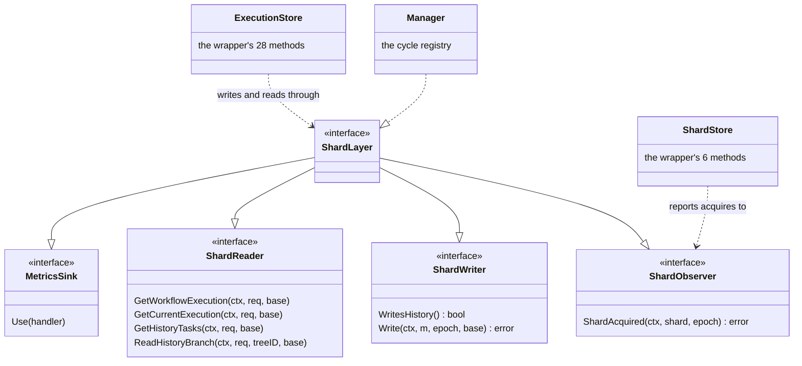

# Contracts at the failure boundaries

## What a boundary must let its caller conclude

An interface matters most when a call does not return the answer its caller wanted. An `Append`
cancelled in flight may have committed unseen; a definite failure would let the caller reuse a seqno
that is already durable, so the contract keeps the ambiguity. A drain that returns an infrastructure
error may apply its batch twice if retried and lose acknowledged writes if discarded; so the applier
classifies what it knows, and an unknown outcome is settled by the watermark, which the drain writes
in its own transaction. A stale owner shown a mutable-state condition failure would take the wrong
recovery path; so the transaction registers the epoch compare-and-swap (CAS) first, and losing
ownership outranks every failure that only makes sense for an owner.

A contract therefore says what may have changed on failure, which conclusions an error supports,
whether the caller retries or stops, and which fact is authoritative after an ambiguous return. This
chapter answers those seam by seam, in the terms of
[chapter 02](02-concepts-and-invariants.md#three-positions-not-two); invariants I1 to I11 are in
[its table](02-concepts-and-invariants.md#the-invariants).

## The seams, at a glance

A deployment implements two seams, `wal.Log` and `cold.Store`, and supplies the versioned
current-row read on its base store; the rest are internal. Each lets the component on either side be
replaced or run without a cluster:

| Seam | Contract | Who implements it | Who calls it |
|---|---|---|---|
| the log | `wal.Log` | `memwal` here; a deployment's own log otherwise | `cycle` |
| one entry | `mutation.Mutation` + `Encode`/`Decode` | — (a value type and a codec) | `wrapper`, `cycle` |
| the server's stores | `wrapper.ShardLayer` (four faces) | `cycle.Manager` | `wrapper.ExecutionStore`, `wrapper.ShardStore` |
| the cold store | `cold.Store` (`cold.Applier` + `cold.Watermarker`) | `memcold` here; a deployment's own store otherwise, and `internal/verify/coldtest` where a suite has to vary a drain's outcome | `cycle` |
| the two pre-window reads | `baserow.Store` | `memcold` here; the base `ExecutionStore` the wrapper decorates otherwise, and `internal/verify/basetest` in tests | `wrapper`, `cycle`, `apply` |

Figure: the interfaces the server's stores talk to, and the one type that satisfies all four.


```mermaid
classDiagram
  class ShardObserver {
    <<interface>>
    ShardAcquired(ctx, shard, epoch) error
  }
  class ShardWriter {
    <<interface>>
    WritesHistory() bool
    Write(ctx, m, epoch, base) error
  }
  class ShardReader {
    <<interface>>
    GetWorkflowExecution(ctx, req, base)
    GetCurrentExecution(ctx, req, base)
    GetHistoryTasks(ctx, req, base)
    ReadHistoryBranch(ctx, req, treeID, base)
  }
  class MetricsSink {
    <<interface>>
    Use(handler)
  }
  class ShardLayer {
    <<interface>>
  }
  class Manager {
    the cycle registry
  }
  class ExecutionStore {
    the wrapper's 28 methods
  }
  class ShardStore {
    the wrapper's 6 methods
  }
  ShardLayer --|> ShardObserver
  ShardLayer --|> ShardWriter
  ShardLayer --|> ShardReader
  ShardLayer --|> MetricsSink
  Manager ..|> ShardLayer
  ExecutionStore ..> ShardLayer : writes and reads through
  ShardStore ..> ShardObserver : reports acquires to
```

Hollow triangles on solid lines are embedding, on dashed lines implementation. `cycle.Manager` is the
only production `ShardLayer`, and the two stores reach the layer no other way.

Figure: the interfaces below the cycle, where the log and the cold store are.


```mermaid
classDiagram
  class Log {
    <<interface>>
    Fence(ctx, shard, epoch) error
    Append(ctx, shard, epoch, seqno, payload) error
    ReadFrom(ctx, shard, from, limit)
    Trim(ctx, shard, upTo) error
    Close()
  }
  class Applier {
    <<interface>>
    Apply(ctx, shard, epoch, batch) error
  }
  class Watermarker {
    <<interface>>
    Watermark(ctx, shard)
  }
  class ColdStore {
    <<interface>>
    Applier and Watermarker at once
  }
  class Store {
    <<interface>>
    GetWorkflowExecution(ctx, req)
    GetCurrentExecutionWithLastWriteVersion(ctx, req)
  }
  class Cycle
  class Rows
  class Deployment {
    a deployment's own
  }
  ColdStore --|> Applier
  ColdStore --|> Watermarker
  Deployment ..|> ColdStore
  Rows ..> Store : reads through
  Cycle ..> Log : fences, appends, reads, trims
  Cycle ..> Applier : drains through
  Cycle ..> Watermarker : reads the watermark through
```

`Store` is `baserow.Store`, `Rows` is `baserow.Rows`, `ColdStore` is `cold.Store`. `cycle` names
no storage: the log, the applier and the watermarker arrive as interfaces, and the pre-window reads
as a `*baserow.Rows` handed down per write, so a test can vary a drain's outcome without a cluster.

## `wal.Log` — the write-ahead log contract

### The five guarantees

Everything above the log (fold, apply, overlay, replay) depends on these five obligations and
nothing else, so any backend that owes them can replace the log.

1. **Total order per shard.** The writer assigns seqnos itself. Epoch fencing keeps it single.
2. **`Fence` atomically cuts off appends of all lower epochs.**
3. **Cumulative ack.** A successful `Append` up to seqno *n* means every entry ≤ *n* is durable.
   So "confirmed ⟺ seqno ≤ commitSeqno" is inherited from the log rather than implemented above it.
4. **Gap-freedom.** An append never skips a seqno, so replay needs no hole tracking: with holes,
   every consumer would have to tell "never written" from "in flight", which only a timeout answers.
   This is the guarantee a new backend most often relaxes by accident.
5. **Readback.** `ReadFrom` returns every entry a completed append acked and no trim has removed,
   in seqno order. `Trim` moves the lower end and nothing else: what it leaves stays readable, and
   the shard's ownership and next seqno survive it. A retention window, a table TTL or a compaction
   that drops old records breaks this silently; `waltest.CheckRetention` is the deployment's check,
   since the millisecond suite cannot express time.

A payload is opaque bytes; there are no Temporal types in `wal` or its implementations.

### What the contract does not say: what an append costs

Nothing above the log can tell a fast log from a slow one, so whether the log is cheaper to append
to than the cold store is to commit to stays the deployment's decision, unchecked by waltz. If it is
not, everything works and nothing is gained. Two obligations sit in that gap, and no suite here
reaches them:

* **An append should be one immediate write over adjacent keys of the log's own storage**
  (invariant [I9](02-concepts-and-invariants.md#the-invariants)): no index, no changefeed, no read
  of another table. A backend that takes a distributed transaction per append is a correct log and
  a pointless one.
* **The log should be able to fail separately from the cold store.** A log in the same database
  cannot: one incident is an incident of both
  ([I10, at more length](02-concepts-and-invariants.md#i10-at-more-length)).

The conformance suite drives one `wal.Log` value and cannot see the storage under it: a backend that
acks into memory it never persists passes every case. `waltest.CheckReopen` covers half of that; a
fence racing a displaced owner's append needs two writers and stays the deployment's own test
([chapter 11](11-verification.md#what-the-contract-suite-cannot-see)).

`memwal` is an implementation, not a test double, so the contract lives in the suite:
`waltest.RunContractSuite` asserts every obligation once, payload ownership and the spentness of
trimmed seqnos included, and judges every backend, `memwal` included. `memwal` has no knobs and no
fault-injection points: `New()` takes nothing, and `memwal.Backend` exposes the five contract methods
only. A caller that needs a failing log wraps a real one with `waltest.NewFaulty`, which asks a
`waltest.Fault` before each call and delegates everything the fault admits.

The contract has no batch: `Append` takes one payload, so a half-written append cannot arise and
`ErrAlreadyWritten` stays an unqualified ack, at the cost of the retry a pipelined append pays
([chapter 13](13-designs-that-were-rejected.md#a-batch-of-entries-in-one-append)).

### The vocabulary

| Type | What it is |
|---|---|
| `wal.ShardID` (`uint32`) | one Temporal history shard; every shard has its own log |
| `wal.Seqno` (`uint64`) | an entry's position in one shard's log — a per-shard LSN the writer assigns itself |
| `wal.Epoch` (`uint64`) | the ownership token every append carries, identical to Temporal's rangeID (invariant I11) |
| `wal.FirstSeqno` (= 1) | the seqno of a shard's first entry; anything below it is backend bookkeeping, not an entry |
| `wal.Entry` | `{Seqno, Epoch, Payload}` — one record of a shard's log |

Whoever hands epochs out owes the log a strictly greater epoch per acquire, since fencing cannot
separate two writers at the same epoch; an epoch may also grow without an ownership change
([chapter 06](06-shard-lifecycle.md#2-use-the-ownership-token-temporal-already-has)).

### Method by method

| Method | Promises | Refuses | Leaves behind on failure |
|---|---|---|---|
| `Fence(ctx, shard, epoch) error` | claims the log for `epoch`, atomically cutting off every append of a lower epoch (I4); idempotent per epoch, so a restart may replay its acquire; entries stay and the new owner continues at the next seqno | a lower epoch than the one held (`ErrFenced`); epoch 0 (`ErrZeroEpoch`) | nothing, ownership included |
| `Append(ctx, shard, epoch, seqno, payload) error` | writes `payload` at `seqno` under `epoch`; nil means every entry up to `seqno` is durable, so the caller's commitSeqno becomes `seqno` | `ErrFenced`, `ErrAlreadyWritten`, `ErrGap`; a `seqno` below `FirstSeqno`; a nil payload (an empty one is an entry); epoch 0 | nothing for these refusals; any other error, cancellation in flight included, may leave the entry durable |
| `ReadFrom(ctx, shard, from, limit) ([]Entry, error)` | up to `limit` entries at or above `from`, in seqno order; after a successful `Fence` it sees every entry the log held when the fence took it | a non-positive `limit` | nothing |
| `Trim(ctx, shard, upTo) error` | deletes entries at or below `upTo`; the log stays appendable at the next seqno and ownership stays put | nothing: trimming absent entries is not an error | the same log, appendable and owned, at worst partly shorter; a failed trim is retried at the next cadence, or forced again while storage pressure stands |
| `Close()` | releases what the backend holds around the log (a connection, a lease, a goroutine keeping ownership alive); called once, after the last append and any drain | nothing | the entries, each shard owned by the fencing owner until that expires or a successor takes it: a close is neither a drain nor a fence |

Four rules do not fit the table:
* **`from` is clamped, not refused.** A `from` below `FirstSeqno` reads from `FirstSeqno`, and fewer
  than `limit` entries means the log ends there. `wal.Entries(ctx, log, shard, from, page)` is that
  loop as an `iter.Seq2[Entry, error]`: it ends at a short page, yields the zero entry with the
  error on a failed read and stops, and refuses a full page ending below the seqno it asked for, so
  a backend that ignores `from` cannot make it spin.
* **A trim may keep the log's last entry**, or any entry it needs to promise appendability (one that
  checks gap-freedom against the entry below the append keeps that one). Removed seqnos stay spent:
  an append at one is refused and writes nothing, as `ErrAlreadyWritten` or `ErrGap`, unspecified,
  since a backend deriving the answer from its rows has deleted them.
* **Context semantics are the same for all four methods that take one.** A context cancelled before
  the call is observed before the log changes. Cancellation in flight is not resolved: a cancelled
  `Append` may be durable and counts as an attempt like any other. Context errors satisfy
  `errors.Is` against `context.Canceled` or `context.DeadlineExceeded`; a call both cancelled and
  malformed reports the argument. The suite's `ACancelledContextChangesNothing` drives the resolved
  cases.
* **Payload ownership runs both ways.** No backend retains or reads a slice after `Append` returns,
  so an encoder may reuse its buffer at once. An `Entry.Payload` is the reader's to keep: it aliases
  neither the log's state nor another entry of the same read, and is never nil.

Every method is safe for concurrent use, which is not a licence for two writers: concurrent appends
to one shard race for seqnos and lose.

### The four sentinel errors

Match with `errors.Is`; implementations wrap them. Any other error is a programming mistake or an
infrastructure failure.

| Error | Returned when | What the caller must do |
|---|---|---|
| `wal.ErrFenced` | the log is not the caller's: `Fence` below the held epoch, or `Append` under an epoch that is not the fenced one, or with no fence at all | stop writing: ownership is gone, or was never taken |
| `wal.ErrAlreadyWritten` | `Append` at a seqno the log already holds | read it as the ack: after an ambiguous append, it says the append landed |
| `wal.ErrGap` | `Append` whose predecessor seqno is absent (guarantee 4) | retry once the predecessor lands; the normal outcome of a pipelined append that arrived out of order |
| `wal.ErrZeroEpoch` | `Fence` or `Append` with `epoch == 0`, which means "nobody owns this" | fix the caller: it forgot to set an epoch |

Where more than one error applies, `ErrFenced` wins: `ErrAlreadyWritten` is an ack, and a zombie
handed one would take the new owner's write as its own commitSeqno. The cost is that a writer whose
epoch grew across an ambiguity gets `ErrFenced` rather than the ack, and must replay under its
current epoch or read the log to learn whether the first attempt landed.

[`wal/refuse.go`](../../wal/refuse.go) holds the argument checks and the diagnosis in the
contract's order; a backend that diagnoses in its own order answers a different contract:

* `CheckFence`, `CheckAppend`, `CheckRead` (which also returns the clamped start seqno) and
  `CheckTrim` (which answers whether the trim reaches any entry at all);
* `FenceRefusal`, and `AppendRefusal` over an `AppendState{Owner, Taken, HasPredecessor}`;
* `RefuseAtNext`, which is `AppendRefusal` for a backend that keeps the seqno its log continues at
  instead of answering `Taken` and `HasPredecessor` separately.

### `wal.PressureSource` — the optional pressure face

Some backends commit an append and, in the same response, warn that storage is running low. Failing
the append would deny an entry the log holds, so the warning travels beside the contract:

```go
type PressureSource interface {
    Pressure(shard ShardID) PressureLevel
}
```

A backend without such a signal does not implement it. One that does keeps a *level* current from
what its own operations observe, and lowers it itself once the condition clears. The levels are
`PressureNone`, `PressureDrain` and `PressureStop`, ordered, each asking everything the ones below
ask. The layer polls the level around every write and on the age tick; the level describes the
storage, not the call that noticed.

* **`PressureDrain`**: stop accumulating. Every accepted windowed write drains the window at
  whatever size it has (`wal_drains{trigger="storage_pressure"}`; a sync write drains anyway, under
  its own trigger). Every committed drain trims at the new watermark with the cadence bypassed. An
  acquire trims what the previous owner left applied before the first new append. The age tick
  covers a shard nothing is writing to, and retries a forced trim that failed.
* **`PressureStop`**: in addition, new appends are refused before they reach the log, with the same
  unwrapped `ResourceExhausted` as I10's bound and
  `wal_backpressure_refusals{limit="storage_pressure"}`. Reads still answer. The first write after
  the backend lowers the level goes through; there is nothing to reset.

The level never changes the answer of the append whose response carried it, which stays a durable
acknowledgement, and never moves the trim past the watermark.

## `mutation` — what one entry is

One `mutation.Mutation` is one `ExecutionStore`-level write request and the unit of atomicity: one
mutation is one log entry (invariant I1). It is a struct of eight pointer fields, exactly one of
them set. `Mutation.Kind()` reports which, and `KindInvalid` for none or several; every caller that
fans out over the kinds wraps `mutation.ErrNotExactlyOneRequest`, so one `errors.Is` matches them
all.

### The kinds

The eight kinds, from `mutation/kinds.go`; `mutation.KindCount` is one past the last:

| Kind | `Kind.String()` | The request it carries | Carries a rangeID | Carries new history events |
|---|---|---|---|---|
| `KindCreate` | `create` | `InternalCreateWorkflowExecutionRequest` | yes | yes (1 slot) |
| `KindUpdate` | `update` | `InternalUpdateWorkflowExecutionRequest` | yes | yes (2 slots) |
| `KindConflictResolve` | `conflict-resolve` | `InternalConflictResolveWorkflowExecutionRequest` | yes | yes (3 slots) |
| `KindSet` | `set` | `InternalSetWorkflowExecutionRequest` | yes | no |
| `KindDelete` | `delete` | `DeleteWorkflowExecutionRequest` | no | no |
| `KindDeleteCurrent` | `delete-current` | `DeleteCurrentWorkflowExecutionRequest` | no | no |
| `KindAddTasks` | `add-tasks` | `InternalAddHistoryTasksRequest` | yes | no |
| `KindRangeCompleteTasks` | `range-complete-tasks` | `RangeCompleteHistoryTasksRequest` | no | no |

### What each kind asserts

`fold/assert.go` derives what each kind claims about the store, per kind and per mode. Beside the
epoch CAS every drain carries, the drain asserts the current row before run rows:

| Kind | What it asserts about the current row | What it asserts about run rows |
|---|---|---|
| `KindCreate` | it must not exist (`BrandNew`); or it names `PreviousRunID` at `PreviousLastWriteVersion` (`UpdateCurrent`); nothing at all, and no write to it, under `BypassCurrent` | the new run must not exist |
| `KindUpdate` | it names the mutated run (`UpdateCurrent`); it does not name it (`BypassCurrent`); nothing under `IgnoreCurrent` | the mutated run at `DBRecordVersion − 1`, plus a must-not-exist for the second run a continue-as-new carries |
| `KindConflictResolve` | it names the run the store believes current — the mutated current run where there is one, the reset run otherwise (`UpdateCurrent`); or it does not name the reset run (`BypassCurrent`) | the reset run at its version, a current-run mutation at its own, and a must-not-exist for a new run |
| `KindSet` | nothing: a set is a repair of one run's state, not a claim about which run is current | the run at `DBRecordVersion − 1` |
| `KindDelete`, `KindDeleteCurrent`, `KindAddTasks`, `KindRangeCompleteTasks` | nothing | nothing |

Deleting a workflow is not one atomic operation. The server's deletion flow sends `KindDelete` and
`KindDeleteCurrent` as independent mutations: either arriving alone folds to what the sequential path
would have done.

### The accessors

* `ShardID() int32` is the routing key: one shard is one log and one apply transaction. It answers
  0 for `KindInvalid`.
* `RangeID() int64` is the epoch the caller wrote under, read off the request and never carried in
  the payload.
* `TaskSlot(part)` returns one part's history-task map, and `TaskSlots()` every one the request
  carries, in `PartSnapshot`, `PartNewSnapshot`, `PartMutation` order; callers concatenate the slots,
  so the order is contract. The pointer aliases the map's home in the request, so a range delete
  writes through it.
* `EventSlots()` returns every slice of new history events the request carries, in the order they
  must reach the store; `ClearEvents()` drops them in place. The payload carries whatever is still
  there, so a mutation reaching the layer carries exactly the unwritten batches and neither the codec
  nor the fold needs a mode of its own (who writes the events is the wrapper's
  [first obligation](#wrapperexecutionstore--28-methods)).

### The codec

`Encode(m)` and `EncodeProvisional(m)` produce a payload; `Decode(payload, registry)` and
`DecodeEntry(payload, registry) (Mutation, bool, error)` read one back. The bool is the provisional
flag: a condition failure on this entry is a drop at replay rather than a halt. Windowed writes use
`Encode`, since their conditions are decided before the append; sync mode uses `EncodeProvisional`,
since its drain answers the caller directly.

Five errors are the caller's to handle:

* `ErrUnknownCategory` (`Decode`): the entry names a task category this process does not have. Fail
  the replay; skipping the group would drop its tasks silently.
* `ErrCassandraBlob` (`Encode`): a CHASM node (a component of the server's newer state-machine
  framework, persisting its own blobs beside the mutable state) carries a Cassandra-encoded blob the
  record has no field for.
* `ErrUncarriedProto` (`Encode`): a request's parsed execution info or state is set with no blob
  carrying it.
* `ErrBlobEncoding` (`Encode`): one of those two blobs is in an encoding `Decode` cannot parse.
* `ErrMalformedHistory` (both): an event batch lacks something the fold keys on or the applier
  writes.

`Encode` refuses because past the append every owner inherits the entry. It is a function of its
argument alone: collections travel as repeated entries in sorted key order, so a mutation encodes to
the same bytes in any process. The task-category registry is a parameter, not a package default,
because the same payload decodes on one node and fails on another. `Decode` rejects a payload whose
`format` is not this build's and unknown protobuf fields anywhere in the tree, since an entry from a
newer codec would otherwise replay silently short a piece.

### Why the record is a hand-written mirror

No reflective encoder survives the persistence request structs: the `Tasks` map is keyed by
`tasks.Category`, which marshals and does not unmarshal, and `gob` refuses the type outright. So the
record mirrors them field for field, and a field Temporal adds is a field this format silently omits:
the encode compiles, the entry is durable, and state has stopped travelling.

`TestFieldSetGuard` in `mutation/fieldset_test.go` walks `reflect` over every mirrored request struct
and fails by name on a field added, removed or moved. Each field has a decision, *carried*, *derived*
or *dropped*, with a reason for the last two. `kinds.go` decides which structs it walks, and
`TestEveryKindsRequestStructIsWalked` holds it to that. A Temporal bump that adds a field is expected
to fail; recording the field without a decision is never the fix.

## `fold` — the exported surface

### The accumulator and `Add`

`fold.New(shard) *Accumulator` folds one shard's window. It is not safe for concurrent use; the
shard's single-threaded apply loop owns it. `Add(seqno, m)` folds the mutation whole, or returns an
error and leaves the accumulator as it was. It takes ownership of what it is handed, since requests
merge in place, so a caller that needs the mutation afterwards copies it first. Seqnos must strictly
increase across drains: one accumulator follows one log.

A seqno not above the last, a mutation of another shard, and one holding no single request are the
caller's bug and return ordinary errors. Three errors partition what `Add` can refuse of a
well-formed call:

| Error | What it reports |
|---|---|
| `ErrAfterTombstone` | a mutation on a run the window already deleted. `Check` refuses such a mutation before it is acked, so a log that still produces one is corrupt |
| `ErrInvalidStream` | a mutation that cannot follow the window's mutations in any acked stream: a create of a run the window holds live, or a second continue-as-new out of the same run |
| `ErrRefused` | a *valid* window this accumulator cannot express as merged requests, such as an assertion on a current row a delete-current has already tainted: that delete asserts nothing, so the assertion would be a mid-window claim dressed as a head-of-window one |

Only `ErrRefused` has a recovery: the accumulator is unchanged, so the caller drains and starts the
refused mutation on a fresh window. `AddOrDrain(seqno, m, drain)` and `CheckOrDrain(m, drain)`
implement it and answer with a `Refusal{Drained, DrainFailed}`: `Drained` says the window was closed
to make room, `DrainFailed` that the error is the drain callback's own and already classified, not a
fold invariant violation.

### The condition authority

`Check(m) (Delegated, error)` reports what the store would have answered, as far as this window
determines it. It is read-only on the accumulator, so a refusal is safe to retry. A nil error means
nothing this window determines refuses the mutation, not that every assertion held: those standing
on the pre-window row come back in `Delegated{Current *DelegatedCurrent, Runs []DelegatedRun}`.
`Delegated.Any()` reports whether the mutation costs a cold-store read at all.
`Delegated.Settle(current, run)` hands each obligation to a caller that can read the row, current
row before run rows, and stops at the first non-nil answer. The predicates are
`DelegatedCurrent.Verify(base, lastWriteVersion)` and `DelegatedRun.Verify(base)`.

### The overlay

`ViewRun(namespaceID, workflowID, runID) RunView` and `ViewCurrent(namespaceID, workflowID)
CurrentView` are all a reader branches on. `RunView.Shape` is one of `RunAbsent`, `RunSnapshot`,
`RunDelta`, `RunTombstone`; `CurrentView.Shape` one of `CurrentUnheld`, `CurrentWritten`,
`CurrentGone`, `CurrentGuarded`. Each view also has `NeedsBase()`, `Held()` and `Render(base)`, and
is valid only until the next mutation folds in. [Chapter 07](07-read-path.md) says what each shape
means for an answer.

### The drain and the batch

`Drain() Batch` emits the window and resets the accumulator. Only `Drain` builds a `Batch`, so the
apply side can rely on its guarantees: requests in tail-seqno order, one shard (`Shard()`), and a
`Watermark()` at or above every seqno they carry. `Batch` also answers:

* `Empty()`, `Len()`, `Stats()`;
* `Settles() (wal.Seqno, bool)`, false for a window that folded nothing at all;
* `Tasks() TaskWork`, the shard-level half: a task names no run and asserts nothing;
* `History()`, the window's event batches in log order, which any applier handed them owes, whether
  or not it declares `cold.HistoryApplier`;
* `Each() iter.Seq[*Emitted]`.

One `Emitted` is one merged request: `NamespaceID`, `WorkflowID`, `HeadSeqno`, `TailSeqno`,
`Request`, `BufferedBatches`, plus `RunAssertions()`, `OrphanedTasks()`, `Workflow()` and
`FirstOfWorkflow()`. Every request names a `WorkflowRecord`: the workflow's head-of-window assertion
(`Current`), the current row the window would write (`CurrentWrite`) and whether the window's net
effect removed that row (`CurrentRemoved`). Orphaned tasks appear only on a tombstone: the tasks of
the mutations it collapsed, which the `Delete` has no slot for, and losing them would break I8.

Buffered events do not merge, since a request has one `NewBufferedEvents` slot.
`Emitted.BufferedBatches` lists each mutation's batch in arrival order with its own run id, and the
merged request's slot is always nil. An applier writes one buffered-events row per batch, after the
merged request that may have cleared the existing rows
([chapter 02](02-concepts-and-invariants.md#i8-at-more-length)).

### The page merges

`Accumulator.TaskPage(req, base BasePage)` is the merge-on-read for tasks, and
`Accumulator.HistoryPage(req, treeID, base HistoryBasePage)` the same for one history branch.
`BasePage` is `func(batch int, token []byte) ([]p.InternalHistoryTask, []byte, error)`: a batch size
and a token are the only two things the merge decides; the range, category and shard stay the
caller's. The token is the base's own bytes, passed through unparsed, and a zero-length token back
means the base is exhausted. The base is called at most once per page, and not at all once
exhausted. Its error is returned unwrapped and never swallowed, since a page that quietly omitted the
store's rows would lose them.

The merge builds a page's reach from what the base last returned, not from a cursor of its own, so
it checks four things of the base:

| Requirement | Error | What breaks without it |
|---|---|---|
| every row is inside the range asked for | `fold.ErrBaseRowOutsideRange` | rows are filtered only against the window's undrained deletes, and `queues/slice.go` panics on a key outside the range, with no recover in the reader loop |
| no later page holds a key at or below the last key of an earlier one | `fold.ErrBasePageNotAscending` | that key bounds the window's half of the page and is what the token carries; `queues/iterator.go` silently skips what does not ascend, and nobody asks for that task again |
| a page with no rows means the range is exhausted | `fold.ErrBasePageEmptyBesideAToken` | a token beside an empty page is read as the end, so the queue completes its range over rows it was never shown, deleting acknowledged task rows |
| a page holds at most the batch it was asked for | `fold.ErrBasePageTooLarge` | where the window alone overflows a page the ask is one row, and a row sent unasked is passed unemitted by the cursor and deleted by the range completion |

Temporal's SQL and Cassandra plugins satisfy all four; the checks exist because a failing read is
cheaper than deleted task rows. `HistoryBasePage` is held to three (page size, the store's own order,
no empty page beside a token); the range check does not apply, since the store and the merge both
filter by node id. Both page types owe one more, unchecked: a token handed back must answer the same
rows, because a base page the cut emits nothing from is reached again only through its own token.

## `wrapper` — the method tables

The mode switch is one field, `wrapper.Options.Layer`: nil is passthrough, non-nil is
intercept. `Options.Metrics` is a `*walmetrics.Emitter` and nil records nowhere.

### `wrapper.ExecutionStore` — 28 methods

Passthrough changes none. Intercept mode answers twelve differently and refuses a thirteenth:

| Method | Disposition in intercept mode |
|---|---|
| `CreateWorkflowExecution`, `UpdateWorkflowExecution`, `ConflictResolveWorkflowExecution`, `SetWorkflowExecution`, `DeleteWorkflowExecution`, `DeleteCurrentWorkflowExecution`, `AddHistoryTasks`, `RangeCompleteHistoryTasks` | intercepted: one entry of the matching [kind](#the-kinds) |
| `GetWorkflowExecution` | from the layer: the overlay, the base read handed down as a closure |
| `GetCurrentExecution` | from the layer: the overlay |
| `GetHistoryTasks` | from the layer: the task merge |
| `ReadHistoryBranch` | from the layer: the history merge, always, the base read handed down as a closure |
| `CompleteHistoryTask` | refused with `wrapper.ErrCompleteHistoryTaskUnsupported` |
| `Close`, `GetName`, `GetHistoryBranchUtil`, `ListConcreteExecutions` | transit |
| `PutReplicationTaskToDLQ`, `GetReplicationTasksFromDLQ`, `DeleteReplicationTaskFromDLQ`, `RangeDeleteReplicationTaskFromDLQ`, `IsReplicationDLQEmpty` | transit |
| `AppendHistoryNodes`, `DeleteHistoryNodes`, `ForkHistoryBranch`, `DeleteHistoryBranch`, `GetHistoryTreeContainingBranch`, `GetAllHistoryTreeBranches` | transit |

That is 8 intercepted writes + 4 reads answered from the layer + 1 refusal + 15 transits = 28.
The history read always merges, because a tail written under a store that took the batches may be
replayed by a node composed with one that does not.

`ErrCompleteHistoryTaskUnsupported` is a `serviceerror.NewUnimplemented`: the log's deletion record
is a range per category, and forwarding would report success for a task still in the window, whose
row the cold store does not yet hold. Its one caller is the history handler's `RemoveTask`, so the
admin remove-task API is unavailable on a node in intercept mode.

The intercepted path carries three obligations, which the store discharges:

* **The events are durable no later than the state that names them, and the cold store decides
  which writer makes them so.** Over a store that does not declare `cold.HistoryApplier`, every
  intercepted write calls `AppendHistoryNodes` on the base store for each of the mutation's
  `EventSlots()` before the mutation reaches the log, and strips them off it with `ClearEvents()`.
  Over one that does, they ride the record and the drain writes them no later than it publishes the
  state. Either way a mutable state is never acked over history rows nobody wrote, a state the cold
  store could never reach.
* **Errors are returned as they arrive, unwrapped.** `ContextImpl.handleWriteErrorLocked` in the
  history service type-switches on concrete values, so one `%w` would turn an expected condition
  failure into a background re-acquire.
* **Construction can fail.** `NewExecutionStore(base, opts)` returns an error wrapping
  `baserow.ErrNoVersionedRead` when intercept mode is asked for over a base store that cannot read a
  current row's `last_write_version`, so the server learns it while starting, not at the first
  create.

`ExecutionStore.Counts() Counts` reports what the store saw: `Intercepted` (the mutable-state writes
and the two tombstones that took the WAL path), `TasksWritten` (`AddHistoryTasks`),
`TasksCompleted` (`RangeCompleteHistoryTasks`), `Overlaid` (mutable-state reads routed through the
layer), `TaskReads` and `HistoryReads` (`GetHistoryTasks` and `ReadHistoryBranch` pages routed at
the merge). Every field counts on the way in, so a write the tail refused is counted. All are zero
in passthrough mode.

### `wrapper.ShardStore` — 6 methods

| Method | Disposition |
|---|---|
| `UpdateShard` | observed, then transits — the layer's only window onto shard ownership |
| `Close`, `GetName`, `GetClusterName`, `GetOrCreateShard`, `AssertShardOwnership` | transit |

`UpdateShard` calls `ShardObserver.ShardAcquired` before delegating, only when
`request.RangeID != request.PreviousRangeID` (an equal pair is a heartbeat). An observer error fails
the acquire without calling the base store, so a failed fence never leaves a moved rangeID behind
([chapter 06](06-shard-lifecycle.md#1-first-exclude-the-failed-owner)).

Two transits look like ownership signals and are not, so nothing may be keyed on either.
`GetOrCreateShard` runs on first load only, and the admin `GetShard` API calls it with no shard
context behind it. `AssertShardOwnership` checks whatever the base plugin decides: Temporal's SQL
and Cassandra shard stores both return `nil` without looking, and dynamic config can switch off the
shard controller loop that drives it.

### The wrapper's own interfaces

* **`ShardObserver`** — `ShardAcquired(ctx context.Context, shard wal.ShardID, epoch wal.Epoch)
  error`. The epoch is the new rangeID (I11), and the error reaches the shard context unwrapped.
  Nothing reports the other direction: closing a shard makes no persistence call.
* **`ShardWriter`** — `WritesHistory() bool` and `Write(ctx context.Context, m mutation.Mutation,
  epoch wal.Epoch, base *baserow.Rows) error`. `WritesHistory` false puts the event batches on the
  store (the first obligation above). The mutation names its own shard.
  * After `Write`, `m`'s request is the layer's: a windowed mode merges it in place, so the caller
    may not read or reuse it.
  * `epoch` is the rangeID the caller wrote under, so a write from a fenced-out shard context is
    refused rather than re-stamped. Zero means "none named", not "epoch 0": the two deletes and the
    range delete carry none, and the drain's epoch CAS fences them.
  * The error is the store's own (condition failure, fenced shard, tail at its bound), unwrapped. A
    condition failure is always this caller's: a windowed mode settles it before the append, by
    fold's `Check` or the pre-window read it delegates; under `Sync` the drain decides it over a
    one-mutation window.
  * `base` is called on the goroutine that owns the window, at most once per asserted row.
* **`ShardReader`** — four reads, each taking the caller's request and the cold store's answer as a
  closure, so the layer decides whether to call it. `GetWorkflowExecution` and `GetCurrentExecution`
  take `base func(context.Context) (…, error)`. `GetHistoryTasks` takes `base func(context.Context,
  *p.GetHistoryTasksRequest) (…, error)`, because the merge asks a different question: `BatchSize`
  minus what the window contributes, resumed from the base's own token; the token it returns is this
  layer's, carrying the base's inside. `ReadHistoryBranch` takes a `treeID string` beside its
  request, parsed from the branch token by the wrapper because the codec is the base store's, and
  `base func(context.Context, *p.InternalReadHistoryBranchRequest) (…, error)`. For a shard the
  layer does not hold, the two mutable-state reads and the branch read fall through to the base; the
  task read is refused, because its one caller would otherwise ack past a page missing tail entries.
  Errors come back unwrapped.
* **`MetricsSink`** — `Use(h metrics.Handler)`. Called with the handler the server gave
  `NewFactory`, before the stores it built serve anything, once per persistence graph; an
  implementation takes the first handler and ignores the rest.
* **`ShardLayer`** — all four faces embedded, so a half-composed layer does not compile; at run time
  each missing face would fail quietly. A writer with no reader reads stale. A write path never told
  about an acquire refuses every write for that shard, which looks like lost ownership, so the
  caller re-acquires instead of seeing a misconfiguration. A layer with no metrics handler emits
  nothing while every suite stays green. For the same reason there is no "the layer is on" flag: a
  flag and a nil layer could disagree.

## `apply` — what a drain's outcome demands

The drain is the deployment's to write. `cold.Applier` is one method,
`Apply(ctx, shard wal.ShardID, epoch wal.Epoch, batch fold.Batch) error`, which must write the
batch's merged requests, the epoch CAS and the watermark in one all-or-nothing transaction. Nothing
in waltz can check that, and every invariant downstream of the ack rests on it.

The `apply` package is the vocabulary the answer comes back in, and writes nothing itself:
`Classify` sorts an `Apply` error into classes and `Attribute` builds the attribution a violated
invariant carries. An applier must wrap every error raised before anything was sent to the store in
`apply.Refuse(err)`, which makes `Classify` answer `ClassRefused`; unmarked, a pre-flight refusal
reads as an unknown outcome, and the shard goes looking for a transaction that never existed.

The requests name no epoch the applier may use, since a replayed request lost its rangeID with the
payload; every drain asserts under the epoch `Apply` was handed.

An applier must bound its own calls. The context `Apply` receives often has no deadline: five
drains (the age tick's, both size triggers', the refusal drain's and the storage-pressure drain's)
run detached, because they carry earlier writers' acked mutations and one expired client deadline
must not fail them. An `Apply` that blocks forever blocks the shard's whole loop, writes and reads
alike, and makes `Layer.Shutdown` outlast its budget
([chapter 09](09-operations.md#2-start-and-stop-order)). The layer imposes no timeout, since a drain
it cut short would be an unknown outcome, which stalls the shard; the store's driver, statement or
request timeout is the only bound.

### What a drain asserts, and what it must not

Three rules bind the applier, and none appears among the assertions a drain registers.

A drain asserts nothing about a row it deletes. A batched conditional write usually evaluates every
assertion, then gates every write statement on "no assertion failed", so one failed assertion
commits a transaction that wrote nothing, and an assertion about a row the same transaction removes
can fail that way and silence every statement after it. So the applier gathers the rows a batch
deletes before driving the first request, since a later request may delete the row an earlier one
would have asserted. A tombstone stands on the epoch CAS alone, still more than the sequential
delete asserts.

The delete-current guard stays a guard. `DeleteCurrentWorkflowExecution` removes the row only if it
names the request's run, and a mismatch is ordinary traffic: "nothing to delete" at its own position
in the stream. Asserting `current == run` at the drain would ask it at the wrong time, since a
folded window's assertions are all head-of-window, and turn that no-op into a false invariant
violation that halts the shard. Where the window itself wrote the row it deletes
(`fold.WorkflowRecord.CurrentRemoved`), no guard is passed: the window already knows what it held.

A drain's statement text must be a function of assertion kinds and delete families, never of how
many mutations the window folded
([chapter 13](13-designs-that-were-rejected.md#a-folded-window-as-a-concatenation-of-the-stores-own-queries)).

### `apply.Class` — sorting the outcome

`Classify(err) Class` sorts what `Apply` returned. Anything it cannot prove refused, fenced or
condition-failed is an unknown outcome, because calling a commit a failure applies a batch twice.

| Class | `String()` | What happened | What the caller must do |
|---|---|---|---|
| `ClassCommitted` | `committed` | the drain committed, watermark included | continue |
| `ClassRefused` | `refused` | a pre-flight refusal, marked by `apply.Refuse` (`errors.Is(err, ErrRefused)`) | there is no outcome to recover, only an input to fix |
| `ClassShardLost` | `shard lost` | the epoch CAS failed: a `*p.ShardOwnershipLostError` | stop writing under this epoch; do not retry the drain |
| `ClassInvariantViolated` | `invariant violated` | a version or current-row assertion failed | halt the shard, do not retry. Under fencing this layer is the shard's only writer, so a failed assertion is a broken invariant and not contention. The exception is the drain's own `callerRule`: a one-mutation sync window answers its caller instead, and a replayed provisional entry is dropped. The cycle picks between the three |
| `ClassUnknownOutcome` | `unknown outcome` | an ambiguous code reached the cycle; the transaction may or may not have committed | read the watermark before anything else; re-folding by version instead corrupts |

`Classify` recognises Temporal's three assertion-failure types (`*p.WorkflowConditionFailedError`,
`*p.CurrentWorkflowConditionFailedError`, `*p.ConditionFailedError`), so an applier reporting a
failed assertion the persistence interface's way needs no extra work.

### `*apply.InvariantViolationError` — the attribution

A store's condition failure reports one failing assertion and names no workflow.
`apply.Attribute(ctx, rows, cause, shard, batch)` reads back every row the drain asserted and builds
the error that names them. It only reads, and must run after the transaction: a row read before the
epoch is held can see a previous owner's in-flight transaction land, and report a divergence that is
not a bug.

| Field | What it holds |
|---|---|
| `Cause` | the store's own condition failure, as it reached the classifier; `Unwrap` returns it |
| `Diverged []Diverged` | every row the readback found to differ from what fold asserted; empty if the divergence was repaired before the readback, which does not change the class |
| `CutSeqno` | the highest seqno a partial re-drain may acknowledge: one below the lowest entry answering for any diverged row. Zero means nothing may be, and covers no divergence found, `wal.FirstSeqno` diverged, and a failed readback. Forensic only: no code re-drains partially |
| `ReadbackErr` | set when the attribution read itself failed; `Diverged` is then incomplete |

One `Diverged` names one row by `NamespaceID`, `WorkflowID` and `RunID` (empty for the
current-execution row). `AssertedBase` and `ActualBase` are each −1 when that side has no version:
`AssertedBase` under a must-not-exist assertion, `ActualBase` for an absent row, both for any
current-row divergence. `Detail` always says what was asserted and what the cold store holds, and
`HeadSeqno` and `TailSeqno` bound the window slice answering for the row.

### The recovery rule the watermark exists for

`cold.Watermarker` is one method, `Watermark(ctx, shard) (wal.Seqno, bool, error)`, and the only
read the layer makes through the `cold` seam (the reads through `baserow.Rows`, `fold.BasePage` and
`fold.HistoryBasePage` go to the base store the wrapper decorates). The rule: after an unknown
outcome, read `appliedSeqno` before anything else, whatever the drain appeared to do.

The watermark rides the drain's own transaction, so it moved if and only if the batch committed, and
it is the only record of that: a drain whose assertion failed may still commit
([see above](#what-a-drain-asserts-and-what-it-must-not)), byte-identical to one that never ran.
The answer is read by equality, not "at or above":

* Equal to the drain's own seqno: that drain committed, since an applier sets the watermark to the
  batch's own `Watermark()` and nothing else.
* Below it, or `ok` false: it did not commit.
* Above it: another owner moved it, since nothing of this cycle's can commit over an unresolved
  drain, so the shard is gone. Reading it as "mine committed" would hand a caller somebody else's
  transaction.

The caller owns seqno discipline (I5): the seqno asked about must name one drain and no other. "It
did not commit" is not an instruction to re-apply: the window is already drained, so a rebuilt batch
would stand on mutated state. The batch's acknowledged writes are still in the log, and the halt
keeps them there for the next owner. What the cycle does with each answer, and the stall when the
watermark cannot be read, are in
[chapter 05](05-write-path.md#7-failed-drain--the-outcome-could-not-be-read); the halt classes in
[chapter 06](06-shard-lifecycle.md#5-halts-the-two-classes).

The `Applier` and the `Watermarker` must be the same cold store: if a writer moves one watermark
while a watermarker reads another, every ambiguous drain reads as "it did not commit", and a shard
halts over a drain that had written. `waltz.Backends.Cold` takes a `cold.Store`, which embeds both,
so through `Compose` the mistake cannot be expressed. `cycle.Deps` keeps the halves in separate
fields (`Writer`, `Recoverer`) so a suite can stop the watermark answering while the applier
commits; the obligation falls only on a caller who builds a `cycle.Manager` by hand.
`memcold.Store` and `internal/verify/coldtest.Cold` are each one value satisfying both.

### The implementation shipped at this seam

`cold/memcold` is the one cold store in this tree, and it is Temporal's own. `memcold.Store` embeds
the `persistence.ExecutionStore` that `sql.NewFactory` vends over an in-process SQLite database
(`modernc.org/sqlite`, pure Go: no cgo, no container, no port, no file) and shadows none of its 28
methods; schema, row layouts, serialisation and error classes are upstream's, and Temporal's four
exported persistence suites judge it as they judge any plugin
([chapter 11](11-verification.md#the-cold-stores-suites-are-temporals)). It adds what Temporal has
no method for:

* `Apply`, the folded window's single transaction;
* the watermark: the method `Watermark`, and the package-level `SetWatermark(ctx, tx, shard,
  seqno)` an applier calls inside its own transaction, over a `waltz_watermarks` table of memcold's
  own;
* `GetCurrentExecutionWithLastWriteVersion`, the one read `baserow.Store` asks for beyond the
  standard interface.

It also declares `cold.HistoryApplier`, so a window's event batches ride the record and are written
inside the same transaction.

What transfers to another engine is where the transaction opens. `persistence.ExecutionStore` has
nowhere to declare a write spanning many workflows, so the store keeps the `sqlplugin.DB` handle
beside the embedded interface and calls `BeginTx` on it. A driver that offers nothing below the
per-workflow interface cannot satisfy this contract, and its implementer should say so rather than
land a batch in pieces.

The statement order inside the transaction is contract: the epoch first, event history before
anything that points at it, task range deletes before any task row the drain writes
([chapter 05](05-write-path.md#2-the-drain-itself)). The order is pinned, not the mechanism: an
engine that reorders statements must reproduce all three some other way, and a store whose bulk
history path cannot join the transaction may write the history before it opens. `memcold` gets for
free what another engine may not: statements take effect in the order issued, so an assertion sees
the rows as earlier requests of the batch left them, and a run tombstoned and recreated inside one
window needs no special case.

## `cycle` — policy, dependencies and what a cycle reports

### `Policy`, `Moving`, `Fixed` and `Live`

`type Policy func() Config`. A cycle calls it at each decision, not at the acquire, so a policy
that moved changes the next drain rather than the next epoch; never cache its `Config`. Every call
must answer a complete `Config` and the filling is unexported, so build a policy with a constructor:

* `Fixed(c Config) Policy` does not move: a `Config` written as a Go literal, filled once.
* `Live(static Config, m Moving) Policy` reads the mode, the bounds and the clock once from
  `static`, and re-reads five getters per call: `Moving` carries `Mutations func() int`,
  `Bytes func() int`, `Age func() time.Duration`, `TrimEvery func() int` and `TrimAfter func()
  time.Duration`. A nil getter means the static value stands. A getter answering zero is read as
  zero, so `Mutations`, `Bytes`, `TrimEvery` and `TrimAfter` trip at every eligible decision; `Age`
  is filled with the default instead, as in the table below.

`Sync`, `DrainOnRead` and the four bounds are not in `Moving`: a mode changed mid-flight would
change what a caller already inside a write was promised, and the bounds feed `CheckBudget`, which
refuses a node before it boots.

### `cycle.Config`, field by field

| Field | Unit | Meaning of the zero value | `Defaults()` |
|---|---|---|---|
| `Mutations` | mutations | drain every write | 256 |
| `Bytes` | bytes | drain every write | 262144 (256 KiB) |
| `Age` | duration | *filled with the default*: a zero would re-arm the timer instantly, a whole CPU per shard | 5s |
| `TrimEvery` | drains | trim at every drain | 16 |
| `TrimAfter` | duration | trim at every drain | 60s |
| `Sync` | bool | the write is acked to the log and applied at a later drain | false |
| `DrainOnRead` | bool | reads are answered by the overlay rather than by draining first | false |
| `HardMaxEntries` | entries | *filled with the default* | 8192 |
| `HardMaxBytes` | bytes | *filled with the default* | 8388608 (8 MiB) |
| `MaxShards` | shards this node may own at once | *filled with the default* | 256 |
| `TailBudgetBytes` | bytes | *filled with the default* | 2147483648 (2 GiB) |

The knobs pair up, and in each pair whichever trips first wins: `Mutations` and `Bytes` are the
two size triggers, `TrimEvery` and `TrimAfter` the trim cadence, and `HardMaxEntries` and
`HardMaxBytes` I10's bound on one shard's tail
([chapter 14](14-where-the-defaults-came-from.md#why-the-bound-counts-entries-as-well-as-bytes)
says why it needs both units).

`CheckBudget() error` asserts the node's arithmetic: `HardMaxBytes × MaxShards` must fit
`TailBudgetBytes`, or it returns `ErrBudget`. It bounds encoded bytes, not RSS. The clock is an
unexported field filled with a real time source. [Chapter 08](08-configuration.md) has every knob as
an operator writes it.

`Sync` configures the same cycle rather than routing around it: one `Cycle.add` body, the same
halts, unknown-outcome resolution, trim and counters. `Mutations` = 1 also drains once per write but
is not `Sync`; what `Sync` changes is in
[chapter 08](08-configuration.md#2-table-1--the-wal-sections-keys), and which drains may answer a
caller is fixed per [drain trigger](05-write-path.md#the-drain-triggers).

### `cycle.Deps`

`Deps` is `{Log wal.Log, Writer cold.Applier, Recoverer cold.Watermarker, Logger log.Logger,
Registry tasks.TaskCategoryRegistry, Metrics *walmetrics.Emitter}`, all shared across shards and
owned by none. `Registry` is required: replay decodes a payload's task groups through it, and nil
would switch recovery off silently, so `NewManager` returns `ErrNoRegistry`. It must be the server's
own task-category registry, since the archival category exists only where archival is configured. A
nil `Logger` becomes a noop logger and a nil `Metrics` a noop emitter.

### The package's own errors

| Error | What it reports |
|---|---|
| `ErrHalted` | matches, via `errors.Is`, every refusal from a cycle whose state is not `running`. It is not always what the caller sees: `Manager.Write` turns a write refused by a `halted-lost` cycle into a `*p.ShardOwnershipLostError`. The class is in `Cycle.State()` and the cause travels wrapped, so a caller can still reach the `*apply.InvariantViolationError` |
| `ErrTailNotEmpty` | the log holds the seqno the cycle meant to write. A cycle replays the whole tail before it appends and settles an ambiguous append by reading it back at once, so what is left is a second writer holding this cycle's own epoch. It halts |
| `ErrBudget` | a policy whose `HardMaxBytes × MaxShards` does not fit `TailBudgetBytes` |
| `ErrNoRegistry` | a nil `Deps.Registry` |
| `ErrClosed` | an acquire after `Manager.Close` has emptied the registry, which would ack into a log the layer is releasing, drained by nothing and named in no shutdown answer |
| `ErrNoBaseRow` | the condition authority delegated an assertion to the cold store and the caller brought no `*baserow.Rows`. A refusal, not a skip: a refused write provably acked nothing, while a skip would ack an assertion nobody evaluated |

### `Manager` — the door to every cycle

`NewManager(deps, policy) (*Manager, error)` refuses a policy that fails `CheckBudget` and a nil
task-category registry; either refusal is the layer refusing to start. Its surface:

| Method | Who calls it, and what it promises |
|---|---|
| `ShardAcquired(ctx, shard, epoch) error` | the `ShardStore` wrapper. Fences the log at the new epoch, then installs a fresh cycle, so the log's epoch never lags the database's. Idempotent at an epoch already held; `wal.ErrFenced` at a lower one, `cycle.ErrClosed` after `Manager.Close`. A superseded cycle is retired without a drain, its entries left in the log for the new owner |
| `Write(ctx, mut, epoch, base) error` | the `ExecutionStore` wrapper. A shard with no cycle here, or a non-zero epoch other than the cycle's, gets `*p.ShardOwnershipLostError`: falling through would be a write around the log |
| `GetWorkflowExecution`, `GetCurrentExecution`, `GetHistoryTasks`, `ReadHistoryBranch` | the `ExecutionStore` wrapper's four reads ([chapter 07](07-read-path.md)) |
| `WritesHistory() bool` | the `ExecutionStore` wrapper, per intercepted write carrying events. True exactly when `Deps.Writer` declares `cold.HistoryApplier`; no setting, so who writes the batches and who is told cannot be configured apart |
| `Use(h metrics.Handler)` | the wrapper's `MetricsSink`. First call wins; a nil handler is ignored |
| `Shard(shard) *Cycle` | internal callers that have already resolved a shard; nil when this node has not acquired it |
| `Totals() Totals` | a witness |
| `Close(ctx) []Residue` | shutdown. Drains (`trigger="explicit"`) and stops every cycle, answering with a `Residue` (shard, epoch, entries, the drain's error) for every shard whose tail it could not empty; those entries stay in the log for the next owner. A cycle whose state left `running` inside its replay is mishandled here, an open defect in [the durability ledger](../../DURABILITY.md) ([chapter 06](06-shard-lifecycle.md#an-abandoned-attempt-gives-back-what-it-took)) |

`cycle.BaseTasks` and `cycle.BaseHistory` are type aliases, not defined types, for the task-read and
branch-read closures: `wrapper` and `cycle` may not import each other, so `wrapper.ShardReader`
spells the function type out, and a defined type would not satisfy it.

A `*Cycle` exposes `Shard()`, `Epoch()`, `State()`, `Stats()`, `Close(ctx)` and `Retire()`. The
write and the four reads are unexported: a caller holding a `*Cycle` cannot know whether it is still
the shard's cycle, and the epoch check lives on `Manager.Write`. `Retire()` stops a cycle without
draining and answers with what it counted
([chapter 06](06-shard-lifecycle.md#6-stopping-a-node)).

### `Stats`, `Counters` and `Totals`

`Stats` is one cycle's own reading, asked of its goroutine: `State`; `Epoch`, which never moves, so
a stopped cycle still reports it; `Mutations` and `Bytes`, the window since the last drain;
`CommitSeqno`, the last seqno acked into the log, and `AppliedSeqno`, the last a drain committed and
as far as a trim may go; `TailEntries` and `TailBytes`, what I10 bounds, which is not
`CommitSeqno − AppliedSeqno` ([chapter 02](02-concepts-and-invariants.md#three-positions-not-two));
the embedded `Counters`; and `LastStats`, fold's counters from the last drain.

`Counters` is the summable half, embedded by both `Stats` and `Totals` so a counter added to it
appears in every witness: `Drains`, `Trims`, `TrimsCommitted`, `Refusals`, `Replayed`, `Dropped`,
`Reads`, `ReadsHeld`, `TaskReads`, `TaskReadsMerged`, `TaskCollisions`, `AckedRanges`,
`DroppedTasks`, `WrittenTasks` and `Kinds [mutation.KindCount]int`. Every field must be summable (an
int or an array of ints), so no log positions.

`Totals` adds up every cycle this node has held: `Shards`, held now, and `Epochs`, every cycle ever
created, so `Epochs > Shards` is a node that has re-acquired; the embedded `Counters`; `Acked`,
`Applied` and `TailEntries` from the cycles held now, kept outside the merge as positions in a log
that outlives the cycle; and `Halted []string`, every shard whose current cycle is not running.
[Chapter 11](11-verification.md) says what these mean for a witness, and
[chapter 09](09-operations.md) for an operator.

## `waltz` — composing one process's layer

`Compose(backends, policy, categories, logger, handler) (*Layer, error)` is the only composition. It
opens nothing and takes no context: the caller did everything that talks to storage while building
the `Backends`. `policy` and `categories` are required (a nil policy is refused, not dereferenced at
the first decision). A nil `logger` becomes a noop logger; a nil `handler` is the production value,
since the server hands one down later through `MetricsSink`.

`Backends{Log, Cold}` is where a composed layer's bytes go, a parameter because the layer implements
neither seam; `wal/memwal` and `cold/memcold` sit where a deployment's own storage would.

`waltz.Registry` is constructible only by `TaskCategories(dc, cfg)` or `DefaultTaskCategories()`:
accepting upstream's interface would also accept the plain default task-category registry, a second
answer to which registry a node decodes a tail with.

`Layer`'s surface:

| Method | For whom |
|---|---|
| `Options() wrapper.Options` | whoever builds the wrapper: the manager as `ShardLayer`, and this node's one emitter |
| `AbstractFactory(base) client.AbstractDataStoreFactory` | a custom `main`, for `temporal.WithCustomDataStoreFactory`. The method binds this layer's own `Options()`, which the package function `AbstractFactory(base, opts)` takes from the caller, so a custom `main` cannot hand the factory other options. A layer never handed to a factory at all runs passthrough under a `wal` section that says otherwise, and nothing reports it |
| `Policy() cycle.Policy` | a caller asking what this node runs at, rather than sampling dynamic config again: two samples of a start-up setting can differ |
| `Totals() cycle.Totals` | a witness: the number that says the layer was not empty |
| `ShardStats(shard) (cycle.Stats, bool)` | one shard's counters, epoch and existence; a value, not the cycle, which also carries `Retire` and `Close` |
| `RetireShard(shard, epoch) bool` | a harness staging what a dead process leaves: stops a cycle without draining. A mismatched `epoch` retires nothing ([chapter 06](06-shard-lifecycle.md#6-stopping-a-node)) |
| `Shutdown(ctx, budget) error` | the binary, after the server has stopped. Drains on a budget detached from the caller's cancellation; a drain the budget cuts short leaves a tail, not lost data (I2), and the answer is an `*UndrainedError` listing every shard's `cycle.Residue`. Nil is the only evidence that removing the `wal` section strands nothing. A budget of zero or below is refused. [Chapter 09](09-operations.md#2-start-and-stop-order) has the order |

## `baserow` — the two cold-store reads everybody needs

Three packages need the same pair of reads: the wrapper, which may import nothing that reaches the
plugin; the cycle, which stands a delegated assertion on a pre-window row and may name no store;
and `apply`, which reads the rows back to attribute a condition failure. `baserow` imports upstream
Temporal and nothing of this layer, so all three may reach it.

`Store` is the pair as Temporal spells them: `GetWorkflowExecution` and
`GetCurrentExecutionWithLastWriteVersion`. The second is the one thing waltz asks of the base store
beyond the standard interface: it carries `last_write_version`, which a create asserts on and which
`InternalGetCurrentExecutionResponse` has nowhere to hold. Only the cold store can confirm that
assertion, so without the column a mutation carrying it would be acknowledged and the shard would
halt on an invariant when the drain found it false. No compensating path exists.

`Of(store p.ExecutionStore) (*Rows, error)` converts the store as it arrives, returning an error
wrapping `ErrNoVersionedRead` when the base store does not answer that read; `New(store Store)
*Rows` is for a caller that already has the narrow interface.

`Rows` stamps the shard onto the request, returns absence as a nil row rather than an error, and
carries the current row's version beside it. `Run(ctx, shard, namespaceID, workflowID, runID)`
returns the run's row or nil; `Current(ctx, shard, namespaceID, workflowID)` the current row and its
version, or nil and zero. A nil `*Rows` is a caller that brought no store, and every caller of a
delegated assertion must handle that itself (see `cycle.ErrNoBaseRow`).

## Summary

Each seam is defined by what its caller may conclude when a call fails. The log promises total
order, fencing, cumulative ack, gap-freedom and readback. Only `ErrFenced`, `ErrGap` and a refused
argument prove the entry absent, and `ErrAlreadyWritten` proves it present; any other append error
leaves the outcome unknown. Cost is the deployment's decision. A backend may add
`wal.PressureSource` to make the layer drain, trim or refuse, never to withdraw an ack.

One mutation is one log entry. Its kind fixes what it asserts, its codec refuses before the append
anything it cannot carry, and a guard keeps the hand-written record in step with Temporal's structs.
The fold turns a window into a `Batch`, settles what the window determines and delegates the rest to
a base-row read. The wrapper intercepts 8 writes, answers 4 reads, refuses 1 method and passes 15
through.

A drain is one all-or-nothing transaction the deployment writes, and the applier bounds its own
calls. `apply.Classify` sorts the outcome into five classes; an unknown one is settled by the
watermark, read by equality, and the acknowledged entries stay in the log whatever the answer.
`cycle` holds the policy, the bounds and the registry of cycles, and `waltz` composes them.
[Chapter 05](05-write-path.md) follows one write through these contracts.

## Where this lives in the code

* [`../../wal/wal.go`](../../wal/wal.go) — the five guarantees, the five methods, the four
  sentinel errors and the optional `PressureSource` face.
* [`../../wal/refuse.go`](../../wal/refuse.go) — the argument checks and the refusal order.
* [`../../wal/read.go`](../../wal/read.go) — `wal.Entries` and its termination rule.
* [`../../wal/memwal/memwal.go`](../../wal/memwal/memwal.go) — the one log here: why its next
  seqno is state, and why payloads are copied in and out.
* [`../../wal/waltest/waltest.go`](../../wal/waltest/waltest.go) — the obligations stated once,
  payload ownership and the spentness of trimmed seqnos included.
* [`../../mutation/mutation.proto`](../../mutation/mutation.proto) — the record format, in which
  nothing may ever be renumbered or reused; [`mutation.go`](../../mutation/mutation.go) is the type,
  the codec and the accessors, and [`history.go`](../../mutation/history.go) is
  `ErrMalformedHistory` and its checks.
* [`../../mutation/kinds.go`](../../mutation/kinds.go) — one row per kind: name, slot, shard,
  rangeID and event slots.
* [`../../fold/assert.go`](../../fold/assert.go) — what each kind asserts, per mode.
* [`../../fold/fold.go`](../../fold/fold.go) — the accumulator, `Batch`, `Emitted`, `Add`'s errors
  and the page errors; [`check.go`](../../fold/check.go) for the condition authority;
  [`history.go`](../../fold/history.go) for `Batch.History`.
* [`../../wrapper/execution_store.go`](../../wrapper/execution_store.go) — the 28 methods and the
  refused thirteenth.
* [`../../wrapper/shard_store.go`](../../wrapper/shard_store.go) — six methods, and acquire versus
  heartbeat.
* [`../../wrapper/wrapper.go`](../../wrapper/wrapper.go) — `Options`, the four faces of
  `ShardLayer`, and the factory decorators.
* [`../../apply/failure.go`](../../apply/failure.go) — `Class`, `Classify`, `Refuse` and
  `Attribute`.
* [`../../cold/cold.go`](../../cold/cold.go) — `Store`, its two halves and what an implementation
  owes, the bound on its own calls included; [`../../cold/memcold/apply.go`](../../cold/memcold/apply.go)
  implements them, statement by statement, and [`memcold.go`](../../cold/memcold/memcold.go) says
  what the embedding covers.
* [`../../cycle/cycle.go`](../../cycle/cycle.go) — `Config`, `Defaults`, `Deps`, `Stats` and the
  states; [`policy.go`](../../cycle/policy.go) for `Policy`, `Moving`, `Fixed` and `Live`;
  [`manager.go`](../../cycle/manager.go) for the registry and `Totals`.
* [`../../waltz.go`](../../waltz.go) — `Compose`, `Backends`, `Layer` and its lifecycle.
* [`../../baserow/baserow.go`](../../baserow/baserow.go) — the two reads.
