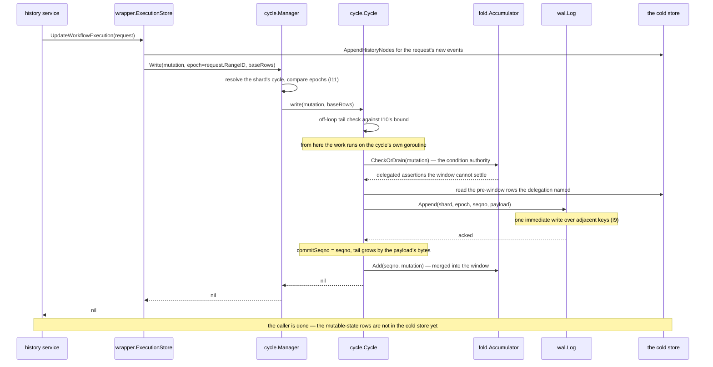
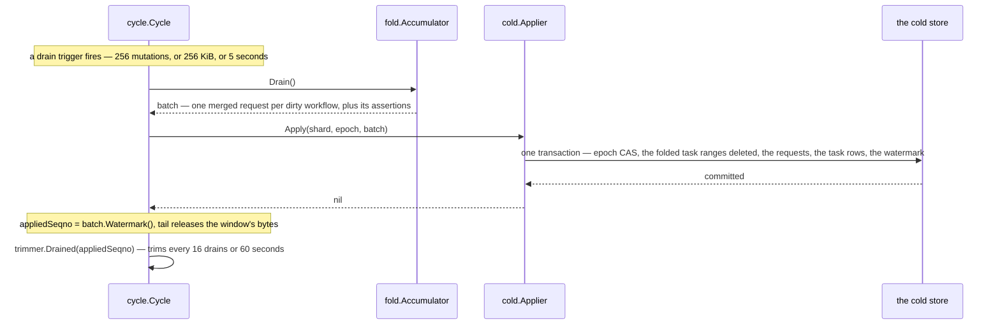
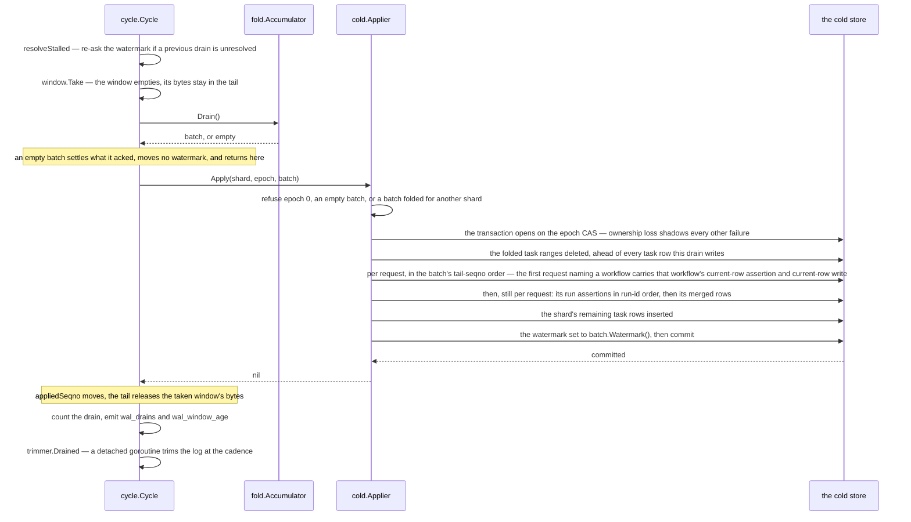
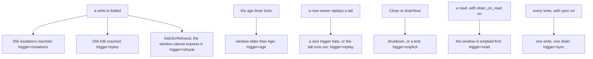
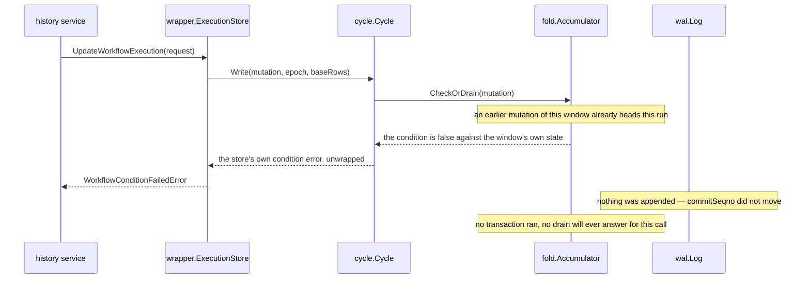
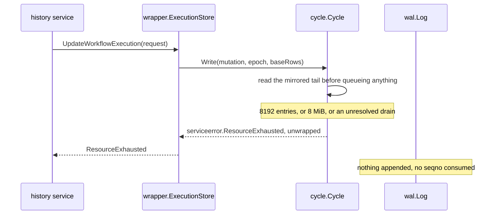
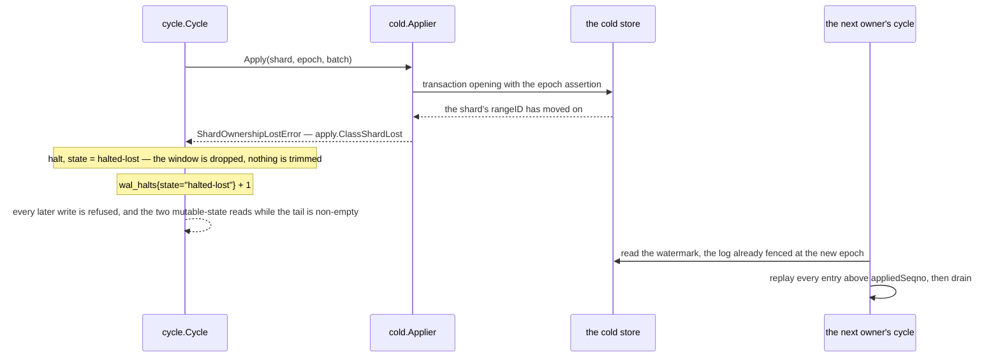
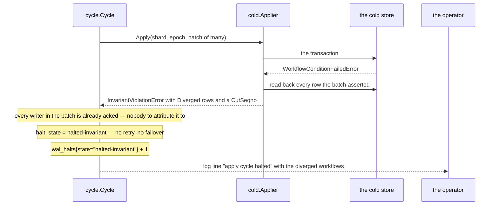
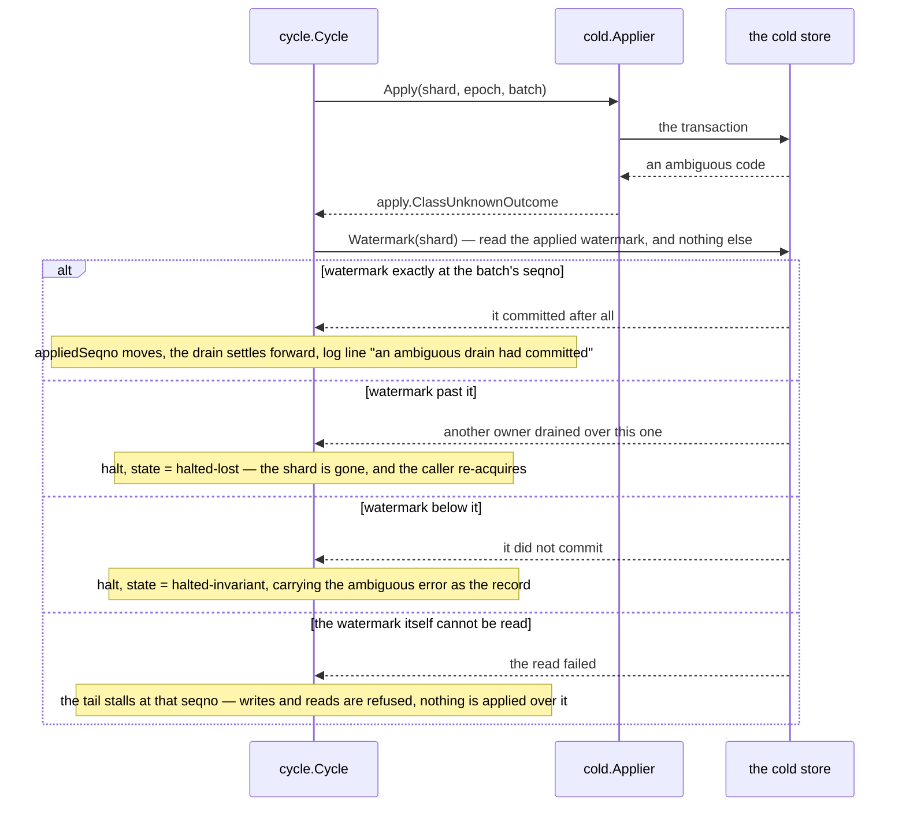
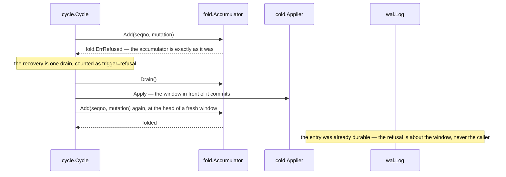

# A write, end to end

## One write, three moments of certainty

Start with one `UpdateWorkflowExecution`. The history service has produced new events and a
mutable-state update. The wrapper writes the history nodes through to the cold store, turns the
persistence request into one mutation, and hands that mutation to the shard's cycle. So far the
layer has promised the caller nothing.

Three questions come before anything is logged. Is the write still stamped with the epoch this node
holds? Is the shard's tail below its bound? Does the request's condition hold against the state at
the head of this window? Every refusal here happens **before the append**, so a refused caller can
conclude that its mutation consumed no seqno and is absent from the log. That is the first moment of
certainty.

If those three pass, the cycle appends one entry and waits for the log to acknowledge it durably.
That is the second moment. Once the append has returned and the entry has been folded into the
window, a write that trips no drain trigger returns success. The mutable-state rows still hold what
they held, but the write is durable: replay can recover it and the overlay makes it visible. This is
the layer's central bargain — most foreground calls end at the append and the fold, and only the
call that fills a window (or the age tick behind it) pays for the cold-store drain.

The third moment comes later. A drain writes a folded batch, together with a watermark saying how
far it applied, in one transaction. Once that commits, the cold store itself holds the effect and
the matching stretch of tail can be released. If the process never learns whether that transaction committed, it does not guess: it
reads the watermark, which is the only witness. So the path makes three different claims, each
resting on its own evidence:

| Moment | What is certain | Evidence |
|---|---|---|
| before append | a refused mutation was not accepted | no seqno was consumed |
| after append acknowledgement | the mutation is durable and caller-visible | `commitSeqno` covers it |
| after a resolved drain | its folded effect is applied, or its empty work is settled | the transactional watermark, or the known empty batch |

The sections below replay that same write under each failure in turn, and the decision table at the
end maps what the caller saw to what the operator can infer. Vocabulary and invariants are
[chapter 02](02-concepts-and-invariants.md), the components are [chapter 03](03-components.md), and
reads over the acked-but-unapplied stretch are [chapter 07](07-read-path.md).

## The cast

Every name in this table is a real type in this tree, except the first and the last: `history
service` is the caller, and what it is a type of is Temporal's; `the cold store` is whatever the
deployment brought. The diagrams below carry two more participants that are not types either and
need no row — *the next owner's cycle* and *the operator*.

| Participant | What it is |
|---|---|
| `history service` | the caller: Temporal's own shard context, holding the shard's rangeID |
| `wrapper.ExecutionStore` | the decorator the history service holds instead of the base store |
| `cycle.Manager` | the per-node registry of shards to cycles; the epoch check lives on its `Write` |
| `cycle.Cycle` | one goroutine per (shard, epoch): the accumulator, the drain, the trim cadence, the reads |
| `fold.Accumulator` | the window — merged requests per dirty workflow, plus the assertions they stand on |
| `wal.Log` | the log contract; `memwal` is the implementation this tree ships |
| `cold.Applier` | one drain, one transaction — the layer's only write door; `memcold` is the implementation this tree ships |
| `the cold store` | a persistence implementation, on the other side of that door: `memcold` here, a deployment's own otherwise |

Two positions run through the whole chapter. **commitSeqno** is the last seqno acked into the log.
**appliedSeqno** is the last seqno a drain committed: a watermark held in the cold store, keyed by
shard, written inside the drain's own transaction, and as far as a trim may ever go. The metric
`wal_unapplied_entries` reports the difference between them. It is not what I10 bounds — that bound
counts from a third position, `resolved`, which [chapter
02](02-concepts-and-invariants.md#three-positions-not-two) explains.

## 1. The successful write

Two diagrams: the append every caller waits for, and the drain that comes later, paid for by
whichever call or tick triggers it.

How to read this. One arrow goes from the cycle to the cold store, and [chapter
03](03-components.md#the-component-diagram--run-time-calls) says the cycle names no store. Both are
true. This is the run-time call graph; the cycle makes that call through a `*baserow.Rows` value the
wrapper handed it, and imports nothing that reaches a store.

The caller's answer is the **append**, not the drain. When `UpdateWorkflowExecution` returns nil,
three things are true and no more: the request's new history events are in the cold store, the
mutation is one durable entry of the shard's log, and the accumulator holds it. The workflow's
mutable-state rows still hold what they held before, and any read those rows would now answer
wrongly is answered by the layer instead ([chapter 07](07-read-path.md)).

**What the delegated read costs.** It is per delegated assertion, not per mutation. The
current-execution row is one read (`baserow.Rows.Current`, which returns the row's
`last_write_version` beside it) and every run whose assertion the window does not hold is another
(`baserow.Rows.Run`), so a conflict-resolve naming several runs pays several before its append.
They run in `Delegated.Settle`'s order and stop at the first refusal, so a failing mutation often
pays less than a succeeding one. In sync mode none is taken at all: the drain that asserts
everything runs inside the same call, so the round trip would buy nothing.

**When the append itself has no answer.** The three refusals `wal` names each say the write is whole
one way or the other, and everything else — every transport failure — says nothing at all. The cycle
does not read that as "wrote nothing": it reads the seqno back, which is the log answering for an
append the way the cold store's watermark answers for a drain
([chapter 06](06-shard-lifecycle.md)). Three outcomes, and the third is where this parts from the
drain's version in section 7. Nothing at the seqno and the append wrote nothing, so the seqno is the
next mutation's and the caller gets the error. **This cycle's own payload at it and the append
succeeded**, so the caller is told nil — the entry is durable and every later write of that workflow
will stand on it, which is exactly the state a "failed" would have the caller act against. Anything
else — a stranger's entry, or a read that failed too — halts the shard holding the log as evidence:
where a drain whose outcome cannot be read stalls and asks again later, an append has nothing to
wait for, the next thing any writer needs being that same seqno.
The read is detached from the caller's cancellation, because a client deadline expiring inside the
append is the commonest way the outcome became unreadable in the first place.

**How far that read can be trusted.** The reads run on the cycle's own goroutine, so no drain of
this process can wedge between one of them and the append. That is a claim about this process, not
about the world: another process can move one of those rows only by taking the shard, and once it
has, either the append is fenced or the drain's epoch CAS fails. Fencing turns "the row changed
under us" into "the shard is no longer ours", which is section 5 below and already has an operator
response.

Some later drain — the one a successor write trips, or the age tick — commits it:

**Who blocks.** The write that trips a trigger pays for the drain inside its own call: the drain
runs in `Cycle.add`, on the cycle's goroutine, before that call returns, and every other write on
the shard queues behind that goroutine meanwhile. Nothing crosses shards. The queue processors sit
on the same goroutine, because `AddHistoryTasks` and `RangeCompleteHistoryTasks` travel the log like
every other write — so a queue processor's checkpoint waits behind whatever the loop is doing, a
drain included. That cost was accepted knowingly and has never been measured
([chapter 15](15-the-limits-of-the-evidence.md#the-price-of-moving-deferred-work-into-the-log-is-not-measured)).

## 2. The drain itself

One drain is one transaction. This is what it does, in order.

How to read this. Statement order is the mechanism, because the transaction reports the **first
failing assertion** and stops there. The epoch CAS goes first: a fenced writer finds every version
it stands on stale, and "the shard is no longer yours" is the only answer worth giving it, so
ownership loss must shadow the version failures underneath. The range deletes go ahead of the task
inserts for a different reason — a task that arrived after its range was completed is one fold
deliberately keeps, and a delete running after that insert would take it away, which for a scheduled
category is a timer that never fires. The watermark rides the same transaction behind the same gate
as everything else, which is what makes "did this drain commit" one readable fact; section 7 is
where that matters. Why a fold's output is a request **plus** a separately carried set of
assertions, rather than the window's own requests replayed inside one transaction, is
[chapter 13](13-designs-that-were-rejected.md#a-folded-window-as-a-concatenation-of-the-stores-own-queries).

One omission is as deliberate as the order. A store writes a request through three routines — the
mutation, the reset and the create — and two of them open with a lock-and-check on the run's
`db_record_version`. The drain leaves that check out: the merged request carries the *tail's*
version while the row still holds the *head's*, so the check would fail on every window that folded
more than one mutation into a run. Fold's head-of-window assertion, registered a statement earlier,
is what stands in its place. The create has no such check to leave out, because it asserts the run's
absence rather than its version.

Order is not the whole obligation on the store underneath. Because one transaction now carries many
workflows, the store walks assertions that **hold** on its way to the one that fails. That is
routine here and rare in a store written for one workflow per transaction — rare enough that three
code paths in the research prototype's store treated it as impossible and panicked, `MustNotExist`
with no row found among them. A batch carrying a create of a run that exists beside a create of one
that does not would panic or report a condition failure depending only on which was appended first.
So an applier owes this too: **an assertion that held must return, not crash**, and only a genuine
impossibility may report one. It is the kind of defect a store with one workflow per transaction can
carry for years without anybody meeting it.

The quieter rules of the drain:

* **the trim is neither in the transaction nor on the loop.** `trim.Trimmer` starts a detached
  goroutine at its cadence — `TrimEvery` drains (16) or `TrimAfter` (60 s), whichever trips first.
  A cadence that comes due while a trim is already in flight is skipped rather than queued, and the
  goroutine runs under a one-minute budget. A failed trim is logged, retried at the next cadence,
  and halts nothing;
* **a halted cycle never trims.** After halted-lost the log belongs to the next owner; after
  halted-invariant the log is the evidence;
* **a drain that folds to nothing still settles what it acked**, and moves no watermark. No
  transaction ran, so a watermark moved with it would let the trim delete entries the cold store
  never received, stranding a recovering owner;
* **an upsert and a delete of one key never both reach the transaction.** A store's query orders a
  collection's upserts ahead of its deletes, so a key the stream deleted and *then* upserted would be
  written first and deleted after: the write disappears, silently, in a transaction that reports
  success. The pair is resolved in the accumulator instead, where the stream order is still known:
  the later operation wins and the key leaves the other set (`fold.mergeItems`, over the seven
  collections a run holds). One level up, a window that wrote the workflow's current row and then removed it emits
  **only** the removal (`fold.WorkflowRecord.CurrentRemoved`), and the drain then deletes whatever
  current row it finds rather than the run the request named — that request's guard asks about the
  pre-window row, which is not the row the window left;
* **a drain is the whole window, always.** `window.Take` empties it and `Accumulator.Drain` emits
  every dirty workflow it holds, in one transaction. There is no partial drain, no ordering between
  the writers whose mutations are mixed into one batch, and nothing meters or queues: the only
  levers are where the drain triggers sit, applied before the drain, and the I10 refusal.
  `InvariantViolationError.CutSeqno` names what *a* partial re-drain could acknowledge; no code
  re-drains partially;
* **a folded range delete cannot page.** A store's standalone `RangeCompleteHistoryTasks` is free to
  split a very large range across several statements or transactions; inside the drain the same reach
  is one statement of somebody else's transaction, and pages would be separate transactions. The
  exposure is the same size as the standalone call's, but a single very large completed range fails
  the whole drain that carried it rather than degrading — and it arrives as an ordinary apply error,
  which no metric distinguishes.

### The drain triggers

Eight things start a drain, and each carries one tag value on `wal_drains`. There are nine
`drainCause` values behind those eight tags, because `replay` covers two of them: a replayed
provisional entry whose condition fails is dropped, where every other replayed entry that fails one
halts the shard. [Chapter 04](04-contracts.md#applyclass--sorting-the-outcome) has what that split
is for.

How to read this. What the diagram does not show is who is waiting while the drain runs, and that is
what the triggers really differ in. `mutations`, `bytes` and `refusal` run inside some caller's
write, and the window they drain is full of other people's work. Under `mutations`, `bytes` and a
`refusal` raised at the fold, that caller has already been acked for its own mutation; a `refusal`
raised at the condition check runs before the append, so that caller has consumed no seqno. `age` has
nobody waiting at all; `replay` and `explicit` do — the request that started the cycle waits through
the whole replay, and a shutdown waits for the drain it asked for — but neither waiter wrote anything
the window carries. `read` happens only when `drain_on_read` is on, which nothing that ships turns
on ([chapter 08](08-configuration.md)).

**`sync` is the eighth, and it is the same cycle rather than a path around it.** With `sync: true`
the window holds one mutation and its drain runs inside the write, so every drain a caller triggers
on such a node carries `trigger="sync"`. The size triggers are never consulted there and the age
tick always finds an empty window, so a dashboard panelled by `trigger` shows nothing on the
`mutations`, `bytes` and `age` series; the one other value it can see is `replay`, over the
at-most-one in-flight entry a killed node leaves behind. Everything else is the same code — the
halts, replay, the trim, backpressure and every counter.

What sync mode changes is whose answer a failed drain is. Beside its trigger, each drain carries a
`callerRule`: the legal (trigger, rule) pairs are a fixed list of nine values in `cycle/cycle.go`
with no constructor, because an attribution that is too permissive reports a failure to a caller who
did not write the mutation. Seven of the nine answer nobody, so a condition failure inside one halts
the shard. `drainSync` answers its caller. A lone replayed provisional entry drops instead. That is
also why sync mode's ack is *provisional*: the entry is encoded with `mutation.EncodeProvisional`
rather than `mutation.Encode`, and replay reads that bit back to know it may drop such an entry
rather than halt on it. Because the window is empty at every call boundary, a node killed in sync
mode leaves at most the one entry whose call was in flight.

## 3. Failed write — the condition did not hold

A conditional write whose condition is false is *expected traffic*: a start racing a start, a stale
mutable-state version. The layer must never fold such a write in silently, because only the head of
a window is asserted against the database. So the condition is decided before the append.

Both other placements cost more. Checking at the drain arrives after the answer has been given, on a
batch mixing many callers' work, so it has neither an addressee nor an undo: what should be one
caller's condition error becomes a halted shard. Checking every assertion against the cold store
before the append puts a database round trip in front of every write — the layer would spend what it
saves — and Temporal's plain current-row read cannot even express the current-row assertion, which
is three conditions (which run is current, what state it is in, and its last write version) where
`InternalGetCurrentExecutionResponse` carries only the first two. The layer stands on the
version-carrying read instead, and refuses to start in intercept mode over a store that cannot
answer it (`baserow.ErrNoVersionedRead`).

The check runs **after** [I10](02-concepts-and-invariants.md#the-invariants)'s bound and **before**
`Log.Append`, so a refused write provably acked nothing and consumed no seqno: the next accepted
mutation lands at the seqno this one would have taken. Two sources can answer it. The window itself
answers when an earlier mutation of the same window already heads that run — its state, not the
database's, is what the mutation stands on. Everything else the window merely delegates, and the
cycle settles that against a pre-window row read from the cold store (`Delegated.Settle`, walking
the current row before the run rows, which is the order a drain registers them in). Either way the
caller sees the store's own error type — `*p.WorkflowConditionFailedError`,
`*p.CurrentWorkflowConditionFailedError` or `*p.ConditionFailedError` — returned **unwrapped**,
because the shard's write path type-switches on the concrete value.

The error's **contents** are a second requirement, independent of its type, because the history
service parses the fields of a current-execution conflict. The start path reads `RequestIDs` to
recognise a retried request and answer it as already-started, `RunID` to decide which run to reuse
or attach to, `Status` to fill the client's response, and `LastWriteVersion` both to decide whether
the namespace is active here and to carry as the previous run's version when creating the new run as
current. The layer therefore does not synthesise those fields: `fold.currentConflict` deserialises
the window's own current-execution state blob and fills the conflict error from it, short of two of
the store's own: the start time is never carried, and the request ids are empty where the window's
last current-row write came from a conflict-resolve. A refusal of the right type with empty fields
would create a second run where a start should have deduplicated.

In the windowed modes, then, `wal_answered_condition_failures` stays at **zero**: no failed
condition ever reaches a drain there. A non-zero value means one of two things — the check let a
condition through, or a drain answered for a batch whose caller it did not have. In sync mode the
same counter is expected traffic: the delegated reads are skipped, the condition is decided by the
drain inside the same write, and `Cycle.answerWriter` counts every failure it hands back.

## 4. Failed write — backpressure (I10)

I10 bounds one shard's **tail**: the entries it has acked and not yet settled. The bound is checked
twice, both times before the append. It bounds the tail rather than the window, and the two are
different numbers: the window empties when a drain *starts*, the tail only when that drain's
transaction *commits*.

The refusal is `*serviceerror.ResourceExhausted` with `Cause = RESOURCE_EXHAUSTED_CAUSE_PERSISTENCE_LIMIT`
and `Scope = RESOURCE_EXHAUSTED_SCOPE_SYSTEM` — the server's own persistence rate limiter's pair, so
the retry stays inside the history client. It must reach the caller **unwrapped**: the shard's write
path reads `*serviceerror.ResourceExhausted` as "definitely not committed", and one `%w` drops it to
the default arm, which is a background re-acquire — a self-inflicted failover.

Three things refuse a write here, and the metric says which through the `limit` tag on
`wal_backpressure_refusals`:

| `limit` | What ran out | What it means |
|---|---|---|
| `entries` | `HardMaxEntries`, 8192 by default | the applier is behind |
| `bytes` | `HardMaxBytes`, 8 MiB by default | a workflow near the server's own blob limits |
| `unresolved` | not a size at all | the cycle cannot read what its last drain did, so nothing may be applied over it |

`unresolved` takes precedence over the two sizes: it is the one an operator can act on, and the one
that waiting will not clear.

Two more rules of the bound. **No mutation is refused for its own size.** The check reads the tail
as it stands, never the tail this mutation would make, so the tail overshoots by at most one entry.
And the two checks sit where they do for different reasons: the first reads a mirrored copy of the
tail *off* the cycle's goroutine, so a shard whose applier is stuck on the cold store refuses its
writers instead of parking them in the queue behind it; the second runs on that goroutine, ahead of
the condition check and the append, where concurrent callers cannot all slip past a tail one short
of the bound.

A refused write leaves three separate traces of not having happened. The log is where it was and
`commitSeqno` has not moved. The accumulator never saw the mutation, so the next drain's
`MutationsIn` counts exactly the accepted writes — which matters beyond tidiness, since a refused
mutation that reached `fold` would move the collapse ratio a run is judged by. And the seqno the
refused write would have taken is still free: the retry's append lands at exactly that seqno, with
no hole and no skip, which is what makes gap-freedom compatible with having a refusal path at all.
The shard itself is untouched: it stays running, answers what it holds, and its `ShardStore` path is
never refused, because refusing a rangeID renewal would cause the failover I10 exists to avoid.

The bound is also a node-wide constraint: `HardMaxBytes × MaxShards` must fit `TailBudgetBytes`,
asserted once at start-up ([chapter 08](08-configuration.md#5-the-budget-refusal)).

## 5. Failed drain — the shard was lost

The epoch CAS is the first assertion the drain's transaction registers, so ownership loss shadows
every other failure it could have reported.

This is fencing working, not an incident. The halted cycle **keeps its log entries** and trims
nothing: those entries are exactly what the next owner replays. They are also why the two reads
refuse here — a non-empty tail means the layer knows the cold store is incomplete and cannot say by
what. A halted-lost cycle whose tail *is* empty passes a mutable-state read through to that store
instead ([chapter 07](07-read-path.md#2-routing-a-read-and-drainonread)). A caller still on the
line — the write whose drain this was — gets `*p.ShardOwnershipLostError`. `storeError` is the
function that turns a cycle's answer into the store's own error type, and halted-lost is the one
cycle state it translates, so the shard re-acquires. What the next owner does with the inherited
tail is [chapter 06](06-shard-lifecycle.md).

## 6. Failed drain — an invariant was violated

A version or current-row assertion failed inside a drain's transaction, and every writer that batch
carries has already been acked. **This path is the layer's self-audit, not an operating mode.**
Under fencing the layer is the shard's only writer, so nothing legitimate can move a row the
accumulator vouched for. Reaching this path means one of three things: the layer contradicted
itself, fencing failed, or something wrote those rows around the layer.

The path exists because the alternative is worse. A drain that asserted nothing and wrote a merged
request over a base version that had moved would corrupt the shard silently; this converts that into
a stopped shard with the log intact.

**Why it is not retried.** A broken invariant is not contention: re-running builds the same
transaction against the same rows. The window is already drained anyway, so there is nothing to
rebuild it from that is not mutated state.

**Why it is not converted to `ShardOwnershipLost`.** That would hand a divergence this process owns
to the next owner as an ordinary failover, and the next owner would replay into the same wall.
`storeError` deliberately leaves this class unrecognised.

**What the operator sees.** `wal_halts{state="halted-invariant"}` and a warn-level *"apply cycle
halted"* carrying the cause. Inside the cause is the attribution `apply.Attribute` read back after
the failure: every row that is not where fold asserted it, with the asserted and the actual version
and the window slice (`HeadSeqno..TailSeqno`) answering for it. `CutSeqno` is the highest seqno
anything may acknowledge, one below the lowest diverged entry. Zero means acknowledge nothing, and
covers three cases at once — no divergence was found, the window's first entry diverged, or the
readback itself failed. The runbook is [chapter
09](09-operations.md#b-a-shard-halted--and-which-of-the-two-classes).

## 7. Failed drain — the outcome could not be read

The cold store returned a code the applier cannot interpret, so the transaction may or may not have
committed. This is the case the whole watermark-as-witness rule exists for.

**Why nothing else is readable.** Stores answer a failed assertion in two different ways, and the
recovery rule has to be right for both. The store this tree ships rolls the transaction back, so a
drain whose assertion failed wrote nothing and committed nothing. A store that expresses the whole
drain as one query cannot roll back that way: there the assertions are named expressions inside the
query rather than preconditions the database aborts on, counting the asserted rows that did not hold
and gating every write statement on that count being zero. A failed assertion then selects nothing
anywhere, the transaction **commits** having written nothing, and the error the client returns is
built from a readback in the same query. Either way, a drain the store rejected and a drain that
never ran leave byte-identical state — so the ambiguity of an ambiguous code comes down to one bit:
whether this drain's own writes landed.

**The rule, and the wrong rule beside it.** The watermark is the only witness, because it rides the
drain's own transaction behind the same gate: it moved if and only if the batch committed, and the
cold store looks identical after either failure class. The obvious alternative — re-read the base
versions and re-fold — **applies a committed batch twice**, precisely because the commit is what
moved those base versions. The same reasoning forbids an applier from letting its client library
retry an ambiguous code by itself: a batch that had in fact committed comes back from the retry as a
condition failure, which is an invariant halt for a drain that succeeded.

**The third arm is not a halt.** Halting on a failed *read* would lose a shard that a blip would
have healed. The tail *stalls* at that seqno instead. While the stall stands, every write is refused
with `limit="unresolved"`, all three layer-served reads are refused, every later drain re-asks the
watermark before it takes the window, and nothing may commit over it — a later drain that committed
would set the watermark above the unresolved entries, telling the cold store those were applied too,
and the trim behind it would then delete them from the log. The **age tick is the only thing that
can heal a stall**, because a shard that refuses its writers gets no caller-driven drain.

## 8. Fold refusal — a window the accumulator cannot express

A few valid streams cannot be expressed as merged requests — a continue-as-new folding into another
request's envelope, a delete of one half of such a pair. Those are not errors; they are a window
that has run out of room.

A third shape comes from the delete-current. `DeleteCurrentWorkflowExecution` carries a
`current_run_id` guard, and the window records **no assertion** from it: the store removes the row
only if the row names that run, so a mismatch is an ordinary no-op, and synthesising `current == run`
would turn a legal no-op into a false invariant violation. Instead the delete *taints* the current
row: any later mutation of the same window that stands on that row is refused, because an assertion
recorded past an unasserted delete would be a mid-window claim dressed up as a head-of-window one.
The recovery is the same single drain.

How to read this. The retry happens **once**, and it is guaranteed to succeed: both refusals turn on
what the window already holds, and an empty window refuses nothing. A second refusal would mean that
property has stopped holding, and the two paths part there. At the **fold** (`AddOrDrain`, in
`Cycle.accept`, which the write path and replay share) a second refusal halts the shard on the
invariant side, because the entry is already acked and no retry can help. At the **condition check**
(`CheckOrDrain`, in `Cycle.check`) nothing has been acked yet, so the refusal is simply returned to
the caller; `storeError` does not recognise it, so it reaches the history service as the
unrecognised error it is. The same recovery wraps both, and what makes both safe to retry is that
neither leaves the accumulator changed.

There is one edge where an acked entry ends up in no window at all. The *recovery drain* can itself
fail: the mutation is then durable, not yet folded, and that drain's error is what the caller is
told. If the failed drain left the cycle running, the cycle folds the entry into the now-empty
window straight afterwards (`Cycle.refold`); if the drain halted the cycle, the entry stays only in
the log, for the next owner to replay. An acked entry this cycle cannot apply always becomes a halt,
never a mutation it quietly forgets.

## The decision table

One row per thing the caller can be told, and what it means everywhere else.

| Symptom at the caller | `apply.Class` | What the cycle does | What the operator sees |
|---|---|---|---|
| nil | —, or `ClassCommitted` if this call triggered a drain | acked and folded; possibly drained before return | `wal_intercepted_writes`, `wal_tail_entries`; a triggering call also emits `wal_drains{trigger="mutations"\|"bytes"}` |
| `WorkflowConditionFailedError` / `CurrentWorkflowConditionFailedError` / `ConditionFailedError` | — (never appended); `ClassInvariantViolated` in sync mode, where the drain answered its own writer | nothing acked, nothing folded, no seqno consumed — in sync mode the entry stays acked and is settled without moving the watermark | nothing in the windowed modes, where `wal_answered_condition_failures` stays 0; in sync mode it counts every answer |
| `ResourceExhausted` | — (refused before the append) | nothing acked | `wal_backpressure_refusals{limit="entries"\|"bytes"\|"unresolved"}` |
| `ShardOwnershipLost` | `ClassShardLost` | halt-lost: window dropped, tail kept, nothing trimmed | `wal_halts{state="halted-lost"}`; warn *"apply cycle halted"* |
| an unrecognised error (invariant halt) | `ClassInvariantViolated` | halt-invariant: no retry, no conversion to a failover | `wal_halts{state="halted-invariant"}`; warn *"apply cycle halted"* with the diverged rows |
| an unrecognised error (unknown outcome) | `ClassUnknownOutcome` | read the watermark; commit-after-all, halt, or stall | warn *"a drain's outcome could not be read"*, or info *"an ambiguous drain had committed"*; then `wal_backpressure_refusals{limit="unresolved"}` while a stall stands |
| `Unimplemented` from `CompleteHistoryTask` | — | never reaches the layer's write path | nothing; the method is refused by design in intercept mode |

`ClassRefused` never appears as a caller symptom. It is the applier turning a malformed call away
before anything reaches the cold store — epoch 0, an empty batch, a batch folded for a different
shard, a request kind or an assertion kind it has no write path for — which is a programming error
rather than an operational state.

## What is durable when the caller returns

State this exactly, because it is the whole trade:

* the request's new history events are in the cold store, and the mutation is one durable log entry,
  at a seqno no other entry has, under a fenced epoch. The log does not carry event history, so the
  wrapper writes the events through the base store *before* the append;
* the mutable-state rows, the task rows and the watermark are not. They arrive at a later drain;
  until then the layer answers reads over them itself. `commitSeqno − appliedSeqno` is the
  log-to-watermark distance; the outstanding tail is `commitSeqno − resolved`, because an empty
  batch can settle entries without moving the persisted watermark.

Because the events go first, a **refused** write leaves them behind: batches of history events that
nothing references, since the mutable state that would have pointed at them was never written. Every
pre-append refusal in this chapter has that residue — a condition failure, backpressure, a lost
shard — even though the layer's own accounting is exact, with nothing in the log and no seqno
consumed. It is the safe direction of the two: an event tree ahead of confirmed state is inert,
while confirmed state pointing at events that do not exist is a broken workflow.

Who waits on whom: a caller waits for one append, plus the drain if its write tripped a trigger,
and every other caller on that shard waits behind the loop for as long as that drain takes. Nobody
waits on the trim, which is detached, and nobody waits on another shard.

## Where this lives in the code

* [`../../wrapper/execution_store.go`](../../wrapper/execution_store.go) — `write`, the
  events-first rule, and the eight kinds that become log records.
* [`../../cycle/write.go`](../../cycle/write.go) — `Manager.Write`: the shard lookup, the
  I11 epoch check, and the translation of a cycle's answer into the store's error types.
* [`../../cycle/cycle.go`](../../cycle/cycle.go) — `add`, `accept`, `drain`, `resolve`
  and `halt`, plus `Defaults()` and the `drainCause` values behind the `trigger` tag values.
* [`../../cycle/decide.go`](../../cycle/decide.go) — the rules as pure functions:
  `writeRefused` (I10), `storeError`, `attribute` and `settlementOf`.
* [`../../cycle/window/window.go`](../../cycle/window/window.go) and
  [`../../cycle/tailstate/tailstate.go`](../../cycle/tailstate/tailstate.go) — the two
  byte counters that must never be merged, and the typed token between them;
  [`../../cycle/trim/trim.go`](../../cycle/trim/trim.go) is the detached trim.
* [`../../fold/check.go`](../../fold/check.go) — the condition authority: recorded versus
  discarded assertions, `Delegated.Settle`'s order, and `currentConflict`'s payload;
  [`../../fold/refusal.go`](../../fold/refusal.go) is the drain-and-retry.
* [`../../fold/merge.go`](../../fold/merge.go) — the per-key upsert-versus-delete
  resolution; [`../../fold/fold.go`](../../fold/fold.go) has `addDeleteCurrent`, the
  tainted current row and `WorkflowRecord.CurrentRemoved`.
* [`../../baserow/baserow.go`](../../baserow/baserow.go) — the two pre-window reads a
  delegated assertion costs.
* [`../../apply/failure.go`](../../apply/failure.go) — `Classify`, `Refuse` and the
  attribution readback an applier hands back.
* [`../../cold/cold.go`](../../cold/cold.go) — the four things a drain's transaction owes,
  as the seam states them; [`../../cold/memcold/apply.go`](../../cold/memcold/apply.go) is
  the applier this tree ships, whose doc comment is the statement order section 2 walks.
* [`../../cycle/replay.go`](../../cycle/replay.go) — what a new owner does with the tail
  this chapter's failures leave behind.
