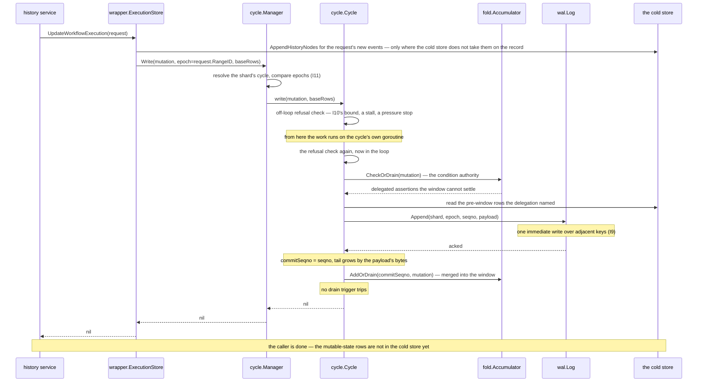
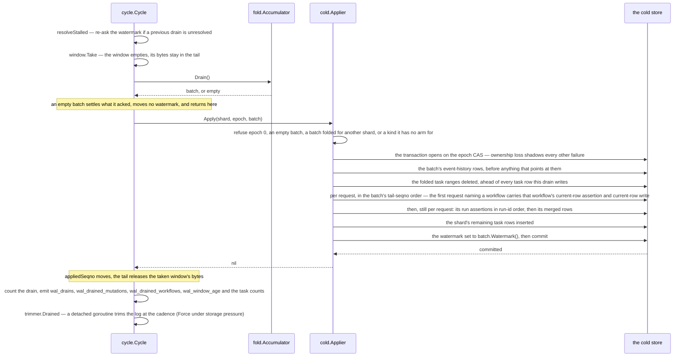
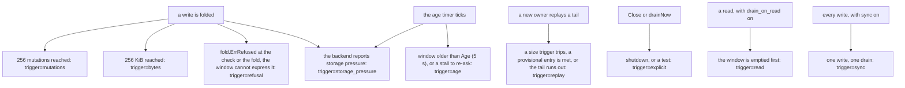
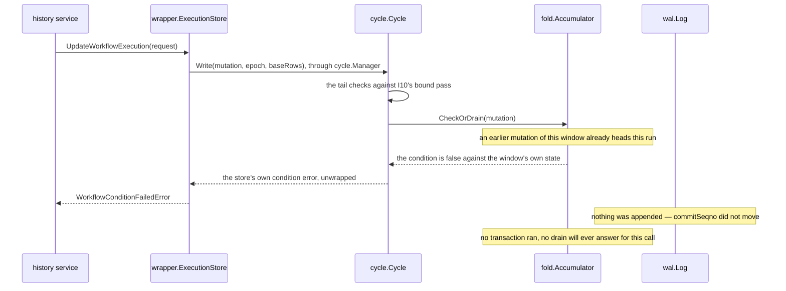
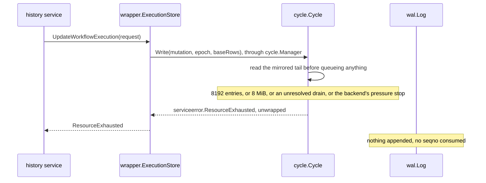
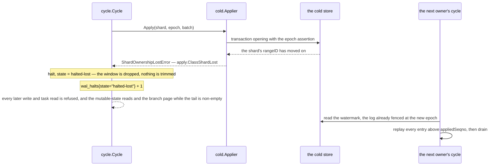
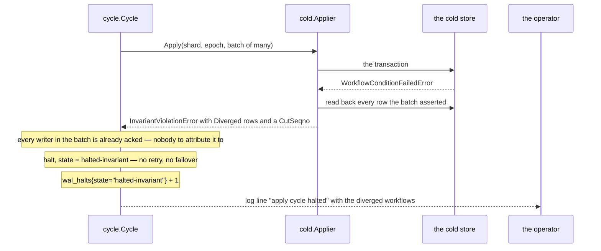
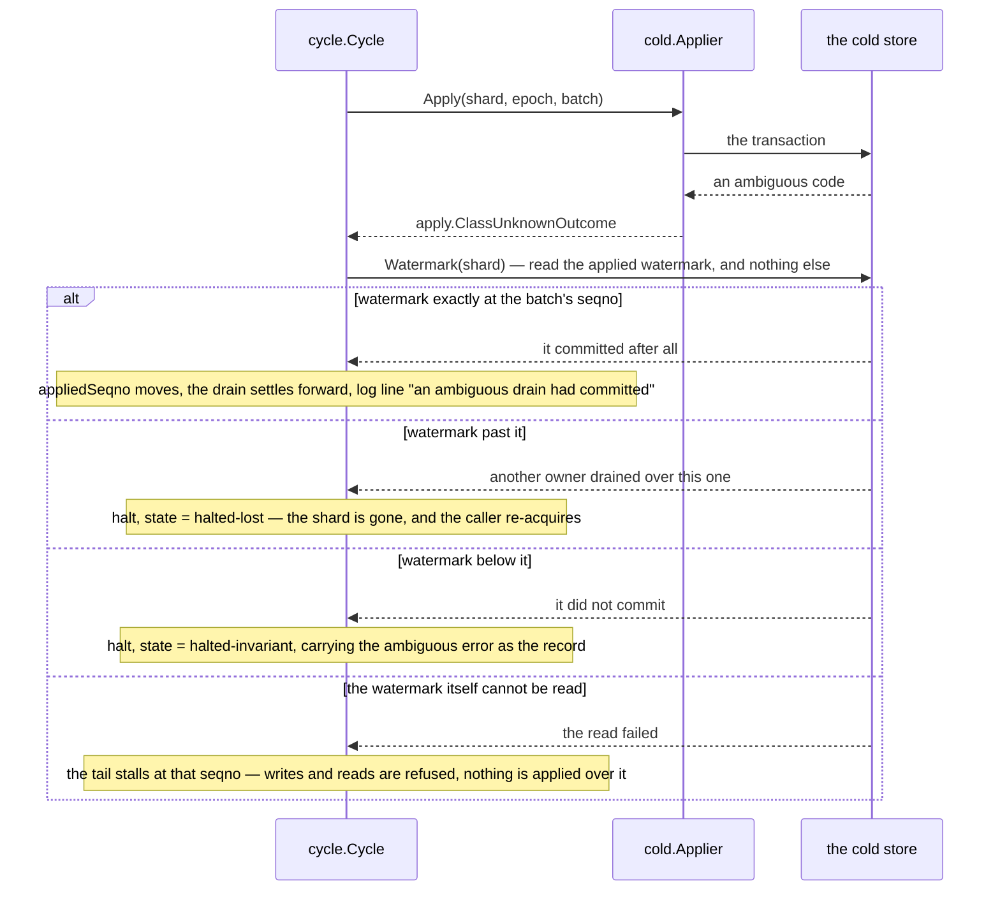
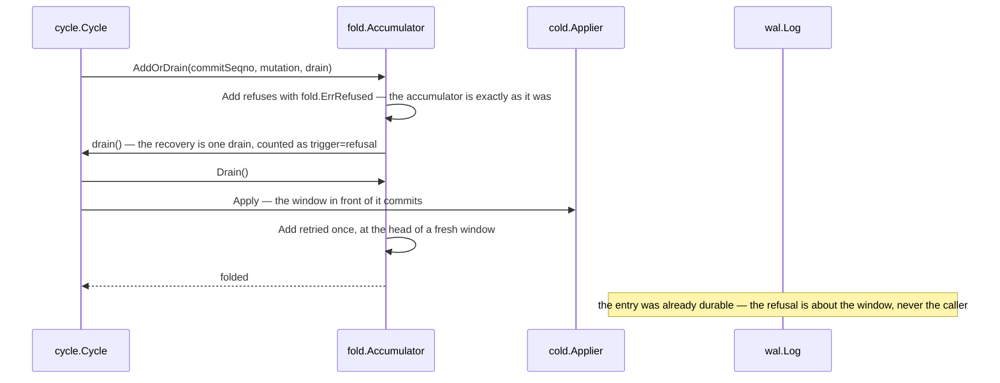

# A write, end to end

## One write, three moments of certainty

Start with one `UpdateWorkflowExecution`. The history service has produced new events and a
mutable-state update. The wrapper turns the persistence request into one mutation and hands it to
the shard's cycle. If the cold store does not take history events inside the drain, the wrapper
first writes them through to it. So far the layer has promised the caller nothing.

Three checks come before anything is logged. Is the write stamped with the epoch this node holds?
Is the shard free to take more: its tail (the acknowledged entries not yet settled) below its
bound, no drain's outcome left unread, its backend not asking appends to stop? Does the request's
condition hold against the state at the head of this window (the mutations folded since the last
drain)? Every refusal happens before the append. A refused caller knows its mutation consumed no
seqno and is absent from the log. That is the first moment of certainty.

If the checks pass, the cycle appends one entry and waits for the log to acknowledge it. That is
the second moment. The entry is folded (merged) into the window, and a write that trips no drain
trigger returns success. The mutable-state rows in the cold store are unchanged, but the write is
durable: replay can recover it, and the overlay, which answers reads from the window
([chapter 07](07-read-path.md)), makes it visible. This is the layer's central bargain. Most calls
end at the append and the fold. Only the call that trips a trigger pays for the cold-store drain,
usually by filling the window; otherwise the age tick drains it and no caller pays.

The third moment comes later. A drain writes a folded batch and a watermark, the highest seqno it
applied, in one transaction. Once that commits, the cold store holds the effect and the matching
stretch of tail is released. If the process never learns whether the transaction committed, it
does not guess. It reads the watermark, the only witness. Each moment rests on its own evidence:

| Moment | What is certain | Evidence |
|---|---|---|
| before append | a refused mutation was not accepted | no seqno was consumed |
| after append acknowledgement | the mutation is durable and caller-visible | `commitSeqno` covers it |
| after a resolved drain | its folded effect is applied, or its empty work is settled | the transactional watermark, or the known empty batch |

This chapter follows the successful write first, then replays it under each failure in turn. A
decision table at the end maps what the caller saw to what the operator can infer. Vocabulary and
invariants are [chapter 02](02-concepts-and-invariants.md), the components are
[chapter 03](03-components.md).

## The cast

Every name below is a type in this tree except the first and the last: the history service is
Temporal's caller, and the cold store is whatever the deployment brought. The diagrams also show
*the next owner's cycle* and *the operator*.

| Participant | What it is |
|---|---|
| `history service` | the caller: Temporal's own shard context, holding the shard's rangeID |
| `wrapper.ExecutionStore` | the decorator the history service holds instead of the base store |
| `cycle.Manager` | the per-node registry of shards to cycles; the epoch check lives on its `Write` |
| `cycle.Cycle` | one goroutine per (shard, epoch): the accumulator, the drain, the trim cadence, the reads |
| `fold.Accumulator` | the window — merged requests per dirty workflow, plus the assertions they stand on |
| `wal.Log` | the log contract; `memwal` is the implementation this tree ships |
| `cold.Applier` | one drain, one publication — the drain's write door, and the only one over a store that declares `cold.HistoryApplier`; `memcold` is the implementation this tree ships |
| `the cold store` | a persistence implementation, on the other side of that door: `memcold` here, a deployment's own otherwise |

Two positions run through the chapter. *commitSeqno* is the last seqno acknowledged by the log.
*appliedSeqno*, the watermark, is the last seqno a committed drain contains. It is stored in the
cold store per shard, written inside the drain's own transaction, and no trim goes past it.
`wal_unapplied_entries` reports their difference. I10 bounds something else: the tail above a third
position, `resolved` ([chapter 02](02-concepts-and-invariants.md#three-positions-not-two)).

## 1. The successful write

The successful write has two halves: the append every caller waits for, and the drain that comes
later. The first diagram follows one call from the history service to the log acknowledgement.

```mermaid
sequenceDiagram
  participant HS as history service
  participant ES as wrapper.ExecutionStore
  participant MG as cycle.Manager
  participant CY as cycle.Cycle
  participant ACC as fold.Accumulator
  participant LOG as wal.Log
  participant CS as the cold store

  HS->>ES: UpdateWorkflowExecution(request)
  ES->>CS: AppendHistoryNodes for the request's new events — only where the cold store does not take them on the record
  ES->>MG: Write(mutation, epoch=request.RangeID, baseRows)
  MG->>MG: resolve the shard's cycle, compare epochs (I11)
  MG->>CY: write(mutation, baseRows)
  CY->>CY: off-loop refusal check — I10's bound, a stall, a pressure stop
  Note over CY: from here the work runs on the cycle's own goroutine
  CY->>CY: the refusal check again, now in the loop
  CY->>ACC: CheckOrDrain(mutation) — the condition authority
  ACC-->>CY: delegated assertions the window cannot settle
  CY->>CS: read the pre-window rows the delegation named
  CY->>LOG: Append(shard, epoch, seqno, payload)
  Note over LOG: one immediate write over adjacent keys (I9)
  LOG-->>CY: acked
  Note over CY: commitSeqno = seqno, tail grows by the payload's bytes
  CY->>ACC: AddOrDrain(commitSeqno, mutation) — merged into the window
  Note over CY: no drain trigger trips
  CY-->>MG: nil
  MG-->>ES: nil
  ES-->>HS: nil
  Note over HS,CS: the caller is done — the mutable-state rows are not in the cold store yet
```

The one arrow from the cycle to the cold store is a run-time call through a `*baserow.Rows` value
the wrapper handed it. The cycle imports nothing that reaches a store
([chapter 03](03-components.md#the-component-diagram--run-time-calls)).

The caller's answer is the append, not the drain. When `UpdateWorkflowExecution` returns nil the
mutation is a durable log entry and the accumulator holds it, while the mutable-state rows still
hold their old values. Exactly what is and is not durable at that point is stated once, at the end
of the chapter ([What is durable when the caller returns](#what-is-durable-when-the-caller-returns)).
Some later drain, tripped by a later write or the age tick, commits the write (section 2).

### What the delegated read costs

When the window cannot settle an assertion itself, it delegates it, and the cycle reads the
pre-window row from the cold store before the append. The cost is per delegated assertion, not per
mutation. The current-execution row is one read (`baserow.Rows.Current`, which also returns the
row's `last_write_version`). Every run whose assertion the window does not hold is another
(`baserow.Rows.Run`), so a conflict-resolve naming several runs pays several reads. They run in
`Delegated.Settle`'s order and stop at the first refusal, so a failing mutation often pays less
than a succeeding one. Sync mode takes none: the drain that asserts everything runs inside the same
call, so the round trip would buy nothing.

### When the append has no answer

The cycle reads three append refusals by name: `wal.ErrGap`, `wal.ErrFenced` and
`wal.ErrAlreadyWritten`. Each says definitely whether the write happened. Any other error, such as a
transport failure, says nothing. The cycle does not assume "wrote nothing". It reads the seqno back,
so the log answers for an append the way the watermark answers for a drain
([section 7](#7-failed-drain--the-outcome-could-not-be-read)). There are three outcomes:

* Nothing is at the seqno. The append wrote nothing, the seqno goes to the next mutation, and the
  caller gets the error.
* This cycle's own payload is at the seqno. The append succeeded, and the caller is told nil. The
  entry is durable and later writes of the workflow will stand on it, so reporting failure would be
  a lie the caller acts on.
* Anything else, a stranger's entry or a failed read, halts the shard and keeps the log as
  evidence. A drain whose outcome cannot be read stalls and asks again later (section 7), but an
  append cannot wait: the next thing any writer needs is that same seqno.

The read-back is detached from the caller's cancellation, because a client deadline expiring
inside the append is the commonest way the outcome became unreadable.

### How far the pre-append reads can be trusted

The delegated reads run on the cycle's goroutine, so no drain of this process can come between one
of them and the append. Another process can move those rows only by taking the shard. Once it has,
either the append is fenced or the drain's epoch CAS fails. Fencing turns "the row changed under
us" into "the shard is no longer ours", which is section 5 and has an operator response.

### Who blocks

The write that trips a trigger pays for the drain inside its own call. The drain runs in
`Cycle.add`, on the cycle's goroutine, before that call returns, and every other write on the shard
queues behind it. Nobody waits on the trim, which is detached, and nothing crosses shards. Queue
processors wait too: `AddHistoryTasks` and
`RangeCompleteHistoryTasks` travel the log like every other write, so a queue processor's
checkpoint waits behind whatever the loop is doing, a drain included. This cost was accepted and
has never been measured
([chapter 15](15-the-limits-of-the-evidence.md#the-price-of-moving-deferred-work-into-the-log-is-not-measured)).

## 2. The drain itself

A drain publishes the window in one transaction: the merged requests, the task work and the
watermark. If the batch carries event history, that history is durable no later than the
transaction, either inside it or before it opens. The diagram shows a drain against `memcold`,
which writes the history inside. Its first step, `resolveStalled`, matters only when a previous
drain's outcome is still unknown (section 7): it asks the watermark again before taking the window.

```mermaid
sequenceDiagram
  participant CY as cycle.Cycle
  participant ACC as fold.Accumulator
  participant AP as cold.Applier
  participant CS as the cold store

  CY->>CY: resolveStalled — re-ask the watermark if a previous drain is unresolved
  CY->>CY: window.Take — the window empties, its bytes stay in the tail
  CY->>ACC: Drain()
  ACC-->>CY: batch, or empty
  Note over CY: an empty batch settles what it acked, moves no watermark, and returns here
  CY->>AP: Apply(shard, epoch, batch)
  AP->>AP: refuse epoch 0, an empty batch, a batch folded for another shard, or a kind it has no arm for
  AP->>CS: the transaction opens on the epoch CAS — ownership loss shadows every other failure
  AP->>CS: the batch's event-history rows, before anything that points at them
  AP->>CS: the folded task ranges deleted, ahead of every task row this drain writes
  AP->>CS: per request, in the batch's tail-seqno order — the first request naming a workflow carries that workflow's current-row assertion and current-row write
  AP->>CS: then, still per request: its run assertions in run-id order, then its merged rows
  AP->>CS: the shard's remaining task rows inserted
  AP->>CS: the watermark set to batch.Watermark(), then commit
  CS-->>AP: committed
  AP-->>CY: nil
  Note over CY: appliedSeqno moves, the tail releases the taken window's bytes
  CY->>CY: count the drain, emit wal_drains, wal_drained_mutations, wal_drained_workflows, wal_window_age and the task counts
  CY->>CY: trimmer.Drained — a detached goroutine trims the log at the cadence (Force under storage pressure)
```

### Why the statement order matters

The transaction reports the first failing assertion and stops there, so the order of statements
decides what a failure says.

* The epoch CAS goes first, so ownership loss shadows the version failures a fenced writer would
  otherwise see.
* The range deletes go ahead of the task inserts, because fold keeps a task that arrived after its
  range was completed. A later delete would remove it, and for a scheduled category that is a timer
  that never fires.
* The watermark rides the same transaction behind the same gate, so "did this drain commit" is one
  readable fact (section 7).

Why a fold's output is a request plus a separately carried set of assertions, rather than the
window's own requests replayed inside one transaction, is
[chapter 13](13-designs-that-were-rejected.md#a-folded-window-as-a-concatenation-of-the-stores-own-queries).

### The check the drain leaves out

A store writes a request through three routines: the mutation, the reset and the create. The first
two open with a lock-and-check on the run's `db_record_version`. The drain omits that check on
purpose. The merged request carries the version of the window's last mutation, while the row still
holds the version from before the window, so the check would fail on every window that folded more
than one mutation into a run. Fold's head-of-window assertion, registered one statement earlier,
stands in its place. The create has no such check, because it asserts the run's absence rather than
its version.

### An assertion that held must return

An applier must return, not crash, on an assertion that held. A multi-workflow transaction walks
many held assertions before the failing one, which a store written for one workflow per transaction
rarely does. For example, a batch with a create of a run that exists beside a create of one that
does not must report a condition failure whichever was appended first. Only a genuine impossibility
may crash.

### Other rules of the drain

* *The trim runs outside the transaction and off the loop.* `trim.Trimmer` starts a detached
  goroutine every `TrimEvery` drains (16) or after `TrimAfter` (60 s), judged when a drain commits,
  so an idle shard does not trim. The goroutine runs under a one-minute budget. Under storage
  pressure every committed drain calls `Trimmer.Force`. A failed trim halts nothing. Skipping,
  queueing and retries are [chapter 06](06-shard-lifecycle.md#7-trim-as-part-of-the-lifecycle).
* *A halted cycle never trims.* After `halted-lost` the log belongs to the next owner. After
  `halted-invariant` the log is the evidence.
* *A drain that folds to nothing still settles what it acked*, and moves no watermark. No
  transaction ran, so moving the watermark would let the trim delete entries the cold store never
  received, stranding a recovering owner.
* *An upsert and a delete of one key never both reach the transaction.* A store's query orders a
  collection's upserts ahead of its deletes, so a key deleted and then upserted would silently
  disappear in a transaction that reports success. The accumulator resolves the pair while the
  stream order is still known: the later operation wins and the key leaves the other set
  (`fold.mergeItems`, over the seven
  collections a run holds). Likewise, a window that wrote the current row and then removed it emits
  only the removal (`fold.WorkflowRecord.CurrentRemoved`), and the drain deletes whatever current
  row it finds, because the request's guard asks about the pre-window row
  ([chapter 02](02-concepts-and-invariants.md#i8-at-more-length) has the rest of I8).
* *A drain is always the whole window.* `window.Take` empties it and `Accumulator.Drain` emits every
  dirty workflow in one transaction. There is no partial drain, no ordering between the writers
  mixed into one batch, and no metering or queueing. The only levers are where the triggers sit and
  the I10 refusal. `InvariantViolationError.CutSeqno` names what a partial re-drain could
  acknowledge, but no code re-drains partially.
* *A folded range delete cannot page.* A standalone `RangeCompleteHistoryTasks` may split a very
  large range across several statements or transactions. Inside the drain it is one statement of a
  shared transaction, and pages would be separate transactions. The exposure is no larger than the
  standalone call's, but a single very large completed range fails the whole drain instead of
  degrading, and it arrives as an ordinary apply error that no
  metric distinguishes.

### The drain triggers

Nine things start a drain, and each sets one value of the `trigger` tag on `wal_drains`. Behind
those nine tags are ten `drainCause` values, because `replay` covers two: a replayed provisional
entry whose condition fails is dropped, while any other replayed entry that fails one halts the
shard ([chapter 04](04-contracts.md#applyclass--sorting-the-outcome) has why). The flowchart maps
each source to its tag.

```mermaid
flowchart TD
  W["a write is folded"] --> M["256 mutations reached: trigger=mutations"]
  W --> B["256 KiB reached: trigger=bytes"]
  W --> RF["fold.ErrRefused at the check or the fold, the window cannot express it: trigger=refusal"]
  W --> P["the backend reports storage pressure: trigger=storage_pressure"]
  T["the age timer ticks"] --> A["window older than Age (5 s), or a stall to re-ask: trigger=age"]
  T --> P
  RP["a new owner replays a tail"] --> R["a size trigger trips, a provisional entry is met, or the tail runs out: trigger=replay"]
  X["Close or drainNow"] --> E["shutdown, or a test: trigger=explicit"]
  RD["a read, with drain_on_read on"] --> D["the window is emptied first: trigger=read"]
  S["every write, with sync on"] --> Y["one write, one drain: trigger=sync"]
```

The triggers differ most in who waits while the drain runs, which the diagram does not show.

* `mutations`, `bytes` and `refusal` run inside some caller's write, and drain a window full of
  other callers' work. A `refusal` can also run inside a replay, which folds through the same
  `Cycle.accept`. Under `mutations`, `bytes` and a `refusal` raised at the fold, the caller has
  already been acknowledged. A `refusal` raised at the condition check runs before the append, so
  that caller has consumed no seqno.
* `age` has nobody waiting.
* `replay` and `explicit` have a waiter who wrote nothing in the window: the request that started
  the cycle waits through the whole replay, and a shutdown waits for the drain it asked for.
* `read` happens only when `drain_on_read` is on, and nothing that ships turns it on
  ([chapter 08](08-configuration.md)).
* `storage_pressure` fires from two places: inside a write whose append the backend answered under
  pressure (that caller is acknowledged, as with the size triggers), and from the age tick, when
  the level rose between writes. While the level stands, the trim behind every committed drain
  ignores the cadence, whichever trigger fired the drain
  ([chapter 04](04-contracts.md#walpressuresource--the-optional-pressure-face)).

#### Sync mode's drain

`sync` is the ninth trigger, on the same cycle. With `sync: true` the window holds one mutation and
its drain runs inside the write, so every drain a caller triggers carries `trigger="sync"`. The
size triggers are never consulted, the age tick always finds an empty window, and pressure forces
the trim behind the sync drain instead of adding a drain. So a dashboard split by `trigger` shows
only `sync` and `replay`, the latter over the at most one in-flight entry a killed node leaves
behind. Halts, replay, the trim, backpressure and every counter are the same code. What `sync` is
for is [chapter 08](08-configuration.md#2-table-1--the-wal-sections-keys).

What sync mode changes is who receives a failed drain's error. Each drain carries a `callerRule`
beside its trigger. The legal `drainCause` values (trigger, rule, and whether the drain is detached
from its caller's clock) are a fixed list of ten in `cycle/cycle.go` with no constructor, because
an attribution that is too permissive reports a failure to a caller who did not write the mutation.
Eight of the ten answer nobody, so a condition failure inside one halts the shard. `drainSync`
answers its caller. A lone replayed provisional entry whose condition fails is dropped rather than
halting the shard.

That is why sync mode's acknowledgement is *provisional*. The entry is encoded with
`mutation.EncodeProvisional` rather than `mutation.Encode`, and replay reads that bit to know it may
drop the entry rather than halt on it.

## 3. Failed write — the condition did not hold

A conditional write whose condition is false is expected traffic: a start racing a start, or a
stale mutable-state version. The layer must never fold such a write in silently, because only the
head of a window is asserted against the database. So the condition is decided before the append.

The two other placements cost more. A check at the drain comes after the caller has its answer, so
one caller's condition error would become a halted shard. A check of every assertion against the
cold store puts a database round trip in front of every write, spending what the layer saves.
Temporal's plain current-row read cannot even express the current-row assertion. That
assertion has three conditions (which run is current, its state, its last write version), and
`InternalGetCurrentExecutionResponse` carries only the first two. The layer uses the
version-carrying read instead, and refuses to start in intercept mode over a store that cannot
answer it (`baserow.ErrNoVersionedRead`).

The diagram shows the case the window answers by itself; the delegated case adds the pre-window
read from section 1.

```mermaid
sequenceDiagram
  participant HS as history service
  participant ES as wrapper.ExecutionStore
  participant CY as cycle.Cycle
  participant ACC as fold.Accumulator
  participant LOG as wal.Log

  HS->>ES: UpdateWorkflowExecution(request)
  ES->>CY: Write(mutation, epoch, baseRows), through cycle.Manager
  CY->>CY: the tail checks against I10's bound pass
  CY->>ACC: CheckOrDrain(mutation)
  Note over ACC: an earlier mutation of this window already heads this run
  ACC-->>CY: the condition is false against the window's own state
  CY-->>ES: the store's own condition error, unwrapped
  ES-->>HS: WorkflowConditionFailedError
  Note over LOG: nothing was appended — commitSeqno did not move
  Note over ACC: no transaction ran, no drain will ever answer for this call
```

The check runs after the [I10](02-concepts-and-invariants.md#the-invariants) bound and before
`Log.Append`. A refused write acknowledged nothing and consumed no seqno, so the next accepted
mutation lands at the seqno this one would have taken.

Two sources can answer the check. The window answers when an earlier mutation of the same window
already heads that run: the mutation stands on the window's state, not the database's. Everything
else the window delegates, and the cycle settles it against a pre-window row read from the cold
store (`Delegated.Settle`, current row before run rows, the order a drain registers them in).
Either way the caller gets the store's own error type, `*p.WorkflowConditionFailedError`,
`*p.CurrentWorkflowConditionFailedError` or `*p.ConditionFailedError`, returned unwrapped, because
the shard's write path type-switches on the concrete value.

### What the conflict error must carry

The type is not enough: the history service reads the fields of a current-execution conflict. The
start path reads `RequestIDs` to recognise a retried request and answer it as already started,
`RunID` to decide which run to reuse or attach to, `Status` to fill the client's response, and
`LastWriteVersion` to decide whether the namespace is active here and to carry as the previous
run's version when it creates the new run as current. A refusal of the right type with empty fields
would create a second run where a start should have deduplicated.

So the layer does not synthesise those fields. `fold.currentConflict` fills the error, start time
included, from the window's own current-execution state blob, the blob the store would have read.

A delegated assertion is refused the same way, from the row the cold store returned. The run id
comes from the response's `RunID` field, because upstream's read leaves the execution state's copy
empty. The store below owes two things. The state it returns must carry the request ids, or a
retried start deduplicates against nothing. It must carry the start time, or the run reads as begun
at the zero time and the start path's minimal-interval refusal never fires.

### The counter that should stay at zero

In the windowed modes `wal_answered_condition_failures` stays at zero, because no failed condition
reaches a drain. A non-zero value means the check let a condition through, or a drain answered for
a batch whose caller it did not have. In sync mode the same counter is expected traffic: the
delegated reads are skipped, the drain inside the same write decides the condition, and
`Cycle.answerWriter` counts every failure it hands back.

## 4. Failed write — backpressure (I10)

I10 bounds one shard's tail: the entries it has acknowledged and not yet settled. This is not the
window. The window empties when a drain starts, the tail only when that drain's transaction
commits. The bound is checked twice, both times before the append, as the diagram shows.

```mermaid
sequenceDiagram
  participant HS as history service
  participant ES as wrapper.ExecutionStore
  participant CY as cycle.Cycle
  participant LOG as wal.Log

  HS->>ES: UpdateWorkflowExecution(request)
  ES->>CY: Write(mutation, epoch, baseRows), through cycle.Manager
  CY->>CY: read the mirrored tail before queueing anything
  Note over CY: 8192 entries, or 8 MiB, or an unresolved drain, or the backend's pressure stop
  CY-->>ES: serviceerror.ResourceExhausted, unwrapped
  ES-->>HS: ResourceExhausted
  Note over LOG: nothing appended, no seqno consumed
```

The refusal is `*serviceerror.ResourceExhausted` with
`Cause = RESOURCE_EXHAUSTED_CAUSE_PERSISTENCE_LIMIT` and `Scope = RESOURCE_EXHAUSTED_SCOPE_SYSTEM`.
That is the pair the server's own persistence rate limiter uses, so the retry stays inside the
history client. It must reach the caller unwrapped. The shard's write path reads
`*serviceerror.ResourceExhausted` as "definitely not committed". One `%w` sends it to the default
arm instead, a background re-acquire, which is a self-inflicted failover.

### The four limits

Four things refuse a write here. The `limit` tag on `wal_backpressure_refusals` says which:

| `limit` | What ran out | What it means |
|---|---|---|
| `entries` | `HardMaxEntries`, 8192 by default | the applier is behind |
| `bytes` | `HardMaxBytes`, 8 MiB by default | an applier that is behind, or a workflow near the server's own blob limits |
| `unresolved` | not a size at all | the cycle cannot read what its last drain did, so nothing may be applied over it |
| `storage_pressure` | the backend's storage, not any bound of the layer's | the backend reports pressure at `wal.PressureStop` and takes no new appends until it lowers the level ([chapter 04](04-contracts.md#walpressuresource--the-optional-pressure-face)) |

The precedence is `unresolved`, then `storage_pressure`, then the two sizes, so the tag names the
cause least in this shard's power to clear. A size named ahead of the backend's veto would send the
operator to an applier that is not the constraint.

### How the bound is checked

No mutation is refused for its own size. The check reads the tail as it stands, not the tail this
mutation would make, so the tail overshoots the bound by at most one entry.

The first check reads a mirrored copy of the tail off the cycle's goroutine, so a shard whose
applier is stuck on the cold store refuses its writers instead of parking them in the queue. The
second runs on the goroutine, ahead of the condition check and the append, so concurrent callers
cannot all slip past a tail one short of the bound.

### What a refusal leaves behind

A refused write leaves the layer's state unchanged: `commitSeqno` does not move, the accumulator
never sees the mutation, and the retry lands at the seqno the refused write would have taken, with
no gap. (History events the wrapper wrote first may remain; see
[What is durable when the caller returns](#what-is-durable-when-the-caller-returns).) Because
the accumulator never saw it, the next drain's `MutationsIn` counts only accepted writes, and the
collapse ratio a run is judged by stays honest. The shard stays running and answers what it holds.
Its `ShardStore` path is never refused, because refusing a rangeID renewal would cause the failover
I10 exists to avoid.

The bound is also node-wide: `HardMaxBytes × MaxShards` must fit `TailBudgetBytes`, asserted once at
start-up ([chapter 08](08-configuration.md#5-the-budget-refusal)).

## 5. Failed drain — the shard was lost

Another node has taken the shard and bumped its rangeID. The drain's transaction opens on the epoch
CAS, so this is the failure it reports, whatever else would have failed.

```mermaid
sequenceDiagram
  participant CY as cycle.Cycle
  participant AP as cold.Applier
  participant CS as the cold store
  participant NX as the next owner's cycle

  CY->>AP: Apply(shard, epoch, batch)
  AP->>CS: transaction opening with the epoch assertion
  CS-->>AP: the shard's rangeID has moved on
  AP-->>CY: ShardOwnershipLostError — apply.ClassShardLost
  Note over CY: halt, state = halted-lost — the window is dropped, nothing is trimmed
  Note over CY: wal_halts{state="halted-lost"} + 1
  CY-->>CY: every later write and task read is refused, and the mutable-state reads and the branch page while the tail is non-empty
  NX->>CS: read the watermark, the log already fenced at the new epoch
  NX->>NX: replay every entry above appliedSeqno, then drain
```

This is fencing working, not an incident. The halted cycle trims nothing, because its entries are
what the next owner replays. While its tail is non-empty the cold store is incomplete by an unknown
amount, so the mutable-state reads and the branch page that routes like one are refused. With an
empty tail a mutable-state read passes through to the store
([chapter 07](07-read-path.md#2-routing-a-read-and-drainonread)).

The write whose drain this was gets `*p.ShardOwnershipLostError`. `storeError`, which turns a
cycle's answer into the store's error type, translates `halted-lost` and no other state, so the
shard re-acquires. The two halt classes are
[chapter 06](06-shard-lifecycle.md#5-halts-the-two-classes), and what the next owner does with the
inherited tail is [chapter 06 §4](06-shard-lifecycle.md#4-then-recover-the-acknowledged-tail).

## 6. Failed drain — an invariant was violated

A version or current-row assertion failed inside a drain's transaction, and every writer in the
batch has already been acknowledged. This path is the layer's self-audit, not an operating mode.
Under fencing the layer is the shard's only writer, so reaching it means the layer contradicted
itself, fencing failed, or something wrote those rows around the layer. Without the assertion the
drain would write a merged request over a moved base version and corrupt the shard silently. With
it, the shard stops with the log intact.

```mermaid
sequenceDiagram
  participant CY as cycle.Cycle
  participant AP as cold.Applier
  participant CS as the cold store
  participant OP as the operator

  CY->>AP: Apply(shard, epoch, batch of many)
  AP->>CS: the transaction
  CS-->>AP: WorkflowConditionFailedError
  AP->>CS: read back every row the batch asserted
  AP-->>CY: InvariantViolationError with Diverged rows and a CutSeqno
  Note over CY: every writer in the batch is already acked — nobody to attribute it to
  Note over CY: halt, state = halted-invariant — no retry, no failover
  Note over CY: wal_halts{state="halted-invariant"} + 1
  CY-->>OP: log line "apply cycle halted" with the diverged workflows
```

It is not retried. A broken invariant is not contention: a retry builds the same transaction
against the same rows. The window is already drained, and a batch rebuilt now would stand on state
the drain may already have mutated.

It is not converted to `ShardOwnershipLost`. That would hand a divergence this process owns to the
next owner as an ordinary failover, and the next owner would replay into the same failure.
`storeError` leaves this class unrecognised on purpose.

The operator sees `wal_halts{state="halted-invariant"}` and a warn-level *"apply cycle halted"*
whose cause holds what `apply.Attribute` read back: every row not where fold asserted it, with the
asserted and actual versions and the window slice (`HeadSeqno..TailSeqno`) responsible. `CutSeqno` is the highest seqno a partial re-drain may
acknowledge, one below the lowest diverged entry. Zero means acknowledge nothing. It covers three
cases: no divergence was found, the shard's first entry (`wal.FirstSeqno`) diverged, or the readback
failed. The runbook is [chapter 09](09-operations.md#b-a-shard-halted--and-which-of-the-two-classes).

## 7. Failed drain — the outcome could not be read

The cold store returned a code the applier cannot interpret, so the transaction may or may not have
committed. The cycle reads the watermark and nothing else, and compares it to the batch's seqno.
An exact match means it committed. A higher watermark means another owner drained over it. A lower
one means it did not commit. A failed read stalls the tail. The diagram shows the four answers.

```mermaid
sequenceDiagram
  participant CY as cycle.Cycle
  participant AP as cold.Applier
  participant CS as the cold store

  CY->>AP: Apply(shard, epoch, batch)
  AP->>CS: the transaction
  CS-->>AP: an ambiguous code
  AP-->>CY: apply.ClassUnknownOutcome
  CY->>CS: Watermark(shard) — read the applied watermark, and nothing else
  alt watermark exactly at the batch's seqno
    CS-->>CY: it committed after all
    Note over CY: appliedSeqno moves, the drain settles forward, log line "an ambiguous drain had committed"
  else watermark past it
    CS-->>CY: another owner drained over this one
    Note over CY: halt, state = halted-lost — the shard is gone, and the caller re-acquires
  else watermark below it
    CS-->>CY: it did not commit
    Note over CY: halt, state = halted-invariant, carrying the ambiguous error as the record
  else the watermark itself cannot be read
    CS-->>CY: the read failed
    Note over CY: the tail stalls at that seqno — writes and reads are refused, nothing is applied over it
  end
```

### Why only the watermark can answer

The watermark rides the drain's own transaction behind the same gate, so it moved if and only if
the batch committed. Nothing else in the cold store tells the two cases apart: whether the store
rolls a failed transaction back (the shipped one does) or gates every write of one query on "no
assertion failed" and builds its error from a readback in that query, a rejected drain and a drain that never ran leave identical state. Why an exact
match is required and not "at or above" is
[chapter 04](04-contracts.md#the-recovery-rule-the-watermark-exists-for).

The obvious alternative, re-reading the base versions and re-folding, applies a committed batch
twice, because the commit is what moved those base versions. For the same reason an applier must
not let its client library retry an ambiguous code: a batch that had committed comes back from the
retry as a condition failure, which is an invariant halt for a drain that succeeded.

### The stall

When the watermark itself cannot be read, the shard does not halt. Halting on a failed read would
lose a shard that a brief outage would have healed. Instead the tail *stalls* at that seqno. While
the stall stands:

* every write is refused with `limit="unresolved"`;
* all four reads the layer serves ([chapter 07](07-read-path.md)) are refused;
* every later drain re-asks the watermark before it takes the window;
* nothing may commit over it. A later committed drain would set the watermark above the unresolved
  entries, claiming they were applied, and the trim behind it would delete them from the log.

On a running node only the age tick can heal a stall, because a shard that refuses its writers gets
no caller-driven drain. The shutdown drain re-asks too, on the node's way out.

## 8. Fold refusal — a window the accumulator cannot express

A few valid streams cannot be expressed as merged requests: a continue-as-new folding into another
request's envelope, or a delete of one half of such a pair. These are not errors. The window has
run out of room.

A third shape comes from `DeleteCurrentWorkflowExecution`. It carries a `RunID` as a guard, and the
window records no assertion from it. The store removes the row only if the row names that run, so a
mismatch is an ordinary no-op, and asserting `current == run` would turn a legal no-op into a false
invariant violation. Instead the delete *taints* the current row. Any later mutation in the same
window that stands on that row is refused, because its assertion would be a mid-window claim posing
as a head-of-window one.

All three recover the same way, with one drain, as the diagram shows.

```mermaid
sequenceDiagram
  participant CY as cycle.Cycle
  participant ACC as fold.Accumulator
  participant AP as cold.Applier
  participant LOG as wal.Log

  CY->>ACC: AddOrDrain(commitSeqno, mutation, drain)
  ACC->>ACC: Add refuses with fold.ErrRefused — the accumulator is exactly as it was
  ACC->>CY: drain() — the recovery is one drain, counted as trigger=refusal
  CY->>ACC: Drain()
  CY->>AP: Apply — the window in front of it commits
  ACC->>ACC: Add retried once, at the head of a fresh window
  ACC-->>CY: folded
  Note over LOG: the entry was already durable — the refusal is about the window, never the caller
```

The retry happens once and always succeeds, because the refusals depend on what the window holds
and an empty window refuses nothing. A refusal leaves the accumulator unchanged, which makes the
retry safe. A second refusal would mean that no longer holds, and the two call sites differ:

* At the fold (`AddOrDrain`, in `Cycle.accept`, shared by the write path and replay) the entry is
  already acknowledged and no retry can help, so a second refusal halts the shard as
  `halted-invariant`.
* At the condition check (`CheckOrDrain`, in `Cycle.check`) nothing is acknowledged yet, so the
  refusal goes back to the caller. `storeError` does not recognise it, and it reaches the history
  service as an unrecognised error.

If the recovery drain itself fails, the mutation is durable but not folded, and the caller gets
that drain's error. A still-running cycle folds the entry into the now-empty window straight
afterwards (`Cycle.refold`). A halted one leaves it in the log for the next owner to replay. An
acknowledged entry this cycle cannot apply always becomes a halt, never a forgotten mutation.

## The decision table

The table has one row per answer the caller can get, with what it means for the cycle and what the
operator sees.

| Symptom at the caller | `apply.Class` | What the cycle does | What the operator sees |
|---|---|---|---|
| nil | —, or `ClassCommitted` if this call triggered a drain | acked and folded; possibly drained before return | `wal_intercepted_writes`, `wal_tail_entries`; a triggering call also emits `wal_drains{trigger="mutations"\|"bytes"\|"refusal"\|"storage_pressure"}`, or `trigger="sync"` on every call in sync mode |
| `WorkflowConditionFailedError` / `CurrentWorkflowConditionFailedError` / `ConditionFailedError` | — (never appended); `ClassInvariantViolated` in sync mode, where the drain answered its own writer | nothing acked, nothing folded, no seqno consumed — in sync mode the entry stays acked and is settled without moving the watermark | nothing in the windowed modes, where `wal_answered_condition_failures` stays 0; in sync mode it counts every answer |
| `ResourceExhausted` | — (refused before the append) | nothing acked | `wal_backpressure_refusals{limit="entries"\|"bytes"\|"unresolved"\|"storage_pressure"}` |
| `ShardOwnershipLost` | `ClassShardLost` | halted-lost: window dropped, tail kept, nothing trimmed | `wal_halts{state="halted-lost"}`; warn *"apply cycle halted"* |
| an unrecognised error (invariant halt) | `ClassInvariantViolated` | halted-invariant: no retry, no conversion to a failover | `wal_halts{state="halted-invariant"}`; warn *"apply cycle halted"* with the diverged rows |
| an unrecognised error (unknown outcome) | `ClassUnknownOutcome` | read the watermark; commit-after-all, halt, or stall | warn *"a drain's outcome could not be read"*, or info *"an ambiguous drain had committed"*; then `wal_backpressure_refusals{limit="unresolved"}` while a stall stands |
| `Unimplemented` from `CompleteHistoryTask` | — | never reaches the layer's write path | nothing; the method is refused by design in intercept mode |

`ClassRefused` has no row because the class itself never reaches a caller. It is the applier
turning a malformed call away before anything reaches the cold store: epoch 0, an empty batch, a
batch folded for a different shard, or a request or assertion kind it has no write path for. That
is a programming error, so a refused drain halts the shard `halted-invariant`, and the caller whose
write tripped the drain gets the halt's error, as in the invariant-halt row above.

## What is durable when the caller returns

This is the whole trade, so it is worth stating exactly.

* Durable: the mutation, as one log entry at a seqno no other entry has, under a fenced epoch, and
  the request's new history events with it. Where the cold store declares `cold.HistoryApplier`
  (`memcold` does), the entry carries the events and the drain writes them, no later than the
  mutable state that points at them. Otherwise the wrapper writes them through the base store before
  the append.
* Not yet durable in the cold store: the mutable-state rows, the task rows and the watermark. They
  arrive at a later drain, and until then the layer answers reads over them. The outstanding tail is
  measured from `resolved`, not from the watermark
  ([chapter 02](02-concepts-and-invariants.md#three-positions-not-two)).

Where the wrapper writes the events first, a refused write leaves them behind: history events that
nothing references, because the mutable state that would point at them was never written. Every
pre-append refusal in this chapter has that residue (a condition failure, backpressure, a lost
shard), even though the layer's own accounting is exact. It is the safe direction. Events ahead of
confirmed state are inert, while confirmed state pointing at missing events is a broken workflow.

## Summary

A write passes through three moments of certainty. Before the append, every refusal (a stale epoch,
backpressure, a failed condition) consumes no seqno and folds nothing; only the history events the
wrapper may have written first remain, which is the safe direction. After
the append the mutation is durable in the log and visible through the overlay, and most callers
return here. After a drain commits, the cold store holds the folded effect and the watermark says
so in the same transaction.

The drain publishes the whole window in one transaction whose statement order decides what a
failure reports: the epoch CAS first, range deletes before task inserts, the watermark last. Nine
triggers start a drain, and they differ mainly in who waits for it. Sync mode is the same cycle with
a window of one, which is why its acknowledgement is provisional.

Each failure has one response. A failed condition returns the store's own error with the fields the
history service reads. Backpressure returns an unwrapped `ResourceExhausted` and names one of four
limits. A lost shard halts as `halted-lost` and leaves the tail for the next owner. A violated
invariant halts as `halted-invariant` and keeps the log as evidence. An unreadable outcome is
settled by the watermark alone, and if even that cannot be read, the tail stalls until a later
re-ask, usually the age tick, reads it. In every path an acknowledged entry stays in the log until a
committed drain covers it. [Chapter 06](06-shard-lifecycle.md#4-then-recover-the-acknowledged-tail)
picks up what the next owner does with that log.

## Where this lives in the code

* [`../../wrapper/execution_store.go`](../../wrapper/execution_store.go) — `write`, the
  events-before-state rule and which writer keeps it, and the eight kinds that become log records.
* [`../../cycle/write.go`](../../cycle/write.go) — `Manager.Write`: the shard lookup, the
  I11 epoch check, and the translation of a cycle's answer into the store's error types.
* [`../../cycle/cycle.go`](../../cycle/cycle.go) — `add`, `accept`, `drain`, `resolve`
  and `halt`, plus `Defaults()`, the `drainCause` values behind the `trigger` tag values, and
  `pressureLevel`, where the backend's `wal.PressureSource` is read.
* [`../../cycle/decide.go`](../../cycle/decide.go) — the rules as pure functions:
  `writeRefused` (the unresolved drain, the pressure stop and I10, in that precedence),
  `storeError`, `attribute` and `settlementOf`.
* [`../../cycle/window/window.go`](../../cycle/window/window.go) and
  [`../../cycle/tailstate/tailstate.go`](../../cycle/tailstate/tailstate.go) — the two
  byte counters that must never be merged, and the typed token between them;
  [`../../cycle/trim/trim.go`](../../cycle/trim/trim.go) is the detached trim.
* [`../../fold/check.go`](../../fold/check.go) — the condition authority: recorded versus
  discarded assertions, `Delegated.Settle`'s order, and `currentConflict`'s payload;
  [`../../fold/refusal.go`](../../fold/refusal.go) is the drain-and-retry.
* [`../../fold/merge.go`](../../fold/merge.go) — the per-key upsert-versus-delete
  resolution; [`../../fold/fold.go`](../../fold/fold.go) has `addDeleteCurrent`, the
  tainted current row and `WorkflowRecord.CurrentRemoved`.
* [`../../baserow/baserow.go`](../../baserow/baserow.go) — the two pre-window reads a
  delegated assertion costs.
* [`../../apply/failure.go`](../../apply/failure.go) — `Classify`, `Refuse` and the
  attribution readback an applier hands back.
* [`../../cold/cold.go`](../../cold/cold.go) — the four things a drain owes, the one part that may
  sit outside its transaction, `HistoryApplier`, as the seam states them;
  [`../../cold/memcold/apply.go`](../../cold/memcold/apply.go) is the applier this tree ships, whose
  doc comment is the statement order section 2 walks.
* [`../../cycle/replay.go`](../../cycle/replay.go) — what a new owner does with the tail
  this chapter's failures leave behind.
