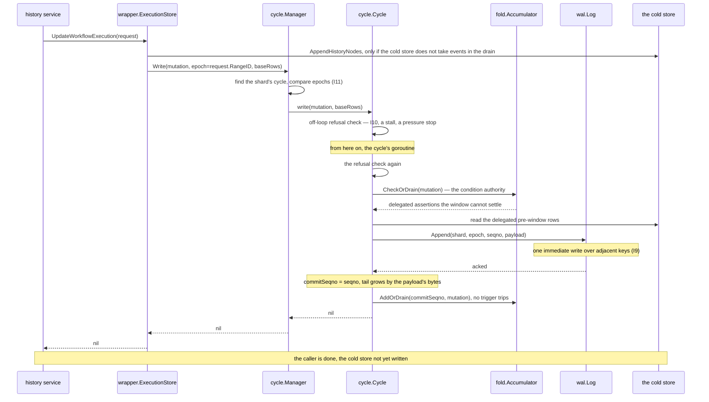
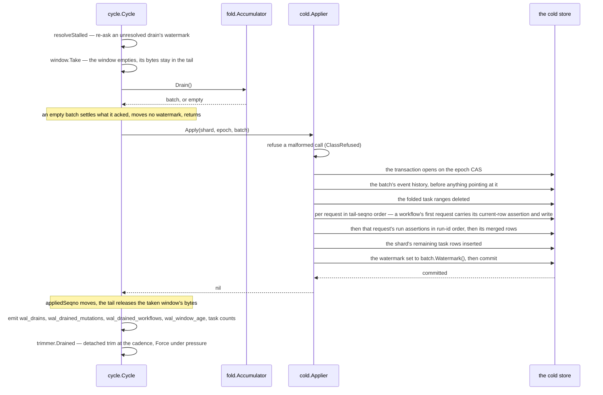
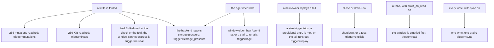
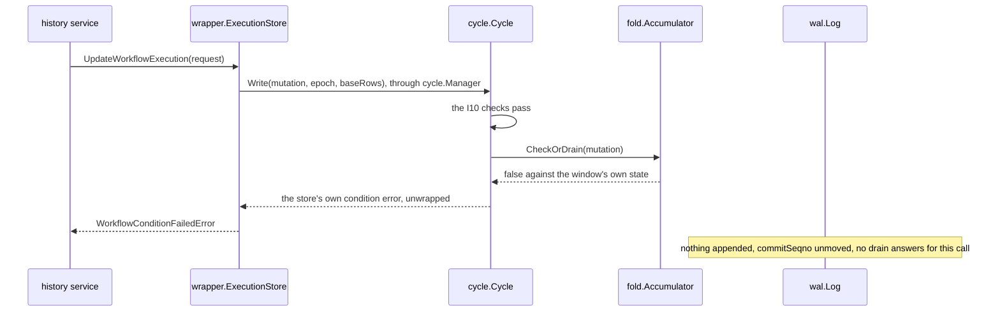
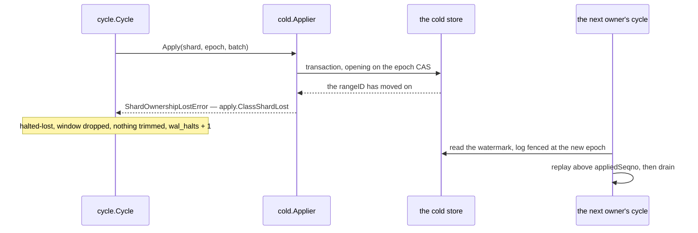
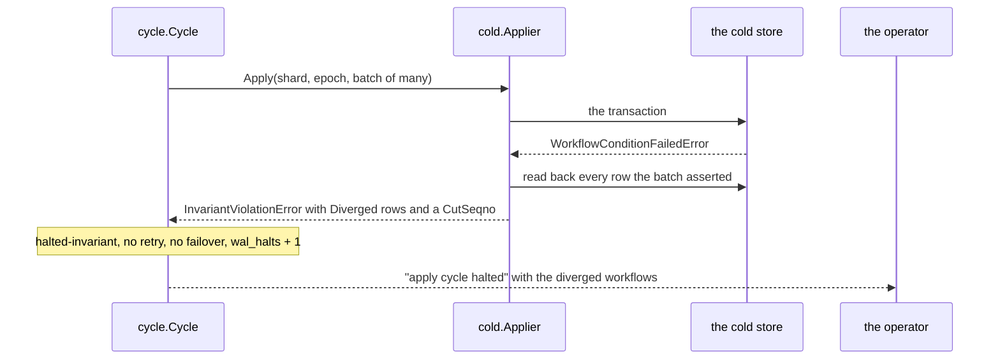
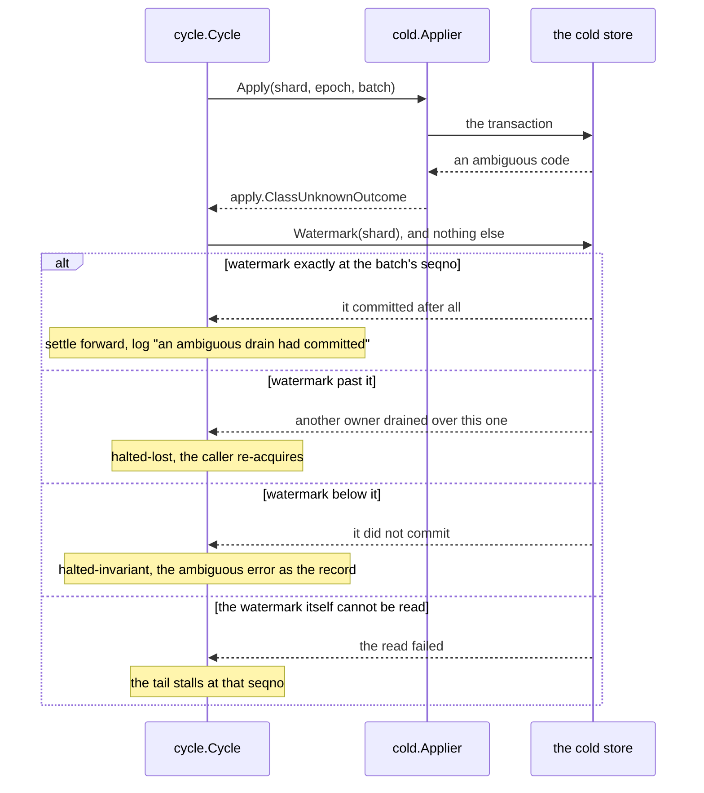
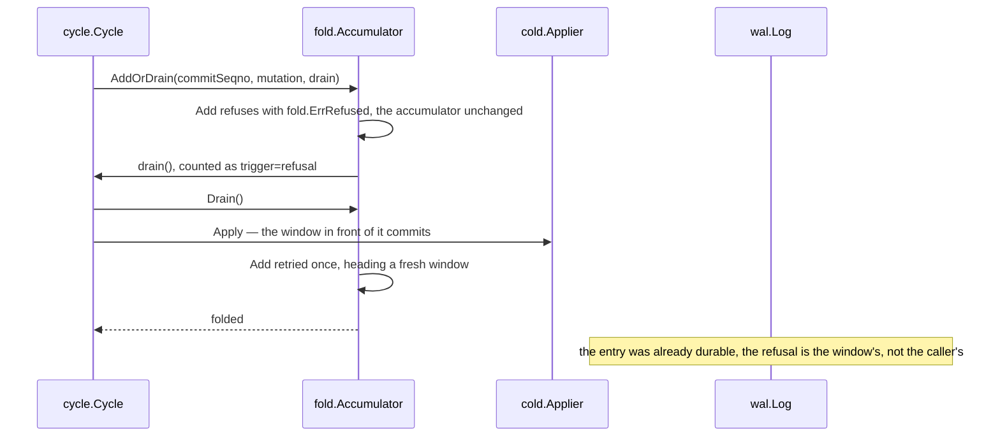

# A write, end to end

## One write, three moments of certainty

Start with one `UpdateWorkflowExecution`. The history service has produced new events and a
mutable-state update. The wrapper turns the request into one mutation and hands it to the shard's
cycle; if the cold store does not take history events inside the drain, the wrapper first writes
them through to it. So far the caller has been promised nothing.

Three checks come before anything is logged. Is the write stamped with the epoch this node holds?
Is the shard free to take more: its tail (the acknowledged entries not yet settled) below its
bound, no drain's outcome left unread, its backend not asking appends to stop? Does the request's
condition hold against the head of this window (the mutations folded since the last drain)? Every
refusal happens before the append, so a refused mutation consumed no seqno and is absent from the
log. That is the first moment of certainty.

If the checks pass, the cycle appends one entry and waits for the log's acknowledgement, moving
*commitSeqno*: the second moment. The entry is folded (merged) into the window and the write
returns success. The cold store is unchanged, but the write is durable, because replay can recover
it, and visible, because the overlay answers reads from the window ([chapter 07](07-read-path.md)).
That is the layer's bargain: most calls end at the append and the fold. A call that trips a trigger
(a size trigger or, more often under load, a fold refusal;
[chapter 14](14-where-the-defaults-came-from.md#the-drain-triggers-256-mutations-and-256-kib))
pays for the drain; otherwise the age tick drains and no caller pays.

The third moment comes later: a drain writes a folded batch and the watermark, the highest seqno it
applied, in one transaction. Once that commits, the cold store holds the effect and the matching
stretch of tail is released. If the process never learns whether it committed, the watermark is
the only witness.

## The cast

Every name below is a type in this tree except the first and the last.

| Participant | What it is |
|---|---|
| `history service` | the caller: Temporal's shard context, holding the shard's rangeID |
| `wrapper.ExecutionStore` | the decorator the history service holds instead of the base store |
| `cycle.Manager` | the per-node registry of shards to cycles; its `Write` checks the epoch |
| `cycle.Cycle` | one goroutine per (shard, epoch): the accumulator, the drain, the trim cadence, the reads |
| `fold.Accumulator` | the window: merged requests per dirty workflow, plus the assertions they stand on |
| `wal.Log` | the log contract; this tree ships `memwal` |
| `cold.Applier` | the drain's write door: one `Apply` publishes one drain, with its event history where the store declares `cold.HistoryApplier`; this tree ships `memcold` |
| `the cold store` | the persistence implementation behind that door, a deployment's own in production |

*commitSeqno* is the last seqno the log acknowledged; *appliedSeqno*, the watermark, is the last
seqno a committed drain contains, stored inside that drain's transaction, and no trim goes past it.
`wal_unapplied_entries` reports their difference, while I10 bounds the tail above a third position,
*resolved*, which also counts what an empty batch settled
([chapter 02](02-concepts-and-invariants.md#three-positions-not-two)).

## 1. The successful write

```mermaid
sequenceDiagram
  participant HS as history service
  participant ES as wrapper.ExecutionStore
  participant MG as cycle.Manager
  participant CY as cycle.Cycle
  participant ACC as fold.Accumulator
  participant LOG as wal.Log
  participant CS as the cold store

  HS->>ES: UpdateWorkflowExecution(request)
  ES->>CS: AppendHistoryNodes, only if the cold store does not take events in the drain
  ES->>MG: Write(mutation, epoch=request.RangeID, baseRows)
  MG->>MG: find the shard's cycle, compare epochs (I11)
  MG->>CY: write(mutation, baseRows)
  CY->>CY: off-loop refusal check — I10, a stall, a pressure stop
  Note over CY: from here on, the cycle's goroutine
  CY->>CY: the refusal check again
  CY->>ACC: CheckOrDrain(mutation) — the condition authority
  ACC-->>CY: delegated assertions the window cannot settle
  CY->>CS: read the delegated pre-window rows
  CY->>LOG: Append(shard, epoch, seqno, payload)
  Note over LOG: one immediate write over adjacent keys (I9)
  LOG-->>CY: acked
  Note over CY: commitSeqno = seqno, tail grows by the payload's bytes
  CY->>ACC: AddOrDrain(commitSeqno, mutation), no trigger trips
  CY-->>MG: nil
  MG-->>ES: nil
  ES-->>HS: nil
  Note over HS,CS: the caller is done, the cold store not yet written
```

The cycle's one arrow to the cold store is a run-time call through a `*baserow.Rows` value the
wrapper handed it; the cycle imports nothing that reaches a store
([chapter 03](03-components.md#the-component-diagram--run-time-calls)).

### When the append has no answer

`wal.ErrGap`, `wal.ErrFenced` and `wal.ErrAlreadyWritten` say definitely whether the write
happened. Any other error, such as a transport failure, says nothing, so the cycle reads the seqno
back, detached from the caller's cancellation (an expiring client deadline is the commonest cause):

* Nothing is there: the append wrote nothing, the seqno goes to the next mutation, and the caller
  gets the error.
* This cycle's own payload is there: the caller is told nil. The entry is durable and later writes
  will stand on it, so reporting failure would be a lie the caller acts on.
* Anything else, a stranger's entry or a failed read, halts the shard and keeps the log as
  evidence. An append cannot stall the way a drain does
  ([section 7](#7-failed-drain--the-outcome-could-not-be-read)), because the next writer needs that
  same seqno.

## 2. The drain itself

A drain publishes the window in one transaction: the merged requests, the task work and the
watermark. Event history the batch carries is durable no later than the transaction. Figure: a
drain against `memcold`; `resolveStalled` matters only while a previous drain's outcome is unknown
(section 7).

```mermaid
sequenceDiagram
  participant CY as cycle.Cycle
  participant ACC as fold.Accumulator
  participant AP as cold.Applier
  participant CS as the cold store

  CY->>CY: resolveStalled — re-ask an unresolved drain's watermark
  CY->>CY: window.Take — the window empties, its bytes stay in the tail
  CY->>ACC: Drain()
  ACC-->>CY: batch, or empty
  Note over CY: an empty batch settles what it acked, moves no watermark, returns
  CY->>AP: Apply(shard, epoch, batch)
  AP->>AP: refuse a malformed call (ClassRefused)
  AP->>CS: the transaction opens on the epoch CAS
  AP->>CS: the batch's event history, before anything pointing at it
  AP->>CS: the folded task ranges deleted
  AP->>CS: per request in tail-seqno order — a workflow's first request carries its current-row assertion and write
  AP->>CS: then that request's run assertions in run-id order, then its merged rows
  AP->>CS: the shard's remaining task rows inserted
  AP->>CS: the watermark set to batch.Watermark(), then commit
  CS-->>AP: committed
  AP-->>CY: nil
  Note over CY: appliedSeqno moves, the tail releases the taken window's bytes
  CY->>CY: emit wal_drains, wal_drained_mutations, wal_drained_workflows, wal_window_age, task counts
  CY->>CY: trimmer.Drained — detached trim at the cadence, Force under pressure
```

### Why the statement order matters

The transaction reports the first failing assertion and stops, so the order decides what a failure
says.

* The epoch CAS goes first, so ownership loss shadows the version failures a fenced writer would
  otherwise see.
* The range deletes precede the task inserts, because fold keeps a task that arrived after its
  range was completed; a later delete would remove it, and for a scheduled category that is a timer
  that never fires.
* The watermark is written last, behind the same gate (section 7).

Why a fold emits a request plus separately carried assertions, rather than replaying the window's
own requests, is
[chapter 13](13-designs-that-were-rejected.md#a-folded-window-as-a-concatenation-of-the-stores-own-queries).

The drain leaves one check out. A store's mutation and reset routines open with a lock-and-check
on the run's `db_record_version` (the create asserts the run's absence instead). The merged request
carries the window's last version while the row holds the pre-window one, so that check would fail
on every window that folded two mutations into a run. Fold's head-of-window assertion, registered
one statement earlier, stands in its place.

An applier must treat an assertion that held as routine and go on, not panic: a multi-workflow
transaction walks many held assertions before the failing one, which a one-workflow store rarely
does. A batch creating a run that exists beside one that does not must report a condition failure
whichever was appended first. Only a genuine impossibility may crash.

### Other rules of the drain

* *The trim is detached* (`trim.Trimmer`): off the loop, outside the transaction, under a
  one-minute budget, at the cadence or forced after every committed drain under storage pressure.
  A failed trim halts nothing; a halted cycle trims nothing
  ([chapter 06 §7](06-shard-lifecycle.md#7-trim-as-part-of-the-lifecycle)).
* *A drain that folds to nothing settles what it acked and moves no watermark*: no transaction ran,
  so moving it would let the trim delete entries the cold store never received.
* *An upsert and a delete of one key never both reach the transaction*, because a store orders
  upserts ahead of deletes and the key would silently vanish. The accumulator resolves the pair in
  stream order, the later operation winning (`fold.mergeItems`, over a run's seven collections). A
  window that wrote the current row and then removed it emits only the removal
  (`fold.WorkflowRecord.CurrentRemoved`), and the drain deletes whatever current row it finds
  ([chapter 02](02-concepts-and-invariants.md#i8-at-more-length) has the rest of I8).
* *A drain is always the whole window.* `window.Take` empties it and `Accumulator.Drain` emits every
  dirty workflow in one transaction: no partial drain, no ordering between a batch's writers, no
  metering or queueing. The only levers are the triggers and the I10 refusal.
* *A folded range delete cannot page.* A standalone `RangeCompleteHistoryTasks` may split a very
  large range across transactions; inside the drain it is one statement, so a very large range
  fails the whole drain, as an ordinary apply error no metric distinguishes.

### The drain triggers

Nine things start a drain, each setting one value of the `trigger` tag on `wal_drains`.

```mermaid
flowchart TD
  W["a write is folded"] --> M["256 mutations reached: trigger=mutations"]
  W --> B["256 KiB reached: trigger=bytes"]
  W --> RF["fold.ErrRefused at the check or the fold, the window cannot express it: trigger=refusal"]
  W --> P["the backend reports storage pressure: trigger=storage_pressure"]
  T["the age timer ticks"] --> A["window older than Age (5 s), or a stall to re-ask: trigger=age"]
  T --> P
  RP["a new owner replays a tail"] --> R["a size trigger trips, a provisional entry is met, or the tail runs out: trigger=replay"]
  X["Close or drainNow"] --> E["shutdown, or a test: trigger=explicit"]
  RD["a read, with drain_on_read on"] --> D["the window is emptied first: trigger=read"]
  S["every write, with sync on"] --> Y["one write, one drain: trigger=sync"]
```

The triggers differ most in who waits while the drain runs.

* `mutations`, `bytes` and `refusal` run inside some caller's write (a `refusal` also inside a
  replay, which folds through the same `Cycle.accept`) and drain other callers' work. That caller
  is already acknowledged, except under a `refusal` at the condition check, before the append. The
  drain runs in `Cycle.add`, on the cycle's goroutine, and every other write on the shard queues
  behind it, queue processors included: `AddHistoryTasks` and `RangeCompleteHistoryTasks` travel
  the log too, so a checkpoint waits behind a drain. Nobody waits on the trim, and nothing crosses
  shards. This cost is accepted and unmeasured
  ([chapter 15](15-the-limits-of-the-evidence.md#the-price-of-moving-deferred-work-into-the-log-is-not-measured)).
* `age` has nobody waiting.
* `replay` and `explicit` have a waiter who wrote nothing in the window: the request that started
  the cycle waits through the whole replay, a shutdown for the drain it asked for.
* `read` happens only with `drain_on_read` on, which nothing that ships does
  ([chapter 08](08-configuration.md)).
* `storage_pressure` fires inside a write whose append the backend answered under pressure (that
  caller is acknowledged), or from the age tick when the level rose between writes
  ([chapter 04](04-contracts.md#walpressuresource--the-optional-pressure-face)).

#### Sync mode's drain

With `sync: true` ([chapter 08](08-configuration.md#2-table-1--the-wal-sections-keys) has what it
is for) the same cycle drains a window of one mutation inside the write, with `trigger="sync"`. The
size triggers are never consulted, the age tick finds an empty window, and pressure forces the trim
instead of a drain, so a dashboard split by `trigger` shows only `sync` and `replay` (over the at
most one in-flight entry a killed node leaves). Halts, replay, the trim, backpressure and every
counter are the same code.

What changes is who receives a failed drain's error. Each drain carries a `drainCause`: its
trigger, a `callerRule`, and whether it is detached from its caller's clock. The legal values are a
fixed list of ten in `cycle/cycle.go` with no constructor, because a too permissive attribution
reports a failure to a caller who did not write it. Eight of the ten answer nobody, so a condition
failure inside one halts the shard. `drainSync` answers its caller, and `drainReplayProvisional`
drops a lone replayed provisional entry whose condition fails
([chapter 04](04-contracts.md#applyclass--sorting-the-outcome) has why). Hence sync mode's
acknowledgement is *provisional*: the entry is encoded with `mutation.EncodeProvisional`, not
`mutation.Encode`, and that bit tells replay it may drop the entry rather than halt.

## 3. Failed write — the condition did not hold

A false condition is expected traffic: a start racing a start, or a stale mutable-state version.
Only a window's head is asserted against the database, so such a write must never be folded in
silently. The condition is decided before the append; at the drain the caller would already have
its answer, and one caller's condition error would halt the shard.

The current-row assertion has three conditions (which run is current, its state, its last write
version); Temporal's plain read, `InternalGetCurrentExecutionResponse`, carries only the first two.
The layer uses the version-carrying read and refuses to start in intercept mode over a store that
cannot answer it (`baserow.ErrNoVersionedRead`). Figure: the case the window answers by itself.

```mermaid
sequenceDiagram
  participant HS as history service
  participant ES as wrapper.ExecutionStore
  participant CY as cycle.Cycle
  participant ACC as fold.Accumulator
  participant LOG as wal.Log

  HS->>ES: UpdateWorkflowExecution(request)
  ES->>CY: Write(mutation, epoch, baseRows), through cycle.Manager
  CY->>CY: the I10 checks pass
  CY->>ACC: CheckOrDrain(mutation)
  ACC-->>CY: false against the window's own state
  CY-->>ES: the store's own condition error, unwrapped
  ES-->>HS: WorkflowConditionFailedError
  Note over LOG: nothing appended, commitSeqno unmoved, no drain answers for this call
```

The check runs after the [I10](02-concepts-and-invariants.md#the-invariants) bound and before
`Log.Append`. The window answers when an earlier mutation of the window already heads that run.
Everything else it delegates: the cycle reads the pre-window row from the cold store before the
append and settles the assertion against it, so only delegated assertions cost a round trip.
Either way the caller gets the store's own error type,
`*p.WorkflowConditionFailedError`, `*p.CurrentWorkflowConditionFailedError` or
`*p.ConditionFailedError`, unwrapped, because the shard's write path type-switches on it.

### What the delegated read costs

One read per delegated assertion, not per mutation: one for the current-execution row
(`baserow.Rows.Current`, which also returns its `last_write_version`) and one per run the window
does not hold (`baserow.Rows.Run`), so a conflict-resolve naming several runs pays several. They run
in `Delegated.Settle`'s order, current row before run rows (a drain's registration order), and stop
at the first refusal, so a failing mutation often pays less than a succeeding one. Sync mode takes
none: the drain that asserts everything runs inside the same call.

The reads run on the cycle's goroutine, so no drain of this process can come between them and the
append. Another process can move those rows only by taking the shard, and then the append is
fenced or the drain's epoch CAS fails: "the row changed under us" becomes "the shard is no longer
ours", section 5.

### What the conflict error must carry

The start path reads a current-execution conflict's fields: `RequestIDs` to answer a retried
request as already started, `RunID` to choose which run to reuse or attach to, `Status` for the
client's response, and `LastWriteVersion` to decide whether the namespace is active here and to
carry as the previous run's version when it creates the new run as current. Empty fields would
create a second run where a start should have deduplicated, so `fold.currentConflict` fills the
error, start time included, from the window's own current-execution state blob, the one the store
would have read.

A delegated assertion is refused from the row the cold store returned, with the run id from the
response's `RunID` field, because upstream's read leaves the execution state's copy empty. The
store owes two things in that state: the request ids, or a retried start deduplicates against
nothing, and the start time, or the run reads as begun at the zero time and the start path's
minimal-interval refusal never fires.

### The counter that should stay at zero

In the windowed modes `wal_answered_condition_failures` stays at zero, because no failed condition
reaches a drain; non-zero means the check let one through, or a drain answered for a caller it did
not have. In sync mode the drain inside the write decides the condition, and `Cycle.answerWriter`
counts every failure it hands back.

## 4. Failed write — backpressure (I10)

I10 bounds the tail, not the window: the window empties when a drain starts, the tail only when its
transaction commits.

The refusal is `*serviceerror.ResourceExhausted` with
`Cause = RESOURCE_EXHAUSTED_CAUSE_PERSISTENCE_LIMIT` and `Scope = RESOURCE_EXHAUSTED_SCOPE_SYSTEM`,
the pair the server's own persistence rate limiter uses, so the retry stays inside the history
client. It must arrive unwrapped: the shard's write path reads `*serviceerror.ResourceExhausted` as
"definitely not committed", and one `%w` sends it to the default arm, a background re-acquire, which
is a self-inflicted failover.

### The four limits

The `limit` tag on `wal_backpressure_refusals` names what refused:

| `limit` | What ran out | What it means |
|---|---|---|
| `entries` | `HardMaxEntries`, 8192 by default | the applier is behind |
| `bytes` | `HardMaxBytes`, 8 MiB by default | the applier is behind, or a workflow is near the server's own blob limits |
| `unresolved` | not a size | the cycle cannot read what its last drain did, so nothing may be applied over it |
| `storage_pressure` | the backend's storage | the backend reports `wal.PressureStop` and takes no appends until it lowers the level ([chapter 04](04-contracts.md#walpressuresource--the-optional-pressure-face)) |

The precedence is `unresolved`, then `storage_pressure`, then the two sizes, so the tag names the
cause least in this shard's power to clear rather than an applier that is not the constraint.

### How the bound is checked

The check reads the tail as it stands, not as this mutation would make it, so no mutation is
refused for its own size and the tail overshoots by at most one entry. It runs twice: first on a
mirrored copy of the tail off the cycle's goroutine, so a shard whose applier is stuck refuses its
writers instead of parking them in the queue; then on the goroutine, ahead of the condition check
and the append, so concurrent callers cannot all slip past a tail one short of the bound.

### What a refusal leaves behind

Nothing in the layer's state: `commitSeqno` does not move, the accumulator never sees the mutation
(so the next drain's `MutationsIn`, and the collapse ratio a run is judged by, count only accepted
writes), and the retry lands at the refused seqno with no gap. History events the wrapper wrote
first may remain ([What is durable when the caller returns](#what-is-durable-when-the-caller-returns)).
The shard stays running and answers what it holds. Its `ShardStore` path is never refused, because
refusing a rangeID renewal would cause the failover I10 exists to avoid. The bound is also
node-wide: `HardMaxBytes × MaxShards` must fit `TailBudgetBytes`, asserted once at start-up
([chapter 08](08-configuration.md#5-the-budget-refusal)).

## 5. Failed drain — the shard was lost

Another node has taken the shard and bumped its rangeID. The drain's transaction opens on the epoch
CAS, so this is the failure it reports, whatever else would have failed.

```mermaid
sequenceDiagram
  participant CY as cycle.Cycle
  participant AP as cold.Applier
  participant CS as the cold store
  participant NX as the next owner's cycle

  CY->>AP: Apply(shard, epoch, batch)
  AP->>CS: transaction, opening on the epoch CAS
  CS-->>AP: the rangeID has moved on
  AP-->>CY: ShardOwnershipLostError — apply.ClassShardLost
  Note over CY: halted-lost, window dropped, nothing trimmed, wal_halts + 1
  NX->>CS: read the watermark, log fenced at the new epoch
  NX->>NX: replay above appliedSeqno, then drain
```

This is fencing working, not an incident. The halted cycle trims nothing, because its entries are
what the next owner replays, and refuses every later write and task read. While the tail is
non-empty the cold store is incomplete by an unknown amount, so the mutable-state reads and the
branch page that routes like one are refused too; with an empty tail a mutable-state read passes through
([chapter 07](07-read-path.md#2-routing-a-read-and-drainonread)). The write whose drain this was
gets `*p.ShardOwnershipLostError`, because `storeError` (a cycle's answer into the store's error
type) translates `halted-lost` and no other state, and the shard re-acquires. The halt classes are
[chapter 06 §5](06-shard-lifecycle.md#5-halts-the-two-classes), the next owner's replay
[chapter 06 §4](06-shard-lifecycle.md#4-then-recover-the-acknowledged-tail).

## 6. Failed drain — an invariant was violated

A version or current-row assertion failed inside a drain's transaction, and every writer in the
batch is already acknowledged, so there is nobody to attribute it to. Under fencing the layer is the
shard's only writer, so this is a self-audit: the layer contradicted itself, fencing failed, or
something wrote those rows around the layer. Without the assertion the drain would write over a
moved base version and corrupt the shard silently; with it, the shard stops with the log intact.

```mermaid
sequenceDiagram
  participant CY as cycle.Cycle
  participant AP as cold.Applier
  participant CS as the cold store
  participant OP as the operator

  CY->>AP: Apply(shard, epoch, batch of many)
  AP->>CS: the transaction
  CS-->>AP: WorkflowConditionFailedError
  AP->>CS: read back every row the batch asserted
  AP-->>CY: InvariantViolationError with Diverged rows and a CutSeqno
  Note over CY: halted-invariant, no retry, no failover, wal_halts + 1
  CY-->>OP: "apply cycle halted" with the diverged workflows
```

It is not retried: a retry builds the same transaction against the same rows, and a batch rebuilt
from the drained window would stand on state the drain may already have mutated. Nor is it
converted to `ShardOwnershipLost`, which would hand the divergence to a next owner who replays into
the same failure, so `storeError` leaves this class unrecognised.

The operator sees `wal_halts{state="halted-invariant"}` and a warn-level *"apply cycle halted"*
whose cause holds what `apply.Attribute` read back: every row not where fold asserted it, with the
asserted and actual versions and the window slice (`HeadSeqno..TailSeqno`) responsible.
`CutSeqno`, one below the lowest diverged entry, is the highest seqno a partial re-drain may
acknowledge; it is forensic, since no code re-drains partially. Zero means acknowledge nothing: no
divergence was found, the shard's first entry (`wal.FirstSeqno`) diverged, or the readback failed.
The runbook is [chapter 09](09-operations.md#b-a-shard-halted--and-which-of-the-two-classes).

## 7. Failed drain — the outcome could not be read

The cold store returned a code the applier cannot interpret, so the transaction may or may not have
committed. The cycle reads the watermark alone and compares it to the batch's seqno.

```mermaid
sequenceDiagram
  participant CY as cycle.Cycle
  participant AP as cold.Applier
  participant CS as the cold store

  CY->>AP: Apply(shard, epoch, batch)
  AP->>CS: the transaction
  CS-->>AP: an ambiguous code
  AP-->>CY: apply.ClassUnknownOutcome
  CY->>CS: Watermark(shard), and nothing else
  alt watermark exactly at the batch's seqno
    CS-->>CY: it committed after all
    Note over CY: settle forward, log "an ambiguous drain had committed"
  else watermark past it
    CS-->>CY: another owner drained over this one
    Note over CY: halted-lost, the caller re-acquires
  else watermark below it
    CS-->>CY: it did not commit
    Note over CY: halted-invariant, the ambiguous error as the record
  else the watermark itself cannot be read
    CS-->>CY: the read failed
    Note over CY: the tail stalls at that seqno
  end
```

### Why only the watermark can answer

The watermark rides the drain's own transaction behind the same gate, so it moved if and only if
the batch committed. A drain whose assertion failed leaves the same state as one that never ran,
whether the store rolls it back (the shipped one does) or commits a transaction gated to write
nothing ([chapter 04](04-contracts.md#the-recovery-rule-the-watermark-exists-for) has this and why
the match must be exact). Re-reading the base versions and re-folding would apply a committed batch
twice, because the commit is what moved them. For the same reason an applier must not let its
client library retry an ambiguous code: a batch that had committed comes back as a condition
failure, an invariant halt for a drain that succeeded.

### The stall

When the watermark itself cannot be read, the tail *stalls* at that seqno rather than halting,
which would lose a shard a brief outage would heal. While the stall stands:

* every write is refused with `limit="unresolved"`;
* all four reads the layer serves ([chapter 07](07-read-path.md)) are refused;
* every later drain re-asks the watermark before it takes the window;
* nothing may commit over it. A later committed drain would set the watermark above the unresolved
  entries, claiming they were applied, and the trim behind it would delete them from the log.

On a running node only the age tick heals a stall, because a shard refusing its writers gets no
caller-driven drain; the shutdown drain re-asks too.

## 8. Fold refusal — a window the accumulator cannot express

A few valid streams cannot be expressed as merged requests: a continue-as-new folding into another
request's envelope, or a delete of one half of such a pair. The window has run out of room; nothing
is wrong. A third shape comes from `DeleteCurrentWorkflowExecution`, whose `RunID` is a guard: a
mismatch is an ordinary no-op, so it is not asserted
([chapter 04](04-contracts.md#what-a-drain-asserts-and-what-it-must-not)). The delete records no assertion and *taints* the current row instead, so a later mutation in the window
that stands on that row is refused: its assertion would be a mid-window claim posing as a
head-of-window one. All three recover with one drain.

```mermaid
sequenceDiagram
  participant CY as cycle.Cycle
  participant ACC as fold.Accumulator
  participant AP as cold.Applier
  participant LOG as wal.Log

  CY->>ACC: AddOrDrain(commitSeqno, mutation, drain)
  ACC->>ACC: Add refuses with fold.ErrRefused, the accumulator unchanged
  ACC->>CY: drain(), counted as trigger=refusal
  CY->>ACC: Drain()
  CY->>AP: Apply — the window in front of it commits
  ACC->>ACC: Add retried once, heading a fresh window
  ACC-->>CY: folded
  Note over LOG: the entry was already durable, the refusal is the window's, not the caller's
```

A refusal leaves the accumulator unchanged, so the retry is safe, and it succeeds because an empty
window refuses nothing. Should a second refusal come anyway, the two call sites differ:

* At the fold (`AddOrDrain`, in `Cycle.accept`, shared by the write path and replay) the entry is
  acknowledged, so the shard halts `halted-invariant`.
* At the condition check (`CheckOrDrain`, in `Cycle.check`) nothing is acknowledged, so the refusal
  goes back to the caller, and `storeError` passes it on as an unrecognised error.

If the recovery drain itself fails, the caller gets that drain's error and the mutation is durable
but not folded. A still-running cycle folds it into the now-empty window at once (`Cycle.refold`); a
halted one leaves it in the log for the next owner. An acknowledged entry this cycle cannot apply
always becomes a halt, never a forgotten mutation.

## The decision table

| Symptom at the caller | `apply.Class` | What the cycle does | What the operator sees |
|---|---|---|---|
| nil | —, or `ClassCommitted` if this call triggered a drain | acked and folded, possibly drained | `wal_intercepted_writes`, `wal_tail_entries`; a triggering call also `wal_drains{trigger=…}` (every call in sync mode) |
| `WorkflowConditionFailedError` / `CurrentWorkflowConditionFailedError` / `ConditionFailedError` | — (never appended); `ClassInvariantViolated` in sync mode, whose drain answers its writer | nothing acked, no seqno consumed; in sync mode the entry stays acked and is settled without moving the watermark | `wal_answered_condition_failures`: 0 in the windowed modes, every answer in sync mode |
| `ResourceExhausted` | — (refused before the append) | nothing acked | `wal_backpressure_refusals{limit="entries"\|"bytes"\|"unresolved"\|"storage_pressure"}` |
| `ShardOwnershipLost` | `ClassShardLost` | `halted-lost`: window dropped, tail kept, nothing trimmed | `wal_halts{state="halted-lost"}`; warn *"apply cycle halted"* |
| an unrecognised error (invariant halt) | `ClassInvariantViolated` | `halted-invariant`: no retry, no conversion to a failover | `wal_halts{state="halted-invariant"}`; warn *"apply cycle halted"* with the diverged rows |
| an unrecognised error (unknown outcome) | `ClassUnknownOutcome` | read the watermark: committed after all, halt, or stall | warn *"a drain's outcome could not be read"*, or info *"an ambiguous drain had committed"*; `wal_backpressure_refusals{limit="unresolved"}` during a stall |
| `Unimplemented` from `CompleteHistoryTask` | — | never reaches the write path | nothing; intercept mode refuses the method by design |

`ClassRefused` has no row because it never reaches a caller: the applier turns a malformed call
away before anything reaches the cold store (epoch 0, an empty batch, another shard's batch, or a
request or assertion kind it has no write path for). That is a programming error, so the drain
halts the shard `halted-invariant` and the caller whose write tripped it gets the halt's error, as
in the invariant-halt row.

## What is durable when the caller returns

Durable: the mutation, as one log entry at a seqno no other entry has, under a fenced epoch, and
its new history events. Where the cold store declares `cold.HistoryApplier` (`memcold` does), the
entry carries the events and the drain writes them, no later than the mutable state that points at
them; otherwise the wrapper writes them through the base store before the append. Not yet in the
cold store: the mutable-state rows, the task rows and the watermark, which a later drain brings;
until then the layer answers reads over them.

Where the wrapper writes the events first, every pre-append refusal (a condition failure,
backpressure, a lost shard) leaves them behind, referenced by nothing. That is the safe direction:
events ahead of confirmed state are inert; confirmed state pointing at missing events is a broken
workflow.

## Summary

A write passes three moments of certainty. Before the append, a refusal (a stale epoch,
backpressure, a failed condition) consumes no seqno and folds nothing. After the append the
mutation is durable and visible, and most callers return. After a drain commits, the cold store
holds the folded effect and the watermark says so in the same transaction.

The drain publishes the whole window in one transaction whose statement order decides what a
failure reports. Nine triggers start it and differ mainly in who waits; sync mode is the same cycle
with a window of one and a provisional acknowledgement.

A failed condition returns the store's own error; backpressure, an unwrapped `ResourceExhausted`
naming one of four limits. A lost shard halts `halted-lost`, a violated invariant
`halted-invariant`, and an unreadable outcome is settled by the watermark alone or stalls the tail
until a re-ask reads it. In every path an acknowledged entry stays in the log until a committed
drain covers it; [chapter 06](06-shard-lifecycle.md#4-then-recover-the-acknowledged-tail) has what
the next owner does with it.

## Where this lives in the code

* [`../../wrapper/execution_store.go`](../../wrapper/execution_store.go) — `write`, the
  events-before-state rule, and the eight kinds that become log records.
* [`../../cycle/write.go`](../../cycle/write.go) — `Manager.Write`: shard lookup, the I11 epoch
  check, the translation into the store's error types.
* [`../../cycle/cycle.go`](../../cycle/cycle.go) — `add`, `accept`, `drain`, `resolve`, `halt`,
  `Defaults()`, the `drainCause` values, and `pressureLevel`, where `wal.PressureSource` is read.
* [`../../cycle/decide.go`](../../cycle/decide.go) — the rules as pure functions: `writeRefused`
  (unresolved drain, pressure stop, I10, in that precedence), `storeError`, `attribute`,
  `settlementOf`.
* [`../../cycle/window/window.go`](../../cycle/window/window.go) and
  [`../../cycle/tailstate/tailstate.go`](../../cycle/tailstate/tailstate.go) — the two byte
  counters that must never be merged, and the typed token between them;
  [`../../cycle/trim/trim.go`](../../cycle/trim/trim.go) is the detached trim.
* [`../../fold/check.go`](../../fold/check.go) — the condition authority, `Delegated.Settle`'s
  order, `currentConflict`'s payload; [`../../fold/refusal.go`](../../fold/refusal.go) is the
  drain-and-retry.
* [`../../fold/merge.go`](../../fold/merge.go) — per-key upsert-versus-delete resolution;
  [`../../fold/fold.go`](../../fold/fold.go) has `addDeleteCurrent`, the tainted current row and
  `WorkflowRecord.CurrentRemoved`.
* [`../../baserow/baserow.go`](../../baserow/baserow.go) — the two pre-window reads.
* [`../../apply/failure.go`](../../apply/failure.go) — `Classify`, `Refuse` and the attribution
  readback.
* [`../../cold/cold.go`](../../cold/cold.go) — the four things a drain owes, and `HistoryApplier`, the one
  part that may sit outside its transaction;
  [`../../cold/memcold/apply.go`](../../cold/memcold/apply.go), the shipped applier, whose doc
  comment is section 2's statement order.
* [`../../cycle/replay.go`](../../cycle/replay.go) — what a new owner does with the tail these
  failures leave.
