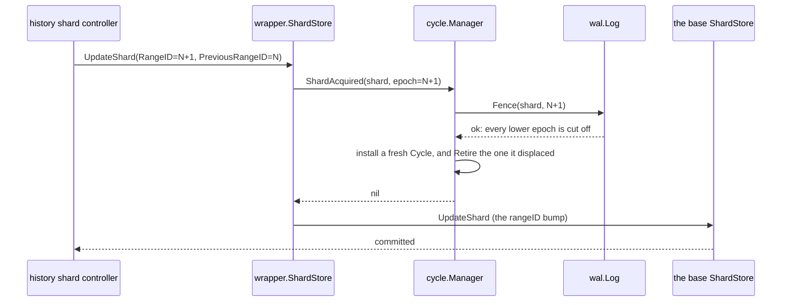
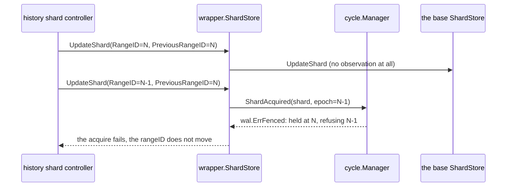
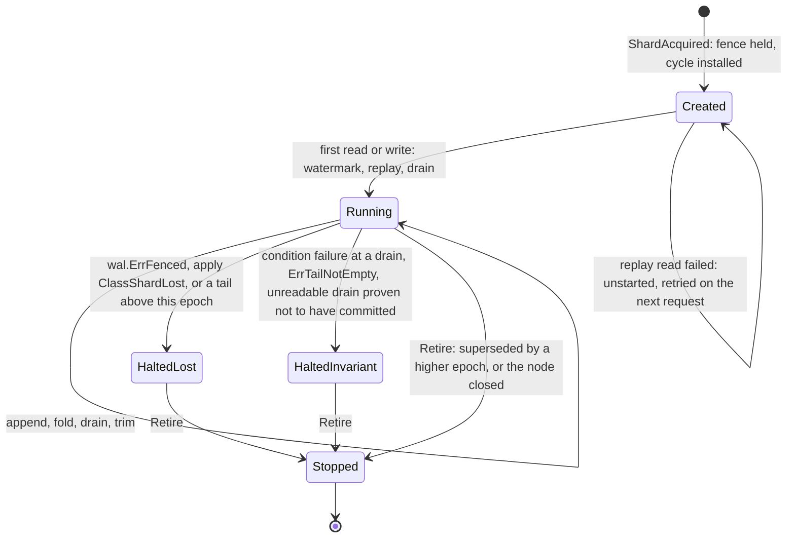
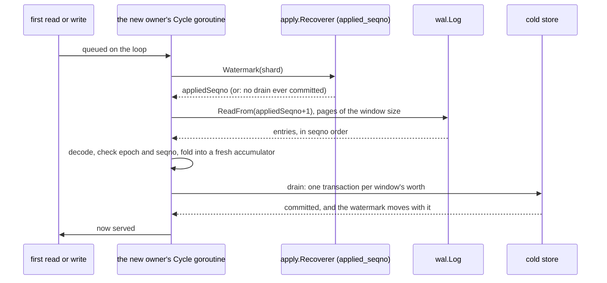
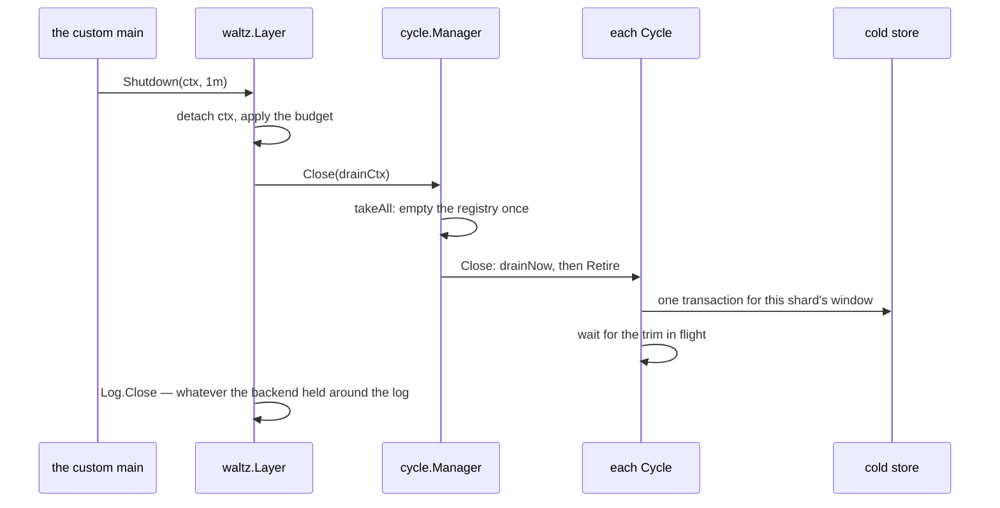

# When an owner disappears

Suppose a history node acknowledges several workflow mutations and then loses power. The cold store
does not contain those mutations yet. The process that held them in memory is gone. Nevertheless,
the acknowledgement must remain true.

The durable log makes that possible, but durability alone is not recovery. A second node must
continue the shard without allowing the failed owner to return and write concurrently. It must
start just above the cold store's watermark, inspect the retained log entries, and apply or settle
them safely. If the evidence contradicts the assumptions behind safe replay, it must stop. Those
requirements lead to four mechanisms, in this order:

* an **epoch** fences every previous owner out of the log;
* a new **cycle** reads the committed watermark and replays the remaining tail;
* a cycle that discovers it has lost ownership halts, and the successor recovers from the retained
  log;
* an invariant violation halts for a different reason, preserving the log for investigation.

That is the derivation rather than the chapter's table of contents — the sections below take the
same ground in the order a cycle lives it, from acquisition through replay and retirement to trim,
so the fourth mechanism above is not the fourth section below.

The write path itself is [chapter 05](05-write-path.md); the reads a halted or
superseded shard answers are [chapter 07](07-read-path.md); what an operator does about either halt
is [chapter 09](09-operations.md).

## The recovery path in one paragraph

For one Temporal **shard**, an **epoch** (`wal.Epoch`) says who may append and a **cycle**
(`cycle.Cycle`) is that owner's in-process lifetime. The node's registry (`cycle.Manager`) installs
a cycle when it observes a new epoch. That cycle reads the persistent `applied_seqno` watermark and
then the retained log above it. Because the in-memory `resolved` position died with the old process,
the read may include settled no-op entries as well as work that still needs applying. [Chapter
02](02-concepts-and-invariants.md) owns the full vocabulary; here these pieces form one recovery
sequence: epoch → cycle → watermark and retained log → replay.

---

## 1. First exclude the failed owner

A shard has one owner because a workflow is a sequential machine: every transition reads the previous
state and writes the next one. Two nodes writing one run lose a transition outright — both read, both
build a successor, both commit, and the second overwrites the first — and, worse, they hand out ids
for deferred work from two allocations. A task row is found and deleted by its id, so two rows under
one id are not a lost write but two writes that nobody reading by number can tell apart. One owner
per shard is what buys the ordering as well as the exclusion.

Before a successor examines the inherited tail, it must make further appends by the predecessor
impossible. Otherwise replay and live writes could interleave under two owners, and no watermark
could say which history is authoritative. This exclusion is fencing: a check at the point of the
write, rather than a term the owner keeps in its own memory — the failed owner is frequently not gone
at all, since a collection pause, swap or a partition returns a process that learned nothing about
its own death. [Chapter 13](13-designs-that-were-rejected.md#a-lease-with-a-timer) has the lease that
was refused and what its refusal forces.

The layer is never *told* directly that it owns a shard. Temporal's persistence API has no
"acquire" call, and closing a shard makes no persistence call whatsoever. What it does have is
`ShardStore.UpdateShard`, and the history service sends it from two places with the same shape and
two different meanings:

| Where it comes from | Shape | Meaning |
|---|---|---|
| the shard controller renewing its range — on acquire, and whenever the shard exhausts its task-id range | `RangeID = PreviousRangeID + 1` | the shard changing hands, or its range being renewed: a **new epoch** |
| the shard's periodic info update | `RangeID == PreviousRangeID` | a **heartbeat** that carries no news |

Comparing those two fields is the whole of the distinction, and
[`../../wrapper/shard_store.go`](../../wrapper/shard_store.go) is where it is made:

```go
if s.layer != nil && request.RangeID != request.PreviousRangeID {
        if err := s.layer.ShardAcquired(ctx, wal.ShardID(request.ShardID), wal.Epoch(request.RangeID)); err != nil {
                return err
        }
}
return s.base.UpdateShard(ctx, request)
```

Two properties of those seven lines are load-bearing.

**The order.** The observer runs *before* the base store commits the rangeID bump, so the WAL is
fenced at the new epoch first and the rangeID lands second. A failed fence therefore fails the
acquire without the base store being called at all, and leaves the previous owner's rangeID in
place for the shard controller to retry. The invariant this protects is that the epoch in the log
may never lag the epoch in the database — a database that had moved ahead of a log nobody fenced
would let two writers hold what each believes is the current range.

**The test is inequality, not "greater than".** A `RangeID` that went *backwards* is not silently
treated as a heartbeat; it reaches the observer and is refused there.

An acquire, drawn end to end:



How to read this: every arrow above the base store happens *first*. If `Fence` fails, the last two
arrows never happen, so the database still says the previous owner holds range `N` while this node
holds no cycle for the shard.

The two other shapes of the same call:



How to read this: the heartbeat (top) never reaches the layer, so a shard that is merely alive costs
the layer nothing; the refusal (bottom) happens in `Manager.ShardAcquired`, before the log is
touched.

### What `Manager.ShardAcquired` does with the epoch it is handed

Four cases, in the order [`../../cycle/manager.go`](../../cycle/manager.go) takes them:

1. **a cycle already held at exactly this epoch** — return `nil` and do nothing. Fencing is
   idempotent, and so is this: a retried acquire at the same epoch must not throw away a
   running cycle's window.
2. **a cycle held at a *higher* epoch** — refuse with `wal.ErrFenced`. This node has already moved
   on.
3. **otherwise, fence first** — `Log.Fence(ctx, shard, epoch)`, whose error is returned
   **unwrapped**, because the shard's write path type-switches on concrete error types and one
   `%w` turns a recognised outcome into an unknown one.
4. **then install** a fresh `cycle.New(shard, epoch, …)` in the registry, and `Retire()` whatever
   cycle it displaced — outside the registry's lock, and without draining it (see
   [§5](#5-halts-the-two-classes) and [§6](#6-stopping-a-node)).

Nothing reaps an idle cycle, and that is deliberate rather than an omission: an acquire is
observable and a close is not, so a cycle is retired only by a higher epoch superseding it or by the
node shutting down. What an idle one costs is one goroutine and an empty accumulator — a leak
bounded by the shard count.

---

## 2. Use the ownership token Temporal already has

`wal.Epoch` is not a token the layer mints. It **is** Temporal's `rangeID`, taken from the
`UpdateShard` request and used as the log's fencing token, and that identity is invariant [I11](02-concepts-and-invariants.md#the-invariants).

The reason is that a second, independent ownership token would be a second thing that can be right
while the first is wrong. Temporal already fences the shard on `rangeID`: the shard context refuses
to write under a stale one and the store's own shard row asserts it. Reusing that number means
the log's fence and the database's fence cannot disagree — there is one number, moved in one place,
by the acquire itself.

Two consequences a writer must know:

* **an epoch may grow without an ownership change.** The history service renews `rangeID` whenever a
  shard exhausts its allocated task-id range, which happens on a perfectly healthy shard that never
  changed hands. That range is not a second allocation to keep consistent with the first: it is
  derived from the counter by a shift — `nextTaskID = rangeID << RangeSizeBits`, `RangeSizeBits`
  being 20 in the history service's defaults — so one epoch names a block of 2^20 = 1,048,576 ids,
  handed out from memory rather than one database round trip at a time. Two owners can never hold one
  value of the counter, so they can never share a block, and uniqueness costs nothing extra. A
  growing epoch is therefore *not* evidence of a failover, and the layer treats a renewal
  exactly as it treats an acquire: fence at the new epoch, retire the old cycle, install a fresh one
  that replays whatever the old one had acked and not yet applied. That is why the append path can
  never assume "my tail is empty because I have never lost the shard" — a renewal is enough to leave
  one behind.
* **whoever hands epochs out owes the log a strictly greater epoch per acquire.** Fencing cannot
  separate two writers holding the *same* epoch: they would both pass the fence and race for
  seqnos. Epoch `0` is not a valid epoch at all (`wal.ErrZeroEpoch`) — it is the "nobody owns this"
  reading of an absent fence.

That obligation is discharged upstream, by a conditional write. An acquire is a read of the shard
row followed by a write of one greater value that demands, in the write itself, that the old value
still be the one that was read: a `ShardStore.UpdateShard` registers
`AssertShard(true, PreviousRangeID)` and `UpsertShard(RangeID, …)` on one transaction. Two nodes that
both read `N` cannot both install `N+1` — one transaction's assertion fails, and its author is told
nothing except that its write did not happen. The server drains its in-flight requests before it
renews, because those requests are conditioned on the number about to move. **Weakening that
assertion to a plain upsert would break fencing silently**: two holders of one epoch pass the log's
fence and pass the drain's epoch assertion alike, so no error is raised anywhere, and the layer has
neither a metric nor an assertion that could report it. The guarantee is entirely upstream.

The epoch check is also made once more, at the write boundary: `cycle.Manager.Write` compares the
`rangeID` the caller wrote under against the epoch this node's cycle holds, and answers
`ShardOwnershipLost` if they differ. Without it, a shard context that has already been fenced out
would have its write silently re-stamped with whatever epoch this node currently holds and accepted.
A zero epoch there means "no rangeID": three of the eight intercepted shapes carry no such field —
`delete`, `delete-current` and `range-complete-tasks` — and the drain's epoch compare-and-swap
fences those instead.

---

## 3. Turn an epoch into one in-process lifetime

A cycle has exactly three states, declared as `cycle.State` in
[`../../cycle/cycle.go`](../../cycle/cycle.go): `StateRunning`, `StateHaltedLost` and
`StateHaltedInvariant`, whose `String()` values are `running`, `halted-lost` and `halted-invariant`.
The two halted names are also the tag values on the `wal_halts` metric; only a halt emits it, so
`running` never appears there. Only `StateRunning` accepts work, and a halt is terminal:
`Cycle.halt` returns immediately if the cycle is already halted, so the first cause is the one
recorded.



How to read this. `Created` is not a state value: it is a running cycle that has not yet read its
seqno floor (`state.started` is false). The self-loop on it is the only recoverable failure on the
diagram — a replay whose log read failed leaves the cycle unstarted with an empty window, so the
next request starts again from the watermark. `Stopped` is likewise not a `State` value: a stopped
cycle keeps reporting the state its goroutine stopped in, and `Retire` on a *running* cycle stamps
it `halted-lost` on the way out, because being superseded is exactly what that state means.

### The state that is not a state: a stalled tail

There is a fourth condition an operator will meet, and it is deliberately **not** a `State`: a drain
whose outcome could not be *read*. `apply` moves the cold store's watermark by writing it inside the
drain's own transaction, so the watermark is the only witness to whether a drain committed; when the
read of that watermark itself fails, the cycle knows neither answer.

Halting there would turn a blip into a lost shard, so instead the drain's seqno becomes a **floor on
the tail** (`tailstate.Tail.Stall`): nothing settles or commits over it, and both writers and readers
are refused until one readable watermark ends the stall. A watermark at or above the drain's seqno
means it committed after all; one below means it did not, and the shard halts on the invariant
side. What the refusals look like and why the age tick is the only thing that can heal a stall is
[chapter 05](05-write-path.md#7-failed-drain--the-outcome-could-not-be-read). For this chapter the
point is the placement: a stall is a property of the *tail*, not a fourth `State`, so a shard that
recovers from one has nothing to un-halt.

---

## 4. Then recover the acknowledged tail

Once the new epoch is fenced, the successor can finish the failed owner's work without racing it.
The dead node left entries acknowledged into the log and not applied to the cold store. Nothing is
lost — invariant I2 says every acknowledged mutation is durable in that log — but the
acknowledgement becomes useful again only after the next owner applies or otherwise settles that
tail.

Replay is [`../../cycle/replay.go`](../../cycle/replay.go), and it is `Cycle.start`
grown a body: it runs lazily, inside the cycle's own goroutine, on the **first request** that
reaches the shard — read or write alike.



How to read this: the request is not refused and there is no "replaying" flag to check — it is
simply parked on the loop behind the replay, on its own context. That placement **is** the readiness
gate. It also means a *read* triggers replay exactly as a write does, and that is not an
optimisation. A read answered from a cold store the log is ahead of would be stale with nothing to
say so; a task page short a key is worse than stale, because its one caller completes the range it
read and acks past whatever was missing.

Six rules the loop applies, entry by entry:

* **an entry above this cycle's epoch means we are the zombie.** A successful fence cuts off every
  lower epoch, so an entry the log holds *above* ours was written by an owner that fenced after us:
  halt `halted-lost`, before a row is written. This is checked here rather than left to the apply
  transaction's epoch CAS, because the fence and the rangeID bump are not atomic — in between, a
  zombie's CAS would still succeed. The halt's cause carries the exported constant
  `cycle.FencedAway`, so an instrument can tell this road to a fence from an append's.
* **a seqno that is not the expected one halts on the invariant side.** Gap-freedom is guarantee 4
  of the log contract; a log with a hole is not the log these invariants are written against.
* **a decode failure is fatal to the replay** — a newer codec, or a task category this node has no
  registration for. The entry is already acked, so there is nothing to do but stop. This is why
  `cycle.Deps.Registry` is required and `NewManager` refuses a nil one with `cycle.ErrNoRegistry`:
  a node that decoded with no registry would recover nothing, silently, until its first failover.
* **the ack is the answer — with one exception the writer records.** Every assertion is verified
  before the entry becomes durable, so a condition failure at apply time is a genuine divergence and
  halts the shard. An entry the writer marked *provisional* was acked before its condition was
  decided — sync mode's drain answers its caller itself — so that entry's condition may legitimately
  fail, and replay drops it rather than halting: the drop settles the seqno with the watermark held
  back, since the entry was never written, and counts `wal_replay_dropped_entries`. The mark is the
  writer's because nothing a replay can read separates the two classes afterwards — both present as
  "acknowledged, above the watermark, not applied" — and the flag's zero value means "verified", so
  an unmarked entry can never be dropped silently. A drain is all-or-nothing, so a provisional entry
  travels a batch alone: the window in front of it is drained first and it is drained by itself
  after, both under `trigger="replay"`.
* **an entry the previous owner had already settled re-folds to nothing.** `resolved` lived only in
  that process's memory, so the successor cannot tell a settled no-op from work — and does not need
  to. Re-folding one costs a decode and produces no database statement, which is exactly what the
  old owner concluded about it. That is the whole reason the third position may die with the
  process while the other two are persisted.
* **transactions are cut by the two size triggers only.** The age trigger is not consulted, since
  everything here is already as old as the incident. Replay also has **no bound of its own**:
  invariant I10 bounds what a *running* cycle acks, and a tail that somehow exceeds it must still be
  replayed or the shard is unrecoverable.

### What replay does not need

* **no hole tracking.** `Trim` moves the log's lower end and `Append` its upper end, and nothing
  puts a hole in the middle. So replay is a straight read of `(appliedSeqno, commitSeqno]` with a running
  expectation of the next seqno — no bitmap and no per-entry acknowledgement state.
* **no re-running of the condition authority.** Its callers are all gone.
* **no rebuilding of a window the previous owner drained.** An entry below the watermark is a row
  the cold store already holds.
* **no re-derivation of an unknown outcome from base versions.** The watermark is read first, in
  every outcome; re-reading base versions instead applies a committed batch twice, because the
  commit is what moved the base. A version could not even *name* the missing set: it advances per
  committed transaction and a transaction carries a whole folded batch, so there is no arithmetic
  from a version to a seqno — and a batch that committed but was never heard from reads exactly like
  a batch that never happened. Only the commit itself can record the position, which is what
  `applied_seqno` is and why it is written inside the drain's own transaction.

### An abandoned attempt gives back what it took

A replay that fails without halting — a log read that errored — leaves the cycle unstarted, and
everything the attempt moved is dropped with it: the accumulator and window are replaced, the acked
bytes go back to the floor, and its counters are a value the cycle never adopts. A retry reads the
watermark again and re-acks everything above it, so keeping any of that would count one incident
once per attempt — and since the tail is what invariant I10 reads before a write is queued, the leak's
first symptom would be a perfectly healthy shard refusing its writers. Halted *inside* a replay is
the opposite case: no attempt follows, so the tail stays as the evidence reads are refused on, and
the counters stay with it.

---

## 5. Halts: the two classes

Replay depends on two different kinds of refusal, and treating them alike would turn ordinary
failover into an incident or a correctness incident into an endless failover loop. A halted cycle
never leaves the state it halted in. Both halts keep the log — the entries are the evidence — and
both stop the trim, because the log is no longer the halted cycle's to shorten.

| | `halted-lost` | `halted-invariant` |
|---|---|---|
| What it means | the shard was fenced away: another node owns it | a divergence this process owns |
| Reached by | `wal.ErrFenced` on an append, `apply.ClassShardLost` at a drain, a replayed entry above this cycle's epoch, or `Retire` on a running cycle — which is the one
way in that emits nothing, since a rangeID renewal and a graceful shutdown both take it | a condition failure at a drain, `cycle.ErrTailNotEmpty`, a decode or seqno violation at replay, an unreadable drain proven not to have committed, or any apply class nobody enumerated |
| Who continues the work | the next owner: it fences, replays the tail and applies it | the halted cycle never resumes. The layer asks nobody to take over, although Temporal may independently acquire a higher rangeID, install a successor and make it replay the same tail |
| At the store boundary | translated to `ShardOwnershipLost`, which is what the shard's write path matches to re-acquire | returned unchanged rather than translated to ownership-lost, so this error does not request a failover; a separate background acquisition at a higher rangeID still supersedes the halted cycle |
| Operator response | none — this is fencing working | page: [runbook (b)](09-operations.md#b-a-shard-halted--and-which-of-the-two-classes) |

**Summing the two on a dashboard is the mistake to avoid.** They are opposites: one is the design's
own failover mechanism firing, the other is a correctness incident. A single `wal_halts` line with
no `state` breakdown pages for normal failovers and buries the one alert that matters. That is why
the metric carries the state's own name as its tag.

**What the halt does not tell an operator.** There is no consensus here and no group membership, so
fencing bounds the consequences and not the beliefs: two nodes may be certain of ownership at the
same time, for arbitrarily long, and the displaced one is never informed — it finds out when it
writes, and only if it writes. The fence does not stop anyone from entering; it makes being inside
useless. So the absence of `wal_halts{state="halted-lost"}` on a node is not evidence that the node
still owns its shards, only evidence that it has not tried to write under a superseded epoch.

The other half of that rule is enforced in code, at `storeError` in
[`../../cycle/decide.go`](../../cycle/decide.go): only `StateHaltedLost` maps to
`ShardOwnershipLost`. Converting `halted-invariant` would hand a divergence this process owns to the
next owner as an ordinary failover — it would fence, replay the same entries, and meet the same
assertion. Leaving the error unrecognised does not revive the cycle or request that handoff. It also
does not pin ownership: if Temporal independently acquires a higher rangeID, `ShardAcquired`
installs a fresh cycle and retires this one, and the successor replays the same evidence. Capture
the log promptly rather than assuming the halted cycle will keep it indefinitely.

What a halted shard answers a *reader* is
[chapter 07](07-read-path.md#2-routing-a-read-and-drainonread). Briefly: an empty tail passes
through to the cold store in either halt, and a non-empty one refuses. The refusal is
`ShardOwnershipLost` under `halted-lost`, and the halt's own error, cause included, under
`halted-invariant`. The one exception is a task read under `halted-lost`, which is refused whatever
the tail holds, because its one caller would complete a range it was handed short.

Every transition in this chapter is instrumented, and this is the whole of it in one place — read
it once the transitions above are familiar rather than as a way of learning them:

| Transition | Emitted / counted |
|---|---|
| a committed drain | `wal_drains{trigger=…}`, `wal_drained_mutations`, `wal_drained_workflows`, `wal_window_age`; `Counters.Drains` |
| a write refused before its append | `wal_backpressure_refusals{limit="entries"\|"bytes"\|"unresolved"}` |
| entering either halt | `wal_halts{state="halted-lost"\|"halted-invariant"}`, plus a `WARN apply cycle halted` log line carrying the cause. **A retire is the exception**: it leaves the cycle reporting `halted-lost` and emits neither, because nothing went wrong |
| a replay that applied anything | `wal_replayed_entries` |
| every move of the tail | `wal_tail_entries`, `wal_tail_bytes`, `wal_unapplied_entries` — one `Emitter.Tail` call records all three |

[Chapter 10](10-metrics.md) owns every series in that table.

---

## 6. Stopping a node

Three ways a cycle stops, and they are not interchangeable.

**`Cycle.Retire()` — stop without draining.** The epoch has been fenced out, so what the cycle holds
is not its own to apply: the entries stay in the log for the next owner. It stamps a running cycle
`halted-lost`, stops the loop and waits for it to finish, waits for any trim in flight, and answers
with what the cycle counted. Stopping it and taking its count are one operation rather than two a
caller has to order — before the stop the loop can still count, and after it there is no loop left
to ask. `Layer.RetireShard(shard)` is that verb one level out, named apart from `Shutdown`
precisely because it writes nothing; it stands in for what a process that died leaves behind.

**`Cycle.Close(ctx)` — drain, then retire.** This is the shutdown path. A halted cycle drains
nothing and returns its halt.

**`Layer.Shutdown(ctx, budget)` — the node's stop.** It puts `budget` on a context and calls
`Manager.Close`, which empties the registry in one step and closes every cycle it took, in sequence,
one transaction per shard, and then closes the log. A drain that does not commit is logged
(`WARN apply cycle: the shutdown drain did not commit`) and does not stop the rest.

**The detach is the point.** The budget is placed on `context.WithTimeout(context.WithoutCancel(ctx), budget)`
— a context detached from the caller's cancellation. A shutdown drain runs where a context has just
been cancelled, because that is what shutdown *means*; one inheriting that cancellation returns at
once, leaving a tail behind and nothing anywhere that says so. The budget is the caller's; a minute
is what the research prototype's main passed.



How to read this: the registry is emptied in one step, so a second `Close` finds nothing to drain.
The ordering constraint the caller owns is on either side of this diagram — the cold store the
applier writes through must still be open when `Shutdown` runs, and the server closes its own data
store factory on the way down, so a layer whose applier rides that factory drains into a closed
client.

**A node killed without a graceful stop** leaves whatever its windows held: entries acked into the
log, above the watermark, unapplied. Nothing cleans that up in place — there is no reaper, no
background sweeper and no repair tool. It is cleaned up by **the next owner of each shard**, at the
moment it first acquires and is first asked for anything: fence, watermark, replay, drain
([§4](#4-then-recover-the-acknowledged-tail)). That is the whole recovery story,
and it is why leaving a tail behind is not a hazard.

A drain the shutdown budget cuts short is the same situation on purpose: not data loss, just a tail
the next owner picks up, at the cost of a read loop and a transaction before it serves its first
request.

---

## 7. Trim, as part of the lifecycle

Trimming is what keeps a shard's log from growing without end. It deletes entries the cold store
already holds — up to the committed watermark, with no safety lag, since recovery reads the
watermark rather than the log.

* **The cadence is two numbers, whichever trips first**: `cycle.Config.TrimEvery` drains since the
  last trim (16 by default) and `cycle.Config.TrimAfter` elapsed time (60 s by default). Both are
  read at the decision, so they may move under a shard this node is already holding. A `DeleteRange`
  per drain would be a transaction per drain for no gain. [Chapter 08](08-configuration.md) has the
  configuration keys.
* **It runs beside the loop, not in it.** `cycle/trim` is its own package for exactly that reason: a
  stuck log may not stop a shard from acking and applying. One trim runs at a time; a cadence that
  comes due while a trim is in flight is **skipped rather than queued**, since the next one takes a
  watermark that has moved further, and two trims of one log are the same trim twice.
* **A failed trim halts nothing.** It is logged, retried at the next cadence, and counted — and
  `wal_trims{outcome="started"|"failed"}` is the only place it is visible at all. Two counters
  rather than one, because a run whose every trim failed would otherwise read exactly like one whose
  cadence never fired.
* **A halted cycle trims nothing**, in either class. Under `halted-lost` the log belongs to the next
  owner; under `halted-invariant` it belongs to whoever investigates.
* **Retiring waits for it.** `Cycle.Retire` calls the trimmer's `Wait` after the loop is gone, so a
  backend outlives the last call it was asked for, and so a trim committing on the way out is inside
  the count rather than a drain behind it.

---

## Where this lives in the code

* [`../../wrapper/shard_store.go`](../../wrapper/shard_store.go) — the six-method shard
  store, five transits, and `UpdateShard`: the renew-vs-heartbeat comparison and the order that puts
  the fence before the rangeID bump.
* [`../../mutation/kinds.go`](../../mutation/kinds.go) — which of the eight shapes carry a
  rangeID and which three are fenced by the drain instead.
* [`../../cycle/manager.go`](../../cycle/manager.go) — `ShardAcquired`, the four cases it
  takes an epoch through, `Totals` (including `Halted`, one line per non-running shard) and `Close`.
* [`../../cycle/held.go`](../../cycle/held.go) — the registry's map, its one mutex, and
  why no method of it may call into a cycle.
* [`../../cycle/cycle.go`](../../cycle/cycle.go) — `State` and its three values, `halt`,
  `Retire`, `Close`, the age tick, and `Defaults()` with the shipped cadences.
* [`../../cycle/replay.go`](../../cycle/replay.go) — the replay loop, the zombie check
  and `FencedAway`.
* [`../../cycle/decide.go`](../../cycle/decide.go) — `storeError` (which halt becomes
  `ShardOwnershipLost` and which deliberately does not), `writeRefused` and the settlement rules.
* [`../../cycle/trim/trim.go`](../../cycle/trim/trim.go) — the cadence, the single trim
  in flight, and the two counters.
* [`../../cycle/cycle.go`](../../cycle/cycle.go) — `Watermarker`, the read a recovering owner makes
  before anything else, and the stall that follows when it cannot be made.
* [`../../waltz.go`](../../waltz.go) — `Layer.Shutdown` and its detached context, and
  `RetireShard` beside it.
* [`../../wal/wal.go`](../../wal/wal.go) — `Epoch` (identical to `rangeID`, invariant
  I11), `Fence`, the five guarantees, and `ErrFenced` / `ErrAlreadyWritten` / `ErrZeroEpoch`.
