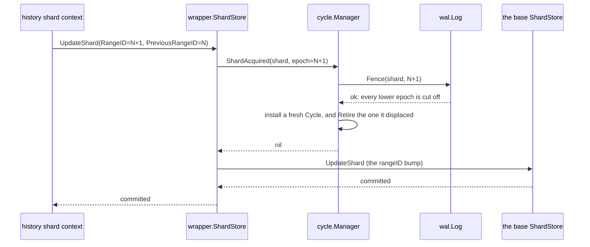
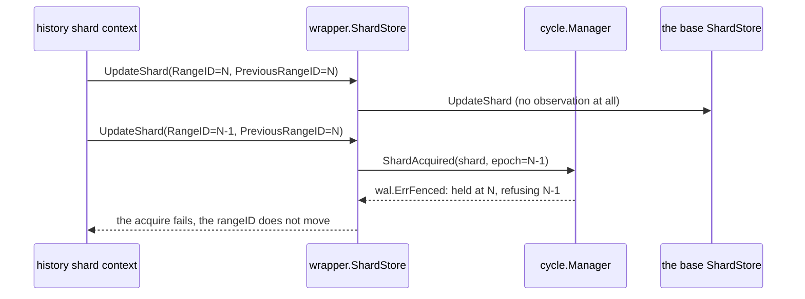
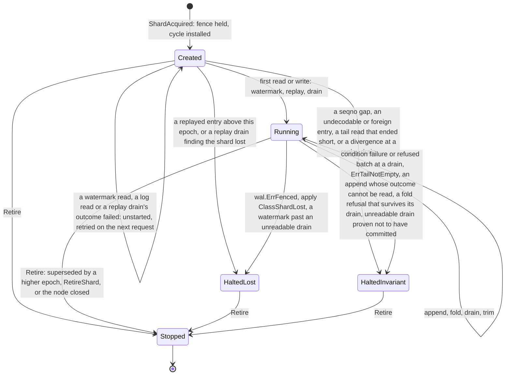
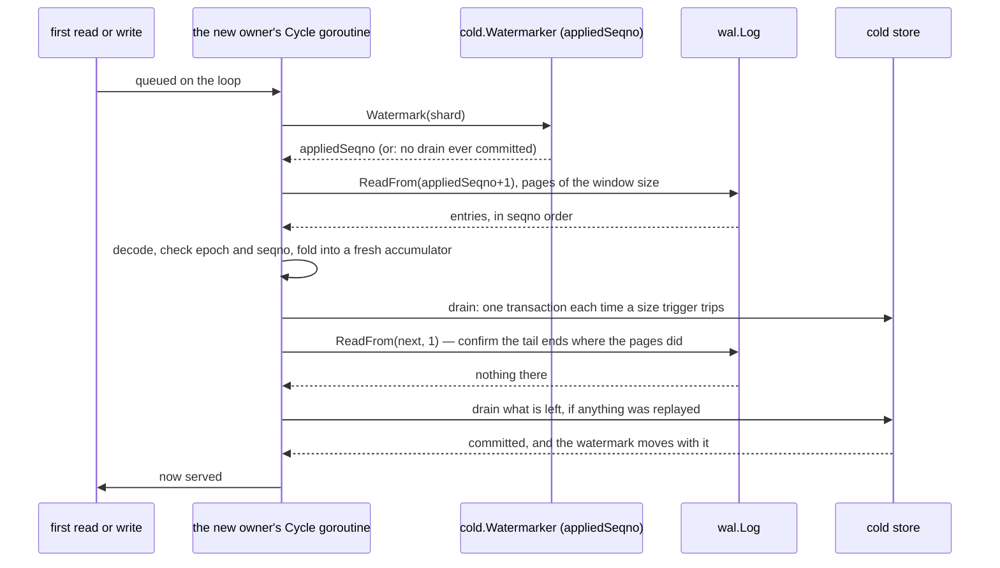
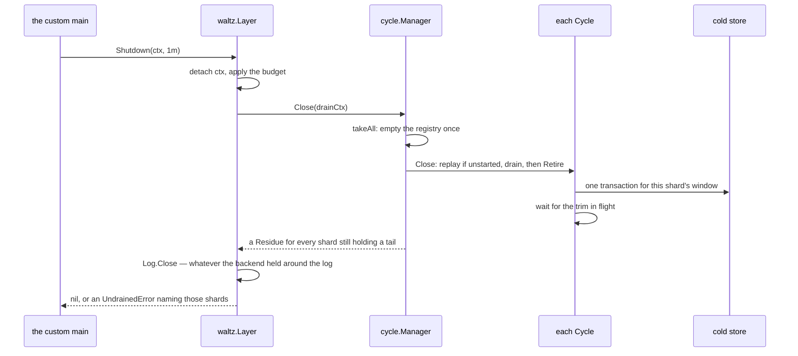

# When an owner disappears

Suppose a history node acknowledges several workflow mutations and then loses power. The cold store
does not contain those mutations yet, and the process that held them in memory is gone. The
acknowledgements must still be true.

The durable log keeps the entries, but durability alone is not recovery. A second node must take
over the shard without letting the failed owner come back and write beside it. It must start just
above the cold store's watermark (`appliedSeqno`, the highest seqno a committed drain contains),
read the retained log entries, and apply or settle them. If what it reads contradicts the
assumptions safe replay rests on, it must stop. That gives four mechanisms:

* an *epoch* (`wal.Epoch`) fences every previous owner out of the log;
* a new *cycle* (`cycle.Cycle`, the owner's in-process lifetime for the shard) reads the watermark
  and replays the tail above it;
* a cycle that finds it has lost ownership halts, and its successor recovers from the retained log;
* an invariant violation also halts, for a different reason, and keeps the log for investigation.

The sections below follow a cycle through its life: acquisition, the epoch, the cycle's states,
replay, halts, stopping and trim. The write path is [chapter 05](05-write-path.md), the reads a
halted shard answers are [chapter 07](07-read-path.md), and what an operator does about a halt is
[chapter 09](09-operations.md).

## 1. First exclude the failed owner

A shard has one owner because a workflow is a sequential machine. If two nodes write one run, both
read the same state, both commit a successor, and the second overwrites the first. Two owners would
also hand out task ids from their own allocations, and a task row is found and deleted by its id, so
two rows could share one id.

Before a successor reads the inherited tail, it must make further appends by the predecessor
impossible. Otherwise replay and live writes interleave under two owners, and no watermark can say
whose entries count. This exclusion is *fencing*: a check made where the write lands, not a term
the owner keeps in memory, because the failed owner is often not gone. A collection pause, a swap
or a partition can return a process that knows nothing of its replacement.
[Chapter 13](13-designs-that-were-rejected.md#a-lease-with-a-timer) covers the lease that was
rejected for this reason.

### How the layer learns of an acquire

Nobody tells the layer it owns a shard. Temporal's persistence API has no "acquire" call, and
closing a shard makes no persistence call at all. What the API has is `ShardStore.UpdateShard`,
which the history service sends from two places, with the same shape and two meanings:

| Where it comes from | Shape | Meaning |
|---|---|---|
| the shard context renewing its range (`renewRangeLocked`): on acquire, and whenever the shard exhausts its task-id range | `RangeID = PreviousRangeID + 1` | the shard changing hands or renewing its range: a new epoch |
| the shard's periodic info update (`updateShardInfo`) | `RangeID == PreviousRangeID` | a heartbeat that carries no news |

Comparing the two fields is the whole distinction. It is made in
[`../../wrapper/shard_store.go`](../../wrapper/shard_store.go):

```go
if s.layer != nil && request.RangeID != request.PreviousRangeID {
        if err := s.layer.ShardAcquired(
                ctx, wal.ShardID(request.ShardID), wal.Epoch(request.RangeID),
        ); err != nil {
                return err
        }
}
return s.base.UpdateShard(ctx, request)
```

Two properties of this code matter.

* *Fence first, bump second.* The observer runs before the base store commits the rangeID bump, so
  the log is fenced at the new epoch first. A failed fence fails the acquire without calling the
  base store, and the previous owner's rangeID stays in place for the shard context to retry. This
  keeps the epoch in the log from ever lagging the epoch in the database. If the database moved
  ahead of an unfenced log, two writers would each hold what they believe is the current range.
* *The test is inequality, not "greater than".* A `RangeID` that went backwards is not treated as a
  heartbeat. It reaches the observer and is refused there.

The first diagram shows an acquire end to end, from `UpdateShard` to the rangeID bump.


```mermaid
sequenceDiagram
    participant SC as history shard context
    participant WS as wrapper.ShardStore
    participant MG as cycle.Manager
    participant LOG as wal.Log
    participant BS as the base ShardStore
    SC->>WS: UpdateShard(RangeID=N+1, PreviousRangeID=N)
    WS->>MG: ShardAcquired(shard, epoch=N+1)
    MG->>LOG: Fence(shard, N+1)
    LOG-->>MG: ok: every lower epoch is cut off
    MG->>MG: install a fresh Cycle, and Retire the one it displaced
    MG-->>WS: nil
    WS->>BS: UpdateShard (the rangeID bump)
    BS-->>WS: committed
    WS-->>SC: committed
```

Everything before the base store's arrow happens first. If `Fence` fails, nothing after its answer
happens: the database still says the previous owner holds range `N`, and this node holds no cycle
for the shard.

The second diagram shows the two other shapes of the same call, a heartbeat and a rangeID that went
backwards.


```mermaid
sequenceDiagram
    participant SC as history shard context
    participant WS as wrapper.ShardStore
    participant MG as cycle.Manager
    participant BS as the base ShardStore
    SC->>WS: UpdateShard(RangeID=N, PreviousRangeID=N)
    WS->>BS: UpdateShard (no observation at all)
    SC->>WS: UpdateShard(RangeID=N-1, PreviousRangeID=N)
    WS->>MG: ShardAcquired(shard, epoch=N-1)
    MG-->>WS: wal.ErrFenced: held at N, refusing N-1
    WS-->>SC: the acquire fails, the rangeID does not move
```

The heartbeat never reaches the layer, so a shard that is merely alive costs the layer nothing. The
refusal happens in `Manager.ShardAcquired`, before the log is touched.

### What `Manager.ShardAcquired` does with the epoch it is handed

[`../../cycle/manager.go`](../../cycle/manager.go) takes four cases, in this order:

1. *A cycle is already held at exactly this epoch.* Return `nil`. Fencing is idempotent, and so is
   this: a retried acquire at the same epoch must not throw away a running cycle's window.
2. *A cycle is held at a higher epoch.* Refuse with `wal.ErrFenced`, wrapped in a message naming
   both epochs. This node has already moved on.
3. *Otherwise, fence.* Call `Log.Fence(ctx, shard, epoch)` and return its error unwrapped, because
   the shard's write path type-switches on concrete error types and one `%w` turns a recognised
   outcome into an unknown one.
4. *Then install* a fresh `cycle.New(shard, epoch, …)` in the node's registry (`cycle.Manager`,
   the shards this node holds) and `Retire()` the cycle it displaced, outside the registry's lock
   and without draining it ([§5](#5-halts-the-two-classes), [§6](#6-stopping-a-node)). If the
   node's shutdown has already closed the registry, the install
   is refused with `cycle.ErrClosed` and the fresh cycle is retired unused.

Nothing reaps an idle cycle. An acquire is observable and a close is not, so a cycle is retired
only when a higher epoch supersedes it, when the node shuts down, or when a caller names its epoch
to `Layer.RetireShard`. An idle cycle costs one goroutine and an empty accumulator, and the registry
keeps one cycle per shard, so the cost is bounded by the number of shards the node holds.

---

## 2. Use the ownership token Temporal already has

The layer does not mint its own epoch. `wal.Epoch` is Temporal's `rangeID`, taken from the
`UpdateShard` request and used as the log's fencing token. That identity is invariant
[I11](02-concepts-and-invariants.md#the-invariants).

A second, independent token would be a second thing that can be right while the first is wrong.
Temporal already fences the shard on `rangeID`: the shard context refuses to write under a stale
one, and the store's shard row asserts it. With one number, moved in one place by the acquire
itself, the log's fence and the database's fence cannot disagree.

### An epoch may grow without a change of owner

The history service renews `rangeID` whenever a shard exhausts its task-id range, which happens on
a healthy shard that never changed hands. The range is derived from the counter by a shift,
`nextTaskID = rangeID << RangeSizeBits`, with `RangeSizeBits` set to 20 in the history service's
defaults. So one epoch names a block of 2^20 = 1,048,576 task ids, handed out from memory. Two
owners never hold the same counter value, so they never share a block.

So a growing epoch is not evidence of a failover. The layer treats a renewal exactly like an
acquire: fence, retire the old cycle, and install a fresh one that replays what the old one acked
and had not applied. A renewal alone can leave a tail behind, so the append path may never assume
its tail is empty because it has never lost the shard.

### Epochs must strictly increase

Fencing cannot separate two writers holding the same epoch: both pass the fence and then race for
seqnos. So whoever hands out epochs owes the log a strictly greater epoch on every acquire. Epoch
`0` is not valid (`wal.ErrZeroEpoch`); it is how an absent fence reads, "nobody owns this".

Temporal meets this obligation with a conditional write. An acquire reads the shard row and writes
a value one greater, and the write requires the row to still hold the value that was read.
Temporal's SQL store takes a write lock on the shard row and compares it inside the updating
transaction. Its Cassandra store makes the update conditional on the row still holding
`PreviousRangeID`. Two nodes that both read `N` cannot both install `N+1`: one assertion fails, and
its author learns only that its write did not happen. The server drains its in-flight requests
before it renews, because those requests are conditioned on the number about to move.

The guarantee lives entirely upstream. If that conditional write were weakened to a plain upsert,
fencing would break silently: two holders of one epoch would pass the log's fence and the drain's
epoch assertion alike, and this layer has no metric or assertion that could report it.

### The epoch check at the write boundary

The epoch is checked once more when a write arrives. `cycle.Manager.Write` compares the `rangeID`
the caller wrote under with the epoch this node's cycle holds, and answers `ShardOwnershipLost` if
they differ. Without this check, a write from a shard context that was already fenced out would be
re-stamped with this node's current epoch and accepted. A zero epoch here means "no rangeID": three
of the eight intercepted shapes (`delete`, `delete-current` and `range-complete-tasks`) carry no
such field, and the drain's epoch compare-and-swap fences those instead.

---

## 3. Turn an epoch into one in-process lifetime

A cycle has three states, declared as `cycle.State` in [`../../cycle/cycle.go`](../../cycle/cycle.go):
`StateRunning`, `StateHaltedLost` and `StateHaltedInvariant`, whose `String()` values are `running`,
`halted-lost` and `halted-invariant`. Only `StateRunning` accepts work. A halt is terminal:
`Cycle.halt` returns at once if the cycle is already halted, so the first cause is the one
recorded. The two halted names are also the tag values of the `wal_halts` metric. Only a halt emits
it, so `running` never appears there.

The diagram adds two pseudo-states, `Created` and `Stopped`, to show the whole life of a cycle.


```mermaid
stateDiagram-v2
    [*] --> Created: ShardAcquired: fence held, cycle installed
    Created --> Running: first read or write: watermark, replay, drain
    Created --> Created: a watermark read, a log read or a replay drain's outcome failed: unstarted, retried on the next request
    Created --> HaltedLost: a replayed entry above this epoch, or a replay drain finding the shard lost
    Created --> HaltedInvariant: a seqno gap, an undecodable or foreign entry, a tail read that ended short, or a divergence at a replay drain
    Created --> Stopped: Retire
    Running --> Running: append, fold, drain, trim
    Running --> HaltedLost: wal.ErrFenced, apply ClassShardLost, a watermark past an unreadable drain
    Running --> HaltedInvariant: condition failure or refused batch at a drain, ErrTailNotEmpty, an append whose outcome cannot be read, a fold refusal that survives its drain, unreadable drain proven not to have committed
    Running --> Stopped: Retire: superseded by a higher epoch, RetireShard, or the node closed
    HaltedLost --> Stopped: Retire
    HaltedInvariant --> Stopped: Retire
    Stopped --> [*]
```

`Created` is not a `State` value. It is a running cycle that has not yet read the watermark and
replayed the tail above it (`state.started` is false). Its self-loop is the only recoverable failure
in the diagram: a start whose watermark read or log read failed, or whose replay drain could not
learn its outcome, leaves the cycle unstarted with an empty window, and the next request starts
again from the watermark. `Stopped` is not a `State` value either. A stopped cycle keeps reporting
the state it stopped in, and `Retire` on a running cycle stamps it `halted-lost` on the way out,
because being superseded is what that state means.

### The state that is not a state: a stalled tail

An operator will meet one more condition, and it is not a `State`: a drain whose outcome could not
be read, because reading the watermark itself failed. Halting there would turn a blip into a lost
shard. Instead the drain's seqno becomes a floor on the tail (`tailstate.Tail.Stall`): nothing
settles or commits above it, and writers and readers are refused until a readable watermark ends
the stall. A watermark exactly at the drain's seqno means it committed. Below it, or none recorded,
means it did not, and the shard halts `halted-invariant`. Past it means another owner moved it, and
the shard halts `halted-lost`. Because a stall is a property of the tail, a shard that recovers from
one has nothing to un-halt. [Chapter 05](05-write-path.md#7-failed-drain--the-outcome-could-not-be-read)
has the refusals and why only the age tick heals a stall on a running node.

---

## 4. Then recover the acknowledged tail

Once the new epoch is fenced, the successor can finish the failed owner's work without racing it.
The dead node left entries acknowledged in the log and not applied to the cold store. Nothing is
lost, since invariant I2 says every acknowledged mutation is durable in the log. But the tail must
be applied or settled before the shard can serve again.

Replay is the body of `Cycle.start`, in [`../../cycle/replay.go`](../../cycle/replay.go). It runs
lazily, inside the cycle's own goroutine, on the first request that reaches the shard, read or
write. The diagram follows that first request.


```mermaid
sequenceDiagram
    participant REQ as first read or write
    participant CY as the new owner's Cycle goroutine
    participant WM as cold.Watermarker (appliedSeqno)
    participant LOG as wal.Log
    participant CS as cold store
    REQ->>CY: queued on the loop
    CY->>WM: Watermark(shard)
    WM-->>CY: appliedSeqno (or: no drain ever committed)
    CY->>LOG: ReadFrom(appliedSeqno+1), pages of the window size
    LOG-->>CY: entries, in seqno order
    CY->>CY: decode, check epoch and seqno, fold into a fresh accumulator
    CY->>CS: drain: one transaction each time a size trigger trips
    CY->>LOG: ReadFrom(next, 1) — confirm the tail ends where the pages did
    LOG-->>CY: nothing there
    CY->>CS: drain what is left, if anything was replayed
    CS-->>CY: committed, and the watermark moves with it
    CY->>REQ: now served
```

### The first request is the readiness gate

The request is not refused, and there is no "replaying" flag. It waits on the loop behind the
replay, on its own context. A read triggers replay just as a write does, and must. A read answered
from a cold store the log is ahead of would be stale with nothing to say so. A task page missing a
key is worse: its one caller completes the range it read and acks
past what was missing.

### The end of the tail is confirmed, not inferred

By the contract, `ReadFrom` returning fewer entries than asked means the log ends there. But a
backend limited by response size (a message size, a query response, a driver's row buffer) also
answers short. A replay that took that for the end would serve reads and task pages missing
everything above the cut, having folded only a prefix of the tail, and their callers would ack past
it. The first append would eventually halt the shard on a taken seqno, but by then callers would
have completed pagination over rows they were never shown.

So the loop ends with one more read of a single entry at the seqno it stopped below. An entry found
there halts the shard before it serves anything. The halt class is decided the way it is for every
entry: above this cycle's epoch, somebody took the shard, so it is `halted-lost` and the entry is not
this cycle's to account for; otherwise the entry is charged to the tail and the halt is
`halted-invariant`. The check costs one round trip per acquire.

### Seven rules, entry by entry

The loop applies seven rules to each entry it reads.

1. *An entry above this cycle's epoch means this cycle is the zombie.* A successful fence cuts off
   every lower epoch, so an entry at a higher epoch was written by an owner that fenced after this
   one. The cycle halts `halted-lost` before writing a row. Replay checks this itself rather than
   relying on the apply transaction's epoch compare-and-swap, because the fence and the rangeID bump
   are not atomic: in the gap between them a zombie's compare-and-swap still succeeds. The halt's
   cause carries the exported constant `cycle.FencedAway`, so metrics and logs can tell a fence
   found during replay from one found on append.
2. *An unexpected seqno halts `halted-invariant`.* Gap-freedom is guarantee 4 of the log contract,
   and a log with a hole is not the log these invariants are written against.
3. *A decode failure is fatal to the replay.* The cause may be a newer codec, or a task category
   this node has no registration for. The entry is already acked, so the only option is to stop. An
   entry that decodes but names a different shard halts the same way. This is why
   `cycle.Deps.Registry` is required and `NewManager` refuses a nil one with `cycle.ErrNoRegistry`:
   a node decoding with no task-category registry would recover nothing, silently, until its first
   failover.
4. *An entry that rules 2 and 3 stop on is still added to the tail* (`Cycle.strand`), so the tail
   is non-empty and every read on the shard is refused rather than passed to a cold store that
   lacks the entry. Those stops happen before `Cycle.accept`, so nothing else would add it. Only
   non-emptiness matters: entries above the stop were never read, so the tail's count means nothing
   here.
5. *The acknowledgement is the answer, except for provisional entries.* Normally every assertion is
   verified before the entry becomes durable, so a condition failure at apply time is a real
   divergence and halts the shard. In sync mode the drain answers the caller, so the entry is acked
   before its condition is decided, and the writer marks it *provisional*. Replay drops a
   provisional entry whose condition fails instead of halting: it settles the seqno with the
   watermark held back and counts `wal_replay_dropped_entries`. Only the writer can mark it, because
   afterwards both kinds look the same: acknowledged, above the watermark, not applied. The flag's
   zero value means "verified", so an unmarked entry is never dropped silently. A drain is
   all-or-nothing, so a provisional entry travels alone: the window in front of it is drained first,
   then the entry by itself, both under `trigger="replay"`.
6. *An entry the previous owner already settled replays to the same outcome.* `resolved` lived only
   in that process's memory, so the successor cannot tell a settled no-op from work, and need not.
   An entry settled above the watermark had a failed condition and an answered caller, which only
   sync mode produces, so it is provisional: replay drains it alone, it fails again against the same
   state, and it is dropped, at the cost of a decode and a transaction that writes no row. So
   `resolved` may die with the process, while `commitSeqno` is readable from the log and
   `appliedSeqno` from the cold store.
7. *Transactions are cut by the two size triggers only*, `Mutations` and `Bytes`, the same pair a
   running cycle drains on, so a replayed transaction is the size of an ordinary one. The age
   trigger is not consulted, since every entry is already as old as the incident. Replay has no
   bound of its own: invariant I10 bounds what a running cycle acks, and a tail that somehow exceeds
   it must still be replayed, or the shard is unrecoverable.

### What replay does not need

* *No hole tracking.* `Trim` moves the log's lower end and `Append` its upper end, and nothing puts
  a hole in the middle. So replay is a straight read of `(appliedSeqno, commitSeqno]` with a running
  expectation of the next seqno, with no bitmap and no per-entry acknowledgement state.
* *No re-running of the condition authority.* Its callers are all gone.
* *No rebuilding of a window the previous owner drained.* An entry below the watermark is a row the
  cold store already holds.
* *No re-deriving an unknown outcome from base row versions.* The watermark is read first. A
  version advances once per committed transaction, not per seqno, so it cannot name what is missing
  ([chapter 04](04-contracts.md#the-recovery-rule-the-watermark-exists-for)).

### An abandoned attempt gives back what it took

A replay that fails without halting, for example because a log read errored, leaves the cycle
unstarted, and everything the attempt moved is dropped with it. The accumulator and window are
replaced, the tail is floored (`Tail.Floor` resets every position of the tail to the watermark and
its byte count to zero), and the attempt's counters are a value the cycle never adopts. A retry reads the
watermark again and re-acks everything above it, so keeping any of this would count one incident
once per attempt. Invariant I10 reads the tail before a write is queued, so the first symptom of
such a leak would be a healthy shard refusing its writers.

Halting inside a replay is the opposite case. No further attempt follows, so the tail stays where it
is, because it is the evidence reads are refused on, and the counters stay with it. One caller
breaks this today. `Cycle.Close` runs the start again over such a cycle, which floors the tail
before it replays. A shutdown whose second log read fails therefore leaves the tail empty, and a
mutable-state read then passes through to a cold store missing those entries. This is an open
defect in [the durability ledger](../../DURABILITY.md).

---

## 5. Halts: the two classes

A cycle stops for good in one of two states, and the difference decides what happens next. Treating
them alike would turn an ordinary failover into an incident, or a correctness incident into an
endless failover loop. A halted cycle never leaves the state it halted in. Both halts keep the log,
because the entries are the evidence, and both stop trimming, because the log is no longer the
halted cycle's to shorten.

| | `halted-lost` | `halted-invariant` |
|---|---|---|
| What it means | the shard was fenced away: another node owns it | a divergence this process owns |
| Reached by | `wal.ErrFenced` on an append, `apply.ClassShardLost` at a drain, a replayed entry above this cycle's epoch, a watermark found *past* an unreadable drain's own seqno, or `Retire` on a running cycle, which emits nothing (a rangeID renewal, `Layer.RetireShard` and a graceful shutdown all retire this way) | a condition failure at a drain, `cycle.ErrTailNotEmpty`, a decode, seqno or foreign-shard violation at replay, a replayed tail read that ended short, an unreadable drain proven not to have committed, an append whose outcome could not be read back, an acked entry the window will not fold, a drain apply refused (`apply.ClassRefused`), or any apply class nobody enumerated |
| Who continues the work | the next owner: it fences, replays the tail and applies it | the halted cycle never resumes. The layer asks nobody to take over, although Temporal may independently acquire a higher rangeID, install a successor and make it replay the same tail |
| At the store boundary | translated to `ShardOwnershipLost`, which is what the shard's write path matches to re-acquire | returned unchanged rather than translated to ownership-lost, so this error does not request a failover; a separate background acquisition at a higher rangeID still supersedes the halted cycle |
| Operator response | none: this is fencing working | page: [runbook (b)](09-operations.md#b-a-shard-halted--and-which-of-the-two-classes) |

### Never sum the two

The two classes are opposites: one is the design's own failover firing, the other is a correctness
incident. A single `wal_halts` line with no `state` breakdown pages for normal failovers and buries
the one alert that matters. That is why the metric is tagged with the state's own name.

### What a halt does not tell you

There is no consensus here and no group membership, so fencing limits what a stale owner can do,
not what it believes. Two nodes may both be certain they own a shard, for arbitrarily long, and the
displaced one is never told. It finds out when it writes, and only if it writes. A stale owner is
not stopped from running; its writes are refused. So the absence of `wal_halts{state="halted-lost"}` on
a node is not evidence that the node still owns its shards. It only shows the node has not tried to
write under a superseded epoch.

### Only one class asks for a failover

`storeError` in [`../../cycle/decide.go`](../../cycle/decide.go) maps only `StateHaltedLost` to
`ShardOwnershipLost`. Converting `halted-invariant` too would hand a divergence this process owns
to the next owner as an ordinary failover, and that owner would fence, replay the same entries and
meet the same assertion. Leaving the error unrecognised does not revive the cycle or request a
handoff. Nor does it pin ownership: if Temporal independently acquires a higher rangeID,
`ShardAcquired` installs a fresh cycle and retires this one, and the successor replays the same
evidence. Capture the log promptly rather than assuming the halted cycle will keep it.

### What a halted shard answers a reader

A mutable-state read, or a branch page, which routes as one, passes through to the cold store on an
empty tail in either halt and is refused on a non-empty one. The refusal is `ShardOwnershipLost`
under `halted-lost`, and the halt's own error, cause included, under `halted-invariant`. A task
read is refused at either halt whatever the tail holds: its one caller would complete a range it
was handed short, and a page the cold store answers carries that store's own token, which the
replacing cycle cannot read. [Chapter 07](07-read-path.md#2-routing-a-read-and-drainonread) has the
routing.

Two of this chapter's transitions emit something specific to the lifecycle. Entering either halt
counts `wal_halts{state="halted-lost"|"halted-invariant"}` and logs a `WARN apply cycle halted` line
carrying the cause. A retire leaves the cycle reporting `halted-lost` and emits neither. A replay
that found entries emits `wal_replayed_entries` once it finishes, and `wal_replay_dropped_entries`
for the provisional entries it dropped. Every other series, and where each sits on the write path,
is in [Chapter 10](10-metrics.md#5-where-each-series-sits-on-the-write-path).

---

## 6. Stopping a node

A cycle stops in one of three ways, and they are not interchangeable.

### `Cycle.Retire()`: stop without draining

When the epoch has been fenced out, what the cycle holds is not its own to apply, so the entries
stay in the log for the next owner. `Retire` stamps a running cycle `halted-lost`, stops the loop
and waits for it to finish, waits for any trim in flight, and returns what the cycle counted.
Stopping and counting are one operation, because before the stop the loop can still count and after
it there is no loop to ask.

`Layer.RetireShard(shard, epoch)` does at layer level what `Cycle.Retire` does. It is named apart
from `Shutdown` because it writes nothing, leaving the shard as a crashed process would. It takes the epoch
because its caller's shard may have been reacquired since. A cleanup running late names the
acquisition it held, and a mismatch retires nothing rather than stopping the owner that superseded
it. It does not remove the cycle from the registry. The cycle stays the shard's, so `ShardStats` and
`Totals` keep answering for a shard whose tail is still acked entries in the log. A removed shard
would answer as one nobody holds, and a caller would read that zero as "nothing stranded".

### `Cycle.Close(ctx)`: drain, then retire

This is the shutdown path. A cycle no request has reached yet replays its tail first, so the drain
has it to apply. A halted cycle drains nothing and returns its halt. A cycle already retired
answers nil, having nothing left to drain. The exception is a cycle that halted inside its replay
([§4](#an-abandoned-attempt-gives-back-what-it-took)): it never started, so `Close` replays it
again, flooring its tail first. If that replay cannot read the log, the tail is left empty and
`Close` returns the read's error instead of the halt. This is the open entry in
[the durability ledger](../../DURABILITY.md).

### `Layer.Shutdown(ctx, budget)`: the node's stop

`Shutdown` puts `budget` on a context detached from the caller's cancellation and calls
`Manager.Close`. That empties the registry in one step and closes every cycle it took, in sequence:
one transaction per shard, plus a replay drain first for a shard that has not replayed yet. The
layer closes the log after that. A drain that does not commit is logged
(`WARN apply cycle: the shutdown drain did not commit`) and does not stop the rest. waltz applies
no default budget; the call sites here pass 30 seconds or a minute. Why the context is detached,
and the order a custom main must follow, are in [chapter 09](09-operations.md#2-start-and-stop-order).

Emptying the registry also closes it. A later acquire is refused with `cycle.ErrClosed`, because a
fresh cycle would acknowledge writes into a log nobody will drain. Those entries would survive for
the next owner, but no `cycle.Residue` would name them, and a caller taking the layer out relies on
`Shutdown` answering nil. The fence that acquire took stays standing; a fence changes ownership and
nothing else.

The diagram shows a shutdown from the custom main's call to the residues.


```mermaid
sequenceDiagram
    participant Main as the custom main
    participant L as waltz.Layer
    participant MG as cycle.Manager
    participant CY as each Cycle
    participant CS as cold store
    Main->>L: Shutdown(ctx, 1m)
    L->>L: detach ctx, apply the budget
    L->>MG: Close(drainCtx)
    MG->>MG: takeAll: empty the registry once
    MG->>CY: Close: replay if unstarted, drain, then Retire
    CY->>CS: one transaction for this shard's window
    CY->>CY: wait for the trim in flight
    MG-->>L: a Residue for every shard still holding a tail
    L->>L: Log.Close — whatever the backend held around the log
    L-->>Main: nil, or an UndrainedError naming those shards
```

Because the registry is emptied in one step, a second `Close` finds nothing to drain. One ordering
constraint sits outside the diagram and is the caller's: the cold store the applier writes through
must still be open when `Shutdown` runs. The server closes its own data store factory on the way
down, so a layer whose applier rides that factory would drain into a closed client.

### A node killed without a graceful stop

A killed node leaves whatever its windows held: entries acked into the log, above the watermark,
unapplied. Nothing cleans that up in place. There is no reaper, no background sweeper and no repair
tool. The next owner of each shard cleans it up when it first acquires the shard and is first asked
for anything: fence, watermark, replay, drain ([§4](#4-then-recover-the-acknowledged-tail)). That is
the whole recovery story, and it is why leaving a tail behind is not a hazard.

A drain the shutdown budget cuts short is the same situation: not data loss, but a tail the next
owner picks up, at the cost of a read loop and a transaction before it serves its first request.

---

## 7. Trim, as part of the lifecycle

Trimming deletes log entries the cold store already holds, up to the committed watermark, with no
safety lag, since recovery reads the watermark rather than the log. A backend's reads get slower as
its log grows, so trimming is part of the latency budget.

* *The cadence is whichever trips first:* `cycle.Config.TrimEvery` drains since the last trim (16
  by default) or `cycle.Config.TrimAfter` elapsed (60 s by default). Both are read at the decision,
  so they may change under a held shard. The decision is taken only when a drain commits, so an
  idle shard does not trim until its next drain. A trim per drain would cost a log transaction per
  drain for no gain. [Chapter 08](08-configuration.md) has the keys.
* *It runs beside the loop.* `cycle/trim` is its own package so that a stuck log cannot stop a shard
  from acking and applying. One trim runs at a time. A cadence that comes due during a trim is
  skipped, not queued: the next trim takes a watermark that has moved further.
* *Storage pressure overrides the cadence.* While the log reports `wal.PressureDrain` or above for
  the shard ([chapter 04](04-contracts.md#walpressuresource--the-optional-pressure-face)), every
  committed drain forces a trim to its watermark (`Trimmer.Force`). So does an acquire once its
  replay is done, since the previous owner's applied entries are owed back before this cycle
  appends, and so does the age tick on a started cycle with an empty window, since no commit is
  coming. A forced trim that finds one in flight queues a single follow-up, coalesced to the highest
  watermark asked for. A force for a watermark already reached, or being reached, schedules nothing.
* *A failed trim halts nothing.* It is logged and counted in `wal_trims{outcome="started"|"failed"}`,
  the only series that reports it. A cadenced trim is retried at the next cadence, a forced one at
  the next force while the pressure lasts. Two outcomes are counted because a run whose every trim
  failed would otherwise look like one whose cadence never fired.
* *A halted cycle trims nothing.* Under `halted-lost` the log belongs to the next owner; under
  `halted-invariant`, to whoever investigates.
* *Retiring waits for the trim.* `Cycle.Retire` calls the trimmer's `Wait` after the loop is gone, so
  the backend outlives its last call and a trim committing on the way out is inside the count.

---

## Summary

A shard changes hands when Temporal bumps its `rangeID`. The layer sees an `UpdateShard` whose
`RangeID` differs from `PreviousRangeID`, fences the log at that epoch before the bump commits, and
installs a fresh cycle. The epoch is the `rangeID`, so the two fences cannot disagree, and
Temporal's conditional write on the shard row keeps two owners from sharing one.

On its first request the new cycle reads the watermark, replays the log above it and confirms where
the tail ends. Anything that contradicts safe replay halts the shard before it serves. Sync mode's
provisional entries are the one kind replay may drop.

`halted-lost` is fencing working, and the next owner replays. `halted-invariant` is a divergence
this process owns, and it pages. Both keep the log and stop trimming. A stopped, killed or
short-budgeted node leaves a tail the next owner replays.

One known exception is open in the durability ledger: `Cycle.Close` over a cycle halted inside
replay can leave the tail empty, so a mutable-state read is answered from a cold store that lacks an
acked entry, until a successor replays the log, which still holds it.

Trim deletes what the watermark covers, every 16 drains or 60 seconds, forced under storage pressure,
never on a halted cycle.

[Chapter 07](07-read-path.md) turns to reads: how a running cycle answers from the cold store and
the window together, and what a replaying or halted shard answers instead.

## Where this lives in the code

* [`../../wrapper/shard_store.go`](../../wrapper/shard_store.go) — the six-method shard
  store, five transits, and `UpdateShard`: the renew-vs-heartbeat comparison and the order that puts
  the fence before the rangeID bump.
* [`../../mutation/kinds.go`](../../mutation/kinds.go) — which of the eight shapes carry a
  rangeID and which three are fenced by the drain instead.
* [`../../cycle/manager.go`](../../cycle/manager.go) — `ShardAcquired`, the four cases it
  takes an epoch through, `Totals` (including `Halted`, one line per non-running shard) and `Close`.
* [`../../cycle/held.go`](../../cycle/held.go) — the registry's map, its one mutex, and
  why no method of it may call into a cycle.
* [`../../cycle/cycle.go`](../../cycle/cycle.go) — `State` and its three values, `halt`,
  `Retire`, `Close`, the age tick, and `Defaults()` with the shipped cadences.
* [`../../cycle/replay.go`](../../cycle/replay.go) — the replay loop, the zombie check
  and `FencedAway`.
* [`../../cycle/decide.go`](../../cycle/decide.go) — `storeError` (which halt becomes
  `ShardOwnershipLost` and which deliberately does not), `writeRefused` and the settlement rules.
* [`../../cycle/trim/trim.go`](../../cycle/trim/trim.go) — the cadence, the single trim
  in flight, and the two counters.
* [`../../cold/cold.go`](../../cold/cold.go) — `cold.Watermarker`, the read a recovering owner makes
  before anything else, and why the watermark must commit inside the drain's own transaction.
* [`../../cycle/tailstate/tailstate.go`](../../cycle/tailstate/tailstate.go) — `Tail.Stall`, the
  floor a drain with no readable outcome leaves, and `Tail.Resolve`, which ends it.
* [`../../waltz.go`](../../waltz.go) — `Layer.Shutdown` and its detached context, and
  `RetireShard` beside it.
* [`../../wal/wal.go`](../../wal/wal.go) — `Epoch` (identical to `rangeID`, invariant
  I11), `Fence`, the five guarantees, and `ErrFenced` / `ErrAlreadyWritten` / `ErrZeroEpoch`.
