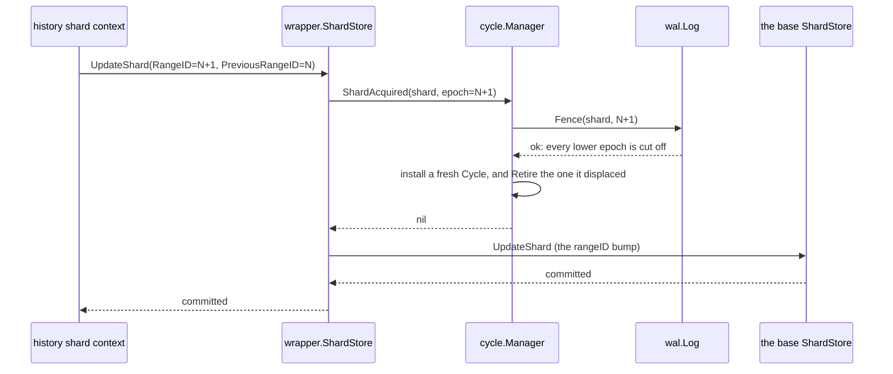
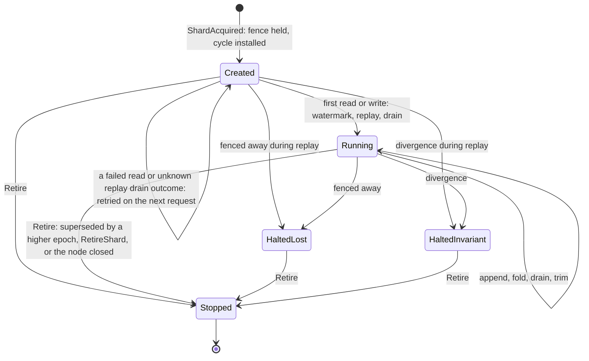
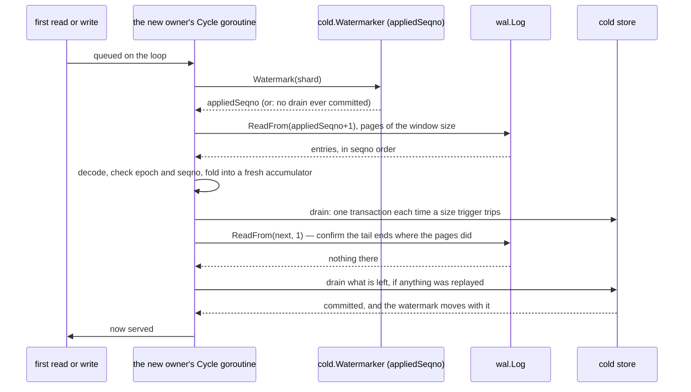

# When an owner disappears

Suppose a history node acknowledges several workflow mutations and then loses power. The cold store
does not have them yet, and the process that held them in memory is gone. The acknowledgements must
still be true.

The durable log keeps the entries, but durability is not recovery. A second node must take over the
shard without letting the failed owner write beside it, start just above the cold store's watermark
(`appliedSeqno`, the highest seqno a committed drain contains), and apply or settle the retained
entries, stopping if what it reads contradicts safe replay. An *epoch* (`wal.Epoch`) fences the old
owner out; a *cycle* (`cycle.Cycle`, one owner's in-process lifetime for the shard) replays the tail.
The sections follow a cycle through its life: acquisition, the epoch, the cycle's states, replay,
halts, stopping and trim.

## 1. First exclude the failed owner

A shard has one owner because a workflow is a sequential machine: if two nodes write one run, both
commit a successor of the same state and the second overwrites the first. Two owners would also
allocate task ids separately, so two task rows could share the id they are found and deleted by.

So before a successor reads the inherited tail, it must make further appends by the predecessor
impossible, or no watermark can say whose entries count. This is *fencing*: a check made where the
write lands, not a term the owner keeps in memory, because a collection pause, a swap or a partition
can return a failed owner that knows nothing of its replacement
([chapter 13](13-designs-that-were-rejected.md#a-lease-with-a-timer) has the rejected lease).

### How the layer learns of an acquire

Temporal's persistence API has no "acquire" call, and closing a shard makes no persistence call at
all. The history service sends `ShardStore.UpdateShard` from two places, with two meanings:

| Sent by | Shape | Meaning |
|---|---|---|
| the range renewal (`renewRangeLocked`): on acquire, and whenever the shard exhausts its task-id range | `RangeID = PreviousRangeID + 1` | a new epoch |
| the periodic info update (`updateShardInfo`) | `RangeID == PreviousRangeID` | a heartbeat |

[`../../wrapper/shard_store.go`](../../wrapper/shard_store.go) calls the layer's `ShardAcquired` when
`RangeID != PreviousRangeID`, and the base store's `UpdateShard` only if that succeeds:

* *Fence first, bump second.* The log's epoch never lags the database's; a database ahead of an
  unfenced log would give two writers each a range they believe current.
* *The test is inequality, not "greater than".* A heartbeat never reaches the layer; a `RangeID`
  that went backwards is not a heartbeat, and is refused (case 2 below).

Figure: an acquire.

```mermaid
sequenceDiagram
    participant SC as history shard context
    participant WS as wrapper.ShardStore
    participant MG as cycle.Manager
    participant LOG as wal.Log
    participant BS as the base ShardStore
    SC->>WS: UpdateShard(RangeID=N+1, PreviousRangeID=N)
    WS->>MG: ShardAcquired(shard, epoch=N+1)
    MG->>LOG: Fence(shard, N+1)
    LOG-->>MG: ok: every lower epoch is cut off
    MG->>MG: install a fresh Cycle, and Retire the one it displaced
    MG-->>WS: nil
    WS->>BS: UpdateShard (the rangeID bump)
    BS-->>WS: committed
    WS-->>SC: committed
```

If `Fence` fails, the acquire fails without calling the base store: the database still gives the
previous owner range `N`, the shard context retries, and this node holds no cycle.

### What `Manager.ShardAcquired` does with the epoch it is handed

[`../../cycle/manager.go`](../../cycle/manager.go) takes four cases, in order:

1. *A cycle is held at exactly this epoch.* Return `nil`: a retried acquire must not throw away a
   running cycle's window.
2. *A cycle is held at a higher epoch.* Refuse with `wal.ErrFenced`, wrapped in a message naming
   both epochs, before the log is touched; the rangeID does not move.
3. *Otherwise, fence.* Return `Log.Fence(ctx, shard, epoch)`'s error unwrapped: the shard's write
   path type-switches on concrete error types, and one `%w` turns a recognised outcome into an
   unknown one.
4. *Then install* a fresh `cycle.New(shard, epoch, …)` in the node's registry (`cycle.Manager`,
   the shards this node holds) and `Retire()` the displaced cycle, outside the registry's lock and
   without draining it ([§6](#6-stopping-a-node)). If shutdown has closed the registry, the install
   is refused with `cycle.ErrClosed` and the fresh cycle is retired unused.

Nothing reaps an idle cycle, because a close is not observable: a cycle is retired only when a
higher epoch supersedes it, the node shuts down, or a caller names its epoch to
`Layer.RetireShard`. An idle cycle costs one goroutine and an empty accumulator.

---

## 2. Use the ownership token Temporal already has

`wal.Epoch` is Temporal's `rangeID`, taken from the `UpdateShard` request (invariant
[I11](02-concepts-and-invariants.md#the-invariants)). Temporal already fences the shard on
`rangeID`: the shard context refuses to write under a stale one, and the store's shard row asserts
it. One number, moved by the acquire itself, keeps the log's fence and the database's in agreement.

### An epoch may grow without a change of owner

A shard that exhausts its task-id range renews `rangeID` without changing hands. Task ids are
`nextTaskID = rangeID << RangeSizeBits`, with `RangeSizeBits` 20 in the history service's
defaults, so one epoch names a block of 2^20 = 1,048,576 task ids handed out from memory, and two
owners never share a block. A growing epoch is therefore no evidence of a failover, and the layer
treats a renewal exactly like an acquire: fence, retire the old cycle, install a fresh one that
replays the old one's unapplied tail. The append path may never assume its tail is empty because it
never lost the shard.

### Epochs must strictly increase

Two writers holding one epoch both pass the fence and race for seqnos, so every acquire owes the log
a strictly greater epoch. Epoch `0` is invalid (`wal.ErrZeroEpoch`); it is how an absent fence
reads.

Temporal meets this with a conditional write: an acquire writes the shard row one greater on
condition it still holds what was read (the SQL store locks the row and compares inside the
transaction; the Cassandra store conditions on `PreviousRangeID`), so of two nodes that both read
`N`, only one installs `N+1`. The server drains its in-flight requests before it renews, because
they are conditioned on the number about to move. The guarantee lives entirely upstream: weakened
to a plain upsert, two holders of one epoch would pass the log's fence and the drain's epoch
assertion alike, and nothing in this layer could report it.

### The epoch check at the write boundary

`cycle.Manager.Write` answers `ShardOwnershipLost` if the `rangeID` the caller wrote under differs
from its cycle's epoch; otherwise a write from a fenced-out shard context would be re-stamped with
the current epoch and accepted. A zero epoch here means "no rangeID": three of the eight intercepted
shapes (`delete`, `delete-current` and `range-complete-tasks`) carry none, and the drain's epoch
compare-and-swap fences those instead.

---

## 3. Turn an epoch into one in-process lifetime

A cycle has three states (`cycle.State` in [`../../cycle/cycle.go`](../../cycle/cycle.go)):
`StateRunning`, `StateHaltedLost` and `StateHaltedInvariant`, printed `running`, `halted-lost` and
`halted-invariant`; the two halted names are the tag values of `wal_halts`. Only `StateRunning`
accepts work. A halt is terminal and the first cause is the one recorded (`Cycle.halt` returns at
once on a halted cycle).

Figure: the life of a cycle, with two pseudo-states, `Created` and `Stopped`.

```mermaid
stateDiagram-v2
    [*] --> Created: ShardAcquired: fence held, cycle installed
    Created --> Running: first read or write: watermark, replay, drain
    Created --> Created: a failed read or unknown replay drain outcome: retried on the next request
    Created --> HaltedLost: fenced away during replay
    Created --> HaltedInvariant: divergence during replay
    Created --> Stopped: Retire
    Running --> Running: append, fold, drain, trim
    Running --> HaltedLost: fenced away
    Running --> HaltedInvariant: divergence
    Running --> Stopped: Retire: superseded by a higher epoch, RetireShard, or the node closed
    HaltedLost --> Stopped: Retire
    HaltedInvariant --> Stopped: Retire
    Stopped --> [*]
```

Neither pseudo-state is a `State` value. `Created` is a running cycle that has not yet replayed
(`state.started` is false). Its self-loop is the only recoverable failure in the diagram: a failed
watermark or log read, or a replay drain whose outcome is unknown, leaves the cycle unstarted with
an empty window, and the next request starts again from the watermark. A `Stopped` cycle keeps
reporting the state it stopped in; `Retire` stamps a running one `halted-lost`
([§6](#6-stopping-a-node)). [§5](#5-halts-the-two-classes) lists every cause of each halt.

### The state that is not a state: a stalled tail

One more condition is not a `State`: a drain whose outcome is unknown because the watermark read
failed. Halting would turn a blip into a lost shard, so the drain's seqno becomes a *floor* on the
tail (`tailstate.Tail.Stall`): nothing above it settles or commits, and writers and readers are
refused until a readable watermark ends the stall. That watermark is read by
[the recovery rule](04-contracts.md#the-recovery-rule-the-watermark-exists-for), and the two
answers that do not mean "committed" halt the shard as §5's table lists. A shard that recovers
from a stall has nothing to un-halt.
[Chapter 05](05-write-path.md#7-failed-drain--the-outcome-could-not-be-read) has the refusals and
why only the age tick heals a stall on a running node.

---

## 4. Then recover the acknowledged tail

Once the new epoch is fenced, the successor can finish the failed owner's work without racing it:
the acknowledged entries are durable in the log (invariant I2) and must be applied or settled before
the shard serves again. Replay is the body of `Cycle.start`, in
[`../../cycle/replay.go`](../../cycle/replay.go), run lazily in the cycle's own goroutine on the
first request that reaches the shard, read or write.

```mermaid
sequenceDiagram
    participant REQ as first read or write
    participant CY as the new owner's Cycle goroutine
    participant WM as cold.Watermarker (appliedSeqno)
    participant LOG as wal.Log
    participant CS as cold store
    REQ->>CY: queued on the loop
    CY->>WM: Watermark(shard)
    WM-->>CY: appliedSeqno (or: no drain ever committed)
    CY->>LOG: ReadFrom(appliedSeqno+1), pages of the window size
    LOG-->>CY: entries, in seqno order
    CY->>CY: decode, check epoch and seqno, fold into a fresh accumulator
    CY->>CS: drain: one transaction each time a size trigger trips
    CY->>LOG: ReadFrom(next, 1) — confirm the tail ends where the pages did
    LOG-->>CY: nothing there
    CY->>CS: drain what is left, if anything was replayed
    CS-->>CY: committed, and the watermark moves with it
    CY->>REQ: now served
```

### The first request is the readiness gate

There is no "replaying" flag: the request waits on the loop behind the replay, on its own context.
A read triggers replay as a write does, because a read answered from a cold store the log is ahead
of is stale with nothing to say so, and a task page missing a key is worse: its one caller
completes the range it read and acks past what was missing.

### The end of the tail is confirmed, not inferred

By the contract, a short `ReadFrom` means the log ends there. But a backend limited by response size
(a message size, a query response, a driver's row buffer) also answers short, and a replay that took
that for the end would serve pages missing everything above the cut; the first append would halt the
shard on a taken seqno, but only after callers had paginated past rows they were never shown. So the
loop ends with one more single-entry read at the seqno it stopped below, one round trip per acquire.
An entry found there halts the shard before it serves anything: `halted-lost` if the entry is above
this cycle's epoch, otherwise `halted-invariant` with the entry charged to the tail.

### Seven rules, entry by entry

1. *An entry above this cycle's epoch means this cycle is the zombie.* A successful fence cuts off
   every lower epoch, so a later owner wrote the entry, and the cycle halts `halted-lost` before
   writing a row. Replay checks this itself rather than relying on the drain's epoch
   compare-and-swap, because the fence and the rangeID bump are not atomic and between them a
   zombie's compare-and-swap still succeeds. The halt's cause carries the exported constant
   `cycle.FencedAway`, which tells a fence found during replay from one found on append.
2. *An unexpected seqno halts `halted-invariant`.* Gap-freedom is guarantee 4 of the log contract.
3. *A decode failure halts `halted-invariant`*, and so does an entry naming a different shard. The
   cause may be a newer codec or an unregistered task category; the entry is already acked, so the
   only option is to stop. Hence `NewManager` refuses a nil `cycle.Deps.Registry` with
   `cycle.ErrNoRegistry`: a node with no task-category registry would recover nothing, silently,
   until its first failover.
4. *An entry that rules 2 and 3 stop on is still added to the tail* (`Cycle.strand`; those stops
   come before `Cycle.accept`), so every read on the shard is refused rather than passed to a cold
   store that lacks it. Only non-emptiness matters: entries above the stop were never read.
5. *The acknowledgement is the answer, except for provisional entries.* Normally every assertion is
   verified before the entry becomes durable, so a condition failure at apply time is a divergence
   and halts the shard. In sync mode the drain answers the caller, so the entry is acked before its
   condition is decided, and the writer marks it *provisional*. Replay drops a provisional entry
   whose condition fails: it settles the seqno with the watermark held back and counts
   `wal_replay_dropped_entries`. The flag's zero value means "verified", so an unmarked entry is
   never dropped. A drain is all-or-nothing, so a provisional entry travels alone: the window in
   front of it drains first, then the entry by itself, both under `trigger="replay"`.
6. *An entry the previous owner already settled replays to the same outcome.* `resolved`
   ([chapter 02](02-concepts-and-invariants.md)'s middle position, between `appliedSeqno` and
   `commitSeqno`) lived only in the previous owner's memory. It need not be recovered: an entry
   settled above the watermark had a failed condition and an answered caller, which only sync mode
   produces, so it is provisional, and drained alone it fails again and is dropped, at the cost of a
   decode and a transaction that writes no row.
7. *Transactions are cut by the two size triggers only*, `Mutations` and `Bytes`; the age trigger is
   moot when every entry is as old as the incident. Replay has no bound of its own: invariant I10
   bounds what a running cycle acks, but a tail that exceeds it must still be replayed, or the shard
   is unrecoverable.

### What replay does not need

* *No hole tracking.* `Trim` moves the log's lower end and `Append` its upper end, and nothing puts
  a hole between them, so replay is a straight read of `(appliedSeqno, commitSeqno]`.
* *No condition authority*: its callers are all gone. *Nothing below the watermark*: the cold store
  already holds those rows.
* *No base row versions.* A version advances once per committed transaction, not per seqno, so it
  cannot name what an unknown outcome left missing; the watermark can
  ([chapter 04](04-contracts.md#the-recovery-rule-the-watermark-exists-for)).

### An abandoned attempt gives back what it took

A replay that fails without halting, say on a log read error, leaves the cycle unstarted and drops
everything the attempt moved: the accumulator and window are replaced, the tail is floored
(`Tail.Floor` resets every position to the watermark and the byte count to zero), and the attempt's
counters are never adopted. A retry re-acks everything above the watermark, so anything kept would
be counted once per attempt, and since invariant I10 reads the tail before a write is queued, a
healthy shard would refuse writers.

A halt inside a replay is the opposite: no attempt follows, so the tail and the counters stay as the
evidence reads are refused on. One caller breaks this today: `Cycle.Close` runs the start again over
such a cycle, flooring the tail first. If that second log read fails, the tail is left empty,
`Close` returns the read's error instead of the halt, and a mutable-state read then passes through
to a cold store missing those entries. This is an open defect in
[the durability ledger](../../DURABILITY.md).

---

## 5. Halts: the two classes

A cycle halts for good in one of two states. Treating them alike would turn an ordinary failover
into an incident, or a correctness incident into an endless failover loop. Both keep the log, since
the entries are the evidence, and stop trimming ([§7](#7-trim-as-part-of-the-lifecycle)).

| | `halted-lost` | `halted-invariant` |
|---|---|---|
| What it means | the shard was fenced away: another node owns it | a divergence this process owns |
| Reached by | `wal.ErrFenced` on an append, `apply.ClassShardLost` at a drain, a replayed entry above this cycle's epoch, a watermark found *past* an unreadable drain's own seqno, or `Retire` on a running cycle | a condition failure at a drain, `cycle.ErrTailNotEmpty`, a decode, seqno or foreign-shard violation at replay, a replayed tail read that ended short, an unreadable drain proven not to have committed, an append whose outcome could not be read back, an acked entry the window will not fold, a drain apply refused (`apply.ClassRefused`), or any apply class nobody enumerated |
| Who continues the work | the next owner: it fences, replays the tail and applies it | nobody the layer asks: the cycle never resumes |
| At the store boundary | translated to `ShardOwnershipLost`, which the shard's write path matches to re-acquire | returned unchanged, so it requests no failover |
| Operator response | none: this is fencing working | page: [runbook (b)](09-operations.md#b-a-shard-halted--and-which-of-the-two-classes) |

Entering either halt counts `wal_halts{state="halted-lost"|"halted-invariant"}` and logs a
`WARN apply cycle halted` line carrying the cause; a retire emits neither. Alert on `wal_halts` by
its `state` tag: a line without the breakdown pages for every failover and buries the one alert that
matters. A replay that found entries emits `wal_replayed_entries` once it finishes, and
`wal_replay_dropped_entries` for the provisional entries it dropped; the other series are in
[chapter 10](10-metrics.md#5-where-each-series-sits-on-the-write-path).

### Only one class asks for a failover

`storeError` in [`../../cycle/decide.go`](../../cycle/decide.go) translates `halted-lost` alone,
because a next owner handed a divergence would replay the same entries and meet the same assertion.
The unchanged error does not pin ownership either: if Temporal independently acquires a higher
rangeID, `ShardAcquired` retires the halted cycle and a successor replays the same evidence, so
capture the log promptly rather than assuming the halted cycle keeps it.

### What a halt does not tell you

Fencing limits what a stale owner can do, not what it believes: with no consensus and no group
membership, two nodes may both be certain they own a shard for arbitrarily long, and the displaced
one finds out only if it writes. A node without `wal_halts{state="halted-lost"}` has only not
written under a superseded epoch; it may no longer own its shards.

### What a halted shard answers a reader

A mutable-state read passes through to the cold store on an empty tail in either halt and is refused
on a non-empty one, with `ShardOwnershipLost` under `halted-lost` and the halt's own error under
`halted-invariant`; a task read is refused at either halt whatever the tail holds.
[Chapter 07](07-read-path.md#2-routing-a-read-and-drainonread) has the routing and the reasons.

---

## 6. Stopping a node

### `Cycle.Retire()`: stop without draining

A fenced-out cycle's entries are not its own to apply, so they stay in the log for the next owner.
`Retire` stamps a running cycle `halted-lost` but emits neither `wal_halts` nor the halt's `WARN`
line. It stops the loop and waits for it, waits for any trim in flight, and returns what the cycle
counted.

`Layer.RetireShard(shard, epoch)` does the same at layer level, writing nothing and leaving the
shard as a crashed process would. The epoch guards a late cleanup: if the shard was reacquired
since, the mismatch retires nothing rather than stopping the newer owner. The cycle stays in the
registry, so `ShardStats` and `Totals` keep answering for a tail still acked in the log; a removed
shard would answer zero, which reads as "nothing stranded".

### `Cycle.Close(ctx)`: drain, then retire

This is the shutdown path. A cycle no request has reached yet replays its tail first, so the drain
has it to apply. A halted cycle drains nothing and returns its halt; a retired one answers nil. The
exception, a cycle that halted inside its replay, is the open defect in
[§4](#an-abandoned-attempt-gives-back-what-it-took).

### `Layer.Shutdown(ctx, budget)`: the node's stop

`Shutdown` puts `budget` on a context detached from the caller's cancellation and calls
`Manager.Close`, which empties the registry in one step and closes every cycle it took, in sequence:
one transaction per shard, plus a replay drain first for a shard that has not replayed. A drain that
does not commit is logged (`WARN apply cycle: the shutdown drain did not commit`) and does not stop
the rest. The layer then closes the log and returns nil, or an `UndrainedError` naming every shard
still holding a tail (a `cycle.Residue` each). A second `Close` finds nothing to drain. waltz applies
no default budget; the call sites here pass 30 seconds or a minute. The cold store must still be
open when `Shutdown` runs; why the context is detached, and the order a custom main must follow, are
in [chapter 09](09-operations.md#2-start-and-stop-order).

Emptying the registry also closes it. A later acquire is refused with `cycle.ErrClosed`, because a
fresh cycle would ack writes into a log nobody drains, and no `cycle.Residue` would name them while
the caller relies on `Shutdown` answering nil. The fence that acquire took stays standing.

### A node killed without a graceful stop

A killed node leaves entries acked into the log, above the watermark, unapplied. There is no reaper,
no background sweeper and no repair tool: the next owner of each shard cleans up on its first
request, by fence, watermark, replay and drain ([§4](#4-then-recover-the-acknowledged-tail)). So
neither a killed node nor a drain the shutdown budget cuts short loses data; each leaves a tail the
next owner picks up, at the cost of a read loop and a transaction before its first answer.

---

## 7. Trim, as part of the lifecycle

Trimming deletes log entries up to the committed watermark, with no safety lag, since recovery reads
the watermark rather than the log. A backend's reads slow as its log grows, so trim is part of the
latency budget.

* *The cadence is whichever trips first:* `cycle.Config.TrimEvery` drains since the last trim (16
  by default) or `cycle.Config.TrimAfter` elapsed (60 s by default), both read at the decision, so
  they may change under a held shard. The decision is taken only when a drain commits, so an idle
  shard does not trim. [Chapter 08](08-configuration.md) has the keys, and
  [chapter 14](14-where-the-defaults-came-from.md) why a trim per drain is not the default.
* *It runs beside the loop*, in `cycle/trim`, so a stuck log cannot stop a shard from acking and
  applying. One trim runs at a time; a cadence due during a trim is skipped, not queued, since the
  next trim takes a watermark that has moved further.
* *Storage pressure overrides the cadence.* While the log reports `wal.PressureDrain` or above for
  the shard ([chapter 04](04-contracts.md#walpressuresource--the-optional-pressure-face)), a trim to
  the watermark is forced (`Trimmer.Force`) by:
  * every committed drain;
  * the end of an acquire's replay, since the previous owner's applied entries are owed back before
    this cycle appends;
  * the age tick on a started cycle with an empty window, since no commit is coming.

  A force that finds a trim in flight queues one follow-up, coalesced to the highest watermark asked
  for; a force for a watermark already reached, or being reached, schedules nothing.
* *A failed trim halts nothing.* It is logged and counted in `wal_trims{outcome="started"|"failed"}`,
  the only series that reports it; counting both tells a run whose every trim failed from one whose
  cadence never fired. A cadenced trim is retried at the next cadence, a forced one at the next
  force while the pressure lasts.
* *A halted cycle trims nothing.* Under `halted-lost` the log belongs to the next owner; under
  `halted-invariant`, to whoever investigates.
* *Retiring waits for the trim* (the trimmer's `Wait`, after the loop is gone), so the backend
  outlives its last call and a trim committing on the way out is inside the count.

---

## Summary

A shard changes hands when Temporal bumps its `rangeID`, the epoch. The layer fences the log at it
before the bump commits and installs a fresh cycle; Temporal's conditional write keeps two owners
from sharing one epoch. On its first request the new cycle reads the watermark, replays the log
above it and confirms where the tail ends. Anything that contradicts safe replay halts the shard
before it serves; sync mode's provisional entries are the one kind replay may drop.

`halted-lost` is fencing working, and the next owner replays; `halted-invariant` is a divergence
this process owns, and it pages. Both keep the log and stop trimming. A stopped, killed or
short-budgeted node leaves a tail the next owner replays, except where `Cycle.Close` runs over a
cycle halted inside replay, an open defect. Trim deletes what the watermark covers, at the first
drain commit after 16 drains or 60 seconds, and on every commit under storage pressure.
[Chapter 07](07-read-path.md) turns to reads.

## Where this lives in the code

* [`../../wrapper/shard_store.go`](../../wrapper/shard_store.go) — the six-method shard store (five
  pass straight through) and `UpdateShard`: renew vs heartbeat, fence before bump.
* [`../../mutation/kinds.go`](../../mutation/kinds.go) — which of the eight shapes carry a rangeID.
* [`../../cycle/manager.go`](../../cycle/manager.go) — `ShardAcquired`, `Totals` (with `Halted`,
  one line per non-running shard) and `Close`.
* [`../../cycle/held.go`](../../cycle/held.go) — the registry's map and its one mutex, and why no
  method of it may call into a cycle.
* [`../../cycle/cycle.go`](../../cycle/cycle.go) — `State`, `halt`, `Retire`, `Close`, the age tick,
  and `Defaults()` with the shipped cadences.
* [`../../cycle/replay.go`](../../cycle/replay.go) — the replay loop, the zombie check and
  `FencedAway`.
* [`../../cycle/decide.go`](../../cycle/decide.go) — `storeError`, `writeRefused` and the settlement
  rules.
* [`../../cycle/trim/trim.go`](../../cycle/trim/trim.go) — the cadence, the single trim in flight,
  and the two counters.
* [`../../cold/cold.go`](../../cold/cold.go) — `cold.Watermarker`, and why the watermark commits
  inside the drain's own transaction.
* [`../../cycle/tailstate/tailstate.go`](../../cycle/tailstate/tailstate.go) — `Tail.Stall` and
  `Tail.Resolve`, which ends a stall.
* [`../../waltz.go`](../../waltz.go) — `Layer.Shutdown` and `RetireShard`.
* [`../../wal/wal.go`](../../wal/wal.go) — `Epoch`, `Fence`, the five guarantees, and `ErrFenced` /
  `ErrAlreadyWritten` / `ErrZeroEpoch`.
