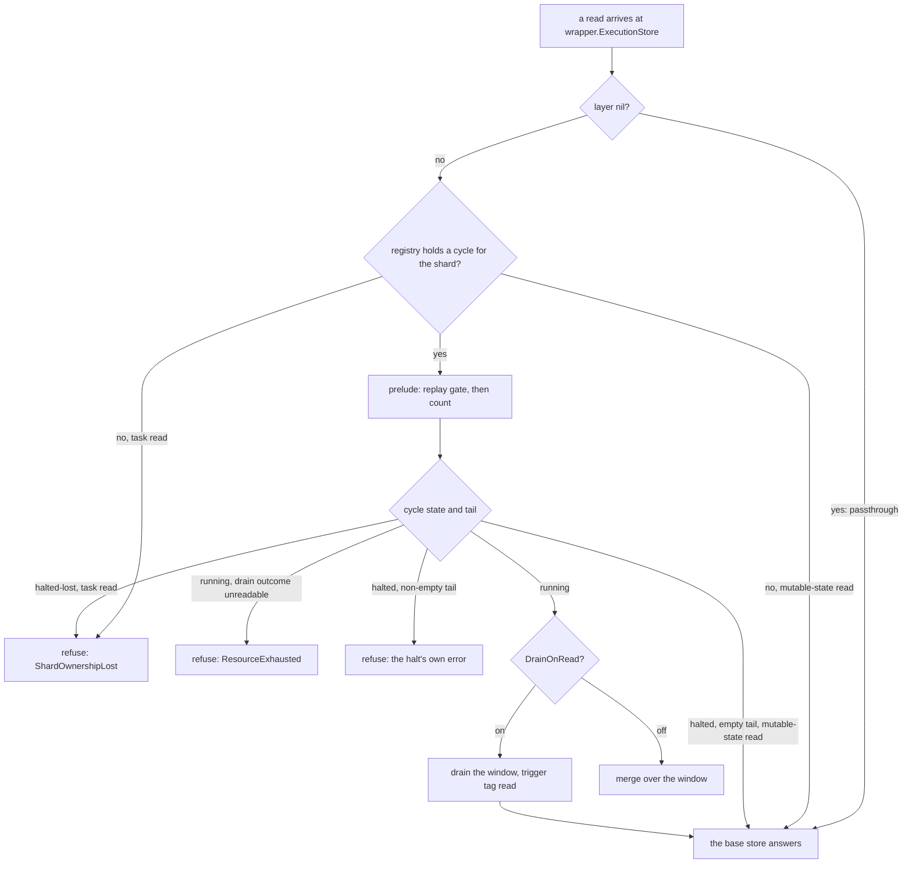
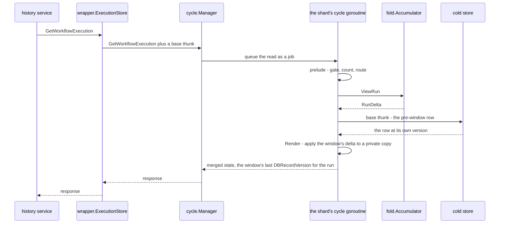
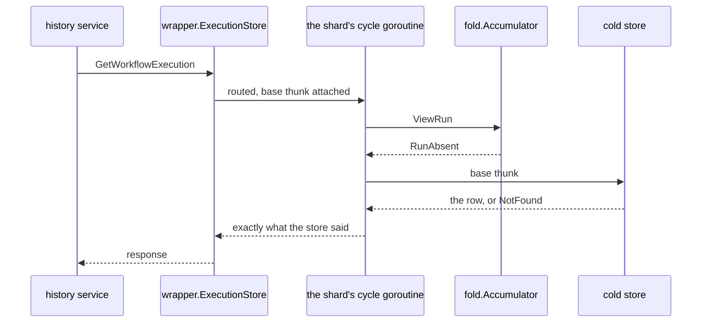
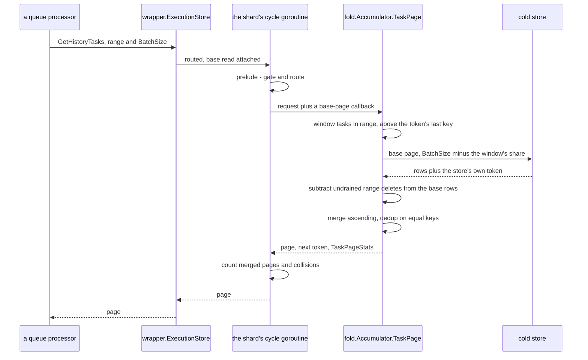

# Reading acknowledged state before it reaches the store

Consider a workflow whose mutable state is version 41 in the cold store. An update produces version
42, is appended to the log, and is acknowledged. Before the window drains, the same history service
reads the workflow again. Returning version 41 would contradict an acknowledgement the layer has
already made. Omitting an acknowledged task from a returned page can be worse: the queue may
complete the range covered by that page and never ask for the missing task again.

The logical state is now split. The cold store contains the durable base, while the in-memory
window contains the acknowledged changes on top of it. A correct read must combine the two:

* a mutable-state read **overlays** a window snapshot or delta on the cold row;
* a history-task read **merges** two ordered streams and subtracts acknowledged range deletes;
* both execute on the shard's cycle goroutine, so a drain cannot expose the interval in which the
  window has been taken but its transaction has not committed.

This chapter derives those rules from the split-state example and then gives the exact routing,
pagination and accounting contracts. It also explains invariant
[I7](02-concepts-and-invariants.md#the-invariants): why a committed drain deliberately omits some
task rows.

## 1. Route only reads whose answer can be split

The version-42 example gives the routing rule: a read must enter the layer when an intercepted write
can have changed its answer without changing the cold store yet. `wrapper.ExecutionStore`
decorates the base `ExecutionStore`. Of its 28 methods, intercept mode answers eleven
differently and refuses a twelfth. Three of the eleven are reads. Everything
else transits — the wrapper calls the base store's method of the same name and returns what it said.

| Read method | Intercept mode | Why |
|---|---|---|
| `GetWorkflowExecution` | **routed** through the layer | one of the eight intercepted writes can have changed the answer, and that write is only in the log |
| `GetCurrentExecution` | **routed** | same, for the current-execution row |
| `GetHistoryTasks` | **routed**, merged | a page short a task in the window is not stale, it is a lost task (below) |
| `ListConcreteExecutions` | transits | a scan; no caller of it can be harmed by the window, and the layer has no shape for merging a scan |
| `ReadHistoryBranch` | transits | event history never enters the log; the wrapper writes new events to the cold store before acking the mutation that names them |
| `GetHistoryTreeContainingBranch` | transits | as above |
| `GetAllHistoryTreeBranches` | transits | as above |
| `GetReplicationTasksFromDLQ` | transits | the DLQ is not carried by the log |
| `IsReplicationDLQEmpty` | transits | as above |

`wrapper.ShardStore`'s reads transit too: `GetOrCreateShard` and `AssertShardOwnership` go to the
base store unchanged, and only `UpdateShard` is observed — for the epoch, not for a read. Shard rows are
not in the log, because `rangeID` is both the fencing token and the task-id allocator.

In passthrough mode (`wrapper.Options.Layer == nil`) all 28 methods transit, reads included. What
the word "mode" names is [chapter 01](01-overview.md#what-mode-names-here).

Sync mode is not a third position of that switch: its window is empty at every call boundary, so
every read still routes, still overlays and still merges — over an empty set. Nothing is turned off
and no branch is skipped. What that costs a run trying to demonstrate anything is
[§6](#6-routed-counters-not-hit-counters).

Routing covers readers inside the owning process and no others. The layer moves a shard's truth into
that process's memory, so a reader anywhere else sees the cold store as it stands — behind by up to a
window, and never a mixture, because the cold store is always a consistent past state. That is the
price of living inside the server process rather than beside it, and on this surface it costs
nothing: the one read such a caller would use is `ListConcreteExecutions`, which is a scan no
outside reader depends on. The task read is the exception, and there the layer refuses rather than
falling through —
transit for state, refusal for deferred work (§2).

### Why a read served anywhere else is not merely stale

The layer has two sources of truth for a shard at any moment: the **window** (the in-memory
accumulator, holding what has been acked into the log and not yet applied) and the **cold store**
(the rows a drain has committed). They hand over at a drain, and the handover is not instantaneous:

* the window empties when a drain **starts** — the accumulator is taken and the batch handed to
  `apply`;
* the tail is settled only when that drain's transaction **commits**.

Between those two moments a mutation is in **neither** source. A reader that looked at the window
would not find it, because the window was emptied; a reader that looked at the cold store would not
find it either, because the transaction has not committed. That is not a stale answer but
**an undone write** — the caller was told the write happened, and a read now says it did not.

The layer closes that interval by construction rather than by locking: **a read is a job on the
shard's own cycle goroutine**, the same goroutine that runs the drain, so the interval is
unobservable. The cost is plain: one shard's reads and writes serialise.

For `GetHistoryTasks` the same interval is worse than stale, and the reason is easy to miss. A
persistence write does not only write: it also notifies the shard's queue processors that there is
new work, so it is tempting to think a task reaches its queue by that route and the read is merely a
backstop. It is the other way round. **A notification carries no work** — a processor takes at most
a hint out of it (whether anything arrived, or the earliest fire time among what did) and then
re-reads persistence, and not one object a notification delivered is ever executed. So the bell is a
latency optimisation and not a delivery channel: the system stays correct if every notification is
lost, and does not stay correct if the read is.

The server's own hold-back (`getExclusiveReaderHighWatermark`) sits above this boundary and cannot be
stretched to cover the window: it is released when the persistence write returns success, which for
an intercepted write is the log append, with the tasks still in the window
([chapter 13](13-designs-that-were-rejected.md#extending-the-servers-own-hold-back)). So a queue that
reads its range and finds nothing there **completes that range** and acks past a key it never saw.
The task is not late; it is lost, and no later read will show it. The other read designs the argument
reached for — a readiness gate, answering from the cold store while the window catches up — are
[chapter 13](13-designs-that-were-rejected.md#reads)'s.

## 2. Routing a read, and `DrainOnRead`

Section 1 said which methods route. This one says whether the cycle they route to may answer at all,
which is the question the overlay and the merge below both stand on. All three reads share one order,
`Cycle.prelude`: the readiness gate, the count, the routing rule, and the drain `DrainOnRead` may
ask for. Every position is load-bearing. At the gate, a running cycle that has not replayed an
inherited tail replays it now — a read on an unreplayed tail would be answered from a cold store the
log is ahead of, with no indication that the answer is stale.

The routing decision, for all three reads.

How to read this. Every refusal is returned **unwrapped**, because the shard's read and write paths
type-switch on the concrete error value. The two readers deliberately part in three places: a
mutable-state read has callers that legitimately do not own the shard, so it falls through to the
cold store. A task read has exactly one caller, whose page — if short a tail — would be completed
and acked past, so it is refused instead. The rules themselves are values in
[`../../cycle/decide.go`](../../cycle/decide.go) (`noCycleRoute`, `loopRoute`,
`stoppedRoute`, `supersededRoute`), and the shard-lifecycle side of them —
epochs, halts, replay — is [chapter 06](06-shard-lifecycle.md).

One route only a task read reaches: `retryOnSuccessor`. If the shard changed hands while one page was
being built, the page is discarded and the read re-issued on the cycle that replaced it — the fresh
cycle replays its predecessor's tail before answering, so what it merges is a superset. One retry,
then the shard is declared lost.

**`DrainOnRead` is an instrument, not a shipped mode.** `cycle.Config.DrainOnRead` (written
`drain_on_read` in the `wal` section, see [chapter 08](08-configuration.md#2-table-1--the-wal-sections-keys))
is `false` in `cycle.Defaults()` and nothing that ships turns it on. When it is on, a read drains the
window it would otherwise have merged over, so every read is served by the cold store. That is
exactly what makes it an attribution instrument: turn it on and any behaviour that survives is not
the overlay's. Three facts about it:

* the drain it causes is tagged `trigger="read"` on `wal_drains` (`walmetrics.TriggerRead`), so it is
  visible in the same series as every other drain;
* it runs **after** the routing rule, because a halted cycle may not drain and a stalled one is
  refused before it;
* it does not take the merge out of the task path ([section 4](#4-merge-tasks-two-ordered-sources-one-page)),
  only the window: the merge still runs, over a
  window the drain just emptied, so the tokens and the pagination are unchanged and
  `TaskReadsMerged` honestly stops counting. For the two mutable-state reads the view is re-taken
  after the drain, since the first view was of a window that no longer exists.

The counters are taken **before** the drain on purpose: the window held that run when the read
arrived, and counting after the drain would report the empty window the drain just left behind.

## 3. Overlay mutable state: base plus acknowledged change

Return to the example. Version 41 is the base and the acknowledged update is a delta whose result is
version 42. The reader needs both. A create, by contrast, is a complete snapshot and needs no base;
a delete is a tombstone and must hide any row the base still contains. These are not special cases
scattered through the read path. `fold.Accumulator.ViewRun` classifies what the window holds for one
run into exactly four shapes, and a reader branches on nothing else (`fold.RunShape`):

| Shape | Meaning | Needs the cold row? |
|---|---|---|
| `RunAbsent` | the window holds nothing for this run | yes — the base's answer *is* the answer, its NotFound included |
| `RunSnapshot` | the window holds whole state: a Create, a Set, a conflict-resolve's reset, the new run behind a continue-as-new, or a Create behind a tombstone | no — and it must not be |
| `RunDelta` | the window holds a delta: an Update, or a conflict-resolve's current mutation | yes — the answer is base ⊕ delta |
| `RunTombstone` | the window deleted the run | no — the answer is "no such execution", whatever the cold store still holds |

`RunView.NeedsBase()` is `RunAbsent || RunDelta`, and it is a **correctness predicate**, not an
optimisation: `RunAbsent` and `RunDelta` are statements *about* the base, while `RunSnapshot` and
`RunTombstone` **replace** it. No snapshot-shaped write at this interface leaves the run's earlier rows
behind: a Set and a conflict-resolve's reset carry a `DeleteStateItems` for the run alongside the new
state, and a Create — plain, as the new run behind a continue-as-new, or behind a tombstone — either
asserts the run's absence or rides in the same transaction as the delete that removed it. Either way,
once the drain commits the run's state is that snapshot and nothing else. Merging the cold
store's leftovers into a `RunSnapshot` answer would hand the reader signals, activities, timers and
child executions that the drain is about to delete — state that exists at no point on the sequential
path. The round trip saved is the side effect, and a shape added to the enum has to answer the same
question the same way. `RunView.Render` is where the merge happens, and it is
`applyMutationToSnapshot` and no other function — the same fold the drain will write, so **a read
answers with what the drain will write**.

The current-execution row is a separate question with its own four shapes (`fold.CurrentShape`):
`CurrentUnheld`, `CurrentWritten`, `CurrentGone`, and `CurrentGuarded`. The last is one or more
`DeleteCurrentWorkflowExecution` guards standing over the base with no window write above them. The
store removes the row only if it names that run, so the answer is that guard evaluated against the
base row.

Here is version 41 becoming version 42: an `UpdateWorkflowExecution` was acked into the log, the
drain has not run, and a `GetWorkflowExecution` for the same run arrives.

How to read this. The cold store is still consulted, because a delta needs a base; what the caller
gets back is the base with the window folded onto it. The version handed out is the one carried by
the window's **last** write for that run
(`Emitted.TailSeqno`'s request) — the one the merged request will write — because handing out the
base's would make the server's next conditional write assert a version nothing writes.

Nothing in the overlay mutates: the accumulator's maps and the caller's base row are both copied into
a private snapshot before anything merges, so a later fold cannot rewrite an answer already handed
out. That is the discipline the whole read side of `fold` shares.

Nothing is retained either. A read allocates the answer it hands out and nothing more: no cache is
populated, no index maintained, and nothing is written back into the accumulator. So a shard's
memory is a function of what has been acknowledged and not yet applied and of nothing else. That is
why read traffic does not enter [chapter 08](08-configuration.md#5-the-budget-refusal)'s tail budget,
and why no sequence of reads can change what a later drain writes.

And here is the miss: the window holds nothing for the run.

How to read this. On a miss the base's answer is returned **unwrapped, NotFound included**. The read
was still routed through the layer, and still counted — see §6.

## 4. Merge tasks: two ordered sources, one page

Suppose the requested range contains cold-store task keys 10 and 30, while acknowledged task 20 is
still in the window. Returning the base page and appending 20 would produce `10, 30, 20`; returning
the base alone could let the queue complete past 20. The only valid page is the ordered merge
`10, 20, 30`, subject to the requested batch size and any range delete already in the window.

`GetHistoryTasks` is therefore the one read that merges rather than renders, and it is answered in
two halves. The cycle decides **who may answer a page, when, and whether the window is usable yet**,
which is [section 2](#2-routing-a-read-and-drainonread) above; `fold.Accumulator.TaskPage` decides
**what one page holds** — the cut, the token, the batch
arithmetic, the dedup, the subtraction of undrained range deletes — and it sits beside the window it
reads.

The base page reaches `fold` as a callback (`fold.BasePage`, taking a batch size and a token) rather
than as a page, because the merge chooses its own batch size and token while the round trip stays the
cycle's. `fold` may name no cold store.

The window half of a page is a linear scan and a sort, and nothing else. `fold.Accumulator.Tasks`
walks every home `taskRows` names, sorts what it found by key, and `mergePage` then walks that slice
whole — counting each visit as `TaskPageStats.WindowTouched`. There is no index over the window and
no heap: a window holds **tens of tasks per category**, so the scan is the cost.
[Chapter 13](13-designs-that-were-rejected.md#a-materialised-per-run-state-or-an-index-over-the-windows-tasks)
has why an index was refused, and what would have to change for it to be worth revisiting.

One page of `GetHistoryTasks`, merged from the window and the cold store.

How to read this. The base is called **at most once per page**, and not at all once its token says it
is exhausted. The subtraction of the window's undrained range deletes is applied to the base's rows
and to nothing else — the window's own tasks were already swept when each range folded in. Without
that subtraction the layer's correctness would rest on a property of its caller — that a queue never
re-reads below a range it has completed — which is not this layer's property to rely on. It subtracts
the **ranges** and not their maximum, applying `fold.TaskRange.Covers` per range: pending ranges for
a category need not be contiguous, and a row in a gap between two of them is one no pending delete
covers, so hiding it would leave it invisible to the reader and still present in the store.

### The ordering and dedup rules

* **Ascending, inside the requested range, no longer than `BatchSize`.** The range is normalised per
  category type first (`taskBounds`): an immediate category compares on task ID, a scheduled one on
  fire time, which is what the store itself does.
* **On a tie the base's row wins.** It is the durable copy, and the key the queue will complete.
* **Ordering is why the window is not simply appended.** A shard hands out task ids *before* the
  write, so a cold-store row can carry a higher id than a task still in the window; emitting the base
  first would hand the queue a descending pair.
* **The comparator is shared by both category types**, which is sound only because every
  immediate-category task's `GetKey()` returns `NewImmediateKey` — its fire time is the constant
  `tasks.DefaultFireTime`.

### The page-token rules

The token this layer hands back is its own (`taskPageToken`), framed with a four-byte magic so it
can be told apart from the base store's. It carries three things and no more:

* `Base` — the cold store's own token, **verbatim**. This layer may not parse or synthesise it.
* `BaseDone` — whether the base is exhausted. A flag rather than an empty `Base`, because an empty
  `Base` is also what the first page carries.
* `AfterFireTime` and `AfterTaskID` — the two components of the last key this pagination emitted,
  exclusive. `After` records that those fields are present, because `(0, 0)` is itself a valid key.

No state is kept between calls: those fields are the whole cursor.

The cut has no freedom, and three facts box it in — a page may not exceed `BatchSize`; the base's
token is the base store's format; and a scheduled range can name only a fire time as a resume point.
Therefore **the cut is at the end of a base page or below its first row, never inside one**. Either
the whole base page is emitted and its token advances, or none of it is and the incoming token comes
back untouched. A partially emitted base page would mean lost rows on one side and duplicates on the
other. The base is asked for `BatchSize` minus what the window contributes, so window tasks
*displace* cold-store rows rather than adding to them.

Two floors on that arithmetic are what make the pagination terminate. `BatchSize` itself is floored
at one, because a page of zero rows would make the pagination endless; and the ask is
`max(BatchSize - the window's share, 1)`, because asking the store for nothing would end the
pagination with rows still in it. Displacement is therefore never total, however full the window is.
The second floor also bounds the waste the never-cut-inside-a-base-page rule introduces:
the branch where the window alone overflows the page implies the window contributed at least
`BatchSize` tasks, hence an ask of exactly one, so **at most one base row is discarded per page** —
and the incoming token is handed back untouched, so that row comes back next time rather than being
lost. One degenerate case falls out of the same arithmetic: when the base's first row ties the
window's first, nothing is strictly below it and cutting there would emit an empty page for ever, so
the merge emits that single deduplicated entry — which is emitting the base page whole, and therefore
allowed by the cut rule.

A token this layer did not write is handled too: it means an earlier page was answered by the base
alone, on a shard whose cycle was retired mid-pagination. The merge carries on with the base alone
rather than inventing a window cursor that was never handed out.

### The collision counter

`mergeSorted` counts keys that both sources carried. **The two sources are disjoint by
construction** — the window drops a task exactly when the drain carrying it commits — so a collision
is not a normal event to be tolerated; it is evidence. It is counted rather than raised, because a
read is the wrong place to discover an invariant violation: the page is still correct (the base's row
wins, the duplicate is dropped) and the number goes to `TaskPageStats.Collisions`, to
`cycle.Counters.TaskCollisions`, and out as the `wal_merged_task_collisions` series. The expected
value is zero. What to do when it is not zero is
[chapter 09](09-operations.md#f-merged-page-collisions-are-non-zero).

`TaskPageStats` is an instrument rather than a contract; its other fields (`BaseCalls`, `BaseRows`,
`BaseDiscarded`, `WindowTouched`, `Comparisons`, `FromWindow`) are what the corpus tests measure the
merge's cost with.

## 5. Invariant I7 — the tasks a drain does not write

A queue expresses its progress to the store in exactly one way: a **range completion**, its
checkpoint — a delete of `[old boundary, new boundary)`, the boundaries abutting and only growing.
Between checkpoints that progress lives in the queue's memory and reaches the shard row on a jittered
timer, so the database knows less about a queue's progress than the queue does. The order inside one
checkpoint is load-bearing upstream: the range is completed **first** and the queue's state written
to the shard row afterwards, because a state persisted first would leave the watermark above a
deletion that then failed — the shard reloads, and those tasks are never deleted.

Once a reader can be offered the window, it can ack past a task that is still in the tail. If the
drain then wrote that row anyway, it would land **below** the reader's deletion watermark:
`rangeCompleteTasks` deletes `[old, new)` with `old` only rising, so no later range covers it and
every reader scope is rebuilt above it. The row would be permanent garbage — and there is exactly one
of them per task the drop removes, so what the drop saves and the leak the deferred write introduces
are the same event counted twice.

Nothing anywhere would notice such a row. Task rows are plain upserts into `executions` and a range
completion is a bare `DELETE`; no check compares an inserted key against a boundary already
completed. That is not an oversight, because in the unmodified system the row cannot appear: the work
and the state are written **at the same moment**, by the same transaction, and a queue does not
complete a range with somebody's task write still in flight. Acknowledging a write before its task
rows are in the store destroys the first of those two properties, and I7 is what fills the hole it
opens. It fills it by **never writing such a row** rather than by detecting one, because detection is
exactly what the surrounding system cannot do — no reading of any metric will tell an operator that a
row landed below a completed boundary.

**I7 is the rule that the drop is correct**: a task row whose range a caller has already completed is
not written. The layer does not model an ack level and does not need to — it applies the range
deletes its callers asked for, in the order they asked for them. A range delete needs no
interpretation; it already says *every row below this key is garbage*.

Three things about the shape are decisions rather than mechanics:

* **the drop is the range, not a bound.** A `RangeCompleteHistoryTasks` folding into the window
  sweeps every task the window already holds inside `[min, max)`, under the store's own per-category
  predicate, `fold.TaskRange.Covers`: immediate on task id, scheduled on fire time, at
  **microsecond** resolution, because that is the resolution a store's timestamp column is expected
  to keep. The resolution is not a detail: a maximum a nanosecond above a task's fire time truncates
  to that fire time in the store and covers nothing there, so comparing finer would drop a row the
  sequential path keeps — a lost timer, not a leaked row. The sweep happens at fold time and not at
  drain time because a store's batch ordinarily gathers **every delete before every upsert** inside
  one transaction: a task and a range that
  reached the same drain would come out with the row written, whatever the window meant by folding
  the range over it. The fold is the only place the caller's order can still be honoured.
* **a task arriving after a range is kept.** The log's order is the caller's, so such a task is one
  the caller wrote after the delete, and the sequential path writes it. Pending ranges therefore die
  with the drain that applies them; nothing about a deletion outlives it.
* **the same predicate answers all three questions** — what the cold store loses, what the window
  drops, and what a merged read hides. An answer that differed between the three would be a row that
  is invisible and still there.

One operational asymmetry rides along with the range that reaches the drain. A range is a predicate
rather than a key tuple, so unlike the drain's other delete families it cannot collapse into one
statement per family: each range is its own statement, and the drain's statement count is a function
of how many ranges the batch was handed and never of how many rows they cover. A range too large for
one statement therefore fails the drain it rides rather than degrading into pages the way the
standalone call does ([chapter 05](05-write-path.md#2-the-drain-itself) has why). This is
named rather than closed, and it is worth knowing at the console: the symptom is a drain failing for
the size of somebody's queue checkpoint.

Where a task row can live inside a window is stated once, `fold.Accumulator.taskRows`:

* each pending request's task slots;
* that request's orphaned tasks — a tombstoned run's tasks survive its collapse, because a task is
  durable in the tail or in the store;
* the rows an `AddHistoryTasks` put in beside the workflows.

The read, a range's sweep and the drain's written-count all walk that one enumeration,
because the failure is silent and asymmetric: a row the read misses is a lost timer, a row the sweep
misses is a leak.

### Why the metric is two counters and not a ratio

A committed drain emits, per task category, `wal_dropped_tasks` and `wal_written_tasks` — never a
share. The reason is that the denominator moves with the drop: a pre-divided number cannot tell
**"everything was dropped"** from **"there was nothing to drop"**, and those are the two states an
operator most needs to tell apart. The same two numbers are on the drain itself as
`fold.TaskWork.Dropped` and `fold.TaskWork.Written`, both keyed by category name, and in
`cycle.Counters` as `DroppedTasks`, `WrittenTasks` and `AckedRanges`. The last is range deletes
folded, and its zero means no queue ever completed a range, so the layer is untested rather than
working.

Only a **committed** drain emits them, and a category the drain did not carry emits nothing at all
rather than a pair of zeroes.

### What a rising drop share tells an operator

The drop share is primarily a function of one dimensionless quantity: **drains per queue
checkpoint**. The exact share is a workload measurement, not a constant of the implementation; use
`wal_dropped_tasks` and `wal_written_tasks` to calculate it for the deployment. The shipped cadence
gives the anchor to read it against: `history.timerProcessorUpdateAckInterval` and its transfer,
visibility, outbound and archival siblings default to 30 s in the vendored server, against the
layer's 5 s age watermark — **six drains per queue checkpoint**. Both ends of that ratio belong to
different owners, and the incumbent's end is the larger one, so the size of the drop is set mostly by
a knob this layer does not hold. Two readings follow:

* a rising share usually means the window is living longer relative to the queues' checkpoints —
  which is the mechanism working, not a fault. Under load it goes the other way: the mutation and
  byte watermarks fire far more often than the age watermark, so the window is shorter and less is
  dropped.
* **fewer drains per checkpoint is a bigger share**, so the two sides move it in opposite
  directions, and which knob is cheap depends on which way you are going. To make the drop **worth
  more**, the cheap knob is the incumbent's `history.*ProcessorUpdateAckInterval` and *not* this
  layer's age watermark, which buys the same thing with memory and replay time. To make the share
  **smaller**, it is this layer's window that shortens — and that is paid in the collapse the layer
  exists for, which is why the runbook reaches for it last.

Neither direction is a fault to be corrected: the drop is a saving that invariant I7 makes legal,
and no reading of this share says a task was lost. Compare each category against itself over time:
immediate and scheduled categories drop at unrelated rates. The runbook is
[chapter 09](09-operations.md#e-task-drops-are-climbing).

## 6. Routed counters, not hit counters

Four of the layer's read counters count reads **routed at the layer**, not reads the window could
answer — two series and two in-process. That is deliberate, and the reason is one sentence: *a
counter that only fired on a hit reads zero on a healthy idle cluster and zero on a layer wired up
wrong* — two situations an operator has to tell apart at a glance.

| Counter | Kind | What it counts |
|---|---|---|
| `wal_overlaid_reads` (and `wrapper.Counts.Overlaid`) | **routed** | mutable-state reads sent at the layer, tagged by store method |
| `wal_merged_task_pages` (and `wrapper.Counts.TaskReads`) | **routed** | `GetHistoryTasks` pages sent at the layer's merge |
| `cycle.Counters.TaskReads` | **routed** | pages this shard was asked for — counted before the readiness gate, so a page the gate fails is still in it |
| `cycle.Counters.Reads` | **routed** | overlay reads this shard answered |
| `cycle.Counters.ReadsHeld` | **hit** | the subset for which the window held the run or the row |
| `cycle.Counters.TaskReadsMerged` | **hit** | pages that carried at least one task **out of the window** |
| `cycle.Counters.TaskCollisions` | evidence | keys both sources carried; node-wide |

`wal_merged_task_pages` is the one whose name and meaning disagree: it counts pages routed, not pages
merged. Renaming it would break every alert expression written over it, so the distinction lives in
the metric's description instead.

The hit counters are what a **witness** rests on, which is the whole reason both kinds exist. A test
suite is just as green over a layer that came out empty as over one doing its job, so the acceptance
asserts on `ReadsHeld` and `TaskReadsMerged` rather than on `Reads` and `TaskReads`: reads that never
crossed a held workflow are what an empty layer looks like.
[Chapter 11](11-verification.md#the-witness-and-why-a-green-intercept-run-proves-nothing-without-it)
owns the witness; [chapter 10](10-metrics.md) owns every series named here, with its tags and units.

## Where this lives in the code

* [`../../fold/overlay.go`](../../fold/overlay.go) — `RunShape`, `CurrentShape`, the two
  views and their `Render`; the copy-before-merge discipline is stated at the top of the file.
* [`../../fold/merge.go`](../../fold/merge.go) — `applyMutationToSnapshot`, the one
  function both the overlay and the drain fold with, plus the per-key upsert-vs-delete resolution.
* [`../../fold/taskpage.go`](../../fold/taskpage.go) — the merged page: the pagination
  rule at length, the token format, `hideDeleted`, `mergeSorted` and `TaskPageStats`.
* [`../../fold/histtasks.go`](../../fold/histtasks.go) — I7's half inside the window:
  `TaskRange.Covers`, the sweep, `taskRows`, and the two drop counters.
* [`../../fold/tasks.go`](../../fold/tasks.go) — the window's tasks as a reader sees
  them, and why the scan has no index over it.
* [`../../cycle/read.go`](../../cycle/read.go) — the two mutable-state reads,
  `Cycle.prelude`'s four-step order, and `drainForRead`.
* [`../../cycle/tasks.go`](../../cycle/tasks.go) — who may answer a task page, and the
  three task-read counters.
* [`../../cycle/decide.go`](../../cycle/decide.go) — `readRoute` and the four rules that
  return it, as functions of values.
* [`../../wrapper/execution_store.go`](../../wrapper/execution_store.go) — the
  eleven-of-28 partition, method by method, and where each read counter is raised.
* [`../../walmetrics/walmetrics.go`](../../walmetrics/walmetrics.go) — the series, with
  the routed-versus-hit reasoning written at each definition.
