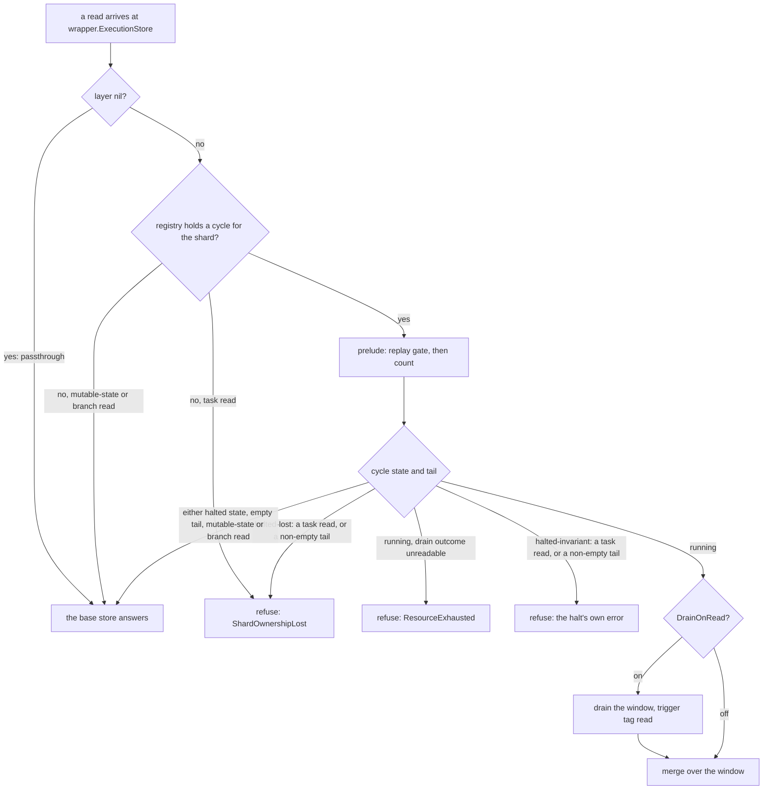
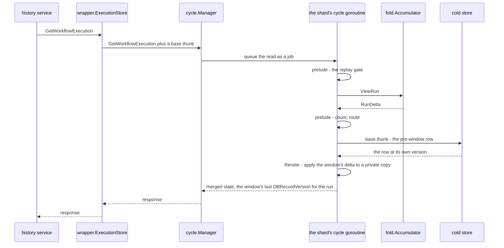
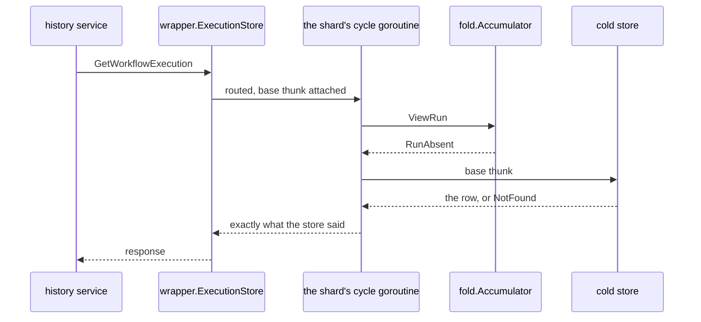
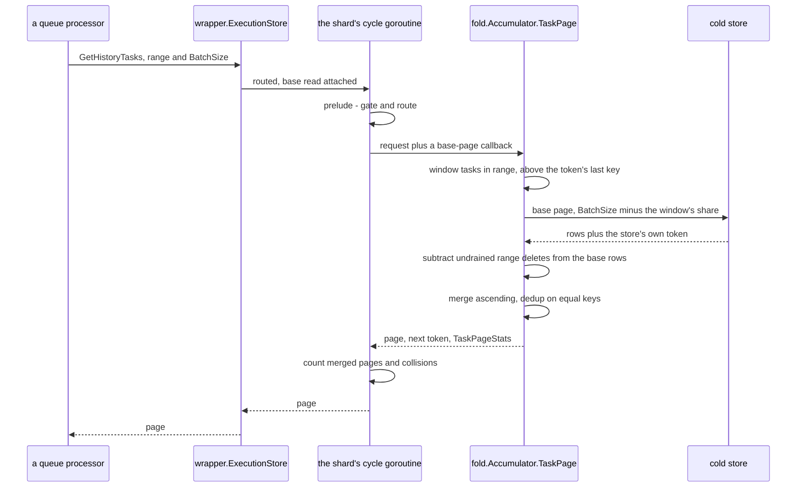

# Reading acknowledged state before it reaches the store

Consider a workflow whose mutable state is version 41 in the cold store. An update produces version
42, is appended to the log, and is acknowledged. Before the window drains, the same history service
reads the workflow again. Returning version 41 would contradict an acknowledgement the layer has
already made. Omitting an acknowledged task from a page of tasks is worse: the queue may complete
the range that page covered and never ask for the missing task again.

The shard's state is now split. The cold store holds the durable base, and the window (the
acknowledged mutations not yet drained, folded in memory) holds the changes on top of it. A correct
read combines the two, in one of three ways:

* a mutable-state read *overlays* a window snapshot or delta on the cold row;
* a history-task read *merges* two ordered streams and subtracts acknowledged range deletes;
* a history-branch read merges the same way, over the event batches the window still holds, with
  nothing to subtract.

All three run on the shard's cycle goroutine, the goroutine the drain runs on. This chapter covers
which reads enter the layer, who may answer them, how the overlay and the merge work, and invariant
[I7](02-concepts-and-invariants.md#the-invariants): why a committed drain omits some task rows.

## 1. Route only reads whose answer can be split

The version-42 example gives the routing rule: a read enters the layer when an intercepted write can
have changed its answer without changing the cold store yet. Of the 28 methods of
`wrapper.ExecutionStore`, eight are writes the layer intercepts into the log, four are the reads
below, one (`CompleteHistoryTask`) is refused and 15 transit; the full partition is in
[chapter 04](04-contracts.md#wrapperexecutionstore--28-methods). A method that *transits* calls the
base store's method of the same name and returns what it said.

| Read method | Intercept mode | Why |
|---|---|---|
| `GetWorkflowExecution` | **routed** through the layer | one of the eight intercepted writes can have changed the answer, and that write is only in the log |
| `GetCurrentExecution` | **routed** | same, for the current-execution row |
| `GetHistoryTasks` | **routed**, merged | a page short a task in the window is not stale, it is a lost task (below) |
| `ListConcreteExecutions` | transits | a scan; no caller of it can be harmed by the window, and the layer has no shape for merging a scan |
| `ReadHistoryBranch` | **routed**, merged | a record's event batches stay in the window until a drain lands them. Whether the window holds any depends on the tail this shard inherited (the acknowledged entries not yet settled by a drain), not on this node's store, so the read is merged whatever that store does with a write's batches |
| `GetHistoryTreeContainingBranch` | transits | a decision: what a tree read owes a history row still in the window depends on where the deployment put its history, and the layer does not choose for it |
| `GetAllHistoryTreeBranches` | transits | a scan, like `ListConcreteExecutions` |
| `GetReplicationTasksFromDLQ` | transits | the DLQ is not carried by the log |
| `IsReplicationDLQEmpty` | transits | as above |

`wrapper.ShardStore`'s reads transit too. `GetOrCreateShard` and `AssertShardOwnership` go to the
base store unchanged, and only `UpdateShard` is observed, for the epoch. Shard rows are not in the
log, because `rangeID` is both the fencing token and the task-id allocator.

In passthrough mode (`wrapper.Options.Layer == nil`) all 28 methods transit, reads included
([chapter 01](01-overview.md#what-mode-names-here) has what "mode" names). Sync mode is not a third
position of that switch. Its window is empty at every call boundary, so every read still routes,
overlays and merges, over an empty set. Only the evidence changes: the *hit* counters of
[§6](#6-routed-counters-not-hit-counters) stay at zero in a sync run.

Routing covers readers inside the owning process only. A reader in another process sees the cold
store as it stands: behind by up to a window, but never a mixture, because the cold store always
holds a consistent past state. This is the cost of living inside the server process, and on this
surface it is small: the one read such a caller would use is `ListConcreteExecutions`, a scan no
outside reader depends on.

The task read is the exception. A process that holds no cycle for the shard refuses it rather than
passing it to the cold store, because a page short the tail would be completed and acked past
(`noCycleRoute`; §2 has the rest of the rule).

### Why a read served anywhere else is not merely stale

Now take a reader in the owning process that does not run on the shard's cycle goroutine. The window
and the cold store hand over at a drain, and the handover takes time:

* the window empties when a drain *starts*: the accumulator is taken and the batch handed to `apply`;
* the tail is settled only when that drain's transaction *commits*.

Between those two moments a mutation is in neither source. A reader would not find it in the window,
which was emptied, nor in the cold store, which has not committed. The answer is not stale: it undoes
a write the caller was told had happened ([chapter 02](02-concepts-and-invariants.md#three-positions-not-two)
has the positions).

The layer closes that interval by construction rather than by locking. A read is a job on the
shard's own cycle goroutine, the goroutine that runs the drain, so the interval cannot be observed.
The cost is that one shard's reads and writes serialise.

For `GetHistoryTasks` the interval loses tasks. A persistence write also notifies the shard's queue
processors that there is new work, but a notification carries no work. A processor takes at most a
hint from it (whether anything arrived, or the earliest fire time) and then re-reads persistence. The
system stays correct if every notification is lost, and not if the read is.

The server's own hold-back (`getExclusiveReaderHighWatermark`) cannot cover the window either. It is
released when the persistence write returns success, which for an intercepted write is the log
append, with the tasks still in the window
([chapter 13](13-designs-that-were-rejected.md#extending-the-servers-own-hold-back)). So a queue that
reads its range and finds nothing completes that range and acks past a key it never saw. The task is
lost, and no later read will show it. Two other read designs, a readiness gate and answering from the
cold store while the window catches up, are refused in [chapter 13](13-designs-that-were-rejected.md#reads).

## 2. Routing a read, and `DrainOnRead`

Section 1 said which methods route. This section says whether the cycle they reach may answer. All
four reads go through `Cycle.prelude`, in this order:

1. *The replay gate.* A running cycle that has not replayed an inherited tail replays it here.
   Otherwise the read would be answered from a cold store the log is ahead of, with no sign that it
   is stale. The replay also resets the accumulator, so a view taken before it is of the wrong window.
2. *The count*, before the routing rule, so a read the rule sends to the cold store still counts as
   routed. Only the two mutable-state reads are counted here. A task read counts its page on the way in,
   before the gate (§6). The cycle does not count a branch page at all, so a read that never touched
   the overlay cannot satisfy the overlay's hit counter.
3. *The routing rule*, below.
4. *The drain*, only when `DrainOnRead` is on (end of this section).

Figure: the routing decision for all four reads.

```mermaid
flowchart TD
    A["a read arrives at wrapper.ExecutionStore"] --> B{"layer nil?"}
    B -->|"yes: passthrough"| Z["the base store answers"]
    B -->|"no"| C{"registry holds a cycle for the shard?"}
    C -->|"no, mutable-state or branch read"| Z
    C -->|"no, task read"| L["refuse: ShardOwnershipLost"]
    C -->|"yes"| D["prelude: replay gate, then count"]
    D --> E{"cycle state and tail"}
    E -->|"running, drain outcome unreadable"| R["refuse: ResourceExhausted"]
    E -->|"halted-lost: a task read, or a non-empty tail"| L
    E -->|"halted-invariant: a task read, or a non-empty tail"| H["refuse: the halt's own error"]
    E -->|"either halted state, empty tail, mutable-state or branch read"| Z
    E -->|"running"| F{"DrainOnRead?"}
    F -->|"on"| G["drain the window, trigger tag read"]
    G --> M
    F -->|"off"| M["merge over the window"]
```

The `ResourceExhausted` branch is a stall: a previous drain whose outcome cannot be read
([chapter 05](05-write-path.md#7-failed-drain--the-outcome-could-not-be-read)). Every refusal is
returned unwrapped, because the shard's read and write paths type-switch on the concrete error value.

The two kinds of reader always part the same way. A mutable-state read has callers that legitimately
do not own the shard, so it falls through to the cold store. A task read has exactly one caller,
whose page, if short the tail, would be completed and acked past, so it is refused. The table below
spells this out, and it reduces to one rule: a task page is answered by a running cycle or not at all.

A branch page is routed like a mutable-state read. Its reader deletes nothing it read, so a page
short the window's newest nodes is merely stale. Where it falls through, its page token is unwrapped
first (`fold.BaseHistoryToken`), since this layer may have written it on an earlier page.

| The cycle | Mutable-state read | Task read |
|---|---|---|
| the registry holds none for this shard (`noCycleRoute`) | the base store answers | `ShardOwnershipLost` |
| halted-lost (`loopRoute`) | the base store answers if the tail is empty, else `ShardOwnershipLost` | `ShardOwnershipLost`, whatever the tail holds |
| halted-invariant (`loopRoute`) | the base store answers if the tail is empty, else the halt's own error | the halt's own error, whatever the tail holds |
| retired, its goroutine gone (`stoppedRoute`) | the same tail rule | `ShardOwnershipLost` — re-issued on the successor by `Manager.taskPage` where one has superseded it |

The tail rule is only as good as the tail. A cycle that halted inside its replay is replayed again by
`Cycle.Close`, which floors the tail (resets its settled position to the watermark) first. If that
second log read fails, the retired cycle's published tail (the copy readers see off the cycle
goroutine) is empty and the last row passes a mutable-state
read to a cold store missing those entries. This is an open defect in
[the durability ledger](../../DURABILITY.md).

An empty tail never relaxes the task-read column, and the last row shows why. A page the cold store
answers carries that store's own page token. A shard re-acquired mid-pagination (a rangeID renewal
is one, and it unloads nothing, so the caller keeps paginating) answers the next page from a cycle
that merges. That cycle cannot read a token this layer did not write and refuses it (§4's page-token
rules). Finishing the pagination on the base alone would drop the window's acked task rows, which the
range the reader completes at the end then deletes.

Each rule is a function of plain values (a state, a tail, which reader is asking) in
[`../../cycle/decide.go`](../../cycle/decide.go), so a test can enumerate its whole domain with no
cycle running. Epochs, halts and replay are [chapter 06](06-shard-lifecycle.md).

One route only a task read reaches: `retryOnSuccessor`. If the shard changed hands while a page was
being built, the page is discarded and the read re-issued on the cycle that replaced it. The new
cycle replays its predecessor's tail before answering, so it merges over a superset of the old
window. There is one retry: superseded twice, the shard is declared lost.

### `DrainOnRead` is an instrument

`cycle.Config.DrainOnRead` (`drain_on_read` in the `wal` section,
[chapter 08](08-configuration.md#2-table-1--the-wal-sections-keys)) is `false` in `cycle.Defaults()`,
and nothing that ships turns it on. When on, a read drains the window it would have merged over, so
the cold store serves every read. Any behaviour that survives is therefore not the overlay's, which
makes it an attribution instrument.

* The drain is tagged `trigger="read"` on `wal_drains` (`walmetrics.TriggerRead`).
* It runs after the routing rule, because a halted cycle may not drain and a stalled one is refused
  before it.
* The task merge ([§4](#4-merge-tasks-two-ordered-sources-one-page)) still runs, over the window the
  drain just emptied. Tokens and pagination are unchanged, and `TaskReadsMerged` (pages that carried
  a task out of the window) falls to zero. The two mutable-state reads re-take their view after the
  drain, since the first view was of a window that no longer exists.

The counters are taken before the drain, because the window held that run when the read arrived.

## 3. Overlay mutable state: base plus acknowledged change

Return to the example. Version 41 is the base and the acknowledged update is a delta whose result is
version 42, so the reader needs both. A create is a complete snapshot and needs no base. A delete is
a tombstone and must hide any row the base still holds. `fold.Accumulator.ViewRun` classifies what
the window holds for one run into four shapes (`fold.RunShape`), and a reader branches on nothing
else:

| Shape | Meaning | Needs the cold row? |
|---|---|---|
| `RunAbsent` | the window holds nothing for this run | yes — the base's answer *is* the answer, its NotFound included |
| `RunSnapshot` | the window holds whole state: a Create, a Set, a conflict-resolve's reset, the new run behind a continue-as-new, or a Create behind a tombstone | no — and it must not be |
| `RunDelta` | the window holds a delta: an Update, or a conflict-resolve's current mutation | yes — the answer is base ⊕ delta |
| `RunTombstone` | the window deleted the run | no — the answer is "no such execution", whatever the cold store still holds |

`RunView.NeedsBase()` is `RunAbsent || RunDelta`. It is a correctness predicate, not an
optimisation: `RunAbsent` and `RunDelta` are statements about the base, while `RunSnapshot` and
`RunTombstone` replace it. A fifth shape would have to answer the same question.

A snapshot must not be merged with the base because no snapshot-shaped write leaves the run's earlier
rows behind. A Set and a conflict-resolve's reset go through the plugin's reset path, which clears
each of the run's collection tables (`deleteActivityInfoMap` and its six siblings) before writing the
snapshot's rows. A Create (plain, behind a continue-as-new, or behind a tombstone) either asserts the
run's absence or rides in the same transaction as the delete that removed it. Once the drain commits,
the run's state is that snapshot and nothing else. Merging the cold store's leftovers into the answer
would hand the reader signals, activities, timers and child executions that exist at no point on the
sequential path.

`RunView.Render` does the merge, with `applyMutationToSnapshot` and no other function. That is the
fold the drain writes with, so a read answers with what the drain will write.

Both ends of that fold are hand-written. `snapshotOfBase` turns the cold row into the snapshot the
delta folds onto, and `mutableStateOf` turns the result into the type the read answers in. Both
mirror Temporal's `InternalWorkflowMutableState` field by field. A field that either mirror stops filling
comes back zero; the caller reads that as a run with no such collection and writes the run back without
it. Because a snapshot-bearing write clears the run's tables first, that deletes an acknowledged
write. So `TestEveryFieldOfAReadAnswerIsFilled` enumerates the fields of
`InternalWorkflowMutableState` itself and fails naming the one nothing fills, the same claim
`fold/merge_test.go` makes for the write path's folds.

The current-execution row has its own four shapes (`fold.CurrentShape`): `CurrentUnheld`,
`CurrentWritten`, `CurrentGone` and `CurrentGuarded`. `CurrentGuarded` means one or more
`DeleteCurrentWorkflowExecution` guards stand over the base with no window write above them. Each
guard names a run and removes the row only if the row is that run's. So the answer is no current
execution if the base row names any guarded run, and the base row unchanged otherwise.

Figure: version 41 becoming version 42. An `UpdateWorkflowExecution` was acked into the log, the
drain has not run, and a `GetWorkflowExecution` for the same run arrives.

```mermaid
sequenceDiagram
    participant HS as history service
    participant ES as wrapper.ExecutionStore
    participant MG as cycle.Manager
    participant LP as the shard's cycle goroutine
    participant ACC as fold.Accumulator
    participant CS as cold store

    HS->>ES: GetWorkflowExecution
    ES->>MG: GetWorkflowExecution plus a base thunk
    MG->>LP: queue the read as a job
    LP->>LP: prelude - the replay gate
    LP->>ACC: ViewRun
    ACC-->>LP: RunDelta
    LP->>LP: prelude - count, route
    LP->>CS: base thunk - the pre-window row
    CS-->>LP: the row at its own version
    LP->>LP: Render - apply the window's delta to a private copy
    LP-->>MG: merged state, the window's last DBRecordVersion for the run
    MG-->>ES: response
    ES-->>HS: response
```

The cold store is still consulted, because a delta needs a base. The `DBRecordVersion` handed out is
the one carried by the window's last write for the run, which is the version the merged request will
write. Handing out the base's would make the server's next conditional write assert a version nothing
writes. What the drain asserts is unaffected: it stays the head-of-window
`fold.RunAssertion.BaseVersion`.

Nothing in the overlay mutates. The accumulator's maps and the base row are copied into a private
snapshot before anything merges, so a later fold cannot rewrite an answer already handed out. The
whole read side of `fold` follows this rule.

Nothing is retained either. A read allocates its answer and nothing more: no cache, no index, nothing
written back into the accumulator. A shard's memory is a function of what is acknowledged and not yet
applied, so read traffic does not enter the tail budget
([chapter 08](08-configuration.md#5-the-budget-refusal)), and no sequence of reads can change what a
later drain writes.

Figure: the miss, where the window holds nothing for the run.

```mermaid
sequenceDiagram
    participant HS as history service
    participant ES as wrapper.ExecutionStore
    participant LP as the shard's cycle goroutine
    participant ACC as fold.Accumulator
    participant CS as cold store

    HS->>ES: GetWorkflowExecution
    ES->>LP: routed, base thunk attached
    LP->>ACC: ViewRun
    ACC-->>LP: RunAbsent
    LP->>CS: base thunk
    CS-->>LP: the row, or NotFound
    LP-->>ES: exactly what the store said
    ES-->>HS: response
```

On a miss the base's answer is returned unwrapped, NotFound included. The read was still routed
through the layer and still counted (§6).

## 4. Merge tasks: two ordered sources, one page

Suppose the requested range contains cold-store task keys 10 and 30, while acknowledged task 20 is
still in the window. Returning the base page and appending 20 would produce `10, 30, 20`; returning
the base alone could let the queue complete past 20. The only valid page is the ordered merge
`10, 20, 30`, subject to the requested batch size and any range delete already in the window.

`GetHistoryTasks` is one of two reads that merge rather than render. `ReadHistoryBranch` is the
other, under the same cut rule and with no deletes to subtract (`fold.Accumulator.HistoryPage`). A
task page is answered in two halves. The cycle decides who may answer, when, and whether the window
is usable yet ([§2](#2-routing-a-read-and-drainonread)). `fold.Accumulator.TaskPage` decides what one
page holds: the cut, the token, the batch arithmetic, the dedup and the subtraction of undrained range
deletes.

The base page reaches `fold` as a callback (`fold.BasePage`, taking a batch size and a token). The
merge chooses the batch size and token, but the round trip stays the cycle's, because `fold` may not
name a store. The callback must meet four requirements, each checked and refused rather than carried:

* every row lies inside the requested range (`fold.ErrBaseRowOutsideRange`);
* keys ascend within a page and across pages (`fold.ErrBasePageNotAscending`);
* an empty page means the range is exhausted, so it never comes with a token
  (`fold.ErrBasePageEmptyBesideAToken`);
* a page holds no more rows than were asked for (`fold.ErrBasePageTooLarge`).

Temporal's SQL and Cassandra plugins satisfy all four.
[Chapter 04](04-contracts.md#fold--the-exported-surface) states them with what breaks without each.

The window half of a page is a linear scan and a sort. `fold.Accumulator.Tasks` walks every home
`taskRows` names and sorts what it found by key; `mergePage` walks that slice whole, counting each
visit as `TaskPageStats.WindowTouched`. There is no index and no heap, because a window holds tens of
tasks per category.
[Chapter 13](13-designs-that-were-rejected.md#a-materialised-per-run-state-or-an-index-over-the-windows-tasks)
has why an index was refused and what would make it worth revisiting.

Figure: one page of `GetHistoryTasks`, merged from the window and the cold store.

```mermaid
sequenceDiagram
    participant Q as a queue processor
    participant ES as wrapper.ExecutionStore
    participant LP as the shard's cycle goroutine
    participant TP as fold.Accumulator.TaskPage
    participant CS as cold store

    Q->>ES: GetHistoryTasks, range and BatchSize
    ES->>LP: routed, base read attached
    LP->>LP: prelude - gate and route
    LP->>TP: request plus a base-page callback
    TP->>TP: window tasks in range, above the token's last key
    TP->>CS: base page, BatchSize minus the window's share
    CS-->>TP: rows plus the store's own token
    TP->>TP: subtract undrained range deletes from the base rows
    TP->>TP: merge ascending, dedup on equal keys
    TP-->>LP: page, next token, TaskPageStats
    LP->>LP: count merged pages and collisions
    LP-->>ES: page
    ES-->>Q: page
```

The base is called at most once per page, and not at all once its token says it is exhausted.

### Subtracting undrained range deletes

The window's undrained range deletes are subtracted from the base's rows only, because the window's
own tasks were swept when each range folded in (§5). Without the subtraction the layer would rely on
its caller never re-reading below a range it has completed, which is not this layer's property to
rely on.

It subtracts each range, not their maximum, applying `fold.TaskRange.Covers` once per range. Pending
ranges for a category need not be contiguous. A row in a gap between two of them is covered by no
pending delete, and hiding it would leave it invisible to the reader and still in the store.

### The ordering and dedup rules

* *Ascending, inside the requested range, no longer than `BatchSize`.* The range is normalised per
  category type first (`taskBounds`): an immediate category compares on task ID, a scheduled one on
  fire time, as the store does.
* *On a tie the base's row wins.* It is the durable copy and the key the queue will complete.
* *The window is merged, not appended.* A shard hands out task ids before the write, so a cold row
  can carry a higher id than a task still in the window. Emitting the base first would hand the
  queue a descending pair.
* *One comparator serves both category types.* This is sound because every immediate-category
  task's `GetKey()` returns `NewImmediateKey`, whose fire time is the constant
  `tasks.DefaultFireTime`.

### The page-token rules

The layer returns its own token (`taskPageToken`), framed with the four-byte magic `wal1` so it can
be told apart from the base store's. It carries three things, and they are the whole cursor; no state
is kept between calls:

* `Base`: the cold store's own token, verbatim. This layer may not parse or synthesise it.
* `BaseDone`: whether the base is exhausted. It is a flag because an empty `Base` is also what the
  first page carries.
* `AfterFireTime` and `AfterTaskID`: the last key this pagination emitted, exclusive. `After`
  records that they are present, because `(0, 0)` is a valid key.

A token without the magic is refused (`fold.ErrForeignPageToken`), not continued on the base alone.
This is the routing table's rule seen from the other end: no route hands a caller the base store's
token, so a foreign token is not a pagination of this layer's to resume. Answering it from the base
would drop the window from every remaining page.

### Where a page is cut

Three facts fix the cut. A page may not exceed `BatchSize`. The base's token is in the base store's
format, which this layer may neither parse nor synthesise. A scheduled range can resume only from a
fire time. So the cut is at the end of a base page or below its first row, never inside one: either
the whole base page is emitted and its token advances, or none of it is and the incoming token comes
back untouched. A partly emitted base page would lose rows on one side and duplicate them on the
other.

The base is asked for `BatchSize` minus the window's share, so window tasks displace cold rows
rather than adding to them. Two floors make the pagination terminate:

* `BatchSize` is floored at one, because a page of zero rows would never end the pagination.
* The ask is `max(BatchSize - the window's share, 1)`, because asking the store for nothing would end
  the pagination with rows still in it. Displacement is never total.

The second floor also bounds the waste of never cutting inside a base page. If the window alone
overflows the page, it contributed at least `BatchSize` tasks, so the ask was one. At most one base
row is discarded per page, and since the incoming token comes back untouched, that row returns on
the next call.

One degenerate case: when the base's first row is at or below the window's first, no window task is
below it, and cutting there would emit an empty page forever. So the merge emits that single base
row (deduplicated against the window's on a tie). That is the whole base page, which the cut rule
allows.

### The collision counter

`mergeSorted` counts keys both sources carried. The sources are disjoint by construction: the window
drops a task when the drain carrying it takes the window, and the cold store gains the row only when
that drain commits. A collision means the window still holds a task a committed drain already wrote.

It is counted rather than raised, because the page is still correct: the base's row wins and the
duplicate is dropped. The number is recorded in `TaskPageStats.Collisions`,
`cycle.Counters.TaskCollisions` and the `wal_merged_task_collisions` series. It should be zero;
[chapter 09](09-operations.md#f-merged-page-collisions-are-non-zero) has what to do when it is not.

`TaskPageStats` is an instrument, not a contract. Its other fields (`BaseCalls`, `BaseRows`,
`BaseDiscarded`, `WindowTouched`, `Comparisons`, `FromWindow`) are what the corpus tests measure the
merge's cost with.

## 5. Invariant I7 — the tasks a drain does not write

### How a queue records its progress

A queue tells the store about its progress in one way: a *range completion*, its checkpoint. It is a
delete of `[old boundary, new boundary)`, with the boundaries abutting and only growing. Between
checkpoints the progress lives in the queue's memory and reaches the shard row on a jittered timer.

Inside one checkpoint the server completes the range first and writes the queue's state to the shard
row afterwards. In the other order, a failed deletion would leave the queue's deletion watermark
above rows that are still there; the shard reloads and those tasks are never deleted.

### The leak I7 prevents

A merged read offers the window, so a queue can complete a range covering a task whose row is still
in the tail. If the drain then wrote that row, it would land below the queue's deletion watermark.
The server's `queueBase.rangeCompleteTasks` deletes `[old, new)` with `old` only rising, so no later
range covers the row and every reader scope is rebuilt above it. The row would be permanent garbage.
Each task the drop removes is exactly one such row.

Nothing would notice it. Task rows are plain inserts into the store's per-category task tables, a
range completion is a bare `DELETE`, and nothing compares an inserted key against a completed
boundary. In the unmodified server the row cannot appear: a task row and the mutable state that
produced it are written by the same transaction, and a queue does not complete a range while a task
write is in flight. Acknowledging a write before its task rows reach the store breaks that, and no
metric would tell an operator a row landed below a completed boundary. So I7 prevents the row rather
than detecting it.

*I7 states the drop:* a task row whose range a caller has already completed is not written. The
layer does not model an ack level. It applies the range deletes its callers asked for, in their
order, and a range delete already names the rows the caller is finished with.

### Three decisions about the drop

* *The drop is the range, not a bound.* A `RangeCompleteHistoryTasks` folding into the window sweeps
  every task the window already holds inside `[min, max)`. The predicate is the store's own,
  `fold.TaskRange.Covers`: an immediate category ranged on task id, a scheduled one on fire time, at
  microsecond resolution, the resolution a store's timestamp column keeps.
* *A task arriving after a range is kept.* The log's order is the caller's, so the caller wrote that
  task after the delete, and the sequential path writes it. Pending ranges die with the drain that
  applies them.
* *One predicate answers all three questions:* what the cold store loses, what the window drops, and
  what a merged read hides. If the answers differed, some row would be invisible and still there.

### Why microseconds

Take a range whose maximum is one nanosecond above a task's fire time. In the store both truncate to
the same microsecond, so `key < max` is false and the `DELETE` leaves the row alone. A finer
comparison in the window would drop the task anyway: a lost timer rather than a leaked row.

This is a requirement on the store: a scheduled task's fire time must survive a round trip at
microsecond resolution or finer. A column that keeps less puts the window's comparison on the finer
side of the store's, and the cost lands twice. The sweep drops the task before any drain writes it,
and the merged read hides its row. The reader sees neither and completes the range over both.

### Why the sweep runs at fold time

The drain deletes every range before it writes any task row, so that a range cannot take away a task
written after it ([chapter 05](05-write-path.md#2-the-drain-itself)). A task and a range that reached
the same drain would therefore come out with the row written, whatever the window's order meant. The
fold is the only place where the caller's order still survives, so the sweep runs when the range
folds in.

### What ranges cost a drain

A range is a predicate, not a key tuple, so unlike the drain's other delete families it cannot
collapse into one statement per family. Each range is its own statement. The drain's statement count
grows with the number of ranges in the batch, never with the rows they cover.

A range too large for one statement fails the drain it rides in, rather than degrading into pages as
a standalone call may ([chapter 05](05-write-path.md#2-the-drain-itself) has why). This limitation
is known and not yet fixed; it fails the drain and loses nothing. It arrives as an ordinary apply
error that no metric distinguishes ([runbook (c)](09-operations.md#c-the-cold-store-is-falling-behind)).

### Every place a task row can live

`fold.Accumulator.taskRows` enumerates, in one walk, every place a task row can live in a window:

* each pending request's task slots;
* that request's orphaned tasks: a tombstoned run's tasks survive its collapse, because a task is
  durable in the tail or in the store;
* the rows an `AddHistoryTasks` put in beside the workflows.

The read, a range's sweep and the drain's written count all walk this one enumeration. A home one of
them missed would fail silently, differently each way: a row the read misses is a lost timer, a row
the sweep misses is a leak.

### Why the metric is two counters and not a ratio

A committed drain emits, per task category, `wal_dropped_tasks` and `wal_written_tasks`, never a
share. A share's denominator moves with the drop, so it cannot tell "everything was dropped" from
"there was nothing to drop", the two states an operator most needs to tell apart.

The same two numbers are on the drain in `fold.TaskWork.Counts` (one `fold.TaskCounts` per category
name) and in `cycle.Counters` as `DroppedTasks` and `WrittenTasks`. Beside them,
`cycle.Counters.AckedRanges` counts range deletes folded. A zero there means no queue completed a
range during the run, so nothing exercised the drop: the layer is untested rather than working.

Only a committed drain emits them, and a category the drain did not carry emits nothing rather than
a pair of zeroes.

### What a rising drop share tells an operator

The drop share depends mainly on one quantity: drains per queue checkpoint. The exact share is a
workload measurement, not a constant; compute it for the deployment from `wal_dropped_tasks` and
`wal_written_tasks`. The shipped cadence gives the anchor:
`history.timerProcessorUpdateAckInterval` and its transfer, visibility, outbound and archival
siblings default to 30 s in the server this module builds on, against the layer's 5 s age trigger
(`cycle.Defaults().Age`). That is six drains per queue checkpoint. The 30 s is the server's knob and
the larger of the two, so the size of the drop is set mostly by a knob this layer does not hold.

A rising share usually means the window lives longer relative to the queues' checkpoints. That is
the mechanism working, not a fault. Under load it goes the other way: size and refusal drains fire
far more often than the age trigger, the window is shorter, and less is dropped. Fewer drains per
checkpoint means a bigger share, so two knobs move it from opposite ends: the server's
`history.*ProcessorUpdateAckInterval` and this layer's window keys.

No reading of this share means a task was lost: the drop is a saving that I7 makes legal. Compare
each category against itself over time, because immediate and scheduled categories drop at
unrelated rates. Which knob to move, in which order and at what cost, is the runbook in
[chapter 09](09-operations.md#e-task-drops-are-climbing).

## 6. Routed counters, not hit counters

The read counters `wal_overlaid_reads`, `wal_merged_task_pages`, `cycle.Counters.Reads` and
`cycle.Counters.TaskReads` count reads routed at the layer, not reads the window could answer. A
counter that fired only on a hit would read zero both on a healthy idle cluster and on a layer wired
up wrong. `cycle.Counters.Reads` is counted before the routing rule, and `cycle.Counters.TaskReads`
before the replay gate, so a read sent on to the cold store or failed by the gate is still in them.
`cycle.Counters.TaskCollisions` is per shard, where the `wal_merged_task_collisions` series carries no
shard tag.

The hit counters, `cycle.Counters.ReadsHeld` (the window held the run or the row) and
`cycle.Counters.TaskReadsMerged` (the page carried a task out of the window), do the other job. A
test suite is as green over an empty layer as over a working one, so a run needs a witness, an
assertion that the layer was exercised. The acceptance builds it from `ReadsHeld` and
`TaskReadsMerged`, because routed reads that never crossed a held workflow are what an empty layer
looks like. [Chapter 10](10-metrics.md#3-the-reference-table) owns every series with its tags, units
and the two misleading names, and
[chapter 11](11-verification.md#the-witness)
owns the witness.

## Summary

Until a drain commits, a shard's state is split between the cold store and the window. A read of
only one would undo an acknowledged write, or let a queue complete a range past a task it never saw.
So the four reads whose answers can be split route through the layer and run on the shard's cycle
goroutine, which hides the gap between a drain taking the window and its commit, at the cost of
serialising one shard's reads and writes.

Before answering, a cycle replays any inherited tail, counts the read and applies the routing rule.
A mutable-state or branch read falls through to the cold store when this node holds no cycle for
the shard, or when its cycle is halted or retired with an empty tail. A task page is answered by a running cycle or not at all.

Mutable-state reads overlay one of four window shapes on the cold row with the drain's own fold.
Task and branch reads merge two ordered sources, never splitting a base page. I7 drops task rows
whose range a queue already completed, because writing them would leak rows nothing could detect.
Chapter 09 has the runbooks for the drop and collision counters, and chapter 10 defines every read
series.

## Where this lives in the code

* [`../../fold/overlay.go`](../../fold/overlay.go) — `RunShape`, `CurrentShape`, the two
  views and their `Render`; the copy-before-merge discipline is stated at the top of the file.
* [`../../fold/merge.go`](../../fold/merge.go) — `applyMutationToSnapshot`, the one
  function both the overlay and the drain fold with, plus the per-key upsert-vs-delete resolution.
* [`../../fold/taskpage.go`](../../fold/taskpage.go) — the merged page: the pagination
  rule at length, the token format, `hideDeleted`, `mergeSorted` and `TaskPageStats`.
* [`../../fold/historypage.go`](../../fold/historypage.go) — the merged branch page: the same
  cut rule, the store's two orders, and its own token.
* [`../../fold/histtasks.go`](../../fold/histtasks.go) — I7's half inside the window:
  `TaskRange.Covers`, the sweep, `taskRows`, and `TaskCounts`, the dropped and written counts
  per category.
* [`../../fold/tasks.go`](../../fold/tasks.go) — the window's tasks as a reader sees
  them, and why the scan has no index over it.
* [`../../cycle/read.go`](../../cycle/read.go) — the two mutable-state reads,
  `Cycle.prelude`'s four-step order, and `drainForRead`.
* [`../../cycle/tasks.go`](../../cycle/tasks.go) — who may answer a task page, and the
  three task-read counters.
* [`../../cycle/history.go`](../../cycle/history.go) — who may answer a branch page, and the
  token unwrapped on every route that answers without the window.
* [`../../cycle/decide.go`](../../cycle/decide.go) — `readRoute`, the one rule at its five
  moments, and the functions of values that return it.
* [`../../wrapper/execution_store.go`](../../wrapper/execution_store.go) — the
  twelve-of-28 partition, method by method, and where each read counter is raised.
* [`../../walmetrics/walmetrics.go`](../../walmetrics/walmetrics.go) — the series, with
  the routed-versus-hit reasoning written at each definition.
