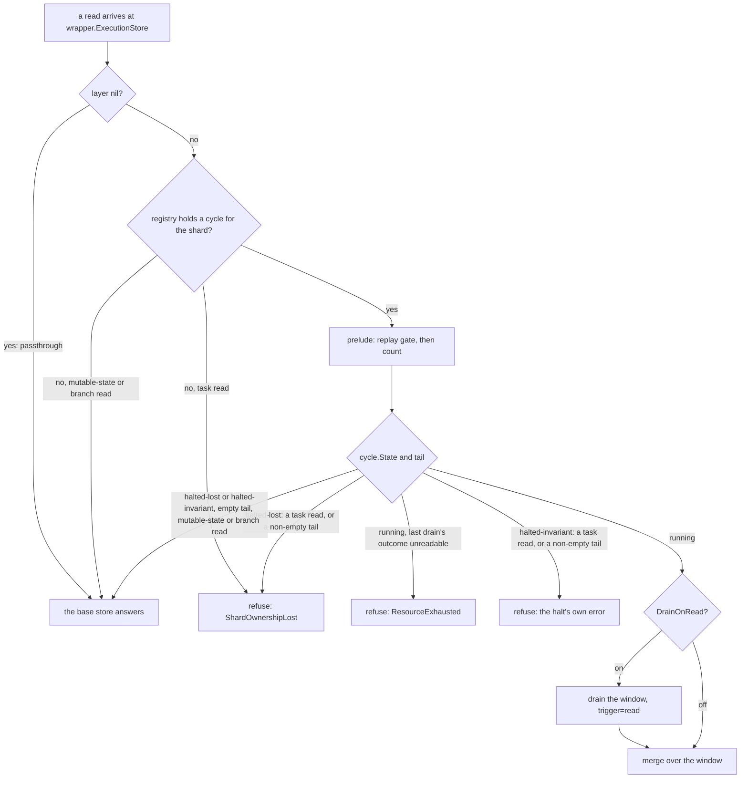
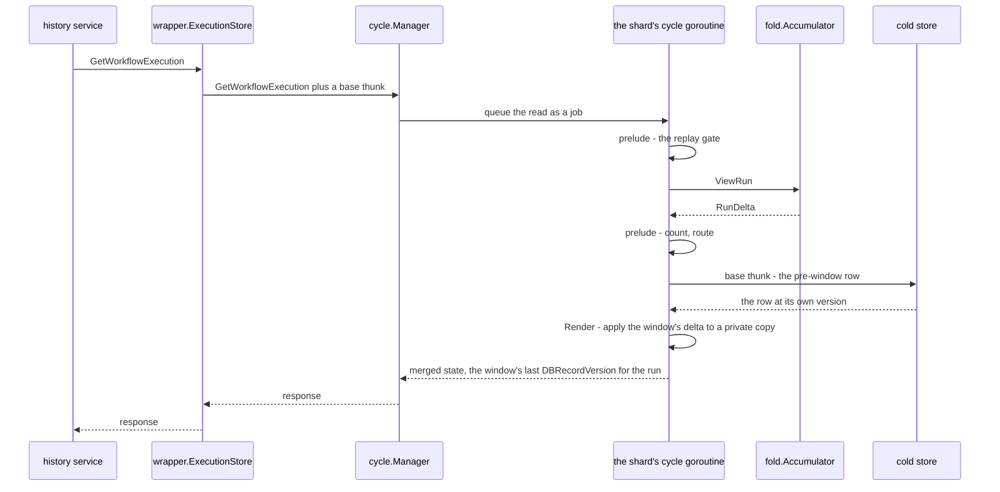
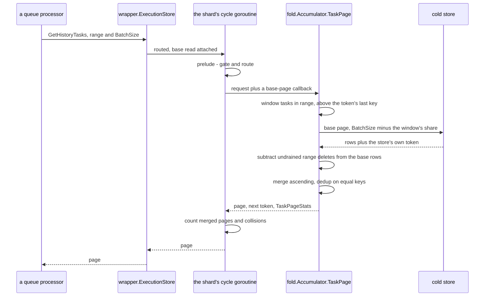

# Reading acknowledged state before it reaches the store

A workflow's mutable state is version 41 in the cold store. An update produces version 42, is
appended to the log and acknowledged, and before the window drains the history service reads the
workflow again. Returning version 41 contradicts an acknowledgement. Omitting an acknowledged task
from a page of tasks is worse: a queue records progress by *range completion*, its checkpoint, a
delete of `[old boundary, new boundary)` whose boundaries abut and only grow (between checkpoints the
progress lives in the queue's memory and reaches the shard row on a jittered timer). A queue that
completes the range a short page covered never asks for the missing task again.

The cold store holds the durable base; the window (the acknowledged mutations not yet drained,
folded in memory) holds the changes on top. A correct read combines them in one of three ways:

* a mutable-state read *overlays* a window snapshot or delta on the cold row;
* a history-task read *merges* two ordered streams and subtracts acknowledged range deletes;
* a history-branch read merges the same way over the window's event batches, with nothing to
  subtract.

All three run on the shard's cycle goroutine, where the drain runs. Below: which reads enter the
layer, who may answer them, the overlay, the merge, and why a committed drain omits some task rows
(invariant [I7](02-concepts-and-invariants.md#the-invariants)).

## 1. Route only reads whose answer can be split

A read enters the layer when an intercepted write can have changed its answer before changing the
cold store. Of the 28 methods of `wrapper.ExecutionStore`, eight are writes intercepted into the log,
four are the reads below, one (`CompleteHistoryTask`) is refused and 15 *transit*: they call the
same-named method on the base store (the wrapped persistence plugin, which writes the cold store) and
return its answer ([chapter 04](04-contracts.md#wrapperexecutionstore--28-methods) has the full
partition).

| Read method | Intercept mode | Why |
|---|---|---|
| `GetWorkflowExecution`, `GetCurrentExecution` | routed | an intercepted write, still only in the log, can have changed the answer |
| `GetHistoryTasks` | routed, merged | a page short a window task is not stale, it is a lost task (below) |
| `ReadHistoryBranch` | routed, merged | the window can hold a record's event batches until a drain lands them |
| `ListConcreteExecutions`, `GetAllHistoryTreeBranches` | transit | scans no caller is harmed by; the layer has no shape for merging a scan |
| `GetHistoryTreeContainingBranch` | transits | whether it should see a window row depends on the deployment's history store, which the layer does not choose |
| `GetReplicationTasksFromDLQ`, `IsReplicationDLQEmpty` | transit | the log does not carry the DLQ |

`wrapper.ShardStore`'s reads (`GetOrCreateShard`, `AssertShardOwnership`) transit too; only
`UpdateShard` is observed, for the epoch. Shard rows are not in the log, because `rangeID` is both
the fencing token and the task-id allocator.

In passthrough mode (`wrapper.Options.Layer == nil`) all 28 methods transit
([chapter 01](01-overview.md#what-mode-names-here) has what "mode" names). Sync mode is not a third
position of that switch: its window is empty at every call boundary, so every read still routes,
overlays and merges over an empty set, and the *hit* counters of
[§6](#6-routed-counters-not-hit-counters) stay at zero.

Routing covers readers inside the owning process only. A reader in another process sees the cold
store as it stands, a consistent past state, never a mixture: behind by up to a window, or by the
whole tail while a drain is stalled ([chapter 01](01-overview.md#what-this-is-not)) or the shard is
halted and no successor has replayed. The task read is the exception: a process holding no cycle for
the shard refuses it rather than pass it to the cold store (§2).

### Why a read served anywhere else is not merely stale

Take a reader in the owning process but off the cycle goroutine. The window and the cold store hand
over at a drain, and the handover takes time:

* the window empties when a drain *starts*: the accumulator (`fold.Accumulator`, the window's
  in-memory fold) is taken and the batch handed to `apply`;
* the tail is settled only when that drain's transaction *commits*.

Between the two a mutation is in neither source, so an answer read there undoes a write the caller
was told had happened ([chapter 02](02-concepts-and-invariants.md#three-positions-not-two) has the
positions). The layer closes the interval by construction, not locking: a read is a job on the cycle
goroutine, which runs the drain, so the interval cannot be observed. The cost is serialising one
shard's reads and writes.

For `GetHistoryTasks` the interval loses tasks. A notification to the queue processors carries at
most a hint (whether anything arrived, or the earliest fire time); the processor re-reads
persistence, so the system survives losing every notification but not losing the read. The server's
own hold-back (`getExclusiveReaderHighWatermark`) is released when the write returns, here the log
append, with the tasks still in the window
([chapter 13](13-designs-that-were-rejected.md#extending-the-servers-own-hold-back)). A queue that
finds nothing in its range completes it, acks past a key it never saw, and no later read shows the
task. [Chapter 13](13-designs-that-were-rejected.md#reads) refuses two other read designs.

## 2. Routing a read, and `DrainOnRead`

Whether the cycle a read reaches may answer it is decided in `Cycle.prelude`, in this order:

1. *The replay gate.* A running cycle that has not replayed an inherited tail replays it here, or
   the read would be answered from a cold store the log is ahead of. The replay resets the
   accumulator, so a view taken before it is of the wrong window.
2. *The count*, before routing so a read sent to the cold store still counts as routed, and before
   the drain so a hit is the window as the read found it. Only the two mutable-state reads count
   here; a task read counts its page on the way in, before the gate. A branch page is not counted
   in `Reads`/`ReadsHeld` (the wrapper counts it in `wal_overlaid_reads`), so a read that never
   touched the overlay cannot satisfy the overlay's hit counter.
3. *The routing rule*, below.
4. *The drain*, only when `DrainOnRead` is on, and after routing, because a halted cycle may not
   drain and a stalled one is refused first.

Figure: the routing decision for all four reads, from the wrapper to the merge. The retired cycle,
whose goroutine is gone, is the table's last row.

```mermaid
flowchart TD
    A["a read arrives at wrapper.ExecutionStore"] --> B{"layer nil?"}
    B -->|"yes: passthrough"| Z["the base store answers"]
    B -->|"no"| C{"registry holds a cycle for the shard?"}
    C -->|"no, mutable-state or branch read"| Z
    C -->|"no, task read"| L["refuse: ShardOwnershipLost"]
    C -->|"yes"| D["prelude: replay gate, then count"]
    D --> E{"cycle.State and tail"}
    E -->|"running, last drain's outcome unreadable"| R["refuse: ResourceExhausted"]
    E -->|"halted-lost: a task read, or a non-empty tail"| L
    E -->|"halted-invariant: a task read, or a non-empty tail"| H["refuse: the halt's own error"]
    E -->|"halted-lost or halted-invariant, empty tail, mutable-state or branch read"| Z
    E -->|"running"| F{"DrainOnRead?"}
    F -->|"on"| G["drain the window, trigger=read"]
    G --> M
    F -->|"off"| M["merge over the window"]
```

A mutable-state read has callers that legitimately do not own the shard, so it may fall through to
the cold store. A task read has one caller, the owning shard's queue processors, and a page short of
the tail would be completed and acked past, so a task page is answered by a running cycle or not at
all. A branch page routes like a mutable-state read: its reader deletes nothing, so a page short the
window's newest event batches is merely stale. Where it falls through, its page token is unwrapped
first (`fold.BaseHistoryToken`), since this layer may have written it on an earlier page.

| The cycle | Mutable-state or branch read | Task read |
|---|---|---|
| running (`loopRoute`) | merged over the window, after a drain if `DrainOnRead` is on | the same |
| running, its last drain's outcome unreadable (`loopRoute`) | `ResourceExhausted` | `ResourceExhausted` |
| the registry holds none for this shard (`noCycleRoute`) | the base store answers | `ShardOwnershipLost` |
| halted-lost (`loopRoute`) | the base store answers if the tail is empty, else `ShardOwnershipLost` | `ShardOwnershipLost`, whatever the tail holds |
| halted-invariant (`loopRoute`) | the base store answers if the tail is empty, else the halt's own error | the halt's own error, whatever the tail holds |
| retired, its goroutine gone (`stoppedRoute`) | the same tail rule | `ShardOwnershipLost` — re-issued on the successor by `Manager.taskPage` where one has superseded it |

The `ResourceExhausted` row is a stall, a previous drain whose outcome cannot be read
([chapter 05](05-write-path.md#7-failed-drain--the-outcome-could-not-be-read)); a stalled cycle in
either halted state takes its halted row instead. Every refusal is returned unwrapped, because the
shard's read and write paths type-switch on the concrete error value.

A cycle that halted inside its replay is replayed again by `Cycle.Close`, which first floors the tail (resets its settled position to the watermark). If that
second log read fails, the retired cycle's published tail (the copy readers see off the cycle
goroutine) is empty, and `stoppedRoute` passes a mutable-state read to a cold store missing those
entries: an open defect in [the durability ledger](../../DURABILITY.md).

An empty tail never relaxes the task-read column. A task page that fell through would hand the
caller the cold store's own token; a rangeID renewal unloads nothing, so the caller keeps
paginating, and the next page lands on a merging cycle that refuses that foreign token (§4).
Finishing on the cold store alone instead drops the window's acked task rows, and the range
completed at the end deletes them.

Each rule is a function of plain values (a state, a tail, which reader is asking) in
[`../../cycle/decide.go`](../../cycle/decide.go), testable over its whole domain with no cycle
running. Epochs, halts and replay are [chapter 06](06-shard-lifecycle.md).

Only a task read reaches `retryOnSuccessor`. If the shard changed hands while a page was built, the
page is discarded and the read re-issued on the replacing cycle, which replays its predecessor's
tail first and so merges over a superset of the old window. There is one retry: superseded twice,
the shard is declared lost.

### `DrainOnRead` is an instrument

`cycle.Config.DrainOnRead` (`drain_on_read` in the `wal` section,
[chapter 08](08-configuration.md#2-table-1--the-wal-sections-keys)) is `false` in `cycle.Defaults()`,
and nothing that ships turns it on. When on, a read first drains the window (tagged `trigger="read"`
on `wal_drains`, `walmetrics.TriggerRead`), so the cold store serves every read and any behaviour
that survives is not the overlay's. The mutable-state reads re-take their view after the drain; the
task merge ([§4](#4-merge-tasks-two-ordered-sources-one-page)) still runs over the emptied window,
tokens and pagination unchanged, and `TaskReadsMerged` (pages that carried a task out of the window)
falls to zero.

## 3. Overlay mutable state: base plus acknowledged change

Version 41 is the base and the update a delta, so the reader needs both. A create is a snapshot and
needs no base; a delete is a tombstone and must hide any row the base still holds. `fold.Accumulator.ViewRun` classifies what the window holds for one run into four shapes
(`fold.RunShape`), and a reader branches on nothing else:

| Shape | Meaning | Needs the cold row? |
|---|---|---|
| `RunAbsent` | the window holds nothing for this run | yes — the base's answer, returned unwrapped, *is* the answer, its NotFound included |
| `RunSnapshot` | the window holds whole state: a Create, a Set, a conflict-resolve's reset, the new run behind a continue-as-new, or a Create behind a tombstone | no — and it must not be |
| `RunDelta` | the window holds a delta: an Update, or a conflict-resolve's current mutation | yes — the answer is base ⊕ delta |
| `RunTombstone` | the window deleted the run | no — the answer is "no such execution", whatever the cold store still holds |

`RunView.NeedsBase()` is `RunAbsent || RunDelta`, a correctness predicate, not an optimisation: no
snapshot-shaped write leaves the run's earlier rows behind. A Set and a conflict-resolve's reset go
through the plugin's reset path, which clears each of the run's collection tables
(`deleteActivityInfoMap` and its six siblings) before writing the snapshot's rows. A Create (plain,
behind a continue-as-new, or behind a tombstone) either asserts the run's absence or rides in the
same transaction as the delete that removed it. Merging the cold store's leftovers would hand the
reader signals, activities, timers and child executions that exist at no point on the sequential
path.

`RunView.Render` merges with `applyMutationToSnapshot`, the fold the drain writes with, so a read
answers with what the drain will write. Both ends of that fold are hand-written field-by-field
mirrors of Temporal's `InternalWorkflowMutableState`: `snapshotOfBase` turns the cold row into the
snapshot the delta folds onto, and `mutableStateOf` turns the result into the read's answer type. A
field either mirror stops filling comes back zero; the caller takes it for an empty collection and
writes the run back without it, and since a snapshot-bearing write clears the run's tables first,
that deletes an acknowledged write. So `TestEveryFieldOfAReadAnswerIsFilled` enumerates the fields
of `InternalWorkflowMutableState` and fails naming the one nothing fills, as `fold/merge_test.go`
does for the write path's folds.

The current-execution row has its own four shapes (`fold.CurrentShape`): `CurrentUnheld`,
`CurrentWritten`, `CurrentGone` and `CurrentGuarded`. `CurrentGuarded` means one or more
`DeleteCurrentWorkflowExecution` guards stand over the base with no window write above them. A
guard removes the row only if it names the guard's run, so the answer is no current execution if
the base row names any guarded run, and the base row unchanged otherwise.

Figure: an `UpdateWorkflowExecution` was acked into the log, the drain has not run, and a
`GetWorkflowExecution` for the same run arrives.

```mermaid
sequenceDiagram
    participant HS as history service
    participant ES as wrapper.ExecutionStore
    participant MG as cycle.Manager
    participant LP as the shard's cycle goroutine
    participant ACC as fold.Accumulator
    participant CS as cold store

    HS->>ES: GetWorkflowExecution
    ES->>MG: GetWorkflowExecution plus a base thunk
    MG->>LP: queue the read as a job
    LP->>LP: prelude - the replay gate
    LP->>ACC: ViewRun
    ACC-->>LP: RunDelta
    LP->>LP: prelude - count, route
    LP->>CS: base thunk - the pre-window row
    CS-->>LP: the row at its own version
    LP->>LP: Render - apply the window's delta to a private copy
    LP-->>MG: merged state, the window's last DBRecordVersion for the run
    MG-->>ES: response
    ES-->>HS: response
```

The `DBRecordVersion` handed out is the window's last write's for the run, the version the merged
request will write; the base's would make the server's next conditional write assert a version
nothing writes. The drain still asserts the head-of-window `fold.RunAssertion.BaseVersion`.

Nothing in the overlay mutates: the accumulator's maps and the base row are copied into a private
snapshot before anything merges, so a later fold cannot rewrite an answer already handed out (the
whole read side of `fold` follows this rule). Nothing is retained either (no cache, no index, no
write-back into the accumulator), so read traffic stays out of the tail budget
([chapter 08](08-configuration.md#5-the-budget-refusal)) and no sequence of reads can change what a
later drain writes.

## 4. Merge tasks: two ordered sources, one page

Suppose the requested range holds cold-store task keys 10 and 30, and acknowledged task 20 is still
in the window. The base alone lets the queue complete past 20; appending gives `10, 30, 20`. The only
valid page is the ordered merge `10, 20, 30`, subject to the batch size and any range delete already
in the window.

`fold.Accumulator.TaskPage` decides what one page holds: the cut, the token, the batch arithmetic,
the dedup and the subtraction of undrained range deletes. `ReadHistoryBranch` merges the same way
(`fold.Accumulator.HistoryPage`), under the same cut rule, with nothing to subtract.

The base page reaches `fold` as a callback (`fold.BasePage`, taking a batch size and a token): the
merge chooses both, but the round trip stays the cycle's, because `fold` may not name a store. The
callback's four requirements (rows inside the range, keys ascending within and across pages, no
empty page beside a token, no more rows than asked for) are checked and refused, not carried.
Temporal's SQL and Cassandra plugins satisfy all four;
[chapter 04](04-contracts.md#fold--the-exported-surface) names each error and what breaks without
it.

The window half of a page is a linear scan and a sort: `fold.Accumulator.Tasks` walks every home
`taskRows` names and sorts by key, and `mergePage` walks that slice whole, counting each visit as
`TaskPageStats.WindowTouched`. A window holds tens of tasks per category, so there is no index or
heap ([chapter 13](13-designs-that-were-rejected.md#a-materialised-per-run-state-or-an-index-over-the-windows-tasks)).

Figure: one page of `GetHistoryTasks`, merged from the window and the cold store.

```mermaid
sequenceDiagram
    participant Q as a queue processor
    participant ES as wrapper.ExecutionStore
    participant LP as the shard's cycle goroutine
    participant TP as fold.Accumulator.TaskPage
    participant CS as cold store

    Q->>ES: GetHistoryTasks, range and BatchSize
    ES->>LP: routed, base read attached
    LP->>LP: prelude - gate and route
    LP->>TP: request plus a base-page callback
    TP->>TP: window tasks in range, above the token's last key
    TP->>CS: base page, BatchSize minus the window's share
    CS-->>TP: rows plus the store's own token
    TP->>TP: subtract undrained range deletes from the base rows
    TP->>TP: merge ascending, dedup on equal keys
    TP-->>LP: page, next token, TaskPageStats
    LP->>LP: count merged pages and collisions
    LP-->>ES: page
    ES-->>Q: page
```

The base is called at most once per page, and not at all once its token says it is exhausted.

### Subtracting undrained range deletes

The window's undrained range deletes are subtracted from the base's rows only, because the window's
own tasks were swept when each range folded in (§5); without it the layer would rely on its caller
never re-reading below a completed range. Each range is applied separately, not their maximum,
because pending ranges need not be contiguous, and with the predicate the store deletes with
([§5](#three-decisions-about-the-drop) has why it must be the same one).

### The ordering and dedup rules

* *Ascending, inside the requested range, no longer than `BatchSize`.* The range is normalised per
  category type first (`taskBounds`): an immediate category compares on task ID, a scheduled one on
  fire time, as the store does.
* *On a tie the base's row wins:* it is the durable copy and the key the queue will complete.
* *The window is merged, not appended.* A shard hands out task ids before the write, so a cold row
  can carry a higher id than a task still in the window.
* *One comparator serves both category types,* because every immediate-category task's `GetKey()`
  returns `NewImmediateKey`, whose fire time is the constant `tasks.DefaultFireTime`.

### The page-token rules

The layer returns its own token (`taskPageToken`), framed with the four-byte magic `wal1`. Its fields
are the whole cursor; no state is kept between calls:

* `Base`: the cold store's own token, verbatim; this layer may not parse or synthesise it.
* `BaseDone`: whether the base is exhausted, a flag because the first page also carries an empty
  `Base`.
* `AfterFireTime` and `AfterTaskID`: the last key this pagination emitted, exclusive. `After`
  records that they are present, because `(0, 0)` is a valid key.

A token without the magic is refused (`fold.ErrForeignPageToken`), not continued on the base alone:
no route hands a caller the base store's token, so a foreign token is no pagination of this layer's,
and answering it from the base would drop the window from every remaining page.

### Where a page is cut

A page may not exceed `BatchSize`, the base's token may be neither parsed nor synthesised, and a
scheduled range can resume only from a fire time. So the cut is at the end of a base page or below
its first row, never inside one (a partly emitted base page would lose rows on one side and
duplicate them on the other): either the whole base page is emitted and its token advances, or none
of it is and the incoming token comes back untouched.

Window tasks displace cold rows rather than adding to them, and two floors make the pagination
terminate:

* `BatchSize` is floored at one, because a page of zero rows would never end the pagination.
* The ask is `max(BatchSize - the window's share, 1)`, because asking the store for nothing would end
  the pagination with rows still in it.

The second floor bounds the waste: if the window alone overflows the page, at most one base row is
discarded, and it returns on the next call with the untouched token. When the base's first row is at
or below the window's first, cutting below it would emit an empty page forever, so the merge emits
that single base row (deduplicated on a tie), which is the whole base page.

### The collision counter

`mergeSorted` counts keys both sources carried. The sources are disjoint by construction: the window
drops a task when the drain carrying it takes the window, and the cold store gains the row only when
that drain commits. A collision means the window still holds a task a committed drain already wrote.
The page is still correct (the base's row wins), so it is counted rather than raised, in
`TaskPageStats.Collisions`, `cycle.Counters.TaskCollisions` and the `wal_merged_task_collisions`
series, and should be zero ([chapter 09](09-operations.md#f-merged-page-collisions-are-non-zero)
has what to do when it is not). `TaskPageStats`'s other fields (`BaseCalls`, `BaseRows`,
`BaseDiscarded`, `WindowTouched`, `Comparisons`, `FromWindow`) are an instrument the corpus tests
measure the merge's cost with, not a contract.

## 5. Invariant I7 — the tasks a drain does not write

### The leak I7 prevents

A merged read offers the window, so a queue can complete a range covering a task whose row is still
in the tail. A drain that then wrote the row would land it below the queue's deletion boundary. The
server's `queueBase.rangeCompleteTasks` deletes `[old, new)` with `old` only rising, so no later
range covers the row and a reloaded queue starts above it: the row is permanent garbage.

Nothing would notice: task rows are plain inserts, a range completion is a bare `DELETE`, and
nothing compares the two. The unmodified server never makes such a row: a task row shares one transaction with the mutable state that produced it, a queue does
not complete a range while a task write is in flight, and a checkpoint completes the range before
writing the queue's state to the shard row. Acknowledging a write before its task rows reach the
store breaks that, so I7 prevents the row rather than detecting it.

*I7:* a task row whose range a caller has already completed is not written. The layer models no ack
level: it applies the range deletes its callers asked for, in their order, and each already names
the rows the caller is finished with.

### Three decisions about the drop

* *The drop is the range, not a bound, swept at fold time.* A `RangeCompleteHistoryTasks` folding
  into the window sweeps every task the window already holds inside `[min, max)`. The drain deletes
  every range before it writes any task row ([chapter 05](05-write-path.md#2-the-drain-itself)), so
  the fold is the only place the caller's order survives.
* *A task arriving after a range is kept.* The log's order is the caller's, so the caller wrote that
  task after the delete, and the sequential path writes it. Pending ranges die with the drain that
  applies them.
* *One predicate answers all three questions* (what the cold store loses, what the window drops,
  what a merged read hides), or some row would be invisible and still there. It is the store's own,
  `fold.TaskRange.Covers`: an immediate category ranged on task id, a scheduled one on fire time at
  microsecond resolution, the resolution a store's timestamp column keeps.

Microseconds matter. Take a range whose maximum is one nanosecond above a task's fire time: in the
store both truncate to the same microsecond, `key < max` is false, and the `DELETE` leaves the row. A
finer comparison in the window would drop the task, a lost timer rather than a leaked row. So a
scheduled task's fire time must survive a store round trip at microsecond resolution or finer; with a
coarser column the sweep drops the task, the merged read hides its row, and the reader completes the
range over both.

### What ranges cost a drain

A range is a predicate, not a key tuple, so unlike the drain's other delete families it cannot
collapse into one statement per family: each range is its own statement, and the statement count
grows with the number of ranges, never with the rows they cover. A range too large for one statement
fails the drain it rides in rather than degrading into pages as a standalone call may
([chapter 05](05-write-path.md#2-the-drain-itself) has why). This known, unfixed limitation loses
nothing; it arrives as an ordinary apply error that no metric distinguishes
([runbook (c)](09-operations.md#c-the-cold-store-is-falling-behind)).

### Every place a task row can live

`fold.Accumulator.taskRows` enumerates, in one walk, every place a task row can live in a window:

* each pending request's task slots;
* that request's orphaned tasks: a tombstoned run's tasks survive its collapse, because a task is
  durable in the tail or in the store;
* the rows an `AddHistoryTasks` put in beside the workflows.

The read, a range's sweep and the drain's written count all walk this one enumeration, because a
home one of them missed would fail silently: a lost timer for the read, a leak for the sweep.

### Why the metric is two counters and not a ratio

A committed drain emits, per task category, `wal_dropped_tasks` and `wal_written_tasks`, never a
share; a category the drain did not carry emits nothing rather than two zeroes. The same pair is on
the drain in `fold.TaskWork.Counts` (one `fold.TaskCounts` per category name) and in
`cycle.Counters` as `DroppedTasks` and `WrittenTasks`. `cycle.Counters.AckedRanges` counts range
deletes folded; a zero there means nothing exercised the drop during the run, so the layer is
untested rather than working.

The drop share is a workload measurement, set mainly by drains per queue checkpoint, so mostly by a
server knob: `history.timerProcessorUpdateAckInterval` and its transfer, visibility, outbound and
archival siblings default to 30 s in the server this module builds on, against the layer's 5 s age
trigger (`cycle.Defaults().Age`), six drains per checkpoint. Fewer drains per checkpoint means a
bigger share; under load, size and refusal drains fire far more often than the age trigger and the
share goes down. No reading of the share means a task was lost; [runbook (e)](09-operations.md#e-task-drops-are-climbing) has how to
read it and which knob to move.

## 6. Routed counters, not hit counters

The read counters `wal_overlaid_reads`, `wal_merged_task_pages`, `cycle.Counters.Reads` and
`cycle.Counters.TaskReads` count reads routed at the layer, not reads the window could answer,
because a hit-only counter reads zero both on a healthy idle cluster and on a layer wired up wrong
(§2 has when each is taken). `cycle.Counters.TaskCollisions` is per shard; the
`wal_merged_task_collisions` series carries no shard tag.

The acceptance's witness (an assertion that the layer was exercised) is built from the hit
counters, `cycle.Counters.ReadsHeld` (the window held the run or the row) and
`cycle.Counters.TaskReadsMerged` (the page carried a task out of the window), because routed reads
that never crossed a held workflow are what an empty layer looks like.
[Chapter 10](10-metrics.md#3-the-reference-table) owns every series, and
[chapter 11](11-verification.md#the-witness) the witness.

## Summary

Until a drain commits, a shard's state is split between the cold store and the window; reading only
one would undo an acknowledged write or let a queue complete a range past a task it never saw. So the
four reads whose answers can be split run on the shard's cycle goroutine, which hides the gap between
a drain taking the window and its commit, at the cost of serialising one shard's reads and writes.

A cycle passes the replay gate, counts the read and applies the routing rule. A mutable-state or
branch read falls through to the cold store when this node holds no cycle for the shard, or its
cycle is halted or retired with an empty tail. A task page is answered by a running cycle or not at
all.

Mutable-state reads overlay one of four window shapes on the cold row with the drain's own fold.
Task and branch reads merge two ordered sources, never splitting a base page. I7 drops task rows
whose range a queue already completed, because writing them would leak rows nothing could detect.

## Where this lives in the code

* [`../../fold/overlay.go`](../../fold/overlay.go) — `RunShape`, `CurrentShape`, the two views,
  `Render`, and the copy-before-merge rule.
* [`../../fold/merge.go`](../../fold/merge.go) — `applyMutationToSnapshot`, the fold the overlay and
  the drain share.
* [`../../fold/taskpage.go`](../../fold/taskpage.go) — the merged task page: pagination, the token
  format, `hideDeleted`, `mergeSorted`, `TaskPageStats`.
* [`../../fold/historypage.go`](../../fold/historypage.go) — the merged branch page and its token.
* [`../../fold/histtasks.go`](../../fold/histtasks.go) — I7 inside the window: `TaskRange.Covers`,
  the sweep, `taskRows`, `TaskCounts`.
* [`../../fold/tasks.go`](../../fold/tasks.go) — the window's tasks as a reader sees them.
* [`../../cycle/read.go`](../../cycle/read.go) — the two mutable-state reads, `Cycle.prelude` and
  `drainForRead`.
* [`../../cycle/tasks.go`](../../cycle/tasks.go) — who may answer a task page; the task-read
  counters.
* [`../../cycle/history.go`](../../cycle/history.go) — who may answer a branch page; the token
  unwrapping.
* [`../../cycle/decide.go`](../../cycle/decide.go) — `readRoute` and the functions of values that
  return it.
* [`../../wrapper/execution_store.go`](../../wrapper/execution_store.go) — the 28-method partition
  and where each read counter is raised.
* [`../../walmetrics/walmetrics.go`](../../walmetrics/walmetrics.go) — the series, routed versus hit.
