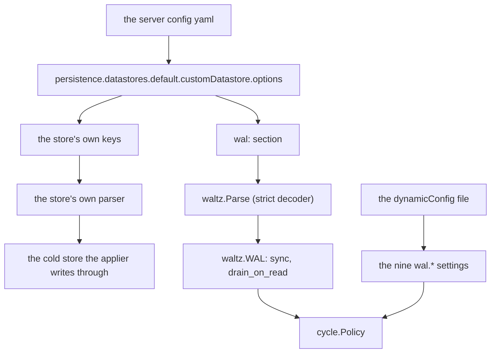
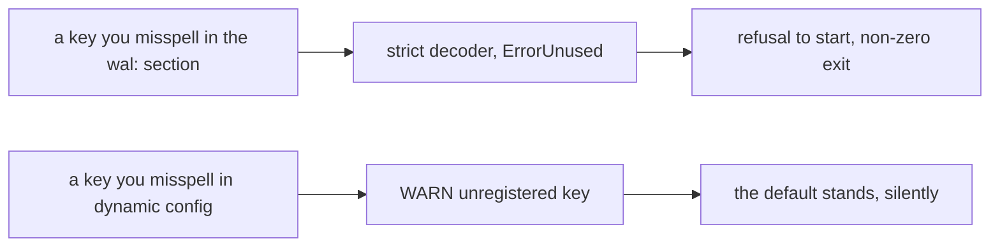
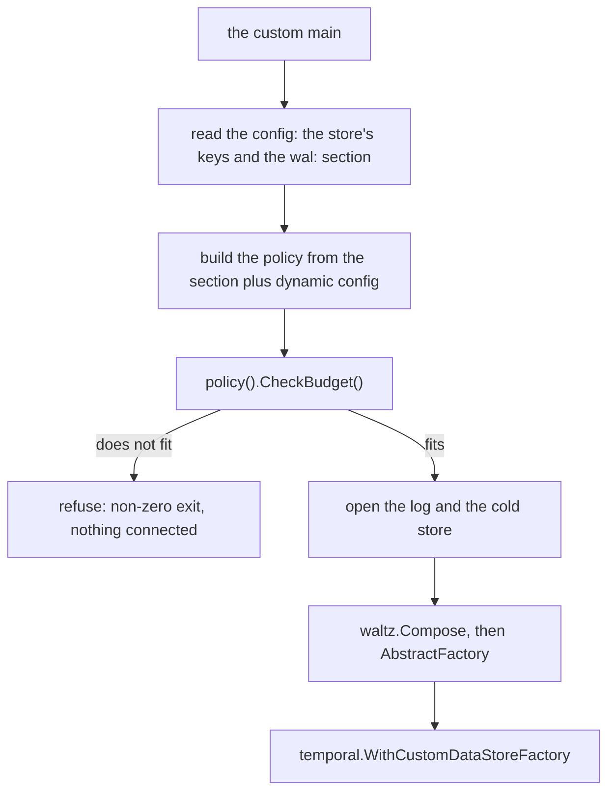

# Choosing the operating envelope

The layer buys fewer cold-store transactions by holding acknowledged work outside the cold store.
Every tuning decision here changes one side of that exchange. A larger window collapses more
mutations into one transaction, but leaves more work to replay after a crash and more bytes in
memory. Trimming more often shortens the retained log, but spends a transaction each time. A larger
per-shard tail bound lets a shard ride out a longer disturbance, but only if the node has memory for
every shard it may own at once.

Configuration is easier to reason about as four questions:

1. **Is the layer enabled at all?** The presence of the static `wal` section answers this.
2. **When should acknowledged work drain or trim?** Five live settings control the running cycle.
3. **How much unapplied work may one node accept?** Four start-up settings, three of which are the
   terms of one memory budget.
4. **Is this production operation or an attribution experiment?** `sync` and `drain_on_read`
   deliberately trade the normal batching path for easier measurement.

The exact keys, defaults and failure modes follow those questions. Three recipes at the end cover
passthrough, the shipped operating point and a small test window.

**Two surfaces configure run-time behaviour, and there is no third.** Whether the layer is on, and
the two experimental switches, live in the server's configuration file; every number of the
operating policy lives in the server's dynamic config. Nothing about this layer's run-time behaviour
is a command-line flag.

One thing is deliberately not configuration at all: **where the log lives and what the cold store
is.** Both arrive as Go values in `waltz.Backends`, built by the `main` that composes the layer. This
library has no key naming a host, a database or a folder, because it has no code that would connect
to one.

---

## 1. Where the section goes

The layer's own section is a key named `wal` **inside the custom datastore's `options` map** — the
same map from which the persistence implementation underneath reads its own endpoint and database.
That placement is deliberate. `options` is a `map[string]any` in the server's own config struct, so
it is the one place in the file format that already admits keys the server does not know. A store's
own decoder ordinarily drops keys it has no field for, so adding a `wal:` key costs an existing
deployment nothing.

Only the **default** datastore's options are read (`persistence.defaultStore`), because the
ExecutionStore and the ShardStore the layer decorates belong to that datastore. A `wal` section on
any other datastore is read by nobody.

```yaml
persistence:
    defaultStore: default
    numHistoryShards: 4
    datastores:
        default:
            customDatastore:
                name: default
                options:
                    # the store's own keys — parsed by the store's own decoder,
                    # never by this layer
                    endpoint: "store.example.net:2135"
                    database: "/local"

                    # the WAL layer's section: two keys, no numbers.
                    # Writing the section at all is what turns intercept mode on.
                    wal:
                        # optional, default false
                        sync: false

                        # optional, default false
                        drain_on_read: false
```

### Absent, present, malformed

| the file says | what the node does |
|---|---|
| no `wal:` key at all | **passthrough**, no error. The store runs exactly as it did without this layer |
| the default datastore is not a `customDatastore` | passthrough, no error |
| `wal:` present, even empty | **intercept** mode, at the shipped defaults |
| an unknown key inside `wal:` | **refusal to start**. The section's decoder runs with `ErrorUnused`, so `snyc: true` is an error rather than a node quietly running differently |
| a key inside `wal:` that is now a dynamic-config setting | **refusal to start, by name**, saying which setting to write instead and whether it needs a restart |
| `WAL:` / `Wal:` instead of `wal:` | **refusal to start**. Both decoders would drop it in silence, and the result would be a node in passthrough under a file that asked for intercept |
| an unknown key *outside* `wal:` | not this layer's business, and not refused: the rest of the options map belongs to the store |

A refusal here is a non-zero exit with **no listening port**: the parse runs before
`temporal.NewServer` is built. See [chapter 09](09-operations.md) for the start-up order.

Diagram — where a key is read and by whom:



How to read this: one map, two parsers, and neither reads the other's keys. Everything the layer
learns from the server config comes down the `wal:` branch; the rest of the options map goes to the
store's own parser, and this layer never reads it. The nine numbers are not in this file at all —
they reach the same `cycle.Policy` from the dynamic-config file.

---

## 2. Table 1 — the `wal` section's keys

Two keys live on this strict, restart-only surface. Each switches the node into an attribution
mode — a configuration you turn on to find out where an observed number came from, not a policy to
run in production. No numeric operating limit lives here, and nothing here says what the layer is
built over.

The shipped configuration leaves both false.

`sync: true` isolates the drain. Every writer waits for a transaction carrying its own mutation and
nothing else, so nothing collapses, and a condition failure the drain discovers *after* the ack has
exactly one caller to attribute it to. That is a weaker property than the windowed path's, not a
stronger one: a windowed write settles every assertion *before* the append, so it is attributable at
any window size ([chapter 05](05-write-path.md#3-failed-write--the-condition-did-not-hold)).

`drain_on_read: true` isolates the overlay. The window is applied before the read it would have been
merged into, so the answer comes from the cold store alone — at the cost of a transaction for every
read that crosses held work.

Each switch turns off the mechanism it exists to expose, which is why neither is a production mode.

| key | type | default | effect | what a typo costs |
|---|---|---|---|---|
| `sync` | bool | `false` | `true` drains inside every write and hands the drain's outcome back to the caller, instead of answering the caller as soon as the log holds the write and applying it later. The debugging configuration, not a shipped mode: the window is one mutation, so nothing collapses and a write costs an append **plus** an apply transaction — more than the store alone. This book describes the layer with `sync` off; where a chapter says a series is always zero — `trigger="sync"`, for instance — that is why | `snyc: true` is a refusal to start, which is the whole reason this key is on the strict surface |
| `drain_on_read` | bool | `false` | `true` makes a read drain the window first, so all three reads are answered by the cold store. An attribution instrument, not a shipped mode; it costs a transaction per read that crosses a window | as above: an unknown key is a refusal to start |

Both are read once, when the node composes its layer. There is no way to change them without a
restart.

Three mechanical consequences of `sync`, for anyone reading a sync-mode run's numbers:

* the append still happens first and the ack is still the append's — `sync` changes when the caller
  is *answered*, not when the entry becomes durable;
* the size triggers are never evaluated. The drain is taken before the window's triggers are
  consulted, so `trigger="mutations"` and `trigger="bytes"` are unreachable and every drain a
  *caller* triggers carries `trigger="sync"` ([chapter 10](10-metrics.md#3-the-reference-table)).
  The one other value a sync node can show is `trigger="replay"`, over the at-most-one in-flight
  entry a killed node leaves behind. A graceful shutdown shows nothing: the window is already
  empty, and an empty batch settles its entries and returns before the drain is counted;
* no delegated base read is taken. `Cycle.check` returns as soon as the accumulator has been
  consulted, because the drain later in the same call asserts everything those reads would have.
  That is also why a sync-mode mutation is encoded with `mutation.EncodeProvisional`: the entry
  becomes durable before its condition has been verified, and replay reads that bit back so an
  inherited provisional entry whose condition fails is dropped rather than treated as a divergence.

What `drain_on_read` does to a read is [chapter
07](07-read-path.md#2-routing-a-read-and-drainonread) and
[`../../cycle/read.go`](../../cycle/read.go); what `sync` does inside a write is `Cycle.add` in
[`../../cycle/cycle.go`](../../cycle/cycle.go).

---

## 3. Table 2 — the nine dynamic-config settings

Every *number* of the policy is a setting of the server's own dynamic config, under the same `wal.`
prefix the section's key has. They are declared in [`../../settings.go`](../../settings.go) at the
module root, and each states its default as a field of `cycle.Defaults()` rather than by repeating
the number, so there is no second copy of the measured policy anywhere.

The nine settings form two groups. Five answer *when should accumulated work move?* They are read at
the decision that consults them, so a change takes effect on a shard this node already holds, with
no re-acquire and no replay. Four answer *how much tail may this process accept?* They are **read at
start-up** — three of them are the factors of a memory budget the node checks before it connects to
anything, and the fourth is read alongside them. Changing any of the four **needs the history
services restarted**.

| key | type | default | when it is read | what it bounds | raising / lowering it |
|---|---|---|---|---|---|
| `wal.windowMutations` | int | `256` | **live** — at the decision | the drain trigger in mutations: the window is applied as one transaction when it holds this many | it sits at the measured collapse knee. Lowering gives collapse away; raising holds more unapplied work per shard |
| `wal.windowBytes` | int | `262144` | **live** | the same trigger in encoded bytes, whichever trips first | as above, in the other unit |
| `wal.windowAge` | duration | `5s` | **live** | how long an idle shard's acked-but-unapplied work waits before it is drained — and therefore what the next owner would replay | a recovery-budget choice, not a measured one. A change takes effect within one window, since the timer is re-armed at every tick. Raising it lengthens replay after a hard restart |
| `wal.trimEvery` | int | `16` | **live** | the trim cadence in drains: the log below the applied watermark is deleted after this many drains | at 1 it is a `DeleteRange` per drain — a transaction per drain for no gain. Raising it leaves more of the log behind, which is what a post-mortem reads |
| `wal.trimAfter` | duration | `1m0s` | **live** | the same cadence in time, whichever trips first | raising `trimEvery` alone does not keep a log: this one fires anyway |
| `wal.hardMaxEntries` | int | `8192` | **START-UP** | invariant [I10](02-concepts-and-invariants.md#the-invariants)'s bound on one shard's tail in entries — what has been acked and not yet applied. A shard at the bound refuses its writers with `ResourceExhausted` rather than parking them behind the apply | it is one half of a bound whose other half is `hardMaxBytes`; neither unit works alone, and a node honouring one from a different edit than the other is a bound nobody wrote |
| `wal.hardMaxBytes` | int | `8388608` | **START-UP** | the same bound in encoded bytes. One workflow near the server's own 8 MB mutable-state limit turns an entries-only bound into a byte budget with no ceiling | arithmetic, not taste: the node's tail budget divided by the shards it may own. It is a factor of the product asserted before the node boots |
| `wal.maxShards` | int | `256` | **START-UP** | what one node may own at once — **not** the cluster's shard count. Nothing counts the shards a node actually holds, so this is the figure the budget arithmetic is done against rather than a limit the layer enforces: the default is a steady-state figure doubled, so that the product still covers a node that has picked up a departed neighbour's shards. [Chapter 14](14-where-the-defaults-came-from.md) says the steady-state figure itself is recorded nowhere | the other factor of the same product |
| `wal.tailBudgetBytes` | int | `2147483648` | **START-UP** | the **encoded** bytes of unapplied tail one node may hold — not heap, which is several times larger ([chapter 14](14-where-the-defaults-came-from.md#what-the-budget-costs-resident)) | `hardMaxBytes × maxShards` must fit in it or the node refuses to start |

> **Why the four marked START-UP are read once rather than live.** Three of them —
> `hardMaxBytes`, `maxShards` and `tailBudgetBytes` — are the factors of the budget assertion,
> whose whole purpose is to refuse a node *before it boots*. A factor that could move afterwards
> would leave that refusal standing for numbers the node is no longer running at.
> `hardMaxEntries` is the fourth. It is not a factor of the product — entries bound recovery time
> rather than memory ([I10](02-concepts-and-invariants.md#i10-at-more-length)) — but it is read
> alongside the other three at boot, because a recovery budget that could halve itself under a
> running node is one nobody wrote either.

[Chapter 14](14-where-the-defaults-came-from.md) has where each of these numbers came from: which
follow from a measurement, which follow from another default, and which are start values nothing
derives.

### What a zero means, per key

A zero does not mean the same thing on every key. That matters because a dynamic-config value can be
set to anything at any moment, including under a node that is already running.

* `wal.windowMutations` and `wal.windowBytes` at zero **drain every write**. Degenerate, but
  somebody can mean it.
* `wal.trimEvery` and `wal.trimAfter` at zero **trim at every drain**. Likewise.
* `wal.windowAge` at zero or negative is **read as the default**, not obeyed. The cycle re-arms its
  age timer from this value, so a zero would fire the tick immediately and then again, forever: a
  goroutine spinning at a whole CPU for every shard the node holds. That is not a policy anybody
  means.
* The four start-up bounds at zero or negative are **read as their defaults** too. Their zero would
  read either as "refuse every write", which stops the shard, or as "hold an unbounded tail", which
  is exactly what I10 exists to prevent.

The filling happens in `cycle.Config.fill`, and it runs at every answer the policy gives rather than
only at the one it was built from — so a dynamic-config key set to zero on a running node is caught
at the next decision, with no restart.

### A process with no dynamic config

If the server is started with no dynamic-config file, it uses a noop client, and every setting above
stands at its own default — which is `cycle.Defaults()`. Nothing is refused and no warning is emitted: a
node with no dynamic config runs the measured policy.

The same holds inside the layer: `waltz.NewPolicy(nil, section)` builds a policy at the settings'
own defaults rather than refusing.

A process with no config file at all — a harness driven by flags, a test driven by an environment
variable — need not render its numbers into dynamic-config key space in order to read them back. It
builds a `cycle.Config` directly (`WAL.StaticConfig()` is the section overlaid on
`cycle.Defaults()`) and hands it to `waltz.Compose` wrapped in `cycle.Fixed`, which is the policy
that does not move.

---

## 4. The two surfaces, and why the line falls where it does

What decides which surface a key belongs on is **the cost of a typo**, and nothing else. It is not
whether the value can change while the node runs: four of the nine dynamic-config settings are read
once at start-up, and they are still on the dynamic surface.



How to read this: what the layer *is* goes on the surface where a mistake is loud, and the numbers it
runs at go on the surface where a mistake is quiet.

* `sync` and `drain_on_read` are what the layer **is** — what it does inside a write and inside a
  read. `snyc: true` must not be a node quietly running differently, and neither must a `WAL:` the
  layer never sees. So they are on the strict surface.
* Every number is on the dynamic-config surface. A mistyped `wal.windowMutations` — say
  `wal.windowMutatons` — leaves the node at the measured policy. That is a different order of wrong,
  and it is the price of having one place to look for a number.

The section has no private half. A run against a real server binary configures itself from a real
yaml file, and the section's decoder runs with `ErrorUnused`, so a key the section does not declare
is a refusal to start. Anything such a run needs to set is therefore a key the section is obliged to
declare, document and default to off — which is why `sync` and `drain_on_read`, which no deployment
ships with, are documented keys in Table 1 rather than hidden ones.

Two consequences follow, and both are enforced:

**No key may live on both surfaces.** Every configurable field of `cycle.Config` is claimed by
exactly one of the two tables above — Table 1's `sync` and `drain_on_read`, or Table 2's nine
settings. A field on neither is one no configuration reaches; a field on both is a number the two
surfaces can disagree about, and there is deliberately **no precedence rule** to settle such a
disagreement. `TestEveryPolicyFieldIsConfigurableOnce`, at the module root, fails either way round.

**A key that moved is refused by name.** The numbers were once section keys, in `snake_case`:
`window_mutations`, `hard_max_bytes`, and so on. Writing one of those in the `wal:` section today is
not reported as an unrecognised key. The layer recognises the old name, refuses to start, and names
the dynamic-config setting to write instead along with whether that setting needs a restart. The
refusal *is* the migration: migrating the value silently would leave a node running a window the
file it was given does not describe.

---

## 5. The budget refusal

Three of the start-up settings are one piece of arithmetic:

```
hardMaxBytes × maxShards  ≤  tailBudgetBytes
```

At the shipped defaults it fits **exactly**: `8388608 × 256 = 2147483648`. So raising
`wal.hardMaxBytes` or `wal.maxShards` without raising `wal.tailBudgetBytes` is a node that refuses
to start.

`waltz.Compose` asserts it, through `cycle.NewManager`, and neither opens anything nor reaches
anything: the check is arithmetic over values already in memory from the two config surfaces, so a
node whose numbers do not fit is refused without a round trip. The same assertion is available to
the composing `main` as `policy().CheckBudget()`. Calling it there, before the log and the cold
store are opened, refuses the node before anything connects to anything — that ordering is the
caller's to choose, but the assertion itself cannot be skipped.



How to read this: `Compose` asserts the budget whatever the caller does, so the check cannot be
skipped; running it ahead of opening anything is what makes a configuration mistake cost zero round
trips.

What the budget bounds is **encoded bytes**, not resident memory. Decoded protobufs and the
accumulator's indices make the live heap several times larger, so a node sized by reading
`tailBudgetBytes` as a memory figure is sized wrong. [Chapter
14](14-where-the-defaults-came-from.md#what-the-budget-costs-resident) has the multiplier the
research prototype measured, what the shipped budget therefore costs with every shard at its bound,
and what that probe did not show. Re-measure that multiplier for the workload being deployed rather
than trusting it, and size the node from your own result. The settings to change are
`wal.tailBudgetBytes` and `wal.hardMaxBytes`, and both need a restart.

**Read traffic does not enter this budget**, because the read path retains nothing
([chapter 07](07-read-path.md#1-route-only-reads-whose-answer-can-be-split)). What a shard holds is
a function of what has been acknowledged and not yet applied, and of nothing else.

**The per-shard bound does not bound what a node may inherit.** `hardMaxBytes` limits what one
*running* cycle may newly acknowledge. It does not limit what a recovering node may be obliged to
apply: a node that picks up many shards at once inherits the sum of their tails, and no setting caps
that sum.

Replay is what keeps that survivable. A recovering cycle reads the log in pages the size of the
window — `wal.windowMutations` entries at a time — and cuts its transactions on the ordinary size
triggers, so one recovering shard's working set is a window rather than a tail, however long the
tail is. What remains is that several of those working sets stack in one process, on top of whatever
live traffic the node is already carrying. That is why `wal.maxShards` is what a node may own *at
once*, and why a budget computed for the steady state rather than for the concurrent-recovery case
holds until the first time it matters.

---

## 6. Three recipes

### 6a. Passthrough

No `wal` section at all. The store runs untouched, the layer composes nothing, and no dynamic-config
setting is consulted.

```yaml
options:
    endpoint: "store.example.net:2135"
    database: "/local"
    # no wal: key
```

Dynamic config: nothing.

### 6b. Intercept, at the shipped defaults

This is the configuration the layer ships with: an empty section, and every number left alone.

```yaml
options:
    endpoint: "store.example.net:2135"
    database: "/local"
    wal: {}
```

Dynamic config: nothing required — every setting stands at the default in Table 2.

Because a node killed without a graceful stop under this policy leaves a tail, the next owner
replays it before it serves anything — [`../../cycle/replay.go`](../../cycle/replay.go),
and [chapter 09](09-operations.md#3-rolling-restarts-and-failover) for what that looks like from
outside.

### 6c. A small window, for testing

A window of a few mutations makes drains frequent and merge-on-read easy to hit, while still holding
more than one mutation at a time. The section is the same empty one as in 6b; only the numbers move.

```yaml
options:
    endpoint: "store.example.net:2135"
    database: "/local"
    wal: {}
```

Dynamic config:

```yaml
wal.windowMutations:   [{value: 2}]
wal.windowBytes:       [{value: 4096}]
wal.windowAge:         [{value: 1s}]
wal.trimEvery:         [{value: 1}]
```

All four are live, so this can be applied to a running node. Leave the four start-up bounds alone
unless you also mean to restart.

---

## 7. What the section does not configure

Between them, the section and the nine settings say how the layer behaves. Neither says what it is
built over: the log and the cold store are Go values in `waltz.Backends`, handed to
`waltz.Compose` by the `main` that composes the layer. Two consequences an operator meets:

* **there is no key to point the layer at a different log**, so a change of backend is a deployment
  of a different binary rather than a configuration change and a restart;
* **whatever the log needs — its own schema, its own migration, its own capacity — is that log's
  deployment step and not this layer's.** Nothing here creates a table, and nothing here refuses to
  start because a table is missing. A log that is not ready fails the first `Fence`, which surfaces
  as a shard that cannot be acquired; [chapter 09](09-operations.md) shows what that looks like on
  the instruments.

---

## Where this lives in the code

* [`../../config.go`](../../config.go) — the `wal` section as a struct, the
  strict decoder, the knobs table joining yaml names to policy fields, and the miscased-section
  refusal.
* [`../../settings.go`](../../settings.go) — the nine dynamic-config settings
  with their descriptions and their live/start-up classification, the moved-key refusal, and the
  function that builds the whole policy from a collection plus a section.
* [`../../cycle/cycle.go`](../../cycle/cycle.go) — the policy struct, `Defaults()` (the
  authority for every number above), the zero-value filling rules, and the budget assertion.
* [`../../cycle/policy.go`](../../cycle/policy.go) — why the policy is a source read at
  each decision rather than a value, and the two constructors for it.
* [`../../cycle/replay.go`](../../cycle/replay.go) — the page size a replay reads with
  and the triggers it cuts on: why a recovering shard's working set is a window and not a tail.
* [`../../waltz.go`](../../waltz.go) — `Compose`, which asserts the budget by way of
  `cycle.NewManager`, and `Backends`, which is everything this file does not configure.
