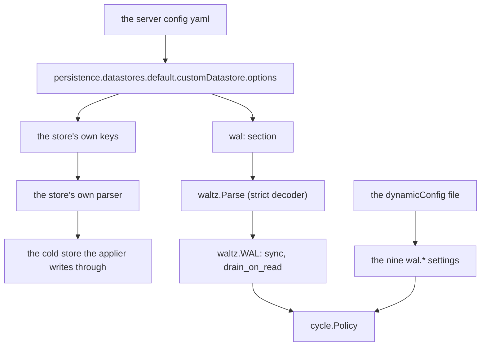
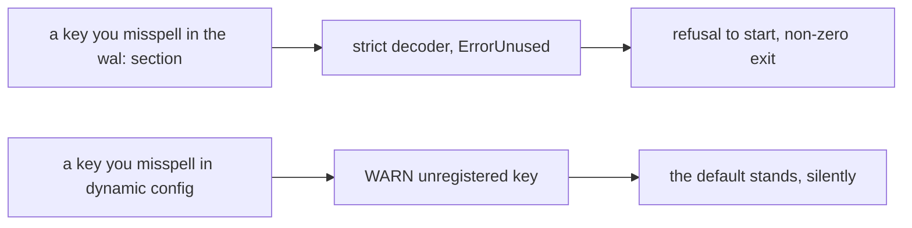
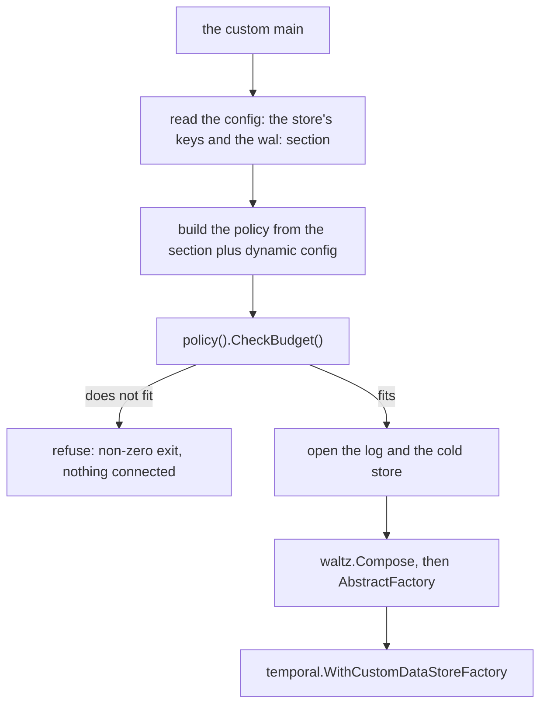

# Choosing the operating envelope

The layer buys fewer cold-store transactions by holding acknowledged work outside the cold store.
Every tuning decision changes one side of that trade. A larger window collapses more mutations into
one transaction, but leaves more work to replay after a crash and more bytes in memory. Trimming
more often shortens the retained log, but spends a transaction each time. A larger per-shard tail
bound lets a shard ride out a longer disturbance, but only if the node's tail budget covers every
shard it may own at once.

Configuration answers four questions:

1. Is the layer enabled at all? The presence of the `wal` section in the server's config file
   answers this.
2. When should acknowledged work drain or trim? Five live settings control the running cycle.
3. How much unapplied work may one node accept? Four start-up settings, three of which are the
   terms of one tail budget.
4. Is this production or an attribution experiment? `sync` and `drain_on_read` trade the normal
   batching path for easier measurement.

There are exactly two surfaces. The `wal` section of the server's config file says whether the layer
is on and holds the two experimental switches. The server's dynamic config holds every number.
Nothing is a command-line flag. The log and the cold store are not configuration at all: they arrive
as Go values in `waltz.Backends`, built by the composing `main`, and no key names a host, a database
or a folder.

---

## 1. Where the section goes

The section is a key named `wal` inside the custom datastore's `options` map, the map the store
underneath reads its own endpoint and database from. `options` is a `map[string]any`, the one place
in the server's file format that admits keys the server does not know, and a store's decoder
ordinarily drops keys it has no field for. Adding `wal:` costs an existing deployment nothing.

`waltz.Parse` reads whatever options map it is handed. The right one is the default datastore's
(`persistence.defaultStore`), which owns the ExecutionStore and ShardStore the layer decorates. A
`wal` section on any other datastore is read by nobody.

```yaml
persistence:
    defaultStore: default
    numHistoryShards: 4
    datastores:
        default:
            customDatastore:
                name: default
                options:
                    # the store's own keys — parsed by the store's own decoder,
                    # never by this layer
                    endpoint: "store.example.net:2135"
                    database: "/local"

                    # the WAL layer's section: two keys, no numbers.
                    # Writing the section at all is what turns intercept mode on.
                    wal:
                        # optional, default false
                        sync: false

                        # optional, default false
                        drain_on_read: false
```

Where a request's event history goes is not a key. It is a property of the cold store the node
composed: an applier that declares `cold.HistoryApplier` takes the batches in the drain's own
publication, and one that does not has them written through it before the append. So there is no
second place for the answer to disagree with the store.

### Absent, present, malformed

| the file says | what the node does |
|---|---|
| no `wal:` key at all | passthrough, no error. The store runs as it did without this layer |
| the default datastore is not a `customDatastore` | passthrough, no error |
| `wal:` present, even empty | intercept mode, at the shipped defaults |
| an unknown key inside `wal:` | refusal to start. The section's decoder runs with `ErrorUnused`, so `snyc: true` is an error rather than a node quietly running differently |
| a key inside `wal:` that is now a dynamic-config setting | refusal to start, by name, saying which setting to write instead and whether it needs a restart |
| `WAL:` / `Wal:` instead of `wal:` | refusal to start. Both decoders would drop it in silence, leaving a node in passthrough under a file that asked for intercept |
| an unknown key outside `wal:` | not refused: the rest of the options map belongs to the store |

A refusal is a non-zero exit with no listening port, provided the `main` parses before it builds
`temporal.NewServer` ([chapter 09](09-operations.md) has the start-up order).

Each key has one reader, and one map feeds two parsers:


```mermaid
flowchart TD
  F["the server config yaml"] --> P["persistence.datastores.default.customDatastore.options"]
  P --> A["the store's own keys"]
  P --> B["wal: section"]
  A --> C["the store's own parser"]
  B --> D["waltz.Parse (strict decoder)"]
  C --> E["the cold store the applier writes through"]
  D --> G["waltz.WAL: sync, drain_on_read"]
  H["the dynamicConfig file"] --> I["the nine wal.* settings"]
  G --> J["cycle.Policy"]
  I --> J
```

Neither parser reads the other's keys. The nine numbers reach the same `cycle.Policy` from the
dynamic-config file, not this one.

---

## 2. Table 1 — the `wal` section's keys

The section holds two keys, both off in the shipped configuration. Both are attribution modes: you
turn one on to find out which part of the layer an observed number came from.

`sync: true` isolates the drain. Every writer waits for a transaction carrying only its own
mutation, so nothing collapses and a condition failure found after the ack has one caller to blame.
This is weaker than the windowed path, not stronger: a windowed write settles every assertion before
the append, so it is attributable at any window size
([chapter 05](05-write-path.md#3-failed-write--the-condition-did-not-hold)).

`drain_on_read: true` isolates the overlay. The window is applied before the read it would have
been merged into, so the answer comes from the cold store alone, at a transaction per read that
crosses held work.

Each switch turns off the mechanism it exposes (collapse, or merge-on-read), so neither is for
production.

| key | type | default | effect | what a typo costs |
|---|---|---|---|---|
| `sync` | bool | `false` | `true` drains inside every write and returns the drain's outcome to the caller, instead of answering as soon as the log holds the write and applying it later. The window is one mutation, so a write costs an append plus an apply transaction, more than the store alone. This book describes the layer with `sync` off: where another chapter says a series stays at zero (`wal_answered_condition_failures`, `wal_replay_dropped_entries`), it means with `sync` off | `snyc: true` is a refusal to start |
| `drain_on_read` | bool | `false` | `true` makes a read drain the window first, so all four reads are answered by the cold store | as above |

Both are read once, when the node composes its layer, so changing either needs a restart.

Three consequences matter when reading a sync-mode run's numbers:

* The append still comes first and the ack is still the append's. `sync` changes when the caller is
  answered, not when the entry becomes durable.
* The size triggers are never evaluated. The drain is taken before they are consulted, so
  `trigger="mutations"` and `trigger="bytes"` are unreachable and every caller-triggered drain
  carries `trigger="sync"` ([chapter 10](10-metrics.md#3-the-reference-table)). The only other
  value is `trigger="replay"`, over the at-most-one in-flight entry a killed node leaves. A graceful
  shutdown shows nothing: the window is empty, and an empty batch settles and returns before the
  drain is counted.
* No delegated base read is taken. `Cycle.check` returns once the accumulator is consulted, because
  the drain later in the same call asserts everything those reads would have. So the mutation is
  encoded with `mutation.EncodeProvisional`: the entry is durable before its condition is verified,
  and replay reads that bit back, so an inherited provisional entry whose condition fails is dropped
  rather than treated as a divergence.

What `drain_on_read` does to a read is in [chapter
07](07-read-path.md#2-routing-a-read-and-drainonread) and
[`../../cycle/read.go`](../../cycle/read.go). What `sync` does inside a write is `Cycle.add` in
[`../../cycle/cycle.go`](../../cycle/cycle.go).

---

## 3. Table 2 — the nine dynamic-config settings

Every number of the policy is a dynamic-config setting under the `wal.` prefix, declared in
[`../../settings.go`](../../settings.go). Each takes its default from a field of `cycle.Defaults()`,
so the policy has one copy of each number.

The nine fall into two groups. Five decide when accumulated work moves. They are read at the
decision that consults them, so a change reaches a shard the node already holds, with no re-acquire
and no replay. Four decide how much tail the process may accept. They are read at start-up, and
changing one needs the history services restarted.

| key | type | default | when it is read | what it bounds | raising / lowering it |
|---|---|---|---|---|---|
| `wal.windowMutations` | int | `256` | live, at the decision | the drain trigger in mutations: the window is applied as one transaction when it holds this many | sits at the collapse knee the research prototype measured on its workload (chapter 14). Lowering gives up collapse, raising holds more unapplied work per shard |
| `wal.windowBytes` | int | `262144` | live | the same trigger in encoded bytes, whichever trips first | as above, in the other unit |
| `wal.windowAge` | duration | `5s` | live | how long an idle shard's acked-but-unapplied work waits before it is drained (at least this long and under twice it, since the timer ticks once per `windowAge`), and so what the next owner would replay | a recovery-budget choice, not measured. A change takes effect within one window (the timer is re-armed at every tick). Raising it lengthens replay after a hard restart |
| `wal.trimEvery` | int | `16` | live | the trim cadence in drains: the log at or below the watermark is deleted after this many drains | at 1, a `Log.Trim` (a transaction) per drain for no gain. Raising it leaves more log for a post-mortem |
| `wal.trimAfter` | duration | `1m0s` | live | the same cadence in time, whichever trips first. It is judged when a drain commits, so an idle shard does not trim on this timer | raising `trimEvery` alone does not keep a log: this one fires anyway, at the first drain past it |
| `wal.hardMaxEntries` | int | `8192` | START-UP | invariant [I10](02-concepts-and-invariants.md#the-invariants)'s bound on one shard's tail in entries (acked and not yet settled). A shard at the bound refuses its writers with `ResourceExhausted` rather than parking them behind the apply | change it together with `hardMaxBytes`: the two are one bound and are read together at start-up |
| `wal.hardMaxBytes` | int | `8388608` | START-UP | the same bound in encoded bytes. One workflow near the server's own 8 MB mutable-state limit turns an entries-only bound into a byte budget with no ceiling | derived: the node's tail budget divided by the shards it may own. It is a factor of the product checked before the node boots |
| `wal.maxShards` | int | `256` | START-UP | what one node may own at once, not the cluster's shard count. Nothing compares it with the shards a node holds and no acquire is refused past it: it is the figure the budget arithmetic uses, not an enforced limit. The default is a steady-state figure doubled, to cover a node that has picked up a departed neighbour's shards; nothing records where the steady-state figure comes from ([chapter 14](14-where-the-defaults-came-from.md)) | the other factor of the same product |
| `wal.tailBudgetBytes` | int | `2147483648` | START-UP | the encoded bytes of unapplied tail one node may hold. Not heap, which is several times larger ([chapter 14](14-where-the-defaults-came-from.md#what-the-budget-costs-resident)) | `hardMaxBytes × maxShards` must fit in it or the node refuses to start |

The START-UP settings are read once because three of them (`hardMaxBytes`, `maxShards`,
`tailBudgetBytes`) are the factors of the budget check in section 5, which runs before the node
boots. A factor that moved afterwards would leave the check vouching for numbers the node no longer
runs at. `hardMaxEntries` is not a factor (entries bound recovery time, not memory, see
[I10](02-concepts-and-invariants.md#i10-at-more-length)), but it is read with them so a recovery
budget cannot halve itself under a running node. [Chapter 14](14-where-the-defaults-came-from.md)
says which defaults follow from a measurement, which from another default, and which are start
values nothing derives.

### What a zero means, per key

A dynamic-config value can be set to zero under a running node, and zero means different things:

* `wal.windowMutations` and `wal.windowBytes` at zero drain every write. Degenerate, but meaningful.
* `wal.trimEvery` and `wal.trimAfter` at zero trim at every drain. Likewise.
* `wal.windowAge` at zero or negative is read as the default. The age timer is re-armed from this
  value, so a zero would fire forever: a goroutine spinning a CPU per shard.
* The four start-up bounds at zero or negative are read as their defaults. Their zero would mean
  either "refuse every write", which stops the shard, or "hold an unbounded tail", which I10
  prevents.

`cycle.Config.fill` does the filling at every answer the policy gives, so a zero set on a running
node is caught at the next decision.

### A process with no dynamic config

A server with no dynamic-config file uses a noop client, and every setting stands at
`cycle.Defaults()`, with no refusal and no warning. `waltz.NewPolicy(nil, section)` likewise builds
a policy at the defaults.

A process with no config file at all, such as a harness driven by flags or a test, can skip
dynamic-config keys. It builds a `cycle.Config` directly (`WAL.StaticConfig()` is the section
overlaid on `cycle.Defaults()`) and hands it to `waltz.Compose` wrapped in `cycle.Fixed`, the
policy that does not move.

---

## 4. The two surfaces, and why the line falls where it does

A key's surface is chosen by what a typo costs. A misspelt key in the `wal` section stops the node;
a misspelt dynamic-config key logs `WARN unregistered key` and the default stands. So the two
switches that change what the layer does live in the section, and every number lives in dynamic
config, including the four read only at start-up.


```mermaid
flowchart LR
  A["a key you misspell in the wal: section"] --> B["strict decoder, ErrorUnused"]
  B --> C["refusal to start, non-zero exit"]
  D["a key you misspell in dynamic config"] --> E["WARN unregistered key"]
  E --> F["the default stands, silently"]
```

So `snyc: true` or a `WAL:` section stops the node, while a mistyped `wal.windowMutatons` leaves it
at the shipped policy. That is a milder kind of wrong, and the price of one place to look for a
number.

The section has no hidden keys: its decoder rejects anything undeclared, so any switch a run against
a real server binary needs is declared, documented and off by default. That is why `sync` and
`drain_on_read` are in Table 1.

Two rules follow, and both are enforced.

No key lives on both surfaces. Every configurable field of `cycle.Config` belongs to exactly one
table. A field on neither is unreachable, and a field on both could disagree with itself with no
precedence rule to settle it. `TestEveryPolicyFieldIsConfigurableOnce`, at the module root, fails
either way round.

A key that moved is refused by name. The numbers were once section keys in `snake_case`
(`window_mutations`, `hard_max_bytes`, and so on). Writing one in `wal:` today stops the node with a
message naming the dynamic-config setting to write instead and whether it needs a restart.
Migrating the value silently would leave a node running a window its file does not describe.

---

## 5. The budget refusal

Three of the start-up settings are one piece of arithmetic:

```
hardMaxBytes × maxShards  ≤  tailBudgetBytes
```

At the shipped defaults it fits exactly: `8388608 × 256 = 2147483648`. So raising
`wal.hardMaxBytes` or `wal.maxShards` without raising `wal.tailBudgetBytes` gives a node that
refuses to start.

`waltz.Compose` asserts it through `cycle.NewManager`, and that assertion cannot be skipped. It
makes no round trip, but by then the caller has already opened the log and the cold store. The
composing `main` can run the same check earlier as `policy().CheckBudget()`, so a bad configuration
is refused before anything connects.

Figure: a `main` that checks the budget before it opens anything.


```mermaid
flowchart TD
  A["the custom main"] --> B["read the config: the store's keys and the wal: section"]
  B --> C["build the policy from the section plus dynamic config"]
  C --> D["policy().CheckBudget()"]
  D -->|"does not fit"| E["refuse: non-zero exit, nothing connected"]
  D -->|"fits"| F["open the log and the cold store"]
  F --> G["waltz.Compose, then AbstractFactory"]
  G --> H["temporal.WithCustomDataStoreFactory"]
```

The budget bounds encoded bytes, not resident memory. Decoded protobufs and the accumulator's
indices make the heap several times larger, so do not read `tailBudgetBytes` as a memory figure.
[Chapter 14](14-where-the-defaults-came-from.md#what-the-budget-costs-resident) has the multiplier
the research prototype measured, what the shipped budget costs with every shard at its bound, and
what that probe did not show. Re-measure the multiplier for your workload and size the node from
that. The settings to change are `wal.tailBudgetBytes` and `wal.hardMaxBytes`, both restart-only.

Read traffic does not enter the budget, because the read path retains nothing
([chapter 07](07-read-path.md#1-route-only-reads-whose-answer-can-be-split)). A shard holds only
what was acknowledged and not yet applied.

The per-shard bound does not bound what a node inherits. `hardMaxBytes` limits what one running
cycle may newly acknowledge, but a node that picks up many shards inherits the sum of their tails,
and no setting caps that sum. Replay keeps it survivable: a recovering cycle reads the log in pages
of `wal.windowMutations` entries and cuts transactions on the ordinary size triggers, so its working
set is a window however long the tail. Several such working sets can still stack in one process on
top of live traffic. That is why `wal.maxShards` counts what a node may own at once, and why a
budget sized for the steady state rather than concurrent recovery fails when it first matters.

---

## 6. Three recipes

### 6a. Passthrough

No `wal` section at all. The store runs untouched, the layer composes nothing, and no dynamic-config
setting is consulted.

```yaml
options:
    endpoint: "store.example.net:2135"
    database: "/local"
    # no wal: key
```

Dynamic config: nothing.

### 6b. Intercept, at the shipped defaults

This is the configuration the layer ships with: an empty section, and every number left alone.

```yaml
options:
    endpoint: "store.example.net:2135"
    database: "/local"
    wal: {}
```

Dynamic config: nothing required — every setting stands at the default in Table 2.

A node killed without a graceful stop under this policy leaves a tail, and the next owner replays it
before it serves anything ([`../../cycle/replay.go`](../../cycle/replay.go);
[chapter 09](09-operations.md#3-rolling-restarts-and-failover) shows what that looks like from
outside).

### 6c. A small window, for testing

A small window makes drains frequent and merge-on-read easy to hit. The section is the empty one
from 6b, and only the numbers move. Use 16, not 2: at 2 a shard spends most of its time inside its
own drains, and on one emulated node that pushed upstream's timing-sensitive suites past their
deadlines. At 16 they are green
([chapter 14](14-where-the-defaults-came-from.md#a-small-window-costs-more-than-it-looks-the-research-prototypes-16)).

```yaml
options:
    endpoint: "store.example.net:2135"
    database: "/local"
    wal: {}
```

Dynamic config:

```yaml
wal.windowMutations:   [{value: 16}]
wal.windowBytes:       [{value: 4096}]
wal.windowAge:         [{value: 1s}]
wal.trimEvery:         [{value: 1}]
```

All four are live, so this can be applied to a running node. Leave the four start-up bounds alone
unless you also mean to restart.

---

## 7. What the section does not configure

The configuration says how the layer behaves, not what it is built over. The log and the cold store
are Go values in `waltz.Backends`, handed to `waltz.Compose` by the composing `main`. Two
consequences follow:

* No key points the layer at a different log. A change of backend is a different binary, not a
  configuration change.
* What the log needs (schema, migrations, capacity) is its own deployment step. Nothing here creates
  a table or refuses to start because one is missing. A log that is not ready fails the first
  `Fence`, which surfaces as a shard that cannot be acquired ([chapter 09](09-operations.md) shows
  how that looks on the instruments).

---

## Summary

The `wal` section in the default datastore's `options` map turns the layer on by being present and
holds two attribution switches, `sync` and `drain_on_read`, both off in production. Its decoder is
strict, so a typo, a miscased section or a moved key stops the node before it listens (provided the
`main` parses before it builds the server).

Every number is one of nine `wal.*` dynamic-config settings. Five decide when work drains and trims
and are read live. Four bound the tail and are read at start-up, and three of them must satisfy
`hardMaxBytes × maxShards ≤ tailBudgetBytes`. The budget counts encoded bytes, not heap, and does not
cap what a node inherits on failover. [Chapter 09](09-operations.md) covers running a node with
these settings, and [chapter 14](14-where-the-defaults-came-from.md) says where each default came
from.

---

## Where this lives in the code

* [`../../config.go`](../../config.go) — the `wal` section as a struct, the
  strict decoder, the knobs table joining yaml names to policy fields, and the miscased-section
  refusal.
* [`../../settings.go`](../../settings.go) — the nine dynamic-config settings
  with their descriptions and their live/start-up classification, the moved-key refusal, and the
  function that builds the whole policy from a collection plus a section.
* [`../../cycle/cycle.go`](../../cycle/cycle.go) — the policy struct, `Defaults()` (the
  authority for every number above), the zero-value filling rules, and the budget assertion.
* [`../../cycle/policy.go`](../../cycle/policy.go) — why the policy is a source read at
  each decision rather than a value, and the two constructors for it.
* [`../../cycle/replay.go`](../../cycle/replay.go) — the page size a replay reads with
  and the triggers it cuts on: why a recovering shard's working set is a window and not a tail.
* [`../../waltz.go`](../../waltz.go) — `Compose`, which asserts the budget by way of
  `cycle.NewManager`, and `Backends`, which is everything this file does not configure.
