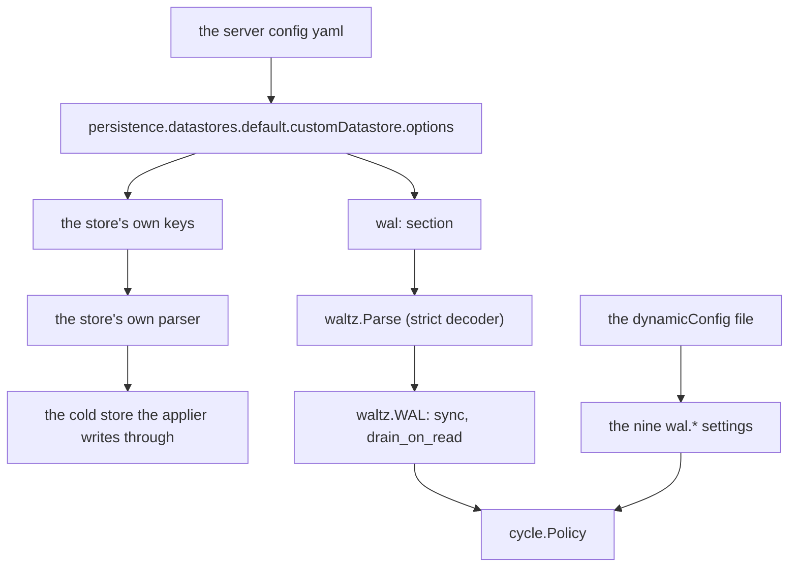
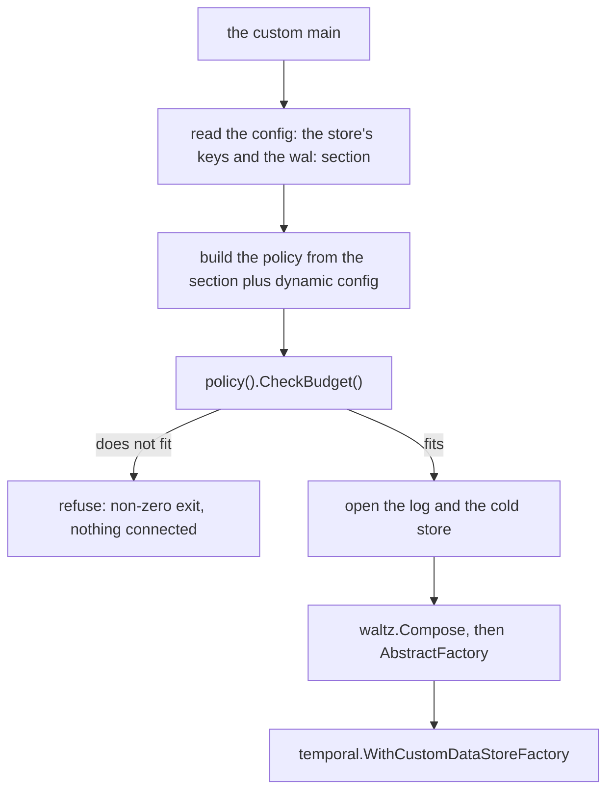

# Choosing the operating envelope

The layer buys fewer cold-store transactions by holding acknowledged work outside the cold store,
and every tuning decision moves one side of that trade. A larger window collapses more mutations into
one transaction, but leaves more work to replay after a crash and more bytes in memory. Trimming
more often shortens the retained log, but spends a transaction each time. A larger per-shard tail
bound lets a shard ride out a longer disturbance, but only if the node's tail budget covers every
shard it may own at once.

Configuration answers four questions:

1. Is the layer on? The presence of a `wal` section in the server's config file says so.
2. When does acknowledged work drain or trim? Five live settings.
3. How much unapplied work may one node accept? Four start-up settings, three of them the terms of
   one tail budget.
4. Is this production or an attribution experiment? `sync` and `drain_on_read` trade the batching
   path for easier measurement.

Two surfaces, no flags: the `wal` section holds the switches, dynamic config every number.

---

## 1. Where the section goes

The section is a key named `wal` inside the custom datastore's `options` map, beside the store's own
endpoint and database. `options` is a `map[string]any`, the one place in the server's file format
that admits unknown keys, and a store's decoder ordinarily drops keys it has no field for, so adding
`wal:` costs an existing deployment nothing. It belongs in the default datastore's map
(`persistence.defaultStore`), which owns the ExecutionStore and ShardStore the layer decorates.
`waltz.Parse` reads whatever map it is handed, and a `wal` section on any other datastore is read
by nobody.

```yaml
persistence:
    defaultStore: default
    numHistoryShards: 4
    datastores:
        default:
            customDatastore:
                name: default
                options:
                    # the store's own keys, never parsed by this layer
                    endpoint: "store.example.net:2135"
                    database: "/local"

                    # the layer's section: its presence turns intercept mode on
                    wal:
                        sync: false           # optional, default false
                        drain_on_read: false  # optional, default false
```

Figure: one map feeds two parsers, and each key has one reader.


```mermaid
flowchart TD
  F["the server config yaml"] --> P["persistence.datastores.default.customDatastore.options"]
  P --> A["the store's own keys"]
  P --> B["wal: section"]
  A --> C["the store's own parser"]
  B --> D["waltz.Parse (strict decoder)"]
  C --> E["the cold store the applier writes through"]
  D --> G["waltz.WAL: sync, drain_on_read"]
  H["the dynamicConfig file"] --> I["the nine wal.* settings"]
  G --> J["cycle.Policy"]
  I --> J
```

### Absent, present, malformed

| the file says | what the node does |
|---|---|
| no `wal:` key | passthrough, no error. The store runs as it did without this layer |
| the default datastore is not a `customDatastore` | passthrough, no error |
| `wal:` present, even empty | intercept mode, at the shipped defaults |
| an unknown key inside `wal:` | refusal to start. The decoder runs with `ErrorUnused`, so `snyc: true` is an error |
| a key inside `wal:` that is now a dynamic-config setting | refusal to start, by name (§4) |
| `WAL:` / `Wal:` instead of `wal:` | refusal to start. Otherwise the store's decoder would ignore it and `waltz.Parse` would never see it, leaving passthrough under a file that asked for intercept |
| an unknown key outside `wal:` | not refused: the rest of the options map belongs to the store |

A refusal is a non-zero exit with no listening port, provided the `main` parses before it builds
`temporal.NewServer` ([chapter 09](09-operations.md) has the start-up order).

---

## 2. Table 1 — the `wal` section's keys

The section holds two keys, both off in the shipped configuration. Both are attribution modes: you
turn one on to find out which part of the layer an observed number came from, and each turns off
the mechanism it exposes, so neither is for production.

| key | type | default | effect |
|---|---|---|---|
| `sync` | bool | `false` | Isolates the drain. `true` drains inside every write and returns the drain's outcome to the caller, instead of answering once the log holds the write. The window is one mutation, so nothing collapses and a write costs an append plus an apply transaction, more than the store alone |
| `drain_on_read` | bool | `false` | Isolates the overlay. `true` makes a read drain the window first, so all four routed reads ([chapter 07](07-read-path.md#1-route-only-reads-whose-answer-can-be-split)) are answered by the cold store alone, at a transaction per read that crosses held work |

Both are read once, when the node composes its layer, so changing either needs a restart.

Under `sync` a condition failure found after the ack has exactly one caller to answer; the windowed
path decides every condition before the append, so it never needs this
([chapter 05](05-write-path.md#3-failed-write--the-condition-did-not-hold)). This book describes the
layer with `sync` off: where another chapter says a series stays at zero
(`wal_answered_condition_failures`, `wal_replay_dropped_entries`), it means with `sync` off.

Two things matter when reading a sync-mode run:

* The append still comes first and the ack is still the append's. `sync` changes when the caller is
  answered, not when the entry becomes durable.
* Drains carry only `trigger="sync"` or `"replay"`, no
  [delegated read](05-write-path.md#what-the-delegated-read-costs) is taken, and entries are encoded
  provisional, so replay may drop one whose condition fails
  ([chapter 05](05-write-path.md#sync-modes-drain)).

What `sync` does inside a write is `Cycle.add` in [`../../cycle/cycle.go`](../../cycle/cycle.go);
what `drain_on_read` does to a read is in
[chapter 07](07-read-path.md#2-routing-a-read-and-drainonread).

---

## 3. Table 2 — the nine dynamic-config settings

Every number of the policy is a dynamic-config setting under the `wal.` prefix, declared in
[`../../settings.go`](../../settings.go), and each takes its default from a field of
`cycle.Defaults()`, so the policy has one copy of each number.

Five settings decide when accumulated work moves. They are read at the decision that consults
them, so a change reaches a shard the node already holds, with no re-acquire and no replay. Four
bound the tail and are read at start-up, so changing one needs the history services restarted.
Three of those are the factors of the budget check (§5), which runs before the node boots: a factor
that moved afterwards would leave the check vouching for numbers the node no longer runs at.
`hardMaxEntries` is not a factor (entries bound recovery time, not memory, see
[I10](02-concepts-and-invariants.md#i10-at-more-length)), but it is read with them so a recovery
budget cannot halve itself under a running node.

| key | type | default | what it bounds | raising / lowering it |
|---|---|---|---|---|
| `wal.windowMutations` | int | `256` | live. The drain trigger in mutations: the window is applied as one transaction at this many | lower gives up collapse, higher holds more unapplied work per shard |
| `wal.windowBytes` | int | `262144` | live. The same trigger in encoded bytes, whichever trips first | as above, in the other unit |
| `wal.windowAge` | duration | `5s` | live. How long an idle shard's acked-but-unapplied work waits to drain (at least this long, under twice it: the timer ticks once per `windowAge`), and so what the next owner would replay | takes effect within one window, since the timer is re-armed at every tick. Higher lengthens replay after a hard restart |
| `wal.trimEvery` | int | `16` | live. The trim cadence in drains: the log at or below the watermark is deleted after this many drains | at 1, a `Log.Trim` (a transaction) per drain for no gain. Higher leaves more log for a post-mortem |
| `wal.trimAfter` | duration | `1m0s` | live. The same cadence in time, whichever trips first. It is judged when a drain commits, so an idle shard does not trim on this timer | raising `trimEvery` alone does not keep a log: this one fires anyway, at the first drain past it |
| `wal.hardMaxEntries` | int | `8192` | START-UP. Invariant [I10](02-concepts-and-invariants.md#the-invariants)'s bound on one shard's tail in entries (acked and not yet settled). A shard at the bound refuses its writers with `ResourceExhausted` rather than parking them behind the apply | change it together with `hardMaxBytes`: the two are one bound |
| `wal.hardMaxBytes` | int | `8388608` | START-UP. The same bound in encoded bytes. Needed because one entry can approach the server's 8 MB mutable-state limit, so an entries bound alone caps no bytes | factor of the budget check (§5) |
| `wal.maxShards` | int | `256` | START-UP. What one node may own at once, not the cluster's shard count. Not enforced: no acquire is refused past it | factor of the budget check (§5) |
| `wal.tailBudgetBytes` | int | `2147483648` | START-UP. The encoded bytes of unapplied tail one node may hold, not heap (§5) | factor of the budget check (§5) |

[Chapter 14](14-where-the-defaults-came-from.md) says which defaults follow from a measurement,
which from another default, and which are start values nothing derives.

### What a zero means, per key

A value can be set to zero under a running node, and zero means different things per key:

* `wal.windowMutations` and `wal.windowBytes` at zero drain every write, and `wal.trimEvery` and
  `wal.trimAfter` at zero trim at every drain. Degenerate, but meaningful.
* `wal.windowAge` at zero or negative is read as the default. The age timer is re-armed from this
  value, so a zero would fire forever, a goroutine spinning a CPU per shard.
* The four start-up bounds at zero or negative are read as their defaults. Their zero would mean
  either "refuse every write", which stops the shard, or "hold an unbounded tail", which I10
  prevents.

`cycle.Config.fill` applies these rules at every answer the policy gives, so a zero set on a running
node is caught at the next decision.

### A process with no dynamic config

A server with no dynamic-config file uses a noop client, and every setting stands at
`cycle.Defaults()`, with no refusal and no warning; `waltz.NewPolicy(nil, section)` likewise. A
process with no config file at all, such as a test or a harness driven by flags, builds a
`cycle.Config` directly (`WAL.StaticConfig()` is the section overlaid on `cycle.Defaults()`) and
hands it to `waltz.Compose` wrapped in `cycle.Fixed`, the policy that does not move.

---

## 4. The two surfaces, and why the line falls where it does

A key's surface is chosen by what a typo costs. A misspelt key in the `wal` section stops the node;
a misspelt dynamic-config key logs `WARN unregistered key` and the default stands. That is a milder
failure, accepted so every number has one home. So the switches that change what the layer does
live in the section, and every number lives in dynamic config, including the four read only at
start-up. Test runs configure the real binary through the same strict section, so any switch they
need is a documented key that defaults to off, as `sync` and `drain_on_read` are.

Two rules follow, and both are enforced:

* No key lives on both surfaces. Every configurable field of `cycle.Config` belongs to exactly one
  table: a field on neither is unreachable, and a field on both could disagree with itself with no
  precedence rule. `TestEveryPolicyFieldIsConfigurableOnce`, at the module root, fails either way
  round.
* A moved key is refused by name. A `snake_case` number in `wal:` (`window_mutations`,
  `hard_max_bytes`, and so on) stops the node with a message naming the dynamic-config setting to
  write instead and whether it needs a restart. Migrating the value silently would leave a node
  running a window its file does not describe.

---

## 5. The budget refusal

Three start-up settings are one inequality:

```
hardMaxBytes × maxShards  ≤  tailBudgetBytes
```

At the shipped defaults it fits exactly: `8388608 × 256 = 2147483648`. So raising
`wal.hardMaxBytes` or `wal.maxShards` without raising `wal.tailBudgetBytes` gives a node that
refuses to start.

`waltz.Compose` asserts it through `cycle.NewManager`, and that assertion cannot be skipped, but by
then the caller has already opened the log and the cold store. The composing `main` can run the
same check earlier as `policy().CheckBudget()`, which makes no round trip, so a bad configuration is
refused before anything connects.

Figure: a `main` that checks the budget before opening anything.


```mermaid
flowchart TD
  A["the custom main"] --> B["read the config: the store's keys and the wal: section"]
  B --> C["build the policy from the section plus dynamic config"]
  C --> D["policy().CheckBudget()"]
  D -->|"does not fit"| E["refuse: non-zero exit, nothing connected"]
  D -->|"fits"| F["open the log and the cold store"]
  F --> G["waltz.Compose, then AbstractFactory"]
  G --> H["temporal.WithCustomDataStoreFactory"]
```

The budget bounds encoded bytes, not resident memory: decoded protobufs and the accumulator's
indices make the heap several times larger.
[Chapter 14](14-where-the-defaults-came-from.md#what-the-budget-costs-resident) has the multiplier
the research prototype measured, what the shipped budget costs with every shard at its bound, and
what that probe did not show. Re-measure the multiplier for your workload, size the node from it,
and change `wal.tailBudgetBytes` and `wal.hardMaxBytes`, both restart-only.

Read traffic does not enter the budget: the read path retains nothing
([chapter 07](07-read-path.md#1-route-only-reads-whose-answer-can-be-split)), so a shard holds only
what was acknowledged and not yet applied.

The per-shard bound does not bound what a node inherits. `hardMaxBytes` limits what one running
cycle may newly acknowledge, but a node that picks up many shards inherits the sum of their tails,
and no setting caps that sum. Replay keeps it survivable: a recovering cycle reads the log in pages
of `wal.windowMutations` entries and cuts transactions on the ordinary size triggers, so its working
set is a window however long the tail. Several such windows can stack on top of live traffic, so
size `wal.maxShards` and the budget for concurrent recovery, not the steady state.

---

## 6. Three recipes

### 6a. Passthrough

No `wal` section. The store runs untouched, the layer composes nothing, and no dynamic-config
setting is consulted.

```yaml
options:
    endpoint: "store.example.net:2135"
    database: "/local"
    # no wal: key
```

### 6b. Intercept, at the shipped defaults

An empty section; every setting stands at the default in Table 2. A hard kill is recovered by
replay ([chapter 09](09-operations.md#3-rolling-restarts-and-failover)).

```yaml
options:
    endpoint: "store.example.net:2135"
    database: "/local"
    wal: {}
```

### 6c. A small window, for testing

A small window makes drains frequent and merge-on-read easy to hit. The section is `wal: {}` as in
6b, and only the dynamic config moves. Do not go below 16: smaller windows push upstream's
timing-sensitive suites past their deadlines
([chapter 14](14-where-the-defaults-came-from.md#a-small-window-costs-more-than-it-looks-the-research-prototypes-16)).

```yaml
wal.windowMutations:   [{value: 16}]
wal.windowAge:         [{value: 1s}]
wal.trimEvery:         [{value: 1}]
```

Leave `wal.windowBytes` at its default so the mutation trigger sets the window, as in the research
prototype, which moved only that trigger; the age and trim lines are optional and exercise those
paths more often. All three are live, so this applies to a running node.

---

## 7. What the section does not configure

The configuration says how the layer behaves, not what it is built over. The log and the cold store
are Go values in `waltz.Backends`, handed to `waltz.Compose` by the composing `main`. So:

* No key names a host, a database or a folder, and none points the layer at a different log. A
  change of backend is a different binary.
* What the log needs (schema, migrations, capacity) is its own deployment step. Nothing here creates
  a table or refuses to start because one is missing. A log that is not ready fails the first
  `Fence`, which surfaces as a shard that cannot be acquired ([chapter 09](09-operations.md) shows
  how that looks on the instruments).
* Where a request's event history goes is not a key but a property of the composed cold store: an
  applier that declares `cold.HistoryApplier` takes the batches in the drain's own publication, and
  one that does not has them written through it before the append.

---

## Summary

A `wal` section in the default datastore's `options` map turns the layer on by being present and
holds two attribution switches, `sync` and `drain_on_read`, both off in production. Its strict
decoder stops the node on a typo, a miscased section or a moved key.

Every number is one of nine `wal.*` dynamic-config settings: five drain and trim triggers read live,
four tail bounds read at start-up, three of which must satisfy
`hardMaxBytes × maxShards ≤ tailBudgetBytes`. The budget counts encoded bytes, not heap, and does not
cap what a node inherits on failover. [Chapter 09](09-operations.md) covers running a node, and
[chapter 14](14-where-the-defaults-came-from.md) where each default came from.

---

## Where this lives in the code

* [`../../config.go`](../../config.go) — the `wal` section, its strict decoder, the knobs table
  joining yaml names to policy fields, and the miscased-section refusal.
* [`../../settings.go`](../../settings.go) — the nine dynamic-config settings with their live or
  start-up classification, the moved-key refusal, and the function that builds the policy from a
  collection plus a section.
* [`../../cycle/cycle.go`](../../cycle/cycle.go) — the policy struct, `Defaults()` (the authority
  for every number above), the zero-value filling rules, and the budget assertion.
* [`../../cycle/policy.go`](../../cycle/policy.go) — the policy as a source read at each decision,
  and its two constructors.
* [`../../cycle/replay.go`](../../cycle/replay.go) — the page size and triggers a replay cuts on.
* [`../../waltz.go`](../../waltz.go) — `Compose`, which asserts the budget through
  `cycle.NewManager`, and `Backends`.
