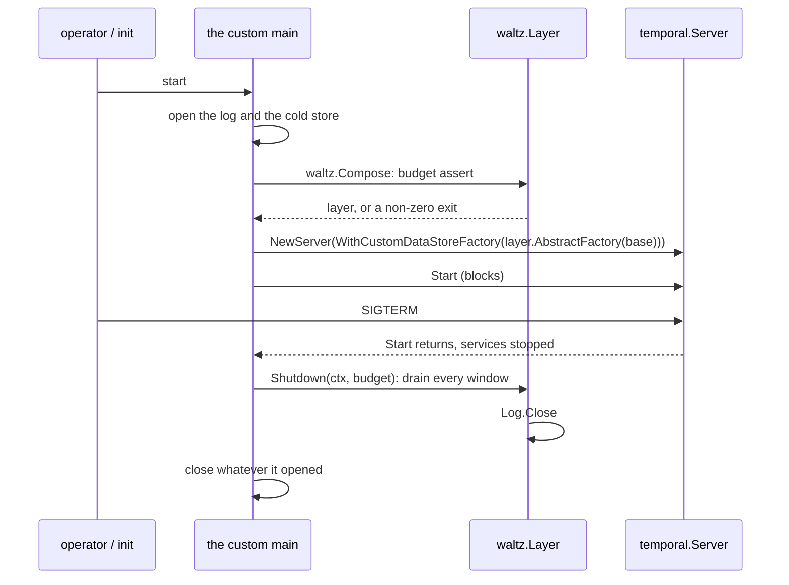
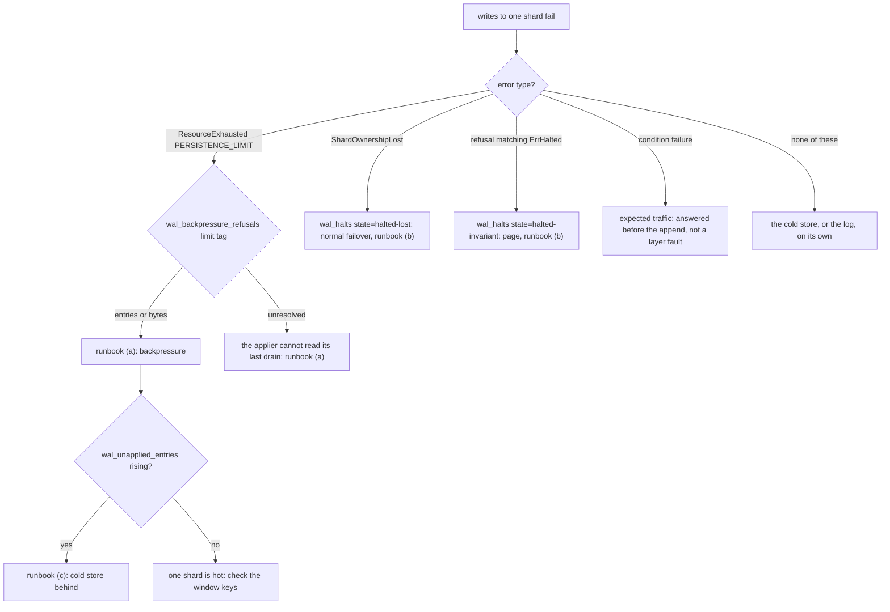

# Running, deploying and debugging it

The first node starts with an empty log. It acquires a shard, appends work, and begins
draining windows. During the next rollout that node is stopped; another node fences the shard and
replays whatever the first left behind. If all goes well, callers notice neither the handoff nor the
fact that some acknowledged state briefly lived outside the cold store.

Operations must keep that story true. Setup must happen before writers appear.
Shutdown should reduce replay work but may never be required for correctness. A normal ownership
loss must be distinguishable from a correctness halt, and two identical `ResourceExhausted` errors
can demand opposite responses depending on whether the tail is full or a transaction outcome is
unknown.

This chapter follows the system through deployment and a rolling restart, turns to incident
diagnosis — the routing tree first, then the runbooks it routes into — and closes with a developer
appendix that nothing before it depends on. Configuration keys remain in [chapter
08](08-configuration.md); metric names and tag values remain in [chapter
10](10-metrics.md#3-the-reference-table). Here, they serve as evidence for a decision.

---

## 1. Deployment

waltz is a library, so what deploys is a custom `temporal-server` binary somebody writes over it. It
adds one decorator to the shipped server's composition: `waltz.AbstractFactory` wraps the base
abstract data store factory the server would otherwise have used. Everything else — flags, services,
authorizer, dynamic config — keeps upstream's shape, so an existing deployment's command lines carry
over.

What that binary owns, and this library does not, is **everything that has to exist before a shard is
acquired**: the log's storage and whatever schema it needs, the cold store's, and the credentials for
both. There is no `--setup-wal` here and no schema step, because there is no schema: the log is a
`wal.Log` value the binary constructs, and if constructing it requires a migration, that migration
belongs to the log's own deployment.

### The checklist

1. **Write the `wal` section.** It is a two-key map — `sync` and `drain_on_read` — inside the default
   datastore's own `options`, and writing the section at all is what turns intercept mode on. An
   **absent** section is passthrough; an unknown key inside it is a refusal to start, not a fallback
   to passthrough. Every *number* is a dynamic-config setting under `wal.*`. Where the section goes
   in the config tree, what each key costs when mistyped, and the ready-made configurations are
   [08-configuration.md](08-configuration.md#1-where-the-section-goes).

2. **Make the log ready before any node starts.** Whatever that means for the log being deployed —
   a migration, a topic, a set of tables, a quorum that is up. Nothing in this layer creates it and
   nothing verifies it, so a log that is not ready is discovered at the first `Fence`, which is a
   shard that cannot be acquired. A binary that wants the earlier, louder failure does the check
   itself, before it composes the layer.

3. **Restart the history services.** Both keys on the strict surface (`sync`, `drain_on_read`) and
   the four start-up dynamic-config settings (`wal.hardMaxEntries`, `wal.hardMaxBytes`,
   `wal.maxShards`, `wal.tailBudgetBytes`) are read while the policy is built, so changing them means
   a restart of the processes that run the history service.

4. **Verify.** Watch `wal_intercepted_writes` become non-zero: it is the series that says traffic is
   going through the log at all. A binary that logs its own start-up line ought to say which mode it
   composed and at what window, because the failure this catches is silent from both ends — a node
   that came up in passthrough under a file asking for intercept looks healthy, and so does a node
   intercepting when nobody meant it to.

---

## 2. Start and stop order

Two rules, and moving either is not a refactor:

* **layer before server.** The layer is composed (`waltz.Compose`) before `temporal.NewServer`, so
  that the node-budget assertion causes the binary not to start rather than a log line behind a
  listening port. `Compose` opens nothing, so a binary that composes before it dials tells an
  operator whose numbers do not fit without waiting for a connection.
* **close after `Start` returns.** `Layer.Shutdown(ctx, budget)` is the shutdown drain: every shard
  that still holds a window is applied into the cold store, one transaction per shard, in sequence.
  It must run when the writers are gone — `temporal.Server.Start` blocks until the interrupt fires
  and every service has stopped, so the deferred close after it is exactly that moment. **The cold
  store must still be open at that point**, which is the one ordering constraint the composing binary
  owns: the server closes its own data store factory's client on the way down, so an applier riding
  that factory drains into a closed client. A binary whose applier holds a connection of its own
  closes it after `Shutdown` and not before.

The drain's budget is the caller's. A drain the budget cuts short is **not** data loss: the entries
are in the log, acked, and the next owner replays them. It costs that owner a read loop and a
transaction before it serves anything.

That budget is real time rather than whatever is left of the caller's: the drain runs on a context
detached from the cancellation that shutdown itself just fired (`context.WithoutCancel`), so it gets
the whole budget. A drain inheriting that cancellation would return at once, leaving a tail behind
and nothing in the log that says so.

One process brings up one layer, whatever services it runs. The server calls `NewFactory` once per
service, but those factories share the already-composed `waltz.Layer`; `NewFactory` supplies each
service's store factory and options. A shard's cycle therefore carries its epoch from the acquire
through the writes that follow.

Start-up and shutdown, in order:



How to read this: the arrow into `waltz.Layer` before `NewServer` is the refusal, because a budget
that does not fit ends the process there. The last three are the drain, placed after `Start`
returned on purpose, and the binary's own close placed after the drain.

---


## 3. Rolling restarts and failover

A graceful stop is an optimisation, not the foundation of recovery. It tries to drain each held
window and thereby leaves less for a successor, but process death can interrupt it at any point.
Correctness instead comes from fencing plus replay: the new owner establishes a newer epoch before
using the tail, then starts above the watermark committed by the old owner.

A shard is owned by one node at a time, fenced by an epoch carried in the shard's rangeID; the
ownership rules are [06-shard-lifecycle.md](06-shard-lifecycle.md).

**When a node goes away**, gracefully or not:

* on a graceful stop the shutdown drain empties as many windows as the budget allows, so the next
  owner usually inherits little or nothing;
* on `kill -9` there is no drain, and the node leaves a **tail**: entries acked into the log and
  not yet applied to the cold store. Nothing is lost.

**What the next owner replays**: it reads the watermark, then the range `(appliedSeqno, commitSeqno]` in
pages of the window's own size, folds them into a fresh accumulator, cuts them into transactions by
the size watermarks, and ends in a drain. The age watermark is not consulted — everything here is
already as old as the incident. Replay is triggered by the first read or write that reaches the
shard, inside the cycle's own goroutine, so a request arriving mid-replay is parked on the loop
rather than refused.

**What to expect in the metrics during a failover**:

* `wal_replayed_entries` rises on the new owner — this is the only place it moves, so a failover
  with a flat counter here means the tail was empty;
* `wal_drains` gains `trigger="replay"` observations;
* `wal_halts` gains `state="halted-lost"` on the *old* owner, if it is still alive and tries to
  write. That is fencing working, and it must not page;
* `wal_unapplied_entries` spikes on the new owner and falls back as the replay drains.

During a rolling restart, do the nodes one at a time and let `wal_unapplied_entries` settle before
taking the next one: a node taking over shards while its own tail is still being replayed is the
same load twice.

---

## 4. "Writes to one shard are failing" — where to go

Incident response begins with what the caller observed, not with a graph that happens to be open.
Route the symptom first, then read the runbook the route names.



How to read this: start from the error the *caller* saw, not from the dashboard. The two
`ResourceExhausted` branches differ by the `limit` tag on `wal_backpressure_refusals`: `entries`
and `bytes` are I10's size bound, while `unresolved` is the applier being blind rather than behind —
it cannot say whether its last drain committed, so nothing may be applied over it, and no size knob
will clear it.

---

## 5. Runbooks

Seven of them, each explaining the mechanism behind a symptom the tree above has already routed.
Each names the metric series and the configuration key involved. The series are
[10-metrics.md](10-metrics.md#3-the-reference-table), including the alert shape for each of the
conditions below; the keys are
[08-configuration.md](08-configuration.md#3-table-2--the-nine-dynamic-config-settings).

### (a) A shard stopped accepting writes — backpressure or an unresolved drain

* **Symptom.** Callers get `serviceerror.ResourceExhausted` with cause `PERSISTENCE_LIMIT` and
  scope `SYSTEM`. Read the `limit` tag on `wal_backpressure_refusals` before choosing the response.
* **What `entries` or `bytes` means.** Invariant
  [I10](02-concepts-and-invariants.md#the-invariants)'s per-shard bound is doing its job: the tail —
  acked and not yet settled — reached `wal.hardMaxEntries` or `wal.hardMaxBytes`, so the shard
  refuses new writes rather than growing a tail it cannot discharge. The error says `shard N's WAL
  tail is at its limit (…/… entries, …/… bytes): the apply cycle is behind`.
* **What to check for `entries` or `bytes`.** `wal_unapplied_entries` (is the applier behind?),
  `wal_drains` (are drains committing at all?), `wal_halts`, and the cold store's health — this is
  nearly always a cold-store problem rather than a layer one.
* **What to do for `entries` or `bytes`.** Fix the cold store. Refusals stop by themselves once the
  applier catches up. Raising `wal.hardMaxEntries`/`wal.hardMaxBytes` needs a restart and is
  arithmetic, not taste: `hardMaxBytes × maxShards` must fit in `wal.tailBudgetBytes` or the node
  refuses to boot. That budget counts encoded bytes, not resident heap; measure the decoded-memory
  multiplier for the workload before raising it; the one in
  [chapter 14](14-where-the-defaults-came-from.md#what-the-budget-costs-resident) is somebody
  else's.
* **What `unresolved` means.** The last drain returned an unknown outcome and the cycle could not
  read `appliedSeqno`, its only witness to whether the transaction committed. This is a stalled
  tail, not a halt: writers and readers are refused so nothing can be applied over an ambiguous
  transaction. No size knob clears it.
* **What to do for `unresolved`.** Restore reads of the cold store's `appliedSeqno` watermark — the
  seqno the drain's own transaction carried, read back through `cold.Watermarker`. The age tick
  re-reads it without operator intervention: a watermark at or above the drain's seqno
  releases the stall and traffic resumes; a watermark below it proves the drain did not commit and
  turns the shard into `halted-invariant`, at which point follow runbook (b). If the watermark
  remains unreadable, retain the log and the original drain error and escalate the storage failure.

Nothing was written by any refused call in this runbook: all three checks run before the append.
The history node's handling of `PERSISTENCE_LIMIT` keeps the shard loaded and slows its queues
instead of DLQ-ing tasks.

Nothing has to be reconciled afterwards either. The refused writes are retried at the versions they
were refused at — a caller that was told "no" still holds the row it read, so its assertion still
stands — and once the applier catches up, a replay reads back exactly the acknowledged set, in
order, gap-free, with none of the refusals in it. That is the concrete reason `ResourceExhausted` is
the right answer here and a condition failure is not.

What the bound buys is bounded consequences, not independence. If the log lives in the same database
as the cold store, a database-wide incident is an incident of both halves at once and there is no
window in which backpressure is the interesting behaviour at all. Putting the log where the cold
store cannot take it down is a deployment choice, and it is what the contract in
[04-contracts.md](04-contracts.md#what-the-contract-does-not-say-what-an-append-costs) and the
import ban in [03-components.md](03-components.md) exist to allow.

### (b) A shard halted — and which of the two classes

* **Symptom.** `wal_halts` moved. Which refusal the shard answers with depends on the class, and it
  is the cheapest way to tell them apart: `ShardOwnershipLost` under `halted-lost`, and the halt's
  own error, matching `cycle.ErrHalted`, under `halted-invariant`.
* **What it means — read the `state` tag, and never sum the two:**
  * `state="halted-lost"` — the shard was fenced away. This is fencing working: the halted cycle
    drops its *window*, the tail is kept, nothing is trimmed, and the next owner replays it. Writes come back as
    `ShardOwnershipLost`, which the server handles by re-acquiring. Expect it on every failover and
    on every rolling restart. **Not an alert.**
  * `state="halted-invariant"` — an assertion failed inside a window whose failure could not be
    pinned on one caller. There is no retry and no failover: the layer deliberately does not convert
    this into an ownership-lost, because handing a divergence to the next owner as an ordinary
    failover would spread it. **This is the one that pages.**
* **What to check.** For `halted-invariant`, the log line carrying the cause (an
  `apply.InvariantViolationError`, an encode failure, or `cycle.ErrTailNotEmpty` — "the log holds an
  entry at a seqno this cycle replayed past"). Correlate with `wal_replayed_entries` on that shard.
* **What to do.** `halted-lost`: nothing. `halted-invariant`: capture the shard's log before
  anything trims it (a halted cycle's log is not its own to shorten, so it will still be there), and
  treat it as a correctness incident.
* **There is no path back.** No tool, no supported edit and no documented procedure returns a
  `halted-invariant` shard to service. `Cycle.State` is terminal — for as long as that cycle exists it refuses
  every write, and every routed read whose answer its tail is still holding; once the tail is empty,
  mutable-state reads fall through to the cold store again — and because the halt is deliberately not an ownership loss, nothing re-acquires the
  shard on its own. Nothing about the halt is durable either: the state is in memory, so a process
  restart, or any acquire at a strictly greater epoch, installs a fresh cycle that reads the
  watermark and replays the same tail. Whether the shard writes again therefore turns on whether the
  divergence was in the entries or in the attempt — an ambiguous apply outcome may not recur on
  replay, while a genuine disagreement between what the layer folded and what the store holds is met
  again by the replaying cycle and halts again. The log survives either way, which is why capturing
  it comes first: that capture is the input to deciding whether to restart at all, and deciding is
  all the layer offers.

### (c) The cold store is falling behind

* **Symptom.** `wal_unapplied_entries` climbing and not returning; `wal_window_age` climbing.
* **What it means.** Entries are being acked into the log faster than drains commit them. The
  layer is absorbing an incident, which is what it is for — but the runway is bounded by
  `wal.hardMaxEntries` / `wal.hardMaxBytes`, and past it you get runbook (a).
* **What to check.** `wal_drains` by `trigger` — a healthy node drains on `trigger="mutations"` or
  `trigger="bytes"`; a node draining almost only on `trigger="age"` is idle rather than behind.
  `wal_drained_mutations` against `wal_drained_workflows` gives the collapse ratio: if it is near 1,
  the batches are not collapsing and the drains are as expensive as the writes.
* **One shape that is not the cold store being slow.** A completed task range large enough to trip a
  limit of the store's own fails the *whole drain* that carried it: the range delete rides the
  drain's single transaction and so cannot page the way a standalone `RangeCompleteHistoryTasks`
  can. It arrives as an apply error like any other and no series distinguishes it, so read the
  drain's logged error; the mechanism is [05-write-path.md](05-write-path.md).
* **What to do.** Address the cold store. If the shard is simply hot, `wal.windowMutations` and
  `wal.windowBytes` are read at the decision, so they can be moved without a restart — but lowering
  them gives collapse away, and raising them holds more unapplied work per shard.

### (d) Trims are failing

* **Symptom.** `wal_trims` with `outcome="failed"` — the counter's other value is
  `outcome="started"`.
* **What it means.** The trim is the lazy deletion of log entries below the applied watermark. It
  runs beside the apply cycle, not in it, and a failed trim is logged, retried at the next cadence,
  and **halts nothing**. This counter is the only place a failing trim is visible.
* **What to check.** Whether it is failing on every cadence or occasionally. Trimming is part of
  the latency budget rather than hygiene — it is
  what keeps the log small, and how much that costs is the log's business — so a permanently failing
  trim degrades write latency over hours, not minutes.
* **What to do.** The cadence knobs are `wal.trimEvery` (in drains) and `wal.trimAfter` (in time),
  whichever trips first; both are read at the decision, so no restart. Note that raising
  `wal.trimEvery` alone does not keep a log around for a post-mortem — `wal.trimAfter` fires anyway.
* **How much log is left to read is computable.** The cycle trims to the applied watermark with no
  safety lag, so what survives is bounded by `wal.trimEvery` × `wal.windowMutations` entries plus
  whatever the tail currently holds — 4096 entries at the shipped defaults, however long the shard
  has been running, and less on a low-traffic shard where the age trigger fires first. Where those
  two numbers came from is
  [14-where-the-defaults-came-from.md](14-where-the-defaults-came-from.md#the-trim-cadence-16-drains-or-60-seconds).

### (e) Task drops are climbing

* **Symptom.** `wal_dropped_tasks` rising against `wal_written_tasks`, both tagged by task
  category.
* **What it means.** Invariant [I7](02-concepts-and-invariants.md#the-invariants): a committed drain
  did not write task rows whose range the queue had already completed past. It is expected traffic,
  and the two counters are emitted separately on purpose — a pre-divided share cannot tell
  "everything was dropped" from "there were no tasks".
* **What to check.** The ratio per category. Immediate and scheduled categories drop at unrelated
  rates, so compare each against itself over time rather than against the other. A drop rate that
  jumps at the same moment the window grew is the window, not a bug.
* **What to do.** Nothing, in the usual case: a drop is a task row the queue had already completed
  past, so the share climbing is the saving growing. If it has to come down, the quantity to move is
  **drains per queue checkpoint** — more of them, a smaller share — and there are two knobs for it,
  in this order:
  1. the incumbent's `history.*ProcessorUpdateAckInterval`, **raised**: the queue checkpoints less
     often, so more drains fall between two of them. It is the cheap side of this trade in either
     direction, which is why [chapter 07](07-read-path.md#5-invariant-i7--the-tasks-a-drain-does-not-write)
     names it as the knob and not the window;
  2. only then the window — `wal.windowMutations` / `wal.windowBytes` / `wal.windowAge`, all read at
     the decision — **shortened**, so fewer tasks sit in a window long enough for their range to be
     completed under them. This one is paid for in the collapse ratio, which is the layer's reason to
     be there; shortening the window to lower a share that costs nothing is a bad trade made twice.

### (f) Merged-page collisions are non-zero

* **Symptom.** `wal_merged_task_collisions` is anything but zero.
* **What it means.** A merged `GetHistoryTasks` page found the same task key in both the window and
  the cold store. The two sources are disjoint by construction — the window drops a task exactly
  when the drain carrying it commits — so **any** non-zero value means something is wrong: a second
  writer for the shard, a drain whose window release did not happen, or a merge reading a stale
  window.
* **What to check.** `wal_merged_task_pages` (are pages being routed at all?), `wal_halts` on the
  same shard, and whether two processes could be holding it — the acquire path and the epoch fence
  are [`../../wrapper/shard_store.go`](../../wrapper/shard_store.go).
* **What to do.** Treat it as a correctness incident, like `halted-invariant`. There is no knob; the
  merge itself is [`../../fold/taskpage.go`](../../fold/taskpage.go) and
  [`../../cycle/tasks.go`](../../cycle/tasks.go).

### (g) The node refuses to start

Three distinct refusals, all before anything listens:

* **Budget refusal.** The message names the three settings —
  `wal.hardMaxBytes`, `wal.maxShards` and `wal.tailBudgetBytes` — because
  `hardMaxBytes × maxShards` must fit in `tailBudgetBytes`. `waltz.Compose` asserts it and opens
  nothing, so a binary that composes before it dials refuses without a round trip. Fix the
  arithmetic; all three need a restart to take effect anyway.
* **A log that will not open.** This one is the composing binary's, not the layer's: `Compose` takes
  a `wal.Log` that already exists, so a log that cannot be constructed is a refusal in the `main`
  before the layer is reached, and its message is that binary's to write.
* **Moved or unknown config key.** A key that used to live in the `wal` section and is now a
  dynamic-config setting is refused **by name**, saying which setting to write instead and whether
  it is read at the decision or once at start-up. Any other unrecognised key in the section is
  refused by the strict decoder: `snyc: true` must not be a node quietly ignoring the key it was
  meant to set. A misspelt *dynamic-config* key behaves differently — a warning and the default
  standing silently — which is why the two booleans are on the strict surface and every number is
  not.

There is a fourth shape this library deliberately cannot refuse, and it is the one worth designing a
binary against: **an applier and a watermarker that are not the same cold store.** Both halves work,
and every ambiguous drain is then answered with "it did not commit", which halts a shard over a
drain that had written. Nothing here can tell two stores apart, so a composition that builds both
from one value is the only defence there is.

---

## 6. Local development

The last two sections are a developer appendix, and nothing above depends on them.

Everything in this repository runs with nothing installed:

```bash
go test ./...
```

No cluster, no container, no port, no cgo, no fixture directory. That is not a convenience — it is
what falls out of every backend living in the test process. The log is `wal/memwal`, the cold store
and the base store are both `cold/memcold` (Temporal's own SQL persistence over an in-memory SQLite
database, pure Go), and `internal/verify/coldtest` and `internal/verify/basetest` are the doubles a suite reaches for
when it has to make one of those two misbehave. So there is nothing to connect to and nothing to
wait for, and `internal/verify/e2e` starts four Temporal services on OS-assigned ports on the same terms.

Two things worth knowing about that, both of which are limits rather than features:

* **a green run says nothing about a real deployment's storage**, and cannot: everything here dies
  with the process. What each suite does claim is [11-verification.md](11-verification.md); the
  boundary of the whole set is
  [15-the-limits-of-the-evidence.md](15-the-limits-of-the-evidence.md).
* **the widest evidence available to a composition over this library is upstream's own functional
  suites**, run against the deployment's real store with waltz between. That is not a target here,
  because it needs a store worth running them against; `patches/README.md` is the fifteen-line patch
  and the recipe for it. `internal/verify/e2e` is the in-tree version of the same idea at a fraction of the
  coverage: one server, one workflow, no installation.

`go vet ./...` and `golangci-lint run` are the other two, and `.golangci.yml` says which linters are
deliberately off and why — a check switched off in silence is one somebody re-enables and then
disables again.

---

## 7. Traps

* **A piped test run can be killed by SIGPIPE and read as a suite that passed.**
  `go test ./... | grep … | head -5` ends the test binary the moment `head` is satisfied, and the
  truncated output looks exactly like a green run. Redirect to a file and read the file. The same
  hazard bites `until cmd | grep -q marker` under `set -o pipefail`: `grep -q` exits on the first
  match and SIGPIPEs the writer, so the loop never succeeds. Capture into a variable and match that.

* **A run under `-race` costs memory per package, not per machine.** The suites here stand up whole
  compositions in process, so a default `-p` on a many-core machine runs many of them at once and
  the binary is OOM-killed — which reports as `signal: killed` with no `--- FAIL` line anywhere, and
  reads exactly like a hang rather than like a resource limit.

---


## Where this lives in the code

* [`../../waltz.go`](../../waltz.go) — `Compose`, `Layer.Shutdown` and the budget refusal; the
  package doc states the lifecycle bracket.
* [`../../settings.go`](../../settings.go) — the nine `wal.*` dynamic-config
  settings, which are live and which are read once, and the refusal for a key that moved.
* [`../../config.go`](../../config.go) — the section's strict decoder and the miscased-section
  refusal.
* [`../../walmetrics/walmetrics.go`](../../walmetrics/walmetrics.go) — every series and every
  tag value named in the runbooks above.
* [`../../cycle/decide.go`](../../cycle/decide.go) — the backpressure refusal, its exact
  message and its unwrapped error type.
* [`../../cycle/cycle.go`](../../cycle/cycle.go) — the halted state and its terminality, the
  refusal every call gets while it stands, and the trim a halted cycle does not do.
* [`../../cycle/trim/trim.go`](../../cycle/trim/trim.go) — the trim's cadence, budget and outcome
  counters.
* [`../../patches/README.md`](../../patches/README.md) — the one patch in this repository, what it
  is for, and why it is not needed to build anything here.
