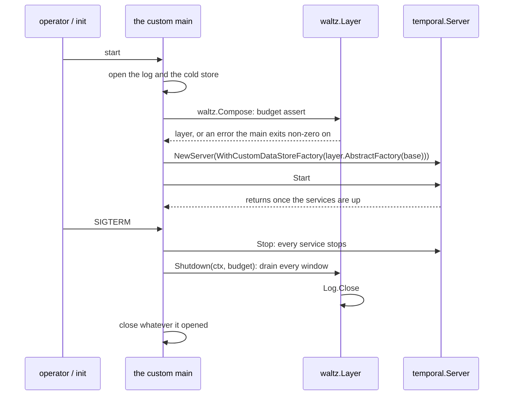
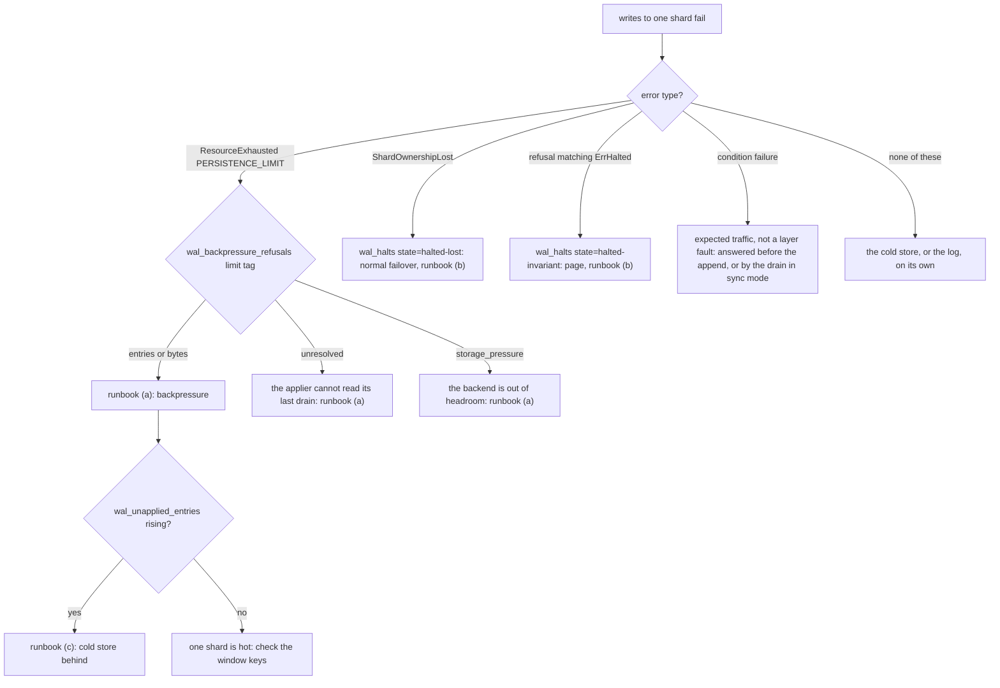

# Running, deploying and debugging it

The first node starts with an empty log. It acquires a shard, appends work, and drains windows.
At the next rollout it is stopped, and another node fences the shard and replays whatever the first
left behind. Callers should notice neither the handoff nor that some acknowledged state briefly
lived outside the cold store.

Two facts shape the operations that keep this true. A graceful shutdown is an optimisation: it
shortens the next owner's replay, but correctness never depends on it. And two identical
`ResourceExhausted` errors can call for opposite responses, depending on whether the tail is full
or a drain's outcome is unknown. We follow a node through deployment, start, stop and a rolling
restart, then the runbooks; a developer appendix closes the chapter.

---

## 1. Deployment

waltz is a library, so what deploys is a custom `temporal-server` binary that adds one decorator:
`layer.AbstractFactory(base)` wraps the server's abstract data store factory, and the result goes to
`temporal.WithCustomDataStoreFactory`. Flags, services, authorizer and dynamic config keep
upstream's shape, so existing command lines carry over.

The binary owns everything that must exist before a shard is acquired: the storage, schema and
credentials of both the log and the cold store, including any migration the `wal.Log` it constructs
needs. waltz has no schema of its own and ships no setup command.

### The checklist

1. **Write the `wal` section**, a two-key map (`sync`, `drain_on_read`) in the `options` of the
   datastore that `persistence.defaultStore` names. Its presence turns intercept mode on; an absent
   section is passthrough; an unknown key refuses to start. Every number is a dynamic-config setting
   under `wal.*`, not a key here
   ([08-configuration.md](08-configuration.md#1-where-the-section-goes)).
2. **Make the log ready before any node starts**: a migration, a topic, tables, a quorum that is
   up. Nothing in the layer creates or verifies it; a log that is not ready surfaces at the first
   `Log.Fence`, as a shard the node cannot acquire. For an earlier, louder failure the binary checks
   the log itself before composing the layer.
3. **Restart the history services.** The two section keys and the four start-up settings
   (`wal.hardMaxEntries`, `wal.hardMaxBytes`, `wal.maxShards`, `wal.tailBudgetBytes`) are read while
   the policy is built, so changing any of them means a restart.
4. **Verify.** A non-zero `wal_intercepted_writes` says traffic reaches the layer. Have the binary
   also log a start-up line naming the mode and window it composed: a node in passthrough under a
   file asking for intercept looks healthy, and so does a node intercepting when nobody meant it to.

---

## 2. Start and stop order

Two ordering rules hold for every binary.

*Compose the layer before the server.* `waltz.Compose` runs before `temporal.NewServer` and holds
the node-budget assertion, so numbers that do not fit stop the binary before it listens on a port.
`Compose` takes backends `main` has already opened, though; a `main` that wants the refusal to cost
no connection calls `policy().CheckBudget()` before opening either
([08-configuration.md](08-configuration.md#5-the-budget-refusal)).

*Drain the layer after the server has stopped.* `Layer.Shutdown(ctx, budget)` applies every shard
that still holds a window into the cold store, one shard at a time, one transaction each, replaying
first any tail not yet replayed. It must run when the writers are gone, and `temporal.Server.Start`
returns as soon as the services are up, so `main` waits for its own signal, calls `Server.Stop`, and
only then calls `Shutdown`. The cold store must still be open. The server closes its own data store
factory's client on the way down, so an applier riding that factory would drain into a closed
client. An applier with its own connection is closed after `Shutdown`, not before.

### Start-up and shutdown in sequence

Figure: the two rules in order, from start to `SIGTERM`.


```mermaid
sequenceDiagram
    participant Ops as operator / init
    participant Main as the custom main
    participant Layer as waltz.Layer
    participant Srv as temporal.Server
    Ops->>Main: start
    Main->>Main: open the log and the cold store
    Main->>Layer: waltz.Compose: budget assert
    Layer-->>Main: layer, or an error the main exits non-zero on
    Main->>Srv: NewServer(WithCustomDataStoreFactory(layer.AbstractFactory(base)))
    Main->>Srv: Start
    Srv-->>Main: returns once the services are up
    Ops->>Main: SIGTERM
    Main->>Srv: Stop: every service stops
    Main->>Layer: Shutdown(ctx, budget): drain every window
    Layer->>Layer: Log.Close
    Main->>Main: close whatever it opened
```

### The shutdown budget

`budget` buys its whole length: `Shutdown` detaches from the caller's cancellation
(`context.WithoutCancel`) before starting the timer, because a shutdown runs where a context has just
been cancelled, and inheriting it would return at once and silently leave a tail. A budget of zero
or less is refused, since `context.WithTimeout` reads zero as a deadline already past. A drain the
budget cuts short is not data loss: the entries are in the log, and the next owner replays them
before it serves anything.

Size the budget for every shard the node holds, not only the ones it wrote to. A cycle replays only
on the first request that reaches it, so one nothing has asked since its acquire may hold a dead
owner's acknowledged entries; the shutdown replays it before draining. That costs a watermark read and a log read per held shard, plus a replay and a
transaction where there is something to apply.

The budget bounds the drains `Shutdown` issues, not the whole call, so set the stop timeout above it.
Two waits sit outside it:

* A drain already running on the loop carries earlier writers' acknowledged mutations on its own
  context with no deadline, and stopping the cycle waits for it. Only the cold store bounds it,
  which is why bounding `Apply` is the store's obligation
  ([04-contracts.md](04-contracts.md#apply--what-a-drains-outcome-demands)): a drain this layer cut
  short would be an unknown outcome, which stalls the shard.
* A trim in flight is waited for unconditionally, because closing the log under it would fail it.
  The trimmer bounds this at one minute per attempt, per shard, or two if a forced trim queued its
  one follow-up behind the running one.

A node whose cold store has wedged therefore overruns, and the supervisor's `SIGKILL` costs what an
exhausted budget does: a replay by the next owner.

### Reading what `Shutdown` returns

An undrained tail is harmless only while a next owner will replay it, and when the layer is being
taken out there is none. So, given a usable budget, `Shutdown` returns nil (every tail emptied) or a
`*waltz.UndrainedError` with one `cycle.Residue` per shard: the shard, its epoch, how many
acknowledged entries the tail still held, and what its drain answered, which tells a halted cycle
from a budget that ran out. Log it: it is the only moment those entries are nameable.

A residue with a zero count is still a residue. A shard the budget never reached, or whose log read
failed (one case is an open entry in [the durability ledger](../../DURABILITY.md), see
[06 §6](06-shard-lifecycle.md#cycleclosectx-drain-then-retire)), comes back with a cause naming the
failure: the layer could not establish what that shard holds, so treat it as a non-empty tail.

### Taking the layer out

Turning the layer off is not the checklist run backwards. Removing the `wal` section puts the node in passthrough,
which composes no log, so it replays nothing. Writes go straight to the cold store and succeed,
because they assert against rows the cold store does hold, and every entry acknowledged above the
last committed watermark is stranded with nothing reporting it. This is the one silent way to lose
an acknowledged write, and no code can close it: the check would have to be made by a mode that does
not know what to check. So the order is:

1. Stop the writers: `Server.Stop`, on every node running the history service.
2. Call `Layer.Shutdown` and read what it returns.
3. A `*UndrainedError` names shards that still hold acknowledged entries. Do not remove the
   section; bring the node back in intercept mode and let it drain. A reachable cold store empties
   on the next shutdown; a `halted-invariant` cycle needs the restart
   [runbook (b)](#b-a-shard-halted--and-which-of-the-two-classes) describes, after the log is
   captured; a `halted-lost` one belongs to its new owner (below). Read the cause before the
   count, since a zero-entry residue means this node could not establish what the shard holds:
   * A cause naming `halted-lost` (one wording is `the shard has been fenced away`, the other an
     append or drain refused at the fence) is a shard another node took. Its entries appear in the
     new owner's shutdown, so run step 2 there.
   * A cause naming `halted-invariant` is runbook (b).
   * Any other cause is this node's own failure to look, and a restart is the remedy.
4. Only once every node's `Shutdown` has answered nil, remove the section and restart.

A node killed rather than stopped skips steps 2 and 3, so a decommission starts with a graceful
stop, not the config change. `Layer.RetireShard` stops a cycle without draining, so it leaves a
tail just like a kill, and is deliberately not called a shutdown
([chapter 06](06-shard-lifecycle.md#6-stopping-a-node)).

### One process, one layer

One process composes one layer, whatever services it runs. The server calls `NewFactory` once per
service, each call decorating with the same `waltz.Layer`, so every service's stores share one
registry and a shard's cycle carries its epoch from the acquire through the writes. Two layers would
be two windows for one shard, each unaware of the other.

---

## 3. Rolling restarts and failover

Correctness during a handoff comes from fencing plus replay, not from the graceful stop. The new
owner establishes a newer epoch (the shard's rangeID, [chapter 06](06-shard-lifecycle.md)) before
using the tail, then starts above the watermark (`appliedSeqno`) the old owner committed. A graceful stop drains as
many windows as the budget allows; a `kill -9` drains nothing and leaves a tail, entries
acknowledged into the log and not yet applied. Nothing is lost either way.

The next owner replays the tail on the first read or write to reach the shard: every log entry above
the watermark, a page of `wal.windowMutations` at a time, folded and drained by the size triggers
(not the age trigger). The request waits behind the replay rather than being refused
([06 §4](06-shard-lifecycle.md#4-then-recover-the-acknowledged-tail)).

What the metrics show during a failover:

* `wal_replayed_entries` rises on the new owner and nowhere else; a flat counter means the tail was
  empty.
* `wal_drains` gains `trigger="replay"` observations.
* `wal_halts` gains `state="halted-lost"` on the old owner, if it is still alive: its next append
  comes back `wal.ErrFenced` and it halts before acknowledging, or its next drain fails the cold
  store's epoch CAS (`apply.ClassShardLost`). That is fencing working, and it must not page.
* `wal_unapplied_entries` spikes on the new owner and falls as the replay drains.

During a rolling restart, take nodes one at a time and let `wal_unapplied_entries` settle before the
next: a node taking over shards while its own tail still replays carries the load twice.

---

## 4. "Writes to one shard are failing" — where to go

Route the symptom first, starting from the caller's error rather than the dashboard, then read the
runbook the route names.


```mermaid
flowchart TD
    A["writes to one shard fail"] --> B{"error type?"}
    B -->|"ResourceExhausted PERSISTENCE_LIMIT"| C{"wal_backpressure_refusals limit tag"}
    C -->|"entries or bytes"| D["runbook (a): backpressure"]
    C -->|"unresolved"| E["the applier cannot read its last drain: runbook (a)"]
    C -->|"storage_pressure"| SP["the backend is out of headroom: runbook (a)"]
    B -->|"ShardOwnershipLost"| F["wal_halts state=halted-lost: normal failover, runbook (b)"]
    B -->|"refusal matching ErrHalted"| G["wal_halts state=halted-invariant: page, runbook (b)"]
    B -->|"condition failure"| H["expected traffic, not a layer fault: answered before the append, or by the drain in sync mode"]
    B -->|"none of these"| I["the cold store, or the log, on its own"]
    D --> J{"wal_unapplied_entries rising?"}
    J -->|"yes"| K["runbook (c): cold store behind"]
    J -->|"no"| L["one shard is hot: check the window keys"]
```

---

## 5. Runbooks

The tree routes into the first three runbooks; the other four start at an instrument or at a node
that will not boot. The series and their alert shapes are in
[10-metrics.md](10-metrics.md#3-the-reference-table); the keys are in
[08-configuration.md](08-configuration.md#3-table-2--the-nine-dynamic-config-settings).

### (a) A shard stopped accepting writes — backpressure or an unresolved drain

All four refusals are decided before the append, so no refused call wrote anything; the mechanism,
the precedence of the `limit` values and the error's shape are in
[05 §4](05-write-path.md#4-failed-write--backpressure-i10). The history node answers them by keeping
the shard loaded and slowing its queues, not by sending tasks to the DLQ, and nothing needs
reconciling afterwards: the caller's retry asserts the version it still holds, and a later replay
reads back exactly the acknowledged set, in order and gap-free, with none of the refusals in it.

* **Symptom.** Callers get `serviceerror.ResourceExhausted` with cause `PERSISTENCE_LIMIT` and scope
  `SYSTEM`. Read the `limit` tag on `wal_backpressure_refusals` before choosing a response.
* **`entries`, `bytes`.** [I10](02-concepts-and-invariants.md#the-invariants)'s per-shard bound is
  working: the tail reached `wal.hardMaxEntries` or `wal.hardMaxBytes`. The message is `shard N's
  WAL tail is at its limit (…/… entries, …/… bytes): the apply cycle is behind`. Check
  `wal_unapplied_entries` (is the applier behind?), `wal_drains` (are drains committing?),
  `wal_halts`, and the cold store's health, nearly always the cause. Fix the cold store; refusals
  stop once the applier catches up. I10 does not make the log and the cold store independent: a log
  in the same database fails with it
  ([I10, at more length](02-concepts-and-invariants.md#i10-at-more-length)). Raising either bound
  needs a restart and must still fit the node budget (runbook (g)). That budget counts encoded
  bytes, not resident heap, so measure the decoded-memory multiplier on your own workload first
  ([chapter 14](14-where-the-defaults-came-from.md#what-the-budget-costs-resident)'s was measured on
  another).
* **`unresolved`.** The last drain's outcome was unknown, and the cycle could not read the
  watermark (`appliedSeqno`), its only witness to whether the transaction committed. The read runs
  on the cycle's own context, so the store could not answer; no client deadline ran out. The
  message is `shard N's apply cycle cannot read the outcome of its drain at seqno S, and takes no
  writes until it can`. It is a stall, not a halt: writes and reads are refused so nothing is
  applied over an ambiguous transaction, it takes precedence over a full tail, and no size knob
  clears it ([05 §7](05-write-path.md#7-failed-drain--the-outcome-could-not-be-read)). Restore
  reads of the watermark through `cold.Watermarker`; the age tick re-reads it by itself. A
  watermark at the drain's seqno releases the stall; one below it proves the drain did not commit
  (`halted-invariant`, runbook (b)); one past it means another owner drained this shard
  (`halted-lost`, a failover). If it stays unreadable, keep the log and the original drain error
  and escalate the storage failure.
* **`storage_pressure`.** The log backend implements
  [`wal.PressureSource`](04-contracts.md#walpressuresource--the-optional-pressure-face) and raised
  its level to the one that stops appends: its storage is running out. The message is `shard N's
  WAL backend reports storage pressure and takes no new appends until it clears`. Act on the
  backend's storage. The layer already drains what is left on the age tick
  (`wal_drains{trigger="storage_pressure"}`) and every trim bypasses the cadence, so no layer key
  (`wal.trimEvery`, `wal.trimAfter` included) clears it. The backend lowers the level itself, and
  writes resume with nothing to reset.

### (b) A shard halted — and which of the two classes

How each halt class is reached and superseded is in
[06 §5](06-shard-lifecycle.md#5-halts-the-two-classes); this is the response.

* **Symptom.** `wal_halts` moved. Callers get `ShardOwnershipLost` under `halted-lost`, and under
  `halted-invariant` the halt's own error, which matches `cycle.ErrHalted` and wraps the cause.
* **What it means.** Read the `state` tag, and never sum the two values.
  * `state="halted-lost"`: the shard was fenced away and the next owner replays its entries. It
    comes with failovers and rolling restarts, wherever an old owner still tries a write or a drain
    after the fence (a retire emits nothing). Not an alert.
  * `state="halted-invariant"`: a divergence this process owns, most often an assertion that failed
    inside a window and could not be pinned on one caller. No retry, no failover. This one pages.
* **What to check.** For `halted-invariant`, the `apply cycle halted` log line: shard id, state and
  cause. Only the cause says which assertion failed (every road is in the "Reached by" row of
  06 §5); you will meet `cycle.ErrTailNotEmpty` ("the log holds an entry at a seqno this cycle
  replayed past", a second writer holding this cycle's own epoch) and "the append at seqno N has an
  outcome nobody could read".

  No series carries a shard tag
  ([chapter 10](10-metrics.md#2-three-shape-decisions-because-they-change-how-you-read-the-numbers)),
  so one shard's state comes from the log lines and `waltz.Layer.ShardStats(shard)`. A zero tail
  there is not a clean shard: a cycle nothing has asked since its acquire has not looked, and one
  whose goroutine is gone reports its mirrored tail and no counters. Only `Layer.Shutdown` reads the
  log and the watermark, so act on its answer.
* **What to do.** `halted-lost`: nothing. `halted-invariant`: capture the shard's log before anything
  trims it, and treat it as a correctness incident. There is no path back: no tool, supported edit
  or documented procedure returns the cycle to service, and the shard stops serving task reads too,
  so its queues stall. The halt lives in memory only: a process restart, or any acquire at a
  strictly greater epoch (the server makes one in the background), installs a fresh cycle that
  replays the same tail. An ambiguous apply outcome need not recur; a genuine disagreement between
  the fold and the store halts again; a clean replay trims the log, which is why you capture it
  first.
  Whether to restart is the only decision the layer leaves you.

### (c) The cold store is falling behind

* **Symptom.** `wal_unapplied_entries` climbs and does not return; `wal_window_age` climbs.
* **What it means.** Entries are acknowledged faster than drains commit them. The layer is
  absorbing an incident, but the runway ends at `wal.hardMaxEntries` / `wal.hardMaxBytes`, and past
  it you are in runbook (a).
* **What to check.** `wal_drains` by `trigger`. A busy node drains mostly on `trigger="refusal"`,
  and on `trigger="mutations"` or `trigger="bytes"` when the window fills first; a node draining
  almost only on `trigger="age"` is idle, not behind
  ([14 §The drain triggers](14-where-the-defaults-came-from.md#the-drain-triggers-256-mutations-and-256-kib)
  has the measured cadence). `wal_drained_mutations` against `wal_drained_workflows` is the collapse
  ratio; near 1, batches are not collapsing and drains cost as much as the writes.
* **One shape that is not a slow cold store.** A completed task range's delete runs inside the
  drain's single transaction, so a range big enough to trip one of the cold store's own limits
  fails the whole drain, as an ordinary apply error no series distinguishes. Read the drain's logged
  error ([07-read-path.md](07-read-path.md#what-ranges-cost-a-drain)).
* **What to do.** Fix the cold store. If the shard is simply hot, `wal.windowMutations` and
  `wal.windowBytes` are read at the decision and move without a restart. Lowering them gives up
  collapse; raising them holds more unapplied work per shard.

### (d) Trims are failing

* **Symptom.** `wal_trims` with `outcome="failed"` (the other value is `outcome="started"`).
* **What it means.** A trim deletes log entries at or below the watermark, beside the apply cycle
  rather than in it. A failed trim is logged and retried at the next cadence, or, if storage
  pressure forced it, forced again while the pressure stands. It halts nothing, and this counter is
  the only series it appears in ([06 §7](06-shard-lifecycle.md#7-trim-as-part-of-the-lifecycle)).
* **What to check.** Whether it fails on every cadence or only sometimes. A backend's reads get
  dearer as its log grows, so a permanently failing trim degrades latency over hours.
* **What to do.** The cadence knobs are `wal.trimEvery` (in drains) and `wal.trimAfter` (in time),
  whichever trips first; both are read at the decision, so no restart. Raising `wal.trimEvery` alone
  does not keep a log for a post-mortem: `wal.trimAfter` fires anyway, at the first drain past it.
* **How much log is left to read.** The cycle trims to the watermark with no safety lag, so a
  healthy shard keeps at most about 4096 entries plus the tail
  ([chapter 14](14-where-the-defaults-came-from.md#the-trim-cadence-16-drains-or-60-seconds)).

### (e) Task drops are climbing

* **Symptom.** `wal_dropped_tasks` rises against `wal_written_tasks`, both tagged by task category.
* **What it means.** Invariant [I7](02-concepts-and-invariants.md#the-invariants): a committed drain
  did not write task rows whose range the queue had already completed past. This is expected
  traffic; the two counters are separate so that "everything was dropped" stays distinct from
  "there were no tasks".
* **What to check.** The ratio per category, each against its own history: immediate and scheduled
  categories drop at unrelated rates. A jump when the window grew is the window, not a bug.
* **What to do.** Usually nothing: each drop is a row the queue no longer needed, a saving. To
  bring it down, put more drains between two queue checkpoints, with these knobs in this order:
  1. Raise the server's `history.*ProcessorUpdateAckInterval`, so the queue checkpoints less often.
     It costs checkpoint freshness, not collapse ratio, so it is the cheaper knob (the ratio and its
     shipped anchor are in [chapter 07](07-read-path.md#5-invariant-i7--the-tasks-a-drain-does-not-write)).
  2. Only then shorten the window (`wal.windowMutations`, `wal.windowBytes`, `wal.windowAge`, all
     read at the decision), so fewer tasks sit in a window until their range completes. This costs
     collapse ratio, the thing the layer exists for, and buys down a share that costs nothing, so it
     is a bad trade.

### (f) Merged-page collisions are non-zero

* **Symptom.** `wal_merged_task_collisions` is anything but zero.
* **What it means.** A merged `GetHistoryTasks` page found the same task key in both the window and
  the cold store, which are disjoint by construction
  ([07 §4](07-read-path.md#4-merge-tasks-two-ordered-sources-one-page)). Something is wrong: a second
  writer for the shard, a window release that did not happen, or a merge reading a stale window.
* **What to check.** `wal_merged_task_pages` (are pages routed at all?) and `wal_halts`, both
  node-wide; for the shard, the log lines and `waltz.Layer.ShardStats(shard)`, and whether two
  processes could hold it. The acquire path and the epoch fence are
  [`../../wrapper/shard_store.go`](../../wrapper/shard_store.go).
* **What to do.** Treat it as a correctness incident, like `halted-invariant`; there is no knob. The
  merge is [`../../fold/taskpage.go`](../../fold/taskpage.go) and
  [`../../cycle/tasks.go`](../../cycle/tasks.go).

### (g) The node refuses to start

Three refusals, all before anything listens:

* **Budget refusal.** `wal.hardMaxBytes × wal.maxShards` does not fit in `wal.tailBudgetBytes`.
  `waltz.Compose` asserts it before building the registry (`cycle.Config.CheckBudget`, reached
  through `cycle.NewManager`); the error wraps `cycle.ErrBudget` and spells out the node's numbers:
  `N shards × B bytes is X bytes of tail, over the node's budget of T`. Fix the arithmetic and
  restart ([08 §5](08-configuration.md#5-the-budget-refusal)).
* **A log that will not open.** This one is the binary's: `Compose` takes a `wal.Log` that already
  exists, so construction fails in `main`, with whatever message that binary writes.
* **Moved or unknown config key.** A section key that is now one of the nine `wal.*` dynamic-config
  settings is refused by name, saying which setting to write instead. Any other unknown key
  (`snyc: true`) and a section spelt `WAL:` or `Wal:` are refused too
  ([08 §1](08-configuration.md#1-where-the-section-goes)). A misspelt dynamic-config key, by
  contrast, is a warning, and the default stands.

Draining into one cold store while reading the watermark from another passes until a drain's
outcome is unknown. Then the watermark store, which never saw the transaction, reports it
uncommitted, and the shard halts `halted-invariant` over a drain that did write. `Backends.Cold` is
one `cold.Store`, so `Compose` cannot express this. A hand-built `cycle.Deps` keeps `Writer` and
`Recoverer` apart for the suites and must fill both from one value.

---

## 6. Local development

Four checks, and `make check` runs them all:

```bash
make test        # go test ./... -count=1
make race        # the same under -race
make lint        # golangci-lint and gopls's modernize
make vuln        # govulncheck
```

`make test` needs no cluster, container, port, cgo or fixture directory: the log is `wal/memwal`,
and the cold and base stores are `cold/memcold`, Temporal's own SQL persistence over in-memory
SQLite (the pure-Go `modernc.org/sqlite` driver). Suites needing a misbehaving store use the doubles
in `internal/verify/coldtest` and `internal/verify/basetest`; `internal/verify/e2e` starts four
Temporal services on OS-assigned ports. Everything dies with the process, so a green run says
nothing about a real deployment's storage ([chapter 11](11-verification.md) has what each
suite claims, [chapter 15](15-the-limits-of-the-evidence.md) the boundary of the set). The widest
evidence for a composition is upstream's own functional suites against the deployment's real store,
with waltz in between: one patch, `patches/temporal/0001-custom-persistence-test-base-factory.patch`
(fifteen lines against `tests/testcore/test_cluster.go`), with `patches/README.md` as the recipe.
`internal/verify/e2e` is the in-tree version at a fraction of the coverage: one server, one workflow.

`make race` is the check `make test` cannot stand in for: one goroutine per shard owns the
accumulator and the drain, with two mirrors published for readers and a trim beside it, and only
the detector asks whether that holds. Under `-race` the acceptance stream (one long run of writes
through the fold, [chapter 11](11-verification.md#the-acceptance-one-stream-through-the-fold)) takes 25× its wall
clock, so this target runs a tenth of it; the volume claim is `make test`'s. It needs cgo, so a C
compiler on the PATH.

`make lint`'s two tools are pinned in the Makefile; `.golangci.yml` says which linters are off and
why. `make vuln`, also pinned, reports an advisory only where a call path from this module reaches
the vulnerable symbol: green is a claim about what waltz calls, not what it requires. For a
consumer, the module versions here carry over through MVS, but the standard library is whatever
toolchain the consumer builds with, so a green standard-library verdict here says nothing about it.
The `toolchain` line governs only waltz's own builds and CI.

---

## 7. Traps

* **A piped test run can be killed by SIGPIPE and look green.** `go test ./... | grep … | head -5`
  ends the test binary once `head` is satisfied, and the truncated output looks like a pass;
  redirect to a file. Under `set -o pipefail` the same SIGPIPE makes `until cmd | grep -q marker`
  never succeed; capture into a variable and match that.
* **`-race` costs memory per test binary, and `-p` defaults to the number of cores.** A many-core
  machine can run out of memory and the kernel kills a binary: `signal: killed` with no `--- FAIL`
  line. Lower `-p` until the run fits.
* **Reading `Cycle.State` right after a call that did not wait for the loop races in the test.**
  `State` is a bare atomic load; `Stats` is a job behind the drain, so only `Stats` orders a read
  after a drain's decision. Such a test can be green on twelve cores and red under `-race` every
  time.

---

## Summary

A waltz deployment is a custom server binary that adds one decorator and owns the log, the cold
store, their schemas and credentials. The `wal` section turns intercept on; numbers live in dynamic
config.

Compose before the server, so a bad budget stops the binary early. Drain after `Server.Stop`, with
the cold store still open, and read what `Shutdown` returns. A graceful stop only shortens the next
owner's replay; fencing plus replay keeps acknowledged writes. The one silent loss is removing the
`wal` section while a tail remains, so it comes out only after every node's `Shutdown` answers nil.

In an incident, start from the caller's error. A `PERSISTENCE_LIMIT` refusal is decided before the
append, and its `limit` tag says whether to fix the cold store (`entries`, `bytes`), restore the
watermark read (`unresolved`), or free the log backend's storage (`storage_pressure`).
`halted-lost` is normal failover; `halted-invariant` pages, has no path back, and calls for
capturing the log first. Rising task drops are usually a saving; any merged-page collision is a
correctness incident.

---

## Where this lives in the code

* [`../../waltz.go`](../../waltz.go) — `Compose`, which reaches the budget assertion through
  `cycle.NewManager`, and `Layer.Shutdown`; the package doc states the lifecycle bracket.
* [`../../settings.go`](../../settings.go) — the nine `wal.*` dynamic-config
  settings, which are live and which are read once, and the refusal for a key that moved.
* [`../../config.go`](../../config.go) — the section's strict decoder and the miscased-section
  refusal.
* [`../../walmetrics/walmetrics.go`](../../walmetrics/walmetrics.go) — every series and every
  tag value named in the runbooks above.
* [`../../cycle/decide.go`](../../cycle/decide.go) — the four backpressure refusals, their exact
  messages and their unwrapped error type.
* [`../../cycle/cycle.go`](../../cycle/cycle.go) — the two halted states and their terminality, the
  refusal every write gets while one stands, and the trim a halted cycle does not do.
* [`../../cycle/trim/trim.go`](../../cycle/trim/trim.go) — the trim's cadence, budget and outcome
  counters.
* [`../../patches/README.md`](../../patches/README.md) — the one patch, what it is for, and why
  nothing here needs it to build.
