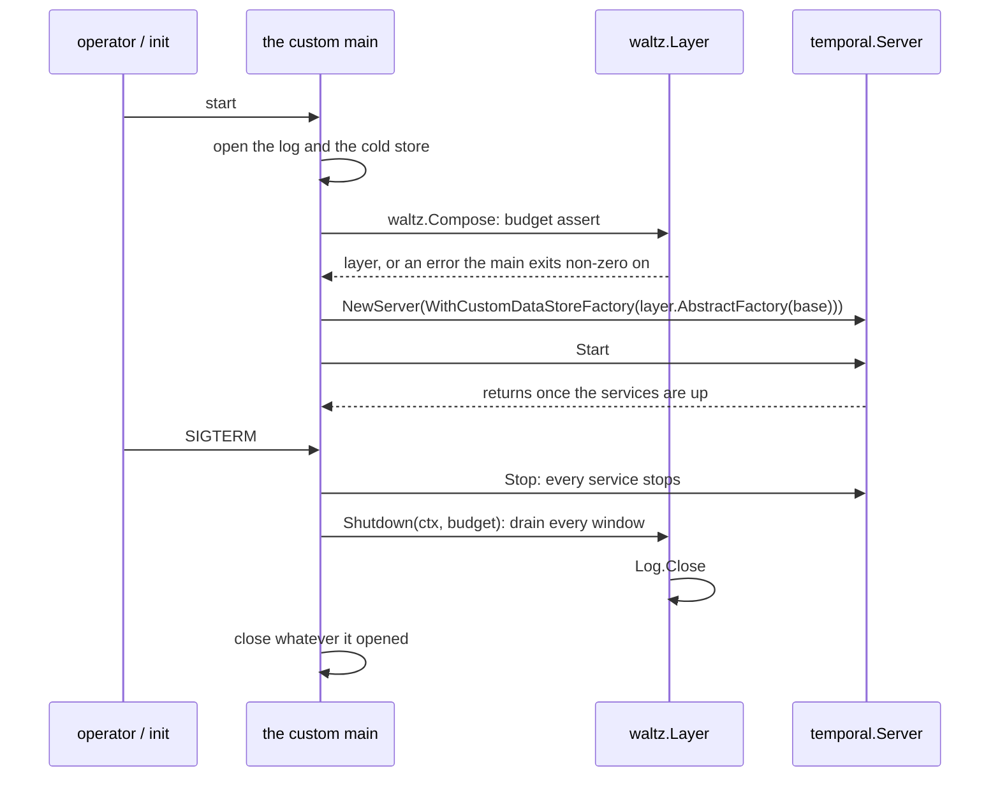
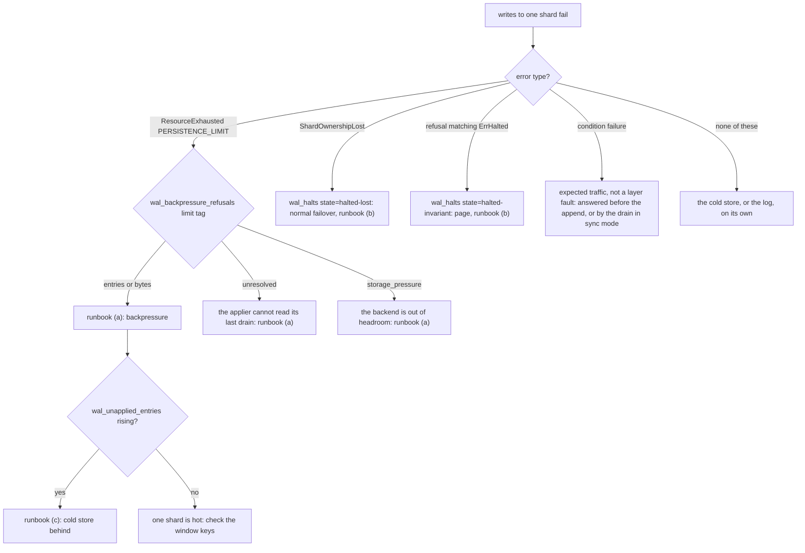

# Running, deploying and debugging it

The first node starts with an empty log. It acquires a shard, appends work, and begins draining
windows. During the next rollout that node is stopped. Another node fences the shard and replays
whatever the first left behind. If all goes well, callers notice neither the handoff nor that some
acknowledged state briefly lived outside the cold store.

Operations keep that story true. Two facts shape this chapter. A graceful shutdown is an
optimisation: it shortens the next owner's replay, but correctness never depends on it. And two
identical `ResourceExhausted` errors can call for opposite responses, depending on whether the tail
is full or a drain's outcome is unknown. We follow a node through deployment, start and stop, and a
rolling restart, then turn to incidents and their runbooks. A developer appendix closes the chapter.

---

## 1. Deployment

waltz is a library, so what deploys is a custom `temporal-server` binary written over it. That
binary adds one decorator to the server's composition: `layer.AbstractFactory(base)` wraps the
abstract data store factory the server would otherwise use, and the result goes to
`temporal.WithCustomDataStoreFactory`. Flags, services, authorizer and dynamic config keep
upstream's shape, so existing command lines carry over.

The binary, not the library, owns everything that must exist before a shard is acquired: the log's
storage and schema, the cold store's storage and schema, and the credentials for both. waltz has no
schema of its own and ships no setup command. The log is a `wal.Log` value the binary constructs; if
constructing it needs a migration, that migration belongs to the log's deployment.

### The checklist

1. **Write the `wal` section.** It is a two-key map, `sync` and `drain_on_read`, in the `options` of
   the datastore that `persistence.defaultStore` names. Writing the section at all turns intercept
   mode on; an absent section is passthrough. An unknown key inside it refuses to start rather than
   falling back to passthrough. Every number is a dynamic-config setting under `wal.*`, not a key
   here. Where the section goes, what a typo costs and the ready-made configurations are in
   [08-configuration.md](08-configuration.md#1-where-the-section-goes).
2. **Make the log ready before any node starts.** A migration, a topic, a set of tables, a quorum
   that is up: whatever the log needs. Nothing in the layer creates or verifies it. A log that is
   not ready is discovered at the first `Log.Fence`, and the operator sees only a shard the node
   cannot acquire. A binary that wants an earlier, louder failure checks the log itself before it
   composes the layer.
3. **Restart the history services.** The two section keys (`sync`, `drain_on_read`) and the four
   start-up settings (`wal.hardMaxEntries`, `wal.hardMaxBytes`, `wal.maxShards`,
   `wal.tailBudgetBytes`) are read while the policy is built. Changing any of them means restarting
   the processes that run the history service.
4. **Verify.** `wal_intercepted_writes` becoming non-zero says traffic reaches the layer. Have the
   binary also log a start-up line naming the mode and window it composed. That line catches a
   failure silent from both ends: a node in passthrough under a file asking for intercept looks
   healthy, and so does a node intercepting when nobody meant it to.

---

## 2. Start and stop order

Two ordering rules hold for every binary.

*Compose the layer before the server.* `waltz.Compose` runs before `temporal.NewServer`. The
node-budget assertion is inside `Compose`, so numbers that do not fit stop the binary before it
listens on a port. `Compose` takes backends `main` has already opened, though, so by the time it
refuses, the log and the cold store have been connected to. A `main` that wants the refusal to cost
no connection calls `policy().CheckBudget()` before it opens either
([08-configuration.md](08-configuration.md#5-the-budget-refusal)).

*Drain the layer after the server has stopped.* `Layer.Shutdown(ctx, budget)` is the shutdown
drain. It applies every shard that still holds a window into the cold store, shard by shard in
sequence, one transaction each. A shard whose tail has not been replayed yet replays first. It must
run when the writers are gone, and `temporal.Server.Start` does not give you that moment: it returns
as soon as the services are up. So `main` waits for its own signal, calls `Server.Stop`, and only
then calls `Shutdown`. The cold store must still be open at that point. This is the one ordering
constraint the binary owns: the server closes its own data store factory's client on the way down,
so an applier riding that factory would drain into a closed client. A binary whose applier holds its
own connection closes it after `Shutdown`, not before.

### Start-up and shutdown in sequence

The diagram puts the two rules in order.


```mermaid
sequenceDiagram
    participant Ops as operator / init
    participant Main as the custom main
    participant Layer as waltz.Layer
    participant Srv as temporal.Server
    Ops->>Main: start
    Main->>Main: open the log and the cold store
    Main->>Layer: waltz.Compose: budget assert
    Layer-->>Main: layer, or an error the main exits non-zero on
    Main->>Srv: NewServer(WithCustomDataStoreFactory(layer.AbstractFactory(base)))
    Main->>Srv: Start
    Srv-->>Main: returns once the services are up
    Ops->>Main: SIGTERM
    Main->>Srv: Stop: every service stops
    Main->>Layer: Shutdown(ctx, budget): drain every window
    Layer->>Layer: Log.Close
    Main->>Main: close whatever it opened
```

A budget that does not fit ends the process at `Compose`, before `NewServer`. The drain comes after
`Server.Stop`, and the binary closes its own backends last.

### The shutdown budget

`budget` buys its whole length, not whatever is left of the context passed in. `Shutdown` detaches
from the caller's cancellation (`context.WithoutCancel`) before starting the timer, because a
shutdown runs where a context has just been cancelled, and an inherited cancellation would return at
once and leave a tail behind silently. A budget of zero or less is refused, since
`context.WithTimeout` reads zero as a deadline already past, where a caller most likely meant no
limit.

A drain the budget cuts short is not data loss: the entries are in the log, and the next owner
replays them before it serves anything.

Size the budget for every shard the node holds, not only the ones it wrote to. A cycle replays
lazily, on the first request that reaches it, so a cycle that nothing asked about since its acquire
may be sitting on a dead owner's acknowledged entries. The shutdown starts such a cycle before
draining it. That costs a watermark read and a log read per held shard even when there is nothing to
apply, and a replay and a transaction when there is.

The budget bounds the drains `Shutdown` issues, not the whole call, so set the stop timeout above it.
Two waits sit outside the budget:

* A drain already running on the loop (an age tick's, a size trigger's, a refusal's or a
  storage-pressure drain's) carries earlier writers' acknowledged mutations on its own context with
  no deadline, and stopping the cycle waits for it. Only the cold store bounds it, which is why
  bounding `Apply` is the store's obligation
  ([04-contracts.md](04-contracts.md#apply--what-a-drains-outcome-demands)): a drain this layer cut
  short would be an unknown outcome, which stalls the shard.
* A trim in flight is waited for unconditionally, because the log is closed after the drains and
  closing it under a trim would fail the trim. The trimmer bounds this at one minute per attempt,
  per shard, or two if a forced trim queued its one follow-up behind the running one.

So a node whose cold store has wedged does not return from `Shutdown` on schedule, and the
supervisor's `SIGKILL` follows. That costs the same as an exhausted budget: a replay by the next owner.

### Reading what `Shutdown` returns

An undrained tail is harmless only while a next owner will replay it. When the layer is being taken
out there is none, so `Shutdown` names what it could not empty. Given a usable budget, its error is
a `*waltz.UndrainedError` and nothing else. It carries one `cycle.Residue` per shard: the shard, its
epoch, how many acknowledged entries the tail still held, and what that shard's drain answered. The
last field tells a halted cycle from a budget that ran out. Nil means every tail emptied. Log the
error: it is the only moment those entries are nameable, and taking the layer out (below) depends on it.

A residue with a zero count is still a residue. A shard the budget never reached, or one whose log
read failed (one case of that is an open entry in [the durability ledger](../../DURABILITY.md), see
[06 §6](06-shard-lifecycle.md#cycleclosectx-drain-then-retire)), comes back with a cause naming the
failure: the layer could not establish what that shard holds, and the procedure below treats it as a
non-empty tail.

### Taking the layer out

Turning the layer off is not the checklist run backwards. It has one ordering constraint, and
breaking it loses acknowledged writes.

Removing the `wal` section puts the node in passthrough. Passthrough composes no log, so it cannot
see that a log exists or that a shard's tail was non-empty, and it replays nothing. Writes go
straight to the cold store and succeed, because they assert against rows the cold store does hold.
Every entry acknowledged above the last committed watermark is stranded, and nothing reports it. This
is the one silent way the layer can lose an acknowledged write, and no code in it can close the hole:
the check would have to be made by a mode that does not know what to check.

So the order is:

1. Stop the writers: `Server.Stop`, on every node running the history service.
2. Call `Layer.Shutdown` and read what it returns.
3. If it returned a `*UndrainedError`, the shards it names still hold acknowledged entries. Do not
   remove the section. Bring the node back in intercept mode and let it drain. A shard whose cold
   store is reachable empties on the next shutdown; one whose cycle halted needs the halt cleared
   first ([runbook (b)](#b-a-shard-halted--and-which-of-the-two-classes)).
   Read the cause before acting on the count, since a zero-entry residue means this node could not
   establish what the shard holds:
   * A cause naming `halted-lost` (one wording is `the shard has been fenced away`, the other is an
     append or drain refused at the fence) is a shard another node took. This node's halted cycle
     will never drain it. Any entries are the new owner's and appear in the new owner's
     shutdown, so run step 2 on that node instead.
   * A cause naming `halted-invariant` is runbook (b).
   * Any other cause is this node's own failure to look, and a restart is the remedy.
4. Only once every node's `Shutdown` has answered nil, remove the section and restart.

A node killed rather than stopped skips steps 2 and 3, which is why a decommission starts with a
graceful stop, not the config change. The code draws the same line: `Layer.RetireShard` stops a
cycle without draining and is named apart from `Shutdown` because a drain writes and a kill does not
(its semantics are in [chapter 06](06-shard-lifecycle.md#6-stopping-a-node)).

### One process, one layer

One process composes one layer, whatever services it runs. The server calls `NewFactory` once per
service, and each call decorates that service's data store factory with the same `waltz.Layer`, so
every service's stores talk to one registry of cycles. A shard's cycle therefore carries its epoch
from the acquire through the writes that follow. Two layers in one process would be two windows for
one shard, each unaware of the other.

---

## 3. Rolling restarts and failover

Correctness during a handoff comes from fencing plus replay, not from the graceful stop. The new
owner establishes a newer epoch (the shard's rangeID, [chapter 06](06-shard-lifecycle.md)) before
using the tail, then starts above the watermark the old owner committed.

When a node goes away:

* on a graceful stop, the shutdown drain empties as many windows as the budget allows, so the next
  owner usually inherits little or nothing;
* on `kill -9` there is no drain, and the node leaves a tail: entries acknowledged into the log and
  not yet applied to the cold store. Nothing is lost.

The next owner replays that tail on the first read or write to reach the shard: it reads every log
entry above the watermark (`appliedSeqno`), a page of `wal.windowMutations` entries at a time, folds
them, drains by the size triggers (not the age trigger), and only then serves the request, which
waits behind the replay rather than being refused. The full procedure is
[06 §4](06-shard-lifecycle.md#4-then-recover-the-acknowledged-tail).

What the metrics show during a failover:

* `wal_replayed_entries` rises on the new owner. It moves nowhere else, so a failover with a flat
  counter means the tail was empty.
* `wal_drains` gains `trigger="replay"` observations.
* `wal_halts` gains `state="halted-lost"` on the old owner, if it is still alive and tries to write.
  The new owner's `Log.Fence` at the higher epoch cuts off every append below it, so the old cycle's
  next write comes back `wal.ErrFenced` and it halts before the entry is acknowledged. A cycle that
  drains without a new write (on the age tick, say) halts the same way from the other side: its
  transaction fails the cold store's epoch CAS, classified as `apply.ClassShardLost`. That is
  fencing working, and it must not page.
* `wal_unapplied_entries` spikes on the new owner and falls as the replay drains.

During a rolling restart, take nodes one at a time and let `wal_unapplied_entries` settle before the
next. A node taking over shards while its own tail is still replaying carries the same load twice.

---

## 4. "Writes to one shard are failing" — where to go

Route the symptom first, then read the runbook the route names.


```mermaid
flowchart TD
    A["writes to one shard fail"] --> B{"error type?"}
    B -->|"ResourceExhausted PERSISTENCE_LIMIT"| C{"wal_backpressure_refusals limit tag"}
    C -->|"entries or bytes"| D["runbook (a): backpressure"]
    C -->|"unresolved"| E["the applier cannot read its last drain: runbook (a)"]
    C -->|"storage_pressure"| SP["the backend is out of headroom: runbook (a)"]
    B -->|"ShardOwnershipLost"| F["wal_halts state=halted-lost: normal failover, runbook (b)"]
    B -->|"refusal matching ErrHalted"| G["wal_halts state=halted-invariant: page, runbook (b)"]
    B -->|"condition failure"| H["expected traffic, not a layer fault: answered before the append, or by the drain in sync mode"]
    B -->|"none of these"| I["the cold store, or the log, on its own"]
    D --> J{"wal_unapplied_entries rising?"}
    J -->|"yes"| K["runbook (c): cold store behind"]
    J -->|"no"| L["one shard is hot: check the window keys"]
```

Start from the error the caller saw, not from the dashboard. The `ResourceExhausted` branches
differ by the `limit` tag on `wal_backpressure_refusals`. `entries` and `bytes` are I10's size
bound. `unresolved` means the applier is blind rather than behind: it cannot say whether its last
drain committed, and no size knob clears it. `storage_pressure` is not the layer's condition at all:
the log backend asked for the stop, so look at the backend's storage.

---

## 5. Runbooks

There are seven runbooks. The tree above routes into the first three; the other four start at an
instrument or at a node that will not boot. Each gives the symptom, what it means, what to check and
what to do. The series and their alert shapes are in
[10-metrics.md](10-metrics.md#3-the-reference-table); the keys are in
[08-configuration.md](08-configuration.md#3-table-2--the-nine-dynamic-config-settings).

### (a) A shard stopped accepting writes — backpressure or an unresolved drain

All four refusals here are decided before the append, so no refused call wrote anything. The
mechanism, the precedence of the four `limit` values and the error's exact shape are in
[05-write-path.md](05-write-path.md#4-failed-write--backpressure-i10).

* **Symptom.** Callers get `serviceerror.ResourceExhausted` with cause `PERSISTENCE_LIMIT` and scope
  `SYSTEM`. Read the `limit` tag on `wal_backpressure_refusals` before choosing a response.
* **`entries` or `bytes`: what it means.** [I10](02-concepts-and-invariants.md#the-invariants)'s
  per-shard bound is working: the tail reached `wal.hardMaxEntries` or `wal.hardMaxBytes`. The
  message is `shard N's WAL tail is at its limit (…/… entries, …/… bytes): the apply cycle is
  behind`.
* **`entries` or `bytes`: what to check.** `wal_unapplied_entries` (is the applier behind?),
  `wal_drains` (are drains committing?), `wal_halts`, and the cold store's health. It is nearly
  always the cold store.
* **`entries` or `bytes`: what to do.** Fix the cold store; refusals stop once the applier catches
  up. Raising `wal.hardMaxEntries` or `wal.hardMaxBytes` needs a restart, and
  `hardMaxBytes × maxShards` must fit in `wal.tailBudgetBytes` or the node refuses to boot. That
  budget counts encoded bytes, not resident heap, so measure the decoded-memory multiplier on your
  own workload before raising it (the one in
  [chapter 14](14-where-the-defaults-came-from.md#what-the-budget-costs-resident) was measured on
  another).
* **`unresolved`: what it means.** The last drain returned an unknown outcome, and the cycle could
  not read `appliedSeqno`, its only witness to whether the transaction committed. The read runs on
  the cycle's own context, so the store could not answer; no client deadline ran out. The message
  is `shard N's apply cycle cannot read the outcome of its drain at seqno S, and takes no writes
  until it can`. This is a stall, not a halt: writes and reads are both refused, so nothing is
  applied over an ambiguous transaction
  ([05 §7](05-write-path.md#7-failed-drain--the-outcome-could-not-be-read)). It takes precedence over
  a full tail, since waiting will not clear it.
* **`unresolved`: what to do.** Restore reads of the watermark through `cold.Watermarker`. The age
  tick re-reads it with no operator action:
  * a watermark exactly at the drain's seqno releases the stall and traffic resumes;
  * a watermark below it proves the drain did not commit, and the shard becomes `halted-invariant`
    (runbook (b));
  * a watermark past it proves another owner has been draining this shard, and the cycle halts
    `halted-lost`, a failover rather than an incident.

  If the watermark stays unreadable, keep the log and the original drain error and escalate the
  storage failure.
* **`storage_pressure`: what it means.** The log backend implements
  [`wal.PressureSource`](04-contracts.md#walpressuresource--the-optional-pressure-face) and raised
  its level to the one that stops appends: its storage is running out while appends still succeed.
  The message is `shard N's WAL backend reports storage pressure and takes no new appends until it
  clears`.
* **`storage_pressure`: what to do.** Act on the backend's storage. The layer already drains
  whatever window is left on the age tick (`wal_drains{trigger="storage_pressure"}`), and every trim
  bypasses the cadence, so no layer key (`wal.trimEvery`, `wal.trimAfter` included) clears the
  refusal. The backend lowers the level itself, and writes resume with nothing to reset.

The history node handles `PERSISTENCE_LIMIT` by keeping the shard loaded and slowing its queues
instead of sending tasks to the DLQ. Nothing needs reconciling afterwards. The caller was told no,
so it still holds the row it read, and its retry asserts the same version. A later replay reads back
exactly the acknowledged set, in order and gap-free, with none of the refusals in it. That is why
`ResourceExhausted` is the right answer here and a condition failure is not.

I10 bounds what a slow cold store costs, but it does not make the log and the cold store
independent. If the log lives in the same database, one incident takes out both
([I10, at more length](02-concepts-and-invariants.md#i10-at-more-length)). Putting the log where the
cold store cannot take it down is a deployment choice; the contract in
[04-contracts.md](04-contracts.md#what-the-contract-does-not-say-what-an-append-costs) and the
import bans in [03-components.md](03-components.md#the-import-diagram--compile-time-bans) exist to
allow it.

### (b) A shard halted — and which of the two classes

The two halt classes, how each is reached, what a halted shard answers a reader and how a successor
supersedes it are in [06-shard-lifecycle.md](06-shard-lifecycle.md#5-halts-the-two-classes). This
runbook is the response.

* **Symptom.** `wal_halts` moved. The refusal callers get tells the classes apart:
  `ShardOwnershipLost` under `halted-lost`, and under `halted-invariant` the halt's own error, which
  matches `cycle.ErrHalted` and wraps the cause.
* **What it means.** Read the `state` tag, and never sum the two values.
  * `state="halted-lost"`: the shard was fenced away, and the next owner replays the acknowledged
    entries from the log. Expect it around failovers and rolling restarts, wherever an old owner is
    still alive to try a write or a drain after the fence; a retire emits nothing. Not an alert.
  * `state="halted-invariant"`: a divergence this process owns, most often an assertion that failed
    inside a window and could not be pinned on one caller. There is no retry and no failover. This
    is the one that pages.
* **What to check.** For `halted-invariant`, the `apply cycle halted` log line. It carries the
  shard id, the state and the cause, and only the cause says which assertion failed (the causes are
  the "Reached by" row in 06 §5). The cause wordings you will meet include
  `cycle.ErrTailNotEmpty` ("the log holds an entry at a seqno this cycle replayed past", a second
  writer holding this cycle's own epoch) and "the append at seqno N has an outcome nobody could
  read".

  No series carries a shard tag
  ([chapter 10](10-metrics.md#2-three-shape-decisions-because-they-change-how-you-read-the-numbers)),
  so one shard's state comes from the log lines and `waltz.Layer.ShardStats(shard)`. A zero tail
  there is not a clean shard. A cycle nothing has asked since its acquire reports zeros because it
  has not looked, and a cycle whose goroutine is gone reports the tail off its mirror and no
  counters at all. Only `Layer.Shutdown` actually reads the log and the watermark, so act on its
  answer, not on `ShardStats`.
* **What to do.** `halted-lost`: nothing. `halted-invariant`: capture the shard's log before anything
  trims it, and treat it as a correctness incident. No tool, supported edit or documented procedure
  returns a `halted-invariant` cycle to service, and a halted shard also stops serving task reads, so
  its queues stall too. The halt lives in memory only: a process restart, or any acquire at a
  strictly greater epoch (the server makes one in the background), installs a fresh cycle that
  replays the same tail. An ambiguous apply outcome need not recur on the replay; a genuine
  disagreement between the fold and the store halts again. A successor that replays cleanly trims
  the log, so capture it first. Whether to restart is the only decision the layer leaves you.

### (c) The cold store is falling behind

* **Symptom.** `wal_unapplied_entries` climbs and does not return; `wal_window_age` climbs.
* **What it means.** Entries are acknowledged into the log faster than drains commit them. The layer
  is absorbing an incident, which is its job, but the runway ends at `wal.hardMaxEntries` /
  `wal.hardMaxBytes`, and past it you are in runbook (a).
* **What to check.** `wal_drains` by `trigger`. A busy node drains mostly on `trigger="refusal"`, and
  on `trigger="mutations"` or `trigger="bytes"` when the window fills first. A node draining almost
  only on `trigger="age"` is idle, not behind. Chapter 14 has the measured cadence
  ([14 §The drain triggers](14-where-the-defaults-came-from.md#the-drain-triggers-256-mutations-and-256-kib)).
  `wal_drained_mutations` against `wal_drained_workflows` gives the collapse ratio. Near 1, batches
  are not collapsing and drains cost as much as the writes.
* **One shape that is not a slow cold store.** A completed task range travels the log like any other
  write, so its delete runs inside the drain's single transaction. A standalone
  `RangeCompleteHistoryTasks` may split a very large range across several statements; a folded one
  cannot. A range big enough to trip one of the cold store's own limits fails the whole drain that
  carried it. It arrives as an ordinary apply error that no series distinguishes, so read the
  drain's logged error ([07-read-path.md](07-read-path.md#what-ranges-cost-a-drain)).
* **What to do.** Fix the cold store. If the shard is simply hot, `wal.windowMutations` and
  `wal.windowBytes` are read at the decision and can move without a restart. Lowering them gives up
  collapse; raising them holds more unapplied work per shard.

### (d) Trims are failing

* **Symptom.** `wal_trims` with `outcome="failed"` (the other value is `outcome="started"`).
* **What it means.** A trim deletes log entries at or below the watermark. It runs beside the apply
  cycle, not in it. A failed trim is logged and retried at the next cadence, or, if storage pressure
  forced it, forced again while the pressure stands. It halts nothing, and this counter is the only
  series it appears in. The mechanism is in
  [06 §7](06-shard-lifecycle.md#7-trim-as-part-of-the-lifecycle).
* **What to check.** Whether it fails on every cadence or only sometimes. A backend's reads get
  dearer as its log grows (by how much is the log implementation's business), so a permanently
  failing trim degrades latency over hours.
* **What to do.** The cadence knobs are `wal.trimEvery` (in drains) and `wal.trimAfter` (in time),
  whichever trips first; both are read at the decision, so no restart. Raising `wal.trimEvery` alone
  does not keep a log for a post-mortem: `wal.trimAfter` fires anyway, at the first drain past it.
* **How much log is left to read.** The cycle trims to the watermark with no safety lag, so a
  healthy shard keeps at most about 4096 entries plus the tail; the conditions and the derivation
  are in [chapter 14](14-where-the-defaults-came-from.md#the-trim-cadence-16-drains-or-60-seconds).

### (e) Task drops are climbing

* **Symptom.** `wal_dropped_tasks` rises against `wal_written_tasks`, both tagged by task category.
* **What it means.** Invariant [I7](02-concepts-and-invariants.md#the-invariants): a committed drain
  did not write task rows whose range the queue had already completed past. This is expected
  traffic. The two counters are separate so that "everything was dropped" stays distinct from
  "there were no tasks".
* **What to check.** The ratio per category, each against its own history: immediate and scheduled
  categories drop at unrelated rates. A drop rate that jumps when the window grew is the window, not
  a bug.
* **What to do.** Usually nothing: each drop is a row the queue no longer needed, so a rising share
  is a growing saving. To bring it down, put more drains between two queue checkpoints, with these
  two knobs in this order:
  1. Raise the server's `history.*ProcessorUpdateAckInterval`, so the queue checkpoints less often.
     This costs checkpoint freshness, not collapse ratio, so it is the cheaper knob. The ratio and
     its shipped anchor are in
     [chapter 07](07-read-path.md#5-invariant-i7--the-tasks-a-drain-does-not-write).
  2. Only then shorten the window (`wal.windowMutations`, `wal.windowBytes`, `wal.windowAge`, all read
     at the decision), so fewer tasks sit in a window long enough for their range to complete. This
     is paid in collapse ratio, which is what the layer exists for. Spending it to lower a share
     that costs nothing is a bad trade.

### (f) Merged-page collisions are non-zero

* **Symptom.** `wal_merged_task_collisions` is anything but zero.
* **What it means.** A merged `GetHistoryTasks` page found the same task key in both the window and
  the cold store. The two sources are disjoint by construction: the window drops a task when the
  drain carrying it takes the window, and the store gains the row only when that drain commits. So
  any non-zero value means something is wrong: a second writer for the shard, a drain whose window
  release did not happen, or a merge reading a stale window.
* **What to check.** `wal_merged_task_pages` (are pages routed at all?) and `wal_halts`. Both are
  node-wide, so to reach a shard read the log lines and `waltz.Layer.ShardStats(shard)`, and ask
  whether two processes could hold it. The acquire path and the epoch fence are
  [`../../wrapper/shard_store.go`](../../wrapper/shard_store.go).
* **What to do.** Treat it as a correctness incident, like `halted-invariant`. There is no knob. The
  merge is [`../../fold/taskpage.go`](../../fold/taskpage.go) and
  [`../../cycle/tasks.go`](../../cycle/tasks.go).

### (g) The node refuses to start

Three refusals, all before anything listens:

* **Budget refusal.** `wal.hardMaxBytes × wal.maxShards` must fit in `wal.tailBudgetBytes`.
  `waltz.Compose` asserts it before building the registry (`cycle.Config.CheckBudget`, reached
  through `cycle.NewManager`). The error wraps `cycle.ErrBudget` and spells out the arithmetic with
  the node's numbers: `N shards × B bytes is X bytes of tail, over the node's budget of T`. The check
  makes no round trip, but `Compose` runs after `main` has opened its backends;
  `policy().CheckBudget()` called earlier refuses with nothing connected. Fix the arithmetic. All
  three settings are read once at start-up, so they need a restart anyway.
* **A log that will not open.** This one is the binary's, not the layer's. `Compose` takes a
  `wal.Log` that already exists, so a log that cannot be constructed fails in `main` before the
  layer is reached, with whatever message that binary writes.
* **Moved or unknown config key.** Each of the nine `wal.*` dynamic-config settings has a legacy
  spelling as a key of the section, and that spelling is refused by name: the message says which
  setting to write instead and whether it is read at each decision or once at start-up. Any other
  unknown key is refused by the strict decoder, so `snyc: true` stops the node instead of leaving it
  in a mode nobody asked for. A section spelt `WAL:` or `Wal:`, which neither parser would see, is
  refused too. Numbers behave differently: a misspelt dynamic-config key is a warning, and the
  default stands.

One mistake cannot be made through `waltz.Compose`: draining into one cold store while reading the
watermark from another. It would pass until a drain's outcome was unknown, then halt the shard
`halted-invariant` over a drain that had written, because the store asked never saw the
transaction. `Backends.Cold` is one field of one interface (`cold.Store`), so `waltz.Compose` cannot
express it. A hand-built `cycle.Deps` can: it keeps `Writer` and `Recoverer` apart for the suites,
and anything filling them by hand must fill both from one value.

---

## 6. Local development

Everything in this repository runs with nothing installed:

```bash
make test        # go test ./... -count=1
```

That is the first of four checks. No cluster, container, port, cgo or fixture directory is needed: the log is `wal/memwal`, and the
cold store and base store are both `cold/memcold` (Temporal's own SQL persistence over in-memory
SQLite, via the pure-Go `modernc.org/sqlite` driver). Suites that need a misbehaving store use the
doubles in `internal/verify/coldtest` and `internal/verify/basetest`. `internal/verify/e2e` starts
four Temporal services on OS-assigned ports the same way.

Two limits follow:

* A green run says nothing about a real deployment's storage, since everything dies with the
  process. What each suite claims is [11-verification.md](11-verification.md); the boundary of the
  whole set is [15-the-limits-of-the-evidence.md](15-the-limits-of-the-evidence.md).
* The widest evidence available to a composition is upstream's own functional suites, run against
  the deployment's real store with waltz in between. That is not a target here, because it needs a
  real store. It takes one patch,
  `patches/temporal/0001-custom-persistence-test-base-factory.patch` (fifteen lines against
  `tests/testcore/test_cluster.go`), and `patches/README.md` is the recipe. `internal/verify/e2e` is
  the in-tree version at a fraction of the coverage: one server, one workflow, no installation.

The second, `make race`, runs the suite under the race detector, and `make test` cannot stand in
for it. The write path is one goroutine per shard owning the accumulator and the drain, with two mirrors published for
readers off it and a trim beside it; only the detector asks whether that concurrency holds. Under
`-race` the acceptance stream (one long stream of writes pushed through the fold, see
[chapter 11](11-verification.md#the-acceptance-one-stream-through-the-fold)) takes 25× its wall clock, so this target runs it at a tenth of the
length; the volume claim is `make test`'s. It is the one check that needs something installed: cgo,
so a C compiler on the PATH.

The third, `make lint`, runs golangci-lint and gopls's `modernize`, both pinned in the Makefile;
`.golangci.yml` says which linters are off and why.

The fourth, `make vuln`, runs govulncheck over the module, also pinned. It reports an advisory only where a call
path from this module's code reaches the vulnerable symbol, so green is a claim about what waltz
calls, not what it requires. For a deployment the answer splits: the module versions `go.mod`
requires are what a consumer inherits through MVS, while the standard library is whatever toolchain
the consumer builds with. The `toolchain` line here is only what waltz's own builds and CI use.

`make check` runs all four: test, race, lint, vuln.

---

## 7. Traps

* **A piped test run can be killed by SIGPIPE and look green.** `go test ./... | grep … | head -5`
  ends the test binary once `head` is satisfied, and the truncated output looks like a pass.
  Redirect to a file and read the file. The same hazard breaks `until cmd | grep -q marker` under
  `set -o pipefail`: `grep -q` exits on the first match and SIGPIPEs the writer, so the loop never
  succeeds. Capture into a variable and match that.
* **`-race` costs memory per test binary, and `go test` runs several at once.** The suites stand up
  whole compositions in process, and `-p` defaults to the number of cores, so a many-core machine
  can run out of memory and the kernel kills one binary. You see `signal: killed` with no `--- FAIL`
  line, which looks like a hang. Lower `-p` until the run fits.
* **Reading `Cycle.State` right after a call that did not wait for the loop is a race in the test.**
  `State` is a bare load of the mirrored atomic; `Stats` is a job behind the drain, so only `Stats`
  orders a read after a drain's decision. One test read `State` and was green on twelve cores and
  red under `-race` every time: the detector's slowdown lets the loop lose the race it was always in.

---

## Summary

A waltz deployment is a custom server binary that adds one decorator and owns everything needed
before a shard is acquired: the log, the cold store, and their schemas and credentials. The `wal`
section turns intercept on; numbers live in dynamic config.

Compose before the server, so a bad budget stops the binary early. Drain after `Server.Stop`, with
the cold store still open, and read what `Shutdown` returns. A graceful stop only shortens the next
owner's replay; fencing plus replay keeps acknowledged writes. The one silent loss is removing the
`wal` section while a tail remains, so the section comes out only after every node's `Shutdown` has
answered nil.

In an incident, start from the caller's error. A `ResourceExhausted` with cause `PERSISTENCE_LIMIT` is a
refusal decided before the append; its `limit` tag says whether to fix the cold store (`entries`,
`bytes`), restore the watermark read (`unresolved`), or free the log backend's storage
(`storage_pressure`). `halted-lost` is normal failover; `halted-invariant` pages, has no path back, and calls for
capturing the log first. Rising task drops are usually a saving; any merged-page collision is a
correctness incident.

---

## Where this lives in the code

* [`../../waltz.go`](../../waltz.go) — `Compose`, which reaches the budget assertion through
  `cycle.NewManager`, and `Layer.Shutdown`; the package doc states the lifecycle bracket.
* [`../../settings.go`](../../settings.go) — the nine `wal.*` dynamic-config
  settings, which are live and which are read once, and the refusal for a key that moved.
* [`../../config.go`](../../config.go) — the section's strict decoder and the miscased-section
  refusal.
* [`../../walmetrics/walmetrics.go`](../../walmetrics/walmetrics.go) — every series and every
  tag value named in the runbooks above.
* [`../../cycle/decide.go`](../../cycle/decide.go) — the backpressure refusals — an
  unresolved drain, storage pressure, I10's two sizes — their exact messages and their unwrapped
  error type.
* [`../../cycle/cycle.go`](../../cycle/cycle.go) — the two halted states and their terminality, the
  refusal every write gets while one stands, and the trim a halted cycle does not do.
* [`../../cycle/trim/trim.go`](../../cycle/trim/trim.go) — the trim's cadence, budget and outcome
  counters.
* [`../../patches/README.md`](../../patches/README.md) — the one patch in this repository, what it
  is for, and why it is not needed to build anything here.
