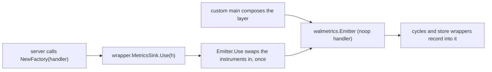
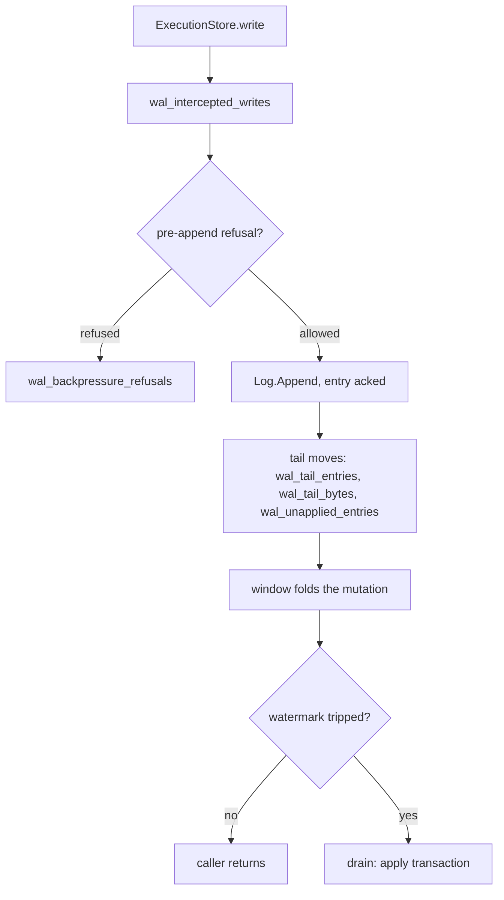
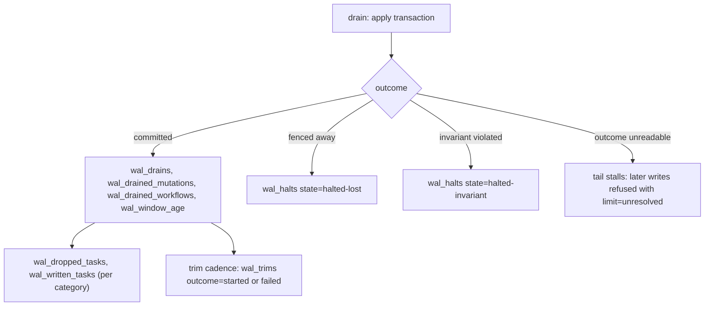
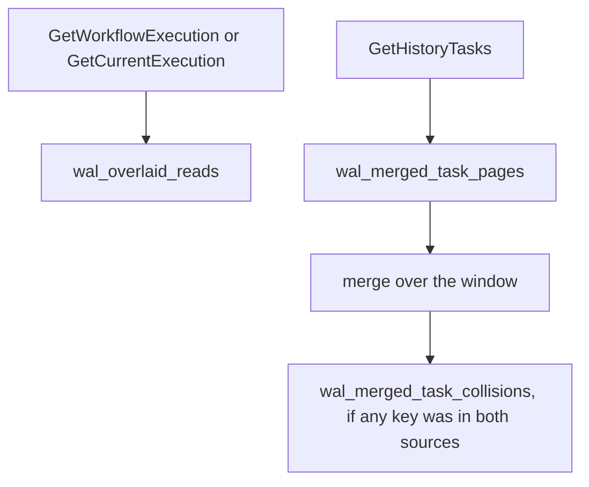

# Every series the layer emits

Metrics are useful only when the question is precise. “Is the WAL healthy?” is not one question:
a node can be correctly fencing an old owner and efficiently collapsing writes while its
cold-store apply path falls behind; it can also fail to publish its handler at the same time.
No single green or red number can separate those stories.

This chapter builds the dashboard around four questions:

1. **Is the layer actually in the path?** Routed write and read counters establish participation;
   their absence alone does not distinguish passthrough from an idle node.
2. **Is the window buying anything?** Drained mutations versus drained workflows measures collapse;
   written versus dropped tasks measures work that never needed to reach the cold store.
3. **Is the cold store keeping up?** Tail observations, unapplied distance, window age and
   backpressure show different parts of the runway.
4. **Did correctness machinery fire?** A lost-owner halt is normal fencing; an invariant halt or a
   merged-page collision is a page. Aggregating them together destroys the distinction.

The exact series table remains the reference, but it supports these questions rather than replacing
them. Several instruments count something narrower than their names suggest, so emission point,
unit and tag set are part of the meaning, not decoration.

The shortest useful reading is:

| Question | Start with | Distinction to preserve |
|---|---|---|
| participation | `wal_intercepted_writes`, `wal_overlaid_reads`, `wal_merged_task_pages` | routed traffic is not the same as a window hit |
| benefit | `wal_drained_mutations` / `wal_drained_workflows`; `wal_dropped_tasks` / `wal_written_tasks` | keep both sides of each ratio |
| runway | `wal_tail_entries`, `wal_tail_bytes`, `wal_unapplied_entries`, `wal_window_age`, `wal_backpressure_refusals` | tail size, watermark distance and age answer different questions |
| correctness | `wal_halts` by `state`, `wal_merged_task_collisions` | lost ownership is expected; invariant failure is not |

The next sections explain why these instruments have their particular shapes and units. The
write-path map in section 5 then shows when they move; sections 6 and 7 turn them into derived
quantities and alerts.

---

## 1. How the numbers get out

There is no exporter here, no second scrape endpoint and no new dependency. Every series goes
through **the server's own `metrics.Handler`** — the one the rest of the Temporal process uses — so
the series land in whatever the operator already configured.

That requires one piece of plumbing and explains the metrics' own failure mode. The handler exists
*later* than the layer: a custom main composes the log, the apply
cycles and the store wrappers, and the server only hands a handler to
`AbstractDataStoreFactory.NewFactory` afterwards, inside its own fx graph. So the handler travels
back down the same seam, through `wrapper.MetricsSink` — one method, `Use(h metrics.Handler)`,
**first call wins**.

This creates an ambiguity worth keeping in mind throughout the chapter. A blank dashboard may mean
no traffic, passthrough mode, or a layer that never received the real handler. Scraped metrics can
describe what was emitted; they cannot by themselves prove that the intended path executed.
[Chapter 11](11-verification.md#the-witness-and-why-a-green-intercept-run-proves-nothing-without-it)
uses an in-process witness for that stronger claim.

How to read this: everything on the left is already running and already recording — into a noop
handler — before anything on the right happens. Two consequences. A binary running several services
in one process reports **every** series to the handler of whichever service built persistence first,
rather than splitting the list across two of them. And a layer whose `Use` is never called (a store
wrapper built by hand with `wrapper.Options.Metrics` nil, for instance) works perfectly and emits
nothing — which is exactly what a correctly-wired idle cluster also looks like, so do not read
silence as passthrough. [11-verification.md](11-verification.md) covers the in-process witness that
exists because that failure is silent in both directions.

---

## 2. Three shape decisions, because they change how you read the numbers

Each shape below rejects an attractive but misleading alternative. A node-wide gauge without a
shard tag reports whichever shard moved last; adding the tag turns every shard into permanent
cardinality. A precomputed ratio cannot distinguish an empty denominator from a perfect result. A
timer named “age” is easy to mistake for operation latency. Histograms, counter pairs and the
handler's timer unit are consequences of those failures.

**(a) Per-shard quantities are histograms, not gauges.** The tail, the window age and the unapplied
count are per-shard facts. They are emitted with no shard tag, as distributions over shards and over
time. Two reasons, and the second is not a preference: a shard tag would be a cardinality class
Temporal has nowhere else in its metric set, and for a gauge it is not even optional — a handler
keeps one value per attribute set, so a node-wide gauge with no shard tag reports whichever shard
recorded last. Read `wal_tail_entries` as "the distribution of tail depth across this node's
shards", and alert on its upper quantiles, never on its mean.

**(b) Ratios go out as two counters, never pre-divided.** The collapse ratio is
`wal_drained_mutations` over `wal_drained_workflows`; the I7 drop share comes from
`wal_dropped_tasks` and `wal_written_tasks` (§6 has the expression). The division is the reader's.
A metrics stack has nowhere to put what a ratio was measured over, and — the sharper reason — the
denominator moves with the numerator, so a pre-divided share cannot tell *"everything was dropped"*
from *"there was nothing to drop"*. Same argument for `wal_trims{outcome}` and for the replay pair.

**(c) Nothing here is a latency.** There is no timing of a write, a drain or an apply transaction in
this list. The one `Timer` is `wal_window_age`, and it is an *age* — how old the oldest un-drained
mutation in a window had got by the time that window drained, which is what the age watermark fires
on. If you need write latency, it is the server's own persistence latency series, measured around
the store call that the layer sits inside.

---

## 3. The reference table

Every series `walmetrics/walmetrics.go` declares. Nothing else in this repository emits a
metric.

Tag keys: `operation` and `task_category` are Temporal's own (`metrics.OperationTag`,
`metrics.TaskCategoryTag`); `trigger`, `limit`, `state` and `outcome` are this layer's, declared as
`walmetrics.TagTrigger`, `TagLimit`, `TagState`, `TagOutcome`.

The **unit** column is descriptive for every counter — it says what one increment means, and nothing
in a scrape carries it. No counter here is declared with a unit. Only the histograms carry one from
their definition (`wal_tail_entries` and `wal_unapplied_entries` dimensionless, `wal_tail_bytes` in
bytes), and the timer's comes from the handler (§4).

| series | type | unit | tags and full value sets | emitted from | what it counts, exactly |
|---|---|---|---|---|---|
| `wal_intercepted_writes` | counter | writes | `operation` = one of `CreateWorkflowExecution`, `UpdateWorkflowExecution`, `ConflictResolveWorkflowExecution`, `SetWorkflowExecution`, `DeleteWorkflowExecution`, `DeleteCurrentWorkflowExecution`, `AddHistoryTasks`, `RangeCompleteHistoryTasks` | `ExecutionStore.write`, on the way *in* | Writes this store sent at the layer. Taken before the append, so a write the tail refused or a halted cycle never appended is in it, and a retried write is in it once per attempt. |
| `wal_overlaid_reads` | counter | reads | `operation` = `GetCurrentExecution` or `GetWorkflowExecution` | `ExecutionStore.GetCurrentExecution` / `GetWorkflowExecution` | Reads **routed** through the overlay — not reads the window could answer. A counter that only fired on a hit would read zero on a healthy idle cluster and zero on a layer wired up wrong. |
| `wal_merged_task_pages` | counter | pages | none | `ExecutionStore.GetHistoryTasks` | `GetHistoryTasks` pages **routed** at the layer's merge, for the same reason. The name says merged and the counter does not; renaming it would break every expression over it, so the description carries the distinction. |
| `wal_merged_task_collisions` | counter | keys | none | `Cycle.readTasks` (`cycle/tasks.go`), on the shard's own goroutine | Task keys a merged page found in **both** the window and the cold store. The sources are disjoint by construction, so any non-zero value means something is wrong. Recorded only when the count is above zero. |
| `wal_drains` | counter | drains | `trigger` = `mutations`, `bytes`, `age`, `refusal`, `sync`, `replay`, `explicit`, `read` — eight values, of which `sync` appears only under [`wal.sync: true`](08-configuration.md#2-table-1--the-wal-sections-keys) | `Cycle.drain`, after the apply transaction commits | Committed drains, by what tripped them — transactions, not passes of the cycle. A drain that halted never reaches this, and neither does one whose batch folded to nothing: an empty batch settles its entries and returns before this is recorded. `sync` is its own cause and not `explicit`: one write, one drain, and the only cause whose outcome answers a caller. Under `sync` the size watermarks are never reached — the sync arm returns before `window.Trips` is evaluated — so `mutations` and `bytes` are unreachable there. |
| `wal_drained_mutations` | counter | mutations | none | same call as `wal_drains` | Mutations carried into a committed drain — the collapse ratio's numerator. Untagged: it cannot be split by trigger. |
| `wal_drained_workflows` | counter | workflows | none | same call as `wal_drains` | Workflows written by a committed drain — the collapse ratio's denominator. |
| `wal_window_age` | **timer** | see §4 | none | same call as `wal_drains` | Age of the oldest mutation in the window at the moment it drained. |
| `wal_answered_condition_failures` | counter | writes | none | `Cycle.answerWriter` | Drains whose condition did not hold and were **answered to the caller** instead of halting the shard. Zero in windowed mode: every condition is decided before the append, so no failed condition reaches a drain. A non-zero reading means the check let a condition through, or sync mode's drain answered the caller still on the line. `answered` is load-bearing: a condition failure at a drain has three endings (`cycle.attribute`) and this counts one. The other two are `wal_halts{state="halted-invariant"}`, for a batch whose caller cannot be named, and `wal_replay_dropped_entries`, for a replayed provisional entry whose caller has its answer already. In the windowed path, only the halt branch remains reachable during a drain. |
| `wal_backpressure_refusals` | counter | writes | `limit` = `entries`, `bytes`, `unresolved` | `Cycle.writeRefused`, before the append | Writes the shard refused before appending them, by what refused. `entries`/`bytes` are [I10](02-concepts-and-invariants.md#the-invariants)'s two size bounds; `unresolved` is the applier being blind rather than behind — it cannot read what its last drain did, so nothing may be applied over it. |
| `wal_halts` | counter | cycles | `state` = `halted-lost`, `halted-invariant` | `Cycle.halt` | Apply cycles that stopped, by class. The tag value is the state's own `String()`, so a state added to the cycle cannot be silently folded into a bucket here. **Never sum the two** — see §7. |
| `wal_trims` | counter | trims | `outcome` = `started`, `failed` | `trim.Trimmer.start` and its goroutine | Log trims by outcome. A failed trim is retried at the next cadence and halts nothing, so this is the only place it is visible. `started` minus `failed` is the number that succeeded *or* is still in flight. |
| `wal_tail_entries` | histogram | dimensionless (entries) | none | `tailstate.Mirror.store`, reached by every tail move | Entries acked into the log and not yet settled, on one shard, observed at each append and each drain. One observation per shard per tail move. |
| `wal_tail_bytes` | histogram | bytes | none | same call | Encoded bytes acked and not yet settled, on one shard. The second unit I10 bounds; not the window's byte count, which is a different number. |
| `wal_unapplied_entries` | histogram | dimensionless (seqnos) | none | same call | `commitSeqno − appliedSeqno`: how far the cold store is behind the log, per shard. **Not** the tail — see §8. |
| `wal_replayed_entries` | counter | entries | none | `Cycle.replay`, once the replay has finished | Entries a new owner read out of the tail a previous owner left, and applied. Emitted once per completed replay rather than per entry, because an attempt that failed part-way is retried whole from the watermark and would otherwise count its entries twice. |
| `wal_replay_dropped_entries` | counter | entries | none | same call | Replayed entries dropped because their ack was provisional and their condition did not hold. Zero here, for the same kind of reason as `wal_answered_condition_failures`: a condition is decided before the append, so nothing is acked provisionally and a replay meets no such entry. Recorded only when above zero. |
| `wal_dropped_tasks` | counter | task rows | `task_category` = the registry's category names. Upstream registers `transfer`, `timer`, `visibility`, `replication`, `outbound` unconditionally, plus the in-memory `memory-timer`, which persists no rows; `archival` only where archival is enabled. A deployment's own categories appear too. | `Cycle.countTasks`, after the transaction commits | Task rows a committed drain did **not** write, because their queue had already deleted the range they fall in (invariant I7). A batch that did not commit wrote no rows, so a drop counted for it would be a saving nobody made. |
| `wal_written_tasks` | counter | task rows | same | same call | Task rows a committed drain wrote to the cold store. The drop's denominator. A category a drain did not carry emits nothing rather than a pair of zeroes. |

Two readings that catch people out, both deliberate:

* `wal_overlaid_reads` and `wal_merged_task_pages` count **routing**, not hits. The number of reads
  the window actually answered is an in-process counter and not a series (§8).
* `wal_drains` counts **committed** drains. Halts are counted by their own series and are not in it,
  so `wal_drains` plus `wal_halts` is not "attempted drains" and should not be charted as one.

---

## 4. The timer caveat: `wal_window_age`'s unit is the handler's

`wal_window_age` is declared with `metrics.NewTimerDef`, and a timer definition in Temporal carries
**no unit of its own** — the handler picks one:

* under the **otel handler**, the default is milliseconds and the value is recorded as
  `duration.Milliseconds()`, i.e. **truncated to a whole millisecond**. Every sub-millisecond window
  age records `0`;
* if the operator sets `recordTimerInSeconds` in the metrics configuration, the same handler records
  seconds instead — and every existing threshold over the series silently changes meaning by a
  factor of 1000;
* the tally fallback and the capture handler used by tests do not apply the OTel handler's
  millisecond truncation; consult each handler's unit before comparing values.

So: read the histogram against the age watermark (`wal.windowAge`, see
[08-configuration.md](08-configuration.md#3-table-2--the-nine-dynamic-config-settings)) in the same
unit your handler emits, and treat a floor of zeroes on a fast, busy shard as the truncation rather
than as a bug. This is the one series whose numbers are not comparable across two deployments
without checking that flag first.

---

## 5. Where each series sits on the write path

The write, with the emission points attached. The path itself is
[05-write-path.md](05-write-path.md); this is only where the numbers come off it.

How to read this: the tail's three series are emitted by *every* move of the tail, not only by an
append — a settle, a stall and a replay's floor publish them too, because publishing the tail is
what moving it does.

The drain's own outcomes, continuing from `J`:

How to read this: the four series on `L` are emitted by **one** call, so a drain cannot be counted
without its collapse pair and its age, and the task pair is emitted only after the transaction has
an outcome. The `R` arm's stall shows up later, as `wal_backpressure_refusals{limit="unresolved"}`.

The read path, which is shorter:

How to read this: of the three, only the collision counter is a statement about what the merge
found — the other two fire on the way in, before the layer has decided whether the window holds
anything. [07-read-path.md](07-read-path.md) has the merge itself.

Replay sits outside all three and emits `wal_replayed_entries` and `wal_replay_dropped_entries` once
the replay has finished, plus a `wal_drains{trigger="replay"}` for the drain that ends it —
[06-shard-lifecycle.md](06-shard-lifecycle.md).

---

## 6. Quantities to derive

None of these are emitted; all of them are the point of the pairs above. Rates are over whatever
window your dashboard uses.

Derived values preserve information only if their denominator remains visible. Ten dropped tasks
out of ten means the window eliminated all task writes; zero out of zero means there was no task
traffic. Both can look like “nothing was written,” but only the counter pair lets the dashboard tell
which world it is in.

* **Collapse ratio** — how much work the window is saving:
  `rate(wal_drained_mutations) / rate(wal_drained_workflows)`.
  1.0 means nothing is collapsing and a drain costs what the writes would have.
* **I7 drop share, per category** — how much task work the window let a queue delete under it:
  `rate(wal_dropped_tasks{task_category=X}) / (rate(wal_dropped_tasks{task_category=X}) + rate(wal_written_tasks{task_category=X}))`.
  Compare each category against its own history: immediate and scheduled categories drop at
  unrelated rates. Keep the denominator as the sum — that is what distinguishes "everything was
  dropped" from "there were no tasks".
* **Refusal rate by limit** — which bound is biting:
  `rate(wal_backpressure_refusals{limit=X}) / rate(wal_intercepted_writes)`.
  Use `wal_intercepted_writes` as the denominator rather than a drain count: refusals are counted
  before the append and so are the writes.
* **Trim failure share** — `rate(wal_trims{outcome="failed"}) / rate(wal_trims{outcome="started"})`.
* **Drain mix** — `rate(wal_drains) by (trigger)`, as fractions of the total. A node drawing almost
  only `age` is idle rather than behind; one drawing `refusal` at any noticeable rate is folding
  windows the accumulator cannot express. Take the mix over all eight values: a node running `sync`
  draws `sync` for every write, so an expression written over the windowed values alone reads zero
  there rather than reading a shape.

---

## 7. Alerting

**Thresholds are deployment-specific and this chapter deliberately invents none.** What follows is
the *shape* of each alert — the condition to write, what firing means, and which runbook in
[09-operations.md](09-operations.md#5-runbooks) to open. Calibrate the numbers against a week of
your own traffic.

| condition (shape) | severity | what it means | first action |
|---|---|---|---|
| `increase(wal_halts{state="halted-invariant"}) > 0` over any window | **page** | An assertion failed inside a window whose failure could not be pinned on one caller. There is no retry and no failover — the layer deliberately does not convert this into an ownership-lost — so **nobody else picks it up**. | [runbook (b)](09-operations.md#b-a-shard-halted--and-which-of-the-two-classes); capture the WAL folder before anything trims it |
| `increase(wal_merged_task_collisions) > 0` over any window | **page** | A merged task page found the same key in the window and in the cold store. The sources are disjoint by construction, so any non-zero value is a correctness signal: a second writer, or a window release that did not happen. | [runbook (f)](09-operations.md#f-merged-page-collisions-are-non-zero) |
| `wal_backpressure_refusals{limit="unresolved"}` non-zero and sustained | page | The applier cannot read what its last drain did, so nothing may be applied over it. No size knob clears this. | [runbook (a)](09-operations.md#a-a-shard-stopped-accepting-writes--backpressure-or-an-unresolved-drain) |
| `rate(wal_backpressure_refusals{limit=~"entries\|bytes"})` above your normal floor, sustained | high | I10's per-shard bound is refusing writes: the tail reached its limit because the applier is behind. Refused writes provably wrote nothing. | [runbook (a)](09-operations.md#a-a-shard-stopped-accepting-writes--backpressure-or-an-unresolved-drain) — fix the cold store |
| high quantile of `wal_unapplied_entries` climbing and not returning | high | The cold store is falling behind; the runway before backpressure is what is left of the tail bound. | [runbook (c)](09-operations.md#c-the-cold-store-is-falling-behind) |
| high quantile of `wal_window_age` well above `wal.windowAge` | medium | Drains are not keeping up with the age watermark that should be firing them. Check the unit first (§4). | [runbook (c)](09-operations.md#c-the-cold-store-is-falling-behind) |
| `rate(wal_trims{outcome="failed"})` a sustained fraction of `started` | medium | The log is not being compacted. Halts nothing, degrades write latency over hours as the log's partitions grow. | [runbook (d)](09-operations.md#d-trims-are-failing) |
| I7 drop share for one category stepping up and staying up | medium | More task work is being deleted under the window than before, which is a saving rather than a fault: fewer drains fall between two queue checkpoints than did. Usually the window got bigger; occasionally the queues began checkpointing more often. | [runbook (e)](09-operations.md#e-task-drops-are-climbing) |
| collapse ratio falling towards 1 | low / informational | The window has stopped saving work; drains cost what the writes would have. Not a fault, but it removes the layer's reason to be there. | [runbook (c)](09-operations.md#c-the-cold-store-is-falling-behind) |
| `wal_answered_condition_failures` non-zero | medium | Zero is the expected value: every condition is decided before the append. Non-zero means a condition reached a drain that should not have. | [05-write-path.md](05-write-path.md#3-failed-write--the-condition-did-not-hold) |

One thing **not** to alert on: `wal_halts{state="halted-lost"}` is fencing working — expect it on
every failover and every rolling restart; an alert summing the two halt classes will page for
normal operation, which is exactly why the class is a tag and not a bare counter.

---

## 8. The in-process counters, and what they add

Beside the series there are three doors onto plain Go values, read in-process rather than scraped.
They exist because a metric that a run has to scrape cannot be asserted on. Two are on the layer —
`cycle.Stats` for one shard, `cycle.Totals` for the node, both carrying the same embedded
`cycle.Counters` — and the third is the wrapper's own `ExecutionStore.Counts()`.

**`cycle.Stats`** — one shard's cycle, asked of that cycle's own goroutine through `Cycle.Stats()`
(exposed as `waltz.Layer.ShardStats(shard)`). It carries the cycle's `State` and `Epoch`; the
window's `Mutations` and `Bytes` since the last drain; the positions `CommitSeqno` and
`AppliedSeqno`; the tail's `TailEntries` and `TailBytes`; the embedded `Counters`; and `LastStats`,
fold's own counters from the last drain, so the collapse ratio is reported with the window it came
from.

**`cycle.Totals`** — every cycle this node has held, summed, through `Manager.Totals()` (exposed as
`waltz.Layer.Totals()`). It carries `Shards` (cycles held now) and `Epochs` (every cycle ever
created, so `Epochs > Shards` is a node that has re-acquired); the same embedded `Counters`; the
positions `Acked`, `Applied` and `TailEntries`, taken from the cycles held now; and `Halted`, a
string per shard whose current cycle is not running.

**`cycle.Counters`**, embedded by both, is the summable half: `Drains`, `Trims`, `TrimsCommitted`,
`Refusals`, `Replayed`, `Dropped`, `Reads`, `ReadsHeld`, `TaskReads`, `TaskReadsMerged`,
`TaskCollisions`, `AckedRanges`, `DroppedTasks`, `WrittenTasks`, and `Kinds` — a count per
`mutation.Kind`, to be read as "did this kind appear at all", never as a rate. A **position** may
not go in, because a new cycle inherits a log's positions and summing them counts the same entries
once per acquire; that is why `Acked` and `Applied` sit outside it.

Two of these have no series and are the reason to reach for the counters at all: `ReadsHeld` (the
subset of overlay reads the window actually had something for) and `TaskReadsMerged` (the subset of
routed task pages that carried a task out of the window). Reads that never crossed a held workflow
are what an empty layer looks like from outside, so those are the numbers a witness rests on. The store wrapper keeps its own small set as well — `wrapper.ExecutionStore.Counts()`,
with `Intercepted`, `TasksWritten`, `TasksCompleted`, `Overlaid` and `TaskReads`, of which the last
two are the in-process twins of the two routing counters.

Who reads them: `verify/witness`, which is where the claims a run makes about what the layer saw are
stated once. See [11-verification.md](11-verification.md).

The same three types are listed field for field in
[04-contracts.md](04-contracts.md#stats-counters-and-totals), which owns them as a seam where this
chapter owns them as readings. Both lists are complete, so **a counter added to `cycle.Counters`
lands in two chapters** — there is no partial list here to leave stale.

### The distinction this repo insists on

**The tail is not `commitSeqno − appliedSeqno`.**

* `wal_unapplied_entries` / `Stats.CommitSeqno − Stats.AppliedSeqno` is how far the **cold store**
  is behind the log.
* `wal_tail_entries` / `Stats.TailEntries` is what invariant I10 bounds: acked entries whose fate is
  **not yet settled**.

They part company at a drain that settles without moving the watermark — the third position,
`resolved`, and why it exists are
[chapter 02](02-concepts-and-invariants.md#three-positions-not-two). Both series are emitted so that
a dashboard can see the gap rather than average it away.

What is worth knowing here is what the gap *means* when it opens in the surprising direction. The
common shape of a settling drain is an `AddHistoryTasks` with no rows in it, and nothing in the
server builds that request: every `shardContext.AddTasks` call site fills its map from at least one
task. So a shard whose tail reads **below** its unapplied count was sent one, and that is the
finding, not the arithmetic.

---

## 9. One deliberate absence

There is **no counter for the log backend's own planned transactions**. It is a property of the log
rather than of this process: every node writing that log contributes to the same number, so N nodes
emitting it would report it N times. Invariant I9 — that an append is one round trip and not a
distributed transaction — is therefore watched by a guard over the backend's own counters rather
than by a runtime series, and that guard belongs to whoever ships the backend;
[11-verification.md](11-verification.md) says what it has to do.

---

## Where this lives in the code

* [`../../walmetrics/walmetrics.go`](../../walmetrics/walmetrics.go) — the authority: every
  series, every tag key and value constant, the `Emitter` and its record methods, and the package
  comment stating the three shape decisions.
* [`../../wrapper/execution_store.go`](../../wrapper/execution_store.go) — the wrapper's
  emission points: the interception table that supplies the `operation` tag values, the two overlay
  reads, the routed task page, and the in-process `Counts`.
* [`../../wrapper/wrapper.go`](../../wrapper/wrapper.go) — `MetricsSink` and
  `Options.Metrics`: the seam the server's handler travels back down, and what a nil emitter means.
* [`../../cycle/cycle.go`](../../cycle/cycle.go) — `Stats`, the drain's four-series emission,
  `countTasks`, `answerWriter`, `writeRefused` and `halt`; also the `drainCause` values that supply
  every `trigger` tag.
* [`../../cycle/counters.go`](../../cycle/counters.go) — `Counters`, with the rule that a
  position may not go in and why.
* [`../../cycle/manager.go`](../../cycle/manager.go) — `Totals`, and why the positions are
  summed only over cycles held now.
* [`../../cycle/tailstate/tailstate.go`](../../cycle/tailstate/tailstate.go) — the mirror
  whose `store` is the single emission point of the three tail series, reached by every tail move.
* [`../../cycle/trim/trim.go`](../../cycle/trim/trim.go) — where `wal_trims` is emitted, and
  why both outcomes are counted.
* [`../../cycle/replay.go`](../../cycle/replay.go) — the single emission of the replay pair,
  once a replay has finished.
* [`../../waltz.go`](../../waltz.go) — `Layer.Totals` and `Layer.ShardStats`: the
  in-process doors an operator-facing endpoint or a test reads.
* [`../../verify/witness/witness.go`](../../verify/witness/witness.go) — the claims stated over
  `cycle.Totals` and over the emitted series, and the one place both are read together.
