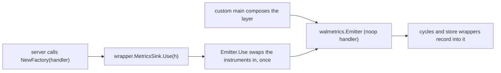
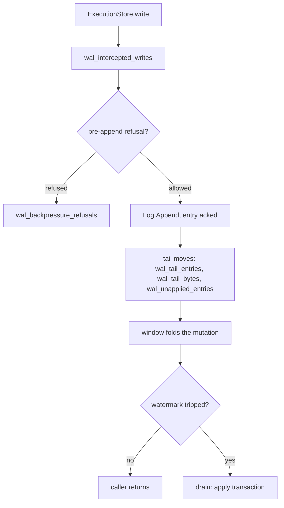
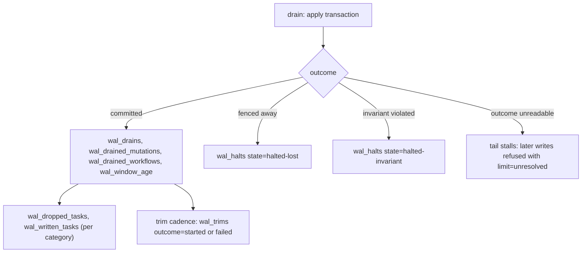
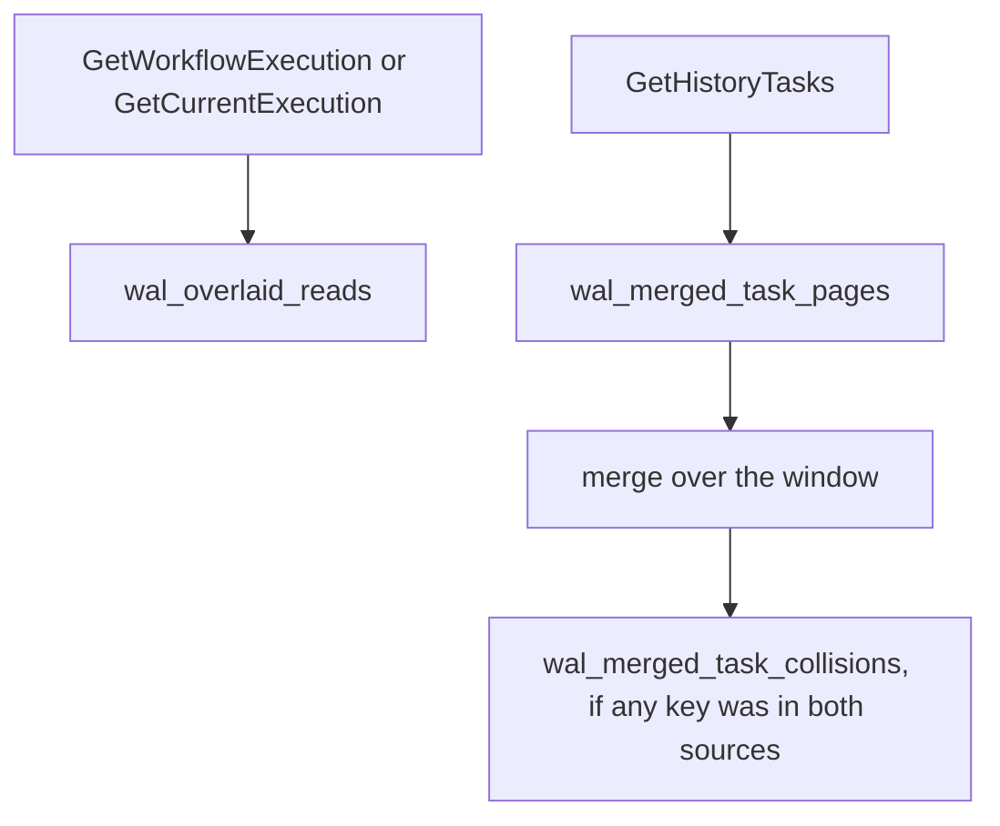

# Every series the layer emits

Metrics are useful only when the question is precise, and “is the WAL healthy?” is not one question.
A node can be fencing an old owner correctly and collapsing writes efficiently while its apply path
falls behind the cold store. The same node may never have been handed the server's metrics handler
at all, in which case it reports nothing whatever it is doing. No single number separates those
stories.

This chapter builds the dashboard around four questions:

1. **Is the layer actually in the path?** Routed write and read counters establish participation;
   their absence alone does not distinguish passthrough from an idle node.
2. **Is the window buying anything?** Drained mutations versus drained workflows measures collapse;
   written versus dropped tasks measures work that never needed to reach the cold store.
3. **Is the cold store keeping up?** Tail size, the distance from the last ack to the cold store's
   watermark, window age and backpressure each show a different part of the runway.
4. **Did correctness machinery fire?** A lost-owner halt is normal fencing; an invariant halt or a
   merged-page collision is a page. Aggregating them together destroys the distinction.

Section 3 is the exact table of series, and it serves those four questions rather than replacing
them. Several instruments count something narrower than their names suggest, so where a series is
emitted, what unit it carries and which tags it takes are part of what it means.

The shortest useful reading is:

| Question | Start with | Distinction to preserve |
|---|---|---|
| participation | `wal_intercepted_writes`, `wal_overlaid_reads`, `wal_merged_task_pages` | routed traffic is not the same as a window hit |
| benefit | `wal_drained_mutations` / `wal_drained_workflows`; `wal_dropped_tasks` / `wal_written_tasks` | keep both sides of each ratio |
| runway | `wal_tail_entries`, `wal_tail_bytes`, `wal_unapplied_entries`, `wal_window_age`, `wal_backpressure_refusals` | tail size, watermark distance and age answer different questions |
| correctness | `wal_halts` by `state`, `wal_merged_task_collisions` | lost ownership is expected; invariant failure is not |

The next sections explain why these instruments have their particular shapes and units. The
write-path map in section 5 then shows when they move; sections 6 and 7 turn them into derived
quantities and alerts.

---

## 1. How the numbers get out

There is no exporter here, no second scrape endpoint and no new dependency. Every series goes
through **the server's own `metrics.Handler`** — the one the rest of the Temporal process uses — so
the series land in whatever the operator already configured.

That costs one piece of plumbing, and the plumbing is where the metrics' own failure mode comes
from. The handler exists *later* than the layer. A custom main composes the log, the apply cycles
and the store wrappers first; the server hands a handler to `AbstractDataStoreFactory.NewFactory`
afterwards, inside its own fx graph. So the handler travels back down the same seam, through
`wrapper.MetricsSink` — one method, `Use(h metrics.Handler)`, **first call wins**.

Keep one ambiguity in mind for the rest of the chapter. A blank dashboard means no traffic, or
passthrough mode, or a layer that never received the real handler. Scraped metrics describe what was
emitted; they cannot prove that the intended path ran.
[Chapter 11](11-verification.md#the-witness-and-why-a-green-intercept-run-proves-nothing-without-it)
uses an in-process witness for that stronger claim.

How to read this: everything on the left is already running and already recording — into a noop
handler — before anything on the right happens. That has two consequences.

* A binary running several services in one process reports **every** series to the handler of
  whichever service built persistence first. The list is not split across two of them.
* A layer whose `Use` is never called works perfectly and emits nothing. A store wrapper built by
  hand with `wrapper.Options.Metrics` nil is the way to get there: it records into a private noop
  emitter that nothing can later replace.

Silence is therefore not evidence of passthrough — a correctly wired idle cluster looks the same.
[11-verification.md](11-verification.md) covers the in-process witness that exists because that
failure is silent in both directions.

---

## 2. Three shape decisions, because they change how you read the numbers

Three instrument shapes here look like odd choices until you know what each was chosen against. A
gauge per node with no shard tag reports whichever shard moved last, and adding the tag makes every
shard permanent cardinality. A ratio divided before it is emitted cannot tell an empty denominator
from a perfect result. A timer named “age” invites the reader to take it for operation latency. The
three subsections below are the shapes that avoid those three failures: histograms, counter pairs,
and one timer whose unit comes from the handler.

**(a) Per-shard quantities are histograms, not gauges.** The tail, the window age and the unapplied
count are facts about one shard. They go out with no shard tag at all, as distributions over this
node's shards and over time.

Tagging by shard is the obvious alternative, and it costs a cardinality class Temporal has nowhere
else in its metric set: one series per shard per node, for as long as the shard exists. Dropping the
tag but keeping a gauge fails harder. A handler keeps one value per attribute set, so a node-wide
gauge with no shard tag reports whichever shard recorded last — every other shard's value is
overwritten before anyone scrapes it. A histogram keeps every observation instead. So read
`wal_tail_entries` as "the distribution of tail depth across this node's shards", and alert on its
upper quantiles, never on its mean.

**(b) Ratios go out as two counters, never pre-divided.** The collapse ratio is
`wal_drained_mutations` over `wal_drained_workflows`; the I7 drop share comes from
`wal_dropped_tasks` and `wal_written_tasks`. Section 6 has both expressions; the division is yours
to do.

Emitting the quotient instead throws the denominator away, and a metrics stack has nowhere to put it
back. You would no longer be able to tell *"everything this drain carried was dropped"* from *"this
drain carried nothing to drop"* — the first says the window is doing its job, the second says the
shard has no task traffic. `wal_trims{outcome}` and the replay pair (`wal_replayed_entries` against
`wal_replay_dropped_entries`) are two counters for the same reason.

**(c) Nothing here is a latency.** No series in this chapter times a write, a drain or an apply
transaction. The one `Timer` in the list is `wal_window_age`, and it records an *age* rather than the
duration of any piece of work: how long the window's oldest mutation had been waiting when the window
drained. That is the same quantity the `wal.windowAge` watermark fires on. If you want write latency,
use the server's own persistence latency series — it is measured around the store call the layer sits
inside.

---

## 3. The reference table

Every series `walmetrics/walmetrics.go` declares. Nothing else in this repository emits a
metric.

Tag keys: `operation` and `task_category` are Temporal's own (`metrics.OperationTag`,
`metrics.TaskCategoryTag`); `trigger`, `limit`, `state` and `outcome` are this layer's, declared as
`walmetrics.TagTrigger`, `TagLimit`, `TagState`, `TagOutcome`.

The **unit** column is descriptive for every counter: it says what one increment means, and no
counter here is declared with a unit, so nothing in a scrape carries it. The three histograms take
theirs from their definitions — `wal_tail_entries` and `wal_unapplied_entries` dimensionless,
`wal_tail_bytes` in bytes — and the timer takes its unit from the handler (§4).

| series | type | unit | tags and full value sets | emitted from | what it counts, exactly |
|---|---|---|---|---|---|
| `wal_intercepted_writes` | counter | writes | `operation` = one of `CreateWorkflowExecution`, `UpdateWorkflowExecution`, `ConflictResolveWorkflowExecution`, `SetWorkflowExecution`, `DeleteWorkflowExecution`, `DeleteCurrentWorkflowExecution`, `AddHistoryTasks`, `RangeCompleteHistoryTasks` | `ExecutionStore.write`, on the way *in* | Writes this store sent at the layer. Taken before the append, so a write the tail refused or a halted cycle never appended is in it, and a retried write is in it once per attempt. |
| `wal_overlaid_reads` | counter | reads | `operation` = `GetCurrentExecution` or `GetWorkflowExecution` | `ExecutionStore.GetCurrentExecution` / `GetWorkflowExecution` | Reads **routed** through the overlay — not reads the window could answer. A counter that only fired on a hit would read zero on a healthy idle cluster and zero on a layer wired up wrong. |
| `wal_merged_task_pages` | counter | pages | none | `ExecutionStore.GetHistoryTasks` | `GetHistoryTasks` pages **routed** at the layer's merge, for the same reason as `wal_overlaid_reads`. The name says merged and the counter does not; renaming it would break every expression over it, so the description carries the distinction instead. |
| `wal_merged_task_collisions` | counter | keys | none | `Cycle.readTasks` (`cycle/tasks.go`), on the shard's own goroutine | Task keys a merged page found in **both** the window and the cold store. The sources are disjoint by construction, so any non-zero value means something is wrong. Recorded only when the count is above zero. |
| `wal_drains` | counter | drains | `trigger` = `mutations`, `bytes`, `age`, `refusal`, `sync`, `replay`, `explicit`, `read` — eight values, of which `sync` appears only under [`wal.sync: true`](08-configuration.md#2-table-1--the-wal-sections-keys) | `Cycle.drain`, after the apply transaction commits | Committed drains, by what tripped them — transactions, not passes of the cycle. A drain that halted never reaches this, and neither does one whose batch folded to nothing: an empty batch settles its entries and returns before this is recorded. `sync` is a cause of its own rather than a flavour of `explicit`, because it is the only one whose outcome is reported back to a caller: one write, one drain, one answer. Under `sync` the size watermarks are never reached — the sync arm returns before `window.Trips` is evaluated — so `mutations` and `bytes` cannot appear there. |
| `wal_drained_mutations` | counter | mutations | none | same call as `wal_drains` | Mutations carried into a committed drain — the collapse ratio's numerator. Untagged: it cannot be split by trigger. |
| `wal_drained_workflows` | counter | workflows | none | same call as `wal_drains` | Workflows written by a committed drain — the collapse ratio's denominator. |
| `wal_window_age` | **timer** | see §4 | none | same call as `wal_drains` | Age of the oldest mutation in the window at the moment it drained. |
| `wal_answered_condition_failures` | counter | writes | none | `Cycle.answerWriter` | Drains whose condition did not hold and were **answered to the caller** instead of halting the shard. This is sync mode's traffic and only sync mode's: `drainSync` is the one cause carrying the attribution that reaches here, so under `wal.sync: true` this rate is what tells a shard losing ordinary races from one diverging. In windowed mode it stays at zero — every condition is decided before the append, so no failed condition survives to a drain, and the halt branch is the only one a windowed drain can reach. `answered` is load-bearing: a condition failure at a drain has three endings (`cycle.attribute`) and this counts one. The other two are `wal_halts{state="halted-invariant"}`, for a batch whose caller cannot be named, and `wal_replay_dropped_entries`, for a replayed provisional entry whose caller has its answer already. |
| `wal_backpressure_refusals` | counter | writes | `limit` = `entries`, `bytes`, `unresolved` | `Cycle.writeRefused`, before the append | Writes the shard refused before appending them, by what refused. `entries`/`bytes` are [I10](02-concepts-and-invariants.md#the-invariants)'s two size bounds; `unresolved` is the applier being blind rather than behind — it cannot read what its last drain did, so nothing may be applied over it. |
| `wal_halts` | counter | cycles | `state` = `halted-lost`, `halted-invariant` | `Cycle.halt` | Apply cycles that stopped, by class. The tag value is the state's own `String()`, so a state added to the cycle cannot be silently folded into a bucket here. **Never sum the two** — see §7. |
| `wal_trims` | counter | trims | `outcome` = `started`, `failed` | `trim.Trimmer.start` and its goroutine | Log trims by outcome. A failed trim is retried at the next cadence and halts nothing, so this is the only place it is visible. `started` minus `failed` is the number that succeeded *or* is still in flight. |
| `wal_tail_entries` | histogram | dimensionless (entries) | none | `tailstate.Mirror.store`, reached by every tail move | Entries acked into the log and not yet settled, on one shard, observed at each append and each drain. One observation per shard per tail move. |
| `wal_tail_bytes` | histogram | bytes | none | same call | Encoded bytes acked and not yet settled, on one shard. The second unit I10 bounds; not the window's byte count, which is a different number. |
| `wal_unapplied_entries` | histogram | dimensionless (seqnos) | none | same call | `commitSeqno − appliedSeqno`: how far the cold store is behind the log, per shard. **Not** the tail — see §8. |
| `wal_replayed_entries` | counter | entries | none | `Cycle.replay`, once the replay has finished | Entries a new owner read out of the tail a previous owner left, and applied. Emitted once per completed replay rather than per entry, because an attempt that failed part-way is retried whole from the watermark and would otherwise count its entries twice. A replay that found an empty tail — the ordinary case on a clean acquire — records nothing here and drains nothing either, so it draws no `wal_drains{trigger="replay"}` to go with it. |
| `wal_replay_dropped_entries` | counter | entries | none | same call | Replayed entries dropped because their ack was provisional and their condition did not hold. Only sync mode acks provisionally — `mutation.EncodeProvisional` is reached under `wal.sync: true` and nowhere else — so a windowed node records zero here: its conditions are decided before the append, and a replay meets no provisional entry. Recorded only when above zero. |
| `wal_dropped_tasks` | counter | task rows | `task_category` = the registry's category names. Upstream registers `transfer`, `timer`, `visibility`, `replication`, `outbound` unconditionally, plus the in-memory `memory-timer`, which persists no rows; `archival` only where archival is enabled. A deployment's own categories appear too. | `Cycle.countTasks`, after the transaction commits | Task rows a committed drain did **not** write, because their queue had already deleted the range they fall in (invariant I7). A batch that did not commit wrote no rows, so a drop counted for it would be a saving nobody made. |
| `wal_written_tasks` | counter | task rows | same | same call | Task rows a committed drain wrote to the cold store. The drop's denominator. A category a drain did not carry emits nothing rather than a pair of zeroes. |

Two readings that catch people out, both deliberate:

* `wal_overlaid_reads` and `wal_merged_task_pages` count **routing**, not hits. The number of reads
  the window actually answered is an in-process counter and not a series (§8).
* `wal_drains` counts **committed** drains. Halts are counted by their own series and are not in it,
  so `wal_drains` plus `wal_halts` is not "attempted drains" and should not be charted as one.

---

## 4. The timer caveat: `wal_window_age`'s unit is the handler's

`wal_window_age` is declared with `metrics.NewTimerDef`, and a timer definition in Temporal carries
**no unit of its own** — the handler picks one:

* under the **otel handler**, the default is milliseconds and the value is recorded as
  `duration.Milliseconds()`, i.e. **truncated to a whole millisecond**. Every sub-millisecond window
  age records `0`;
* if the operator sets `recordTimerInSeconds` in the metrics configuration, the same handler records
  seconds instead — and every existing threshold over the series silently changes meaning by a
  factor of 1000;
* the tally fallback records the `time.Duration` it was handed, whole, and so does the capture
  handler the tests use. Neither applies the otel handler's millisecond truncation, so consult
  each handler's own unit before comparing values.

Read the histogram against the age watermark (`wal.windowAge`, see
[08-configuration.md](08-configuration.md#3-table-2--the-nine-dynamic-config-settings)) in whatever
unit your own handler emits, and treat a floor of zeroes on a fast, busy shard as the truncation
rather than as a bug. This is the one series whose numbers are not comparable across two deployments
until you have checked that flag on both.

---

## 5. Where each series sits on the write path

The write, with the emission points attached. The path itself is
[05-write-path.md](05-write-path.md); this is only where the numbers come off it.

How to read this: the tail's three series are emitted by *every* move of the tail, not only by an
append. Each of `tailstate.Tail`'s mutators — `Ack`, `Settle`, `Stall`, `Resolve` and the `Floor` a
replay plants before it starts — ends in the same `publish` call, so there is no way to move the
tail without recording it.

The drain's own outcomes, continuing from `J`:

How to read this: the four series on `L` come from **one** `Emitter.Drained` call, so a drain cannot
be counted without its collapse pair and its age. The task pair on `M` comes from `Cycle.countTasks`,
which runs only once the transaction has an outcome. The `R` arm emits nothing at the time; you see
that stall later, on the writes it refuses, as `wal_backpressure_refusals{limit="unresolved"}`.

The read path, which is shorter:

How to read this: only `wal_merged_task_collisions` says anything about what the merge found.
`wal_overlaid_reads` and `wal_merged_task_pages` fire on the way in, before the layer has looked at
the window at all. [07-read-path.md](07-read-path.md) has the merge itself.

Replay sits outside all three diagrams. A replay that found entries emits `wal_replayed_entries` and
`wal_replay_dropped_entries` once it has finished, plus a `wal_drains{trigger="replay"}` for the
drain that ends it. A replay that found an empty tail emits none of the three, which is why most
acquires leave no trace here at all — [06-shard-lifecycle.md](06-shard-lifecycle.md) has the
lifecycle.

---

## 6. Quantities to derive

None of these are emitted; each is why the pair it is built from is emitted as two counters. Rates
are over whatever window your dashboard uses.

Every expression below keeps its denominator in view, for the reason in §2(b): ten dropped tasks out
of ten and zero out of zero can both be described as “nothing was written”, and only the counter pair
separates them.

* **Collapse ratio** — how much work the window is saving:
  `rate(wal_drained_mutations) / rate(wal_drained_workflows)`.
  1.0 means nothing is collapsing: every drained mutation touched a different workflow, so the drain
  writes as many rows as the individual writes would have.
* **I7 drop share, per category** — how much task work the window let a queue delete under it:
  `rate(wal_dropped_tasks{task_category=X}) / (rate(wal_dropped_tasks{task_category=X}) + rate(wal_written_tasks{task_category=X}))`.
  Compare each category against its own history: immediate and scheduled categories drop at
  unrelated rates. Keep the denominator as the sum — that is what distinguishes "everything was
  dropped" from "there were no tasks".
* **Refusal rate by limit** — which bound is biting:
  `rate(wal_backpressure_refusals{limit=X}) / rate(wal_intercepted_writes)`.
  Use `wal_intercepted_writes` as the denominator rather than a drain count: refusals are counted
  before the append and so are the writes.
* **Trim failure share** — `rate(wal_trims{outcome="failed"}) / rate(wal_trims{outcome="started"})`.
* **Drain mix** — `rate(wal_drains) by (trigger)`, as fractions of the total. A node drawing almost
  only `age` is idle rather than behind. A node drawing `refusal` at any noticeable rate is hitting
  `fold.ErrRefused` often — a window the accumulator cannot express, or an assertion it cannot
  determine, each of which forces a drain and a retry of the mutation that caused it. Take the mix
  over all eight trigger values, not just the windowed ones: a node under
  `wal.sync: true` draws `sync` for every write, so an expression that lists only the windowed
  triggers returns nothing at all there.

---

## 7. Alerting

**Thresholds are deployment-specific and this chapter deliberately invents none.** What follows is
the *shape* of each alert — the condition to write, what firing means, and which runbook in
[09-operations.md](09-operations.md#5-runbooks) to open. Calibrate the numbers against a week of
your own traffic.

| condition (shape) | severity | what it means | first action |
|---|---|---|---|
| `increase(wal_halts{state="halted-invariant"}) > 0` over any window | **page** | An assertion failed on the apply path and the failure could not be pinned on one caller — usually because the drained window held work from several. There is no retry and no failover — the layer deliberately does not convert this into an ownership-lost — so **nobody else picks it up**. | [runbook (b)](09-operations.md#b-a-shard-halted--and-which-of-the-two-classes); capture the shard's log before anything trims it |
| `increase(wal_merged_task_collisions) > 0` over any window | **page** | A merged task page found the same key in the window and in the cold store. The sources are disjoint by construction, so any non-zero value is a correctness signal: a second writer, or a window release that did not happen. | [runbook (f)](09-operations.md#f-merged-page-collisions-are-non-zero) |
| `wal_backpressure_refusals{limit="unresolved"}` non-zero and sustained | page | The applier cannot read what its last drain did, so nothing may be applied over it. No size knob clears this. | [runbook (a)](09-operations.md#a-a-shard-stopped-accepting-writes--backpressure-or-an-unresolved-drain) |
| `rate(wal_backpressure_refusals{limit=~"entries\|bytes"})` above your normal floor, sustained | high | I10's per-shard bound is refusing writes: the tail reached its limit because the applier is behind. Refused writes provably wrote nothing. | [runbook (a)](09-operations.md#a-a-shard-stopped-accepting-writes--backpressure-or-an-unresolved-drain) — fix the cold store |
| high quantile of `wal_unapplied_entries` climbing and not returning | high | The cold store is falling behind; the runway before backpressure is what is left of the tail bound. | [runbook (c)](09-operations.md#c-the-cold-store-is-falling-behind) |
| high quantile of `wal_window_age` well above `wal.windowAge` | medium | Drains are not keeping up with the age watermark that should be firing them. Check the unit first (§4). | [runbook (c)](09-operations.md#c-the-cold-store-is-falling-behind) |
| `rate(wal_trims{outcome="failed"})` a sustained fraction of `started` | medium | The log is not being compacted. Halts nothing, degrades write latency over hours as the log grows. | [runbook (d)](09-operations.md#d-trims-are-failing) |
| I7 drop share for one category stepping up and staying up | medium | More task work is being deleted under the window than before. That is a saving rather than a fault: a task row inserted and range-completed inside one window never reaches the cold store at all. Usually the window got bigger; occasionally the queues began completing ranges more often. | [runbook (e)](09-operations.md#e-task-drops-are-climbing) |
| collapse ratio falling towards 1 | low / informational | The window has stopped saving work; drains cost what the writes would have. Not a fault, but it removes the layer's reason to be there. | [runbook (c)](09-operations.md#c-the-cold-store-is-falling-behind) |
| `wal_answered_condition_failures` non-zero **on a windowed node** | medium | Under `wal.sync: false` the expected value is zero, because every condition is decided before the append. Non-zero means a condition reached a drain that should not have. Do not write this alert for a node running `wal.sync: true`, where the series is ordinary traffic. | [05-write-path.md](05-write-path.md#3-failed-write--the-condition-did-not-hold) |

Do not alert on `wal_halts{state="halted-lost"}`. That value is fencing working, and you will see it
on every failover and every rolling restart. An alert that sums the two halt classes pages for normal
operation — which is why the class is a tag rather than a bare counter.

---

## 8. The in-process counters, and what they add

Beside the series there are three in-process readings: plain Go values a caller in the same process
asks for directly, rather than scraping. They exist because a test cannot assert on a number it would
have to scrape out of a metrics stack. Two are on the layer — `cycle.Stats` for one shard,
`cycle.Totals` for the node, both carrying the same embedded `cycle.Counters` — and the third is the
wrapper's own `ExecutionStore.Counts()`.

**`cycle.Stats`** — one shard's cycle, asked of that cycle's own goroutine through `Cycle.Stats()`
(exposed as `waltz.Layer.ShardStats(shard)`). It carries the cycle's `State` and `Epoch`; the
window's `Mutations` and `Bytes` since the last drain; the positions `CommitSeqno` and
`AppliedSeqno`; the tail's `TailEntries` and `TailBytes`; the embedded `Counters`; and `LastStats`,
fold's own counters from the last drain, so the collapse ratio is reported with the window it came
from.

**`cycle.Totals`** — every cycle this node has held, summed, through `Manager.Totals()` (exposed as
`waltz.Layer.Totals()`). It carries `Shards` (cycles held now) and `Epochs` (every cycle ever
created, so `Epochs > Shards` is a node that has re-acquired); the same embedded `Counters`; the
positions `Acked`, `Applied` and `TailEntries`, taken from the cycles held now; and `Halted`, a
string per shard whose current cycle is not running.

**`cycle.Counters`**, embedded by both, is the summable half: `Drains`, `Trims`, `TrimsCommitted`,
`Refusals`, `Replayed`, `Dropped`, `Reads`, `ReadsHeld`, `TaskReads`, `TaskReadsMerged`,
`TaskCollisions`, `AckedRanges`, `DroppedTasks`, `WrittenTasks`, and `Kinds` — a count per
`mutation.Kind`, to be read as "did this kind appear at all", never as a rate. A **position** may
not go in, because a new cycle inherits a log's positions and summing them counts the same entries
once per acquire; that is why `Acked` and `Applied` sit outside it.

Two of those fields have no series at all, and they are the reason to reach for the in-process
counters rather than the dashboard: `ReadsHeld`, the subset of overlay reads the window actually had
something for, and `TaskReadsMerged`, the subset of routed task pages that carried a task out of the
window. `wal_overlaid_reads` counts reads *routed*, so a run in which every one of them found an
empty window looks exactly like passthrough. `ReadsHeld` is the number that tells the two apart,
which is why a witness rests on it rather than on the series.

**`wrapper.ExecutionStore.Counts()`** is the store wrapper's own small set: `Intercepted`,
`TasksWritten`, `TasksCompleted`, `Overlaid` and `TaskReads`. The last two are the in-process twins
of `wal_overlaid_reads` and `wal_merged_task_pages`.

`internal/verify/witness` is what reads them: its `Observed` takes a `cycle.Totals` for the node and,
where the run can reach the store it decorated, a `*wrapper.Counts` beside it. That is where the
claims a run makes about what the layer saw are stated once. See
[11-verification.md](11-verification.md).

The same three types are listed field for field in
[04-contracts.md](04-contracts.md#stats-counters-and-totals). That chapter describes them as a seam a
caller programs against; this one describes them as readings. Both lists are complete, so **a counter
added to `cycle.Counters` has to be added in two chapters** — neither list is a partial one that can
quietly go stale.

### The distinction this repo insists on

**The tail is not `commitSeqno − appliedSeqno`.**

* `wal_unapplied_entries` / `Stats.CommitSeqno − Stats.AppliedSeqno` is how far the **cold store**
  is behind the log.
* `wal_tail_entries` / `Stats.TailEntries` is what invariant I10 bounds: acked entries whose fate is
  **not yet settled**.

They part company at a drain that settles its entries without moving the watermark. That is what the
third position, `resolved`, is for, and
[chapter 02](02-concepts-and-invariants.md#three-positions-not-two) has it. Both series are emitted
so that a dashboard can see the gap rather than average it away.

The gap can open in the surprising direction — a tail reading **below** its unapplied count — and
that reading is worth chasing. Three kinds of drain settle without moving the watermark, and two of
them announce themselves: sync mode's answered condition failure (`wal_answered_condition_failures`)
and a replayed provisional entry that was dropped (`wal_replay_dropped_entries`). The third is a drain
whose batch folded to nothing, and only one mutation does that — an `AddHistoryTasks` carrying no
rows at all. Nothing in the server builds that request: every `shardContext.AddTasks` call site fills
its map from at least one task. So on a node with those two counters at zero, a tail below its
unapplied count means something sent the layer an empty `AddHistoryTasks`. That is the finding, not
the arithmetic.

---

## 9. One deliberate absence

There is **no series for the storage engine's own transaction counters**. Whether an append cost the
engine a coordinated transaction or an immediate write is a property of the log, not of this process,
and every node writing that log moves the same counters — so N nodes emitting them would report the
same quantity N times.

Invariant I9 — an append is one immediate write over adjacent keys, not a distributed transaction —
is therefore checked by a guard that reads the engine's counters out of band, not by a runtime
series. That guard belongs to whoever ships the backend, because the counters are the deployment's
own; [11-verification.md](11-verification.md) says what it has to do.

---

## Where this lives in the code

* [`../../walmetrics/walmetrics.go`](../../walmetrics/walmetrics.go) — the authority: every
  series, every tag key and value constant, the `Emitter` and its record methods, and the package
  comment stating the three shape decisions.
* [`../../wrapper/execution_store.go`](../../wrapper/execution_store.go) — the wrapper's
  emission points: the interception table that supplies the `operation` tag values, the two overlay
  reads, the routed task page, and the in-process `Counts`.
* [`../../wrapper/wrapper.go`](../../wrapper/wrapper.go) — `MetricsSink` and
  `Options.Metrics`: the seam the server's handler travels back down, and what a nil emitter means.
* [`../../cycle/cycle.go`](../../cycle/cycle.go) — `Stats`, the drain's four-series emission,
  `countTasks`, `answerWriter`, `writeRefused` and `halt`; also the `drainCause` values that supply
  every `trigger` tag.
* [`../../cycle/counters.go`](../../cycle/counters.go) — `Counters`, with the rule that a
  position may not go in and why.
* [`../../cycle/manager.go`](../../cycle/manager.go) — `Totals`, and why the positions are
  summed only over cycles held now.
* [`../../cycle/tailstate/tailstate.go`](../../cycle/tailstate/tailstate.go) — the mirror
  whose `store` is the single emission point of the three tail series, reached by every tail move.
* [`../../cycle/trim/trim.go`](../../cycle/trim/trim.go) — where `wal_trims` is emitted, and
  why both outcomes are counted.
* [`../../cycle/replay.go`](../../cycle/replay.go) — the single emission of the replay pair,
  once a replay has finished.
* [`../../waltz.go`](../../waltz.go) — `Layer.Totals` and `Layer.ShardStats`: the
  in-process doors an operator-facing endpoint or a test reads.
* [`../../internal/verify/witness/witness.go`](../../internal/verify/witness/witness.go) — the claims stated over
  `cycle.Totals` and over the emitted series, and the one place both are read together.
