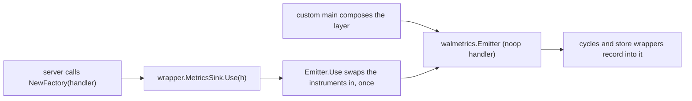
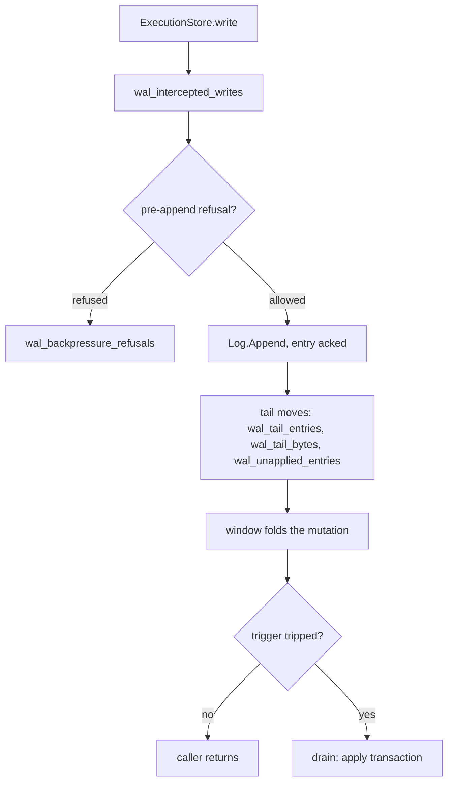
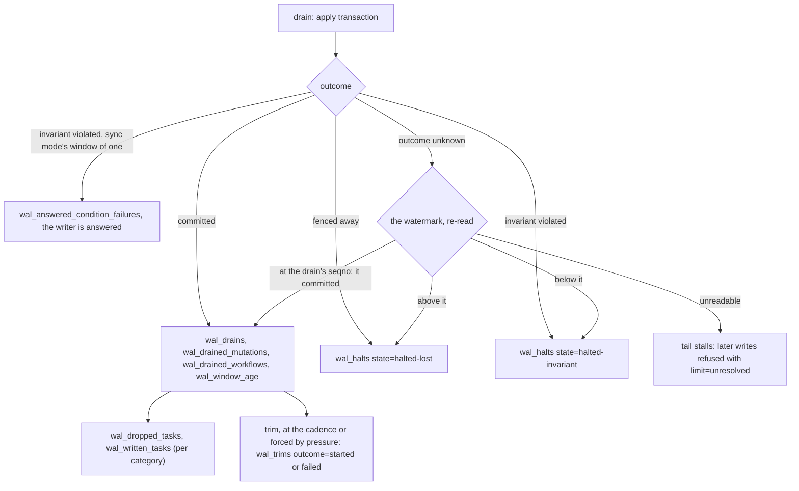
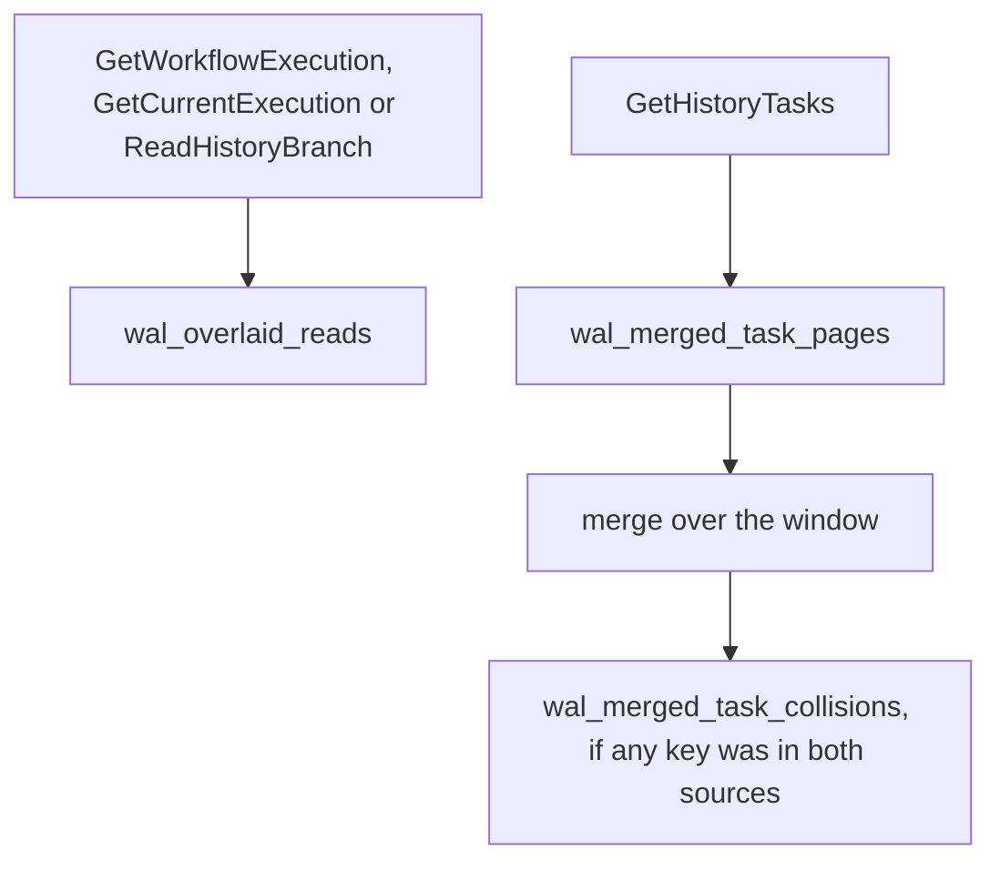

# Every series the layer emits

"Is the WAL healthy?" is not one question. A node can fence an old owner correctly and collapse
writes well while its apply path falls behind the cold store. The same node may never have received
the server's metrics handler, and then it reports nothing at all. No single number tells these
stories apart.

So this chapter builds the dashboard around four questions:

1. *Is the layer in the path?* Routed write and read counters show participation. Their absence
   alone does not distinguish passthrough from an idle node.
2. *Is the window buying anything?* Drained mutations against drained workflows measures collapse.
   Written against dropped tasks measures work that never had to reach the cold store.
3. *Is the cold store keeping up?* Tail size, the distance from the last ack to the watermark (the highest
   seqno the cold store has applied, chapter 02), window age and backpressure each show a different part of the runway.
4. *Did the correctness machinery fire?* A `halted-lost` halt (the shard was fenced away by a new
   owner) is normal fencing. A `halted-invariant` halt (an assertion failed that could not
   be pinned on one caller) or a merged-page collision is a page. Summing them destroys the difference.

Several instruments count something narrower than their names suggest, so where a series is emitted,
its unit and its tags are part of its meaning. The shortest useful reading:

| Question | Start with | Distinction to preserve |
|---|---|---|
| participation | `wal_intercepted_writes`, `wal_overlaid_reads`, `wal_merged_task_pages` | routed traffic is not the same as a window hit |
| benefit | `wal_drained_mutations` / `wal_drained_workflows`; `wal_dropped_tasks` / `wal_written_tasks` | keep both sides of each ratio |
| runway | `wal_tail_entries`, `wal_tail_bytes`, `wal_unapplied_entries`, `wal_window_age`, `wal_backpressure_refusals` | tail size, watermark distance and age answer different questions |
| correctness | `wal_halts` by `state`, `wal_merged_task_collisions` | lost ownership is expected, invariant failure is not |

Sections 1 and 2 explain how the numbers leave the process and why the instruments have their
shapes. Section 3 is the full table. Section 5 shows when each series moves, and sections 6 and 7
turn them into derived quantities and alerts. Section 4 is the one unit caveat, section 8 the
in-process counters that answer what the series cannot, and section 9 the one series deliberately
not emitted.

---

## 1. How the numbers get out

There is no exporter, no second scrape endpoint and no new dependency. Every series goes through the
server's own `metrics.Handler`, the one the rest of the Temporal process uses, so the series land
wherever the operator already sends metrics.

The catch is that the handler exists later than the layer. A custom main composes the log, the apply
cycles and the factory that wraps the stores first. The server hands a handler to
`AbstractDataStoreFactory.NewFactory` afterwards, inside its own fx graph. So the handler travels
back down the same seam, through `wrapper.MetricsSink`: one method, `Use(h metrics.Handler)`, and
the first call wins.

Figure: how the handler reaches instruments that are already recording.

```mermaid
flowchart LR
    A["custom main composes the layer"] --> B["walmetrics.Emitter (noop handler)"]
    B --> C["cycles and store wrappers record into it"]
    D["server calls NewFactory(handler)"] --> E["wrapper.MetricsSink.Use(h)"]
    E --> F["Emitter.Use swaps the instruments in, once"]
    F --> B
```

Everything on the left is running and recording into a noop handler before anything on the right
happens. Two consequences follow.

* A binary running several services in one process reports every series to the handler of whichever
  service built persistence first. The series are not split across handlers. That was chosen: the
  alternative puts the wrapper's counters on one service's handler and the cycles' on another's. The
  tags follow from it. A Temporal handler carries its service's tags, so in a single-binary
  deployment these series may arrive labelled `frontend` or `worker` while being entirely about
  history shards. Filter dashboards and alerts on the series names, which belong to this layer
  alone, never on the service. A history service in its own process does not meet this.
* A layer whose `Use` is never called works normally and emits nothing. A store wrapper built by
  hand with `wrapper.Options.Metrics` nil silences the three series the wrapper raises, permanently:
  it records into a private noop emitter that nothing can replace later, while the cycles behind it
  keep reporting to the handler they were given.

So a blank dashboard means no traffic, or passthrough mode, or a layer that never received the real
handler. Silence is not evidence of passthrough, because a correctly wired idle cluster looks the
same. Scraped metrics describe what was emitted, not that the intended path ran. [Chapter
11](11-verification.md#the-witness)
covers the in-process witness that makes that stronger claim.

---

## 2. Three shape decisions, because they change how you read the numbers

Three instrument shapes look odd until you know what each avoids. A per-node gauge with no shard tag
reports whichever shard moved last. A ratio divided before emission cannot tell an empty denominator
from a perfect result. A timer named "age" invites reading it as latency.

**(a) Per-shard quantities are histograms, not gauges.** The tail, the window age and the unapplied
count are facts about one shard. They go out with no shard tag, as distributions over this node's
shards and over time.

A shard tag would add a cardinality class Temporal has nowhere else in its metric set: one series
per shard per node, for as long as the shard exists. A gauge without the tag is worse. A handler
keeps one value per attribute set, so it would report whichever shard recorded last and overwrite
every other shard's value before a scrape. A histogram keeps every observation. Read
`wal_tail_entries` as the distribution of tail depth across this node's shards, and alert on its
upper quantiles, never its mean.

**(b) Ratios go out as two counters, never pre-divided.** The collapse ratio is
`wal_drained_mutations` over `wal_drained_workflows`. The I7 drop share comes from
`wal_dropped_tasks` and `wal_written_tasks`. Section 6 has both expressions; you do the division.

A quotient throws the denominator away, and a metrics stack cannot put it back. You could no longer
tell "everything this drain carried was dropped" (the window is doing its job) from "this drain
carried nothing to drop" (the shard has no task traffic). `wal_trims{outcome}` and the replay pair
(`wal_replayed_entries` against `wal_replay_dropped_entries`) are two counters for the same reason.

**(c) Nothing here is a latency.** No series times a write, a drain or an apply transaction. The one
`Timer` is `wal_window_age`, and it records an age: how long the window's oldest mutation had waited
when the window drained. That is the quantity the age trigger (`wal.windowAge`) fires on. For write
latency, use the server's own persistence latency series, which is measured around the store call
the layer sits inside.

---

## 3. The reference table

These are all the series `walmetrics/walmetrics.go` declares. Nothing else in this repository emits a
metric.

Tag keys: `operation` and `task_category` are Temporal's own (`metrics.OperationTag`,
`metrics.TaskCategoryTag`). `trigger`, `limit`, `state` and `outcome` are this layer's, declared as
`walmetrics.TagTrigger`, `TagLimit`, `TagState` and `TagOutcome`.

For counters the unit column is descriptive. It says what one increment means; no counter is
declared with a unit, so nothing in a scrape carries it. The three histograms take their units from
their definitions (`wal_tail_entries` and `wal_unapplied_entries` dimensionless, `wal_tail_bytes` in
bytes). The timer takes its unit from the handler (§4).

| series | type | unit | tags and full value sets | emitted from | what it counts, exactly |
|---|---|---|---|---|---|
| `wal_intercepted_writes` | counter | writes | `operation` = one of `CreateWorkflowExecution`, `UpdateWorkflowExecution`, `ConflictResolveWorkflowExecution`, `SetWorkflowExecution`, `DeleteWorkflowExecution`, `DeleteCurrentWorkflowExecution`, `AddHistoryTasks`, `RangeCompleteHistoryTasks` | `ExecutionStore.write`, on the way *in* | Writes this store sent at the layer. Taken before the append, so a write the tail refused or a halted cycle never appended is counted, and a retried write is counted once per attempt. |
| `wal_overlaid_reads` | counter | reads | `operation` = `GetCurrentExecution`, `GetWorkflowExecution` or `ReadHistoryBranch` | `ExecutionStore.GetCurrentExecution` / `GetWorkflowExecution` / `ReadHistoryBranch` | Reads *routed* at the layer, not reads the window could answer. The two mutable-state reads go through the overlay and `ReadHistoryBranch` through the history merge. The name predates the third read and is kept because renaming would break every expression over it. A counter that fired only on a hit would read zero both on a healthy idle cluster and on a layer wired up wrong. |
| `wal_merged_task_pages` | counter | pages | none | `ExecutionStore.GetHistoryTasks` | `GetHistoryTasks` pages *routed* at the layer's merge, counted on the way in for the same reason as `wal_overlaid_reads`. The name says merged and the counter does not; like `wal_overlaid_reads`, it keeps its name because renaming would break every expression over it. |
| `wal_merged_task_collisions` | counter | keys | none | `Cycle.readTasks` (`cycle/tasks.go`), on the shard's own goroutine | Task keys a merged page found in both the window and the cold store. The sources are disjoint by construction, so any non-zero value means something is wrong. Recorded only when the count is above zero. |
| `wal_drains` | counter | drains | `trigger` = `mutations`, `bytes`, `age`, `refusal`, `sync`, `replay`, `explicit`, `read`, `storage_pressure`. Nine values: `sync` appears only under [`wal.sync: true`](08-configuration.md#2-table-1--the-wal-sections-keys), `storage_pressure` only over a backend implementing [`wal.PressureSource`](04-contracts.md#walpressuresource--the-optional-pressure-face) | `Cycle.drain`, after the apply transaction commits | Committed drains (transactions, not passes of the cycle), by what tripped them. A drain that halted is not counted, nor is one whose batch folded to nothing: an empty batch settles its entries and returns first. `sync` is its own cause because it alone answers a caller: one write, one drain, one answer. Under `sync` the sync arm returns before `window.Trips` is evaluated, so `mutations` and `bytes` cannot appear. `storage_pressure` cannot appear either: every write already drains, so pressure adds no drain, only the forced trim after it. |
| `wal_drained_mutations` | counter | mutations | none | same call as `wal_drains` | Mutations carried into a committed drain: the collapse ratio's numerator. Untagged, so it cannot be split by trigger. |
| `wal_drained_workflows` | counter | workflows | none | same call as `wal_drains` | Workflows written by a committed drain: the collapse ratio's denominator. |
| `wal_window_age` | timer | see §4 | none | same call as `wal_drains` | Age of the oldest mutation in the window at the moment it drained. |
| `wal_answered_condition_failures` | counter | writes | none | `Cycle.answerWriter` | Drains whose condition did not hold and were answered to the caller instead of halting the shard. Only sync mode produces these: `drainSync` is the one cause carrying the attribution that reaches here. Under `wal.sync: true` this rate separates a shard losing ordinary races from one diverging. In windowed mode it stays at zero, because every condition is decided before the append: no failed condition survives to a windowed drain, so halting is the only ending a windowed drain can reach. A condition failure at a drain has three endings (`cycle.attribute`) and this counts one. The others are `wal_halts{state="halted-invariant"}`, for a batch whose caller cannot be named, and `wal_replay_dropped_entries`, for a replayed provisional entry whose caller already has its answer. |
| `wal_backpressure_refusals` | counter | writes | `limit` = `entries`, `bytes`, `unresolved`, `storage_pressure` | `Cycle.writeRefused`, before the append | Writes the shard refused before appending them, by what refused. `entries` and `bytes` are [I10](02-concepts-and-invariants.md#the-invariants)'s two size bounds. `unresolved` means the applier is blind rather than behind: it cannot read what its last drain did, so nothing may be applied over it, and no size bound is involved. `storage_pressure` is the backend reporting pressure at the level that stops appends, and it lowers that level itself. |
| `wal_halts` | counter | cycles | `state` = `halted-lost`, `halted-invariant` | `Cycle.halt` | Apply cycles that halted, by class. A retire stops a cycle without counting here. The tag value is the state's own `String()`, so a new state cannot be silently folded into an existing bucket. Never sum the two (§7). |
| `wal_trims` | counter | trims | `outcome` = `started`, `failed` | `trim.Trimmer.start` and its goroutine | Log trims by outcome, forced trims under storage pressure included (a forced trim is an ordinary trim that consulted no cadence). A failed trim halts nothing. A cadenced one is retried at the next cadence; a forced one is forced again by the next committed drain or, over an empty window, the next age tick while the pressure stands. So this series is the only place a failure shows. `started` minus `failed` counts trims that succeeded or are still in flight. |
| `wal_tail_entries` | histogram | dimensionless (entries) | none | `tailstate.Mirror.store`, reached by every tail move | Entries acked into the log and not yet settled, on one shard. One observation per shard per tail move. |
| `wal_tail_bytes` | histogram | bytes | none | same call | Encoded bytes acked and not yet settled, on one shard. The second unit I10 bounds. Not the window's byte count, which is a different number. |
| `wal_unapplied_entries` | histogram | dimensionless (seqnos) | none | same call | `commitSeqno − appliedSeqno`: how far the cold store is behind the log, per shard. Not the tail (§8). |
| `wal_replayed_entries` | counter | entries | none | `Cycle.replay`, once the replay has finished | Entries a new owner read from the tail a previous owner left, and folded, including those it then dropped, so `wal_replay_dropped_entries` is a subset. Emitted once per completed replay, because a failed attempt is retried whole from the watermark and per-entry counting would count twice. A replay that found an empty tail (the ordinary case on a clean acquire) records nothing here and draws no `wal_drains{trigger="replay"}`. |
| `wal_replay_dropped_entries` | counter | entries | none | same call | Replayed entries dropped because their ack was provisional and their condition did not hold. Only sync mode acks provisionally (`mutation.EncodeProvisional` is reached under `wal.sync: true` and nowhere else), so a windowed node records zero. Recorded only when above zero. |
| `wal_dropped_tasks` | counter | task rows | `task_category` = the task-category registry's category names. Upstream registers `transfer`, `timer`, `visibility`, `replication`, `outbound` unconditionally, plus the in-memory `memory-timer`, which persists no rows; `archival` only where archival is enabled. A deployment's own categories appear too. | `Cycle.countTasks`, after the transaction commits | Task rows a committed drain did not write, because their queue had already deleted the range they fall in (invariant I7). Counted only after commit: a batch that did not commit wrote no rows, so a drop counted for it would be a saving nobody made. |
| `wal_written_tasks` | counter | task rows | same | same call | Task rows a committed drain wrote to the cold store: the drop's denominator. A category a drain did not carry emits nothing rather than a pair of zeroes. |

Two readings catch people out:

* `wal_overlaid_reads` and `wal_merged_task_pages` count routing, not hits. The number of reads the
  window actually answered is an in-process counter, not a series (§8).
* `wal_drains` counts committed drains. Halts have their own series, so `wal_drains` plus `wal_halts`
  is not "attempted drains" and should not be charted as one.

---

## 4. The timer caveat: `wal_window_age`'s unit is the handler's

`wal_window_age` is declared with `metrics.NewTimerDef`. A Temporal timer definition carries no unit
of its own; the handler picks one:

* The otel handler defaults to milliseconds and records `duration.Milliseconds()`, truncated to a
  whole millisecond. Every sub-millisecond window age records `0`.
* With `recordTimerInSeconds` set in the metrics configuration, the same handler records seconds,
  and every existing threshold over the series changes meaning by a factor of 1000 without warning.
* The tally fallback, and the capture handler the tests use, record the whole `time.Duration` they
  are handed, with no truncation.

Read the histogram against the age trigger (`wal.windowAge`, see
[08-configuration.md](08-configuration.md#3-table-2--the-nine-dynamic-config-settings)) in whatever
unit your handler emits. On a fast, busy shard a floor of zeroes is the truncation, not a bug. This
is the one series whose numbers are not comparable across two deployments until you have checked
that flag on both.

---

## 5. Where each series sits on the write path

The three diagrams below attach the emission points to the write path, the drain and the read path.
The paths themselves are in [05-write-path.md](05-write-path.md) and
[07-read-path.md](07-read-path.md).

Figure: a write, up to the drain.

```mermaid
flowchart TD
    A["ExecutionStore.write"] --> B["wal_intercepted_writes"]
    B --> C{"pre-append refusal?"}
    C -->|"refused"| D["wal_backpressure_refusals"]
    C -->|"allowed"| E["Log.Append, entry acked"]
    E --> F["tail moves: wal_tail_entries, wal_tail_bytes, wal_unapplied_entries"]
    F --> G["window folds the mutation"]
    G --> H{"trigger tripped?"}
    H -->|"no"| I["caller returns"]
    H -->|"yes"| J["drain: apply transaction"]
```

The three tail series are emitted by every move of the tail, not only by an append. Each of
`tailstate.Tail`'s mutators (`Ack`, `Settle`, `Stall`, `Resolve`, and the `Floor` a replay plants
before it starts) ends in the same `publish` call, so the tail cannot move without being recorded.

Figure: the drain's outcomes, continuing from `J`.

```mermaid
flowchart TD
    J["drain: apply transaction"] --> K{"outcome"}
    K -->|"committed"| L["wal_drains, wal_drained_mutations, wal_drained_workflows, wal_window_age"]
    L --> M["wal_dropped_tasks, wal_written_tasks (per category)"]
    L --> N["trim, at the cadence or forced by pressure: wal_trims outcome=started or failed"]
    K -->|"fenced away"| P["wal_halts state=halted-lost"]
    K -->|"invariant violated"| Q["wal_halts state=halted-invariant"]
    K -->|"invariant violated, sync mode's window of one"| S["wal_answered_condition_failures, the writer is answered"]
    K -->|"outcome unknown"| W{"the watermark, re-read"}
    W -->|"at the drain's seqno: it committed"| L
    W -->|"below it"| Q
    W -->|"above it"| P
    W -->|"unreadable"| R["tail stalls: later writes refused with limit=unresolved"]
```

The four series on `L` come from one `Emitter.Drained` call, so a drain is never counted without its
collapse pair and its age. The task pair on `M` comes from `Cycle.countTasks`, which runs only after
the transaction commits. The `R` arm emits nothing at the time. The stall shows later, on the writes
it refuses, as `wal_backpressure_refusals{limit="unresolved"}`.

Figure: the read path.

```mermaid
flowchart TD
    A["GetWorkflowExecution, GetCurrentExecution or ReadHistoryBranch"] --> B["wal_overlaid_reads"]
    C["GetHistoryTasks"] --> D["wal_merged_task_pages"]
    D --> E["merge over the window"]
    E --> F["wal_merged_task_collisions, if any key was in both sources"]
```

Only `wal_merged_task_collisions` says anything about what the merge found. `wal_overlaid_reads` and
`wal_merged_task_pages` fire on the way in, before the layer has looked at the window.

Replay sits outside all three diagrams. A replay that found entries emits `wal_replayed_entries` and
`wal_replay_dropped_entries` once it has finished, plus a `wal_drains{trigger="replay"}` for each
drain it committed: the size triggers cut a long tail into several drains, and a provisional entry
is drained alone. A replay that found an empty tail emits none of the three, so most acquires leave
no trace here ([06-shard-lifecycle.md](06-shard-lifecycle.md)).

---

## 6. Quantities to derive

None of these is emitted. Each is the reason its pair is emitted as two counters (§2(b)), and each
keeps its denominator in view: ten dropped tasks out of ten and zero out of zero both look like
"nothing was written", and only the pair separates them. Rates are over your dashboard's window.

* **Collapse ratio**, how much work the window saves:
  `rate(wal_drained_mutations) / rate(wal_drained_workflows)`.
  1.0 means nothing collapses: every drained mutation touched a different workflow, so the drain
  writes as many rows as the individual writes would have.
* **I7 drop share, per category**, how much task work the window let a queue delete under it:
  `rate(wal_dropped_tasks{task_category=X}) / (rate(wal_dropped_tasks{task_category=X}) +
  rate(wal_written_tasks{task_category=X}))`. Compare each category with its own past, since
  immediate and scheduled categories drop at unrelated rates. Keep the sum as the denominator; it
  distinguishes "everything was dropped" from "there were no tasks".
* **Refusal rate by limit**, which bound is biting:
  `rate(wal_backpressure_refusals{limit=X}) / rate(wal_intercepted_writes)`.
  Divide by `wal_intercepted_writes`, not by a drain count: both are counted before the append.
* **Trim failure share**: `rate(wal_trims{outcome="failed"}) / rate(wal_trims{outcome="started"})`.
* **Drain mix**: `rate(wal_drains) by (trigger)`, as fractions of the total. A node drawing almost
  only `age` is idle, not behind. A node drawing `refusal` at any noticeable rate hits
  `fold.ErrRefused` often: a window the accumulator cannot express, or an assertion it cannot
  determine, each forcing a drain and a retry of the mutation that caused it. Take the mix over all
  nine trigger values. A node under `wal.sync: true` draws `sync` for every write, so an expression
  listing only the windowed triggers returns nothing there.

---

## 7. Alerting

Thresholds depend on the deployment, and this chapter invents none. Below is the shape of each
alert: the condition, what firing means, and which runbook in
[09-operations.md](09-operations.md#5-runbooks) to open. Calibrate the numbers against a week of
your own traffic.

| condition (shape) | severity | what it means | first action |
|---|---|---|---|
| `increase(wal_halts{state="halted-invariant"}) > 0` over any window | page | A divergence this process owns, most often an apply-path assertion that failed and could not be pinned on one caller, usually because the drained window held work from several. There is no retry and no failover: the layer does not convert this into a lost ownership, so nobody else picks the shard up. | [runbook (b)](09-operations.md#b-a-shard-halted--and-which-of-the-two-classes); capture the shard's log before anything trims it |
| `increase(wal_merged_task_collisions) > 0` over any window | page | A merged task page found the same key in the window and the cold store. The sources are disjoint by construction, so this is a correctness signal: a second writer, or a window release that did not happen. | [runbook (f)](09-operations.md#f-merged-page-collisions-are-non-zero) |
| `wal_backpressure_refusals{limit="unresolved"}` non-zero and sustained | page | The applier cannot read what its last drain did, so nothing may be applied over it. No size setting clears this. | [runbook (a)](09-operations.md#a-a-shard-stopped-accepting-writes--backpressure-or-an-unresolved-drain) |
| `rate(wal_backpressure_refusals{limit=~"entries\|bytes"})` above your normal floor, sustained | high | I10's per-shard bound is refusing writes. `entries` is a tail grown because the applier is behind. `bytes` can also be a few very large entries, from a workflow near the server's own mutable-state size limit. Refused writes provably wrote nothing. | [runbook (a)](09-operations.md#a-a-shard-stopped-accepting-writes--backpressure-or-an-unresolved-drain): fix the cold store |
| high quantile of `wal_unapplied_entries` climbing and not returning | high | The cold store is falling behind. The runway before backpressure is what is left of the tail bound. | [runbook (c)](09-operations.md#c-the-cold-store-is-falling-behind) |
| high quantile of `wal_window_age` above twice `wal.windowAge` | medium | Drains are not keeping up with the age trigger. The timer ticks once per `wal.windowAge` and drains a window at least that old, so an ordinary age drain records between one and two of it. Check the unit first (§4). | [runbook (c)](09-operations.md#c-the-cold-store-is-falling-behind) |
| `rate(wal_trims{outcome="failed"})` a sustained fraction of `started` | medium | The log is not being compacted. Halts nothing, but degrades write latency over hours as the log grows. | [runbook (d)](09-operations.md#d-trims-are-failing) |
| I7 drop share for one category stepping up and staying up | medium | More task work is deleted under the window than before. That is a saving, not a fault: a task row inserted and range-completed inside one window never reaches the cold store. Usually the window grew; sometimes the queues began completing ranges more often. | [runbook (e)](09-operations.md#e-task-drops-are-climbing) |
| collapse ratio falling towards 1 | low / informational | The window has stopped saving work; drains cost what the writes would have. Not a fault, but it removes the layer's reason to be there. | [runbook (c)](09-operations.md#c-the-cold-store-is-falling-behind) |
| `wal_answered_condition_failures` non-zero on a windowed node | medium | Under `wal.sync: false` the expected value is zero, because every condition is decided before the append. Non-zero means a condition reached a drain that should not have. Do not write this alert for a node running `wal.sync: true`, where the series is ordinary traffic. | [05-write-path.md](05-write-path.md#3-failed-write--the-condition-did-not-hold) |

Do not alert on `wal_halts{state="halted-lost"}`. That is fencing working, and it appears on every
failover and every rolling restart. An alert summing the two halt classes pages for normal
operation, which is why the class is a tag.

---

## 8. The in-process counters, and what they add

Beside the series there are three in-process readings: plain Go values that a caller in the same
process asks for directly. They exist because not every run can scrape: a test process judging a
live server cannot reach its emissions, but it can always read these. Two are on the layer:
`cycle.Stats` for one shard, through `waltz.Layer.ShardStats(shard)`, and `cycle.Totals` for the
node, through `waltz.Layer.Totals()`. Both embed `cycle.Counters`. The third is the wrapper's
`ExecutionStore.Counts()`. [Chapter 04](04-contracts.md#stats-counters-and-totals) lists every
field. Two rules from there matter when reading them: `Counters` holds no position, because a new
cycle inherits a log's positions and summing them would count the same entries once per acquire;
and `Kinds`, a count per `mutation.Kind`, says whether a kind appeared at all and is not a rate.

Two counters are the reason to reach for these rather than the dashboard, and neither has a series:

* `ReadsHeld`, the overlay reads for which the window actually held something;
* `TaskReadsMerged`, the routed task pages that carried a task out of the window.

`wal_overlaid_reads` counts reads routed, so a run in which every read found an empty window looks
exactly like passthrough. `ReadsHeld` tells the two apart, which is why a witness rests on it rather
than on the series.

On the wrapper side, `wrapper.Counts` has `TaskReads`, the in-process twin of
`wal_merged_task_pages`, and `Overlaid` plus `HistoryReads`, the twin of `wal_overlaid_reads`. `Overlaid` counts the two mutable-state
reads and `HistoryReads` the `ReadHistoryBranch` pages routed at the history merge. `HistoryReads`
has no twin on the cycle side: `cycle.Counters` carries no history-read field, and a branch page
raises neither `Reads` (every overlay read routed) nor `ReadsHeld`. A witness reads `ReadsHeld` as "the overlay crossed a held
workflow", and a branch page counted there would satisfy that claim without touching the overlay.

`internal/verify/witness` reads them. Its `Observed` takes a `cycle.Totals` for the node and, where
the run can reach the store it decorated, a `*wrapper.Counts` beside it. The claims a run makes
about what the layer saw are stated there once ([11-verification.md](11-verification.md)).

### The distinction this repo insists on

The tail is not `commitSeqno − appliedSeqno`. `wal_unapplied_entries` (and
`Stats.CommitSeqno − Stats.AppliedSeqno`) is how far the cold store is behind the log.
`wal_tail_entries` (and `Stats.TailEntries`) is what I10 bounds: acked entries whose fate is not yet
settled. The two part at a drain that settles its entries without moving the watermark, which is
what the third position, `resolved`, is for ([chapter
02](02-concepts-and-invariants.md#three-positions-not-two)). Both are emitted so a dashboard can see
the gap instead of averaging it away.

A tail below its unapplied count is worth chasing. Three kinds of drain settle without moving the
watermark. Two announce themselves: sync mode's answered condition failure
(`wal_answered_condition_failures`) and a dropped replayed provisional entry
(`wal_replay_dropped_entries`). The third is a drain whose batch folded to nothing, and only one
mutation does that: an `AddHistoryTasks` carrying no rows. Nothing in the server builds that
request, since every `shardContext.AddTasks` call site fills its map with at least one task. So on a
node with those two counters at zero, a tail below its unapplied count means something sent the
layer an empty `AddHistoryTasks`.

---

## 9. One deliberate absence

There is no series for the storage engine's own transaction counters. Whether an append cost the
engine a coordinated transaction or an immediate write is a property of the log, not of this
process. Every node writing that log moves the same counters, so N nodes emitting them would report
the same quantity N times.

So invariant I9 (an append is one immediate write over adjacent keys, not a distributed
transaction) is checked by a guard that reads the engine's counters out of band, not by a runtime
series. Nothing in this tree is that guard. It belongs to whoever ships the backend, because the
counters are the deployment's own; [11-verification.md](11-verification.md) says what it has to do.

---

## Summary

A WAL's health is four questions: is the layer in the path, is the window saving work, is the cold
store keeping up, and did the correctness machinery fire. Each has its own series, and keeping them
apart is the point of the dashboard.

Every series goes through the server's own `metrics.Handler`, handed back to the layer through
`wrapper.MetricsSink.Use`, first call wins. A layer that never receives it emits nothing, so silence
proves neither passthrough nor health. Per-shard quantities are untagged histograms, ratios are
counter pairs, and the only timer, `wal_window_age`, is an age whose unit the handler chooses.

The reference table in §3 is the authority on what each series counts. Routed counters are not hit
counters, and `wal_drains` counts only committed drains. Alert on `halted-invariant` halts,
merged-page collisions and `unresolved` refusals; never on `halted-lost`, which is fencing at work.
When a question needs what the window actually answered, or a distinction the series cannot draw,
read the in-process counters instead, as the witness in chapter 11 does.

---

## Where this lives in the code

* [`../../walmetrics/walmetrics.go`](../../walmetrics/walmetrics.go) — the authority: every
  series, tag key and value constant, the `Emitter`, and the three shape decisions.
* [`../../wrapper/execution_store.go`](../../wrapper/execution_store.go) — the wrapper's
  emission points (the interception table behind the `operation` values, the routed reads and task
  page) and `Counts`.
* [`../../wrapper/wrapper.go`](../../wrapper/wrapper.go) — `MetricsSink` and
  `Options.Metrics`, and what a nil emitter means.
* [`../../cycle/cycle.go`](../../cycle/cycle.go) — `Stats`, the drain's four-series emission,
  `countTasks`, `answerWriter`, `writeRefused` and `halt`; also the `drainCause` values that supply
  every `trigger` tag.
* [`../../cycle/counters.go`](../../cycle/counters.go) — `Counters`, with the rule that a
  position may not go in and why.
* [`../../cycle/manager.go`](../../cycle/manager.go) — `Totals`, and why the positions are
  summed only over cycles held now.
* [`../../cycle/tailstate/tailstate.go`](../../cycle/tailstate/tailstate.go) — the mirror
  whose `store` is the single emission point of the three tail series, reached by every tail move.
* [`../../cycle/trim/trim.go`](../../cycle/trim/trim.go) — where `wal_trims` is emitted, and
  why both outcomes are counted.
* [`../../cycle/replay.go`](../../cycle/replay.go) — the single emission of the replay pair,
  once a replay has finished.
* [`../../waltz.go`](../../waltz.go) — `Layer.Totals` and `Layer.ShardStats`: the
  in-process doors an operator-facing endpoint or a test reads.
* [`../../internal/verify/witness/witness.go`](../../internal/verify/witness/witness.go) — the claims stated over
  `cycle.Totals` and over the emitted series, and the one place both are read together.
