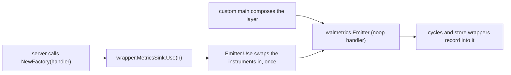
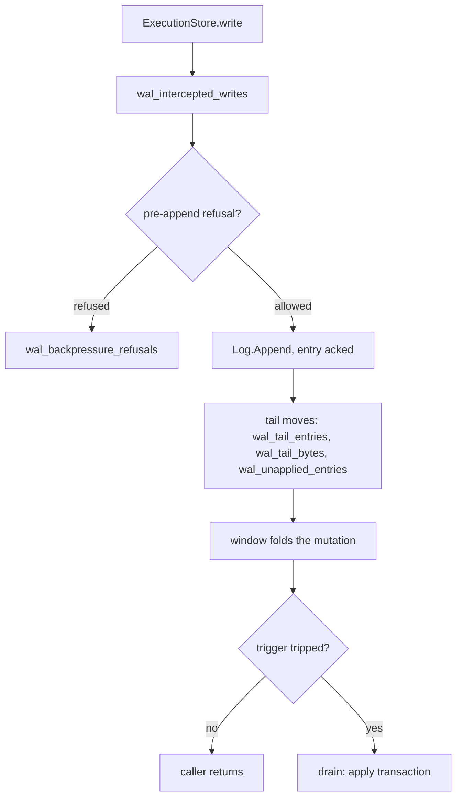
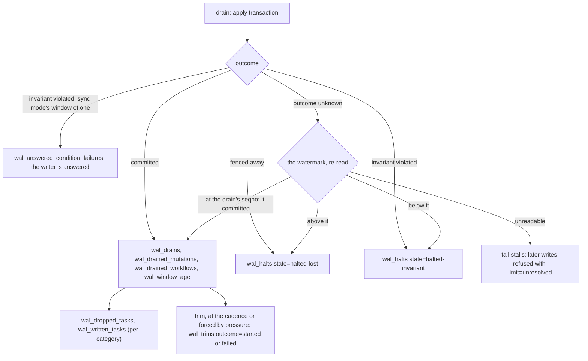

# Every series the layer emits

"Is the WAL healthy?" is not one question. A node can fence an old owner correctly and collapse
writes well while its apply path falls behind the cold store, or it may never have received the
server's metrics handler and report nothing at all. So the dashboard asks four questions. Several
series count something narrower than their names suggest, so unit and tags are part of the meaning.

| Question | Start with | Distinction to preserve |
|---|---|---|
| Is the layer in the path? | `wal_intercepted_writes`, `wal_overlaid_reads`, `wal_merged_task_pages` | routed traffic is not a window hit, and no traffic does not distinguish passthrough from an idle node |
| Is the window buying anything? | `wal_drained_mutations` / `wal_drained_workflows` (collapse); `wal_dropped_tasks` / `wal_written_tasks` (work that never reached the cold store) | keep both sides of each ratio |
| Is the cold store keeping up? | `wal_tail_entries`, `wal_tail_bytes`, `wal_unapplied_entries`, `wal_window_age`, `wal_backpressure_refusals` | tail size, distance from the last ack to the watermark (the highest seqno the cold store has applied, chapter 02) and age each show a different part of the runway left before backpressure |
| Did the correctness machinery fire? | `wal_halts` by `state`, `wal_merged_task_collisions` | `halted-lost` (fenced away by a new owner) is normal; `halted-invariant` (an assertion that failed and could not be pinned on one caller) or a collision is a page; summing them destroys the difference |

The chapter follows the numbers out of the process, then through the table, the paths, derived
quantities and alerts, to what the series cannot answer.

---

## 1. How the numbers get out

Every series goes through the server's own `metrics.Handler`, with no exporter or scrape endpoint
of its own, so it lands wherever the operator already sends metrics.

The handler exists later than the layer. A custom main composes the log, the apply cycles and the
store-wrapping factory first; the server hands a handler to `AbstractDataStoreFactory.NewFactory`
afterwards, inside its own fx graph. So the handler travels back down that seam through
`wrapper.MetricsSink`, whose one method is `Use(h metrics.Handler)`; the first call wins.

Figure: how the handler reaches instruments that are already recording.

```mermaid
flowchart LR
    A["custom main composes the layer"] --> B["walmetrics.Emitter (noop handler)"]
    B --> C["cycles and store wrappers record into it"]
    D["server calls NewFactory(handler)"] --> E["wrapper.MetricsSink.Use(h)"]
    E --> F["Emitter.Use swaps the instruments in, once"]
    F --> B
```

Everything on the left records into a noop handler until the right side runs. Two consequences:

* A binary running several services in one process reports every series to the handler of
  whichever service built persistence first. That handler carries its service's tags, so these
  series may arrive labelled `frontend` or `worker` while being entirely about history shards:
  filter on series names, never on the service. A history service in its own process is unaffected.
* A layer whose `Use` is never called works normally and emits nothing. A store wrapper built by
  hand with `wrapper.Options.Metrics` nil permanently silences the wrapper's three series (it
  records into a private noop emitter), while the cycles behind it keep reporting to their handler.

So a blank dashboard means no traffic, passthrough mode, or a layer that never received the real
handler, and silence does not tell them apart. Scraped metrics say what was emitted, not that the
intended path ran; the in-process witness makes that stronger claim ([chapter
11](11-verification.md#the-witness)).

---

## 2. Three shape decisions, because they change how you read the numbers

*(a) Per-shard quantities are histograms, not gauges.* The tail, the window age and the unapplied
count are facts about one shard, sent untagged as distributions over this node's shards and over
time. A shard tag would add one series per shard per node, a cardinality class Temporal has nowhere
else. An untagged gauge would keep only the last shard's value before a scrape; a histogram keeps
every observation. Alert on upper quantiles, never the mean.

*(b) Ratios go out as two counters, never pre-divided.* The collapse ratio is
`wal_drained_mutations` over `wal_drained_workflows`; the I7 drop share (task rows not written
because their queue already deleted the range) comes from `wal_dropped_tasks` and
`wal_written_tasks` (§6). A quotient loses the denominator: "everything this drain carried was
dropped" would look like "this drain carried nothing to drop". `wal_trims{outcome}` and the replay
pair (`wal_replayed_entries`, `wal_replay_dropped_entries`) are counter pairs for the same reason.

*(c) Nothing here is a latency.* No series times a write, a drain or an apply transaction. The one
`Timer`, `wal_window_age`, records how long the window's oldest mutation had waited when the window
drained, the quantity the age trigger (`wal.windowAge`) fires on. For write latency, use the
server's own persistence latency series, measured around the store call the layer sits inside.

---

## 3. The reference table

These are all the series `walmetrics/walmetrics.go` declares; nothing else in this repository emits
a metric. Tag keys `operation` and `task_category` are Temporal's own (`metrics.OperationTag`,
`metrics.TaskCategoryTag`); `trigger`, `limit`, `state` and `outcome` are this layer's
(`walmetrics.TagTrigger`, `TagLimit`, `TagState`, `TagOutcome`). A counter's unit says what one
increment means; no counter is declared with a unit, so no scrape carries it. The histograms'
units come from their definitions; the timer's from the handler (§4).

| series | type | unit | tags and full value sets | emitted from | what it counts, exactly |
|---|---|---|---|---|---|
| `wal_intercepted_writes` | counter | writes | `operation` = one of `CreateWorkflowExecution`, `UpdateWorkflowExecution`, `ConflictResolveWorkflowExecution`, `SetWorkflowExecution`, `DeleteWorkflowExecution`, `DeleteCurrentWorkflowExecution`, `AddHistoryTasks`, `RangeCompleteHistoryTasks` | `ExecutionStore.write`, on the way *in* | Writes this store sent at the layer, counted before the append: a write refused or never appended by a halted cycle counts, and a retry counts once per attempt. |
| `wal_overlaid_reads` | counter | reads | `operation` = `GetCurrentExecution`, `GetWorkflowExecution` or `ReadHistoryBranch` | `ExecutionStore.GetCurrentExecution` / `GetWorkflowExecution` / `ReadHistoryBranch` | Reads *routed* at the layer, not reads the window answered: the two mutable-state reads through the overlay, `ReadHistoryBranch` through the history merge. A hit counter would read zero both on an idle cluster and on a layer wired up wrong. |
| `wal_merged_task_pages` | counter | pages | none | `ExecutionStore.GetHistoryTasks` | `GetHistoryTasks` pages *routed* at the layer's merge, counted on the way in like `wal_overlaid_reads`, whether or not anything merged. |
| `wal_merged_task_collisions` | counter | keys | none | `Cycle.readTasks` (`cycle/tasks.go`), on the shard's own goroutine | Task keys a merged page found in both the window and the cold store. The sources are disjoint by construction, so any non-zero value is a fault. Recorded only when above zero. |
| `wal_drains` | counter | drains | `trigger` = `mutations`, `bytes`, `age`, `refusal`, `sync`, `replay`, `explicit`, `read`, `storage_pressure`. Nine values: `sync` appears only under [`wal.sync: true`](08-configuration.md#2-table-1--the-wal-sections-keys), `storage_pressure` only over a backend implementing [`wal.PressureSource`](04-contracts.md#walpressuresource--the-optional-pressure-face) | `Cycle.drain`, after the apply transaction commits | Committed drains (transactions, not passes of the cycle), by what tripped them. Not counted: a drain that halted, or one whose batch folded to nothing (it settles its entries and returns first). `sync` is one write, one drain, one answer; under it `window.Trips` is never evaluated, so `mutations`, `bytes` and `storage_pressure` cannot appear (pressure adds only the forced trim). |
| `wal_drained_mutations` | counter | mutations | none | same call as `wal_drains` | Mutations carried into a committed drain: the collapse ratio's numerator. Untagged, so it cannot be split by trigger. |
| `wal_drained_workflows` | counter | workflows | none | same call as `wal_drains` | Workflows written by a committed drain: the collapse ratio's denominator. |
| `wal_window_age` | timer | see §4 | none | same call as `wal_drains` | Age of the oldest mutation in the window at the moment it drained. |
| `wal_answered_condition_failures` | counter | writes | none | `Cycle.answerWriter` | Drains whose condition did not hold, answered to the caller instead of halting the shard. Only sync mode produces these (`drainSync` is the only drain cause that answers a caller); there the rate separates a shard losing ordinary races from one diverging. Windowed mode decides every condition before the append, so it stays at zero. The other two endings of a condition failure at a drain (`cycle.attribute`) are `wal_halts{state="halted-invariant"}`, for a batch whose caller cannot be named, and `wal_replay_dropped_entries`, for a replayed provisional entry whose caller already has its answer. |
| `wal_backpressure_refusals` | counter | writes | `limit` = `entries`, `bytes`, `unresolved`, `storage_pressure` | `Cycle.writeRefused`, before the append | Writes refused before the append, by what refused. `entries` and `bytes` are [I10](02-concepts-and-invariants.md#the-invariants)'s two size bounds. `unresolved`: the applier cannot read what its last drain did, so nothing may be applied over it; no size bound is involved. `storage_pressure`: the backend reports `PressureStop` ([`wal.PressureSource`](04-contracts.md#walpressuresource--the-optional-pressure-face)) and lowers it itself once storage recovers; no layer setting clears it. |
| `wal_halts` | counter | cycles | `state` = `halted-lost`, `halted-invariant` | `Cycle.halt` | Apply cycles that halted, by class; a retire is not counted. The tag value is the state's own `String()`, so a new state cannot fold silently into an existing bucket. See §7. |
| `wal_trims` | counter | trims | `outcome` = `started`, `failed` | `trim.Trimmer.start` and its goroutine | Log trims by outcome, including forced trims under storage pressure (an ordinary trim that consulted no cadence). A failed trim halts nothing, so only this series shows it. A cadenced trim is retried at the next cadence; a forced one at the next committed drain or, over an empty window, the next age tick while the pressure stands. `started` minus `failed` is trims that succeeded or are in flight. |
| `wal_tail_entries` | histogram | dimensionless (entries) | none | `tailstate.Mirror.store`, reached by every tail move | Entries acked into the log and not yet settled, on one shard. One observation per shard per tail move. |
| `wal_tail_bytes` | histogram | bytes | none | same call | Encoded bytes acked and not yet settled, on one shard: the second unit I10 bounds. Not the window's byte count. |
| `wal_unapplied_entries` | histogram | dimensionless (seqnos) | none | same call | `commitSeqno − appliedSeqno`: how far the cold store is behind the log, per shard. Not the tail (§8). |
| `wal_replayed_entries` | counter | entries | none | `Cycle.replay`, once the replay has finished | Entries a new owner read and folded from the tail a previous owner left, including those it then dropped (`wal_replay_dropped_entries` is a subset). Emitted once per completed replay, since a failed attempt is retried whole from the watermark. An empty tail records nothing. |
| `wal_replay_dropped_entries` | counter | entries | none | same call | Replayed entries dropped because their ack was provisional and their condition did not hold. Only sync mode acks provisionally (`mutation.EncodeProvisional` is reached under `wal.sync: true` and nowhere else), so a windowed node records zero. Recorded only when above zero. |
| `wal_dropped_tasks` | counter | task rows | `task_category` = the task-category registry's category names. Upstream registers `transfer`, `timer`, `visibility`, `replication`, `outbound` unconditionally, plus the in-memory `memory-timer`, which persists no rows; `archival` only where archival is enabled. A deployment's own categories appear too. | `Cycle.countTasks`, after the transaction commits | Task rows a committed drain did not write because their queue had already deleted their range (invariant I7). Counted only after commit: an uncommitted batch saved nothing. |
| `wal_written_tasks` | counter | task rows | same | same call | Task rows a committed drain wrote to the cold store: the drop's denominator. A category a drain did not carry emits nothing rather than a pair of zeroes. |

Reads the window actually answered are an in-process counter, not a series (§8). `wal_drains` plus
`wal_halts` is not "attempted drains"; do not chart it as one.

---

## 4. The timer caveat: `wal_window_age`'s unit is the handler's

`wal_window_age` is declared with `metrics.NewTimerDef`, which carries no unit, so the handler
picks one:

* The otel handler defaults to milliseconds and records `duration.Milliseconds()`, truncated to a
  whole millisecond. Every sub-millisecond window age records `0`.
* With `recordTimerInSeconds` set in the metrics configuration, the same handler records seconds,
  and every existing threshold over the series silently changes meaning by a factor of 1000.
* The tally fallback, and the capture handler the tests use, record the whole `time.Duration`.

Read the histogram against the age trigger (`wal.windowAge`,
[08-configuration.md](08-configuration.md#3-table-2--the-nine-dynamic-config-settings)) in your
handler's unit. On a fast, busy shard a floor of zeroes is the truncation, not a bug. Compare two
deployments only after checking that flag on both.

---

## 5. Where each series sits on the write path

These diagrams attach the emission points to the paths of [05-write-path.md](05-write-path.md) and
[07-read-path.md](07-read-path.md).

Figure: a write, up to the drain.

```mermaid
flowchart TD
    A["ExecutionStore.write"] --> B["wal_intercepted_writes"]
    B --> C{"pre-append refusal?"}
    C -->|"refused"| D["wal_backpressure_refusals"]
    C -->|"allowed"| E["Log.Append, entry acked"]
    E --> F["tail moves: wal_tail_entries, wal_tail_bytes, wal_unapplied_entries"]
    F --> G["window folds the mutation"]
    G --> H{"trigger tripped?"}
    H -->|"no"| I["caller returns"]
    H -->|"yes"| J["drain: apply transaction"]
```

Every move of the tail emits the three tail series, not only an append: each of
`tailstate.Tail`'s mutators (`Ack`, `Settle`, `Stall`, `Resolve`, and the `Floor` a replay plants
before it starts) ends in the same `publish` call.

Figure: the drain's outcomes, continuing from `J`.

```mermaid
flowchart TD
    J["drain: apply transaction"] --> K{"outcome"}
    K -->|"committed"| L["wal_drains, wal_drained_mutations, wal_drained_workflows, wal_window_age"]
    L --> M["wal_dropped_tasks, wal_written_tasks (per category)"]
    L --> N["trim, at the cadence or forced by pressure: wal_trims outcome=started or failed"]
    K -->|"fenced away"| P["wal_halts state=halted-lost"]
    K -->|"invariant violated"| Q["wal_halts state=halted-invariant"]
    K -->|"invariant violated, sync mode's window of one"| S["wal_answered_condition_failures, the writer is answered"]
    K -->|"outcome unknown"| W{"the watermark, re-read"}
    W -->|"at the drain's seqno: it committed"| L
    W -->|"below it"| Q
    W -->|"above it"| P
    W -->|"unreadable"| R["tail stalls: later writes refused with limit=unresolved"]
```

The four series on `L` come from one `Emitter.Drained` call, so a drain is never counted without its
collapse pair and its age. The `R` arm emits nothing at the time; the stall shows later as
`wal_backpressure_refusals{limit="unresolved"}` on the writes it refuses.

On the read path, `wal_overlaid_reads` and `wal_merged_task_pages` fire on the way in, before the
layer has looked at the window; only `wal_merged_task_collisions`, recorded after the task merge,
says what it found.

Replay sits outside the diagrams. A replay that found entries emits the replay pair when it
finishes, plus a `wal_drains{trigger="replay"}` for each drain it committed: the size triggers cut a
long tail into several drains, and a provisional entry is drained alone. An empty tail, the ordinary
case on a clean acquire, emits none of the three, so most acquires leave no trace here
([06-shard-lifecycle.md](06-shard-lifecycle.md)).

---

## 6. Quantities to derive

None of these is emitted (§2(b)). Rates are over your dashboard's window.

* *Collapse ratio*, how much work the window saves:
  `rate(wal_drained_mutations) / rate(wal_drained_workflows)`. 1.0 means nothing collapses.
* *I7 drop share, per category*, how much task work the window let a queue delete under it:
  `rate(wal_dropped_tasks{task_category=X}) / (rate(wal_dropped_tasks{task_category=X}) +
  rate(wal_written_tasks{task_category=X}))`. Compare each category with its own past, since
  immediate and scheduled categories drop at unrelated rates.
* *Refusal rate by limit*, which bound is biting:
  `rate(wal_backpressure_refusals{limit=X}) / rate(wal_intercepted_writes)`. Divide by
  `wal_intercepted_writes`, not a drain count: both are counted before the append.
* *Trim failure share*: `rate(wal_trims{outcome="failed"}) / rate(wal_trims{outcome="started"})`.
* *Drain mix*: `rate(wal_drains) by (trigger)`, as fractions of the total, over all nine trigger
  values (a node under `wal.sync: true` draws `sync` for every write, so the windowed triggers alone
  return nothing there). A busy windowed node drains mostly on `refusal`, and on `mutations` or
  `bytes` when the window fills first
  ([chapter 14](14-where-the-defaults-came-from.md#the-drain-triggers-256-mutations-and-256-kib)
  has the measured cadence); almost only `age` means idle, not behind. A `refusal` drain is a
  `fold.ErrRefused`: a window the accumulator cannot express, or an assertion it cannot determine,
  forcing a drain and a retry of the mutation that caused it. It is how the window normally ends
  under load, not a fault. A refusal share rising above your own baseline means the traffic's
  shape changed: drains get smaller, so read it beside the collapse ratio.

---

## 7. Alerting

Calibrate thresholds against a week of your own traffic. The runbooks are in
[09-operations.md](09-operations.md#5-runbooks).

| condition (shape) | severity | what it means | first action |
|---|---|---|---|
| `increase(wal_halts{state="halted-invariant"}) > 0` over any window | page | A divergence this process owns, most often an apply-path assertion that could not be pinned on one caller because the window held work from several. It is not converted into a lost ownership, so there is no retry and no failover: nobody else picks the shard up. | [runbook (b)](09-operations.md#b-a-shard-halted--and-which-of-the-two-classes); capture the shard's log before anything trims it |
| `increase(wal_merged_task_collisions) > 0` over any window | page | A key in both disjoint sources: a second writer, or a window release that did not happen. | [runbook (f)](09-operations.md#f-merged-page-collisions-are-non-zero) |
| `wal_backpressure_refusals{limit="unresolved"}` non-zero and sustained | page | The applier cannot read what its last drain did. No size setting clears this. | [runbook (a)](09-operations.md#a-a-shard-stopped-accepting-writes--backpressure-or-an-unresolved-drain) |
| `rate(wal_backpressure_refusals{limit=~"entries\|bytes"})` above your normal floor, sustained | high | I10's per-shard bound is refusing writes. `entries` is a tail grown because the applier is behind; `bytes` can also be a few very large entries from a workflow near the server's own mutable-state size limit. Refused writes provably wrote nothing. | [runbook (a)](09-operations.md#a-a-shard-stopped-accepting-writes--backpressure-or-an-unresolved-drain): fix the cold store |
| high quantile of `wal_unapplied_entries` climbing and not returning | high | The cold store is falling behind; the runway before backpressure is what is left of the tail bound. | [runbook (c)](09-operations.md#c-the-cold-store-is-falling-behind) |
| high quantile of `wal_window_age` above twice `wal.windowAge` | medium | Drains are not keeping up with the age trigger. The timer ticks once per `wal.windowAge` and drains a window at least that old, so an ordinary age drain records one to two of it. Check the unit first (§4). | [runbook (c)](09-operations.md#c-the-cold-store-is-falling-behind) |
| `rate(wal_trims{outcome="failed"})` a sustained fraction of `started` | medium | The log is not being compacted. Halts nothing, but write latency degrades over hours as the log grows. | [runbook (d)](09-operations.md#d-trims-are-failing) |
| I7 drop share for one category stepping up and staying up | medium | A saving, not a fault: a task row inserted and range-completed inside one window never reaches the cold store. Usually the window grew, sometimes the queues complete ranges more often. | [runbook (e)](09-operations.md#e-task-drops-are-climbing) |
| `wal_answered_condition_failures` non-zero on a windowed node | medium | A condition reached a drain it should not have, since windowed mode decides every condition before the append. Not for `wal.sync: true` nodes, where it is ordinary traffic. | [05-write-path.md](05-write-path.md#3-failed-write--the-condition-did-not-hold) |
| collapse ratio falling towards 1 | low / informational | Drains cost what the writes would have. Not a fault, but the layer is no longer saving anything. | [runbook (c)](09-operations.md#c-the-cold-store-is-falling-behind) |

Do not alert on `wal_halts{state="halted-lost"}`: it is fencing working, on every failover and
rolling restart, and an alert summing the two halt classes pages for normal operation.

---

## 8. The in-process counters, and what they add

Beside the series there are three in-process readings, plain Go values a caller in the same
process reads directly, even a test that cannot scrape the server it judges: `cycle.Stats` for one
shard (`waltz.Layer.ShardStats(shard)`), `cycle.Totals` for the node (`waltz.Layer.Totals()`), both
embedding `cycle.Counters`, and the wrapper's `ExecutionStore.Counts()`.
[Chapter 04](04-contracts.md#stats-counters-and-totals) lists every field and its reading rules;
for a dashboard reader, `Kinds`, a count per `mutation.Kind`, says whether a kind appeared at all,
not a rate.

Two counters with no series are the reason to reach for these:

* `ReadsHeld`, the overlay reads for which the window actually held something. A run in which every
  read found an empty window looks like passthrough on `wal_overlaid_reads`; `ReadsHeld` tells them
  apart, so a witness rests on it.
* `TaskReadsMerged`, the routed task pages that carried a task out of the window.

On the wrapper side, `wrapper.Counts` has `TaskReads`, the twin of `wal_merged_task_pages`, and
`Overlaid` (the two mutable-state reads) plus `HistoryReads` (`ReadHistoryBranch` pages routed at
the history merge), together the twin of `wal_overlaid_reads`. `HistoryReads` has no cycle-side
twin: a branch page raises neither `Reads` (every overlay read routed) nor `ReadsHeld`, because a
witness reads `ReadsHeld` as "the overlay crossed a held workflow" and a branch page would satisfy
that without touching the overlay.

`internal/verify/witness` reads them: its `Observed` takes a `cycle.Totals` and, where the run can
reach the store it decorated, a `*wrapper.Counts` ([11-verification.md](11-verification.md)).

### The tail is not the unapplied count

`wal_unapplied_entries` (`Stats.CommitSeqno − Stats.AppliedSeqno`) is how far the cold store is
behind the log; `wal_tail_entries` (`Stats.TailEntries`) is what I10 bounds, the acked entries whose
fate is not yet settled. They part at a drain that settles its entries without moving the
watermark, which the third position, `resolved`, records ([chapter
02](02-concepts-and-invariants.md#three-positions-not-two)).

A tail below its unapplied count is worth chasing. Three kinds of drain settle without moving the
watermark. Two announce themselves: `wal_answered_condition_failures` and
`wal_replay_dropped_entries`. The third is a drain whose batch folded to nothing, which only an
`AddHistoryTasks` carrying no rows produces, and no server code builds one: every
`shardContext.AddTasks` call site fills its map with at least one task. So with those two counters at
zero, a tail below its unapplied count means something sent the layer an empty `AddHistoryTasks`.

---

## 9. One deliberate absence

There is no series for the storage engine's own transaction counters. Whether an append cost a
coordinated transaction or an immediate write is a property of the log, not of this process, and N
nodes would report the same counters N times. So invariant I9 (an append is one
immediate write over adjacent keys, not a distributed transaction) is checked by a guard that reads
the engine's counters out of band. Nothing in this tree is that guard: it belongs to whoever ships
the backend ([11-verification.md](11-verification.md) says what it has to do).

---

## Summary

A WAL's health is four questions, each with its own series: is the layer in the path, is the window
saving work, is the cold store keeping up, and did the correctness machinery fire.

Every series goes through the server's own `metrics.Handler`, handed back through
`wrapper.MetricsSink.Use`, first call wins. A layer that never receives it emits nothing, so silence
proves neither passthrough nor health. Per-shard quantities are untagged histograms, ratios are
counter pairs, and the only timer, `wal_window_age`, is an age in the handler's unit.

Routed counters are not hit counters, `wal_drains` counts only committed drains, and refusal drains
are the normal pace under load. Page on `halted-invariant` halts, merged-page collisions and
`unresolved` refusals, never on `halted-lost`. For what the window actually answered, read the
in-process counters, as the witness in chapter 11 does.

---

## Where this lives in the code

* [`../../walmetrics/walmetrics.go`](../../walmetrics/walmetrics.go) — the authority: every
  series, tag key and value constant, and the `Emitter`.
* [`../../wrapper/execution_store.go`](../../wrapper/execution_store.go) — the wrapper's
  emission points (the interception table behind the `operation` values) and `Counts`.
* [`../../wrapper/wrapper.go`](../../wrapper/wrapper.go) — `MetricsSink` and `Options.Metrics`.
* [`../../cycle/cycle.go`](../../cycle/cycle.go) — `Stats`, the drain's four-series emission,
  `countTasks`, `answerWriter`, `writeRefused`, `halt`, and the `drainCause` values behind every
  `trigger` tag.
* [`../../cycle/counters.go`](../../cycle/counters.go) — `Counters`.
* [`../../cycle/manager.go`](../../cycle/manager.go) — `Totals`.
* [`../../cycle/tailstate/tailstate.go`](../../cycle/tailstate/tailstate.go) — the mirror
  whose `store` emits the three tail series.
* [`../../cycle/trim/trim.go`](../../cycle/trim/trim.go) — `wal_trims`.
* [`../../cycle/replay.go`](../../cycle/replay.go) — the replay pair.
* [`../../waltz.go`](../../waltz.go) — `Layer.Totals` and `Layer.ShardStats`.
* [`../../internal/verify/witness/witness.go`](../../internal/verify/witness/witness.go) — the
  claims over `cycle.Totals` and the emitted series, the one place both are read together.
