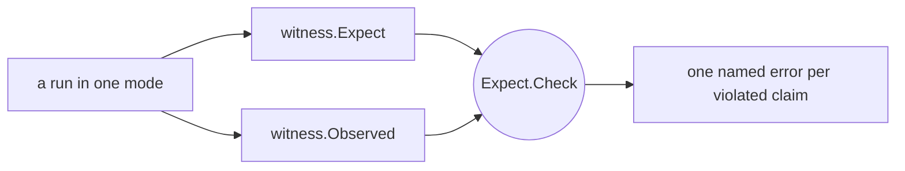
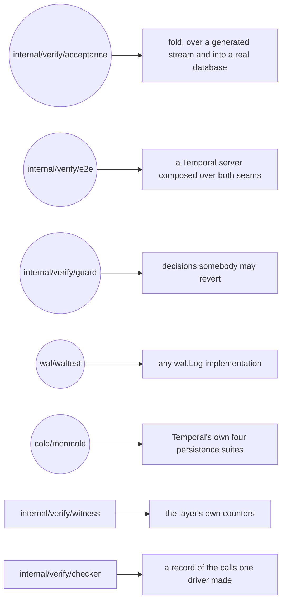

# How the layer is judged

A green test can be true for the wrong reason. A persistence suite passes when the layer works, but
it also passes when a broken composition silently routes every call around the layer. A stream test
reports a collapse ratio when its generator never produces the shape a defect needs. A recovery test
proves little when the fault was staged before the supposedly durable write was ever acknowledged.

Verification must therefore establish more than behaviour at the end. It must show that the
mechanism participated, that the experiment was capable of exposing a difference, and that the
failure occurred in the interval the claim is about. This chapter develops those three obligations
through the log's contract suite, the fold acceptance, the server that boots over both seams, the
witness and the guards, then states the limits of each. Its last sections are reference: what the
words *checker* and *witness* mean here, the map of `internal/verify/`, and what is not claimed.

**Every suite here runs with nothing installed** — no cluster, no container, no port, no cgo, no
build tag. That is not because the suites steer around storage. Both seams have a real
implementation that lives in this process: `wal/memwal` is a log, and `cold/memcold` is Temporal's
own SQL persistence over a SQLite database opened in memory. A suite therefore has somewhere real to
append and somewhere real to commit, and one of them boots four Temporal services over the pair.

What no suite here judges is storage that outlives the process. Nothing fsyncs, crosses a network,
waits on a quorum, or hands a shard from one machine to another — which is where a deployment's own
risk lives. [Chapter 15](15-the-limits-of-the-evidence.md) collects that boundary.

Nothing under `internal/verify/` runs in production: no package outside it may import it in a
non-test file. What lives on the other side of that line is [chapter
03](03-components.md#the-tree-has-two-halves).

## The levels of evidence

The suites differ less by size than by the question they can answer:

| Level | Question | Typical evidence | What it still cannot prove |
|---|---|---|---|
| behavioural result | did the caller or cold store end in the expected state? | the rows a drain left in `memcold`, a store double's recorded batches, a merged page's contents | that the WAL path participated |
| mechanism witness | did the intended append, held read, merge or drain actually occur? | `cycle.Totals`, wrapper counts, captured emissions | that a server composes the same path |
| composition | does a Temporal server, built the production way, actually reach the layer and complete work over it? | four services in one process, a workflow through the SDK, and a witness saying the layer saw it | that the storage underneath survives anything |
| failure history | was an acknowledged call preserved across a staged fault, with nothing invented? | a journal of calls and outcomes, read back against the log and the watermark | failures nobody stages |

No level makes the others redundant. End-state equality without participation can certify
passthrough; counters without behavioural equality can certify a mechanism that produced the wrong
answer; a server that comes up says nothing about what it wrote; and a final snapshot without a
recorded history cannot say what was acknowledged before a kill.

The third level is `internal/verify/e2e`, described below. The fourth is not in this repository at
all; only one of its two inputs is. `internal/verify/checker` is the record a driver writes of the
calls it made, and it judges nothing. The judge that reads such a record back, and the harness that
would kill processes to produce one, belong to a deployment: killing a process is only a test if
what the process owned is still there afterwards, and both backends here die with the process.

---

## The log contract suite

`waltest.RunContractSuite(t, log)` is where the five guarantees of
[`wal.Log`](04-contracts.md#the-five-guarantees) stop being prose. Eighteen cases, one `wal.Log`
value, no cluster:

| what it holds | the cases |
|---|---|
| order and readback | `AppendsComeBackInOrder`, `ReadFromAnyPosition`, `ShardsAreIndependent` |
| gap-freedom | `GapIsRefused`, `DuplicateSeqnoIsAlreadyWritten`, `AppendBelowATrimIsRefused` |
| trim | `TrimRemovesUpToAndNothingElse`, `TrimOfALogWithNothingInIt` |
| fencing | `AppendNeedsAFenceAtItsEpoch`, `FenceCutsOffLowerEpochs`, `FenceAtALowerEpochIsRefused`, `FenceAtTheSameEpochIsIdempotent`, `FencedOutranksAMissingPredecessor`, `EpochGrowsWithoutChangingOwner`, `TwoWritersContendForOneShard`, `ZeroEpochIsRefused` |
| the obligations that belong to no one backend | `PayloadsAreNobodyElsesMemory`, `ArgumentsTheContractRefuses` |

The last row is what makes this a contract rather than a test of `memwal`. Its two cases state
obligations no single implementation can see from the inside, so each has to be written down once,
in the one place every implementation runs.

`PayloadsAreNobodyElsesMemory` checks ownership in both directions. It appends a slice, overwrites
that slice, and requires the entry read back to still hold the original bytes; then it writes into a
payload the log handed out, and requires that neither the log nor the other entries of the same read
change. `ArgumentsTheContractRefuses` pins what the log must refuse rather than interpret: a nil
payload, a seqno below `wal.FirstSeqno`, a read of zero entries, a read with a negative limit — and
the one out-of-range argument that is clamped instead, a read starting below `wal.FirstSeqno`, which
is where a caller that wants the whole log begins.

Refusal *order* is a rule of the same kind, and it sits in the fencing row.
`FencedOutranksAMissingPredecessor` puts an ex-owner's append two seqnos above the tail, where both
`wal.ErrGap` and `wal.ErrFenced` are true, and requires `wal.ErrFenced`. `wal.ErrGap` means "retry
once the predecessor lands", and for a writer that has lost the shard the predecessor never will.

**A deployment runs this against its own log, and that is what the package is for.** It is exported,
it takes a `wal.Log` and a `*testing.T`, and it names no implementation — including `memwal`, which
it may not name for the same reason it may not name any other: a suite that could special-case one
backend has stopped being about the contract.

`waltest.Faulty` is beside it: a log wrapped so that a chosen call fails, `Once` or `Always`. It
exists so a caller above the log can stage an append that fails without needing a backend with a
back door — which is why `memwal` deliberately has no knobs and no injection points at all.

### The blind spot, stated where the instrument is

`RunContractSuite` drives **one** `wal.Log` value, in one process. A displaced owner is therefore
refused by the same in-process object its successor has just fenced — so **a backend whose `Fence`
records the epoch in memory and never gets it into storage passes every fencing case here.** Only a
failover between two processes can see that, and this repository has no second process to run.

That is the single most important thing for a deployment to know about the suite it is about to run
against its own log: a green contract suite says the log's *logic* is right and says nothing about
whether the fence reaches another machine. Whoever supplies the log owes that test to themselves.

**The second blind spot is time, and it is the one a managed backend walks into.** Guarantee 5 says
`ReadFrom` returns every entry a completed append acked *and no trim has removed*, so a trim is the
only removal the contract excuses: a retention policy, a TTL on the table, a compaction that drops
old records are each a violation of it. The suite cannot see any of them. Every case runs to
completion in milliseconds, so a log that deletes entries after an hour passes all eighteen and
loses an acked entry the first time a shard's tail outlives the policy. A backend on storage that
expires anything owes itself the test the suite has no way to write, and owes it against the
configuration it will actually run.

---

## The cold store's suites are Temporal's

The other seam is judged the other way round, and the asymmetry is worth stating rather than
smoothing over. `wal.Log` is this library's own invention, so this library owes it a suite. A cold
store's obligations to a *server* are Temporal's to state, and Temporal states them: four suites
exported from `go.temporal.io/server/common/persistence/tests`. `cold/memcold` runs all four
unmodified in `conformance_test.go` — `NewShardSuite`, `NewExecutionMutableStateSuite`,
`NewExecutionMutableStateTaskSuite` and `NewHistoryEventsSuite`, 75 subtests in total, one fresh
store per suite. They judge `memcold` exactly as they judge a plugin, and they pass without
`memcold` answering a single one of their calls itself: its execution store is upstream's SQL
persistence, embedded whole. That is what says the embedding ([chapter
04](04-contracts.md#the-implementation-shipped-at-this-seam)) is the right shape and not merely a
saving.

**Those suites do not judge `Apply`**, and cannot: the folded window's transaction is a method
upstream has no name for. Two things judge it instead. `cold/memcold/apply_test.go` is seven cases —
the ordering of the transaction, the refusals that must happen before it opens, the attribution a
condition failure carries, and the rollback that undoes the requests that had already run — each
proved by staging the defect that makes it red. `internal/verify/acceptance` is the volume half, below.

**Nothing here judges somebody else's `cold.Applier`.** A deployment writing one gets the four
obligations in [chapter 04](04-contracts.md#the-recovery-rule-the-watermark-exists-for), `memcold`
as the worked example, and its own store's suites — and that gap is real, where the log seam's is
covered by an exported suite.

Two smaller judgements live in the same package and are worth knowing because they hold up
everything above: `isolation_test.go` says two stores share no rows and that the store reached
through the abstract factory is the same database as the one reached directly. Staging the defect —
a fixed database name — makes both red **while the four conformance suites stay green**, which is
what says those suites are not a guard against cross-store bleed and these two are.

---

## The acceptance: one stream through the fold

Example-based tests ask whether named scenarios behave as expected. Folding has a different risk:
two individually ordinary mutations can interact in an unusual order and leave a merged request that
looks plausible and differs in one field. `internal/verify/acceptance` is the volume answer to that.
`TestAcceptanceFoldNoCluster` drives a generated stream of 100,000 mutations through the codec and
through a real `fold.Accumulator`, draining every 1,024 mutations, with fold's refusal recovery
around it — the way a cycle drives it. Set `WAL_ACCEPTANCE_MUTATIONS` to run a longer or shorter
stream.

What it asserts, in the order the assertions matter:

* **every mutation landed in exactly one window.** `FoldedIn` equals the stream length. That is the
  line the volume exists for: nothing was dropped, double-counted, or lost to a refusal that did not
  recover.
* **the stream contained what it was configured to contain** — chains, both snapshot barriers,
  continue-as-new, buffered batches and their clears, tombstones, workflow-id reuse, sub-key
  deletes, and tasks in all four categories. Asserted rather than assumed from the length, because a
  generator regression that quietly stopped producing a shape would turn the whole thing into a
  volume test of creates.
* **the windows actually collapsed** — a fold ratio above 1.5 — and **the refusal path actually
  ran**. A stream that never refuses never exercises the drain-and-retry contract every consumer of
  `fold` has to implement.

And then the control, which is the part worth copying rather than the headline. Two different ratios
are in play, and telling them apart is the whole of the argument:

| ratio | what it is | where it comes from |
|---|---|---|
| stream ratio | workflow mutations over distinct workflows — the upper bound on what fold *could* merge | `mutgen.Report.CollapseRatio` |
| fold ratio | mutations folded in over merged requests out — what fold *did* merge | `foldrun.Run.CollapseRatio` |

The 1.5 above is the fold ratio. The control is a second run at `WorkflowReuse = 0` over an
unbounded workflow key space, a tenth the volume, whose **stream ratio must be exactly 1.00**: every
mutation touches a workflow of its own, so the corpus asks fold nothing. Without that control the
headline number measures nothing — a fold ratio of 3 could be a property of the generator's defaults
rather than of the fold. The run then requires the headline stream ratio to be strictly greater than
the control's, which is what makes the ratio visibly a function of the knob.

`internal/verify/mutgen` is the generator, deterministic from its seed: the same config and seed produce the
same mutations byte for byte, so a failure reproduces from the seed alone. That determinism is a
constraint on how it is written — no time, no UUIDs, no map iteration, no protobuf maps — and it is
the reason a red run here is a bug report rather than a mystery.

### The witness, and why a green intercept run proves nothing without it

**A green run in a layer mode is not evidence that anything went through the log.** If the layer
came out empty, the composition was passthrough — and a persistence suite stays green over
passthrough, because passthrough is what it was written to judge. The run would have exercised
passthrough under another name and reported success.

So a run ends in a **witness** over the layer's own counters. It states what the run was supposed to
be (`witness.Expect`) and hands over what its instruments saw (`witness.Observed`). `Observed.Totals`
— a `cycle.Totals` — is required. `Observed.Store` (the wrapper's own traffic counters) and
`Observed.Emitted` (the run's captured metric emissions) are optional, because a live server's are
not reachable from the test process; a nil instrument skips exactly the claims that read it, and the
claims that remain are the ones the run can honestly make. `Expect.Check` then returns one named
error per violated claim, so a red run reports which half of the layer went missing rather than that
something did.

`Expect.Check` never looks at a cluster. It is a pure function of two values, which is what lets a
table test judge it — and it is judged, which matters more here than anywhere else in the tree. The
module whose job is to catch a silent pass is the module a silent pass would hide in.

**The central claims invert between the modes, and that is the point of having both.** Sync mode
drains inside every write, so its accumulator is empty at every call boundary; a window holds
between calls. Each claim below is therefore made in both directions, because *a windowed run
reporting sync mode's numbers is sync mode*. Every claim carries a name, and that name prefixes the
error a red run reports:

| what the witness reads | under `Sync` | under `Windowed` |
|---|---|---|
| `ReadsHeld` — reads that crossed a workflow the window was holding | must be zero (W18) | must be non-zero (W23) |
| `TailEntries` — acked entries still unresolved at the end | must be zero (W19) | must be non-zero (W24) |
| `TaskReadsMerged` — task pages that carried a task out of the window | must be zero (W20) | must be non-zero (W25) |
| `DroppedTasks` — tasks a folded range took out of a window | not claimed | must be non-zero (W26) |
| `wal_drained_mutations` — mutations per committed drain | not claimed | at least one drain carried more than one (W32) |

The windowed claims are gated on the run having driven the traffic they are about: W24 runs only
when `Expect.TailHeld` says the run meant to end holding a tail, W26 only when the run completes
task ranges *and* a drain committed — an uncommitted drain's entries stay in the log and replay
folds them again — and W32 only when metric emissions were captured.

Two more things are worth knowing about what those counters mean.

**They count routing, not hits.** The overlay and merge counters count reads *routed* through the
layer, not reads answered out of the window. A counter that only fired on a hit would read zero on an
idle cluster and zero on a layer wired up wrong, and the witness could not tell those apart.

**`wal_answered_condition_failures` must be zero under a window, and that zero is an assertion**
(W33). Every condition a windowed run meets is decided before the append, by the authority in
[`../../fold/check.go`](../../fold/check.go), so nothing reaches a drain to be answered. A non-zero
value means either that the check let a condition through, or that a drain answered a batch whose
caller had already been told the write succeeded. The zero belongs to the windowed claims and not to
the layer: sync mode acks before the condition is verified, so there a refusal *is* discovered at the
drain and attributed to the one caller a window of one can hold, which is what W22 and W30 assert.
Both of those are gated on `Expect.ConditionFailures`, so a sync run that writes no failing
conditions makes neither claim — worth checking before believing a green witness.

The witness was verified the way everything here is verified — by breaking it on purpose.
`TestEachClaimHasADefectOnlyItCatches` is the leave-one-out over the claim table: a claim no defect
reaches exclusively is redundant or unreachable, and both look exactly like a witness working.
`TestReadingAroundTheLayerIsAsRedAsReadingThroughIt` and `TestTheEmptyLayerIsAssertedNotAssumed` are
the two that state the failure this module exists for.

### Both seams real: the same shape, into a database

The fold acceptance never executes a batch — its drain callback counts what came out and throws it
away — so the strongest thing it can say is that the layer produced the right merged requests.
`TestBothSeamsRealNoServer` is the second acceptance run, and what it adds is that those requests
are *executed*, against the schema, the row layouts and the condition failures upstream wrote. It
puts one `cycle.Manager` at `cycle.Defaults()` between `wal/memwal` on one side and `cold/memcold`
on the other, takes the shard by moving the database's own `rangeID` so the drain's epoch CAS is a
real one, and drives a generated stream of 6,000 mutations over 32 hot workflows through
`Manager.Write` — the same call the wrapper makes.

The window is the shipped one, 256 mutations, and that is the whole reason the run means anything.
At a window of one every drain would carry a single request: nothing folds, no assertion is ever
settled against a row an earlier request of the same transaction wrote, and such a run stays green
with the fold path deleted.

The applier the cycle drains into is a **ledger**. It passes each batch to `memcold.Apply` and then
works out, from the batch alone, what the database must hold once that transaction has committed:
the `db_record_version` each request leaves on each run row, which run rows a tombstone removed, and
which run each workflow's current row must name. It never reads any of that back out of the store,
because an expectation read out of the store agrees with the store by construction and judges
nothing.

The test then asserts every one of those rows through the store's own reads, and three things
besides: the store's watermark is the last drain's own and is also the last seqno acked; the log's
lower end moved while the run was still going, so a trim did reach it; and the log's upper end is
still the last entry acked, so what the trims took came off the bottom rather than out of the
middle.

One invariant here cannot be checked at the end of a run at all: that the log's lower end never
passes the watermark, so every entry the cold store has not applied is still in the log. Written as
an end-of-run check it stayed green with a trim staged to run a thousand seqnos **ahead** of the
watermark. The trim is detached, so it empties the log while appends continue, and by the end of a
run that drained everything those entries have been applied and the damage is invisible; only a
crash in the middle would have found it. So the run samples the invariant every 64 mutations inside
the drive loop instead, reading the log's lower end first and the watermark second — the watermark
only rises, so a drain committing between the two reads can only make the comparison stricter than
the moment it is about.

`TestAShardThatLosesItsEpochMidRun` is invariant [I2](02-concepts-and-invariants.md#the-invariants)
with both seams real. After 2,000 mutations another owner takes the shard in the database: the range
id moves, which is all an acquire is from underneath. The log is left unfenced on purpose — fencing
it would stop the appends and halt the cycle before any drain reached the database, which is the
other half of fencing and not this run's subject. Here the loss is discovered inside the drain's own
transaction, with a window of acknowledged mutations riding on it.

What must hold afterwards is the whole of the invariant. The write path answers a
`*persistence.ShardOwnershipLostError` and the cycle is in `StateHaltedLost`. The database matches
the ledger's snapshot from *before* the loss, and every run that only a refused drain would have
written is absent from it. The applied position is still the last committed drain's, and the log
holds every seqno up to the last one acked. Nothing acknowledged was lost, and nothing unapplied was
invented.

### The fold against not folding

Everything above holds the folded path against a record of what its own drains carried, which agrees
with the fold by construction, or against another folded path. Neither states the claim the layer
actually makes, which is that **folding is transparent**: the database a window of 256 leaves is the
database Temporal's own write path would have left, one mutation at a time.

`TestFoldingChangesNothingButTheNumberOfTransactions` states it. One seed is driven twice into two
real databases, once at the shipped window and once at `Mutations: 1` — a window that holds one
request when the drain takes it, so no two mutations of a run ever meet and nothing is ever merged.
Then every run row is read back and diffed whole, blobs included, over the union of both ledgers'
keys, and so is every workflow's current row. The two arms must differ in transactions and in nothing
else: 6,000 mutations commit 77 transactions folded and 6,000 sequential, and leave 519 identical run
rows and 32 identical current rows.

Staging the merge's upsert-after-delete resolution — dropping the line that takes a re-upserted key
back out of the delete set, so the store writes the row and then deletes it again — reddens this run
on a named row. It reddens the recovery run too, since two different window cuttings also disagree
about it; what it does *not* redden is `TestBothSeamsRealNoServer`, whose ledger recorded what the
drain carried and therefore agrees with the database about the wrong answer. That is the difference
this run is for. Its blind spot is the mirror image: a defect both arms share — the codec, the
encoding of a request, an assertion neither arm makes — cancels, and belongs to the codec guards and
the condition authority instead.

### Recovery: the same stream, a different set of windows

Every run above ends in a shutdown drain, which applies the last window out of memory. So none of
them ever takes an entry back out of the log, and the run just described stops one step short of the
claim the first rule is about: it proves the entries a refused drain carried are still in the log,
not that anybody can turn them back into rows.

`TestARecoveredShardHoldsWhatAnUninterruptedOneDoes` is that step. One seed is driven twice. The
control run puts all 6,000 mutations through a single cycle. The second puts the same stream through
six of them: five times, after a thousand mutations, the shard's range id moves and the cycle is
superseded without draining — which is the whole of what this layer can observe of a process that
died, the window going with it and the log keeping everything it acked. The successor finds those
entries at replay or nowhere.

The two databases are then compared to each other rather than to a model, and that is what makes the
comparison total. The ledger knows what the drains carried, so a mutation no drain ever carried is
invisible to it; the uninterrupted run's own rows are the only expectation that has an entry for
something the second run dropped. Every run row is read back through the store and diffed whole,
blobs included, over the union of both ledgers' keys, and so is every workflow's current row. The
watermark must stand at the stream's length, `Replayed` must be non-zero — without it the crashes
cost the run nothing and it judges nothing — and `Dropped` must be zero, since no entry of an async
stream is provisional and a drop would be a mutation silently forgotten.

What it establishes beyond "recovery works" is that **the fold is boundary-independent**: the two
runs cut the same stream into different windows, so a merge rule that depended on where a window
ended would leave two different databases. Staging one — the mutation merge keeping the head's
`NextEventID` rather than the delta's — makes the run red on one named run row with the two values
beside each other. Staging a successor whose replay starts one entry above the watermark makes it red
at the crash boundary instead, on the assertion the next drain fails.

`TestACrashOnTopOfADrainNobodyCouldReadRecoversEitherWay` is the crash that run leaves out. There it
falls between two writes, so every entry in the log is one whose fate the predecessor knew; here the
last drain has no readable outcome, which is the one state in which the entries above the watermark
may already be rows. One drain's applier reports an error nothing can classify, the watermark read
that would have resolved it fails once — a read that answers resolves the ambiguity on the spot and
leaves nothing for a crash to land on — and then the owner is superseded with the stall standing.

The successor is told none of it. It reads the watermark, floors there and replays what is above, so
the same code has to skip entries a transaction it cannot see already applied and apply the ones it
did not. Both halves are run, and one number separates them: the entries replayed must be exactly the
acked seqnos above the watermark the successor found — 204 where the transaction never ran, 1 where it
had committed, out of the same window — and both databases must match the uninterrupted run. Staging
a `resolve` that reads a failed watermark read as a commit makes the uncommitted half red on a
`db_record_version` mismatch inside the database, which is what this run adds to the stall's own unit
tests: those state the tail's arithmetic, and this states the consequence.

**What neither proves.** Nothing is killed: both backends live in the test's own process, so both are
claims about the layer's arithmetic across an owner change rather than durability claims about either
store. And neither crash falls inside an append — an entry that may or may not be durable is
`wal/waltest`'s subject, above.

### Two owners at once, and each fence on its own

Every run above changes hands through one `cycle.Manager`, where `ShardAcquired` installs the fresh
cycle and retires the previous one — which stops its goroutine. So the predecessor never acts again,
and neither of the two fences that exist to stop it is asked anything. A node that lost its lease is
not told: its cycle stays alive with a window in it, its timers keep running, and it finds out by
acting. Two nodes are two `cycle.Manager`s over one log and one store, and
`acceptance_twonode_test.go` already builds that pair — for one question, whether a drain's witness is
owner-scoped, with an applier that parks the drain and answers without passing the batch down.
`acceptance_handover_test.go` is where a fenced owner's batch reaches the database, in the three cases
that shape has.

The two fences each stop one of the two things such a node can still do, which is why either looks
redundant from where the other stands. The log's stops the appends, and it is in place before the range
id moves ([the order `UpdateShard`
imposes](06-shard-lifecycle.md#what-managershardacquired-does-with-the-epoch-it-is-handed)), so a write
by the old owner is refused while the database still names him owner. The cold store's epoch CAS stops
the drains, which need neither an append nor a caller: a shutdown drain and the age timer both fire out
of a full window on their own.

`TestTheLogFenceStopsAnOwnerBeforeTheDatabaseChangesHands` is the first of them. The successor fences
the log and takes the range id; the predecessor, holding a tail, writes. The write is refused, the
cycle is in `StateHaltedLost`, the watermark has not moved and the log has not grown by the entry it
refused — the append is where this stopped, so the drain's own fence was never reached. Then the
successor replays exactly the entries between the watermark and the last ack. What the run pins is the
*translation*: staging a fenced append that raises no halt leaves the caller holding the log's own
error, which the history service's write path does not recognise and answers with a background
re-acquire rather than its own. The doomed write is drawn from a stream of its own, because a mutation
this run's generator handed out and the log refused would leave that generator's model of the run a
version ahead of the database for every later mutation of it.

`TestTheShutdownDrainOfALostShardCommitsNothing` is the composition: 2,000 mutations, a handover in the
real order, 500 more through the successor — which replays the predecessor's window and writes past it
— and only then does the predecessor shut down and drain the window it has been holding all along. The
watermark must not move, no row may go back to the version that window names, and the stream must
finish into a database identical to the one an uninterrupted owner leaves. It does not say which fence
spoke, and cannot: a stale window carrying run rows is refused twice over, once by the epoch and once
by every `db_record_version` in it, the successor having applied those same entries already. Deleting
the epoch check leaves this run green, which is why it is not the evidence about that check.

`TestAStaleRangeCompletionCannotTakeTheSuccessorsTasks` isolates it, and what it judges is the store
rather than the layer — which is worth being exact about, because the isolation is easy to mistake for
evidence of a kind this chapter does not have. The predecessor acks one range completion and nobody
drains it, the shard changes hands, and the successor replays that completion and then writes three
tasks inside the range it covered and commits them. Then the predecessor shuts down. Delete the epoch
check in `cold/memcold` and its drain commits, and those three rows are gone by name — `[120, 150,
180]` against nothing.

The reason such a window exists at all is a fact about the record format and belongs here: **a window's
task work asserts nothing.** A range completion is a category and two keys, with no version in it that
a second owner could have moved, so for a batch of task work the epoch is the only refusal in the
transaction. That is the third obligation in [`cold`](../../cold/cold.go)'s doc, and this run is a
guard on the one store in this repository that carries it — not a claim about a deployment's, which
[level 2](#the-levels-of-evidence) says nothing here can make. Its worth is that `cold/memcold` is
underneath every other run in this package, so a defect in its fence would weaken all of them without
reddening one.

The same drain also carries a watermark below the successor's, and that half is quieter. It loses no
row: an owner reading a witness that points under rows the database holds either re-applies entries
whose assertions have moved on, or meets the gap a trim left below it. Both end in a halt. What it
costs is a shard nobody can recover without a person, which is the failure mode the strict equality in
`Watermarker`'s contract is written against.

---

## A server, in this process

`internal/verify/e2e` is the composition level, and it is the one claim no suite below it can make. It builds
a Temporal server the production way — a custom datastore named in `Persistence.DataStores`, the
layer's factory handed to `temporal.WithCustomDataStoreFactory` — starts frontend, history, matching
and worker in the test process, registers a namespace through the frontend, and runs a workflow with
an activity through the SDK. Ports come from the OS, the databases are `memcold`'s and one more for
visibility, and nothing is installed.

**The green workflow is the weaker half.** A server whose layer fell out of the path completes the
same workflow just as fast, which is exactly the failure [the witness](#the-witness-and-why-a-green-intercept-run-proves-nothing-without-it)
exists for. So the run has two arms, both of which *compose* a layer and differ only in the one
value the server is handed:

* `TestAWorkflowRunsThroughTheLayer` states `witness.Windowed`, shards acquired, mutable state,
  history tasks and merged task reads, plus the mutation kinds a workflow of that shape must
  produce — a create and updates. Beside the witness it requires directly that mutations were
  acked, that a drain committed, that the applied position moved, that history tasks were written,
  and that **the shards' watermarks are readable out of the database**, so a run claiming a drain
  committed and a store holding nothing cannot both be believed;
* `TestAWorkflowRunsWithTheLayerOutOfThePath` is the control: the same store bare, and
  `witness.NoLayer` over the layer it composed and did not install. That claim is only available
  because the control composes a layer at all — a run with none could not make it — and it goes red
  if the "passthrough" arm quietly still had a layer in it. Beside it, no shard's watermark may be
  in the database, because nothing drained.

Two things about the run itself are worth knowing. The drains it counts are the **age** trigger's:
one workflow is nowhere near 256 mutations or 256 KiB, so the five-second age is the only trigger
that can fire, and staging `Age = time.Hour` makes the run red with a non-zero acked count and a
zero applied count — which is what says the drains were the policy's and not an artefact of
shutdown. And the intercept arm deliberately leaves one claim out: it does not state `Ranges`, the
witness's claim that a queue completed a task range. A queue checkpoints on a 30-second timer, per
queue per shard, so a workflow this short honestly completes none, and a witness that demanded one
would fail honest runs.

**What it does not prove.** The databases are in memory and die with the process, so nothing here is
a durability claim. Nothing is killed, so nothing is a crash-recovery claim. One workflow on four
shards is not load, and no timing this suite produces is a performance claim.
[Chapter 15](15-the-limits-of-the-evidence.md) is where each of those sits as an entry.

---

## The record, and the judge that is not here

The last level of evidence — *nothing acked was lost and nothing applied was invented, while nodes
were being killed* — has no instrument in this repository. Killing a process is only a test if what
the process owned is still there afterwards, and both backends here die with it. The arithmetic such
a run would exercise is judged without the killing — a superseded owner's tail replayed, and the
result held against an uninterrupted run of the same stream, in the recovery acceptance above. What
is here besides is one half of a killing run's input: `internal/verify/checker` is the record a driver writes of the calls it
made, and it judges nothing. Nothing here reads a record back and says whether the run it describes
was correct.

**Two lines per call, each fsynced.** The first is written before the store is touched, the second
once it has answered. So a call ends in the record as one of three classes: `Acked`, `Refused` — the
store gave a definite answer, which never means the mutation is absent — or `Unknown`, which is what
a process killed between the two lines leaves behind, and which is the truth about such a call.
Recording the outcome only would make every killed call look like one that was never issued, while
its entry sits in the log with nothing to account for it. The record is a file rather than memory
because what it records is a process dying: an in-memory record goes with the node, and the one call
a run turns on is then the one that is missing. `TestTheCallIsDurableBeforeTheStoreIsTouched`, in
`internal/verify/drive`, is that ordering made permanent; `TestACallWithNoOutcomeIsTheThirdClass`,
in `checker` itself, is the class it creates.

`NewRecord` takes a node name and an incarnation, and neither is decoration: the line ids are per
process, so a node restarted onto the same path numbers its second run from 1 and the two runs'
calls collide — one call's outcome read as another's. An incarnation of 0 appended to a record that
already holds a run is refused rather than trusted.

Two things constrain whoever builds the judge, and both are worth stating here because a judge that
gets either wrong is green for the wrong reason.

**It may not import the layer.** An assertion compiled into the layer sees what the layer
*believes*, and it dies with the layer under `kill -9` — which is the case such a run exists for. So
a judge stands outside it: it reads the log through `wal.Log`'s own contract, the watermark through
the same seam the cycle uses, and the cold store through the deployment's own reader.

**It observes repeatedly and remembers, rather than looking once at the end.** A cycle trims to the
applied watermark with no safety lag, so however long the run was, the surviving log is bounded by
roughly `TrimEvery` drains' worth of windows — about 4,000 entries at the shipped `TrimEvery` of 16
and window of 256. A post-mortem look at a long run therefore sees a vanishing fraction of it. The
consequence for any claim of the form *applied ⊆ logged* is sharper still: such a claim is only
sound over a run whose log was never trimmed away underneath it, so the run has to push both trim
triggers — `TrimEvery` and `TrimAfter` — out of reach first, and then check that the promise was
kept.

---

## The guards

Some properties are too narrow for the large suites and too important to infer from code shape. A
guard observes the external consequence of such a property. It earns its place only when
deliberately breaking that property makes the guard red while the ordinary suite could otherwise
stay green. **A guard is green on a broken layer and red on a reverted decision**, which is the
opposite of a unit test and the reason they are collected apart.

* **the three backpressure-boundary tests**, which hold the refusal's concrete type across a
  boundary neither the cycle nor the wrapper can see from its own side.
  `TestTheBackpressureRefusalIsDefinitelyNotCommitted` asserts the value is a
  `*serviceerror.ResourceExhausted` by type assertion rather than by `errors.As` — that is the shape
  the history shard's `handleWriteErrorLocked` switches on — and then wraps it in one
  `fmt.Errorf("…: %w", err)` and shows `persistence.OperationPossiblySucceeded` flip from false to
  true. A single `%w` anywhere on the way out therefore converts a bounded degradation into a
  background shard re-acquire, which is the failover backpressure exists to prevent.
  `TestTheWrapperCarriesTheRefusalOut` requires the wrapper to hand the identical value back — not a
  copy, not a wrapping of it. `TestTheRefusalSurvivesTheWholeInterceptPath` makes the same claim
  through `waltz.Compose` with a real log and a real wrapper, so it covers the two joins the other
  two stop short of: the cycle's answer becoming the registry's, and the registry's becoming the
  store's.

  The other half of invariant [I10](02-concepts-and-invariants.md#the-invariants) — that a tripped
  bound degrades and does not lose — is `TestATrippedTailLosesNothing`, which lives in `cycle` rather
  than here. It holds the applier, accepts until the tail bound trips, collects the refusals, then
  releases: the window commits, `CommitSeqno − AppliedSeqno` returns to zero, `TailBytes` goes to
  zero, the refused writes are retried at the versions they were refused at and succeed, and reading
  the log the way an acquiring owner would returns **exactly the set that was acknowledged, in order,
  gap-free, and none of the refused ones**. A caller told "no" still holds the row it read, which is
  what distinguishes a bound from a conflict and why `ResourceExhausted` is the right answer.
* **`cycle_wiring_test.go`**, which is nothing but compile-time assertions that `cycle.Manager` still
  satisfies each of the wrapper's faces: `ShardObserver`, `ShardWriter`, `ShardReader`, `ShardLayer`
  and `MetricsSink`. Each is asserted separately, so a `Manager` that loses one fails by the name of
  the face it lost rather than at the composed interface where several claims read as one. It is the
  cheapest guard here and watches the failure with the widest blast radius: a layer that does not
  satisfy `ShardLayer` is a layer nobody can install.

Two more guards belong in this list and cannot be written here, for the same reason in both cases:
each is a statement about a *deployment's* own storage — its engine's transaction counters, its
applier's statement text — and neither the in-memory map that `memwal` is nor the upstream SQL
`memcold` issues can stand in for one. They are described here so that a deployment builds them
rather than assuming it inherited them.

* **an append-immediacy guard** for [I9](02-concepts-and-invariants.md#the-invariants) — drive
  ordinary appends through the front door and read the storage engine's own transaction counters out
  of band, asserting that the appends were immediate, that nothing else was touched, and that no
  secondary structure exists on the log's tables. It exists because a "harmless" change — an index, a
  changefeed, one read of one other table — quietly makes every append pay for a coordinator tick,
  and *nothing above the layer would notice*: the append still returns success, just later.
* **a drain query-shape guard** — that the drain's statement is a function of assertion kinds and
  delete families, never of how many mutations the window folded. A statement whose size grows with
  the batch is green everywhere until a real store takes long enough to compile one to hit its
  timeout, and that failure presents as a halted shard rather than as a slow write. The form it
  replaced, and what that cost, is
  [chapter 13](13-designs-that-were-rejected.md#a-folded-window-as-a-concatenation-of-the-stores-own-queries).

---

## The doubles, and why each is a package

Six packages under `internal/verify/` exist so that a suite above them does not write its own. Each was
extracted after several packages had written the same thing slightly differently, which is the
failure mode a double has: two copies that disagree leave a rule green and unjudged.

* **`internal/verify/coldtest`** — the cold store a drain lands in, in memory. One value satisfies both
  `cold.Applier` and `cold.Watermarker`, and that is the point rather than a convenience: a
  composition whose drains land somewhere the watermark does not read back is a shard that replays
  what it already applied, and no test built that way could ever notice. It is a double and not a
  cold store — it records what a drain carried and what watermark it moved, and interprets nothing.
  `cold/memcold` does not make it redundant, and the division is worth keeping
  straight: a suite that needs a drain to **land** uses the store, and a suite that needs a drain to
  fail in a chosen way uses `coldtest.Refusing(err)`, because a correct store cannot be asked to
  return the error a test is about.
* **`internal/verify/basetest`** — the pre-window rows in memory, the second adapter at the seam
  `baserow.Store` names. Absence is what makes it worth a package: a row that is not there comes
  back from the store as a `NotFound` error, which `baserow.Rows` turns into a nil row, and that nil
  is what every delegated assertion is stated over. A double that answered absence its own way would
  leave all of them green and unjudged.
* **`internal/verify/coldtasks`** — a model of the store below for the merged task read, and explicitly *not*
  a stub. The merge's whole difficulty is the base's pagination, so a fake that answered everything
  in one page would leave every rule in `fold/taskpage.go` untested. It models two paginations — an
  immediate page by task id, a scheduled page refined by `(fireTime, taskID)` and bounded above by
  fire time alone — and `coldtasks_test.go` states both plainly, because that is what a reader
  compares their own store's queries against.
* **`internal/verify/mutbuild`** — one well-formed mutation of a given shape, ids named rather than drawn.
  Every shape that has a validator runs through Temporal's own before it is returned, and an invalid
  fixture **panics**: an invalid fixture is a bug in the test rather than a case a caller handles.
* **`internal/verify/drive` and `internal/verify/foldrun`** — the writing half of a run (one mutation into one store
  call, plus `Stream` for driving a generated stream through the codec) and the loop that folds it
  window by window. `foldrun` owns the loop and nothing above it: where the mutations come from is
  the caller's, and so is what a drained batch is for, which is why the drain is a callback.

`foldrun` counts only what every caller counts the same way, deliberately. "Tombstone" means
`KindDelete` to one caller and `KindDelete`-or-`KindDeleteCurrent` to another, and a shared counter
would have to pick one and silently change the other's meaning.

---

## The words for what judges the layer

The layer's own vocabulary is [chapter
02](02-concepts-and-invariants.md#the-glossary-in-reading-order). These two terms are deliberately
absent from it: they name instruments that stand outside the layer and pass judgement on it.

**Checker.** The judge of a run under faults, stated over a record of what each driver asked for
and what it was told. It may not import the layer, and that is the point: a judge that dies with the
thing it judges is no judge. It is not in this repository; `internal/verify/checker` is the record, not the
judgement over it.

*Not to be confused with:* an assertion inside the layer, which sees what the layer believes.

**Witness.** The assertion a run makes over the layer's **own** counters, beside the assertions of
whatever suite it ran. It exists because a layer that came out empty is passthrough wearing another
name, and somebody else's suite is green over it — so a witness can fail a run that every suite
passed. `internal/verify/witness` is itself a judged module: a run states what it was supposed to be
(`Expect`) and hands over what its instruments saw (`Observed`).

*Not to be confused with:* smoke check, sanity assert — both name something weaker than the suite,
and this is the stronger claim.

A third word belongs here as an absence. An **oracle** — one stream applied twice, once mutation by
mutation through a real store and once folded, with the two stores required to end identical — is
the only instrument that can say a fold rule is *mechanically* right, because fold's rules have no
specification of their own beyond the behaviour of the code they compact for. There is none here.
`cold/memcold` could run both halves, but a store this repository built its folded path against,
judged by a sequential path through the same code, would only be agreeing with itself. A deployment
that wants the strongest possible statement about the fold builds an oracle over its own store, and
[chapter 13](13-designs-that-were-rejected.md#judging-it) has the two cheaper instruments it should
not build instead.

---

## The map of `internal/verify/`

Two kinds of package live here, and confusing them is the first mistake. **Instruments** measure or
drive; they assert nothing. **Judgements** say yes or no.

### Instruments

| package | what it is |
|---|---|
| `internal/verify/mutgen` | the mutation-stream generator, deterministic from its seed |
| `internal/verify/mutbuild` | one well-formed mutation of a named shape, for a unit test |
| `internal/verify/drive`, `internal/verify/foldrun` | the writing half of a run, and the loop that folds it window by window |
| `internal/verify/coldtest`, `internal/verify/basetest`, `internal/verify/coldtasks` | the doubles: a drain's outcome on demand, the pre-window rows, and a model of the base's task pagination. The *store* is `cold/memcold`, outside `internal/verify/` |
| `internal/verify/checker` | the record a driver writes of its own calls and their outcomes, for a run under faults. It judges nothing; the judge over it is not here |
| `internal/verify/witness` | the claims a run makes about the layer's own counters, as a pure function of values |

### Judgements

| package | what it says |
|---|---|
| `internal/verify/acceptance` | a hundred thousand generated mutations fold, with the control that makes the ratio a measurement; and, over both real seams, that the folded batches leave the database holding what they said, hold nothing a drain that lost the shard carried, end up the same whether the stream crossed one owner or six, lose no row to an owner that kept draining after it had been fenced, and are the rows one mutation per transaction would have left |
| `internal/verify/e2e` | a Temporal server, composed the production way over both seams, acquires its shards through the layer and completes a workflow — with a passthrough control arm beside it |
| `internal/verify/guard` | tests whose job is to fail when a decision is reverted: the backpressure boundary and its error type, the wrapper's wiring |
| `cold/memcold` | *(not under `internal/verify/`)* the shipped cold store answering Temporal's own four persistence suites, plus the seven cases over the one method those suites do not know about |
| `wal/waltest` | an implementation of `wal.Log` satisfies the five guarantees — the one judgement here written to be run against somebody else's code |

Who judges what. Circles are judgements, boxes are what they are stated over.

`witness` is drawn beside the circles rather than among them, because it states claims rather than
running them: a judgement's claims pulled into a module of its own, so that the thing whose job is to
catch a silent pass is itself judged by a table test. `checker` is beside them for a different
reason — it is the input a judge of a run under faults would need, and that judge is not in this
repository.

---

## The two house rules

Both are absolute, both were arrived at after the tree grew violations of them, and both are stated
here because a rule nobody can read is a rule someone deletes.

### 1. A test asserts behaviour, never shape

No `_test.go` here parses Go source (`go/ast`, `go/parser`, `go/token`), asserts over the import
graph (no "package X may not import Y", by `go list`, `go/build` or by reading directories), or
parses documentation and build files.

The ban reads as a loss until you see how such a test fails: **a green check claims something it has
not checked.** A scan over source can only match the shapes whoever wrote it thought of, and a
one-line alias walks past it — green, while the invariant it exists for is violable. A scan also
matches identifiers by *name*, so a rename the compiler follows for free leaves it matching nothing,
and passing. And running a lint rule under `go test` costs three more things: `go test ./cycle/`
stops meaning "the cycle works", the diagnostic points at the scan rather than at the offending
line, and the rule ends up maintained by whoever next touches the package, who did not sign up to
maintain a linter.

What to do instead, in the order to try it:

* **(1) make it a compile error** — unexported fields of an exported type in a package of its own is
  the only option that cannot be walked past, and it is why `tailstate` and `window` are packages;
* **(2) write a linter as a linter**, on `golang.org/x/tools/go/analysis`, tested with
  `analysistest`. A check this repository decided against is switched off in `.golangci.yml` *with
  the reason*, not silenced one `//nolint` at a time;
* **(3) state it in prose and stop**, beside the code it is about.

The third is a legitimate ending: a rule nobody can violate without reading the file they are
editing is carried by a sentence in that file.

### 2. A new guard is proved by breaking it

A newly written test that passes proves nothing — not that the mechanism works, and not that the
test would notice if it stopped. So stage the defect on purpose and show the guard go red, then put
the number or the failure in the ticket.

`TestEachClaimHasADefectOnlyItCatches`, over the witness's claims, is that rule made permanent
rather than remembered: it builds a defect per claim and requires that exactly one claim catches it.
The same rule is what makes a *removal* honest: a claim leaves the table when no defect reaches it
exclusively — evidence, not a judgement that it looked redundant.

---

## What is not claimed

The collected boundaries are [chapter 15](15-the-limits-of-the-evidence.md). Four belong to the
suites above and are stated where they are:

* **the contract suite cannot see a fence that does not reach another process**
  ([above](#the-blind-spot-stated-where-the-instrument-is));
* **no suite here hands a shard to a new owner in a second *process*** — but two owners are staged,
  and the distinction is narrower than it sounds. Nothing in this layer speaks to another node: every
  interaction between two owners of a shard goes through the log and the epoch, so two
  `cycle.Manager`s over one log and one store are two nodes, and a second address space would add an
  address space and no schedule. `internal/verify/acceptance`'s `TestASyncWriterIsNotToldItSucceededByAnotherNodesWatermark`
  is that harness: it parks one node inside its applier, lets the other take the shard, replay the
  parked node's entry and drain over it, and then asks what the first node's caller is told. What a
  second process would add is the part that is genuinely absent — a real transport hanging, a real
  kill, and storage that outlives either — and the judge that would read such a run's record back is
  still not here;
* **nothing here judges the fold against the sequential path.** A folded batch now *executes*
  against a real Temporal schema, which is what `TestBothSeamsRealNoServer` added and which catches
  a merged request no store would take. What is still unjudged is the stronger claim — that a folded
  batch leaves a store where mutation-by-mutation writing would have left it — and that needs a
  differential oracle running one stream twice into two stores. `memcold` could be both of them, and
  a store judged by a sequential path through its own code would agree with itself; the oracle is
  worth building over the store a deployment cares about;
* **nothing here survives its own process.** Both backends are in memory. No suite has ever fsynced,
  crossed a network, waited on a quorum, or been killed.

---

## Where this lives in the code

* [`../../wal/waltest/waltest.go`](../../wal/waltest/waltest.go) — `RunContractSuite`, its eighteen
  cases, and the guarantee each is stated under;
  [`fault.go`](../../wal/waltest/fault.go) is `Faulty`.
* [`../../internal/verify/acceptance/acceptance_fold_test.go`](../../internal/verify/acceptance/acceptance_fold_test.go)
  — the stream, the window, the assertions and the knob control at the other end of the dial;
  [`acceptance_seams_test.go`](../../internal/verify/acceptance/acceptance_seams_test.go) is the same shape
  over both real seams, with the ledger that says what the database must hold;
  [`acceptance_recovery_test.go`](../../internal/verify/acceptance/acceptance_recovery_test.go) drives
  that stream twice and holds the recovered database against the uninterrupted one, and
  [`acceptance_handover_test.go`](../../internal/verify/acceptance/acceptance_handover_test.go) is the
  two registries a failover really has, with each fence taken on its own, and
  [`acceptance_oracle_test.go`](../../internal/verify/acceptance/acceptance_oracle_test.go) is the same
  stream folded and unfolded into two databases that must agree.
* [`../../cold/memcold/conformance_test.go`](../../cold/memcold/conformance_test.go) — Temporal's
  four suites over the shipped store, and why a suite of ours is not beside them;
  [`apply_test.go`](../../cold/memcold/apply_test.go) is the one method they do not reach, and
  [`isolation_test.go`](../../cold/memcold/isolation_test.go) is the pair the four suites stay green
  without.
* [`../../internal/verify/e2e/server.go`](../../internal/verify/e2e/server.go) — the server's configuration, the
  readiness probe and the log gate; [`e2e_test.go`](../../internal/verify/e2e/e2e_test.go) is the two arms
  and what each claims.
* [`../../internal/verify/mutgen/mutgen.go`](../../internal/verify/mutgen/mutgen.go) — the generator and the
  determinism rules it is written under; [`corpus.go`](../../internal/verify/mutgen/corpus.go) is the report
  a stream makes about itself.
* [`../../internal/verify/witness/witness.go`](../../internal/verify/witness/witness.go) — `Expect`, `Observed` and
  the named claim tables.
* [`../../internal/verify/checker/record.go`](../../internal/verify/checker/record.go) — the record's file format, why
  a call is written before the store is touched, and why the incarnation is not decoration;
  [`checker.go`](../../internal/verify/checker/checker.go) is the vocabulary it is written in.
* [`../../internal/verify/guard/doc.go`](../../internal/verify/guard/doc.go) — what a guard is and what it may not be.
* [`../../internal/verify/coldtest/coldtest.go`](../../internal/verify/coldtest/coldtest.go),
  [`../../internal/verify/basetest/basetest.go`](../../internal/verify/basetest/basetest.go) and
  [`../../internal/verify/coldtasks/coldtasks.go`](../../internal/verify/coldtasks/coldtasks.go) — the three doubles,
  each with the rule it exists to keep judged.
* [`../../internal/verify/foldrun/foldrun.go`](../../internal/verify/foldrun/foldrun.go) and
  [`../../internal/verify/drive/drive.go`](../../internal/verify/drive/drive.go) — the loop and the writing half.
* [`../../patches/README.md`](../../patches/README.md) — the strongest evidence a composition over
  this library can produce, which is upstream's own functional suites against a real store, and the
  fifteen-line patch that makes it reachable.
