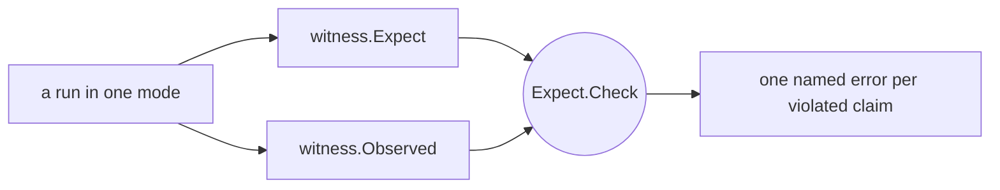
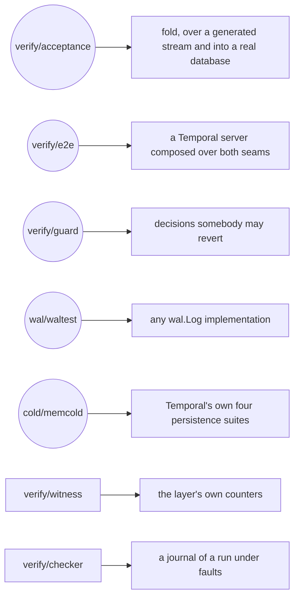

# How the layer is judged

A green test can be true for the wrong reason. A persistence suite passes when the layer works, but
it also passes when a broken composition silently routes every call around the layer. A stream test
reports a collapse ratio when its generator never produces the shape a defect needs. A recovery test
proves little when the fault was staged before the supposedly durable write was ever acknowledged.

Verification must therefore establish more than behaviour at the end. It must show that the
mechanism participated, that the experiment was capable of exposing a difference, and that the
failure occurred in the interval the claim is about. This chapter develops those three obligations
through the log's contract suite, the fold acceptance, the server that boots over both seams, the
witness and the guards, then states the
limits of each. Its last sections are reference: the exact boundary of the two words this repository
judges with, the map of `verify/`, and what is not claimed.

**Every suite here runs with nothing installed** — no cluster, no container, no port, no cgo, no
build tag. That is the shape of the whole chapter, and it is a consequence of where the storage is
rather than of there being none: both seams have an implementation that lives in this process, so a
suite has somewhere real to append and somewhere real to commit, and one of them boots four Temporal
services over the pair. What is *not* judged is any storage that survives the process — no fsync, no
network, no quorum, no handover between two machines — which is where a deployment's own risk lives.
[Chapter 15](15-the-limits-of-the-evidence.md) is that boundary collected.

Nothing under `verify/` runs in production: no package outside it may import it in a non-test file.
What lives on the other side of that line is
[chapter 03](03-components.md#the-tree-has-two-halves).

## The levels of evidence

The suites differ less by size than by the question they can answer:

| Level | Question | Typical evidence | What it still cannot prove |
|---|---|---|---|
| behavioural result | did the caller or cold store end in the expected state? | the rows a drain left in `memcold`, a store double's recorded batches, a merged page's contents | that the WAL path participated |
| mechanism witness | did the intended append, held read, merge or drain actually occur? | `cycle.Totals`, wrapper counts, captured emissions | that a server composes the same path |
| composition | does a Temporal server, built the production way, actually reach the layer and complete work over it? | four services in one process, a workflow through the SDK, and a witness saying the layer saw it | that the storage underneath survives anything |
| failure history | was an acknowledged call preserved across a staged fault, with nothing invented? | a journal of calls and outcomes, read back against the log and the watermark | failures nobody stages |

No level makes the others redundant. End-state equality without participation can certify
passthrough; counters without behavioural equality can certify a mechanism that produced the wrong
answer; a server that comes up says nothing about what it wrote; and a final snapshot without a
recorded history cannot say what was acknowledged before a kill.

The third level arrived with the shipped cold store, and is `verify/e2e` below. The fourth is the
one this repository can only half provide. `verify/checker` is the judge for it, written and tested
here; the harness that would kill processes and hand it a journal is a deployment's, because killing
a process means having a process that owns storage worth recovering, and both backends here die with
the test.

---

## The log contract suite

`waltest.RunContractSuite(t, log)` is where the five guarantees of
[`wal.Log`](04-contracts.md#the-five-guarantees) stop being prose. Eighteen cases, one `wal.Log`
value, no cluster:

| what it holds | the cases |
|---|---|
| order and readback | `AppendsComeBackInOrder`, `ReadFromAnyPosition`, `ShardsAreIndependent` |
| gap-freedom | `GapIsRefused`, `DuplicateSeqnoIsAlreadyWritten`, `AppendBelowATrimIsRefused` |
| trim | `TrimRemovesUpToAndNothingElse`, `TrimOfALogWithNothingInIt` |
| fencing | `AppendNeedsAFenceAtItsEpoch`, `FenceCutsOffLowerEpochs`, `FenceAtALowerEpochIsRefused`, `FenceAtTheSameEpochIsIdempotent`, `FencedOutranksAMissingPredecessor`, `EpochGrowsWithoutChangingOwner`, `TwoWritersContendForOneShard`, `ZeroEpochIsRefused` |
| the obligations that belong to no one backend | `PayloadsAreNobodyElsesMemory`, `ArgumentsTheContractRefuses` |

The last row is what makes this a contract rather than a test of `memwal`. Payload ownership runs
both ways and neither direction is visible from inside one implementation; the refusal *order* — that
`ErrFenced` outranks a missing predecessor — is a rule every backend inherits rather than invents.
Both migrated here out of an implementation's local tests, which is the shape a contract suite grows
in: an obligation stated once, in the one place every implementation runs.

**A deployment runs this against its own log, and that is what the package is for.** It is exported,
it takes a `wal.Log` and a `*testing.T`, and it names no implementation — including `memwal`, which
it may not name for the same reason it may not name any other: a suite that could special-case one
backend has stopped being about the contract.

`waltest.Faulty` is beside it: a log wrapped so that a chosen call fails, `Once` or `Always`. It
exists so a caller above the log can stage an append that fails without needing a backend with a
back door — which is why `memwal` deliberately has no knobs and no injection points at all.

### The blind spot, stated where the instrument is

`RunContractSuite` drives **one** `wal.Log` value. So a displaced owner is refused by the same
in-process record its successor has just rewritten, and **deleting a backend's fence from its
`Fence` leaves the suite green** — the in-process state still refuses the old epoch. Only a
two-process failover can see it, and this repository has no second process to run.

That is the single most important thing for a deployment to know about the suite it is about to run
against its own log: a green contract suite says the log's *logic* is right and says nothing about
whether the fence reaches another machine. Whoever supplies the log owes that test to themselves.

---

## The cold store's suites are Temporal's

The other seam is judged the other way round, and the asymmetry is worth stating rather than
smoothing over. `wal.Log` is this library's own invention, so this library owes it a suite. A cold
store's obligations to a *server* are Temporal's to state, and Temporal states them: four suites
exported from `go.temporal.io/server/common/persistence/tests`, which `cold/memcold` runs unmodified
in `conformance_test.go` — `NewShardSuite`, `NewExecutionMutableStateSuite`,
`NewExecutionMutableStateTaskSuite` and `NewHistoryEventsSuite`, 75 subtests over one store per
suite. They judge `memcold` exactly as they judge a plugin, and they passed on the first wiring
attempt with no store code written, which is the evidence that the embedding
([chapter 04](04-contracts.md#the-implementation-shipped-at-this-seam)) is the right shape and not
merely a saving.

**Those suites do not judge `Apply`**, and cannot: the folded window's transaction is a method
upstream has no name for. Two things judge it instead. `cold/memcold/apply_test.go` is seven cases —
the ordering of the transaction, the refusals that must happen before it opens, the attribution a
condition failure carries, and the rollback that undoes the requests that had already run — each
proved by staging the defect that reds it. `verify/acceptance` is the volume half, below.

**Nothing here judges somebody else's `cold.Applier`.** A deployment writing one gets the four
obligations in [chapter 04](04-contracts.md#the-recovery-rule-the-watermark-exists-for), `memcold`
as the worked example, and its own store's suites — and that gap is real, where the log seam's is
covered by an exported suite.

Two smaller judgements live in the same package and are worth knowing because they hold up
everything above: `isolation_test.go` says two stores share no rows and that the store reached
through the abstract factory is the same database as the one reached directly. Staging the defect —
a fixed database name — makes both red **while the four conformance suites stay green**, which is
what says those suites are not a guard against cross-store bleed and these two are.

---

## The acceptance: one stream through the fold

Example-based tests ask whether named scenarios behave as expected. Folding has a different risk:
two individually ordinary mutations can interact in an unusual order and leave a merged request that
looks plausible and differs in one field. `verify/acceptance` is the volume answer to that —
`TestAcceptanceFoldNoCluster` drives a generated stream of 100,000 mutations through the codec and
through a real `fold.Accumulator`, window by window, the way a cycle drives it, with the refusal
recovery around it.

What it asserts, in the order the assertions matter:

* **every mutation landed in exactly one window.** `FoldedIn` equals the stream length. That is the
  line the volume exists for: nothing was dropped, double-counted, or lost to a refusal that did not
  recover.
* **the stream contained what it was configured to contain** — chains, both snapshot barriers,
  continue-as-new, buffered batches and their clears, tombstones, workflow-id reuse, sub-key
  deletes, and tasks in all four categories. Asserted rather than assumed from the length, because a
  generator regression that quietly stopped producing a shape would turn the whole thing into a
  volume test of creates.
* **the windows actually collapsed** — a fold ratio above 1.5 — and **the refusal path actually
  ran**. A stream that never refuses never exercises the drain-and-retry contract every consumer of
  `fold` has to implement.

And then the control, which is the part worth copying rather than the headline: a second run at
`WorkflowReuse = 0`, a tenth the volume, **required to report a ratio of exactly 1.00**. A corpus
that never re-touches a workflow asks fold nothing, and its ratio reads like a pass. Without the
control, the headline ratio is not a measurement of anything — it could be a property of the
generator's defaults rather than of the fold. The control is what makes the ratio visibly a function
of the knob.

`verify/mutgen` is the generator, deterministic from its seed: the same config and seed produce the
same mutations byte for byte, so a failure reproduces from the seed alone. That determinism is a
constraint on how it is written — no time, no UUIDs, no map iteration, no protobuf maps — and it is
the reason a red run here is a bug report rather than a mystery.

### The witness, and why a green intercept run proves nothing without it

**A green run in a layer mode is not evidence that anything went through the log.** A composition
whose layer came out empty *is* passthrough, and every persistence suite in the world stays green
over it. The run would then have exercised passthrough under another name and reported success.

So a run ends in a **witness** over the layer's own counters: it states what the run was supposed to
be (`witness.Expect`) and hands over what its instruments saw (`witness.Observed`). Its required
account is `cycle.Totals`; wrapper counts and captured metric emissions are optional instruments.
The witness then says whether expectation and observation agree, and the claims are named, so a red
run reports which half of the layer went missing rather than that something did.

How to read it: `Observed` is a `cycle.Totals`, the wrapper's counts and the captured metric
emissions. The witness never looks at a cluster; it is a pure function of values, which is what lets
a table test judge it — and it is judged, which matters more here than anywhere else in the tree.
The module whose job is to catch a silent pass is the one module a silent pass would hide in.

**The two central claims invert between the modes, and that is the point of having both.** Under
sync the drain runs before the answer, so every read crosses an empty window: reads held must be
**0**, and nothing acked may be left unresolved when the run finishes. Under a window both must be
the opposite — reads that crossed a workflow the window was holding, a tail that was not empty at
the end, and at least one drain that carried more than one mutation. *A windowed run reporting sync
mode's numbers is sync mode.* The task claims invert the same way: under sync no page may carry a
task out of the window, and under a window pages are merged from two sources and ranges take tasks
out of a window the drain has not applied yet.

Two more things the witness holds. **Routing, not hits**: the overlay and merge counters count reads
*routed* through the layer rather than reads answered from the window — a counter that only fired on
a hit would read zero on an idle cluster and zero on a layer wired up wrong. And
**`wal_answered_condition_failures` is zero under a window, and that zero is an assertion**: every
condition a windowed run meets is decided before the append, so nothing reaches a drain to be
answered. A non-zero there means either the check let a condition through, or a drain answered a
batch whose caller had already been told the write succeeded — the condition authority itself is
[`../../fold/check.go`](../../fold/check.go). The zero is a property of the windowed rows and not of
the layer: sync acks before the condition is verified, so there a refusal *is* discovered at the
drain and attributed to the one caller a window of one can hold. That carve-out is only visible on a
run that writes failing conditions, which is a thing to check before believing a green witness.

The witness was verified the way everything here is verified — by breaking it on purpose.
`TestEachClaimHasADefectOnlyItCatches` is the leave-one-out over the claim table: a claim no defect
reaches exclusively is redundant or unreachable, and both look exactly like a witness working.
`TestReadingAroundTheLayerIsAsRedAsReadingThroughIt` and `TestTheEmptyLayerIsAssertedNotAssumed` are
the two that state the failure this module exists for.

### Both seams real: the same shape, into a database

`TestBothSeamsRealNoServer` is the second acceptance run, and what it adds is that the batch is
*executed*. One `cycle.Manager` at `cycle.Defaults()`, `wal/memwal` under one side and
`cold/memcold` under the other, the shard taken through the database's own range id so the drain's
epoch CAS is a real one, and a generated stream of 6,000 mutations over 32 hot workflows driven
through `Manager.Write` — the same call the wrapper makes. The window is the shipped one, and that
is the whole reason the run means anything: at a window of one nothing folds, no assertion is ever
settled against a row an earlier request of the same transaction wrote, and the run stays green with
the fold path deleted.

The applier is a **ledger**: it delegates to `memcold.Apply` and then works out from the batch alone
what the database must now hold — the `db_record_version` each request leaves per run, which runs a
tombstone removed, and the run each workflow's current row must name. Never a readback, because an
expectation read out of the store agrees with the store by construction. What the test then asserts
is every one of those rows through the store's own reads, plus: the store's watermark equals the
last drain's own and equals the last seqno acked, the log's lower end moved *while the run was
going*, and its upper end is still the last entry acked.

That trim assertion is the one that changed under staging, and the reason is worth copying. Written
as an end-of-run check it stayed green with a trim staged to run a thousand seqnos **ahead** of the
watermark — the trim is detached, it empties the log while appends continue, and by the end of a run
that drained everything those entries are applied and the damage is invisible. Only a crash would
have found it. So the invariant is sampled every 64 mutations inside the drive loop instead, reading
the log's lower end first and the watermark second, since the watermark only rises and a drain
committing between the two reads can only make the comparison stricter.

`TestAShardThatLosesItsEpochMidRun` is invariant [I2](02-concepts-and-invariants.md#the-invariants)
with both seams real. After 2,000 mutations another owner takes the shard in the database — the
range id moves, which is all an acquire is from underneath — and the log is deliberately left
unfenced, so the loss is discovered where it has to be, inside the drain's own transaction, with a
window of acknowledged mutations riding on it. Afterwards: the write path answers a
`*persistence.ShardOwnershipLostError`, the cycle is `StateHaltedLost`, the database matches the
ledger's snapshot from *before* the loss, every run only a refused drain would have written is
absent, the applied position is still the last committed drain's, and the log holds every seqno up
to what was acked. Nothing acknowledged lost, nothing unapplied invented.

---

## A server, in this process

`verify/e2e` is the composition level, and it is the one claim no suite below it can make. It builds
a Temporal server the production way — a custom datastore named in `Persistence.DataStores`, the
layer's factory handed to `temporal.WithCustomDataStoreFactory` — starts frontend, history, matching
and worker in the test process, registers a namespace through the frontend, and runs a workflow with
an activity through the SDK. Ports come from the OS, the databases are `memcold`'s and one more for
visibility, and nothing is installed.

**The green workflow is the weaker half.** A server whose layer fell out of the path completes the
same workflow just as fast, which is exactly the failure [the witness](#the-witness-and-why-a-green-intercept-run-proves-nothing-without-it)
exists for. So the run has two arms, both of which *compose* a layer and differ only in the one
value the server is handed:

* `TestAWorkflowRunsThroughTheLayer` states `witness.Windowed`, shards acquired, mutable state,
  history tasks and merged task reads, plus the mutation kinds a workflow of that shape must
  produce — a create and updates. Beside the witness it requires directly that mutations were
  acked, that a drain committed, that the applied position moved, that history tasks were written,
  and that **the shards' watermarks are readable out of the database**, so a run claiming a drain
  committed and a store holding nothing cannot both be believed;
* `TestAWorkflowRunsWithTheLayerOutOfThePath` is the control: the same store bare, and
  `witness.NoLayer` over the layer it composed and did not install. That claim is only available
  because the control composes a layer at all — a run with none could not make it — and it goes red
  if the "passthrough" arm quietly still had a layer in it.

Two things this suite established about itself are worth carrying. The drains it counts are the
**age** watermark's: one workflow is nowhere near 256 mutations, and staging `Age = time.Hour` makes
the run red with a non-zero acked count and a zero applied count, which is what says the drains were
the policy's and not an artefact of shutdown. And a claim was *removed* rather than weakened — a
short workflow makes no `AddHistoryTasks` call at all, since history tasks ride the folded
mutable-state writes, so the claim that was written first was wrong and the witness caught it.

**What it does not prove.** The databases are in memory and die with the process, so nothing here is
a durability claim. Nothing is killed, so nothing is a crash-recovery claim. One workflow on four
shards is not load, and no timing this suite produces is a performance claim.
[Chapter 15](15-the-limits-of-the-evidence.md) is where each of those sits as an entry.

---

## The checker: judging a run nobody was there for

`verify/checker` is the judge for the last level of evidence — *nothing acked was lost and nothing
applied was invented, while nodes were being killed*. It is here in full, tested in full, and it has
no harness in this repository to feed it: killing a process is only a test if what the process owned
is still there afterwards, and both backends here die with it. What follows is therefore both a
description and an instruction manual for whoever builds that harness over their own deployment.

**It is a journal, not a look.** The measurement that shapes everything else: a cycle trims to the
applied watermark with no safety lag, so the surviving log is bounded by roughly
`TrimEvery × windowMutations` entries however long the run was. A post-mortem look at a long run
therefore sees a vanishing fraction of it. So the checker **observes repeatedly and remembers**:
every assertion is over the journal rather than over the world, and the driver's record of its own
calls is not a second instrument beside it but entries in the same journal, made by the one observer
that can see an outcome at all.

**It may not import the layer, and that is the point.** Assertions inside the layer see what the
layer believes and die with it under `kill -9`, which is exactly the case such a run exists for.

The assertions are numbered A1–A10 and the numbering has a hole in it, deliberately: A8 is withdrawn
and keeps its number, with A9 stating what took its place. They are:

| | what it holds |
|---|---|
| **A1** | gap-freedom: the log a run leaves has no hole in it |
| **A2** | the epoch is monotonic along a shard's log, and two epochs' entries never interleave |
| **A3** | an entry never changes after it is written |
| **A4** | the watermark only moves forward |
| **A5** | everything acked is recoverable: it is in the log at or above the watermark, or applied below it |
| **A6** | applied ⊆ logged — nothing reached the cold store that was not an entry first |
| **A7** | acked ⟹ the store agrees, judged over one run at a time once it is quiescent |
| **A9** | no entry without a call: the log holds no mutation nobody asked for |
| **A10** | the run kept its whole log — the declaration that makes A6 sound |

A10 is the one worth reading twice, because it is a claim about the *harness* rather than about the
layer. A6 is only sound over a run whose log was never trimmed away underneath it, so a run that
wants A6 raises both trim triggers to keep the log — and because a declaration nobody keeps is worse
than no declaration, keeping it is `checker.Policy`'s job rather than a caller's, and A10 checks the
promise was kept.

Three of the checker's own tests are the ones to copy the reasoning of:
`TestEachAssertionHasADefectOnlyItCatches` is the leave-one-out;
`TestAJournalThatForgetsMissesWhatOnlyMemorySees` is the argument for the journal, stated as a test;
and `TestADriverThatRecordsOutcomesOnlyIsCaught` is the argument for recording the call *before* it
is made — `TestTheCallIsDurableBeforeTheStoreIsTouched` is the same rule on the driver's side.
`TestAPresentThatAlwaysAnswersYesIsCaught` is the one that keeps a broken observer from being green.

---

## The guards

Some properties are too narrow for the large suites and too important to infer from code shape. A
guard observes the external consequence of such a property. It earns its place only when
deliberately breaking that property makes the guard red while the ordinary suite could otherwise
stay green. **A guard is green on a broken layer and red on a reverted decision**, which is the
opposite of a unit test and the reason they are collected apart.

* **the three backpressure-boundary tests**, with `TestATrippedTailLosesNothing` in `cycle` beside
  them for invariant I10's other half. Hold the applier, accept until the tail bound trips, collect
  the refusals, release: the window commits, `commitSeqno − appliedSeqno` returns to zero, the tail
  bytes go to zero, and reading the log the way an acquiring owner would returns **exactly the set
  that was acknowledged, in order, gap-free, and none of the refused ones**. The refused writes are
  then retried at the versions they were refused at and succeed — a caller told "no" still holds the
  row it read, which is what distinguishes a bound from a conflict and why `ResourceExhausted` is
  the right answer. `TestTheBackpressureRefusalIsDefinitelyNotCommitted` is the one that states the
  "not loss" half outright; `TestTheWrapperCarriesTheRefusalOut` and
  `TestTheRefusalSurvivesTheWholeInterceptPath` hold the error's concrete type across the whole
  path, because the shard's write handling type-switches on it and one `%w` turns a bounded
  degradation into a background re-acquire.
* **`cycle_wiring_test.go`**, which is nothing but compile-time assertions that `cycle.Manager` still
  satisfies each of the wrapper's faces. It is the cheapest guard here and watches the failure with
  the widest blast radius: a layer that does not satisfy `ShardLayer` is a layer nobody can install.

Two guards that were in the research prototype are named here because they are the ones a deployment
should rebuild rather than inherit. Neither became available when the two seams got an
implementation, and the reason is the same for both: each is a statement about a *deployment's* own
storage — an engine's transaction counters, an applier's statement text — and neither the map that
`memwal` is nor the upstream statements `memcold` issues can stand in for one.

* **an append-immediacy guard** for [I9](02-concepts-and-invariants.md#the-invariants) — drive
  ordinary appends through the front door and read the storage engine's own transaction counters out
  of band, asserting that the appends were immediate, that nothing else was touched, and that no
  secondary structure exists on the log's tables. It exists because a "harmless" change — an index, a
  changefeed, one read of one other table — quietly makes every append pay for a coordinator tick,
  and *nothing above the layer would notice*: the append still returns success, just later.
* **a drain query-shape guard** — that the drain's statement is a function of assertion kinds and
  delete families, never of how many mutations the window folded. A statement that grew back with the
  batch is green everywhere until a real store is slow enough to time its compilation out, and that
  failure presents as a halted shard rather than a slow write. The form it replaced, and what that
  cost, is
  [chapter 13](13-designs-that-were-rejected.md#a-folded-window-as-a-concatenation-of-the-stores-own-queries).

---

## The doubles, and why each is a package

Five packages under `verify/` exist so that a suite above them does not write its own. Each was
extracted after several packages had written the same thing slightly differently, which is the
failure mode a double has: two copies that disagree leave a rule green and unjudged.

* **`verify/coldtest`** — the cold store a drain lands in, in memory. One value satisfies both
  `cold.Applier` and `cold.Watermarker`, and that is the point rather than a convenience: a
  composition whose drains land somewhere the watermark does not read back is a shard that replays
  what it already applied, and no test built that way could ever notice. It is a double and not a
  cold store — it records what a drain carried and what watermark it moved, and interprets nothing.
  It did not become redundant when `cold/memcold` arrived, and the division is worth keeping
  straight: a suite that needs a drain to **land** uses the store, and a suite that needs a drain to
  fail in a chosen way uses `coldtest.Refusing(err)`, because a correct store cannot be asked to
  return the error a test is about.
* **`verify/basetest`** — the pre-window rows in memory, the second adapter at the seam
  `baserow.Store` names. Absence is what makes it worth a package: a row that is not there arrives
  as a NotFound and becomes a nil row, and a double answering absence its own way leaves every
  delegated assertion green and unjudged.
* **`verify/coldtasks`** — a model of the store below for the merged task read, and explicitly *not*
  a stub. The merge's whole difficulty is the base's pagination, so a fake that answered everything
  in one page would leave every rule in `fold/taskpage.go` untested. It models two paginations — an
  immediate page by task id, a scheduled page refined by `(fireTime, taskID)` and bounded above by
  fire time alone — and `coldtasks_test.go` states both plainly, because that is what a reader
  compares their own store's queries against.
* **`verify/mutbuild`** — one well-formed mutation of a given shape, ids named rather than drawn.
  Every shape that has a validator runs through Temporal's own before it is returned, and an invalid
  fixture **panics**: an invalid fixture is a bug in the test rather than a case a caller handles.
* **`verify/drive` and `verify/foldrun`** — the writing half of a run (one mutation into one store
  call, plus `Stream` for driving a generated stream through the codec) and the loop that folds it
  window by window. `foldrun` owns the loop and nothing above it: where the mutations come from is
  the caller's, and so is what a drained batch is for, which is why the drain is a callback.

`foldrun` counts only what every caller counts the same way, deliberately. "Tombstone" means
`KindDelete` to one caller and `KindDelete`-or-`KindDeleteCurrent` to another, and a shared counter
would have to pick one and silently change the other's meaning.

---

## The words for what judges the layer

The layer's own vocabulary is
[chapter 02](02-concepts-and-invariants.md#the-glossary-in-reading-order). These two terms are
deliberately absent from it: they name instruments that stand outside the layer and pass judgement
on it.

**Checker.** The judge of a run under faults: a journal of what each driver asked for and what it
was told, plus assertions A1–A10 over it. It may not import the layer, and that is the point: a
judge that dies with the thing it judges is no judge.

*Not to be confused with:* an assertion inside the layer, which sees what the layer believes.

**Witness.** The assertion a run makes over the layer's **own** counters, beside the assertions of
whatever suite it ran. It exists because a layer that came out empty is passthrough wearing another
name, and somebody else's suite is green over it — so a witness can fail a run that every suite
passed. `verify/witness` is itself a judged module: a run states what it was supposed to be
(`Expect`) and hands over what its instruments saw (`Observed`).

*Not to be confused with:* smoke check, sanity assert — both name something weaker than the suite,
and this is the stronger claim.

A third word belongs here as an absence. An **oracle** — one stream applied twice, once mutation by
mutation through a real store and once folded, with the two stores required to end identical — is
the only instrument that can say a fold rule is *mechanically* right, because fold's rules have no
specification of their own beyond the behaviour of the code they compact for. It cannot exist in this
repository: it needs two real cold stores. A deployment that wants the strongest possible statement
about the fold builds one over its own store, and
[chapter 13](13-designs-that-were-rejected.md#judging-it) has the two cheaper instruments it should
not build instead.

---

## The map of `verify/`

Two kinds of package live here, and confusing them is the first mistake. **Instruments** measure or
drive; they assert nothing. **Judgements** say yes or no.

### Instruments

| package | what it is |
|---|---|
| `verify/mutgen` | the mutation-stream generator, deterministic from its seed |
| `verify/mutbuild` | one well-formed mutation of a named shape, for a unit test |
| `verify/drive`, `verify/foldrun` | the writing half of a run, and the loop that folds it window by window |
| `verify/coldtest`, `verify/basetest`, `verify/coldtasks` | the doubles: a drain's outcome on demand, the pre-window rows, and a model of the base's task pagination. The *store* is `cold/memcold`, outside `verify/` |
| `verify/checker` | the journal and its assertions A1–A10, for a run under faults |
| `verify/witness` | the claims a run makes about the layer's own counters, as a pure function of values |

### Judgements

| package | what it says |
|---|---|
| `verify/acceptance` | a hundred thousand generated mutations fold, with the control that makes the ratio a measurement; and, over both real seams, that the folded batches leave the database holding what they said and hold nothing a drain that lost the shard carried |
| `verify/e2e` | a Temporal server, composed the production way over both seams, acquires its shards through the layer and completes a workflow — with a passthrough control arm beside it |
| `verify/guard` | tests whose job is to fail when a decision is reverted: the backpressure boundary and its error type, the wrapper's wiring |
| `cold/memcold` | *(not under `verify/`)* the shipped cold store answering Temporal's own four persistence suites, plus the seven cases over the one method those suites do not know about |
| `wal/waltest` | an implementation of `wal.Log` satisfies the five guarantees — the one judgement here written to be run against somebody else's code |

Who judges what. Circles are judgements, boxes are what they are stated over.

The judgement packages, with the two judging *modules* drawn beside them: `witness` and
`checker` state claims rather than run them, and each is a judgement's claims pulled into a module of
its own so that the thing whose job is to catch a silent pass is itself judged by a table test.

---

## The two house rules

Both are absolute, both were arrived at after the tree grew violations of them, and both are stated
here because a rule nobody can read is a rule someone deletes.

### 1. A test asserts behaviour, never shape

No `_test.go` here parses Go source (`go/ast`, `go/parser`, `go/token`), asserts over the import
graph (no "package X may not import Y", by `go list`, `go/build` or by reading directories), or
parses documentation and build files.

The reasoning, because the ban reads as a loss until you have the receipt: **a green check claims
something it has not checked.** One of the deleted scans could only match the assignment shapes
somebody had thought of, and a one-line alias walked past it — green, while the invariant it existed
for was violable. Every body scan also matched identifiers by *name*, so a rename the compiler
follows for free left the scan matching nothing, and passing. And running a lint rule under
`go test` costs three things: `go test ./cycle/` stops meaning "the cycle works", the diagnostic
points at the scan rather than at the offending line, and the rule is maintained by whoever is least
expecting to.

What to do instead, in the order to try it:

* **(1) make it a compile error** — unexported fields of an exported type in a package of its own is
  the only option that cannot be walked past, and it is why `tailstate` and `window` are packages;
* **(2) write a linter as a linter**, on `golang.org/x/tools/go/analysis`, tested with
  `analysistest`. A check this repository decided against is switched off in `.golangci.yml` *with
  the reason*, not silenced one `//nolint` at a time;
* **(3) state it in prose and stop**, beside the code it is about.

The third is a legitimate ending: a rule nobody can violate without reading the file they are
editing is carried by a sentence in that file.

### 2. A new guard is proved by breaking it

A newly written test that passes proves nothing — not that the mechanism works, and not that the
test would notice if it stopped. So stage the defect on purpose and show the guard go red, then put
the number or the failure in the ticket.

The two leave-one-out tests are that rule made permanent rather than remembered:
`TestEachClaimHasADefectOnlyItCatches` over the witness's claims, and
`TestEachAssertionHasADefectOnlyItCatches` over the checker's. Each builds a defect per claim and
requires that exactly one claim catches it. The same rule is what makes a *removal* honest: a claim
leaves the table when no defect reaches it exclusively — evidence, not a judgement that it looked
redundant.

---

## What is not claimed

The collected boundaries are [chapter 15](15-the-limits-of-the-evidence.md). Three belong to the
suites above and are stated where they are:

* **the contract suite cannot see a fence that does not reach another process**
  ([above](#the-blind-spot-stated-where-the-instrument-is));
* **no suite here hands a shard with a non-empty window to a new owner in a second process.** Replay
  is exercised over an in-process log by `cycle`'s own tests; what is not exercised is a real
  handover, and the instrument for that is `verify/checker` with a harness this repository does not
  have;
* **nothing here judges the fold against the sequential path.** A folded batch now *executes*
  against a real Temporal schema, which is what `TestBothSeamsRealNoServer` added and which catches
  a merged request no store would take. What is still unjudged is the stronger claim — that a folded
  batch leaves a store where mutation-by-mutation writing would have left it — and that needs a
  differential oracle running one stream twice into two stores. `memcold` is one store; the oracle
  needs the second to be one a deployment cares about;
* **nothing here survives its own process.** Both backends are in memory. No suite has ever fsynced,
  crossed a network, waited on a quorum, or been killed.

---

## Where this lives in the code

* [`../../wal/waltest/waltest.go`](../../wal/waltest/waltest.go) — `RunContractSuite`, its eighteen
  cases, and the guarantee each is stated under;
  [`fault.go`](../../wal/waltest/fault.go) is `Faulty`.
* [`../../verify/acceptance/acceptance_fold_test.go`](../../verify/acceptance/acceptance_fold_test.go)
  — the stream, the window, the assertions and the knob control at the other end of the dial;
  [`acceptance_seams_test.go`](../../verify/acceptance/acceptance_seams_test.go) is the same shape
  over both real seams, with the ledger that says what the database must hold.
* [`../../cold/memcold/conformance_test.go`](../../cold/memcold/conformance_test.go) — Temporal's
  four suites over the shipped store, and why a suite of ours is not beside them;
  [`apply_test.go`](../../cold/memcold/apply_test.go) is the one method they do not reach, and
  [`isolation_test.go`](../../cold/memcold/isolation_test.go) is the pair the four suites stay green
  without.
* [`../../verify/e2e/server.go`](../../verify/e2e/server.go) — the server's configuration, the
  readiness probe and the log gate; [`e2e_test.go`](../../verify/e2e/e2e_test.go) is the two arms
  and what each claims.
* [`../../verify/mutgen/mutgen.go`](../../verify/mutgen/mutgen.go) — the generator and the
  determinism rules it is written under; [`corpus.go`](../../verify/mutgen/corpus.go) is the report
  a stream makes about itself.
* [`../../verify/witness/witness.go`](../../verify/witness/witness.go) — `Expect`, `Observed` and
  the named claim tables.
* [`../../verify/checker/checker.go`](../../verify/checker/checker.go) — the journal, and why it is
  a journal; [`assertions.go`](../../verify/checker/assertions.go) has A1–A10 with the reasoning at
  each; [`policy.go`](../../verify/checker/policy.go) is A10's declaration.
* [`../../verify/guard/doc.go`](../../verify/guard/doc.go) — what a guard is and what it may not be.
* [`../../verify/coldtest/coldtest.go`](../../verify/coldtest/coldtest.go),
  [`../../verify/basetest/basetest.go`](../../verify/basetest/basetest.go) and
  [`../../verify/coldtasks/coldtasks.go`](../../verify/coldtasks/coldtasks.go) — the three doubles,
  each with the rule it exists to keep judged.
* [`../../verify/foldrun/foldrun.go`](../../verify/foldrun/foldrun.go) and
  [`../../verify/drive/drive.go`](../../verify/drive/drive.go) — the loop and the writing half.
* [`../../patches/README.md`](../../patches/README.md) — the strongest evidence a composition over
  this library can produce, which is upstream's own functional suites against a real store, and the
  fifteen-line patch that makes it reachable.
