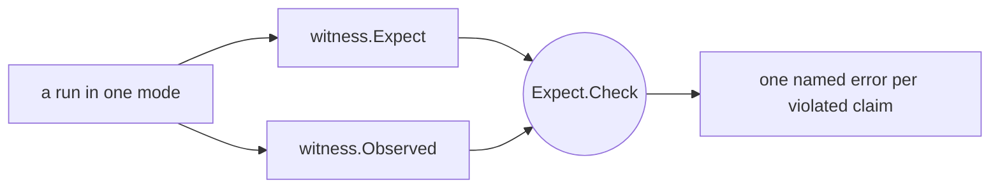
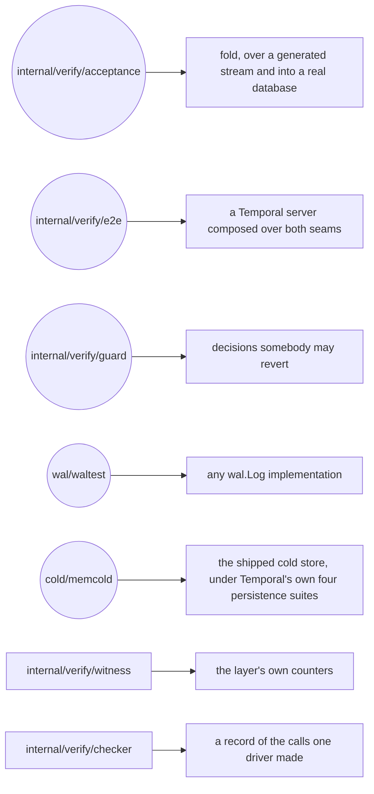

# How the layer is judged

A green test can be true for the wrong reason. A persistence suite passes when the layer works, and
also when a broken composition silently routes every call around the layer. A stream test reports a
collapse ratio even when its generator never produces the shape a defect needs. A recovery test proves
little when the fault was staged before the write it protects was acknowledged.

So a test here must show three things beyond the end state: the mechanism participated, the
experiment could have exposed a difference, and the failure fell in the interval the claim is about.
This chapter walks through the instruments that meet those obligations, then the vocabulary, a map of
`internal/verify/`, two house rules and the limits of each suite.

Every suite runs with nothing installed: no cluster, container, port, cgo or build tag. Both seams
have a real in-process implementation (`wal/memwal`, and `cold/memcold`, Temporal's SQL persistence
over an in-memory SQLite), so every suite has somewhere real to append and commit. The cost is that
no suite judges storage that outlives the process ([chapter 15](15-the-limits-of-the-evidence.md)).
Nothing under `internal/verify/` runs in
production: no package outside it may import it in a non-test file
([chapter 03](03-components.md#the-tree-has-two-halves)).

## The levels of evidence

The suites differ less by size than by the question they can answer:

| Level | Question | Typical evidence | What it still cannot prove |
|---|---|---|---|
| behavioural result | did the caller or cold store end in the expected state? | the rows a drain left in `memcold`, a store double's recorded batches, a merged page's contents | that the WAL path participated |
| mechanism witness | did the intended append, held read, merge or drain actually occur? | `cycle.Totals`, wrapper counts, captured emissions | that a server composes the same path |
| composition | does a Temporal server, built the production way, actually reach the layer and complete work over it? | four services in one process, a workflow through the SDK, and a witness saying the layer saw it | that the storage underneath survives anything |
| failure history | was an acknowledged call preserved across a staged fault, with nothing invented? | a journal of calls and outcomes, read back against the log and the watermark | failures nobody stages |

No level makes the others redundant. End-state equality without participation can certify
passthrough. Counters without behavioural equality can certify a mechanism that produced the wrong
answer. A server that comes up says nothing about what it wrote. A final snapshot without a recorded
history cannot say what was acknowledged before a kill.

The third level is `internal/verify/e2e`. The fourth is not in this repository; only one of its two
inputs is. `internal/verify/checker` records the calls a driver made and judges nothing. The judge
that reads such a record back, and the harness that kills processes to produce one, belong to a
deployment: a kill is only a test if what the process owned survives it, and both backends here die
with the process.

## The log contract suite

`waltest.RunContractSuite(t, log)` turns the five guarantees of
[`wal.Log`](04-contracts.md#the-five-guarantees) into checks. It runs twenty-one cases against one
`wal.Log` value:

| what it holds | the cases |
|---|---|
| order and readback | `AppendsComeBackInOrder`, `ReadFromAnyPosition`, `APageEndsAtItsLimitAndNotAtAByteBudget`, `ShardsAreIndependent` |
| gap-freedom | `GapIsRefused`, `DuplicateSeqnoIsAlreadyWritten`, `AppendBelowATrimIsRefused` |
| trim | `TrimRemovesUpToAndNothingElse`, `TrimOfALogWithNothingInIt`, `TrimRunsBesideAppends` |
| fencing | `AppendNeedsAFenceAtItsEpoch`, `FenceCutsOffLowerEpochs`, `FenceAtALowerEpochIsRefused`, `FenceAtTheSameEpochIsIdempotent`, `FencedOutranksAMissingPredecessor`, `EpochGrowsWithoutChangingOwner`, `TwoWritersContendForOneShard`, `ZeroEpochIsRefused` |
| what every method owes its context | `ACancelledContextChangesNothing` |
| the obligations that belong to no one backend | `PayloadsAreNobodyElsesMemory`, `ArgumentsTheContractRefuses` |

### Obligations no single backend can see

The last row makes this a contract rather than a test of `memwal`. Its cases state obligations an
implementation cannot see from the inside, so they are written once, where every implementation
runs them.

`PayloadsAreNobodyElsesMemory` checks ownership both ways. It appends a slice, overwrites the slice,
and requires the entry read back to hold the original bytes. Then it writes into a payload the log
handed out and requires that neither the log nor the other entries of that read change.

`ArgumentsTheContractRefuses` pins what the log must refuse rather than interpret: a nil payload, a
seqno below `wal.FirstSeqno`, a read of zero entries, a read with a negative limit. One out-of-range
argument is clamped instead: a read starting below `wal.FirstSeqno`, which is where a caller that
wants the whole log begins.

### Concurrent trims and large pages

Every method of the contract is safe for concurrent use. `TwoWritersContendForOneShard` drives that
for fencing and `TrimRunsBesideAppends` for trim. The trimmer runs on its own goroutine beside the
loop, so a slow trim cannot stop a shard from acking. A trim racing appends is thus the only shape a
deployment ever trims in, while the other three trim cases run over a quiescent log. Given `memwal` a
trim built from a snapshot taken before a yield, every other case stays green and this one alone goes
red: the entry acked last is gone.

`APageEndsAtItsLimitAndNotAtAByteBudget` does the same for weight. A caller reading a whole log stops
when `ReadFrom` returns fewer than `limit` entries. A backend that also pages by response size would
answer short, and no case with small entries would notice. So this case appends 24 entries of
256 KiB and requires all 24 in one page: over a 4 MB message, at an entry size a deployment reaches,
since the tail is bounded at 8 MiB as well as in entries. Given `memwal` a 4 MB response budget, every
other case stays green and this one alone goes red.

A backend whose budget is larger than 4 MB passes this case and can still cut a real tail short. So
replay does not trust a short page: it confirms the end of the log with a one-entry read, and what
that read finds halts the shard before it serves
([chapter 06](06-shard-lifecycle.md#the-end-of-the-tail-is-confirmed-not-inferred)).

### Refusal order

`FencedOutranksAMissingPredecessor` puts an ex-owner's append two seqnos above the tail, where both
`wal.ErrGap` and `wal.ErrFenced` apply, and requires `wal.ErrFenced`. `wal.ErrGap` means "retry once
the predecessor lands", and for a writer that has lost the shard the predecessor never will.

### Running it against your own log

A deployment runs this suite against its own log; that is what the package is for. It is exported,
takes a `wal.Log` and a `*testing.T`, and names no implementation, `memwal` included. A suite that
could special-case one backend would stop being about the contract.

`waltest.Faulty` sits beside it: a log wrapped so that a chosen call fails, `Once` or `Always`. A
caller above the log can stage a failing append without a backend that has a back door. That is why
`memwal` has no knobs and no injection points.

### What the contract suite cannot see

`RunContractSuite` drives one `wal.Log` value in one process. A displaced owner is refused by the same
object its successor just fenced, and every case reads back through that same value. So a backend
whose `Fence` keeps the epoch only in memory passes every fencing case, and one whose `Append` acks
into memory that never leaves the process passes all 21. That is guarantee 3, the one the library
rests on. A green contract suite says the log's logic is right, and nothing about whether entries or
fence reached storage. A deployment should know this before trusting a green run.

`waltest.CheckReopen` covers half of that gap without a second process. It takes a way of opening a
log rather than a log: it fences, appends a short run, closes, reopens the storage, and asks three
things. Are all the entries there? Is a fence below the owning epoch refused? Does the log continue at
the next seqno? A backend whose appends never left the process fails the first, one whose epoch never
left it fails the second, and one that starts over at the first seqno fails the third.

It is a function rather than a suite case because `memwal`, a map in this process, cannot be
reopened. `memwal`'s own tests prove it against three backend shapes:

* a `Backend` handed back twice, storage that outlived the value, which must pass;
* a fresh `Backend` per open, appends that never left the process, which must fail;
* a `Backend` behind `waltest.Unfenced`, whose entries persist while its epoch lives only in this
  process, which must fail. `Unfenced` fences the log below at whatever epoch an append carries, so
  the fencing cases refuse it too; it is an instrument for the reopen check, not a log.

What stays the author's own test is a fence racing a displaced owner's append: two writers sharing no
memory, each reading the outcome off the log.

The second blind spot is time. Guarantee 5 says `ReadFrom` returns every entry a completed append
acked and no trim has removed, so a retention policy, a table TTL or a compaction that drops old
records each violates it. Every case finishes in milliseconds, so a log that deletes entries after an
hour passes and then loses an acked entry the first time a tail outlives the policy. That entry has no
second copy: it is in the log because the cold store does not hold it.

`waltest.CheckRetention` appends a short run, waits out a window the caller names, and requires every
entry to still be there with the same seqnos, payloads and order, and the log still appendable above
them. It returns an error rather than being a suite case because it costs its window in wall-clock
time and a deployment runs it from its own harness. A pass only says the entries outlived that
window. To learn whether the backend expires entries at all, shorten its policy to fit the window:
say, a table set to expire in two minutes on a staging cluster, checked with a two-minute window.
`TestTheRetentionCheckIsNotVacuous`
proves the check at a twenty-millisecond window, green against `memwal` and red against
`waltest.Expiring`, a decorator whose entries age out the way a retention window, a TTL and a
compaction all look from above.

## The cold store's suites are Temporal's

The other seam is judged the other way round. `wal.Log` is this library's own invention, so the
library owes it a suite. A cold store's obligations to a server are Temporal's to state, and
Temporal states them in four suites exported from `go.temporal.io/server/common/persistence/tests`.
`cold/memcold` runs all four unmodified in `conformance_test.go`: `NewShardSuite`,
`NewExecutionMutableStateSuite`, `NewExecutionMutableStateTaskSuite` and `NewHistoryEventsSuite`,
75 subtests in total, one fresh store per suite. They judge `memcold` as they judge a plugin, and it
passes without answering a single call itself, because its execution store is upstream's SQL
persistence embedded whole
([chapter 04](04-contracts.md#the-implementation-shipped-at-this-seam)).

Those suites cannot judge `Apply`: upstream has no name for the folded window's transaction. Two
things judge it instead. `cold/memcold/apply_test.go` holds 23 tests covering the transaction's
ordering, the refusals that must happen before it opens, the attribution a condition failure
carries, and the rollback of requests that had already run. Each is proved by staging the defect
that makes it red. `internal/verify/acceptance`, below, is the volume half.

Nothing here judges somebody else's `cold.Applier`. A deployment writing one gets the four
obligations in [`cold`'s package doc](../../cold/cold.go), `memcold` as the worked example, and its
own store's suites. Unlike the log seam, this seam has no exported suite.

`isolation_test.go`, in the same package, checks that two stores share no rows and that the store
reached through the abstract factory is the same database as the one reached directly. Staging a
fixed database name makes both red while the four conformance suites stay green. So those suites do
not guard against cross-store bleed, and these two do.

## The acceptance: one stream through the fold

Example-based tests ask whether named scenarios behave as expected. Folding has a different risk:
two ordinary mutations can interact in an unusual order and leave a merged request that looks
plausible and differs in one field. `internal/verify/acceptance` answers that with volume.
`TestAcceptanceFoldNoCluster` drives a generated stream of 100,000 mutations through the codec and a
real `fold.Accumulator` with a configured window of 1,024 mutations, with fold's refusal recovery
around it, the way a cycle drives it. Refusal drains cut most windows far shorter, about 90
mutations on average (chapter 14). `WAL_ACCEPTANCE_MUTATIONS` sets a longer or shorter stream.

It asserts, in order of importance:

* Every mutation landed in exactly one window: `FoldedIn` equals the stream length. This is what the
  volume is for. Nothing was dropped, double-counted or lost to a refusal that did not recover.
* The stream contained what it was configured to contain: chains, both snapshot barriers,
  continue-as-new, buffered batches and their clears, tombstones, workflow-id reuse, sub-key deletes,
  and tasks in all four categories. This is asserted rather than assumed from the length, because a
  generator that quietly stopped producing a shape would turn the run into a volume test of creates.
* The windows collapsed (a fold ratio above 1.5) and the refusal path ran. A stream that never
  refuses never exercises the drain-and-retry contract every consumer of `fold` implements.

### The control

Two ratios are in play, and the run depends on telling them apart:

| ratio | what it is | where it comes from |
|---|---|---|
| stream ratio | workflow mutations over distinct workflows, the upper bound on what fold *could* merge | `mutgen.Report.CollapseRatio` |
| fold ratio | mutations folded in over merged requests out, what fold *did* merge | `foldrun.Run.CollapseRatio` |

The 1.5 above is the fold ratio. On its own it could be a property of the generator's defaults
rather than of the fold. So a control run at `WorkflowReuse = 0`, over an unbounded workflow key
space and a tenth of the volume, must have a stream ratio of exactly 1.00: every mutation touches its
own workflow, so the corpus asks fold nothing. The headline stream ratio must then be strictly
greater than the control's, which shows the ratio moves with the knob.

`internal/verify/mutgen`, the generator, is deterministic from its seed: the same config and seed
produce the same mutations byte for byte, so a failure reproduces from the seed alone. That rules out
clocks, unseeded UUIDs, map iteration and protobuf maps in its code, and it makes a red run a bug
report rather than a mystery.

### The witness

An intercept run is one where the wrapper routes store calls through the layer, in sync or windowed
mode ([chapter 01](01-overview.md#what-mode-names-here)). A green intercept run is not evidence that
anything went through the log. If the composition came out passthrough, a persistence suite stays
green, because passthrough is what it was written to judge.

So a run ends in a *witness* over the layer's own counters, as the figure shows. The run states what
it was supposed to be (`witness.Expect`) and hands over what its instruments saw (`witness.Observed`).

```mermaid
graph LR
  R["a run in one mode"] --> E["witness.Expect"]
  R --> O["witness.Observed"]
  E --> CK(("Expect.Check"))
  O --> CK
  CK --> V["one named error per violated claim"]
```

`Observed.Totals`, a `cycle.Totals`, is required. `Observed.Store` (the wrapper's traffic counters)
and `Observed.Emitted` (captured metric emissions) are optional, because a live server's are not
reachable from the test process; a nil instrument skips the claims that read it. `Expect.Check`
returns one named error per violated claim, so a red run says which half of the layer went missing.
It is a pure function of two values, so a table test judges it. That matters because a bug in the
witness would hide exactly the silent passes it exists to catch.

The central claims invert between the modes. Sync mode drains inside every write, so its accumulator
is empty at every call boundary; a window holds between calls. Each claim is made in both directions,
because a windowed run reporting sync mode's numbers is sync mode. The claim's name prefixes its
error:

| what the witness reads | under `Sync` | under `Windowed` |
|---|---|---|
| `ReadsHeld` — reads that crossed a workflow the window was holding | must be zero (W18) | must be non-zero (W23) |
| `TailEntries` — acked entries still unresolved at the end | must be zero (W19) | must be non-zero (W24) |
| `TaskReadsMerged` — task pages that carried a task out of the window | must be zero (W20) | must be non-zero (W25) |
| `DroppedTasks` — tasks a folded range took out of a window | not claimed | must be non-zero (W26) |
| `wal_drained_mutations` — mutations per committed drain | not claimed | at least one drain carried more than one (W32) |

A windowed claim runs only when the run drove its traffic: W24 when `Expect.TailHeld` says the run
meant to end holding a tail, W26 when the run completes task ranges and a drain committed (an
uncommitted drain's entries are folded again at replay), W32 when emissions were captured.

The denominators `Reads` and `TaskReads` count reads routed through the layer, not hits; `ReadsHeld`
and `TaskReadsMerged` are the subsets the window had something for. A hit-only counter would read zero
on an idle cluster and on a miswired layer alike.

Under a window, `wal_answered_condition_failures` must be zero (W33). Every condition a windowed run
meets is decided before the append by the authority in [`../../fold/check.go`](../../fold/check.go),
so a non-zero value means the check let one through, or a drain answered a batch whose caller had
already been told it succeeded. Sync mode acks before the condition is verified, so its refusals are
found at the drain and attributed to the one caller a window of one holds; W22 and W30 assert that,
gated on `Expect.ConditionFailures`. A sync run that writes no failing condition therefore makes
neither claim, so check this before believing a green sync witness.

The witness is tested by breaking it. `TestEachClaimHasADefectOnlyItCatches` is a leave-one-out over
the claim table: a claim no defect reaches exclusively is redundant or unreachable, and both look like
a working witness. `TestTheExpectMustStateAWindow` and `TestTheEmptyLayerIsAssertedNotAssumed` state
the failure the module exists for.

### Both seams real

The fold acceptance never executes a batch; its drain callback counts what came out and discards it.
`TestBothSeamsRealNoServer` executes the batches against the schema, row layouts and condition
failures upstream wrote. It puts one `cycle.Manager` at `cycle.Defaults()` between `wal/memwal` and
`cold/memcold`, takes the shard by moving the database's own `rangeID` so the drain's epoch CAS is
real, and drives 6,000 generated mutations over 32 hot workflows through `Manager.Write`, the call the
wrapper makes. The window is the shipped 256 mutations. At a window of one nothing folds, and the run
would stay green with the fold path deleted.

The cycle drains into a *ledger*: an applier that passes each batch to `memcold.Apply` and works out,
from the batch alone, what the database must then hold. That is the `db_record_version` each request
leaves on each run row, which run rows a tombstone removed, and which run each current row names. It
never reads these from the store, because an expectation read from the store agrees with it by
construction. The test asserts every such row through the store's reads, and also that:

* the store's watermark is the last drain's and equals the last seqno acked;
* the log's lower end moved during the run, so a trim reached it;
* the log's upper end is still the last entry acked, so trims took entries off the bottom only.

One invariant cannot be checked at the end: the log's lower end never passes the watermark, so every
entry the cold store has not applied is still in the log. An end-of-run check stayed green with a
trim staged a thousand seqnos ahead of the watermark, because by the end everything had drained and
the damage was invisible. So the run samples the invariant every 64 mutations, reading the log's lower
end first and the watermark second. The watermark only rises, so a drain committing between the two
reads only makes the comparison stricter. Every trim also goes through a guard on the log that reads
the committed watermark before the delete and fails the run on a trim past it.

A sample can find the log empty: once the drain catches up, the legal trim reaches one past the last
entry. An empty log is therefore allowed when the cold store holds every seqno acked, and is a loss
when it does not.

`TestAShardThatLosesItsEpochMidRun` checks the cold-store half of invariant
[I4](02-concepts-and-invariants.md#the-invariants) (a drain commits only under the epoch that owns
the shard) with both seams real. After 2,000 mutations another owner moves the rangeID in the
database, which is all an acquire is from underneath. The log is left unfenced on purpose: a fenced
log would halt the cycle at the append, before any drain reached the database, and that fence is
tested [below](#two-live-owners-and-the-two-fences). So the loss is discovered inside the drain's own
transaction, with a window of acknowledged mutations riding on it. Afterwards, that half of I4 must
hold, and I2 (a caller is answered only once its entry is durable in the log) beside it. The write
path answers a `*persistence.ShardOwnershipLostError` and the cycle is in `StateHaltedLost`. The
database matches the ledger's snapshot from before the loss, with no run only the refused drain
would have written. The watermark is the last committed drain's, and the log holds every seqno up to
the last one acked. Nothing acknowledged was lost, and nothing unapplied was invented.

### The fold against not folding

The runs above check the folded path against a record of what its own drains carried, which agrees
with the fold by construction, or against another folded path. Neither states the layer's real
claim: folding is transparent. The database a window of 256 leaves must be the one Temporal's own
write path would leave, one mutation at a time.

`TestFoldingChangesNothingButTheNumberOfTransactions` checks that claim; we call it the oracle. One
seed is driven twice into two real databases, once at the shipped window and once at
`Mutations: 1`, a window that holds one request when the drain takes it, so nothing is ever merged.
Then the run compares, whole and blobs included, every run row over the union of both ledgers' keys,
every workflow's current row, and the list of task IDs in each of the four categories' queues, paged
out of each store in key order. The two arms must differ in transactions and nothing else: 6,000
mutations commit 77 transactions folded and 6,000 sequential, and leave 519 identical run rows and 32
identical current rows.

Staging a defect in the merge's upsert-after-delete resolution (dropping the line that takes a
re-upserted key back out of the delete set, so the store writes the row and deletes it again) reddens
this run on a named row. It reddens the recovery run too, since two window cuttings disagree about
it. It does not redden `TestBothSeamsRealNoServer`, whose ledger agrees with the database about the
wrong answer. That difference is what the oracle is for. Its blind spot is the mirror image: a defect
both arms share (the codec, a request's encoding, an assertion neither arm makes) cancels out, and
belongs to the codec guards and the condition authority.

### Recovery: the same stream, a different set of windows

Every run above ends in a shutdown drain that applies the last window from memory, so none takes an
entry back out of the log. The lost-epoch run shows a refused drain's entries are still in the log,
but not that a successor turns them back into rows.
`TestARecoveredShardHoldsWhatAnUninterruptedOneDoes` checks that step. One seed is
driven twice. The control puts all 6,000 mutations through one cycle. The second puts them through
six: five times, after a thousand mutations, the rangeID moves and the cycle is superseded without
draining. That is all the layer can observe of a process that died. The window is gone, the log keeps
everything acked, and the successor finds those entries at replay or nowhere.

The two databases are compared with each other, not with a model. The ledger knows only what drains
carried, so the uninterrupted run is the only expectation that has an entry for a mutation the second
run dropped. Every run row and current row is diffed whole, blobs included. The watermark must stand
at the stream's length. `Replayed` must be non-zero, or the crashes cost nothing. `Dropped` must be
zero, since no entry of a windowed stream is provisional (marked at the append as droppable at replay,
[chapter 02](02-concepts-and-invariants.md#conditions)); a drop would be a mutation silently forgotten.

This also shows the fold is boundary-independent: the runs cut one stream into different windows, so
a merge rule that depended on where a window ended would leave two different databases. Staging one
(the mutation merge keeping the head's `NextEventID` rather than the delta's) turns the run red on one
named row. Staging a replay that starts one entry above the watermark turns it red at the crash
boundary, on the assertion the next drain fails.

`TestACrashOnTopOfADrainNobodyCouldReadRecoversEitherWay` adds the crash the previous run leaves out.
There every crash falls between two writes, so the predecessor knew the fate of every entry in the
log. Here the last drain has no readable outcome, the one state in which entries above the watermark
may already be rows. One drain's applier reports an error nothing can classify, and the watermark read
that would resolve it fails once: a read that answers settles the question on the spot and leaves
nothing for a crash to land on. Then the owner is superseded with the stall standing.

The successor is told none of this. It reads the watermark, treats it as the tail's settled start, and
replays what is above. It cannot tell the two cases apart, so the same replay code must skip entries
an unseen transaction already applied and apply the ones it did not. Both cases run, out of the same
window: the entries replayed must be exactly the acked seqnos above that watermark, 204 where the
transaction never ran and 1 where it committed, and both databases must match the uninterrupted run.
Staging a `resolve` that treats a failed watermark read as a commit turns the uncommitted case red on
a `db_record_version` mismatch. The stall's unit tests in `cycle` state the tail's arithmetic; this
run checks its consequence in the database.

Neither run kills anything or crashes inside an append. They are claims about the layer's arithmetic
across an owner change, not durability claims about either store; an entry that may or may not be
durable is `wal/waltest`'s subject.

### Two live owners and the two fences

In every run above, ownership changes through one `cycle.Manager`: `ShardAcquired` installs the new
cycle and retires the old one, stopping its goroutine. So neither fence that exists to stop a
predecessor is ever tested. A real node that lost its lease is not told. Its cycle stays alive with a
window, its timers keep running, and it finds out by acting. Two nodes are two `cycle.Manager`s over
one log and one store. `acceptance_twonode_test.go` builds that pair to ask whether the watermark a
drain reads back is owner-scoped. `acceptance_handover_test.go` sends a fenced owner's batch to the
database, in the three cases that shape has.

Each fence stops one thing such a node can still do. The log's fence stops appends, and it is in
place before the `rangeID` moves
([the order `UpdateShard` imposes](06-shard-lifecycle.md#what-managershardacquired-does-with-the-epoch-it-is-handed)),
so the old owner's write is refused while the database still names it owner. The cold store's epoch
CAS stops drains, which need no append and no caller: a shutdown drain and the age timer both fire
on their own.

`TestTheLogFenceStopsAnOwnerBeforeTheDatabaseChangesHands` tests the log's fence. The successor
fences the log and takes the `rangeID`; the predecessor, holding a tail, writes. The write is refused,
the cycle is in `StateHaltedLost`, the watermark has not moved and the log has not grown. The
successor then replays exactly the entries between the watermark and the last ack. The run pins the
translation of the log's `wal.ErrFenced` into a `ShardOwnershipLostError`: a fenced append that raised
no halt would leave the caller holding the log's own error,
which the history service does not recognise and answers with a background re-acquire instead of the
shutdown a `ShardOwnershipLostError` asks for. The refused write comes from a separate stream, so the
generator's model of the run does not end a version ahead of the database.

`TestTheShutdownDrainOfALostShardCommitsNothing` combines them: 2,000 mutations, a handover in the
real order, 500 more through the successor (which replays the predecessor's window), and only then
the predecessor shuts down and drains the window it held all along. The watermark must not move, no
row may go back to that window's versions, and the database must match an uninterrupted owner's. It
cannot tell which check refused the drain, since a stale window of run rows is refused by the epoch
and by every `db_record_version` in it. Deleting the epoch check leaves it green.

`TestAStaleRangeCompletionCannotTakeTheSuccessorsTasks` isolates the epoch check, and it judges the
store, not the layer. The predecessor acks one range completion and nobody drains it. The successor
replays that completion, then writes and commits three tasks inside its range. Then the predecessor
shuts down. With the epoch check deleted from `cold/memcold`, its drain commits and those three rows
are gone by name: `[120, 150, 180]` against nothing.

This works because a window's task work asserts nothing. A range completion is a category and two
keys, with no version a second owner could have moved, so for task work the epoch is the only refusal
in the transaction. That is the third obligation in [`cold`](../../cold/cold.go)'s doc. The run guards
only the store in this repository, not a deployment's, which
[nothing here judges](#the-cold-stores-suites-are-temporals). `cold/memcold` sits under every other
run in this package, so a defect in its fence would weaken all of them without reddening one.

The same stale drain also carries a watermark below the successor's. That loses no row: an owner
reading it either re-applies entries whose assertions have moved on or meets the gap a trim left, and
both end in a halt. The cost is a shard nobody can recover without a person, which is what the strict
equality in `Watermarker`'s contract prevents.

## A server, in this process

`internal/verify/e2e` is the composition level. It builds a Temporal server the production way, with
a custom datastore named in `Persistence.DataStores` and the layer's factory handed to
`temporal.WithCustomDataStoreFactory`. It starts frontend, history, matching and worker in the test
process, registers a namespace, and runs a workflow with an activity through the SDK. Ports come from
the OS, the databases are `memcold`'s plus one for visibility, and nothing is installed.

A completed workflow is the weaker half of the evidence: a server whose layer fell out of the path
completes it just as fast. So the suite has two arms that both compose a layer and differ only in the
value the server is handed:

* `TestAWorkflowRunsThroughTheLayer` states `witness.Windowed`, shards acquired, mutable state,
  history tasks, merged task reads, and the mutation kinds such a workflow must produce (a create and
  updates). It also requires that mutations were acked, a drain committed, the watermark moved,
  history tasks were written, and the shards' watermarks are readable from the database, so a
  claimed drain over an empty store cannot pass.
* `TestAWorkflowRunsWithTheLayerOutOfThePath` is the control: the same store behind the wrapper with
  nothing in its options, and `witness.NoLayer` over the layer it composed but did not install. It
  can make that claim only because it composes a layer at all, and it goes red if the passthrough arm
  still had a layer in it. No shard's watermark may be in the database, because nothing drained.

The drains it counts come from the age trigger: one workflow is nowhere near 256 mutations or
256 KiB, so only the five-second age can fire. Staging `Age = time.Hour` turns the run red with a
non-zero acked count and zero applied, which shows the drains came from the policy, not from shutdown.
The intercept arm does not claim `Ranges` (a queue completed a task range): a queue checkpoints on a
30-second timer per queue per shard, so a workflow this short completes none, and claiming it would
fail honest runs.

The databases are in memory, nothing is killed, and one workflow on four shards is not load, so this
suite makes no durability, crash-recovery or performance claim
([chapter 15](15-the-limits-of-the-evidence.md)).

## The call record

The last level of evidence, that nothing acked was lost and nothing applied was invented while nodes
were killed, has no instrument in this repository. The arithmetic such a run would exercise is judged
without killing, by the recovery acceptance above. What is here is half of a killing run's input:
`internal/verify/checker` is the record a driver writes of the calls it made. It judges nothing.

### Two lines per call

The record writes two lines per call, each fsynced. The first is written before the store is
touched, the second once it has answered. So a call ends in one of three classes:

* `Acked`;
* `Refused`: the store gave a definite answer, which never means the mutation is absent;
* `Unknown`: a process killed between the two lines. That is the truth about such a call.

Recording only the outcome would make every killed call look like one never issued, while its entry
sits in the log unaccounted for. The record is a file rather than memory because it records a process
dying, and an in-memory record would lose the one call the run turns on.
`TestTheCallIsDurableBeforeTheStoreIsTouched`, in `internal/verify/drive`, pins that ordering;
`TestACallWithNoOutcomeIsTheThirdClass`, in `checker`, pins the class it creates.

`NewRecord` takes a node name and an incarnation. Line ids are per process, so a node restarted onto
the same path numbers its second run from 1, and the two runs' calls would collide. An incarnation of
0 appended to a record that already holds a run is refused.

### What a judge must do

Two constraints bind whoever builds the judge. A judge that gets either wrong is green for the wrong
reason.

It may not import the layer. An assertion compiled into the layer sees what the layer believes, and
dies with it under `kill -9`, the case such a run exists for. So the judge reads the log through
`wal.Log`'s contract, the watermark through the seam the cycle uses, and the cold store through the
deployment's own reader.

It observes repeatedly and remembers, rather than looking once at the end. A cycle trims to the
watermark with no safety lag, so however long the run, the surviving log holds about 4096 entries at
the shipped defaults: `TrimEvery × Mutations`, plus the unsettled tail
([chapter 14](14-where-the-defaults-came-from.md#the-trim-cadence-16-drains-or-60-seconds) has the
conditions). A post-mortem look at a long run sees a vanishing fraction of it. A claim of
the form *applied ⊆ logged* is sound only over a log that was never trimmed underneath it. So the run
must first push both trim triggers, `TrimEvery` and `TrimAfter`, out of reach, run over a log that
reports no storage pressure (pressure forces a trim outside both), and then check the promise.

## The guards

Some properties are too narrow for the large suites and too important to infer from code shape. A
guard observes the external consequence of such a property, and earns its place only when breaking
the property turns it red while the ordinary suites could stay green. A guard is red on a reverted
decision, where a unit test is red on broken code. The wiring guard is purely the former. The three
backpressure tests drive a real cycle, so a failure there is the layer's until the composition is
ruled out.

Invariant [I10](02-concepts-and-invariants.md#the-invariants) says exceeding the tail bound is
degradation, not loss: what was refused is not in the log, and what was acked is. Its first half is
that the refusal reaches the history service as the right error. The backpressure-boundary tests hold
the refusal's concrete type across a boundary neither the cycle nor the wrapper sees from its own
side:

* `TestTheBackpressureRefusalIsDefinitelyNotCommitted` asserts the value is a
  `*serviceerror.ResourceExhausted` by type assertion, not `errors.As`, because that is what the
  history shard's `handleWriteErrorLocked` switches on. It then wraps the value in one
  `fmt.Errorf("…: %w", err)` and shows `persistence.OperationPossiblySucceeded` flip from false to
  true: a single `%w` turns a bounded degradation into the background shard re-acquire backpressure
  exists to prevent.
* `TestTheWrapperCarriesTheRefusalOut` requires the wrapper to return the identical value, not a copy
  or a wrapping.
* `TestTheRefusalSurvivesTheWholeInterceptPath` makes the same claim through `waltz.Compose` with a
  real log and wrapper, covering the two joins the others miss: the cycle's answer becoming the
  registry's, and the registry's becoming the store's.

The other half of I10, that a tripped bound degrades and does not lose, is `TestATrippedTailLosesNothing` in `cycle`. It holds the applier,
accepts writes until the tail bound trips, collects the refusals, then releases. The window commits,
`CommitSeqno − AppliedSeqno` and `TailBytes` return to zero, and the refused writes, retried at the
versions they were refused at, succeed. Reading the log as an acquiring owner would returns exactly
the acknowledged set, in order, gap-free, with none of the refused ones. A caller told "no" still holds
the row it read, which separates a bound from a conflict and makes `ResourceExhausted` the right
answer.

`cycle_wiring_test.go` holds compile-time assertions that `cycle.Manager` satisfies each of the
wrapper's faces: `ShardObserver`, `ShardWriter`, `ShardReader`, `ShardLayer` and `MetricsSink`. Each
is asserted separately, so a `Manager` that loses one fails by that face's name. It is the cheapest
guard and watches the widest blast radius: a layer that does not satisfy `ShardLayer` cannot be
installed.

### Guards a deployment must build

Two more guards cannot be written here, because each is about a deployment's own storage (its
engine's transaction counters, its applier's statement text), and neither `memwal`'s map nor the SQL
`memcold` issues can stand in. A deployment builds them rather than assuming it inherited them.

* An append-immediacy guard for [I9](02-concepts-and-invariants.md#the-invariants) (an append is one
  immediate write over adjacent keys of the log's own storage). Drive ordinary
  appends through the front door, read the engine's transaction counters out of band, and assert that
  the appends were immediate transactions (ones the store settles without a distributed coordinator),
  that nothing else was touched, and that the log's tables have no secondary structure. An index, a
  changefeed or one read of another table makes every append pay for a coordinator tick, and nothing
  above the layer notices: the append still succeeds, later.
* A drain query-shape guard: the drain's statement is a function of assertion kinds and delete
  families, never of how many mutations the window folded. A statement that grows with the batch
  passes until a real store takes long enough compiling one to hit its timeout, which shows up as a
  halted shard rather than a slow write. The form it replaced is in
  [chapter 13](13-designs-that-were-rejected.md#a-folded-window-as-a-concatenation-of-the-stores-own-queries).

## The doubles, and why each is a package

Six packages under `internal/verify/` exist so that suites above them do not each write their own.
Each was extracted after several packages had written the same thing slightly differently, and two
copies that disagree leave a rule green and unjudged.

* `internal/verify/coldtest`: an in-memory cold store for a drain to land in. One value satisfies both
  `cold.Applier` and `cold.Watermarker`, because drains that land somewhere the watermark does not
  read back make a shard replay what it applied, and no test built that way would notice. It records
  what a drain carried and which watermark it moved, and interprets nothing. A suite that needs a
  drain to land uses `cold/memcold`; one that needs a drain to fail in a chosen way uses
  `coldtest.Refusing(err)`, since a correct store cannot be asked for that error.
* `internal/verify/basetest`: the pre-window rows in memory, the second adapter at the
  `baserow.Store` seam. A missing row comes back as a `NotFound` error, which `baserow.Rows` turns
  into a nil row, and every delegated assertion is stated over that nil. A double that answered
  absence its own way would leave them all unjudged.
* `internal/verify/coldtasks`: a model, not a stub, of the store below the merged task read. The
  merge's difficulty is the base's pagination, so a one-page fake would leave every rule in
  `fold/taskpage.go` untested. It models an immediate page by task id and a scheduled page refined by
  `(fireTime, taskID)` and bounded above by fire time alone. `coldtasks_test.go` states both, for a
  reader to compare their own store's queries against.
* `internal/verify/mutbuild`: one well-formed mutation of a given shape, ids named rather than drawn.
  Every shape with a validator runs through Temporal's before it is returned, and an invalid fixture
  panics, since it is a bug in the test.
* `internal/verify/drive` and `internal/verify/foldrun`: the writing half of a run (one mutation into
  one store call, plus `Stream` for a generated stream through the codec) and the loop that folds it
  window by window. Where mutations come from and what a drained batch is for are the caller's, so the
  drain is a callback. `foldrun` counts only what every caller counts the same way; what a
  "tombstone" is, for instance, is the caller's (the acceptance run counts `KindDelete` alone).

## The words for what judges the layer

The layer's own vocabulary is in
[chapter 02](02-concepts-and-invariants.md#the-glossary-in-reading-order). These three terms are
absent from it because they name instruments that stand outside the layer and judge it.

**Checker.** The judge of a run under faults, over the record a driver writes; not in this repository
([above](#the-call-record)).
*Not to be confused with:* an assertion inside the layer, which sees what the layer believes.

**Witness.** The claims a run makes over the layer's own counters, so it can fail a run every suite
passed ([above](#the-witness)).
*Not to be confused with:* a smoke check or sanity assert, both weaker than the suite.

**Oracle.** One stream applied folded and unfolded, the two stores required to end identical
([above](#the-fold-against-not-folding)). It is the only instrument that can say a fold rule is
mechanically right, since fold's rules have no specification beyond the code they compact for; a
deployment wanting that about its own store builds the same comparison
([chapter 13](13-designs-that-were-rejected.md#judging-it) has the cheaper instruments not to build).

## The map of `internal/verify/`

Two kinds of package live here. *Instruments* measure or drive and assert nothing. *Judgements* say
yes or no.

### Instruments

| package | what it is |
|---|---|
| `internal/verify/mutgen` | the mutation-stream generator, deterministic from its seed |
| `internal/verify/mutbuild` | one well-formed mutation of a named shape, for a unit test |
| `internal/verify/drive`, `internal/verify/foldrun` | the writing half of a run, and the loop that folds it window by window |
| `internal/verify/coldtest`, `internal/verify/basetest`, `internal/verify/coldtasks` | the doubles: a drain's outcome on demand, the pre-window rows, and a model of the base's task pagination. The *store* is `cold/memcold`, outside `internal/verify/` |
| `internal/verify/checker` | the record a driver writes of its own calls and their outcomes, for a run under faults. It judges nothing; the judge over it is not here |
| `internal/verify/witness` | the claims a run makes about the layer's own counters, as a pure function of values |

### Judgements

| package | what it says |
|---|---|
| `internal/verify/acceptance` | the fold over a generated stream, then over both real seams: see [the acceptance](#the-acceptance-one-stream-through-the-fold) |
| `internal/verify/e2e` | a Temporal server, composed the production way over both seams, acquires its shards through the layer and completes a workflow, with a passthrough control arm beside it |
| `internal/verify/guard` | tests whose job is to fail when a decision is reverted: the backpressure boundary and its error type, the wrapper's wiring |
| `cold/memcold` | *(not under `internal/verify/`)* the shipped cold store answering Temporal's own four persistence suites, plus its own tests over the three methods those suites do not know about: `Apply` (23 of them), `Watermark` and the versioned current-row read |
| `wal/waltest` | an implementation of `wal.Log` satisfies the five guarantees; the one judgement here written to be run against somebody else's code |

The figure shows who judges what. Circles are judgements, boxes are what they are stated over.

```mermaid
graph LR
  A(("internal/verify/acceptance")) --> F["fold, over a generated stream and into a real database"]
  E(("internal/verify/e2e")) --> S["a Temporal server composed over both seams"]
  G(("internal/verify/guard")) --> D["decisions somebody may revert"]
  W(("wal/waltest")) --> L["any wal.Log implementation"]
  MC(("cold/memcold")) --> T["the shipped cold store, under Temporal's own four persistence suites"]
  WI["internal/verify/witness"] --> C["the layer's own counters"]
  CH["internal/verify/checker"] --> R["a record of the calls one driver made"]
```

`witness` is drawn beside the circles because it states claims rather than running them: a
judgement's claims in a module of their own, so the thing that catches a silent pass is itself judged
by a table test. `checker` is beside them because it is the input a judge of a run under faults would
need, and that judge is not here.

## The two house rules

Both rules are absolute, and both came after the tree grew violations of them.

### 1. A test asserts behaviour, never shape

No `_test.go` here parses Go source (`go/ast`, `go/parser`, `go/token`), asserts over the import
graph ("package X may not import Y", by `go list`, `go/build` or reading directories), or parses
documentation and build files.

Such a test fails by being green while claiming something it has not checked. A scan over source
matches only the shapes its author thought of, so a one-line alias walks past it while the invariant
is violable. It matches identifiers by name, so a rename the compiler follows leaves it matching
nothing, and passing. Running a lint rule under `go test` also costs three things: `go test ./cycle/`
stops meaning "the cycle works", the diagnostic points at the scan instead of the offending line, and
the rule is maintained by whoever next touches the package.

Instead, in this order:

1. Make it a compile error. Unexported fields of an exported type in a package of its own is the only
   option that cannot be walked past; it is why `tailstate` and `window` are packages.
2. Write a linter as a linter, on `golang.org/x/tools/go/analysis`, tested with `analysistest`. A
   check this repository decided against is switched off in `.golangci.yml` with the reason, not
   silenced one `//nolint` at a time.
3. State it in prose beside the code it is about, and stop. A rule nobody can violate without reading
   the file they are editing is carried by a sentence in that file.

### 2. A new guard is proved by breaking it

A new test that passes proves nothing: not that the mechanism works, and not that the test would
notice if it stopped. So stage the defect, show the guard go red, and record the number or the
failure with the change.

`TestEachClaimHasADefectOnlyItCatches` makes this rule permanent for the witness: it builds a defect
per claim and requires that exactly one claim catches it. The same rule governs removal: a claim
leaves the table only when no defect reaches it exclusively, not because it looks redundant.

## What is not claimed

The collected boundaries are in [chapter 15](15-the-limits-of-the-evidence.md). Four belong to the
suites above:

* The contract suite cannot see a fence or an append that never reaches storage
  ([above](#what-the-contract-suite-cannot-see)).
* No suite hands a shard to an owner in a second process. Two owners are staged: owners interact only
  through the log and the epoch, so two `cycle.Manager`s over one log and one store are two nodes.
  `TestASyncWriterIsNotToldItSucceededByAnotherNodesWatermark`, in `internal/verify/acceptance`, parks
  one node inside its applier, lets the other take the shard, replay the parked entry and drain over
  it, then asks what the first node's caller is told. A second process would add a real transport
  hanging, a real kill and storage that outlives either, and the judge for such a run is not here.
* Nothing judges the fold against a store a deployment would run. Both arms of the oracle are
  `memcold`, so a shared defect cancels, and nothing says how a window lands on another store's
  schema, row layouts and condition failures.
* Nothing survives its own process. No suite has fsynced, crossed a network, waited on a quorum, or
  been killed.

## Summary

The instruments here are arranged at four levels of evidence, of which the first three (behavioural
result, mechanism witness, composition) are in this repository.

The log seam has an exported contract suite of 21 cases that a deployment runs against its own log,
with `CheckReopen` and `CheckRetention` for what one in-process value cannot see. The cold seam is
judged by Temporal's own four suites over `memcold`, plus 23 `Apply` tests; nothing judges a
deployment's applier. The acceptance drives generated streams through the fold, then into a real
database, against the unfolded path, across six owners and across two live owners. The witness keeps
every intercept run honest about whether the layer took part, and `e2e` shows a real server composes
over the layer.

The guards pin decisions a refactor could silently revert, the doubles keep shared rules judged in one
place, and two house rules keep tests about behaviour and prove every new guard by breaking it. What
none of it covers is storage that outlives the process; chapter 15 collects those limits.

## Where this lives in the code

* [`../../wal/waltest/waltest.go`](../../wal/waltest/waltest.go) — `RunContractSuite`, its twenty-one
  cases, and the guarantee each is stated under;
  [`fault.go`](../../wal/waltest/fault.go) is `Faulty`;
  [`reopen.go`](../../wal/waltest/reopen.go) and [`retention.go`](../../wal/waltest/retention.go) are
  `CheckReopen` and `CheckRetention`, the two checks a deployment runs, with `Unfenced` and
  `Expiring`, the logs each is proved against; [`truncating.go`](../../wal/waltest/truncating.go) is
  `Truncating`, the log whose short page a whole-log reader must not take for the end.
* [`../../internal/verify/acceptance/acceptance_fold_test.go`](../../internal/verify/acceptance/acceptance_fold_test.go)
  — the stream, the window, the assertions and the knob control at the other end of the dial;
  [`acceptance_seams_test.go`](../../internal/verify/acceptance/acceptance_seams_test.go) is the same shape
  over both real seams, with the ledger that says what the database must hold, and
  [`trimguard_test.go`](../../internal/verify/acceptance/trimguard_test.go) is the log it runs over,
  which records any trim reaching past what the cold store has committed and fails the run on it;
  [`acceptance_recovery_test.go`](../../internal/verify/acceptance/acceptance_recovery_test.go) drives
  that stream twice and holds the recovered database against the uninterrupted one, and
  [`acceptance_handover_test.go`](../../internal/verify/acceptance/acceptance_handover_test.go) is the
  two registries a failover really has, with each fence taken on its own;
  [`acceptance_twonode_test.go`](../../internal/verify/acceptance/acceptance_twonode_test.go) is two
  nodes over one log and one store, asking whether a drain's witness is owner-scoped; and
  [`acceptance_oracle_test.go`](../../internal/verify/acceptance/acceptance_oracle_test.go) is the same
  stream folded and unfolded into two databases that must agree.
* [`../../cold/memcold/conformance_test.go`](../../cold/memcold/conformance_test.go) — Temporal's
  four suites over the shipped store, and why a suite of ours is not beside them;
  [`apply_test.go`](../../cold/memcold/apply_test.go) is the drain they never call,
  [`current_test.go`](../../cold/memcold/current_test.go) the versioned current-row read they do not
  cover, and [`isolation_test.go`](../../cold/memcold/isolation_test.go) is the pair the four suites
  stay green without.
* [`../../internal/verify/e2e/server.go`](../../internal/verify/e2e/server.go) — the server's configuration, the
  readiness probe and the log gate; [`e2e_test.go`](../../internal/verify/e2e/e2e_test.go) is the two arms
  and what each claims.
* [`../../internal/verify/mutgen/mutgen.go`](../../internal/verify/mutgen/mutgen.go) — the generator and the
  determinism rules it is written under, and the report a stream makes about itself;
  [`corpus.go`](../../internal/verify/mutgen/corpus.go) materialises a stream with that report beside it.
* [`../../internal/verify/witness/witness.go`](../../internal/verify/witness/witness.go) — `Expect`, `Observed` and
  the named claim tables.
* [`../../internal/verify/checker/record.go`](../../internal/verify/checker/record.go) — the record's file format, why
  a call is written before the store is touched, and why the incarnation is not decoration;
  [`checker.go`](../../internal/verify/checker/checker.go) is the vocabulary it is written in.
* [`../../internal/verify/guard/doc.go`](../../internal/verify/guard/doc.go) — what a guard is and what it may not be.
* [`../../internal/verify/coldtest/coldtest.go`](../../internal/verify/coldtest/coldtest.go),
  [`../../internal/verify/basetest/basetest.go`](../../internal/verify/basetest/basetest.go) and
  [`../../internal/verify/coldtasks/coldtasks.go`](../../internal/verify/coldtasks/coldtasks.go) — the three doubles,
  each with the rule it exists to keep judged.
* [`../../internal/verify/foldrun/foldrun.go`](../../internal/verify/foldrun/foldrun.go) and
  [`../../internal/verify/drive/drive.go`](../../internal/verify/drive/drive.go) — the loop and the writing half.
* [`../../patches/README.md`](../../patches/README.md) — the strongest evidence a composition over
  this library can produce, which is upstream's own functional suites against a real store, and the
  fifteen-line patch that makes it reachable.
