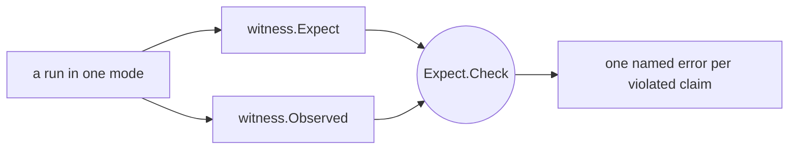

# How the layer is judged

A green test can be true for the wrong reason. A persistence suite passes when a broken composition
routes every call around the layer; a stream test reports a collapse ratio when its generator never
produces the shape a defect needs; a recovery test proves little when the fault was staged before the
write it protects was acknowledged. So a test here must show, beyond the end state, that the
mechanism participated, that the experiment could have exposed a difference, and that the failure
fell in the interval the claim is about.

Every suite runs with nothing installed: no cluster, container, port, cgo or build tag. Both seams
have a real in-process implementation (`wal/memwal`, and `cold/memcold`, Temporal's SQL persistence
over an in-memory SQLite), so no suite judges storage that outlives the process
([chapter 15](15-the-limits-of-the-evidence.md)). No package outside `internal/verify/` may import it
in a non-test file ([chapter 03](03-components.md#the-tree-has-two-halves)).

## The levels of evidence

| Level | Question | Typical evidence | What it still cannot prove |
|---|---|---|---|
| behavioural result | did the caller or cold store end in the expected state? | the rows a drain left in `memcold`, a store double's recorded batches, a merged page's contents | that the WAL path participated |
| mechanism witness | did the intended append, held read, merge or drain actually occur? | `cycle.Totals`, wrapper counts, captured emissions | that a server composes the same path |
| composition | does a Temporal server, built the production way, actually reach the layer and complete work over it? | four services in one process, a workflow through the SDK, and a witness saying the layer saw it | that the storage underneath survives anything |
| failure history | was an acknowledged call preserved across a staged fault, with nothing invented? | a journal of calls and outcomes, read back against the log and the watermark | failures nobody stages |

The last column is why no level makes the others redundant. The third level is
`internal/verify/e2e`. Of the fourth only [the call record](#the-call-record) is here: the judge and
the harness that kills processes belong to a deployment, since a kill tests nothing when both
backends die with the process.

## The log contract suite

`waltest.RunContractSuite(t, log)` turns the five guarantees of
[`wal.Log`](04-contracts.md#the-five-guarantees) into checks. It runs twenty-one cases against one
`wal.Log` value:

| what it holds | the cases |
|---|---|
| order and readback | `AppendsComeBackInOrder`, `ReadFromAnyPosition`, `APageEndsAtItsLimitAndNotAtAByteBudget`, `ShardsAreIndependent` |
| gap-freedom | `GapIsRefused`, `DuplicateSeqnoIsAlreadyWritten`, `AppendBelowATrimIsRefused` |
| trim | `TrimRemovesUpToAndNothingElse`, `TrimOfALogWithNothingInIt`, `TrimRunsBesideAppends` |
| fencing | `AppendNeedsAFenceAtItsEpoch`, `FenceCutsOffLowerEpochs`, `FenceAtALowerEpochIsRefused`, `FenceAtTheSameEpochIsIdempotent`, `FencedOutranksAMissingPredecessor`, `EpochGrowsWithoutChangingOwner`, `TwoWritersContendForOneShard`, `ZeroEpochIsRefused` |
| what every method owes its context | `ACancelledContextChangesNothing` |
| the obligations that belong to no one backend | `PayloadsAreNobodyElsesMemory`, `ArgumentsTheContractRefuses` |

The package takes a `wal.Log` and a `*testing.T` and names no implementation, `memwal` included, so
a deployment runs it against its own log and it cannot special-case a backend. `waltest.Faulty`
wraps a log so that a chosen call fails, `Once` or `Always`; a caller above the log stages a failing
append with it, which is why `memwal` has no knobs or injection points.

### Obligations no single backend can see

The last row is what makes this a contract rather than a test of `memwal`.
`PayloadsAreNobodyElsesMemory` checks ownership both ways: overwriting an appended slice must not
change the entry read back, and writing into a payload the log handed out must change neither the
log nor the other entries of that read. `ArgumentsTheContractRefuses` pins what the log must refuse
rather than interpret: a nil payload, a seqno below `wal.FirstSeqno`, a read of zero entries, a read
with a negative limit. A read starting below `wal.FirstSeqno` is clamped instead, since that is
where a caller wanting the whole log begins.

### Concurrent trims, large pages, refusal order

Every method is safe for concurrent use: `TwoWritersContendForOneShard` drives that for fencing and
`TrimRunsBesideAppends` for trim. The trimmer runs on its own goroutine beside the cycle's loop, so a
slow trim cannot stop a shard from acking, and a trim racing appends is the only shape a deployment
trims in; the other three trim cases run over a quiescent log. Staging in `memwal` a trim built from
a snapshot taken before a yield turns this case alone red: the entry acked last is gone.

A whole-log reader stops when `ReadFrom` returns fewer than `limit` entries, so a backend that also
pages by response size ends the read early. `APageEndsAtItsLimitAndNotAtAByteBudget` appends 24
entries of 256 KiB (reachable, since the tail is bounded at 8 MiB as well as in entries) and
requires all 24 in one page, over a 4 MB message; a staged 4 MB response budget turns this case alone
red. A backend whose budget exceeds 4 MB passes and can still cut a real tail short, so replay
confirms the end of the log with a one-entry read and halts the shard on what it finds
([chapter 06](06-shard-lifecycle.md#the-end-of-the-tail-is-confirmed-not-inferred)).

`FencedOutranksAMissingPredecessor` puts an ex-owner's append two seqnos above the tail, where both
`wal.ErrGap` and `wal.ErrFenced` apply, and requires `wal.ErrFenced`: `wal.ErrGap` means "retry once
the predecessor lands", and for a writer that has lost the shard it never will.

### What the contract suite cannot see

`RunContractSuite` drives one `wal.Log` value in one process: a displaced owner is refused by the
same object its successor just fenced, and every case reads back through it. So a backend whose
`Fence` keeps the epoch only in memory passes every fencing case (guarantee 2), and one whose
`Append` acks into memory that never leaves the process passes all 21 (guarantee 3, the one the
library rests on). A green suite says the log's logic is right, and nothing about whether entries or
fence reached storage.

`waltest.CheckReopen` covers half of that gap without a second process. Given a way of opening a log,
it fences, appends a short run, closes, reopens, and asks whether all the entries are there, whether a
fence below the owning epoch is refused, and whether the log continues at the next seqno. It is a
function, not a suite case, since `memwal` cannot be reopened. `memwal`'s tests prove it against
three backend shapes:

* a `Backend` handed back twice (storage that outlived the value), which must pass;
* a fresh `Backend` per open (appends that never left the process), which must fail;
* a `Backend` behind `waltest.Unfenced` (entries persist, the epoch lives only in this process),
  which must fail. `Unfenced` fences the log below at whatever epoch an append carries, so the
  fencing cases refuse it too: an instrument, not a log.

A fence racing a displaced owner's append, two writers sharing no memory, stays the author's own test.

The second blind spot is time. Guarantee 5 says `ReadFrom` returns every acked entry no trim has
removed, so a retention policy, table TTL or compaction that drops old records violates it. A log
that deletes entries after an hour passes every millisecond-long case, then loses an acked entry the
first time a tail outlives the policy, and that entry has no second copy: it is in the log because
the cold store does not hold it.

`waltest.CheckRetention` appends a short run, waits out a window the caller names, and requires every
entry still there with the same seqnos, payloads and order, and the log still appendable above them.
It is a function too, since it costs its window in wall-clock time, and a pass covers only that
window, so shorten the backend's policy to fit (a two-minute TTL on staging, a two-minute check).
`TestTheRetentionCheckIsNotVacuous` proves it at 20 ms: green against `memwal`, red against
`waltest.Expiring`, whose entries age out the way a retention window, TTL or compaction looks from
above.

## The cold store's suites are Temporal's

`wal.Log` is this library's invention, so the library owes it a suite. A cold store's obligations to
a server are Temporal's to state, in four suites exported from
`go.temporal.io/server/common/persistence/tests`: `NewShardSuite`, `NewExecutionMutableStateSuite`,
`NewExecutionMutableStateTaskSuite` and `NewHistoryEventsSuite`. `cold/memcold` runs all four
unmodified in `conformance_test.go`, 75 subtests, one fresh store per suite, and passes without
answering a call itself: its execution store is upstream's SQL persistence embedded whole
([chapter 04](04-contracts.md#the-implementation-shipped-at-this-seam)).

Upstream has no name for the folded window's transaction, so those suites cannot judge `Apply`.
`cold/memcold/apply_test.go` holds 23 tests of its ordering, the refusals that must happen before it
opens, the attribution a condition failure carries, and the rollback of requests that already ran,
each proved by staging the defect that makes it red; beside them sit tests of `Watermark` and the
versioned current-row read. `isolation_test.go` checks that two stores share no rows and that the
store reached through the abstract factory is the database reached directly; a staged fixed database
name reddens both while the conformance suites, blind to cross-store bleed, stay green.
`internal/verify/acceptance`, below, is the volume half of judging `Apply`.

Nothing here judges somebody else's `cold.Applier`, and this seam has no exported suite. A deployment
writing one gets the four obligations in [`cold`'s package doc](../../cold/cold.go), `memcold` as the
worked example, and its own store's suites.

## The acceptance: one stream through the fold

Folding's risk is not a named scenario failing: two ordinary mutations can interact in an unusual
order and leave a merged request that looks plausible and differs in one field.
`internal/verify/acceptance` answers that with volume. `TestAcceptanceFoldNoCluster` drives a
generated stream of 100,000 mutations (`WAL_ACCEPTANCE_MUTATIONS` changes it) through the codec and a
real `fold.Accumulator` with a configured window of 1,024, inside fold's refusal recovery, the way a
cycle drives it; refusal drains cut windows to about 90 mutations on average
([chapter 14](14-where-the-defaults-came-from.md)). It asserts, in order of importance:

* Every mutation landed in exactly one window: `FoldedIn` equals the stream length, so nothing was
  dropped, double-counted or lost to a refusal that did not recover.
* The stream contained what it was configured to contain (chains, both snapshot barriers,
  continue-as-new, buffered batches and their clears, tombstones, workflow-id reuse, sub-key deletes,
  tasks in all four categories), or the run is a volume test of creates.
* The windows collapsed (a fold ratio above 1.5) and the refusal path ran, exercising the
  drain-and-retry contract every consumer of `fold` implements.

### The control

| ratio | what it is | where it comes from |
|---|---|---|
| stream ratio | workflow mutations over distinct workflows, the upper bound on what fold *could* merge | `mutgen.Report.CollapseRatio` |
| fold ratio | mutations folded in over merged requests out, what fold *did* merge | `foldrun.Run.CollapseRatio` |

The 1.5 is the fold ratio, which alone could be a property of the generator's defaults. So a control
run at `WorkflowReuse = 0`, over an unbounded workflow key space and a tenth of the volume, must have
a stream ratio of exactly 1.00, and the headline stream ratio must be strictly greater: the ratio
moves with the knob.

The generator, `internal/verify/mutgen`, is deterministic: the same config and seed produce the same
mutations byte for byte, so a red run reproduces from the seed, and its code may use no clocks,
unseeded UUIDs, map iteration or protobuf maps.

### The witness

An *intercept run* is one where the wrapper routes store calls through the layer, in sync or windowed
mode ([chapter 01](01-overview.md#what-mode-names-here)). A passthrough composition keeps it green
too, so it ends in a *witness* over the layer's own counters: the run states what it was supposed to
be (`witness.Expect`), hands over what its instruments saw (`witness.Observed`), and `Expect.Check`
judges the pair.

```mermaid
graph LR
  R["a run in one mode"] --> E["witness.Expect"]
  R --> O["witness.Observed"]
  E --> CK(("Expect.Check"))
  O --> CK
  CK --> V["one named error per violated claim"]
```

`Observed.Totals`, a `cycle.Totals`, is required. `Observed.Store` (the wrapper's traffic counters)
and `Observed.Emitted` (captured metric emissions) are optional, because a live server's are not
reachable from the test process; a nil instrument skips the claims that read it. A red run says
which half of the layer went missing. `Expect.Check` is a pure function, so a table test judges it:
a bug in the witness would hide exactly the silent passes it exists to catch.

The central claims invert between the modes: sync mode drains inside every write, so its accumulator
is empty at every call boundary, while a window holds between calls. Each claim is made in both
directions, because a windowed run reporting sync mode's numbers is sync mode. The claim's name
prefixes its error:

| what the witness reads | under `Sync` | under `Windowed` |
|---|---|---|
| `ReadsHeld` — reads that crossed a workflow the window was holding | must be zero (W18) | must be non-zero (W23) |
| `TailEntries` — acked entries still unresolved at the end | must be zero (W19) | must be non-zero (W24) |
| `TaskReadsMerged` — task pages that carried a task out of the window | must be zero (W20) | must be non-zero (W25) |
| `DroppedTasks` — tasks a folded range took out of a window | not claimed | must be non-zero (W26) |
| `wal_drained_mutations` — mutations per committed drain | not claimed | at least one drain carried more than one (W32) |

A windowed claim runs only when the run drove its traffic: W24 when `Expect.TailHeld` says the run
meant to end holding a tail, W26 when the run completes task ranges and a drain committed (an
uncommitted drain's entries are folded again at replay), W32 when emissions were captured.

The denominators `Reads` and `TaskReads` count reads routed through the layer, not hits (a hit-only
counter reads zero on an idle cluster and a miswired layer alike); `ReadsHeld` and `TaskReadsMerged`
are the subsets the window had something for.

Under a window, `wal_answered_condition_failures` must be zero (W33): every condition is decided
before the append by the authority in [`../../fold/check.go`](../../fold/check.go), so a non-zero
value means the check let one through, or a drain answered a batch whose caller had already been told
it succeeded. Sync mode acks before the condition is verified, so its refusals are found at the drain
and attributed to the one caller a window of one holds. W22 and W30 assert that, gated on
`Expect.ConditionFailures`: a sync run that writes no failing condition makes neither claim, so check
this before believing a green sync witness.

`TestTheExpectMustStateAWindow` and `TestTheEmptyLayerIsAssertedNotAssumed` state the failure the
module exists for, and `TestEachClaimHasADefectOnlyItCatches` proves each claim
([house rule 2](#2-a-new-guard-is-proved-by-breaking-it)).

### Both seams real

The fold acceptance's drain callback discards each batch. `TestBothSeamsRealNoServer` executes them
against the schema, row layouts and condition failures upstream wrote: one `cycle.Manager` at
`cycle.Defaults()` between `wal/memwal` and `cold/memcold`, the shard taken by moving the database's
own `rangeID` so the drain's epoch CAS is real, and 6,000 generated mutations over 32 hot workflows
through `Manager.Write`, the call the wrapper makes. The window is the shipped 256; at a window of one
the run would stay green with the fold path deleted.

The cycle drains into a *ledger*: an applier that passes each batch to `memcold.Apply` and works out
from the batch alone (never from the store, which would agree with itself) what the database must
then hold: the `db_record_version` each request leaves on each run row, which run rows a tombstone
removed, and which run each current row names. The test asserts every such row through the store's
reads, and also that:

* the store's watermark is the last drain's and equals the last seqno acked;
* the log's lower end moved during the run, so a trim reached it;
* the log's upper end is still the last entry acked, so trims took entries off the bottom only.

One invariant cannot be checked at the end: the log's lower end never passes the watermark, so every
entry the cold store has not applied is still in the log. By the end everything has drained, so an
end-of-run check stays green with a trim staged 1,000 seqnos ahead of the watermark. The run samples
it every 64 mutations instead (lower end first; the watermark only rises, so a drain between the
reads only makes the check stricter), and every trim passes a guard that reads the committed
watermark before the delete and fails the run on a trim past it. A sample may find the log empty,
which is legal only when the cold store holds every seqno acked.

`TestAShardThatLosesItsEpochMidRun` checks the cold-store half of invariant
[I4](02-concepts-and-invariants.md#the-invariants) (a drain commits only under the epoch that owns
the shard). After 2,000 mutations another owner moves the rangeID in the database, which is all an
acquire is from underneath. The log is left unfenced on purpose, since a fenced log would halt the
cycle at the append ([that fence](#two-live-owners-and-the-two-fences) is tested below), so the loss
is discovered inside the drain's own transaction with a window of acknowledged mutations riding on
it. Afterwards, for I4 and [I2](02-concepts-and-invariants.md#the-invariants):

* the write path answers a `*persistence.ShardOwnershipLostError`;
* the cycle is in `StateHaltedLost`;
* the database matches the ledger's snapshot from before the loss, with no run only the refused
  drain would have written;
* the watermark is the last committed drain's;
* the log holds every seqno up to the last one acked.

### The fold against not folding

A ledger agrees with the fold by construction, so it cannot state the layer's real claim: a window
of 256 leaves the database Temporal's own write path would leave, one mutation at a time.

`TestFoldingChangesNothingButTheNumberOfTransactions`, the *oracle*, drives one seed into two real
databases, once at the shipped window and once at `Mutations: 1`, where nothing is ever merged. It
compares, whole and blobs included, every run row over the union of both ledgers' keys, every
workflow's current row, and the task IDs in each of the four categories' queues, paged out in key
order. The arms must differ in transactions and nothing else: 6,000 mutations commit 77 transactions
folded and 6,000 sequential, and leave 519 identical run rows and 32 identical current rows.

Staging a defect in the merge's upsert-after-delete resolution (dropping the line that takes a
re-upserted key back out of the delete set) reddens this run and the recovery run on a named row,
but not `TestBothSeamsRealNoServer`, whose ledger agrees with the database about the wrong answer.
The mirror-image blind spot: a defect both arms share (the codec, a request's encoding, an assertion
neither arm makes) cancels out, and belongs to the codec guards and the condition authority.

### Recovery: the same stream, a different set of windows

Every run above ends in a shutdown drain from memory, so none shows a successor turning logged
entries back into rows. `TestARecoveredShardHoldsWhatAnUninterruptedOneDoes` drives one seed twice:
through one cycle, and through six, superseding the cycle without draining every thousand mutations
by moving the rangeID, which is all the layer can observe of a process that died. The successor
finds the lost window's entries at replay or nowhere.

The two databases are compared with each other, every run row and current row whole, because a
ledger has no entry for a mutation the second run dropped. The watermark must stand at the stream's
length, `Replayed` must be non-zero (or the crashes cost nothing), and `Dropped` must be zero, since
no entry of a windowed stream is provisional (droppable at replay,
[chapter 02](02-concepts-and-invariants.md#conditions)). Since the runs cut one stream into
different windows, a merge rule that depends on where a window ends (keeping the head's
`NextEventID` rather than the delta's) turns the run red on one named row; a replay that starts one
entry above the watermark turns it red at the crash boundary.

There every crash falls between two writes.
`TestACrashOnTopOfADrainNobodyCouldReadRecoversEitherWay` covers the one state in which entries above
the watermark may already be rows: a drain whose applier reports an error nothing can classify, whose
resolving watermark read fails once (a read that answers settles it on the spot), and whose owner is
then superseded. The successor cannot tell whether that transaction committed, so the same replay
code must skip the entries it applied and apply the rest. The entries replayed must be exactly the
acked seqnos above the watermark, 204 where the transaction never ran and 1 where it committed, and
both databases must match the uninterrupted run. A staged `resolve` that treats a failed watermark
read as a commit turns the uncommitted case red on a `db_record_version` mismatch. The stall's
arithmetic is unit-tested in `cycle`; this run checks its consequence in the database.

Neither run kills anything or crashes inside an append: an entry that may or may not be durable is
`wal/waltest`'s subject.

### Two live owners and the two fences

Above, ownership changes through one `cycle.Manager`, whose `ShardAcquired` stops the old cycle, so
neither fence against a predecessor is tested. A real node that lost its lease is not told: its
cycle stays alive with a window and running timers, and finds out by acting. Here two nodes are two
`cycle.Manager`s over one log and one store, since owners interact only through those.
`TestASyncWriterIsNotToldItSucceededByAnotherNodesWatermark` parks one node inside its applier, lets
the other take the shard, replay the parked entry and drain over it, and requires that the first
node's caller is not told it succeeded: the watermark a drain reads back must be owner-scoped.
`acceptance_handover_test.go` sends a fenced owner's batch to the database, in the three cases that
shape has.

Each fence stops one thing such a node can still do. The log's fence stops appends, and it is in
place before the `rangeID` moves
([the order `UpdateShard` imposes](06-shard-lifecycle.md#what-managershardacquired-does-with-the-epoch-it-is-handed)),
so the old owner's write is refused while the database still names it owner. The cold store's epoch
CAS stops drains, which need no append and no caller: a shutdown drain and the age timer fire on
their own.

`TestTheLogFenceStopsAnOwnerBeforeTheDatabaseChangesHands`: the successor fences the log and takes
the `rangeID`; the predecessor, holding a tail, writes. Then:

* the write is refused as a `ShardOwnershipLostError`, translated from `wal.ErrFenced`, which the
  history service does not recognise and would answer with a background re-acquire instead of a
  shutdown;
* the cycle is in `StateHaltedLost`, the watermark has not moved and the log has not grown;
* the successor replays exactly the entries between the watermark and the last ack.

`TestTheShutdownDrainOfALostShardCommitsNothing` combines them: 2,000 mutations, a handover in the
real order, 500 more through the successor (which replays the predecessor's window), and only then
the predecessor shuts down and drains the window it held all along. The watermark must not move, no
row may go back to that window's versions, and the database must match an uninterrupted owner's. A
stale window of run rows is refused by the epoch and by every `db_record_version` in it, so deleting
the epoch check leaves this run green.

`TestAStaleRangeCompletionCannotTakeTheSuccessorsTasks` isolates the epoch check, and judges the
store, not the layer. The predecessor acks one range completion that nobody drains; the successor
replays it and commits three tasks inside its range; then the predecessor shuts down. With the epoch
check deleted from `cold/memcold`, its drain commits and those three rows are gone by name:
`[120, 150, 180]` against nothing. A range completion is a category and two keys, with no version a
second owner could have moved, so for task work the epoch is the only refusal in the transaction:
the third obligation in [`cold`](../../cold/cold.go)'s doc. The run guards only this repository's
store (a deployment's is [judged by nothing here](#the-cold-stores-suites-are-temporals)), but
`cold/memcold` sits under every other run in this package, so a defect in its fence would weaken all
of them without reddening one.

The same stale drain carries a watermark below the successor's. That would lose no row (an owner
reading it re-applies entries whose assertions have moved on, or meets the gap a trim left, and
halts), but it would leave a shard only a person can recover, which the strict equality in
`Watermarker`'s contract prevents.

## A server, in this process

`internal/verify/e2e` builds a Temporal server the production way (a custom datastore named in
`Persistence.DataStores`, the layer's factory handed to `temporal.WithCustomDataStoreFactory`),
starts frontend, history, matching and worker in the test process, and runs a workflow with an
activity through the SDK. Ports come from the OS; the databases are `memcold`'s plus one for
visibility.

A server whose layer fell out of the path completes the workflow just as fast, so two arms both
compose a layer and differ only in the value the server is handed:

* `TestAWorkflowRunsThroughTheLayer` states `witness.Windowed`, shards acquired, mutable state,
  history tasks, merged task reads, and the mutation kinds such a workflow must produce (a create and
  updates). It requires that mutations were acked, a drain committed, the watermark moved, history
  tasks were written, and the shards' watermarks are readable from the database, so a claimed drain
  over an empty store cannot pass.
* `TestAWorkflowRunsWithTheLayerOutOfThePath` is the control: the same store behind the wrapper with
  nothing in its options, and `witness.NoLayer` over the layer it composed but did not install, so
  it goes red if the passthrough arm still had a layer in it. No shard's watermark may be in the
  database.

One workflow is nowhere near 256 mutations or 256 KiB, so its drains come from the five-second age
trigger; staging `Age = time.Hour` turns the run red with acked mutations and none applied, so the
drains came from the policy, not from shutdown. The intercept arm does not claim `Ranges` (a queue
completed a task range): a queue checkpoints on a 30-second timer per queue per shard, so a workflow
this short completes none. Nothing is killed and one workflow on four shards is not load, so this
suite makes no durability, crash-recovery or performance claim.

## The call record

The last level of evidence, that nothing acked was lost and nothing applied was invented while nodes
were killed, has no instrument here. What is here is half of a killing run's input:
`internal/verify/checker`, the record a driver writes of the calls it made, which judges nothing.

### Two lines per call

The record writes two fsynced lines per call, the first before the store is touched and the second
once it has answered, so a call ends in one of three classes:

* `Acked`: its mutation is in the log;
* `Refused`: the store gave a definite answer, which never means the mutation is absent: a drain's
  error reaches a caller whose own entry is already durable, with the same type as a refusal before
  the append ([chapter 01](01-overview.md#one-write-and-the-interval-it-opens));
* `Unknown`: interrupted, timed out or ambiguous, including a kill between the two lines; nothing is
  promised either way.

Recording only the outcome would make every killed call look like one never issued while its entry
sits in the log unaccounted for, and an in-memory record would die with the process and lose the one
call the run turns on. `TestTheCallIsDurableBeforeTheStoreIsTouched`, in `internal/verify/drive`,
pins that ordering; `TestACallWithNoOutcomeIsTheThirdClass`, in `checker`, pins the class it creates.

`NewRecord` takes a node name and an incarnation: line ids are per process, so a node restarted onto
the same path numbers its second run from 1 and the two runs' calls would collide. An incarnation of
0 appended to a record that already holds a run is refused.

### What a judge must do

Break either constraint and the judge is green for the wrong reason.

It may not import the layer: an assertion compiled into the layer sees what the layer believes and
dies with it under `kill -9`. It reads the log through `wal.Log`'s contract, the watermark through
the seam the cycle uses, and the cold store through the deployment's own reader.

It observes repeatedly and remembers, rather than looking once at the end. A cycle trims to the
watermark with no safety lag, so however long the run, the surviving log holds about 4096 entries at
the shipped defaults, `TrimEvery × Mutations` plus the unsettled tail
([chapter 14](14-where-the-defaults-came-from.md#the-trim-cadence-16-drains-or-60-seconds) has the
conditions), and *applied ⊆ logged* is sound only over a log never trimmed underneath it. So the run
must push both trim triggers, `TrimEvery` and `TrimAfter`, out of reach, over a log that reports no
storage pressure (pressure forces a trim outside both), and then check the promise.

## The guards

A *guard* observes the external consequence of a property too narrow for the large suites and too
important to infer from code shape, and earns its place only when breaking the property turns it red
while the ordinary suites could stay green: a guard is red on a reverted decision, a unit test on
broken code. The wiring guard is purely the former; the three backpressure tests drive a real cycle,
so a failure there is the layer's until the composition is ruled out.

Invariant [I10](02-concepts-and-invariants.md#the-invariants) says exceeding the tail bound is
degradation, not loss: what was refused is not in the log, and what was acked is. Its first half is
that the refusal reaches the history service as the right error, so three tests hold the refusal's
concrete type across a boundary neither the cycle nor the wrapper sees whole:

* `TestTheBackpressureRefusalIsDefinitelyNotCommitted` asserts the value is a
  `*serviceerror.ResourceExhausted` by type assertion, not `errors.As`, because that is what the
  history shard's `handleWriteErrorLocked` switches on. It then wraps the value in one
  `fmt.Errorf("…: %w", err)` and shows `persistence.OperationPossiblySucceeded` flip from false to
  true: a single `%w` turns a bounded degradation into the background shard re-acquire backpressure
  exists to prevent.
* `TestTheWrapperCarriesTheRefusalOut` requires the wrapper to return the identical value, not a copy
  or a wrapping.
* `TestTheRefusalSurvivesTheWholeInterceptPath` makes the same claim through `waltz.Compose` with a
  real log and wrapper, covering the two joins the others miss: the cycle's answer becoming the
  registry's, and the registry's becoming the store's.

The other half of I10 is `TestATrippedTailLosesNothing` in `cycle`. It holds the applier, accepts
writes until the tail bound trips, collects the refusals, then releases. The window commits,
`CommitSeqno − AppliedSeqno` and `TailBytes` return to zero, and the refused writes, retried at the
versions they were refused at, succeed. Reading the log as an acquiring owner would returns exactly
the acknowledged set, in order, gap-free, with none of the refused ones. A caller told "no" still
holds the row it read, which separates a bound from a conflict and makes `ResourceExhausted` the
right answer.

`cycle_wiring_test.go` asserts at compile time that `cycle.Manager` satisfies each of the wrapper's
faces separately (`ShardObserver`, `ShardWriter`, `ShardReader`, `ShardLayer`, `MetricsSink`), so a
`Manager` that loses one fails by that face's name: the cheapest guard with the widest blast radius,
since a layer that does not satisfy `ShardLayer` cannot be installed.

### Guards a deployment must build

Two more guards are about a deployment's own storage (its engine's transaction counters, its
applier's statement text), where neither `memwal`'s map nor `memcold`'s SQL can stand in, so a
deployment builds them rather than assuming it inherited them.

* An append-immediacy guard for [I9](02-concepts-and-invariants.md#the-invariants) (an append is one
  immediate write over adjacent keys of the log's own storage). Drive ordinary appends through the
  front door, read the engine's transaction counters out of band, and assert that the appends were
  immediate transactions (ones the store settles without a distributed coordinator), that nothing
  else was touched, and that the log's tables have no secondary structure. An index, a changefeed or
  one read of another table makes every append pay for a coordinator tick, and nothing above the
  layer notices: the append still succeeds, later.
* A drain query-shape guard: the drain's statement is a function of assertion kinds and delete
  families, never of how many mutations the window folded. A statement that grows with the batch
  passes until a real store compiling one hits its timeout, which shows up as a halted shard rather
  than a slow write
  ([chapter 13](13-designs-that-were-rejected.md#a-folded-window-as-a-concatenation-of-the-stores-own-queries)
  has the form it replaced).

## The doubles, and why each is a package

Six packages under `internal/verify/` exist so suites do not each write their own: two copies that
disagree leave a rule green and unjudged.

* `internal/verify/coldtest`: an in-memory cold store that records what a drain carried and which
  watermark it moved, and interprets nothing. One value satisfies both `cold.Applier` and
  `cold.Watermarker`, because drains that land somewhere the watermark does not read back make a
  shard replay what it applied, unnoticed. A suite that needs a drain to land uses `cold/memcold`;
  one that needs it to fail in a chosen way uses `coldtest.Refusing(err)`.
* `internal/verify/basetest`: the pre-window rows in memory, the second adapter at the
  `baserow.Store` seam. A missing row comes back as a `NotFound` error, which `baserow.Rows` turns
  into a nil row, and every delegated assertion is stated over that nil, so a double that answered
  absence its own way would leave them all unjudged.
* `internal/verify/coldtasks`: a model, not a stub, of the store below the merged task read, since a
  one-page fake would leave every pagination rule in `fold/taskpage.go` untested. It pages immediate
  tasks by task id and scheduled ones by `(fireTime, taskID)`, bounded above by fire time alone;
  `coldtasks_test.go` states both, to compare a real store's queries against.
* `internal/verify/mutbuild`: one well-formed mutation of a given shape, ids named rather than drawn.
  Every shape with a validator runs through Temporal's before it is returned, and an invalid fixture
  panics, since it is a bug in the test.
* `internal/verify/drive` and `internal/verify/foldrun`: the writing half of a run (one mutation into
  one store call, plus `Stream` for a generated stream through the codec) and the loop that folds it
  window by window. The drain is a callback, and `foldrun` counts only what every caller counts the
  same way; what a "tombstone" is, for instance, is the caller's (the acceptance run counts
  `KindDelete` alone).

## The words for what judges the layer

These three terms name instruments outside the layer; the layer's own vocabulary is in
[chapter 02](02-concepts-and-invariants.md#the-glossary-in-reading-order).

**Checker.** The judge of a run under faults, over the record a driver writes; not in this repository
([above](#the-call-record)).
*Not to be confused with:* an assertion inside the layer, which sees what the layer believes.

**Witness.** The claims a run makes over the layer's own counters, so it can fail a run every suite
passed ([above](#the-witness)).
*Not to be confused with:* a smoke check or sanity assert, both weaker than the suite.

**Oracle.** One stream applied folded and unfolded, the two stores required to end identical
([above](#the-fold-against-not-folding)). Fold's rules have no specification beyond the code, so it
is the only instrument that can say a fold rule is right, and a deployment wanting that for its own
store builds the same comparison
([chapter 13](13-designs-that-were-rejected.md#judging-it) has the cheaper instruments not to build).

## The map of `internal/verify/`

*Instruments* measure or drive and assert nothing; *judgements* say yes or no. Two judgements live
outside `internal/verify/`.

| package | kind | what it is |
|---|---|---|
| `internal/verify/mutgen` | instrument | the generator, [above](#the-control) |
| `internal/verify/mutbuild`, `drive`, `foldrun` | instrument | builders and the loop, [below](#the-doubles-and-why-each-is-a-package) |
| `internal/verify/coldtest`, `basetest`, `coldtasks` | instrument | the doubles, [below](#the-doubles-and-why-each-is-a-package) |
| `internal/verify/checker` | instrument | the call record, [above](#the-call-record) |
| `internal/verify/witness` | instrument | the run's claims, [above](#the-witness) |
| `internal/verify/acceptance` | judgement | the fold, [above](#the-acceptance-one-stream-through-the-fold) |
| `internal/verify/e2e` | judgement | a server, [above](#a-server-in-this-process) |
| `internal/verify/guard` | judgement | reverted decisions, [above](#the-guards) |
| `cold/memcold` | judgement | the shipped store, [above](#the-cold-stores-suites-are-temporals) |
| `wal/waltest` | judgement | any `wal.Log`, [above](#the-log-contract-suite) |

## The two house rules

Both are absolute.

### 1. A test asserts behaviour, never shape

No `_test.go` here parses Go source (`go/ast`, `go/parser`, `go/token`), asserts over the import
graph ("package X may not import Y", by `go list`, `go/build` or reading directories), or parses
documentation and build files. Such a test is green while claiming something it has not checked: a
scan over source matches only the shapes its author thought of, so a one-line alias walks past it,
and it matches identifiers by name, so a rename the compiler follows leaves it matching nothing, and
passing.

Instead, in this order:

1. Make it a compile error. Unexported fields of an exported type in a package of its own is the only
   option that cannot be walked past; it is why `tailstate` and `window` are packages.
2. Write a linter as a linter, on `golang.org/x/tools/go/analysis`, tested with `analysistest`. A
   check this repository decided against is switched off in `.golangci.yml` with the reason, not
   silenced one `//nolint` at a time.
3. State it in prose beside the code it is about, and stop. A rule nobody can violate without reading
   the file they are editing is carried by a sentence in that file.

### 2. A new guard is proved by breaking it

A new test that passes proves neither that the mechanism works nor that the test would notice if it
stopped. So stage the defect, show the guard go red, and record the number or the failure with the
change. `TestEachClaimHasADefectOnlyItCatches` makes this permanent for the witness: it builds a
defect per claim and requires that exactly one claim catches it. Only a claim no defect reaches
exclusively, not one that looks redundant, leaves the table.

## What is not claimed

The collected boundaries, including that nothing here survives its own process, are in
[chapter 15](15-the-limits-of-the-evidence.md). Two belong to the suites above, beside the contract
suite's [blind spots](#what-the-contract-suite-cannot-see):

* No suite hands a shard to an owner in a second process: two owners are two `cycle.Manager`s in one
  ([above](#two-live-owners-and-the-two-fences)). That would add a real transport hanging, a real
  kill and storage that outlives either, and its judge is not here.
* Nothing judges the fold against a store a deployment would run: both arms of the oracle are
  `memcold`, so nothing says how a window lands on another store's schema, row layouts and condition
  failures.

## Summary

Three of four levels of evidence (behavioural result, mechanism witness, composition) are in this
repository. The log seam has an exported 21-case contract suite a deployment runs against its own
log, with `CheckReopen` and `CheckRetention` for what one in-process value cannot see. The cold seam
is judged by Temporal's four suites over `memcold` plus 23 `Apply` tests; nothing judges a
deployment's applier.

The acceptance drives generated streams through the fold, into a real database, against the
unfolded path, across six owners and across two live owners. The witness keeps every intercept run
honest about whether the layer took part, and `e2e` shows a real server composes over the layer.
The call record classes every call as acked, refused or unknown, and a refusal never proves absence.
The guards pin decisions a refactor could revert, the doubles keep shared rules in one place, and
the house rules keep tests about behaviour and prove every new guard by breaking it. None of it
covers storage that outlives the process: chapters 12–15 say why it was built this way and what it
does not prove.

## Where this lives in the code

* [`../../wal/waltest/waltest.go`](../../wal/waltest/waltest.go) — `RunContractSuite` and its
  twenty-one cases; [`fault.go`](../../wal/waltest/fault.go) is `Faulty`;
  [`reopen.go`](../../wal/waltest/reopen.go) and [`retention.go`](../../wal/waltest/retention.go) are
  `CheckReopen` and `CheckRetention`, with `Unfenced` and `Expiring`;
  [`truncating.go`](../../wal/waltest/truncating.go) is `Truncating`, the log whose short page a
  whole-log reader must not take for the end.
* [`../../internal/verify/acceptance/acceptance_fold_test.go`](../../internal/verify/acceptance/acceptance_fold_test.go)
  — the stream and the knob control;
  [`acceptance_seams_test.go`](../../internal/verify/acceptance/acceptance_seams_test.go) — both real
  seams and the ledger, over the log in
  [`trimguard_test.go`](../../internal/verify/acceptance/trimguard_test.go);
  [`acceptance_recovery_test.go`](../../internal/verify/acceptance/acceptance_recovery_test.go) — the
  six-owner runs;
  [`acceptance_handover_test.go`](../../internal/verify/acceptance/acceptance_handover_test.go) and
  [`acceptance_twonode_test.go`](../../internal/verify/acceptance/acceptance_twonode_test.go) — two
  live owners and the two fences;
  [`acceptance_oracle_test.go`](../../internal/verify/acceptance/acceptance_oracle_test.go) — the
  oracle.
* [`../../cold/memcold/conformance_test.go`](../../cold/memcold/conformance_test.go) — Temporal's
  four suites; [`apply_test.go`](../../cold/memcold/apply_test.go),
  [`current_test.go`](../../cold/memcold/current_test.go) and
  [`isolation_test.go`](../../cold/memcold/isolation_test.go) — what they do not cover.
* [`../../internal/verify/e2e/server.go`](../../internal/verify/e2e/server.go) — the server's
  configuration, readiness probe and log gate; [`e2e_test.go`](../../internal/verify/e2e/e2e_test.go)
  — the two arms.
* [`../../internal/verify/mutgen/mutgen.go`](../../internal/verify/mutgen/mutgen.go) — the generator,
  its determinism rules and the report a stream makes about itself;
  [`corpus.go`](../../internal/verify/mutgen/corpus.go) materialises a stream with that report.
* [`../../internal/verify/witness/witness.go`](../../internal/verify/witness/witness.go) — `Expect`,
  `Observed` and the claim tables.
* [`../../internal/verify/checker/record.go`](../../internal/verify/checker/record.go) — the record's
  file format and incarnation; [`checker.go`](../../internal/verify/checker/checker.go) — the outcome
  classes.
* [`../../internal/verify/guard/doc.go`](../../internal/verify/guard/doc.go) — what a guard is and what it may not be.
* [`../../internal/verify/coldtest/coldtest.go`](../../internal/verify/coldtest/coldtest.go),
  [`../../internal/verify/basetest/basetest.go`](../../internal/verify/basetest/basetest.go) and
  [`../../internal/verify/coldtasks/coldtasks.go`](../../internal/verify/coldtasks/coldtasks.go) — the three doubles.
* [`../../internal/verify/foldrun/foldrun.go`](../../internal/verify/foldrun/foldrun.go) and
  [`../../internal/verify/drive/drive.go`](../../internal/verify/drive/drive.go) — the loop and the writing half.
* [`../../patches/README.md`](../../patches/README.md) — the strongest evidence a composition can
  produce, upstream's own functional suites against a real store, and the fifteen-line patch that
  makes it reachable.
