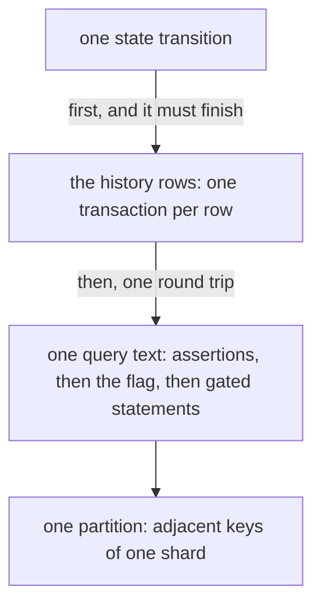
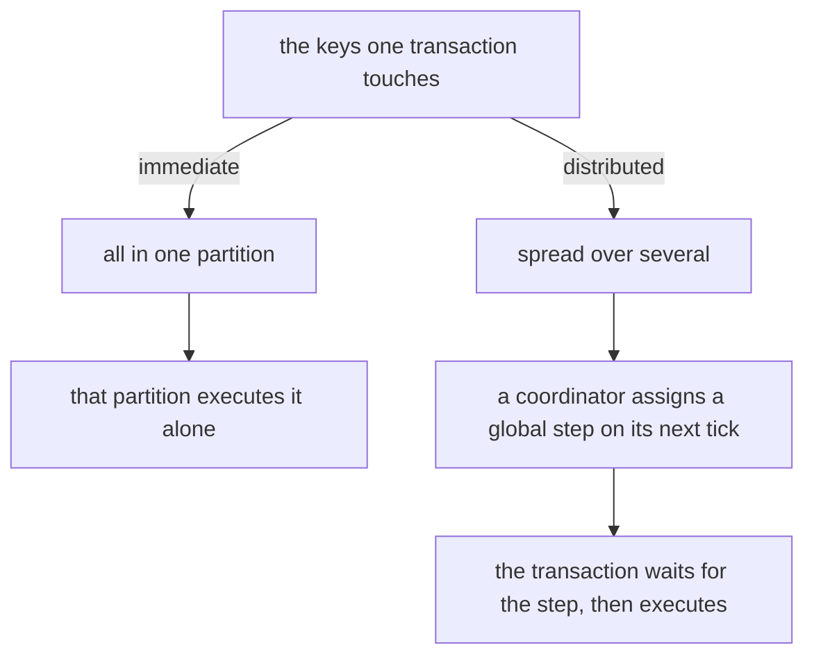

# What one write cost before the layer

Every claim this handbook makes about what the layer saves is a claim relative to something: one
Temporal state transition against a persistence implementation with no layer in front of it. This
chapter is that something, in full — the rows one transition touches, the query that touches them,
what a database does with that query, and the two conclusions the whole design follows from. It is
for the reader changing the layer, and for the operator deciding what the layer can and cannot be
expected to improve.

**The worked example is one store, named as such.** waltz is not a persistence implementation — the
one store in the tree exists so the layer can be exercised, and it is not what anybody deploys — so
this chapter would be empty without a concrete incumbent to describe. What follows is the store the design was
built and measured against in the research prototype: an implementation of Temporal's persistence API
over a distributed SQL database with immediate single-partition transactions. Every structural claim
below is that store's rather than a law about stores. What generalises is stated as such, and the two
conclusions at the end are the ones that do.

## One transaction holds the whole world of a shard

The store puts the shard row, the current-execution rows, the run rows, the elements of a run's
mutable state and the deferred-work rows **into one table**, and tells them apart by a discriminator
encoded in the key rather than in a column. The key is composite and its first component is the shard
number:

```text
PRIMARY KEY (shard_id, namespace_id, workflow_id, run_id,
             task_category_id, task_visibility_ts, task_id,
             event_type, event_id, event_name)
```

Each row kind is a pattern of NULLs and empty strings in that key: the shard row is
`(shard_id, "", "", "", NULL, …)`, a current-execution row is `(shard_id, ns, wf, "", …)`, a run's own
row is `(shard_id, ns, wf, run, NULL, …)`, a state item or buffered event carries the same four
columns plus an `event_type`/`event_id`/`event_name` triple, and a task row is
`(shard_id, NULL, NULL, NULL, category, visibility_ts, task_id, …)`. Two dozen columns serve all five;
which of them are non-NULL is what the kind means. One place in the code owns that spelling,
deliberately — a second copy of it is how two halves of one store come to disagree about a row they
both wrote.

NULL sorts below the empty string, which sorts below any real identifier, so the key order lays one
shard out like this:

```text
shard 42
│
├─ deferred work                    no namespace, no workflow, no run in the key
│    immediate category   by task id:    1001  1002  1004  1007 …
│    scheduled category   by fire time:  09:30 09:31 10:00 10:15 …
│
├─ the shard row                    range_id lives here
│
├─ workflow alpha
│    ├─ current row                 which run is current, and its last_write_version
│    ├─ run R1 · the run's row      db_record_version lives here
│    ├─ run R1 · activity 5, timer 7, child 2, a buffered event
│    └─ run R2 · the run's row
│
└─ workflow beta
     └─ …
```

One transition of workflow alpha touches its current row, its run's row and that run's state items —
**which lie consecutively** — plus the task rows it creates or completes, which lie in another block
of the same shard. It touches nothing outside the shard, and nothing in the picture belongs to two
shards at once.

Everything below follows from that adjacency. **This is the generalising part**: a store worth
putting waltz in front of is one where a transition is already cheap, and the usual reason it is
cheap is that everything one transition touches sits next to everything else it touches.

## The single-partition assumption

The rows one transition touches are adjacent, so the key range a conditional write covers sits in one
place in the key space. One partition is what makes the write *immediate* — a transaction one
partition settles alone, with no coordinator round — and the rest of this chapter turns on the word,
so [the section that defines it](#immediate-and-distributed-transactions) is worth a look now if it
is not already familiar. The step from adjacency to "one partition" is **an assumption, not a
measurement**, and it is stated here rather than buried because everything downstream stands on it:

> There are many shards, and one shard's data is small against the size at which the table splits
> itself. The whole touched key range therefore lives in one partition.

The schema gives that assumption its scale rather than proving it. The example store creates the
table pre-split eight ways over the shard-id space, with auto-partitioning by size enabled at four
gigabytes and auto-partitioning by load enabled beside it — so four gigabytes is the point past which
a split is certain rather than the only thing that causes one, and a hot partition can be split well
below it. A deployment's shards divide across those partitions, and each partition holds many whole
shards.

Nothing in the query enforces this. A shard whose range grows across a split boundary — or a split
that lands mid-range — leaves exactly the same code paying for coordination, silently.
[Chapter 04](04-contracts.md#what-the-contract-does-not-say-what-an-append-costs) says the same thing
about the log, where the same property is stated as invariant I9 and is likewise unguarded from
inside this library. Below the layer, in the store's own table, the property is nobody's here at all.

## The write is one query, not a transaction of many statements

The naive expectation is that a transition touching state, deferred work and a current row must be
several statements in a multi-round-trip transaction, and that the saving is in collapsing them. That
expectation is wrong, and the shape of the real write is why.

The store builds **one query text and sends it once**, with begin, statements and commit riding in
the same request. The text has three parts, in this order:

1. **the assertions, as named expressions.** A transition registers up to three kinds: that the
   shard's `range_id` is still the caller's; that the current row is absent, or names this run, or
   does not name that one, or is a completed run at a given `last_write_version`; and that the run's
   row is absent, or is at a given `db_record_version`. Each kind emits two named expressions — one
   reading the rows under the asserted keys, one turning each read into a `(present, correct, …)`
   row.
2. **one flag derived from all of them.** A single number saying how many assertions did not hold,
   counted over the union of every kind's rows.
3. **the mutating statements, every one of them gated.** Each upsert and delete the transition
   carries begins with a test that the number is zero.

That is where **"all or nothing" comes from: not a rollback, but statements that did not run.** A
transition whose condition failed still *commits* — it simply wrote nothing, and readback statements
in the same query hand back every assertion the transition carried, each row tagged with the index of
the assertion it belongs to. A rejected write is a witness rather than a failure, and the store
reports the first failing assertion by walking the assertions in registration order once every kind's
readback is in.

Three things follow that the layer above depends on, and every one of them is a design decision a
different store might have made differently:

* **registration order decides which failure is reported**, which is why the drain registers the
  epoch check first and absence assertions last
  ([chapter 05](05-write-path.md#2-the-drain-itself));
* **an assertion that held must still be walked**, because a transaction carrying more than one
  workflow will have some that hold and some that do not — the obligation stated at length in
  [chapter 05](05-write-path.md#2-the-drain-itself), and the one this store originally got wrong;
* **a refused drain and a drain that never ran leave byte-identical state**, which is why the only
  witness to whether an ambiguous drain committed is the watermark it would have moved
  ([chapter 05](05-write-path.md#7-failed-drain--the-outcome-could-not-be-read)). Against a store
  that *aborts* on a failed assertion the recovery rule is unchanged and merely easier.

The text is also a function of *which* assertion kinds and statement families a transition uses,
never of how many rows it asserts about or writes. Assertions travel as list parameters per kind, so
a transaction asserting one row and one asserting two hundred emit identical text, and the server
compiles it once. That property is not an accident of the incumbent — it is the property the layer's
own drain has to keep when it puts many workflows into one such query, which is why
[chapter 11](11-verification.md#the-guards) names a guard over the drain's statement as one a
deployment should rebuild rather than a comment about it.

## Event history rides separately, and first

Event history is not in that table at all. New event batches go to their own table, keyed
`(tree_id, branch_id, node_id, txn_id)`, with a tree row per branch — a different table, a different
key space, and a different partitioning.

They are also written **before** the conditional write, not inside it.
`CreateWorkflowExecution` and `UpdateWorkflowExecution` each begin by calling the history store, and
only then the mutable-state store. In the example store that first stage is **one transaction per
row**, all of them started in parallel and all of them finished before the conditional write is sent.

A batch of events is one row. So:

* a transition carrying **one** event batch is **two** transactions — one history write, then the
  conditional write;
* a transition carrying several batches is one per batch, plus the conditional write;
* a transition that starts a new history branch pays an extra tree row, and so an extra transaction,
  on top of that.

The layer keeps that stage where it was, and changes its shape.
`wrapper.ExecutionStore.appendEvents` walks the mutation's `EventSlots()` and puts each batch down
through the base store's `AppendHistoryNodes` — one call per batch, in order rather than in parallel
— before the mutation is handed to the cycle, because a mutation acked with its events unwritten
would point at history nodes nobody wrote. What that costs the design is the last section but one of
this chapter.



## Completed ranges are deleted by two different predicates

Deferred work is not deleted row by row. A queue completes a range, and the store turns that range
into one delete — but **the predicate differs by category type**, and one of the two does not mention
row numbers at all:

* an **immediate** category ranges on `task_id`, with the visibility timestamp null;
* a **scheduled** category ranges on the visibility timestamp — a half-open interval of *fire times*
  — and the keys' task ids do not appear in the query.

So a scheduled range delete names an interval of time and removes whatever fell inside it. A caller
that meant something narrower than a whole fire-time interval has no way to say so, and the
persistence interface does not offer one. This is Temporal's shape rather than one store's: the
request carries a fire-time interval because that is what a scheduled queue's checkpoint *is*.

While writes and deletions happen in the caller's own order, the difference is invisible: the rows
that existed when the delete ran are the rows the caller had already written. It stops being
invisible the moment something holds a write back past a delete — which is exactly what a window
does, and is why the layer resolves ranges against the window instead of modelling a per-category ack
level. That consequence is invariant I7
([chapter 02](02-concepts-and-invariants.md#i7-at-more-length) states it,
[chapter 07](07-read-path.md#5-invariant-i7--the-tasks-a-drain-does-not-write) owns its read side);
this chapter only records where the shape came from.

## Immediate and distributed transactions

The two costs such a transaction can have are not two amounts of data work. They are:

* **immediate** — every key the transaction touches lives in one partition, so that partition
  executes it alone, with nobody to agree with;
* **distributed** — the transaction needs more than one partition, so it is *planned*: a coordinator
  assigns it a global step common to all its participants, and does so on its own next tick rather
  than on demand. The transaction waits for that step before it can begin executing.



**The cost of coordination is the wait and the extra round, not extra work with the data.** The same
statements over the same rows cost more because they were planned, and a system that has quietly
crossed from one class to the other keeps working and keeps returning success. That invisibility is
the whole reason invariant I9 exists as a claim about the log, and the reason it can only be checked
from outside, by reading the storage engine's own counters — nothing above the seam can see the
difference.

## The invariant of the incumbent system

Stated plainly, and carrying the assumption above:

> **One state transition is one conditional immediate transaction over adjacent keys of one table,
> plus the history write before it.**

This claim has no number. It is a property of the system the layer sits in front of, not of the
layer, and [chapter 02](02-concepts-and-invariants.md#the-invariants-without-a-number) is where that
distinction is drawn: I1–I11 name what the layer's own code and suites enforce, and nothing here is
enforceable by them.

## What follows: a log on the same database buys no latency

The consequence is not about the layer's construction. It is about the log underneath it.

An append to a durable log **built on the same database** costs about what the write it replaces
costs: the same class of call, to the same cluster, over adjacent keys of one table — the same
sentence, twice. Such a log therefore **cannot acknowledge faster than the store**, and buys nothing
in latency. The research prototype's first backend was exactly that log, and it is why
[chapter 01](01-overview.md#what-one-write-costs-with-and-without-the-layer) states outright that
latency is not a goal.

The reasoning is a property of *that* log, not of logs. A log whose acknowledgement costs a single
network hop to the nearest quorum would buy latency, and putting one under the layer would change
what a caller waits for without changing anything above it. That is precisely why `wal.Log` is a
contract and why the one implementation shipped here is a log in memory rather than a candidate: the
seam exists so the class of backend can change without an invariant moving, and choosing the backend
is the deployment's decision rather than this library's.
[Chapter 04](04-contracts.md#what-the-contract-does-not-say-what-an-append-costs) is where that
argument is made in the contract's own terms.

## Therefore: fewer writes, and the ceiling on the win

The other win does not depend on the log's nature at all: **fewer writes to the cold store**.

One workflow's run row is rewritten once per transition, and the task rows written beside it are
often deleted by a queue shortly after they appear, sometimes almost at once. Neither of those is a
cost of *one* write — each is a cost of the *number* of writes, and neither has anything to do with
how fast the log acknowledges. That is what the rest of the layer is about.

**Event history is the ceiling on it.** History rows never enter the log and were never amplified in
the first place: they are append-only, one row per batch, written before the mutation that refers to
them. So a workflow with hundreds of transitions still pays hundreds of history writes by the old
path however wide the window is, and the fraction of a deployment's write volume that is event
history is a fraction the layer cannot address. A window tuned against total write volume is being
tuned against a number part of which it cannot move.

## What this picture does not give

**No latency headroom on a log built from the same database.** The formulation "the log will
acknowledge sooner" is about a log of a different nature; on that configuration it is false.

**No measurement.** This chapter says what a write is *made of*. It does not say how many rows one
costs, or by what factor the layer makes them fewer. **That measurement does not exist** — every
number above is a schema constant or a count of statements, and
[chapter 15](15-the-limits-of-the-evidence.md#write-amplification-against-the-incumbent-has-never-been-measured)
is where it is listed among the ones deliberately not made.

## Where this lives in the code

Nothing in this chapter is code in this repository, which is the point of the chapter: it describes
the thing waltz sits in front of. Three files here are where the description touches the layer.

* [`../../wrapper/execution_store.go`](../../wrapper/execution_store.go) — `appendEvents`, which
  keeps the history stage exactly where it was when the layer is present.
* [`../../wal/wal.go`](../../wal/wal.go) — the contract that exists so the log's class can
  change, and the guarantees it does *not* make about cost.
* [`../../apply/failure.go`](../../apply/failure.go) — the five outcome classes, which are the shape
  of "a refused drain and a drain that never ran leave identical state" as a caller has to handle it.
