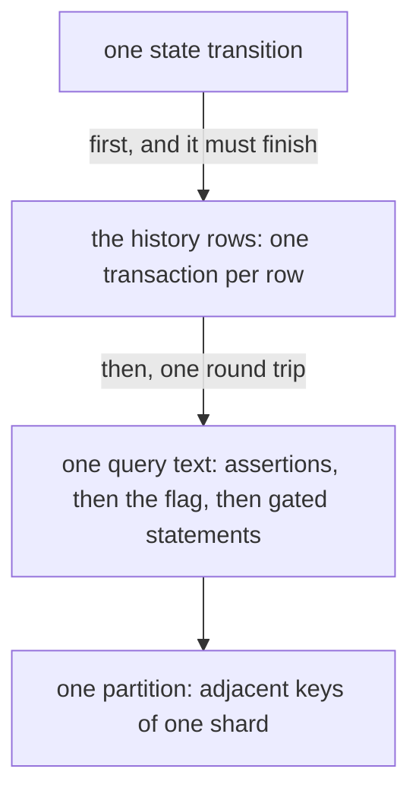

# What one write cost before the layer

Every saving this book claims is measured against one Temporal state transition written with no
layer in front of the store. This chapter takes that write apart: its rows, its query, and what the
database does with it. Two conclusions follow: a log on the same database buys no latency, and the
layer's win is fewer writes, capped by event history.

waltz's own cold store, `cold/memcold`, runs in process and nobody deploys it, so the baseline is
the store the research prototype was measured against: Temporal's persistence API over a
distributed SQL database. Every structural claim below is that store's. Two things generalise: the
adjacency of one transition's rows, and the two conclusions.

## Immediate and distributed transactions

In a distributed SQL database of this kind, a transaction falls into one of two cost classes, and
only where its keys lie decides which, not how much data it touches:

* An *immediate transaction* touches keys in one partition only, which executes it alone.
* A *distributed transaction* spans partitions, so it is planned. A coordinator assigns it a global
  step common to all its participants, on the coordinator's next tick rather than on demand, and
  the transaction waits for that step before it executes.

Coordination costs the wait and the extra round, not extra work on the data. A write whose
transaction crosses from immediate to distributed still succeeds, only slower, and nothing above the
seam (the log contract the layer is built on) can tell the two classes apart. So invariant I9, that one append costs one immediate write
([chapter 04](04-contracts.md#what-the-contract-does-not-say-what-an-append-costs)), is a claim
about the log rather than a check, testable only from outside, by reading the storage engine's own
transaction counters.

## One transaction holds the whole world of a shard

The store keeps five kinds of row in one table: the shard row, the current-execution rows, the run
rows, the elements of a run's mutable state, and the deferred-work rows (the history tasks a
transition leaves for a queue to pick up). No column names the kind. The primary key encodes it,
and its first component is the shard number:

```text
PRIMARY KEY (shard_id, namespace_id, workflow_id, run_id,
             task_category_id, task_visibility_ts, task_id,
             event_type, event_id, event_name)
```

Each row kind is a pattern of NULLs and empty strings in that key:

* the shard row is `(shard_id, "", "", "", NULL, …)`;
* a current-execution row is `(shard_id, ns, wf, "", …)`;
* a run's own row is `(shard_id, ns, wf, run, NULL, …)`;
* a state item or buffered event has the same four columns plus an
  `event_type`/`event_id`/`event_name` triple;
* a task row is `(shard_id, NULL, NULL, NULL, category, visibility_ts, task_id, …)`.

Two dozen columns serve all five kinds, and one place in the store's code builds these keys, so no
two writers can disagree about a row. NULL sorts below the empty string, which sorts below any
real identifier, so the key order lays one shard out like this:

```text
shard 42
│
├─ deferred work                    no namespace, no workflow, no run in the key
│    immediate category   by task id:    1001  1002  1004  1007 …
│    scheduled category   by fire time:  09:30 09:31 10:00 10:15 …
│
├─ the shard row                    range_id lives here
│
├─ workflow alpha
│    ├─ current row                 which run is current, and its last_write_version
│    ├─ run R1 · the run's row      db_record_version lives here
│    ├─ run R1 · activity 5, timer 7, child 2, a buffered event
│    └─ run R2 · the run's row
│
└─ workflow beta
     └─ …
```

One transition of workflow alpha touches its current row, its run's row and that run's state items,
which lie consecutively, plus the task rows it creates or completes, in another block of the same
shard. It touches nothing outside the shard, and no row belongs to two shards. A store worth
putting waltz in front of already makes a transition cheap, usually because one part of the storage
can settle the whole write alone.

## The single-partition assumption

Adjacent keys put a transition in one place in the key space. The step from there to "one
partition", and so to an immediate transaction, is an assumption, not a measurement:

> There are many shards, and one shard's data is small against the size at which the table splits
> itself. The whole touched key range therefore lives in one partition.

The prototype's store pre-splits the table eight ways over the shard-id space, so each partition
holds many whole shards. Auto-partitioning can split further, by size at four gigabytes and by
load, so a hot partition can split well below four gigabytes.

Nothing in the query enforces the assumption. If a shard's rows grow across a split boundary, or a
split lands inside one shard's range, the same query text still succeeds but costs a coordinator
round. The property belongs to whoever operates the store; the log has the same hole one level up,
invariant I9, which nothing inside this library can check either.

## The write is one query, not a transaction of many statements

A transition touches several kinds of row in one round trip: the store sends one query text with
begin, statements and commit in the same request, leaving no round trip for a layer to collapse.
The text has three parts, in this order:

1. The assertions, as named expressions. A transition registers up to three kinds:
   * the shard's `range_id` is still the caller's;
   * the current row is absent, or names a given run, or names anything but a given run, or is a
     completed run at a given `last_write_version`;
   * the run's row is absent, or is at a given `db_record_version`.

   Each kind emits two named expressions: one reads the rows under the asserted keys, the other
   turns each read into a `(present, correct, …)` row.
2. One flag derived from all of them: the number of assertions that did not hold, counted over the
   union of every kind's rows.
3. The mutating statements, each gated. Every upsert and delete begins with a test that the flag
   is zero.

So "all or nothing" comes from statements that did not run, not from a rollback: a failed
transition still commits, writing nothing. Readback statements in the same query return every
assertion, each row tagged with its assertion's index, and the store reports the first that did not
hold in registration order. A rejected write arrives with the evidence for its rejection.

The layer depends on three consequences of this design:

* Statement order decides which failure is reported, so the shard's `range_id` check goes first.
  The range deletes go ahead of the task inserts for a different reason
  ([chapter 05](05-write-path.md#2-the-drain-itself) has both).
* An assertion that held must return, not crash, because a transaction carrying several workflows
  holds some assertions and fails others.
* A drain the store rejected and a drain that never ran leave byte-identical state, as does a
  rejected drain on a store that aborts instead of committing a no-op, so the recovery rule is the
  same for both kinds of store: the only witness to whether an ambiguous drain committed is the
  watermark, the highest seqno the cold store has applied, which that drain would
  have moved ([chapter 05](05-write-path.md#7-failed-drain--the-outcome-could-not-be-read)).

The query text depends on which assertion kinds and statement families a transition uses, never on
how many rows it touches: assertions travel as list parameters per kind, so one row or two hundred
emit identical text, compiled once. The layer's drain must keep this when it folds many workflows
into one query: a text that grew with the batch would compile slowly enough to time out. Nothing here can watch that for an unseen store, so
[chapter 11](11-verification.md#the-guards) describes a drain query-shape guard for a deployment to
build against its own applier.

## Event history rides separately, and first

Event batches go to their own table, keyed `(tree_id, branch_id, node_id, txn_id)`, with a tree
row per branch: a different key space and partitioning, written before the conditional write, not
inside it. `CreateWorkflowExecution` and `UpdateWorkflowExecution` each call the history store
first, then the mutable-state store. In the
prototype's store that first stage is one transaction per row, all started in parallel and all
finished before the conditional write is sent. A batch of events is one row, so a transition pays
one transaction per event batch plus the conditional write, and one more for the tree row if it
starts a new history branch.

Figure: the history stage must finish before the conditional write's single round trip begins.


```mermaid
graph TD
  T["one state transition"]
  H["the history rows: one transaction per row"]
  Q["one query text: assertions, then the flag, then gated statements"]
  D["one partition: adjacent keys of one shard"]
  T -->|"first, and it must finish"| H
  H -->|"then, one round trip"| Q
  Q --> D
```

The cold store, not a setting, decides how the layer handles this stage.
Over a store that does not declare `cold.HistoryApplier`, `wrapper.ExecutionStore.appendEvents`
walks the mutation's `EventSlots()` and calls the base store's `AppendHistoryNodes` once per batch, in order rather than in parallel,
before the mutation reaches the cycle, so an acknowledged mutation never points at unwritten
history. Over a store that declares it, the batches ride the log record, so one append makes the
transition and its events durable together, and the drain writes a window's history rows no later
than the state naming them ([chapter 04](04-contracts.md#wrapperexecutionstore--28-methods)).
Either way the row count is the same, because history is append-only and nothing folds it. That
makes history [the ceiling on the win](#therefore-fewer-writes-and-the-ceiling-on-the-win).

## Completed ranges are deleted by two different predicates

A queue does not delete deferred work row by row. It completes a range, which the store turns into
one delete whose predicate depends on the category type:

* an *immediate category* ranges on `task_id`, with the visibility timestamp null;
* a *scheduled category* ranges on the visibility timestamp, a half-open interval of fire times,
  and the task ids do not appear in the query.

`RangeCompleteHistoryTasks` carries a category and the interval's two endpoints, and for a
scheduled category the store reads only their fire times; a caller cannot ask for anything
narrower. This is Temporal's shape, not one store's: a scheduled queue's checkpoint is a fire time.
The single-key delete, `CompleteHistoryTask`, is not used by any queue; its one caller is the
history handler's `RemoveTask`, behind the admin API of that name, and the layer refuses it
([chapter 04](04-contracts.md#wrapperexecutionstore--28-methods)).

While writes and deletes reach the store in the caller's order, the rows inside the interval are
the rows the caller already wrote, so deleting the whole interval rather than named rows costs
nothing. A window holds writes back past
deletes and breaks that, so the layer resolves ranges against the window instead of modelling a
per-category ack level. That rule is invariant I7
([chapter 02](02-concepts-and-invariants.md#i7-at-more-length) states it,
[chapter 07](07-read-path.md#5-invariant-i7--the-tasks-a-drain-does-not-write) owns its read side).

## The invariant of the incumbent system

Under the single-partition assumption:

> One state transition is one conditional immediate transaction over adjacent keys of one table,
> plus the history write before it.

It is not one of I1–I11, which are claims about the layer and its seams; it is a property of what
the layer sits in front of ([chapter 02](02-concepts-and-invariants.md#the-invariants-without-a-number)).

## What follows: a log on the same database buys no latency

An append to a durable log on the same database costs one conditional immediate transaction, to the
same cluster, over adjacent keys of one table: the very store write it was meant to beat. It cannot
acknowledge faster than the store, so it buys no latency. The prototype's first backend was that
log, which is why
[chapter 01](01-overview.md#what-one-write-costs-with-and-without-the-layer) says latency is not a
goal.

The argument covers that log, not logs in general. A log whose acknowledgement costs one network hop
to the nearest quorum would buy latency, changing what a caller waits for and nothing above it. So
`wal.Log` is a contract: the class of backend can change without any invariant moving, and which
backend to run is the deployment's decision
([chapter 04](04-contracts.md#what-the-contract-does-not-say-what-an-append-costs)).

## Therefore: fewer writes, and the ceiling on the win

The layer's win, fewer writes to the cold store, does not depend on the log. A run row is rewritten
on every transition, and the task rows written beside it are often deleted by a queue soon after,
sometimes almost at once. Both are costs of the number of writes, which the rest of the layer cuts.

Event history caps that win. History rows were never amplified: they are append-only, one row per
batch, and owed durable no later than the state that refers to them. The window holds them but does
not merge them, so hundreds of event batches cost hundreds of history rows however wide the window
is. Tune the window against the mutable-state writes, not total write volume.

## Summary

The incumbent writes one state transition as one query of assertions, a failure-count flag, and
statements gated on it, over adjacent keys of one shard. Under the single-partition assumption,
which nothing enforces, that is one immediate transaction, after a separate event-history write.

A log on the same database costs the same, so it buys no latency; a cheaper log would, which is why
`wal.Log` is a contract. The win is fewer cold-store writes, capped by event history, which is
never folded. Every number here is a schema constant or a count of statements, not a cost: write
amplification against the incumbent has never been measured
([chapter 15](15-the-limits-of-the-evidence.md#write-amplification-against-the-incumbent-has-never-been-measured)).

## Where this lives in the code

* [`../../wrapper/execution_store.go`](../../wrapper/execution_store.go) — `appendEvents`, which
  keeps the history stage where it was when the cold store does not declare `cold.HistoryApplier`;
  `cold/memcold` declares it, so over the one store here the batches ride the record instead.
* [`../../wal/wal.go`](../../wal/wal.go) — the contract that exists so the log's class can change.
  Read it for what it does not say: no method's documentation mentions what an append costs.
* [`../../apply/failure.go`](../../apply/failure.go) — the five outcome classes a caller branches on
  (`ClassCommitted`, `ClassRefused`, `ClassShardLost`, `ClassInvariantViolated`,
  `ClassUnknownOutcome`). `ClassUnknownOutcome` is that ambiguity as a caller receives it.
