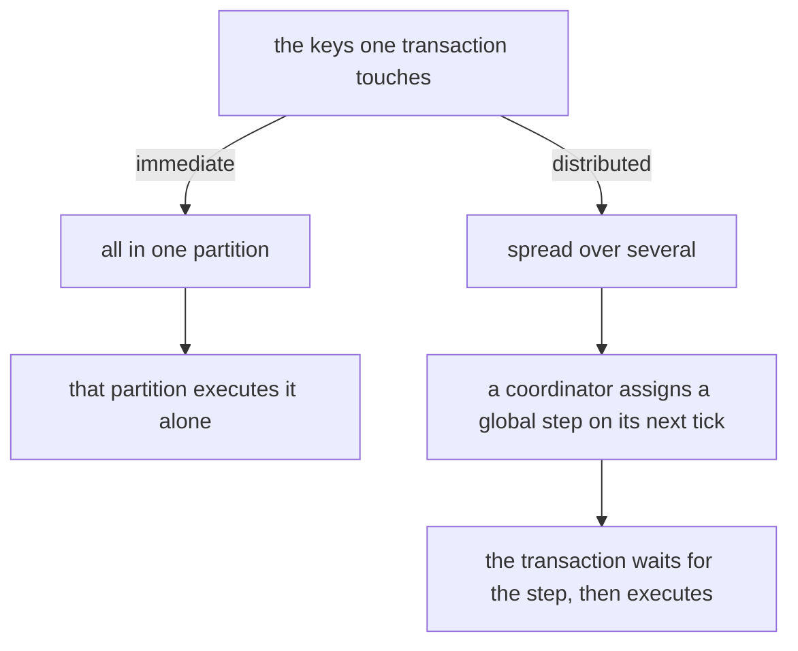
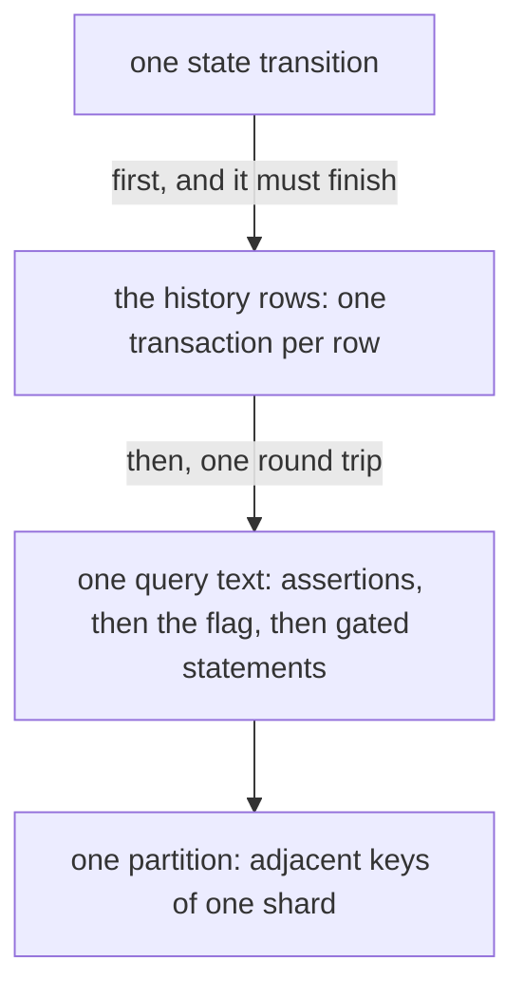

# What one write cost before the layer

Every saving this book claims is measured against one Temporal state transition written with no
layer in front of the store. This chapter describes that write: the rows it touches, the query that
touches them, and what the database does with it. Two conclusions follow, and the design rests on
them: a log on the same database buys no latency, and the layer's win is fewer writes, capped by
event history.

The baseline is one particular store. waltz's own cold store, `cold/memcold`, runs in process and
nobody deploys it, so the incumbent here is the store the research prototype was measured against:
Temporal's persistence API over a distributed SQL database. Every structural claim below is that
store's. Two things generalise: the adjacency of one transition's rows, and the two conclusions.

## Immediate and distributed transactions

In a distributed SQL database of this kind, a transaction falls into one of two cost classes. What
separates them is not how much data it touches:

* An *immediate* transaction touches keys in one partition only, so that partition executes it
  alone, with nobody to agree with.
* A *distributed* transaction needs more than one partition, so it is planned. A coordinator
  assigns it a global step common to all its participants, on the coordinator's next tick rather
  than on demand, and the transaction waits for that step before it executes.

The only thing that decides the class is where the keys lie:


```mermaid
graph TD
  K["the keys one transaction touches"]
  I["all in one partition"]
  M["spread over several"]
  E["that partition executes it alone"]
  P["a coordinator assigns a global step on its next tick"]
  W["the transaction waits for the step, then executes"]
  K -->|"immediate"| I
  K -->|"distributed"| M
  I --> E
  M --> P
  P --> W
```

The cost of coordination is the wait and the extra round, not extra work on the data. The same
statements over the same rows cost more only because they were planned. A system that crosses from
immediate to distributed keeps working and keeps returning success; its writes just take longer.
Nothing above the seam (the log contract the layer is built on) can tell the two classes apart.
That is why invariant I9, that one append costs one immediate write
([chapter 04](04-contracts.md#what-the-contract-does-not-say-what-an-append-costs)), is a claim
about the log rather than a check, and why the only test of it is from outside, by reading the storage
engine's own transaction counters.

## One transaction holds the whole world of a shard

The store puts five kinds of row into one table: the shard row, the current-execution rows, the run
rows, the elements of a run's mutable state, and the deferred-work rows (the history tasks a
transition leaves for a queue to pick up). No column names the kind. The kind is encoded in the
primary key, whose first component is the shard number:

```text
PRIMARY KEY (shard_id, namespace_id, workflow_id, run_id,
             task_category_id, task_visibility_ts, task_id,
             event_type, event_id, event_name)
```

Each row kind is a pattern of NULLs and empty strings in that key:

* the shard row is `(shard_id, "", "", "", NULL, …)`;
* a current-execution row is `(shard_id, ns, wf, "", …)`;
* a run's own row is `(shard_id, ns, wf, run, NULL, …)`;
* a state item or buffered event has the same four columns plus an
  `event_type`/`event_id`/`event_name` triple;
* a task row is `(shard_id, NULL, NULL, NULL, category, visibility_ts, task_id, …)`.

Two dozen columns serve all five kinds. One place in the store's code spells these patterns out,
so two parts of the store cannot build keys differently and disagree about a row they both wrote.

NULL sorts below the empty string, which sorts below any real identifier. So the key order lays one
shard out like this:

```text
shard 42
│
├─ deferred work                    no namespace, no workflow, no run in the key
│    immediate category   by task id:    1001  1002  1004  1007 …
│    scheduled category   by fire time:  09:30 09:31 10:00 10:15 …
│
├─ the shard row                    range_id lives here
│
├─ workflow alpha
│    ├─ current row                 which run is current, and its last_write_version
│    ├─ run R1 · the run's row      db_record_version lives here
│    ├─ run R1 · activity 5, timer 7, child 2, a buffered event
│    └─ run R2 · the run's row
│
└─ workflow beta
     └─ …
```

One transition of workflow alpha touches its current row, its run's row and that run's state items,
which lie consecutively. It also touches the task rows it creates or completes, in another block of
the same shard. It touches nothing outside the shard, and no row belongs to two shards.

This adjacency is the part that generalises. A store worth putting waltz in front of is one where a
transition is already cheap, and the usual reason is that the rows one transition touches lie
together, so one part of the storage can settle the whole write alone.

## The single-partition assumption

Adjacent keys put a transition's key range in one place in the key space. The step from there to
"one partition", and so to an immediate transaction, is an assumption, not a measurement:

> There are many shards, and one shard's data is small against the size at which the table splits
> itself. The whole touched key range therefore lives in one partition.

The schema says at what scale this holds. The prototype's store creates the table pre-split eight
ways over the shard-id space, so each of the eight partitions holds many whole shards. Two
auto-partitioning settings can split further: by size, at four gigabytes, and by load. So four
gigabytes is the point past which a split is certain, but a hot partition can split well below it.

Nothing in the query enforces the assumption. If one shard's rows grow across a split boundary, or
a split lands inside one shard's range, the same code starts paying for coordination. The query
text does not change and the write still succeeds; it just costs a coordinator round. The log has
the same hole one level up, invariant I9, and nothing
inside this library can check it either. For the store's own table, the property belongs to
whoever operates the store.

## The write is one query, not a transaction of many statements

A transition touches several kinds of row, yet it costs one round trip: the store builds one query
text and sends it once, with begin, statements and commit in the same request. There is no round
trip left for a layer to collapse. The text has three parts, in this order:

1. The assertions, as named expressions. A transition registers up to three kinds:
   * the shard's `range_id` is still the caller's;
   * the current row is absent, or names a given run, or names anything but a given run, or is a
     completed run at a given `last_write_version`;
   * the run's row is absent, or is at a given `db_record_version`.

   Each kind emits two named expressions: one reads the rows under the asserted keys, the other
   turns each read into a `(present, correct, …)` row.
2. One flag derived from all of them: the number of assertions that did not hold, counted over the
   union of every kind's rows.
3. The mutating statements, each gated. Every upsert and delete begins with a test that the flag
   is zero.

So "all or nothing" comes from statements that did not run, not from a rollback. A transition whose
condition failed still commits; it just writes nothing. Readback statements in the same query
return every assertion the transition carried, each row tagged with its assertion's index. Once
every readback is in, the store walks the assertions in registration order and reports the first
that did not hold. A rejected write arrives with the evidence for its rejection.

The layer depends on three consequences of this design, each a choice a different store might have
made differently:

* Statement order decides which failure is reported, because the store reports the first failed
  assertion in registration order. That is why the shard's `range_id` check goes first. The range
  deletes go ahead of the task inserts for a different reason
  ([chapter 05](05-write-path.md#2-the-drain-itself)).
* An assertion that held must return, not crash, because a transaction carrying several workflows
  will have some assertions that hold and some that do not
  ([chapter 05](05-write-path.md#2-the-drain-itself)). The prototype's store first got this wrong.
* A drain the store rejected and a drain that never ran leave byte-identical state. The only
  witness to whether an ambiguous drain committed is the watermark, the highest seqno the cold
  store has applied, which that drain would have moved
  ([chapter 05](05-write-path.md#7-failed-drain--the-outcome-could-not-be-read)). A store that
  aborts on a failed assertion instead of committing a no-op leaves the same state, so the recovery
  rule is the same for it.

The query text depends on which assertion kinds and statement families a transition uses, never on
how many rows it asserts about or writes. Assertions travel as list parameters per kind, so a
transaction asserting one row and one asserting two hundred emit identical text, and the server
compiles it once. The layer's own drain must keep this property when it folds many workflows into
one such query: a text that grew with the batch would compile slowly enough on a real store to time
out. Nothing in this tree can watch that for a store it has never seen, so
[chapter 11](11-verification.md#the-guards) describes a drain query-shape guard for a deployment to
build against its own applier.

## Event history rides separately, and first

Event history is not in that table. New event batches go to their own table, keyed
`(tree_id, branch_id, node_id, txn_id)`, with a tree row per branch: a different table, key space
and partitioning.

They are also written before the conditional write, not inside it. `CreateWorkflowExecution` and
`UpdateWorkflowExecution` each call the history store first, then the mutable-state store. In the
prototype's store that first stage is one transaction per row, all started in parallel and all
finished before the conditional write is sent. A batch of events is one row, so:

* a transition with one event batch is two transactions: one history write, then the conditional
  write;
* a transition with several batches is one per batch, plus the conditional write;
* a transition that starts a new history branch pays one more transaction, for the tree row.

So the history write must finish before the single round trip of the conditional write begins:


```mermaid
graph TD
  T["one state transition"]
  H["the history rows: one transaction per row"]
  Q["one query text: assertions, then the flag, then gated statements"]
  D["one partition: adjacent keys of one shard"]
  T -->|"first, and it must finish"| H
  H -->|"then, one round trip"| Q
  Q --> D
```

The layer answers this stage in one of two ways, decided by the cold store rather than a setting.
Over a store that does not declare `cold.HistoryApplier`, `wrapper.ExecutionStore.appendEvents`
writes each batch through the base store's `AppendHistoryNodes`, one call per batch, in order
rather than in parallel, before the mutation reaches the cycle, so an acknowledged mutation never
points at unwritten history. Over a store that declares it, the stage moves off the write path. The
batches ride the log record, so one append makes the transition and its events durable together,
and the drain writes a window's history rows at once, no later than the state naming them
([chapter 04](04-contracts.md#wrapperexecutionstore--28-methods) has both contracts). Either way
the row count is the same, because history is append-only and nothing folds it. That makes history
[the ceiling on the win](#therefore-fewer-writes-and-the-ceiling-on-the-win).

## Completed ranges are deleted by two different predicates

A queue does not delete deferred work row by row. It completes a range, and the store turns that
range into one delete. The predicate depends on the category type:

* an *immediate category* ranges on `task_id`, with the visibility timestamp null;
* a *scheduled category* ranges on the visibility timestamp, a half-open interval of fire times,
  and the task ids do not appear in the query.

So a scheduled range delete names an interval of time and removes whatever falls inside it.
`RangeCompleteHistoryTasks` carries a category and the interval's two endpoints, and for a
scheduled category the store reads only their fire times. A caller cannot ask for anything
narrower. This is Temporal's shape, not one store's: a scheduled queue's checkpoint is a fire time.
The interface also has a single-key delete, `CompleteHistoryTask`, but no queue checkpoints with
it. Its one caller is the history handler's `RemoveTask`, behind the admin API of that name, and
the layer refuses it ([chapter 04](04-contracts.md#wrapperexecutionstore--28-methods) says how).

While writes and deletes reach the store in the caller's order, this breadth costs nothing: the
rows inside the interval are the rows the caller already wrote. The two stop coinciding once
something holds a write back past a delete, which is what a window does. So the layer resolves
ranges against the window instead of modelling a per-category ack level. That rule is invariant I7
([chapter 02](02-concepts-and-invariants.md#i7-at-more-length) states it,
[chapter 07](07-read-path.md#5-invariant-i7--the-tasks-a-drain-does-not-write) owns its read side).

## The invariant of the incumbent system

Stated plainly, and resting on the single-partition assumption:

> One state transition is one conditional immediate transaction over adjacent keys of one table,
> plus the history write before it.

This is not one of the numbered invariants. I1–I11 are claims about the layer and its two seams,
most enforced by its own code and suites. This one is a property of the system the layer sits in
front of, which neither can reach
([chapter 02](02-concepts-and-invariants.md#the-invariants-without-a-number) draws the same line).

## What follows: a log on the same database buys no latency

An append to a durable log built on the same database costs about what the write it replaces costs:
one conditional immediate transaction, to the same cluster, over adjacent keys of one table. That is
the description of the store write it was meant to beat. Such a log cannot acknowledge faster than
the store, so it buys no latency. The prototype's first backend was that log, which is why
[chapter 01](01-overview.md#what-one-write-costs-with-and-without-the-layer) says latency is not a
goal.

The argument covers that log, not logs in general. A log whose acknowledgement costs one network hop
to the nearest quorum would buy latency, changing what a caller waits for and nothing above it. That
is why `wal.Log` is a contract: the class of backend can change without any invariant moving. The one
implementation here, `wal/memwal`, is a log in process memory. It passes the same conformance suite
any backend would, but it dies with the process, so no deployment runs it. Which backend to run is
the deployment's decision, and [chapter 04](04-contracts.md#what-the-contract-does-not-say-what-an-append-costs)
makes the argument in the contract's terms.

## Therefore: fewer writes, and the ceiling on the win

The win the layer does get does not depend on the log at all: fewer writes to the cold store.

One workflow's run row is rewritten on every transition, and the task rows written beside it are
often deleted by a queue soon after, sometimes almost at once. Both are costs of the number of
writes, not of one write, and neither depends on how fast the log acknowledges. The rest of the
layer exists to cut them.

Event history caps that win. History rows were never amplified: they are append-only, one row per
batch, and owed durable no later than the state that refers to them. The window holds them but does
not merge them. A workflow whose transitions carry hundreds of event batches still pays hundreds
of history rows however wide the window is. Whatever fraction of a deployment's write volume is
event history, the layer cannot touch. So tune the window against the mutable-state writes, not
against total write volume.

## Summary

The incumbent store writes one state transition as one query: assertions, a flag counting the ones
that failed, and mutating statements gated on that flag. All of it lands on adjacent keys of one
shard in one table, so under the single-partition assumption it is one immediate transaction, with
the event history written first and separately. Nothing in the query enforces that assumption; a
split inside a shard silently turns the write into a coordinated one.

A log on the same database costs what the store write costs, so it buys no latency; a cheaper log
would, which is why `wal.Log` is a contract. The win that does not depend on the log is fewer
cold-store writes, capped by event history, which is never folded.

This chapter says what a write is made of, not what it costs. Every number in it is a schema
constant or a count of statements. Write amplification against the incumbent has never been
measured ([chapter 15](15-the-limits-of-the-evidence.md#write-amplification-against-the-incumbent-has-never-been-measured)).

## Where this lives in the code

This chapter describes what waltz sits in front of, so little of it is code here. Three files are
where it touches the layer.

* [`../../wrapper/execution_store.go`](../../wrapper/execution_store.go) — `appendEvents`, which
  keeps the history stage where it was when the cold store does not declare `cold.HistoryApplier`;
  `cold/memcold` declares it, so over the one store here the batches ride the record instead.
* [`../../wal/wal.go`](../../wal/wal.go) — the contract that exists so the log's class can change.
  Read it for what it does not say: no method's documentation mentions what an append costs.
* [`../../apply/failure.go`](../../apply/failure.go) — the five outcome classes a caller branches on
  (`ClassCommitted`, `ClassRefused`, `ClassShardLost`, `ClassInvariantViolated`,
  `ClassUnknownOutcome`). `ClassUnknownOutcome` is what "a rejected drain and a drain that never ran
  leave identical state" turns into once a caller has to handle it: there is nothing in the rows to
  read, so the caller reads the watermark.
