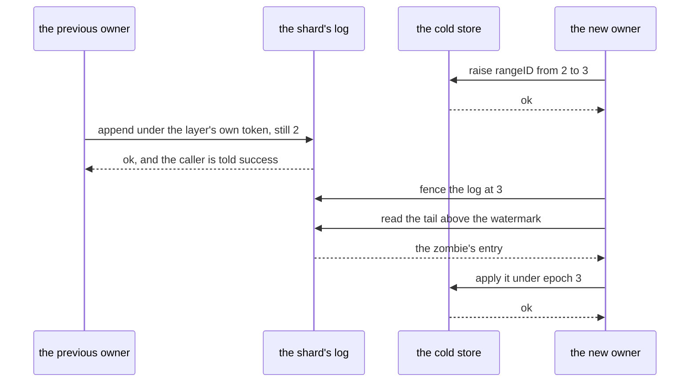
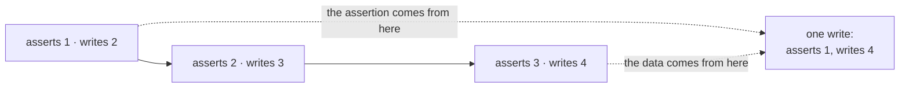
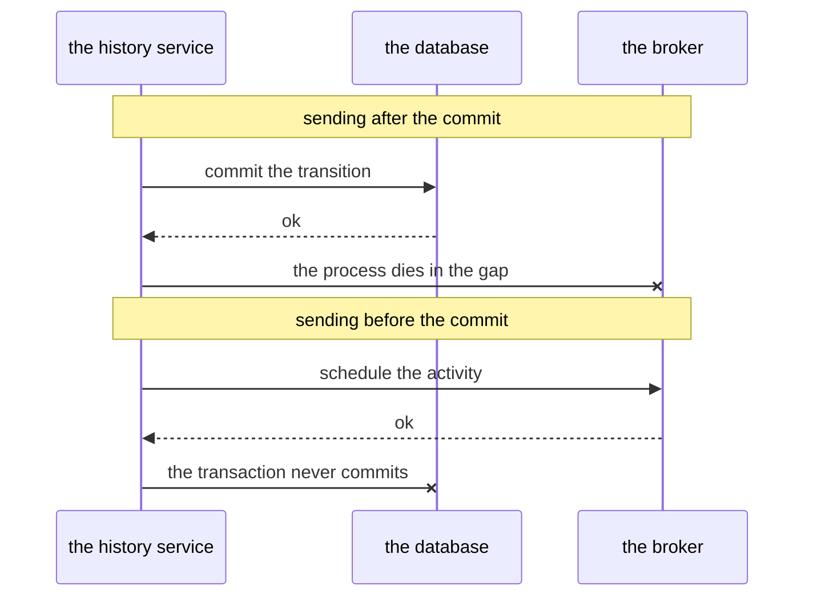

# The designs that were rejected

Most of the shapes in the preceding chapters are the residue of something that was tried and failed.
This chapter carries the failures rather than the survivors. It is for whoever is **changing** the
layer and is about to propose one of these again: each entry states the alternative, the sequence or
the cost that refused it, and which chapter owns what stands in its place.

---

## Ownership

### A lease with a timer

*The alternative: a node takes the shard for a period, renews the lease while it works, and stops
considering itself the owner when the term expires.*

A lease needs the tenant and the landlord to agree about time, and they do not. That is the small
problem. The large one is that **a node that has lost its lease learns nothing about it**. It can be
in a stop-the-world garbage-collection pause, in swap, or on the wrong side of a network partition,
and it comes out of all three in full confidence that it still owns the shard — a confidence that is,
from the inside, indistinguishable from the truth. A lease enforced in the holder's memory against
the holder's clock is enforced by the one party that cannot tell whether it still holds anything.
The old owner staying alive is the common case here, not the exotic one; a node that loses power is
the easy case, because nothing has to be excluded.

So the check cannot live in the node and cannot rest on the node's notion of time. It has to live
where the write lands, and it has to fire at the moment of the write. That one conclusion is the
derivation of everything around it: why the drain registers the epoch assertion first in its
transaction, why the log refuses an append under a superseded epoch instead of telling anybody, and
why the layer never tries to inform a displaced owner of anything.

The consequence to keep is that ownership loss is **discovered, never announced**, and it is
discovered in three places — `wal.ErrFenced` from an append, `apply.ClassShardLost` from a drain,
and `cycle.FencedAway`, the cause a replay carries when the inherited tail holds an entry above this
cycle's own epoch. Everything a node knows about its own ownership is as fresh as its last attempt
to act. A displaced owner that writes nothing is therefore never fenced and needs no fencing: it
holds no lock, delays no successor, and finds out the moment it acts.
[Chapter 06](06-shard-lifecycle.md#1-first-exclude-the-failed-owner) owns the exclusion.

### Two ownership tokens, one for the log and one for the store

*The alternative: fence the log with a token of the layer's own and gate the cold store on Temporal's
`rangeID` — each mechanism correct on its own.*

Two tokens are moved by two writes, so there is always an ordering, and both orderings admit a write
that should not have happened.

*The new owner takes the log first, and has not yet raised the shard counter.* A zombie writing now
is refused by the log and **accepted by the cold store**, whose counter it still holds. A mutation
settles that the log knows nothing about.

*The counter is raised first, and the log is not yet taken.* A zombie appends to the log. It would be
refused at the cold store if it went there directly, which makes this look survivable — and it is
not, because the entry it left is durable. The new owner fences, replays the tail, finds that entry
and faithfully carries it into the cold store under its own name and its own epoch. The zombie's
write is **laundered through the successor's replay**: every check downstream sees a well-formed
entry written by the current owner.

The two orderings differ only in when the damage becomes visible. The conclusion is that protecting
both places separately is not enough: they must obey **one and the same decision** about who owns the
shard. That is invariant I11 — the epoch *is* the rangeID, one token rather than two mechanisms — and
with one token there is nothing to desynchronise and the question has no content.
[Chapter 02](02-concepts-and-invariants.md#the-invariants) states it.

### Fencing only at the cold store

*The alternative: check ownership once, where the data finally settles, and leave the log ungated.*

It is cheaper, and it looks sufficient under the rule "what has not settled does not count": an entry
that never reaches the cold store never happened. It fails because **what is written to the log is no
longer in that category**. The entry is durable, the next owner is obliged to apply it, and by this
layer's commit rule its author has already been told success.

A check at the last line of defence therefore lets through an *acknowledgement that was never
permissible to give*. The cold store can still refuse the row, but by then the caller has gone away
believing the write happened and the successor holds an entry it must apply. The failure is not a
lost row, it is a broken promise — and no later gate can take an acknowledgement back.

That is the same reasoning that makes the append, rather than the drain, the irreversible boundary of
the write path. So the log refuses the zombie at the append and the cold store refuses it again
inside the drain's own transaction; neither check subsumes the other. Invariant I4 is that pair,
[chapter 02](02-concepts-and-invariants.md#the-invariants).

### A batch of entries in one append

*The alternative: `Append` takes several payloads and writes them at consecutive seqnos as one
atomic unit — the shape a group commit would want.*

It is what the contract had, and most implementations keep it without effort: an append is one
transaction, or one statement, or one replicated command, or one mutex-held splice. A log whose unit
of atomicity is *bigger* than one entry can even pay for a partial batch deliberately, by framing
every entry with its batch's bounds so a recovered tail can be rewound off a batch that did not
finish.

Some logs cannot pay for it at all. Where the unit of atomicity is the row — an append-only journal,
for instance — a batch is written as consecutive rows and a fence landing between two of them leaves
a prefix in the log. None of the contract's three refusals can describe that: each of them says the
write is whole one way or the other. Worse than the missing answer is the answer that is there — a
writer that died mid-batch, restarted and replayed it is told `ErrAlreadyWritten`, which the contract
documents as the replay's success signal, and acknowledges seqnos nobody wrote. The two cases are
indistinguishable from the log: "it holds part of your batch" and "you changed your batch" are the
same rows.

Two repairs were built before the batch was removed, and both are worse than removing it. Teaching
the log to answer "your batch was cut" where it now answers `ErrAlreadyWritten` fails the conformance
suite, which pins the opposite for every other implementation and is right to: on an atomic backend a
partial overlap really is a caller changing its batch. Publishing the limit instead — a method on the
contract saying how many entries this backend writes indivisibly — works, and leaves a parameter one
kind of backend refuses, three conformance assertions in two versions apiece, and every caller asking
a question whose answer is one wherever it matters.

What the batch was for is the part worth stating plainly: nothing, yet. The layer's only append is
the apply cycle's, one mutation at a time, and the batch was capacity held for a group commit that
was never built. Amortising an fsync across concurrent writers is still available where it actually
belongs — inside a backend, which is where a database's own group commit already does it — and it
needs no batch at this seam to happen.

### The shard's own writes, deferred into the log

*The alternative: put `UpdateShard` through the log like every other write, so one mechanism carries
everything the layer sees.*

It cannot be built, and the obstacle is not an ordering that could be fixed. An append carries an
epoch and is refused unless the log is fenced at it; the epoch is the rangeID; and the rangeID is set
by the write to the shard row. Logging that write means logging a record whose own precondition that
record is what establishes. **The write would defer the establishment of its own condition** — a
circular dependency, not a trade-off.

The reason usually given is the secondary one: rangeID is also the task-id allocator, and a shard
hands out ids from the block `rangeID` names — the history service's `RangeSizeBits` is 20, so 2^20 =
1,048,576 ids per value — which is why the counter rises without an ownership change and why
uniqueness costs nothing extra. True, and it answers a weaker question than the one somebody asks
when they see three shard calls staying immediate.

The circularity is also why the acquire is necessarily two writes to two places and therefore cannot
be made atomic: the second write is the one the first depends on. `wrapper/shard_store.go`
consequently **observes** `UpdateShard` — it watches the new epoch go past and lets the base store
commit it — and the non-atomicity is paid for by a replay-time check.
[Chapter 06](06-shard-lifecycle.md#2-use-the-ownership-token-temporal-already-has) owns the order.

---

## The window

### A buffer inside the history service

*The alternative: let the history service accumulate transitions in memory and write to the store
less often, with no second durable thing between them.*

Two reasons refuse it, and the second cannot be paid off. First, the server would have to lie. It
considers a write done when the store returns, so an accumulating buffer must either answer success
before durability — losing transitions with the process — or not answer, in which case it has
accumulated nothing. Writing to the store asynchronously and answering at once is the same lie stated
more briefly.

Second, **the server reads its own writes, one call later, across the same interface**. It rebuilds
mutable state, it checks start conditions, and all of it crosses the persistence boundary. A buffer
that does not answer reads breaks the server immediately — not subtly, and not only under load.

The layer pays both prices explicitly. What it accumulates is durable before the caller is answered,
which is what the log is for; and its window answers reads, which is what the overlay and the merged
task page are for. That second obligation is the whole of [chapter 07](07-read-path.md).

### A folded window as a concatenation of the store's own queries

*The alternative: keep the window's mutations as they arrived and replay them, one store request at a
time, inside one transaction.*

The first failure is arithmetic rather than concurrency. A log entry is a whole store request, and
every request shape in the store's vocabulary derives its own condition from the version it is about
to write. Suppose the cold store holds version 1 of a run's row and the window holds three updates
that carried it to version 4. The one write the drain must make has to assert 1 — which is what the
cold store knows — and write 4. Taking the *last* mutation asserts 3 and fails against a store
holding 1. Taking the *first* asserts 1 correctly and writes 2, losing two transitions. No request
shape expresses the pair.

Replaying the window request by request sidesteps the arithmetic and buys nothing: the same rows, the
same assertions, the same work for the database, one transaction instead of several. And it costs on
a second axis. A store's conditional query is ordinarily assembled by text concatenation whose
*structure*, not just whose values, is per row — so the text is different for every batch and no
compilation of it is ever cached. The
failure that reaches is a compilation timeout, and a timeout arrives **ambiguous**: the drain neither
committed nor provably did not, so the layer reads its watermark, finds the batch absent and halts
the shard. A compile-bound drain is not a slow write, it is a shard down.

The structural consequence is that a fold's output is not a request but a request **plus a separately
carried set of assertions** — `fold.WorkflowRecord.Current` and `fold.Emitted.RunAssertions()` — which
an applier substitutes for the store's own tail-derived ones. The query shape is then a function of
assertion kinds and delete families rather than of batch size. That is a property of the applier
rather than of anything here, so it is one of the two guards
[chapter 11](11-verification.md#the-guards) names as a deployment's to rebuild: measure a real drain
at a window of 64 and hold its largest transaction to a constant, because a constant is the honest
form of a claim about a shape that does not grow. [Chapter 05](05-write-path.md#2-the-drain-itself)
owns the drain.

The measurement behind all of this was taken on the research prototype's store, whose conditional
query was assembled per row: roughly **+3 statements and +1.1 KB of query text per mutation**. It is
quoted as an order of magnitude rather than as a number to expect.

### Promised work as a message to a broker

*The alternative: when a transition schedules an activity or sets a timer, send the work to an
external broker instead of writing a row beside the state.*

The promise has to be exactly as durable as the transition that made it. If the transition is
recorded and the promise is lost, the workflow waits for an activity nobody ever dispatched, for as
long as the namespace lives, and nothing detects it: the state is written and looks healthy.

Sending after the commit leaves a gap, and a process that dies in it leaves a transition with no work
behind it. Sending before the commit inverts the failure — the work has gone out and the transaction
did not happen, so an activity is dispatched for a run that does not exist and a timer will wake a
state that never arrives. A two-phase commit between the database and the broker closes both, at the
price of a second coordinated system on **every** transition, which is precisely the cost that makes
a transition expensive.

The known-good answer is not to leave the database: the work is written by the same conditional write
as the state that produced it, in the same tables, under the same shard, and indistinguishable to the
transaction from any other row it touches. That is what a history task is, and it is a property the
layer **inherits and must not break** — which is why task rows ride the same drain transaction as the
merged requests, and why both task calls travel the log rather than one of them going around it. The
task record's two mutations are one decision, in
[chapter 02](02-concepts-and-invariants.md#the-glossary-in-reading-order).

---

## Reads

### Extending the server's own hold-back

*The alternative: reuse the mechanism Temporal already has — the shard holds each queue's exclusive
reader high watermark below the task-writing requests still in flight — and stretch it to cover the
window.*

The mechanism exists and does the right shape of thing. `getExclusiveReaderHighWatermark` keeps a
queue from reading past work that is still being written, and the tracker hands the write path a
completion function to call when the store answers. So the hold is released **at the moment the
persistence write returns success**. A write taken by this layer returns success at the log append,
with its tasks still only in the window. The hold is released exactly one moment too early, every
time.

The layer cannot stretch it, because the tracker lives above the persistence boundary and nothing at
the store interface reaches it. The only lever the layer has at that seam is the write's own return.
Extending the hold therefore means not answering the caller until the drain committed — giving up the
early acknowledgement the layer exists for — or answering and lying about what happened.

That is what leaves merge-on-read as the only place the missing tasks can be supplied.
[Chapter 07](07-read-path.md#4-merge-tasks-two-ordered-sources-one-page) owns the merged page.

### A readiness gate

*The alternative: refuse reads, or make them wait on a flag, while the window is non-empty or a drain
is in flight.*

Refusal is the wrong answer to a request that arrives inside a drain: the shard is ours and the state
is known, so there is nothing to refuse for. Waiting on a flag is the request queue the cycle already
is, re-implemented with a flag instead of a channel — plus one new failure, the flag drifting out of
step with the state it claims to describe.

The shipped design needs neither. A read is a job on the shard's own cycle goroutine, the same
goroutine that runs the drain, so the interval between the window emptying and the transaction
committing is unobservable rather than guarded; and replay runs lazily on that same goroutine, on
the first request that reaches the shard — read or write alike — and before that request is
answered, so the readiness gate is a **placement** rather than a flag.
[Chapter 07](07-read-path.md#2-routing-a-read-and-drainonread) owns it.

### Answering from the cold store while the window catches up

*The alternative: serve reads from the cold store and let the window converge behind them.*

This is a quietly wrong answer rather than a slow one. The server does not merely display what it
reads — it computes the next state transition from it, so an answer missing an acknowledged write is
**amplified into the next write** rather than corrected by it. The caller was already told that write
happened; a read that says otherwise is not staleness but an undone write.

The nearby wrong answer, refuted in the same place, is to answer with the window's state and the base
row's version: the reader's own arithmetic then manufactures an endless series of condition failures.
[Chapter 07](07-read-path.md#3-overlay-mutable-state-base-plus-acknowledged-change) owns the overlay
that answers instead.

### A materialised per-run state, or an index over the window's tasks

*The alternative: keep a rendered copy of each run's state, and a secondary index over the window's
tasks, so a read does not walk the accumulator.*

Both are a second structure obliged to reproduce the window's entire lifecycle: emptying when a drain
starts, resetting when the cycle stops, staying untouched by a refused fold, and rebuilt on every
change of owner beside replay. A mistake in the first is a silently wrong answer. A mistake in the
second is a task **invisible to a reader**, which is exactly the loss the merge exists to prevent —
the queue reads a range, finds nothing there, completes it, and acks past a key it never saw.

The trade also runs backwards. Both spend work at the moment a writer is acknowledged to save work at
the moment a queue's poll is answered — and those are one goroutine, so nothing is even moved off a
hot path. A window holds tens of tasks per category, so the scan is the whole cost of the window
half of a page, and `fold.RunView.Render` builds a private copy per call and throws it away.

The negative claim that follows is worth stating on its own: **merge-on-read does not make the queue
faster — it makes it correct.** Each page costs a scan of the window on top of the same cold-store
round trip the queue would have made without the layer.

What stands in its place is the scan, in
[chapter 07](07-read-path.md#4-merge-tasks-two-ordered-sources-one-page). The refusal is a judgement
about a size, so it has a condition for being revisited: it holds while a window carries tens of
tasks per category, and stops holding if one routinely carries thousands — which the shipped window
of 256 mutations does not produce, and a much larger one might.

---

## Judging it

### A unit test per fold rule

*The alternative: for each rule the fold applies, a test asserting that the code does what the rule
says.*

Such a test checks the code's fidelity to the rule. What is in doubt is not the code's fidelity — it
is whether the rule was conceived correctly in the first place. The fold has no specification of its
own, deliberately: a rule stated in Temporal's terms would be a second implementation of the server's
semantics living under the server, and the two would begin diverging the same day. So "correct" for
the fold means exactly one thing, that the result matches what would have happened without it. That
is agreement with somebody else's behaviour rather than conformance to a document, and the somebody
else is the very code whose mutations the fold compacts and whose assertions the drain's transaction
rewrites.

Two of the divergences this misses were invisible to every other instrument. A window headed by a
snapshot-bearing request merges later updates into it, and a fold that rendered the current-execution
row from the merged request's own kind would silently drop what those later updates wrote to that row
— right keys, right types, wrong value; `fold.WorkflowRecord.CurrentWrite` exists because of it.
Different request kinds also write that row in different *forms*: the update path re-serialises the
full execution state, a conflict-resolve writes a reduced one — run id, create request id, state and
status — and a continue-as-new passes the new run's own blob through untouched. A fold using one
rendering for all three produces a row correct in every field a reader would check and different in
bytes. Neither turned a suite red until a differential run against the incumbent found it. Both are pinned
by a unit test now — `TestCurrentWriteTracksTheLastWriter` in
[`../../fold/currentwrite_test.go`](../../fold/currentwrite_test.go), holding the write that
survives a set-headed window and each kind's rendering byte for byte — and that order is the
argument: the rule was written from the divergence, not the divergence found from the rule.

That instrument is the **oracle** — one stream applied twice, once mutation by mutation through a
real store and once folded, with the two stores required to end identical — and it still does not
exist here. `cold/memcold` supplies a store both halves could run against, which is what
`TestBothSeamsRealNoServer` uses for the folded half; what it does not supply is the reason to
believe the comparison. A store this repository built its folded path against, judged by a
sequential path through the same code, would agree with itself. The oracle is worth building over
the store a deployment actually cares about, and it is what that deployment builds instead of the
unit test above: the unit test is what you write *after* the oracle has told you what to pin.

### A golden dump

*The alternative: record the cold store the sequential path produces, check it in, and compare later
runs against it.*

The reference would be recorded by today's code together with every defect today's code has, and the
first thing it does is make those defects the definition of correct. It is also stationary: it says
nothing when the incumbent moves, which is the one event the comparison exists to notice.

So the baseline is a **live second run of the incumbent** rather than an artefact. The two paths
execute in the same process, against the same store, in the same run, and the incumbent's answer is
recomputed every time rather than remembered. The one recorded thing that may stand in for behaviour
is the *input* corpus, and it should not be checked in for the same reason: a recorded input is a
seed, and a seed regenerates.

The same argument is why `internal/verify/acceptance` here records nothing at all. Its stream is generated
from a seed, and its one recorded number — a collapse ratio — is asserted against a *control run* at
the other end of the knob rather than against a stored value
([chapter 11](11-verification.md#the-acceptance-one-stream-through-the-fold)).

---

## Where this lives in the code

* [`../../wal/refuse.go`](../../wal/refuse.go) — the append's refusals: `ErrFenced` for a
  superseded epoch, `ErrZeroEpoch` for none, and the order between them.
* [`../../wal/wal.go`](../../wal/wal.go) — `Append`, which takes one payload, with the reasoning for
  that stated on the contract itself.
* [`../../apply/failure.go`](../../apply/failure.go) — `ClassShardLost`, the other place
  ownership loss is discovered, and `Attribute`, the readback a merged request's assertions need.
* [`../../wrapper/shard_store.go`](../../wrapper/shard_store.go) — `UpdateShard` observed
  rather than intercepted, and why it cannot be logged.
* [`../../cycle/replay.go`](../../cycle/replay.go) — the successor folding and applying an
  inherited tail, which is what a second ownership token would have laundered a zombie's entry
  through.
* [`../../cycle/read.go`](../../cycle/read.go) — the reads on the shard's own cycle
  goroutine, and `startForRead`: the placement a readiness gate would have replaced with a flag.
* [`../../fold/fold.go`](../../fold/fold.go) — `WorkflowRecord`, `CurrentWrite` and
  `Emitted.RunAssertions()`: the assertions a merged request cannot carry itself.
* [`../../fold/assert.go`](../../fold/assert.go) — the three renderings of the
  current-execution row that a single rendering would have collapsed.
* [`../../fold/overlay.go`](../../fold/overlay.go) — `RunView.Render`, which copies and
  discards rather than materialising.
* [`../../fold/tasks.go`](../../fold/tasks.go) — the scan, and the recorded reason there
  is no index over it.
