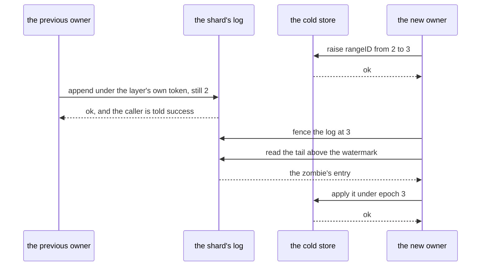
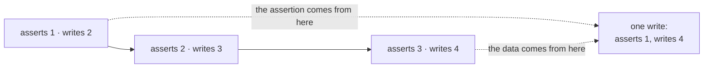
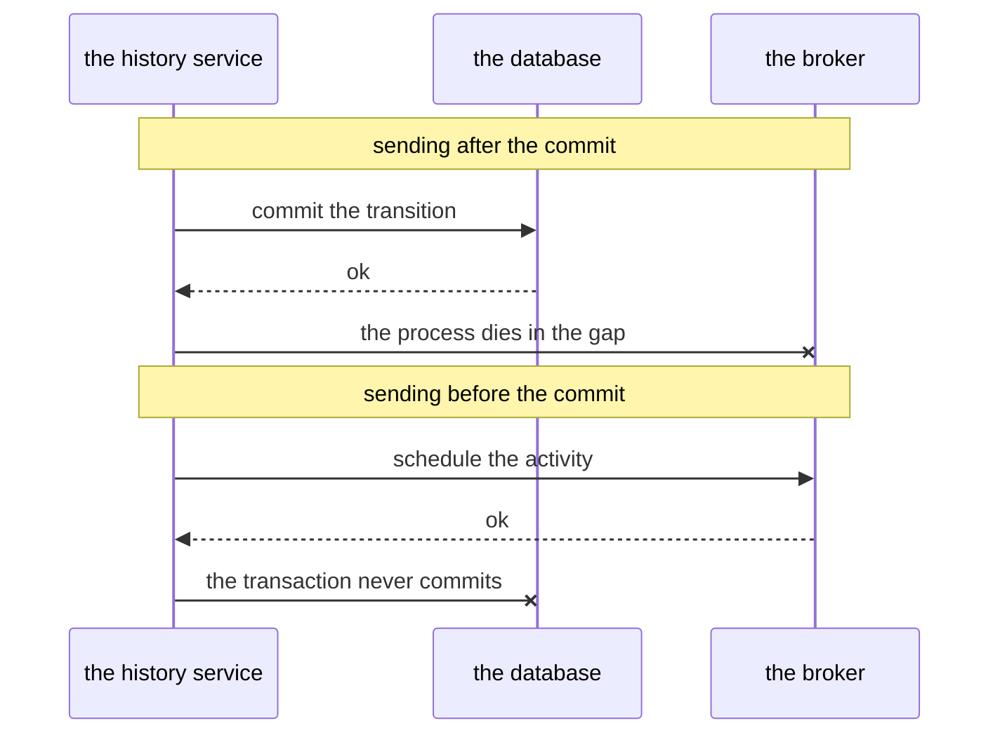

# The designs that were rejected

Most of the shapes in the preceding chapters exist because something simpler was tried first and did
not work. Those chapters describe what survived; this one describes what did not. It is for whoever
is **changing** the layer and is about to propose one of these again. Each entry states the
alternative, the sequence of events or the cost that ruled it out, and which chapter describes what
stands in its place.

---

## Ownership

### A lease with a timer

*The alternative: a node takes the shard for a period, renews the lease while it works, and stops
considering itself the owner when the term expires.*

A lease requires the holder and whoever granted it to agree about how much time has passed, and two
machines' clocks do not. That is the small problem. The large one is that **a node that has lost its
lease learns nothing about it**. It can be in a stop-the-world garbage-collection pause, in swap, or
on the wrong side of a network partition, and it comes out of all three still believing it owns the
shard. From the inside that belief looks exactly like the truth. A lease checked in the holder's
memory against the holder's clock is checked by the one party that cannot tell whether it still
holds anything.

The old owner staying alive is the common case, not the exotic one. A node that loses power is the
easy case, because there is nothing left to exclude.

So the check cannot live in the node, and it cannot rest on the node's notion of time. It has to live
where the write lands, and it has to fire at the moment of the write. Three shapes in the layer
follow from that one conclusion: the drain registers the epoch assertion first in its transaction,
the log refuses an append under a superseded epoch rather than notifying anyone, and the layer never
tries to tell a displaced owner what happened to it.

Ownership loss is therefore **discovered, never announced**, and a node can discover it in three
places:

| where | what it sees |
|---|---|
| an append | `wal.ErrFenced` |
| a drain | `apply.ClassShardLost` |
| a replay | `cycle.FencedAway`, the cause it carries when the inherited tail holds an entry above this cycle's own epoch |

Everything a node knows about its own ownership is as fresh as its last attempt to act. A displaced
owner that writes nothing is never fenced and needs no fencing: it holds no lock, delays no
successor, and finds out the moment it acts.
[Chapter 06](06-shard-lifecycle.md#1-first-exclude-the-failed-owner) owns the exclusion.

### Two ownership tokens, one for the log and one for the store

*The alternative: fence the log with a token of the layer's own and gate the cold store on Temporal's
`rangeID` — each mechanism correct on its own.*

Two tokens are moved by two writes, so one of them moves first, and both orderings let through a
write that should not have happened. The writer in both is a *zombie*: the previous owner, still
running and still believing the shard is its own.

*The new owner takes the log first, and has not yet raised the shard counter.* A zombie writing now
is refused by the log and **accepted by the cold store**, whose counter it still holds. A mutation
settles in the cold store that the log knows nothing about.

*The counter is raised first, and the log is not yet taken.* A zombie appends to the log. It would be
refused at the cold store if it went there directly, which makes this look survivable. It is not,
because the entry it left is durable. The new owner fences, replays the tail, finds that entry and
faithfully carries it into the cold store under its own name and its own epoch. The zombie's write
is **laundered through the successor's replay**: every check downstream sees a well-formed entry
written by the current owner.

The two orderings differ only in when the damage becomes visible. Protecting both places separately
is not enough: they have to obey **one and the same decision** about who owns the shard. That is
invariant I11 — the epoch *is* the rangeID, one token rather than two mechanisms. With one token
there is no second value to fall out of step, so the question of which write goes first does not
arise. [Chapter 02](02-concepts-and-invariants.md#the-invariants) states it.

### Fencing only at the cold store

*The alternative: check ownership once, where the data finally settles, and leave the log ungated.*

It is cheaper, and it looks sufficient under the rule "what has not settled does not count": an entry
that never reaches the cold store never happened. It fails because **an entry in the log is not in
that category**. The entry is durable, the next owner is obliged to apply it, and by this layer's
commit rule its author has already been told success.

Checking ownership only at the cold store therefore lets through an *acknowledgement that was never
permissible to give*. The cold store can still refuse the row, but by then the caller has gone away
believing the write happened, and the successor holds an entry it must apply. The failure is not a
lost row, it is a broken promise, and no later gate can take an acknowledgement back.

That is the same reasoning that makes the append, rather than the drain, the irreversible boundary of
the write path. So the log refuses the zombie at the append and the cold store refuses it again
inside the drain's own transaction; neither check subsumes the other. Invariant I4 is that pair,
[chapter 02](02-concepts-and-invariants.md#the-invariants).

### A batch of entries in one append

*The alternative: `Append` takes several payloads and writes them at consecutive seqnos as one
atomic unit — the shape a group commit would want.*

It is what the contract had, and most backends keep such a promise without effort: their append is
one transaction, or one statement, or one replicated command, or one mutex-held splice, and several
entries fit inside any of those. A log whose unit of atomicity is *bigger* than one entry can even
pay for a partial batch deliberately, by framing every entry with its batch's bounds so a recovered
tail can be rewound off a batch that did not finish.

Some logs cannot pay for it at all. Where the unit of atomicity is the row — an append-only journal,
for instance — a batch is written as consecutive rows, and a fence landing between two of them
leaves a prefix in the log. None of `Append`'s three refusals can describe that state: `ErrFenced`,
`ErrAlreadyWritten` and `ErrGap` each say the write is whole, one way or the other.

Worse than the missing answer is the answer that is there. A writer that died mid-batch, restarted
and replayed it is told `ErrAlreadyWritten` — which the contract documents as the replay's success
signal — so it acknowledges seqnos nobody wrote. The log cannot tell the two cases apart, because
"it holds part of your batch" and "you changed your batch" are the same rows.

Two repairs were built before the batch was removed, and both are worse than removing it.

The first is to teach the log a new answer: "your batch was cut", where it now says
`ErrAlreadyWritten`. That turns the contract suite red — `waltest`'s
`DuplicateSeqnoIsAlreadyWritten` pins the opposite — and the suite is right to, because on an atomic
backend a partial overlap really is a caller changing its batch.

The second is to publish the limit: a method on the contract saying how many entries this backend
writes indivisibly, answered "unbounded" by the atomic backends and "one" by the rest. It works, and
it costs three things. A parameter stays on the contract that one kind of backend has to refuse.
Three conformance assertions have to exist in two versions apiece, one per answer. And every caller
has to ask a question whose answer is one wherever the awkward backend is deployed.

What the batch was for is worth stating plainly: nothing, yet. The layer's only append is the apply
cycle's, and it calls `Log.Append` once per mutation from exactly one place in `cycle`. The batch was
capacity held for a group commit that was never built. Amortising an fsync across concurrent writers
is still available where it belongs — inside a backend, which is where a database's own group commit
already does it — and it needs no batch at this seam to happen.

### The shard's own writes, deferred into the log

*The alternative: put `UpdateShard` through the log like every other write, so one mechanism carries
everything the layer sees.*

It cannot be built, and the obstacle is not an ordering that could be fixed. Follow the chain: an
append carries an epoch and is refused unless the log is already fenced at that epoch; the epoch is
the rangeID; and the rangeID is set by the write to the shard row. Putting that write through the log
means appending a record whose own precondition is established by the very record being appended.
**The write would defer the establishment of its own condition** — a circular dependency, not a
trade-off.

The reason usually given is the secondary one. `rangeID` is also the task-id allocator: a shard hands
out ids from the block that `rangeID` names, and the history service's `RangeSizeBits` is 20, so each
value is worth 2^20 = 1,048,576 ids. That is why the counter rises without any change of owner, and
why task-id uniqueness costs nothing extra. It is true, but it answers a weaker question than the one
somebody asks on seeing three shard calls stay immediate.

The same circularity is why an acquire is necessarily two writes to two places, and so cannot be made
atomic: the fence has to land before the rangeID the fence is derived from. `wrapper.ShardStore`
consequently **observes** `UpdateShard` rather than intercepting it — it fences the log at the new
epoch, then lets the base store commit the row — and the cost of the non-atomicity is paid at replay
time.
[Chapter 06](06-shard-lifecycle.md#2-use-the-ownership-token-temporal-already-has) owns the order.

---

## The window

### A buffer inside the history service

*The alternative: let the history service accumulate transitions in memory and write to the store
less often, with no second durable thing between them.*

Two things rule it out, and the second cannot be paid off. First, the server would have to lie. It
treats a write as done when the store returns, so a buffer that holds transitions back must either
answer success before the data is durable — losing every buffered transition when the process dies —
or not answer until it flushes, in which case it has accumulated nothing. Writing to the store
asynchronously and answering immediately is the same lie in a shorter form.

Second, **the server reads its own writes, one call later, across the same interface**. It rebuilds
mutable state, it checks start conditions, and all of it crosses the persistence boundary. A buffer
that does not answer reads breaks the server immediately — not subtly, and not only under load.

The layer pays both prices explicitly. What it accumulates is durable before the caller is answered,
which is what the log is for; and its window answers reads, which is what the overlay and the merged
task page are for. That second obligation is the whole of [chapter 07](07-read-path.md).

### A folded window as a concatenation of the store's own queries

*The alternative: keep the window's mutations as they arrived and replay them, one store request at a
time, inside one transaction.*

The first failure is arithmetic, not concurrency. A log entry is a whole store request, and every
request shape in the store's vocabulary derives its own condition from the version it is about to
write. Suppose the cold store holds version 1 of a run's row and the window holds three updates that
carried it to version 4. The single write the drain must make has to assert 1 — that is the version
the cold store knows about — and write 4. Take the *last* mutation and it asserts 3, which fails
against a store holding 1. Take the *first* and it asserts 1 correctly but writes 2, losing two
transitions. No request shape in the vocabulary carries that pair of numbers.

Replaying the window request by request sidesteps the arithmetic and buys nothing: the same rows, the
same assertions, the same work for the database, in one transaction instead of several. It also costs
on a second axis. A store's conditional query is ordinarily assembled by string concatenation whose
*structure*, not just whose values, varies per row, so every batch produces query text no other batch
will match and the database can never reuse a compiled plan for it. Grow the batch far enough and the
database times out while it is still compiling the statement. A timeout is
**ambiguous**: the drain neither committed nor provably did not, so the layer reads its watermark,
finds the batch absent and halts the shard. A drain bound by query compilation does not merely write
slowly — it takes the shard down.

That is why a fold's output is not a request on its own. It is a request **plus a separately carried
set of assertions** — `fold.WorkflowRecord.Current` and `fold.Emitted.RunAssertions()` — which the
applier substitutes for the conditions the store's own request shapes would have derived. The query's
shape then depends on which kinds of assertion and which delete families the batch contains, never on
how many mutations it folded. That property belongs to whichever applier a deployment runs rather
than to anything in this repository, which is why
[chapter 11](11-verification.md#the-guards) names a drain query-shape guard as one of the two a
deployment has to rebuild for itself: drive a real drain at a window of 64 and assert that its
largest transaction stays a constant number of statements. A constant is the honest form of the
claim that the shape does not grow. [Chapter 05](05-write-path.md#2-the-drain-itself) owns the drain.

The numbers behind all of this come from the research prototype's store, whose conditional query was
assembled per row: roughly **+3 statements and +1.1 KB of query text per mutation**. Read them as an
order of magnitude, not as figures to expect from your own store.

### Promised work as a message to a broker

*The alternative: when a transition schedules an activity or sets a timer, send the work to an
external broker instead of writing a row beside the state.*

The promise has to be exactly as durable as the transition that made it. If the transition is
recorded and the promise is lost, the workflow waits for an activity nobody ever dispatched, for as
long as the namespace lives, and nothing detects it: the state is written and looks healthy.

Neither order of the two writes is safe. Send to the broker after the commit and there is a gap
between them; a process that dies in that gap has recorded a transition with no work behind it. Send
before the commit and the loss changes sides: the work has gone out and the transaction never
happened, so an activity is dispatched for a run that does not exist and a timer will wake a state
that never arrives. A two-phase commit between the database and the broker closes both gaps, at the
price of coordinating a second system on **every** transition — which is precisely the per-transition
cost that makes a transition expensive in the first place.

The known-good answer is not to leave the database at all. The work is written by the same conditional
write as the state that produced it, in the same tables, under the same shard, and the transaction
cannot distinguish it from any other row it touches. That is what a history task is, and it is a
property the layer **inherits and must not break**. So task rows ride the same drain transaction as
the merged requests, and both of the store's task calls — `AddHistoryTasks` and
`RangeCompleteHistoryTasks` — travel the log, rather than one of them going straight to the cold
store. Routing them differently would let the range delete take effect at a different moment from the
writes it covers, and that fails in both directions:
[chapter 02](02-concepts-and-invariants.md#the-glossary-in-reading-order) has them.

---

## Reads

### Extending the server's own hold-back

*The alternative: reuse the mechanism Temporal already has — the shard holds each queue's exclusive
reader high watermark below the task-writing requests still in flight — and stretch it to cover the
window.*

The mechanism exists and has the right shape. `getExclusiveReaderHighWatermark` keeps a queue from
reading past work that is still being written, and the tracker hands the write path a completion
function to call once the store answers. The hold is therefore released **at the moment the
persistence write returns success** — and a write taken by this layer returns success at the log
append, with its tasks still only in the window. The hold comes off exactly one moment too early,
every time.

The layer cannot stretch that hold, because the tracker lives above the persistence boundary and
nothing at the store interface can reach it. The only lever the layer has at that seam is when its
own write returns. So there are only two ways to hold the watermark down for longer, and the layer can
take neither: answer the caller only once the drain has committed, which gives up the early
acknowledgement the layer exists for, or answer early anyway, which releases the hold over tasks that
are not in the store yet — the failure the hold exists to prevent.

So the tasks still sitting in the window can only be supplied where the queue reads, by merging them
into the page it asked for.
[Chapter 07](07-read-path.md#4-merge-tasks-two-ordered-sources-one-page) owns the merged page.

### A readiness gate

*The alternative: refuse reads, or make them wait on a flag, while the window is non-empty or a drain
is in flight.*

Refusing is the wrong answer to a request that arrives while a drain is in flight: the shard is ours
and the state is known, so there is nothing to refuse it for. Waiting on a flag is the request queue
the cycle already is, rebuilt with a flag in place of a channel — plus one new failure mode, the flag
drifting out of step with the state it claims to describe.

The shipped design needs neither. A read is a job on the shard's own cycle goroutine, the same
goroutine that runs the drain, so no read can observe the interval between the window emptying and
the transaction committing; there is nothing there to guard. Replay runs on that same goroutine and
lazily: the first request to reach the shard triggers it, read or write alike, and it completes
before that request is answered (`Cycle.startForRead`). The readiness gate is therefore a question of
**where the work runs**, not a flag.
[Chapter 07](07-read-path.md#2-routing-a-read-and-drainonread) owns it.

### Answering from the cold store while the window catches up

*The alternative: serve reads from the cold store and let the window converge behind them.*

This does not make reads slow. It makes them quietly wrong. The server does not merely display what
it reads — it computes the next state transition from it, so an answer that is missing an
acknowledged write is **amplified into the next write** rather than corrected by it. The caller has
already been told that write happened; a read that says otherwise is not stale, it is a write undone.

A variant of the same idea fails for a related reason: answer with the window's state but the base
row's version. The server's next conditional write then asserts a version that nothing is ever going
to write, and every write after it fails its condition. The overlay hands out the tail's version
instead — the one the window's merged request will write —
[chapter 07](07-read-path.md#3-overlay-mutable-state-base-plus-acknowledged-change).

### A materialised per-run state, or an index over the window's tasks

*The alternative: keep a rendered copy of each run's state, and a secondary index over the window's
tasks, so a read does not walk the accumulator.*

Each is a second structure that has to reproduce the window's entire lifecycle: emptying when a drain
starts, resetting when the cycle stops, staying untouched when a fold is refused, and being rebuilt
alongside replay on every change of owner. Get the materialised state wrong and a read returns a
silently wrong answer. Get the task index wrong and a task becomes **invisible to a reader**, which is
exactly the loss the merge exists to prevent: the queue reads a range, finds nothing there, completes
it, and acks past a key it never saw.

The trade also runs backwards. Both structures spend work when a writer is acknowledged in order to
save work when a queue's poll is answered — and both of those run on the same cycle goroutine, so
nothing is moved off a hot path at all. There is little to save in any case. A window holds tens of
tasks per category, so scanning it is the entire cost of the window's half of a task page, and
`fold.RunView.Render` builds a private copy for each call and throws it away rather than keeping one
around.

One consequence is worth stating on its own: **merge-on-read does not make the queue faster, it makes
it correct.** Each page costs a scan of the window on top of the same cold-store round trip the queue
would have made without the layer.

What stands in its place is the scan, in
[chapter 07](07-read-path.md#4-merge-tasks-two-ordered-sources-one-page). This refusal is a judgement
about a size, so it comes with the condition under which to revisit it: it holds while a window
carries tens of tasks per category, and stops holding if one routinely carries thousands. The shipped
window of 256 mutations (`wal.windowMutations`) does not produce that; a much larger one might.

---

## Judging it

### A unit test per fold rule

*The alternative: for each rule the fold applies, a test asserting that the code does what the rule
says.*

Such a test checks that the code is faithful to the rule. The code's fidelity is not what is in
doubt; whether the rule was conceived correctly in the first place is. The fold has no specification
of its own, and that is deliberate: a rule written out in Temporal's terms would be a second
implementation of the server's semantics living underneath the server, and the two would start
diverging the same day. So "correct" for the fold means exactly one thing — the result matches what
would have happened had the fold not been there. That is agreement with another program's behaviour
rather than conformance to a document, and the other program is the very code whose mutations the
fold compacts and whose assertions the drain's transaction rewrites.

Two of the divergences such a test misses were invisible to every other instrument, and both are
about the same row: the current-execution row.

The first is *who* writes it. A snapshot-bearing request — a create, a set, a conflict-resolve —
resets the run's accumulator, and the first such request in a window gives the merged request its
kind, whichever position it arrived in. A second one does not take the kind back: its content
replaces the snapshot in place, under the envelope the first one established. The
current-execution row, though, is a last-writer effect: what the sequential path would have
left there is whatever request touched it last. A fold that rendered the row from the merged
request's own kind therefore silently drops what the window's other requests wrote to it — right
keys, right types, wrong value. `fold.WorkflowRecord.CurrentWrite` exists to carry that last write
separately from the kind.

The second is *in what form*. Each kind writes the row differently: the update path re-serialises the
full execution state, a conflict-resolve writes a reduced one — run id, create request id, state and
status — and a continue-as-new passes the new run's own blob through untouched. A fold that used one
rendering for all three produces a row that is correct in every field a reader would check and
different in bytes.

Neither turned a suite red until a differential run against the incumbent found it. Both are pinned
by a unit test now — `TestCurrentWriteTracksTheLastWriter` in
[`../../fold/currentwrite_test.go`](../../fold/currentwrite_test.go), which holds the write that
survives a set-headed window and each kind's rendering byte for byte. The order in which that
happened is the argument: the rule was written from the divergence, not the divergence found from the
rule.

The differential run that found both is the **oracle**: one stream applied twice, once mutation by
mutation through a real store and once folded, with the two stores required to end up identical. It
does not exist in this repository. `cold/memcold` is a store both halves could run against — it is the store
`TestBothSeamsRealNoServer` uses for the folded half — but what it cannot supply is a reason to
believe the comparison. A store this repository built its own folded path against, judged by a
sequential path through that same code, would only be agreeing with itself. The oracle is worth
building over the store a deployment actually cares about, and it is what such a deployment should
build *instead of* the unit test above. The unit test is what you write after the oracle has told you
what to pin.

### A golden dump

*The alternative: record the cold store the sequential path produces, check it in, and compare later
runs against it.*

The recording would be made by today's code, with every defect today's code has, and checking it in
promotes those defects to the definition of correct. It is also stationary: it says nothing when the
incumbent's own behaviour changes, and that is the one event the comparison exists to notice.

So the baseline is a **live second run of the incumbent**, not an artefact. Both paths execute in the
same process, against the same store, in the same run, and the incumbent's answer is recomputed every
time rather than remembered. The one thing that could reasonably be recorded is the *input* corpus,
and even that need not be checked in: a stream generated from a seed is regenerated by the seed.

That is why `internal/verify/acceptance` records nothing at all. Its stream comes from a seed, and its
one number — a collapse ratio — is asserted against a *control run* at the other end of the locality
knob rather than against a stored value
([chapter 11](11-verification.md#the-acceptance-one-stream-through-the-fold)).

---

## Where this lives in the code

* [`../../wal/refuse.go`](../../wal/refuse.go) — the append's refusals: `ErrFenced` for a
  superseded epoch, `ErrZeroEpoch` for none, and the order between them.
* [`../../wal/wal.go`](../../wal/wal.go) — `Append`, which takes exactly one payload; the contract
  itself states why.
* [`../../apply/failure.go`](../../apply/failure.go) — `ClassShardLost`, one of the three places
  ownership loss is discovered, and `Attribute`, which reads back every row a failed drain asserted
  and names the ones that diverged.
* [`../../wrapper/shard_store.go`](../../wrapper/shard_store.go) — `UpdateShard` observed
  rather than intercepted, and why it cannot be logged.
* [`../../cycle/replay.go`](../../cycle/replay.go) — the successor folding and applying an
  inherited tail, which is what a second ownership token would have laundered a zombie's entry
  through.
* [`../../cycle/read.go`](../../cycle/read.go) — the reads that run on the shard's own cycle
  goroutine, and `startForRead`: the placement a readiness gate would have replaced with a flag.
* [`../../fold/fold.go`](../../fold/fold.go) — `WorkflowRecord`, `CurrentWrite` and
  `Emitted.RunAssertions()`: the assertions a merged request cannot carry itself.
* [`../../fold/assert.go`](../../fold/assert.go) — the three renderings of the
  current-execution row that a single rendering would have collapsed.
* [`../../fold/overlay.go`](../../fold/overlay.go) — `RunView.Render`, which copies and
  discards rather than materialising.
* [`../../fold/tasks.go`](../../fold/tasks.go) — the scan, and the recorded reason there
  is no index over it.
