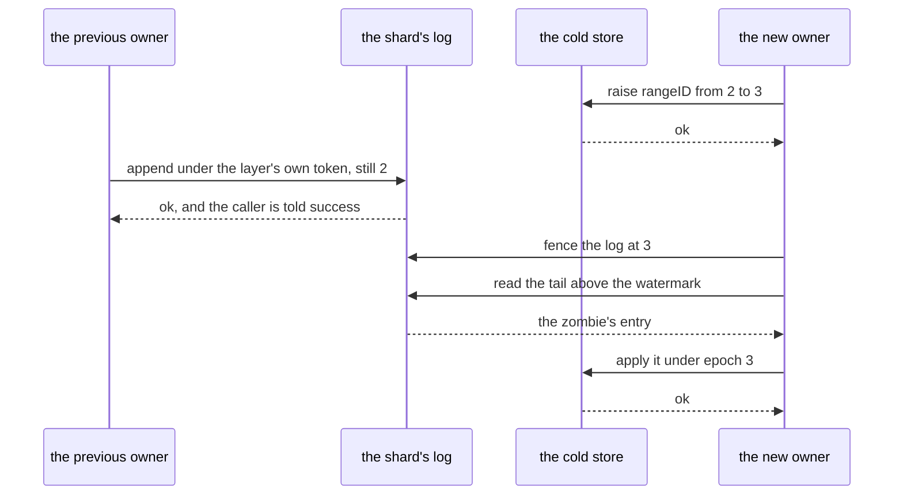
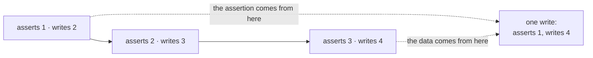
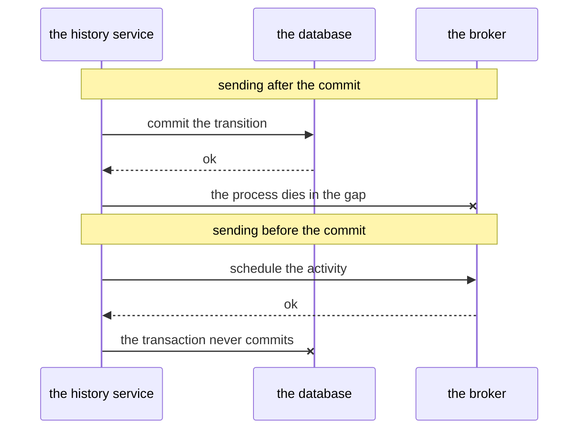

# The designs that were rejected

Many shapes in the earlier chapters look more complicated than they need to be. Usually a simpler
design was tried first and failed. Anyone changing the layer will think of some of these designs
again, so this chapter records why each was refused.

Each entry gives the alternative in one italic line, the failure that ruled it out, and a pointer to
what stands in its place. The entries are grouped by ownership, the log contract, the window, reads,
and how the layer is judged.

---

## Ownership

### A lease with a timer

*The alternative: a node takes the shard for a period, renews the lease while it works, and stops
considering itself the owner when the term expires.*

A lease needs two machines' clocks to agree, and they do not. That is the small problem. The large
one is that a node that has lost its lease learns nothing about it. A node in a long
garbage-collection pause, in swap, or behind a network partition comes back still believing it owns
the shard. A lease checked against the holder's own clock is checked by the one party that cannot
tell whether it still holds anything. An old owner that stays alive like this is the common case; a
node that loses power is the easy one.

So the check has to live where the write lands and fire at the moment of the write. Three shapes in
the layer follow:

* the drain registers the epoch assertion first in its transaction;
* the log refuses an append under a superseded epoch rather than notifying anyone;
* the layer never tries to tell a displaced owner what happened to it.

A node discovers ownership loss in one of three places; nobody announces it:

| where | what it sees |
|---|---|
| an append | `wal.ErrFenced` |
| a drain | `apply.ClassShardLost`, or a watermark found past the seqno of a drain whose outcome was unknown, which carries `cycle.FencedAway` too |
| a replay | `cycle.FencedAway`, the cause it carries when the inherited tail holds an entry above this cycle's own epoch |

What a node knows about its own ownership is only as fresh as its last attempt to act. A displaced
owner that writes nothing is never fenced and needs no fencing: it holds no lock, delays no
successor, and finds out the moment it acts. What stands in place of the lease is the exclusion in
[chapter 06](06-shard-lifecycle.md#1-first-exclude-the-failed-owner).

### Two ownership tokens, one for the log and one for the store

*The alternative: fence the log with a token of the layer's own and gate the cold store on Temporal's
`rangeID`, each mechanism correct on its own.*

Two tokens are moved by two writes, so one moves first. Both orderings let through a write from a
*zombie*: the previous owner, still running and still believing the shard is its own.

*The new owner takes the log first and has not yet raised the shard counter.* The log refuses the
zombie, but the cold store accepts it, because the zombie still holds the store's current counter. A
mutation settles in the cold store that the log knows nothing about.

*The new owner raises the counter first and has not yet taken the log.* The zombie appends to the
log. The cold store would refuse the zombie directly, so this looks survivable, but the entry is
durable. The new owner fences the log, replays the tail, finds the entry and carries it into the
cold store under its own epoch. The zombie's write is laundered through the successor's replay:
every later check sees a well-formed entry from the current owner. The figure shows this second
ordering.

```mermaid
sequenceDiagram
    participant Z as the previous owner
    participant L as the shard's log
    participant C as the cold store
    participant N as the new owner
    N->>C: raise rangeID from 2 to 3
    C-->>N: ok
    Z->>L: append under the layer's own token, still 2
    L-->>Z: ok, and the caller is told success
    N->>L: fence the log at 3
    N->>L: read the tail above the watermark
    L-->>N: the zombie's entry
    N->>C: apply it under epoch 3
    C-->>N: ok
```

Guarding both places separately is not enough; both must obey one decision about who owns the
shard. That is invariant I11: the epoch is the rangeID. With one token, nothing can fall out of
step. [Chapter 02](02-concepts-and-invariants.md#the-invariants) states it.

### Fencing only at the cold store

*The alternative: check ownership once, where the data finally settles, and leave the log ungated.*

This is cheaper, and it looks sufficient under the rule that what has not settled in the cold store
does not count. But a log entry is not in that category: it is durable, the next owner must apply
it, and its author was told success when the append returned.

So fencing only at the cold store lets through an acknowledgement that should never have been
given, and no later gate can take it back. This is why the append, not the drain, is the
irreversible boundary of the write path.

The log therefore refuses the zombie at the append, and the cold store refuses it again inside the
drain's transaction. Neither check replaces the other. That pair is invariant I4 ([chapter
02](02-concepts-and-invariants.md#the-invariants)).

### The shard's own writes, deferred into the log

*The alternative: put `UpdateShard` through the log like every other write, so one mechanism carries
everything the layer sees.*

This design is circular. An append is accepted only under the epoch the log is fenced at. The epoch
is the rangeID, and the rangeID is set by the shard write we would be appending. The write would
have to establish its own precondition.

A secondary reason is often given: rangeID is also the task-id allocator, so it rises without any
change of owner ([chapter 06 §2](06-shard-lifecycle.md#an-epoch-may-grow-without-a-change-of-owner)).
That is true, but the circularity alone rules the design out.

The same circularity makes an acquire two writes to two places, which cannot be atomic: the fence
must land before the rangeID it is derived from. So `wrapper.ShardStore` observes `UpdateShard`
rather than intercepting it. It fences the log at the new epoch, then lets the base store commit the
row, and replay pays for the non-atomicity. [Chapter
06](06-shard-lifecycle.md#1-first-exclude-the-failed-owner) describes the order.

---

## The log contract

### A batch of entries in one append

*The alternative: `Append` takes several payloads and writes them at consecutive seqnos as one
atomic unit, the shape a group commit would want.*

The contract once had this, and most backends keep the promise easily: their append is one
transaction, statement, replicated command or mutex-held splice, and several entries fit inside it.
A log whose unit of atomicity is larger than one entry can even survive a partial batch, by framing
each entry with its batch's bounds so a recovered tail can be rewound off an unfinished batch.

Some logs cannot keep the promise at all. Where the unit of atomicity is the row, as in an
append-only journal, a batch is written as consecutive rows. A fence that lands between two of them
leaves a prefix in the log. None of `Append`'s three refusals describes that state: `ErrFenced`,
`ErrAlreadyWritten` and `ErrGap` each say the write is whole, one way or the other.

Worse, one of them gives the wrong answer. A writer that died mid-batch, restarted and replayed the
batch is told `ErrAlreadyWritten`, which the contract documents as the replay's success signal. So
it acknowledges seqnos nobody wrote. The log cannot tell "it holds part of your batch" from "you
changed your batch", because both are the same rows.

Two repairs were built before the batch was removed. Both are worse than removing it.

* Teach the log a new answer, "your batch was cut", where it now says `ErrAlreadyWritten`. This turns
  the contract suite red, because `waltest`'s `DuplicateSeqnoIsAlreadyWritten` pins the opposite.
  The suite is right: on an atomic backend a partial overlap really is a caller changing its batch.
* Publish the limit: a contract method saying how many entries the backend writes indivisibly,
  "unbounded" for atomic backends and "one" for the rest. This works, at three costs. The contract
  keeps a parameter one kind of backend must refuse. Three conformance assertions need two versions
  each. And every caller must ask a question whose answer is "one" wherever the awkward backend is
  deployed.

Meanwhile the batch bought nothing. The layer's only append calls `Log.Append` once per mutation
from one place in `cycle`; the batch was held for a group commit never built. A backend can still
amortise an fsync across writers internally, with no batch at this seam. So `Append` takes exactly
one payload.

---

## The window

### A buffer inside the history service

*The alternative: let the history service accumulate transitions in memory and write to the store
less often, with no second durable thing between them.*

Two things rule it out. First, the server treats a write as done when the store returns. A buffer
must either answer success before the data is durable, and lose it if the process dies, or wait
until it flushes, and so accumulate nothing. Writing to the store asynchronously and answering at
once is the same failure.

Second, the server reads its own writes one call later, through the same persistence interface, to
rebuild mutable state and check start conditions. A buffer that does not answer reads breaks the
server at once.

The layer meets both demands. What it accumulates is durable before the caller is answered, which is
what the log is for. And its window answers reads, through the overlay and the merged task and
history pages of [chapter 07](07-read-path.md).

### A folded window as a concatenation of the store's own queries

*The alternative: keep the window's mutations as they arrived and replay them, one store request at a
time, inside one transaction.*

The first failure is arithmetic. A log entry is a whole store request, and every request shape in
the store's vocabulary derives its condition from the version it is about to write. Suppose the cold
store holds version 1 of a run's row, and the window holds three updates that carried it to
version 4. The drain's single write must assert 1, the version the cold store has, and write 4. The last
mutation asserts 3, which fails against a store holding 1. The first asserts 1 but writes 2, losing
two transitions. No request shape carries the pair (1, 4). The figure shows where each half comes
from.

```mermaid
flowchart LR
  A["asserts 1 · writes 2"] --> B["asserts 2 · writes 3"] --> C["asserts 3 · writes 4"]
  A -. "the assertion comes from here" .-> R["one write:<br/>asserts 1, writes 4"]
  C -. "the data comes from here" .-> R
```

Replaying the requests one by one inside one transaction avoids the arithmetic but saves no database
work, and it costs on a second axis. A store's conditional query is usually built by string
concatenation whose structure varies per row, so no two batches share query text and the database
never reuses a compiled plan. A large enough batch times out while still compiling. A timeout is an
unknown outcome: the drain neither committed nor provably did not, so the layer reads its watermark,
finds the batch absent and halts the shard. A drain bound by query compilation does not just write
slowly. It takes the shard down.

This is why a fold's output is a request plus a separately carried set of assertions
(`fold.WorkflowRecord.Current` and `fold.Emitted.RunAssertions()`). The applier uses these in place
of the conditions the store's own request shapes would derive. The query's shape then depends on
which kinds of assertion and delete families the batch contains, never on how many mutations it
folded. That property belongs to the deployment's applier, so
[chapter 11](11-verification.md#the-guards) names a drain query-shape guard as one of the two guards
a deployment must build itself: drive a real drain at a window of 64 and assert that its largest
transaction stays a constant number of statements.
[Chapter 05](05-write-path.md#2-the-drain-itself) describes the drain.

The numbers behind this come from the research prototype's store, whose conditional query was built
per row: roughly +3 statements and +1.1 KB of query text per mutation. Read them as an order of
magnitude, not as figures to expect from your own store.

### Promised work as a message to a broker

*The alternative: when a transition schedules an activity or sets a timer, send the work to an
external broker instead of writing a row beside the state.*

The work must be exactly as durable as the transition that made it. If the transition is recorded
and the work is lost, the workflow waits forever for an activity nobody dispatched, and nothing
detects it, because the state is written and looks healthy.

Neither order of the two writes is safe, as the figure shows. Send after the commit, and a process
that dies in between leaves a transition with no work behind it. Send before, and an activity is
dispatched, or a timer set to wake, for a state that never arrives. A two-phase commit closes both
gaps, at the cost of coordinating a second system on every transition, which is the cost that makes
a transition expensive in the first place.

```mermaid
sequenceDiagram
    participant S as the history service
    participant DB as the database
    participant B as the broker
    Note over S,B: sending after the commit
    S->>DB: commit the transition
    DB-->>S: ok
    S-xB: the process dies in the gap
    Note over S,B: sending before the commit
    S->>B: schedule the activity
    B-->>S: ok
    S-xDB: the transaction never commits
```

Temporal instead writes the work in the same conditional write as the state, in the same tables and
under the same shard, so the transaction treats it like any other row. That row is a history task,
and the layer must not break this property. So task rows ride the same drain transaction as the
merged requests, and both of the store's task calls, `AddHistoryTasks` and
`RangeCompleteHistoryTasks`, travel the log; neither goes straight to the cold store. Routing them
differently would let the range delete take effect at a different moment from the writes it covers,
which fails in both directions ([chapter
02](02-concepts-and-invariants.md#the-glossary-in-reading-order)).

---

## Reads

### Extending the server's own hold-back

*The alternative: reuse Temporal's own hold-back, in which the shard keeps each queue's exclusive
reader high watermark below task-writing requests still in flight, and stretch it over the window.*

The mechanism exists and has the right shape. `getExclusiveReaderHighWatermark` keeps a queue from
reading past work still being written. The shard's in-flight task tracker hands the write path a
completion function to call once the store answers, so the hold is released when the persistence
write returns success. A write taken by this layer returns success at the log append, while its
tasks are still only in the window. The hold comes off too early, every time.

The layer cannot stretch the hold, because the tracker lives above the persistence boundary. Its
only lever is when its own write returns. Answering after the drain commits gives up the early
acknowledgement; answering early releases the hold over tasks not yet in the store.

So the window's tasks can only be supplied where the queue reads, by merging them into the page it
asked for ([chapter 07](07-read-path.md#4-merge-tasks-two-ordered-sources-one-page)).

### A readiness gate

*The alternative: refuse reads, or make them wait on a flag, while the window is non-empty or a drain
is in flight.*

Refusing is wrong: while a drain is in flight the shard is ours and the state is known, so there is
nothing to refuse. Waiting on a flag rebuilds the request queue the cycle already is, with a flag in
place of a channel, and adds a new failure: the flag drifting out of step with the state it
describes.

The shipped design needs neither. A read is a job on the shard's cycle goroutine, the same goroutine
that runs the drain, so no read can observe the gap between the window emptying and the transaction
committing. Replay runs lazily on that goroutine too. The first request to reach the shard, read or
write, triggers it, and it completes before that request is answered (`Cycle.start`, which the read
path reaches through `Cycle.startForRead`). Readiness is settled by where the work runs, not by a
flag ([chapter 07](07-read-path.md#2-routing-a-read-and-drainonread)).

### Answering from the cold store while the window catches up

*The alternative: serve reads from the cold store and let the window converge behind them.*

This makes reads wrong, not just stale. The server computes its next state transition from what it
reads, so an answer missing an acknowledged write is carried into the next write. The caller was
told that write happened. A read that omits it undoes it.

A variant fails for a related reason: answer with the window's state but the base row's version. The
server's next conditional write then asserts a version nothing will ever write, and every later
write fails its condition. The overlay instead hands out the tail's version, the one the window's
merged request will write ([chapter
07](07-read-path.md#3-overlay-mutable-state-base-plus-acknowledged-change)).

### A materialised per-run state, or an index over the window's tasks

*The alternative: keep a rendered copy of each run's state, and a secondary index over the window's
tasks, so a read does not walk the accumulator.*

Each is a second structure that must reproduce the window's whole lifecycle: empty when a drain
starts, reset when the cycle stops, stay untouched when a fold is refused, and rebuild alongside
replay on every change of owner. A wrong materialised state returns a silently wrong read. A wrong
task index makes a task invisible to a reader, which is the loss the merge exists to prevent: the
queue reads a range, finds nothing, completes it, and acks past a key it never saw.

The trade also runs backwards: both spend work at acknowledgement to save work at a poll, and both
run on the same cycle goroutine, so nothing leaves the hot path. A window holds tens of tasks per
category, so the scan is cheap, and `fold.RunView.Render` builds a private copy per call and
discards it. Merge-on-read makes the queue correct, not faster: each page costs a window scan on top
of the cold-store round trip.

The scan stands in place of both structures ([chapter
07](07-read-path.md#4-merge-tasks-two-ordered-sources-one-page)). This refusal is a judgement about
size, so revisit it if the size changes: it holds while a window carries tens of tasks per category,
not if one routinely carries thousands. The shipped window of 256 mutations (`wal.windowMutations`)
does not produce that; a much larger one might.

---

## Judging it

### A unit test per fold rule

*The alternative: for each rule the fold applies, a test asserting that the code does what the rule
says.*

Such a test checks that the code follows the rule. What is in doubt is whether the rule is right.
The fold has no specification of its own, by choice: rules written in Temporal's terms would be a
second implementation of the server's semantics, diverging from it the same day. So the fold is
correct when the result matches what would have happened without it. That is agreement with another
program, the server whose mutations the fold compacts and whose assertions the drain rewrites, not
conformance to a document.

Per-rule tests missed two divergences, and so did every other instrument. Both concern the
current-execution row.

The first is who writes the row. A snapshot-bearing request (a create, a set, a conflict-resolve)
resets the run's accumulator. The first such request in a window gives the merged request its kind,
wherever it arrived. A later one does not take the kind back; its content replaces the snapshot
under the first one's envelope. But the current-execution row is a last-writer effect: the
sequential path leaves whatever the last request wrote there. A fold that rendered the row from the
merged request's kind silently dropped what the window's other requests wrote: right keys, right
types, wrong value. `fold.WorkflowRecord.CurrentWrite` carries that last write separately from the
kind.

The second is the form of the row. Each kind writes it differently. The update path re-serialises
the mutation's own execution state. Every kind that carries a whole run and writes the row (a
create, a conflict-resolve, a continue-as-new) passes the snapshot's blob through untouched. A set
does not write the row at all. A fold with one rendering for all of them produces a row that is
right in every field a reader checks and different in bytes.

No suite went red on either until a differential run against the incumbent found them. A unit test
now pins both: `TestCurrentWriteTracksTheLastWriter` in
[`../../fold/currentwrite_test.go`](../../fold/currentwrite_test.go) holds the write that survives a
window whose first snapshot-bearing request is a set and each kind's rendering byte for byte. The
rule was written from the divergence, not the other way round.

For a while the second divergence was also documented wrongly, and how that happened is why two
instruments are described below. A
conflict-resolve was read as writing a reduced state (run id, create request id, state and status),
where upstream passes the snapshot's own blob, and three documents recorded the reduced state as a
deliberate divergence. The cost was durable: the `start_time` column landed NULL and every
non-create request id was dropped. Nothing back-fills either, so a namespace's
`WorkflowIdReuseMinimalInterval` measures every reuse interval against the zero time and never
refuses again. The correct rendering needed less code: `currentWriteOfSnapshot`, which every other
snapshot-bearing kind already used. A divergence should be recorded only with what it buys, and this
one bought nothing.

The run that found both compared the layer against an unwrapped store: the same stream through the
fold and through the incumbent's own write path. Only that comparison can see a rendering, because a
fold of one mutation still goes through the same rendering function. That run does not ship here,
and its absence is what let the reduced rendering stand.

What ships is the oracle: one stream applied twice, once mutation by mutation and once folded, with
the two stores required to end identical. `TestFoldingChangesNothingButTheNumberOfTransactions`
drives one generated stream into two real databases, at the shipped window and at a window of one
mutation, and diffs what they hold ([chapter 11](11-verification.md#the-fold-against-not-folding)).
It cannot see what its two arms share. Both land in `cold/memcold`, so a common defect cancels, and
nothing in it speaks for the schema, row layouts or condition failures of a deployment's store. A
deployment should rebuild the comparison over its own store instead of writing per-rule tests, and
write a unit test after the oracle has shown what to pin.

### A golden dump

*The alternative: record the cold store the sequential path produces, check it in, and compare later
runs against it.*

Today's code would make the recording, with all of today's defects, and checking it in makes those
defects the definition of correct. A recording also stands still: it says nothing when the
incumbent's behaviour changes, which is the one event the comparison exists to notice.

So the baseline is a live second run of the incumbent, recomputed every time in the same process
against a second instance of the same store. Even the input need not be recorded, because a seed
regenerates it. This is why `internal/verify/acceptance` records nothing. Its stream comes from a
seed, and its collapse ratio is asserted against a control run at the other end of the locality
knob, not against a stored value ([chapter
11](11-verification.md#the-acceptance-one-stream-through-the-fold)).

---

## Summary

For ownership, the check must sit where the write lands, under one token. A lease is checked by the
node least able to judge it, two tokens let a zombie through in either order, and fencing only at
the cold store lets the log acknowledge a write it should refuse. The shard's own write cannot go
through a log fenced by the epoch it sets.

For the log contract, `Append` takes one payload: a batched append has no honest answer on a
row-atomic log, and nothing in the layer needed it.

For the window, two facts about the server decide: it treats a returned write as durable, and it
reads its own writes one call later. The fold carries its assertions separately so a drain's query
shape does not grow, and promised work stays in the drain transaction with its state.

For reads, the window's tasks are merged into the queue's page, reads run on the cycle goroutine,
and a scan beats any secondary structure at the shipped window size. For judging, correct means
agreeing with the unfolded server, so the instrument is a live differential run, not a per-rule
test or a golden recording.

---

## Where this lives in the code

* [`../../wal/refuse.go`](../../wal/refuse.go) — the append's refusals: `ErrZeroEpoch` for no epoch,
  `ErrFenced` for one the log is not fenced at, and the order that puts `ErrFenced` ahead of
  `ErrAlreadyWritten`.
* [`../../wal/wal.go`](../../wal/wal.go) — `Append`, which takes exactly one payload; the contract
  states why.
* [`../../apply/failure.go`](../../apply/failure.go) — `ClassShardLost`, one of the three places
  ownership loss is discovered, and `Attribute`, which reads back every row a failed drain asserted
  and names the ones that diverged.
* [`../../wrapper/shard_store.go`](../../wrapper/shard_store.go) — `UpdateShard` observed rather
  than intercepted: the log fenced at the new epoch before the rangeID lands.
* [`../../cycle/replay.go`](../../cycle/replay.go) — the successor applying an inherited tail, the
  path a second ownership token would let a zombie's entry through.
* [`../../cycle/read.go`](../../cycle/read.go) — reads on the shard's cycle goroutine, and
  `startForRead`: the placement a readiness gate would have replaced with a flag.
* [`../../fold/fold.go`](../../fold/fold.go) — `WorkflowRecord`, `CurrentWrite` and
  `Emitted.RunAssertions()`: the assertions a merged request cannot carry itself.
* [`../../fold/assert.go`](../../fold/assert.go) — each kind's rendering of the current-execution
  row, which a single rendering would have collapsed.
* [`../../fold/overlay.go`](../../fold/overlay.go) — `RunView.Render`, which copies and discards
  rather than materialising.
* [`../../fold/tasks.go`](../../fold/tasks.go) — the scan, and the recorded reason there is no
  index over it.
