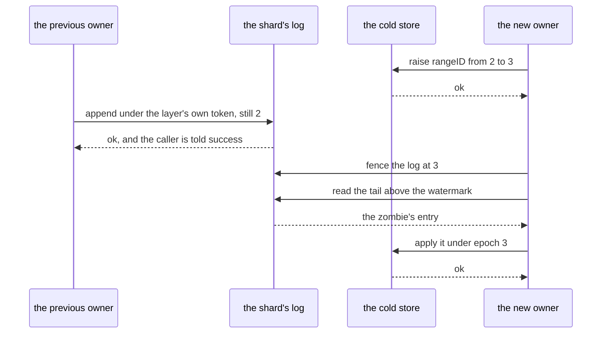
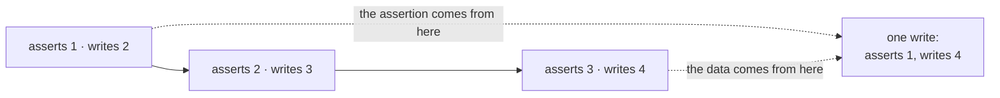
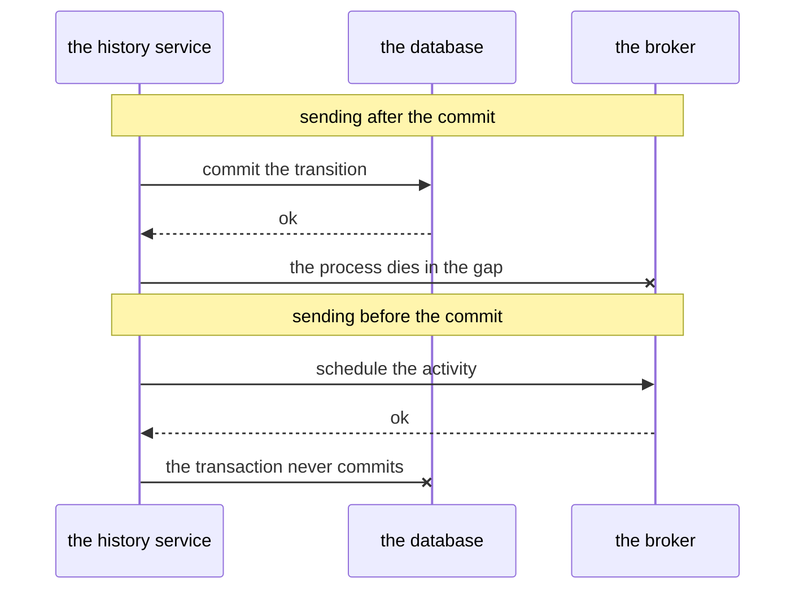

# The designs that were rejected

Many shapes in the earlier chapters look more complicated than they need to be. Usually a simpler
design was tried first and failed, and whoever changes the layer will think of it again. Each entry
gives the alternative in one italic line, the failure that ruled it out, and what stands instead.

---

## Ownership

### A lease with a timer

*The alternative: a node takes the shard for a period, renews the lease while it works, and stops
considering itself the owner when the term expires.*

A lease needs two machines' clocks to agree, and they do not. Worse, a node back from a long
garbage-collection pause, swap or a partition still believes it owns the shard: the lease is checked
by the one party that cannot tell, and that live old owner is the common case.

So the check fires where the write lands, when it lands: the log refuses an append under a
superseded epoch, and the drain registers the epoch assertion first in its transaction. A displaced
owner is not notified; it discovers the loss in one of three places:

| where | what it sees |
|---|---|
| an append | `wal.ErrFenced` |
| a drain | `apply.ClassShardLost`, or a watermark found past the seqno of a drain whose outcome was unknown, which carries `cycle.FencedAway` too |
| a replay | `cycle.FencedAway`, the cause it carries when the inherited tail holds an entry above this cycle's own epoch |

Until it writes, a displaced owner holds no lock and delays no successor ([chapter
06](06-shard-lifecycle.md#1-first-exclude-the-failed-owner)).

### Two ownership tokens, one for the log and one for the store

*The alternative: fence the log with a token of the layer's own and gate the cold store on Temporal's
`rangeID`, each mechanism correct on its own.*

Two tokens move in two writes, so one moves first, and either order lets through a *zombie*: the
previous owner, still running and still believing the shard is its own. If the new owner takes the
log first, the log refuses the zombie but the cold store, whose counter it still holds, accepts it,
and a mutation settles there that the log knows nothing about. If it raises the counter first, the
zombie's append is acknowledged and the new owner's replay launders it into the cold store under
epoch 3:

```mermaid
sequenceDiagram
    participant Z as the previous owner
    participant L as the shard's log
    participant C as the cold store
    participant N as the new owner
    N->>C: raise rangeID from 2 to 3
    C-->>N: ok
    Z->>L: append under the layer's own token, still 2
    L-->>Z: ok, and the caller is told success
    N->>L: fence the log at 3
    N->>L: read the tail above the watermark
    L-->>N: the zombie's entry
    N->>C: apply it under epoch 3
    C-->>N: ok
```

So both places obey one token: invariant I11, the epoch is the rangeID ([chapter
02](02-concepts-and-invariants.md#the-invariants)).

### Fencing only at the cold store

*The alternative: check ownership once, where the data finally settles, and leave the log ungated.*

A log entry is durable, the next owner must apply it, and its author was told success when the
append returned; no later gate can take that back. The append, not the drain, is the irreversible
boundary. So the log refuses the zombie at the append and the cold store again inside the drain's
transaction, neither replacing the other: invariant I4 ([chapter
02](02-concepts-and-invariants.md#the-invariants)).

### The shard's own writes, deferred into the log

*The alternative: put `UpdateShard` through the log like every other write, so one mechanism carries
everything the layer sees.*

This is circular: an append is accepted only under the epoch the log is fenced at, the epoch is the
rangeID, and the rangeID is set by the very shard write we would be appending.

So an acquire is two writes that cannot be atomic, fence first. `wrapper.ShardStore` observes
`UpdateShard` rather than intercepting it: it fences the log at the new epoch, then lets the base
store commit the row ([chapter 06](06-shard-lifecycle.md#1-first-exclude-the-failed-owner)). A
crash between the two leaves the log fenced over a row still at the old epoch: the old owner is
already cut off, and `Fence` is idempotent per epoch, so the retried acquire fences again and
commits the row.

---

## The log contract

### A batch of entries in one append

*The alternative: `Append` takes several payloads and writes them at consecutive seqnos as one
atomic unit, the shape a group commit would want.*

Most backends keep this easily, since their append is one transaction, statement, replicated
command or mutex-held splice. A log whose unit of atomicity is the row, such as an append-only
journal, cannot: a fence landing between two of a batch's rows leaves a prefix in the log. None of
`Append`'s three refusals (`ErrFenced`, `ErrAlreadyWritten`, `ErrGap`) can describe that prefix:
each says the write is whole, one way or the other. Worse, a writer that died mid-batch and retried
it is told `ErrAlreadyWritten`, the contract's success signal for a retry, and acknowledges seqnos
nobody wrote. The log cannot tell "it holds part of your batch" from "you changed your batch".

Both repairs built were worse than removing the batch:

* A new answer, "your batch was cut", in place of `ErrAlreadyWritten`, turns `waltest`'s
  `DuplicateSeqnoIsAlreadyWritten` red, rightly: on an atomic backend a partial overlap really is a
  caller changing its batch.
* A contract method publishing how many entries the backend writes indivisibly ("unbounded" or
  "one") works, but keeps a parameter one kind of backend must refuse, needs two versions of three
  conformance assertions, and makes every caller ask a question whose answer is "one" wherever that
  backend is deployed.

And the batch bought nothing: the layer calls `Log.Append` once per mutation from one place in
`cycle`, and a backend can still amortise an fsync across writers internally. So `Append` takes one
payload.

---

## The window

### A buffer inside the history service

*The alternative: let the history service accumulate transitions in memory and write to the store
less often, with no second durable thing between them.*

The server treats a write as done when the store returns, so a buffer must either answer before the
data is durable, and lose it if the process dies, or wait for the flush and accumulate nothing. And
the server reads its own writes one call later, through the same persistence interface, to rebuild
mutable state and check start conditions, so a buffer that does not answer reads breaks it at once.
The layer meets both: what it accumulates is durable in the log before the caller is answered, and
the window answers reads ([chapter 07](07-read-path.md)).

### A folded window as a concatenation of the store's own queries

*The alternative: keep the window's mutations as they arrived and re-issue them, one store request
at a time, inside one transaction.*

The first failure is arithmetic. A log entry is a whole store request, and every request shape
derives its condition from the version it is about to write. If the cold store holds version 1 of a
run's row and the window holds three updates that carried it to version 4, the drain's single write
must assert 1 and write 4. The last mutation asserts 3, which fails; the first writes 2, losing two
transitions. No request shape carries the pair (1, 4).

```mermaid
flowchart LR
  A["asserts 1 · writes 2"] --> B["asserts 2 · writes 3"] --> C["asserts 3 · writes 4"]
  A -. "the assertion comes from here" .-> R["one write:<br/>asserts 1, writes 4"]
  C -. "the data comes from here" .-> R
```

Issuing the requests one by one inside one transaction avoids the arithmetic but saves no database
work. Worse, a store's conditional query is usually concatenated per row, so no two batches share
query text and the database never reuses a compiled plan (about 3 statements and 1.1 KB of query
text per mutation in the research prototype's store, an order of magnitude only). A large enough
batch times out while still compiling; the layer treats the timeout as an unknown outcome, reads its
watermark, finds the batch absent and halts the cycle `halted-invariant`, leaving the entries in the
log for the next owner.

So a fold's output is a request plus separately carried assertions (`fold.WorkflowRecord.Current`
and `fold.Emitted.RunAssertions()`), which the applier uses in place of the conditions the request
shapes would derive. The query's shape then depends on the kinds of assertion and delete families in
the batch, never on how many mutations it folded ([chapter 05](05-write-path.md#2-the-drain-itself)).
That property belongs to the deployment's applier, so the drain query-shape guard is one of the two
a deployment builds itself ([chapter 11](11-verification.md#the-guards)): drive a real drain at a
window of 64 and assert that its largest transaction stays a constant number of statements.

### Promised work as a message to a broker

*The alternative: when a transition schedules an activity or sets a timer, send the work to an
external broker instead of writing a row beside the state.*

The work must be exactly as durable as the transition that made it: if it is lost, the workflow
waits forever for an activity nobody dispatched, and nothing detects it, because the state looks
healthy. Neither order of the two writes is safe. Sent after the commit, the work is lost if the
process dies in between; sent before, it is dispatched for a state that never arrives. A two-phase
commit closes both gaps by coordinating a second system on every transition, the cost that makes a
transition expensive in the first place.

```mermaid
sequenceDiagram
    participant S as the history service
    participant DB as the database
    participant B as the broker
    Note over S,B: sending after the commit
    S->>DB: commit the transition
    DB-->>S: ok
    S-xB: the process dies in the gap
    Note over S,B: sending before the commit
    S->>B: schedule the activity
    B-->>S: ok
    S-xDB: the transaction never commits
```

Temporal instead writes the work, a history task, as a row in the same conditional write as the
state. The layer keeps this: task rows ride the drain transaction with the merged requests, and both
task calls, `AddHistoryTasks` and `RangeCompleteHistoryTasks`, travel the log rather than going
straight to the cold store. Otherwise the range delete would take effect at a different moment from
the writes it covers, and could leave behind rows it was meant to cover or delete a timer created
after the caller's checkpoint ([chapter 02](02-concepts-and-invariants.md#tasks)).

---

## Reads

### Extending the server's own hold-back

*The alternative: reuse Temporal's own hold-back, in which the shard keeps each queue's exclusive
reader high watermark below task-writing requests still in flight, and stretch it over the window.*

`getExclusiveReaderHighWatermark` releases the hold when the persistence write returns success,
through a completion function the shard's in-flight task tracker hands the write path. Under this
layer the persistence write returns at the log append, while the tasks are still only in the window,
so the hold comes off too early, every time. The tracker lives above the persistence boundary, so
the layer's only lever is when its write returns, and answering after the drain commits gives up the
early acknowledgement. So the window's tasks are merged into the page the queue asked for ([chapter
07](07-read-path.md#4-merge-tasks-two-ordered-sources-one-page)).

### A readiness gate

*The alternative: refuse reads, or make them wait on a flag, while the window is non-empty or a drain
is in flight.*

Refusing is wrong: while a drain is in flight the shard is ours and the state is known. Waiting on a
flag rebuilds the request queue the cycle already is, and adds a failure: the flag drifting out of
step with the state it describes.

Instead a read is a job on the shard's cycle goroutine, the one that runs the drain, so no read can
observe the gap between the window emptying and the transaction committing. Replay runs there too,
lazily: the first request to reach the shard, read or write, triggers it, and it completes before
that request is answered. Readiness comes from where the work runs, not from a flag (`Cycle.start`,
which the read path reaches through `Cycle.startForRead`; [chapter
07](07-read-path.md#2-routing-a-read-and-drainonread)).

### Answering from the cold store while the window catches up

*The alternative: serve reads from the cold store and let the window converge behind them.*

This makes reads wrong, not just stale: the server computes its next transition from what it reads,
so an answer missing an acknowledged write undoes it. A variant answers with the window's state but the base row's version. The server's next conditional
write then asserts a version nothing will ever write, and every later write fails its condition. The
overlay hands out the tail's version, the one the window's merged request will write ([chapter
07](07-read-path.md#3-overlay-mutable-state-base-plus-acknowledged-change)).

### A materialised per-run state, or an index over the window's tasks

*The alternative: keep a rendered copy of each run's state, and a secondary index over the window's
tasks, so a read does not walk the accumulator.*

Each is a second structure that must reproduce the window's whole lifecycle: empty when a drain
starts, reset when the cycle stops, untouched when a fold is refused, rebuilt with replay on every
change of owner. A wrong materialised state is a silently wrong read. A wrong task index hides a
task, the loss the merge exists to prevent: the queue reads a range, finds nothing, completes it,
and acks past a key it never saw.

Both also move work from the poll to the acknowledgement, on the same cycle goroutine, so the hot
path gains rather than loses it. Instead a scan serves the task page ([chapter
07](07-read-path.md#4-merge-tasks-two-ordered-sources-one-page)), and `fold.RunView.Render` builds a
private copy per call and discards it. A window scan per page is cheap while a window carries tens
of tasks per category: a judgement about size, since the shipped window of 256 mutations
(`wal.windowMutations`) does not produce thousands and a much larger one might.

---

## Judging it

### A unit test per fold rule

*The alternative: for each rule the fold applies, a test asserting that the code does what the rule
says.*

Such a test checks that the code follows the rule; what is in doubt is whether the rule is right.
The fold has no specification of its own, by choice: rules in Temporal's terms would be a second
implementation of the server's semantics, diverging the same day. The fold is correct when the
result matches what the server would have written without it. Per-rule tests, and every other
instrument, missed two divergences in the current-execution row.

The first is who writes the row. A snapshot-bearing request (a create, a set, a conflict-resolve)
resets the run's accumulator, and the first one in a window gives the merged request its kind; a
later one replaces the snapshot but not the kind. But the current-execution row is a last-writer
effect, so a fold that rendered it from the merged request's kind dropped what the later requests
wrote: right keys, right types, wrong value. `fold.WorkflowRecord.CurrentWrite` carries that last
write separately from the kind.

The second is the form of the row. The update path re-serialises the mutation's own execution
state; every kind that carries a whole run and writes the row (a create, a conflict-resolve, a
continue-as-new) passes the snapshot's blob through untouched; a set does not write it at all. One
rendering for all yields a row right in every field a reader checks and different in bytes.

Only a differential run against the incumbent found them. It fed the same stream through the fold
and through an unwrapped store's own write path; only that comparison can see a rendering, because a
fold of one mutation goes through the same rendering function. It does not ship here.
`TestCurrentWriteTracksTheLastWriter` in
[`../../fold/currentwrite_test.go`](../../fold/currentwrite_test.go) now pins both: the write that
survives a window whose first snapshot-bearing request is a set, and each kind's rendering byte for
byte.

The second divergence had also been recorded as deliberate: a conflict-resolve was read as writing
a reduced state (run id, create request id, state and status), where upstream passes the snapshot's
own blob. The cost was durable: the `start_time` column landed NULL and every non-create request id
was dropped. Nothing back-fills either, so a namespace's `WorkflowIdReuseMinimalInterval` measures
every reuse interval against the zero time and never refuses again. The correct rendering,
`currentWriteOfSnapshot`, was less code and already used by every other snapshot-bearing kind.
Record a divergence only with what it buys; this one bought nothing, and the missing run is what let
it stand.

What ships is the oracle, `TestFoldingChangesNothingButTheNumberOfTransactions`: one generated
stream into two databases, at the shipped window and at a window of one mutation, required to end
identical ([chapter 11](11-verification.md#the-fold-against-not-folding)). Both arms land in
`cold/memcold`, so a common defect cancels, and nothing in it speaks for the schema, row layouts or
condition failures of a deployment's store. A deployment should rebuild the comparison over its own
store instead of writing per-rule tests, and pin with a unit test what it finds.

### A golden dump

*The alternative: record the cold store the sequential path produces, check it in, and compare later
runs against it.*

Checking in today's output makes today's defects the definition of correct, and a recording is
silent when the incumbent's behaviour changes, the one event the comparison exists to notice. So the
baseline is a live second run of the incumbent, in the same process, against a second instance of
the same store. `internal/verify/acceptance` records nothing: its stream comes from a seed, and
its collapse ratio is asserted against a control run at the other end of the locality knob, not
against a stored value ([chapter
11](11-verification.md#the-acceptance-one-stream-through-the-fold)).

---

## Summary

Ownership is checked where the write lands, under one token: a lease is judged by the wrong node,
two tokens let a zombie through in either order, and an ungated log acknowledges what it should
refuse. The shard's own write cannot go through a log fenced by the epoch it sets. `Append` takes
one payload: a batch has no honest answer on a row-atomic log, and nothing needed it.

The window answers to two facts about the server: it treats a returned write as durable, and it
reads its own writes one call later. The fold carries its assertions separately so a drain's query
shape does not grow, and promised work stays in the drain transaction with its state.

Reads run on the cycle goroutine and merge the window's tasks into the queue's page by a scan.
Correct means agreeing with the unfolded server, so the instrument is a live differential run, not a
per-rule test or a golden recording.

---

## Where this lives in the code

* [`../../wal/refuse.go`](../../wal/refuse.go) — the append's refusals: `ErrZeroEpoch` for no epoch,
  `ErrFenced` for one the log is not fenced at, and the order that puts `ErrFenced` ahead of
  `ErrAlreadyWritten`.
* [`../../wal/wal.go`](../../wal/wal.go) — `Append`, one payload per call.
* [`../../apply/failure.go`](../../apply/failure.go) — `ClassShardLost`, one of the three places
  ownership loss is discovered, and `Attribute`, which reads back every row a failed drain asserted
  and names the ones that diverged.
* [`../../wrapper/shard_store.go`](../../wrapper/shard_store.go) — `UpdateShard` observed rather
  than intercepted: the log fenced at the new epoch before the rangeID lands.
* [`../../cycle/replay.go`](../../cycle/replay.go) — the successor applying an inherited tail.
* [`../../cycle/read.go`](../../cycle/read.go) — reads on the shard's cycle goroutine, and
  `startForRead`.
* [`../../fold/fold.go`](../../fold/fold.go) — `WorkflowRecord`, `CurrentWrite` and
  `Emitted.RunAssertions()`: the assertions a merged request cannot carry itself.
* [`../../fold/assert.go`](../../fold/assert.go) — each kind's rendering of the current-execution
  row.
* [`../../fold/overlay.go`](../../fold/overlay.go) — `RunView.Render`, which copies and discards
  rather than materialising.
* [`../../fold/tasks.go`](../../fold/tasks.go) — the scan, and the recorded reason there is no
  index over it.
