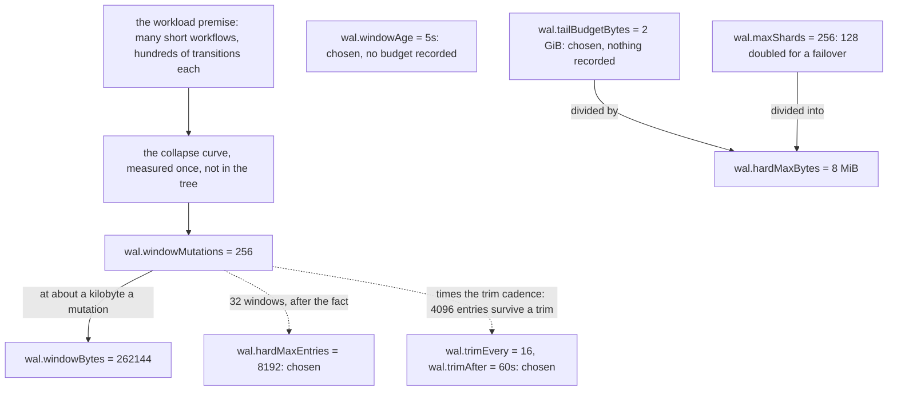

# Where the defaults came from

[Chapter 08](08-configuration.md#3-table-2--the-nine-dynamic-config-settings) gives every shipped
number and says what it bounds. This chapter says where each one came from, and sorts the nine into
two piles: defaults that follow from a measurement or from another default, and start values nobody
has re-derived since. It is for whoever is about to move one.

## The rule this chapter follows

A shipped number here is one of two things.

**Derived.** It follows from a measurement, from another default, or from arithmetic the node asserts
before it boots. Move it on its own and you get either a policy that no longer adds up or a node that
refuses to start.

**Chosen.** A start value that answered the question at the time and that nothing has since
re-opened. Nothing derives it.

Where a number is chosen, this chapter says so in as many words. That is the whole point of having
the chapter: **a constant given an invented rationale is worse than a constant given none**, because
the invention passes review, and the next reader treats a sentence somebody made up as a constraint
they may not cross. Everything below either names the derivation or states that the project records
none.

A second division cuts across the first. Some justifications are **re-derivable**: open the file,
read the constant, do the arithmetic. Others are **observations** — a curve measured once, on one
machine, at one revision. An observation is not worth less, but it is worth exactly what the saved
result says and no more, and this chapter marks which of the two stands behind each number.

**Every observation below was made on the research prototype this library was extracted from, on one
workload against one store.** None of them can be re-run here. The two backends in this tree,
`wal/memwal` and `cold/memcold`, exist to exercise the layer in process, so a curve taken against
them would describe a map under a mutex and a SQLite database in memory. The observations are quoted
so you know a number had evidence behind it, and attributed so nobody mistakes that evidence for
their own deployment's.

## The premise under all of them

Every number below sits somewhere on a curve, and the curve is drawn by a workload:
[chapter 01](01-overview.md#a-workflow-writes-more-history-than-it-keeps)'s picture of many
thousands of workflows, each moving through hundreds of state transitions and dying within seconds,
rewriting the same mutable-state rows dozens of times on the way.

**That profile is an assumption, and nothing in the project turns it into an observation.** No
profile of a named installation, no vendor figure, no measurement of a deployment — it is the
design's accepted starting point, and it was accepted rather than established. This matters more
than any single default, because every benefit the layer claims scales with it.

Consider the opposite shard: workflows that are long-lived and quiet, each touched at most once
inside a window. Such a window has nothing to merge, and `fold.Stats.CollapseRatio` — mutations in
over dirty workflows out — reports 1.00 for it: one merged request written for every mutation acked.
That is the layer doing bookkeeping and no folding, and 1.00 reads like a passing number rather than
like the warning it is.

None of that makes the defaults wrong for such a deployment. They are points chosen on a curve that
deployment does not sit on, and an operator whose workload is that shape is entitled to re-derive
them rather than inherit them.

## The drain triggers: 256 mutations and 256 KiB

`cycle.Defaults()` ships `Mutations: 256` and `Bytes: 256 << 10`. The field comment beside them in
`cycle/cycle.go` calls the pair the measured collapse knee, and adds that "changing either means
re-measuring".

**The mutation trigger is the one default here with a real curve behind it.** The measurement
swept the window and read the collapse off it: 128 mutations buys about 89% of the achievable
collapse, 256 buys 99.6%, and above that the curve is flat while the worst-case tail keeps growing.
256 is therefore not a preference — it is the last point on the curve that pays for itself.

The curve was measured on the research prototype, and **nothing in this tree re-runs it.** What
survives in the code is the conclusion: the constant, and the word "knee" in the comment beside it.
If you want the curve, you will have to write the measurement yourself. It is also a curve of one
workload — the collapse a window buys is a function of how often a deployment re-touches a workflow
inside one window — so 256 is a defensible start value and not a number to inherit without looking.

Two facts about the shipped triggers that are easy to mis-read:

* **the byte trigger is the mutation trigger restated, not a second measurement.** 256 KiB is
  256 mutations at about a kilobyte each, and the kilobyte is rounded up: the generated corpus
  averages 572 encoded bytes a mutation — the acceptance's own configuration, and re-measurable here
  rather than inherited — so 256 of them come to about 143 KiB. On a stream of that shape the
  mutation trigger is always the one of the two that fires. The byte trigger earns its place on the
  other shape — 256 mutations carrying large payloads, which would otherwise become one outsized
  transaction;
* **the size trigger is not the effective window, and under load it is not even what fires.** A
  window holding a shape `fold` cannot express is force-drained on the spot (`fold.ErrRefused`), and
  that happens often enough to set the pace by itself. In `TestAcceptanceFoldNoCluster`, at a
  configured window of 1024 and a hot set of 32 workflows, about one mutation in a hundred is
  refused and drains average roughly 90 mutations, under a tenth of the window the test asked for.
  The same shape held at cluster distance on the research prototype: at a window of 256 every drain
  was a refusal drain, and the size trigger never fired inside a test at all.

That refusal cadence is what matters when you tune: **raising the mutation trigger above it changes
nothing**, because the window is already being cut short by a mechanism the trigger does not control.

## The age trigger: five seconds

`Age: 5 * time.Second`. The field comment is explicit about the number's standing: "a
recovery-budget choice, not a measured one". The collapse curve does not constrain it, because under
load the refusals and the size triggers drain first. What the age governs is the **idle** tail, and
therefore what a successor would have to replay after a hard restart of a shard nobody was writing
to.

**Out of what budget?** Nothing in the project says. No design note, no code comment, no test and no
configuration note names an acceptable recovery time or a failover duration the layer is meant to fit
inside. The design the layer was built from recorded the choice as explicitly unmeasured and gave a
range to pick a value out of; what would justify one point inside that range — how long a shard may
take to come back, and why that long — is written nowhere. So the honest statement is the short one:
**five seconds is chosen, and the quantity it was chosen against is not recorded.**

Two things the number does *are* recorded, and they bound how far it may sensibly move:

* **it is also the re-ask cadence for a stalled applier.** A cycle whose last drain had no readable
  outcome refuses its writers and its readers. No write arrives to bring a drain with it, so the age
  tick is the one clock it has left to re-ask the cold store with. Raising the age therefore
  lengthens the shortest possible stall, not just the idle tail;
* **a run that samples the layer's counters has to wait it out.** A suite's last writes land in its
  final seconds, so a sample taken the moment the workflow finishes sees a full window and no drain
  at all. The end-to-end run does exactly that wait: `waitForDrain` in `internal/verify/e2e` polls
  the layer's totals until a drain appears, and gives the five-second trigger up to `drainWait`,
  60 seconds, to fire.

## The trim cadence: 16 drains or 60 seconds

`TrimEvery: 16` and `TrimAfter: 60 * time.Second`. What the code records is a floor rather than a
derivation: at `TrimEvery: 1`, a trim is a `DeleteRange` per drain — a transaction per drain for no
gain. Nothing records why 16 rather than 8 or 32, and nothing records why 60 seconds. They are start
values, free to move on read-cost grounds. **Both are chosen.**

What the pair derives matters more than where it came from, because it is the bound a post-mortem
depends on: how much of the log is still there when you go looking. Trim goes to the committed
applied watermark **with no safety lag**, so what survives is at most `TrimEvery × Mutations`
entries, plus whatever the tail currently holds. At the shipped defaults that is 16 × 256 =
**4096 entries**, and it is the same 4096 whether the shard has been running for a minute or a
month. The time trigger only shortens it: a low-traffic shard trims at 60 seconds whether or not
sixteen drains have happened.

The two triggers are therefore one knob and not two, and a run that needs the whole log has to move
**both**. Raise `TrimEvery` alone and `TrimAfter` deletes the history anyway, and the run comes back
red against a layer that did nothing wrong.

## The per-shard tail bound: 8192 entries and 8 MiB

`HardMaxEntries: 8192` and `HardMaxBytes: 8 << 20` are invariant
[I10](02-concepts-and-invariants.md#i10-at-more-length)'s bound on one shard's tail. The two halves
have different provenance, and you should know which one you are holding before you re-tune it.

**`hardMaxBytes` is arithmetic.** It is the node's tail budget divided by the shards one node may
own: 2 GiB over 256 shards is 8 MiB. That is the whole derivation, and it means the number cannot be
raised by itself — the product is asserted at start-up.

There is a second reading of the same number, and it is a sanity check rather than the origin:
against the 256 KiB trigger, 8 MiB is **32 windows**, so the applier can fall thirty-two windows
behind before the shard starts refusing writes. By then you are looking at a cold-store incident and
not a burst.

**`hardMaxEntries` is chosen.** 8192 follows from no record size, no replay time and no measurement
in the tree. The only structure available is the same arithmetic against the triggers, and it holds
in both units — 8192 = 32 × 256 mutations, and 8 MiB = 32 × 256 KiB — so each half of the bound is
exactly thirty-two windows of its own trigger. **That is a fact about the shipped defaults and not a
documented intent**, and it stops holding the moment somebody moves a trigger without moving a
bound.

### Why the bound counts entries as well as bytes

The field comment on `Config.HardMaxEntries` gives the rule in one sentence: neither unit works
alone, because "one workflow near the server's 8 MB mutable-state limit turns an entries-only bound
into a byte budget with no ceiling, and bytes alone bound no replay". Both halves of that are
load-bearing, and they bound two different resources.

* **Bytes bound memory.** The tail lives in the heap of the process running the history service, so
  what it costs is bytes. The server's own limits admit a 2 MB event blob (`limit.blobSize.error`)
  and 8 MB of mutable state per execution (`limit.mutableStateSize.error`), and a shard writing
  mutations near those sizes fills 8 MiB in a handful of entries — four, at 2 MB apiece — where the
  entries bound would happily have let it hold 8192. An entries-only bound would never notice.
* **Entries bound recovery time.** A successor inherits every acknowledged, unapplied entry of every
  shard it picks up, and must decode it, fold it and carry it into the cold store. That work is *per
  entry*, so the time to bring a shard back is proportional to the number of entries in its tail and
  not to their size. A bytes-only bound would let a shard accumulate an arbitrarily long tail of
  small mutations while staying under budget, and the price would be paid entirely by whoever picked
  the shard up.

The corpus makes the gap between the two units concrete: its entries are tight, at a mean of 572
bytes, while the server's own limits allow a single mutation thousands of times that: some three and
a half thousand at the 2 MB blob, fourteen thousand at 8 MB of mutable state. A bound stated in one
unit is a bound that admits the other unit's worst case unchecked.

Which unit tripped is on the refusal's `limit` tag, and its two unit values are different operator
sentences. `bytes` says this node is close to holding more than it should, which
[`cycle/decide.go`](../../cycle/decide.go) reads as one workflow near the server's own blob limits.
`entries` says a failover would take longer than it should, which the same file reads as an applier
that is simply behind. The refusal itself is [chapter
05](05-write-path.md#4-failed-write--backpressure-i10)'s.

## The node budget: 256 shards and 2 GiB

`MaxShards: 256` and `TailBudgetBytes: 2 << 30` are the node's half of the same arithmetic.

**`maxShards` is derived one step, and chosen underneath it.** The code says what the step is: 256 is
what one node may own *at once* — not the cluster's shard count — because it is 128 in steady state,
doubled for a failover. The doubling is the recorded reasoning. The 128 is not: nothing in the tree
says where a steady-state ownership of 128 shards per node comes from.

**`tailBudgetBytes` is chosen, and everything below it inherits that.** Nothing in the tree — code
comment, configuration surface, test or script — records where 2 GiB came from. It is not a fraction
of a node's RAM, not an observation of a deployment, and not the result of a measurement; it is an
absolute. Since `hardMaxBytes` is that number divided by `maxShards`, the per-shard bound is exact
arithmetic over a number nobody derived.



How to read this. A solid edge is a derivation the tree records. A dotted edge is arithmetic that
happens to hold at the shipped defaults and derives neither of the numbers it joins: what it produces
is the figure written on the edge, not the node it points at.

Do not read the arrows as permission to move something. `AGE` and `TB` have no incoming edge and are
chosen — but so are `HE` and `TR`, whose incoming edges are arithmetic standing beside the number
rather than a derivation of it. `MS` has no incoming edge for a third reason again: the assumption
under it, 128 shards per node in steady state, is nowhere in the tree to draw from.

### What the start-up check does and does not promise

The three numbers meet in one assertion:

```
hardMaxBytes × maxShards  ≤  tailBudgetBytes
```

`cycle.Config.CheckBudget` states it, `cycle.NewManager` runs it before it returns a manager, and
`waltz.Compose` therefore fails over it — before the layer has opened anything, since composing
reaches no cluster. At the shipped defaults the product fits exactly: 8388608 × 256 = 2147483648.
There is no headroom, so raising either factor without raising the budget gives you a node that
refuses to start. [Chapter 08](08-configuration.md#5-the-budget-refusal) owns that refusal.

**It is a budget of encoded bytes, and not a promise about heap.** `Config.CheckBudget` says so in
its own doc comment: what is resident is decoded protos plus the accumulator's indices, not the wire
format the budget counts. Size a node by reading 2 GiB as a memory figure and you will size it
wrong; the next section says by how much. [Chapter 08's key table](08-configuration.md#3-table-2--the-nine-dynamic-config-settings)
carries the same warning on the cell itself, because that cell is what an operator reads.

## What the budget costs resident

If the budget counts encoded bytes, how much heap does a byte of budget actually cost? That question
has a measurement behind it, taken on the research prototype rather than here.

The probe filled one accumulator the way a stuck applier leaves one — drained only when fold refuses,
every drained batch held exactly as an unfinished apply holds it — and weighed the live heap against
a second pass that generated the same stream and threw it away. It needed no cluster, so of every
measurement in this chapter it is the one easiest to rebuild. Two locality settings, three tail
sizes:

| workflow reuse | encoded | mutations | collapse in/out | resident bytes | resident per encoded byte |
|---:|---:|---:|---:|---:|---:|
| 0.0 | 262 KB | 426 | 1.03 | 2160088 | 8.22 |
| 0.0 | 1 MB | 1717 | 1.04 | 8559120 | 8.16 |
| 0.0 | 8 MB | 13726 | 1.05 | 68029576 | 8.11 |
| 0.8 | 262 KB | 451 | 1.12 | 2207256 | 8.40 |
| 0.8 | 1 MB | 1790 | 1.15 | 8699128 | 8.29 |
| 0.8 | 8 MB | 14285 | 1.14 | 69451960 | 8.28 |

The table has one reading, and it is flatter than the two knobs suggest. **The multiplier is about
8.2× and it does not move**: all six points — a 32× range of tail sizes crossed with both locality
settings — lie between 8.11 and 8.40, so that is what a byte of encoded tail cost resident there.

What the probe does *not* show is a locality effect, and the collapse column says why. The probe caps
no workflow pool, so a reuse of 0.8 collapses barely more than 0.0 does: 1.12–1.15 against 1.03–1.05.
Neither run had much to merge, so neither tells you what a genuinely collapsing tail would save.

So `hardMaxBytes` at 8 MiB is on the order of 68 MB resident per shard, and the shipped node
budget — 2 GiB over 256 shards — is around **17 GB of live heap** if every shard sat at its bound.
That state is only reached with the appliers stuck, which is the incident the bound exists to
survive.

The order in which those numbers were established is the provenance point, and it inverts the way
they read: **2 GiB of encoded budget was picked first, and its resident cost was measured
afterwards.** The 17 GB is a consequence of the choice, not the constraint that produced it.

## A small window costs more than it looks: the research prototype's 16

Nothing in this repository ships a window of 16. It is recorded here because anyone driving
upstream's functional suites over waltz has to pick a small window, and this is what happened to the
last person who did.

The research prototype drove two of upstream's functional suites at a **window of 16** rather than at
the shipped 256, wanting several drains inside a run rather than none.

**Why not 2**, which it used before: measured, and rejected. At a window of 2 a shard's loop spends
most of its time inside a drain transaction, and every write and read for that shard queues behind
it. On a single emulated node that was enough to push upstream's timing-sensitive suites past their
own deadlines: `TestSignalWorkflowTestSuite`, `TestAddTasksSuite` and `TestUserTimersTestSuite` were
reproducibly red there. All three are green at the shipped window of 256, and green at 16.
[Chapter 08's small-window recipe](08-configuration.md#6c-a-small-window-for-testing) sets 2, so this
is the caveat to carry into it.

**Why 16 and not any other value between 2 and 256:** not recorded. What was recorded is that it is
green, that it still produces several drains where 256 would produce none, and that it is affordable.
That is a chosen number with a measurement standing next to it rather than under it: what was
measured is the *rejection* of 2, not the selection of 16.

One caveat travels with the rejection of 2 and not with the choice of 16: what a window of 2 costs
was measured on one emulated single-node cluster, so it describes that cluster. The transferable part
is the shape — **a window small enough to drain on nearly every write serialises a shard behind its
own drains**, and the symptom is somebody else's timing-sensitive suite going red rather than
anything this layer reports.

## Derived, chosen, and what that buys the reader

| number | value | where it came from | kind |
|---|---|---|---|
| `wal.windowMutations` | 256 | the knee of a collapse curve, measured once and not re-runnable in the tree | derived from an observation |
| `wal.windowBytes` | 262144 | the same knee converted at about a kilobyte a mutation | derived by conversion |
| `wal.windowAge` | 5s | a recovery budget nothing records | chosen |
| `wal.trimEvery` | 16 | a start value; only its floor is argued | chosen |
| `wal.trimAfter` | 1m0s | a start value | chosen |
| `wal.hardMaxEntries` | 8192 | nothing; it is 32 windows of the mutation trigger after the fact | chosen |
| `wal.hardMaxBytes` | 8388608 | `tailBudgetBytes ÷ maxShards` | derived, arithmetic |
| `wal.maxShards` | 256 | 128 in steady state, doubled for a failover; the 128 is not recorded | derived from an assumption |
| `wal.tailBudgetBytes` | 2147483648 | nothing | chosen |

**A chosen number is not a defect.** It is a number an operator may move on their own evidence,
because there is no derivation to argue with — and knowing which numbers those are is what makes the
rest of the table usable. Five of the nine above have nothing under them, and those five are where
somebody with a real workload has the most to gain and the least to contradict.

The four derived ones are not derived alike. `windowMutations` and `windowBytes` rest on a
measurement taken elsewhere, on one workload against one store — which does not make them wrong, but
does make them start values with an argument attached rather than constants. `hardMaxBytes` is
arithmetic over `tailBudgetBytes`, and `tailBudgetBytes` is itself chosen. `maxShards` doubles an
assumption nobody wrote down.

What "derived" does buy you is that the number resists being moved on its own. Three ways it
resists, and only the first two announce themselves:

* the three factors of the budget product are checked before the node boots, so raising one of them
  is a refusal to start until the others follow;
* `hardMaxEntries` and `hardMaxBytes` are two units of **one** bound, which is why both are read once
  at start-up: a node honouring one of them from a different edit than the other is a bound nobody
  wrote;
* moving a drain trigger silently re-scales the two arithmetics that stand on it — the 32 windows
  of tail and the 4096 entries of surviving log — because neither is enforced anywhere. Nothing goes
  red; the two ratios simply stop being what this chapter says they are.

For anyone adding a constant to this layer: put the derivation in the code beside it, or expect a
chapter like this one to record that there is none.

## Where this lives in the code

* [`../../cycle/cycle.go`](../../cycle/cycle.go) — `Config` and `Defaults()`: every number above,
  each with whatever justification the tree has, plus `CheckBudget` and the rule that the budget
  counts encoded bytes.
* [`../../settings.go`](../../settings.go) — the same nine numbers as dynamic-config settings,
  taking their defaults from `cycle.Defaults()` by reference, with the live/start-up split stated
  per setting.
* [`../../cycle/trim/trim.go`](../../cycle/trim/trim.go) — the cadence's two triggers, whichever
  trips first, and why the trim runs beside the loop rather than in it.
* [`../../internal/verify/acceptance/acceptance_fold_test.go`](../../internal/verify/acceptance/acceptance_fold_test.go)
  — the effective window: the refusal rate, the average drain, and the hot-set knob behind them.
* [`../../internal/verify/e2e/e2e_test.go`](../../internal/verify/e2e/e2e_test.go) — `waitForDrain`
  and `drainWait`: what a run over a real server has to allow the age trigger.
