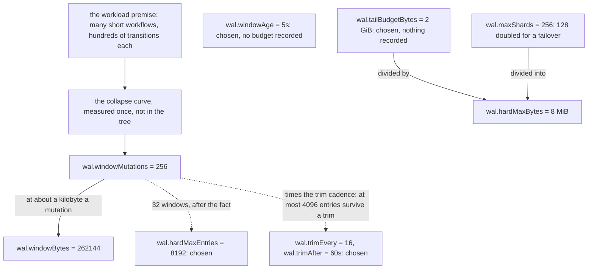

# Where the defaults came from

Nine numbers ship as defaults: three drain triggers, two trim triggers, two halves of the tail
bound and two node-level numbers. [Chapter 08](08-configuration.md#3-table-2--the-nine-dynamic-config-settings)
says what each one bounds. This chapter says where each came from, so that whoever moves one knows
whether they are crossing an argument or only a habit.

## The rule this chapter follows

Each shipped number is one of two kinds.

* *Derived*: it follows from a measurement, from another default, or from arithmetic the node
  asserts before it boots. Move it alone and the policy no longer adds up, or the node refuses to
  start.
* *Chosen*: a start value that answered the question at the time and that nothing has re-opened.

Where a number is chosen, the chapter says so and gives no invented reason, since an invented
rationale passes review and then reads as a constraint.

A second division cuts across the first. Some justifications are *re-derivable*: read the constant
and do the arithmetic. Others are *observations*: a curve measured once, on one machine, at one
revision, worth what the saved result says and no more.

Every observation below was made on the research prototype this library was extracted from, on one
workload against one store, except two that a test in this tree measures: the generated corpus's
mean entry size and its refusal cadence. The prototype's measurements cannot be re-run here, and a
curve taken against `wal/memwal` and `cold/memcold` would describe a map under a mutex and an
in-memory SQLite database. The observations are quoted to show a number had evidence, and attributed
so nobody mistakes it for their own deployment's.

## The premise under all of them

Every number below is a point on a curve, and a workload draws the curve: the one in
[chapter 01](01-overview.md), many thousands of short
workflows, each moving through hundreds of state transitions and rewriting the same mutable-state
rows dozens of times before it ends.

That profile is an assumption: no named installation, vendor figure or deployment measurement stands
behind it. Every benefit the layer claims scales with it.

On the opposite shard, long-lived quiet workflows each touched at most once per window, there is
nothing to merge. `fold.Stats.CollapseRatio` (mutations in over dirty workflows out) reports 1.00:
bookkeeping and no folding, in a number that looks like a pass rather than a warning. The defaults
sit on a curve such a deployment is not on, and its operator should re-derive them.

## The drain triggers: 256 mutations and 256 KiB

`cycle.Defaults()` ships `Mutations: 256` and `Bytes: 256 << 10`. The comment beside them in
`cycle/cycle.go` calls the pair the measured collapse knee and adds that changing either means
re-measuring.

The mutation trigger is the one default with a real curve behind it. The measurement swept the
window size and read the collapse off it: 128 mutations buys about 89% of the achievable collapse,
256 buys 99.6%, and above that the curve is flat while the worst-case tail keeps growing. 256 is the
last point on the curve that pays for itself.

Nothing in this tree re-runs that curve. The code keeps only the conclusion, the constant and the
word "knee". The curve is also one workload's, since the collapse a window buys depends on how often
a workflow is re-touched inside one window. So 256 is a defensible start value, not a number to
inherit without looking.

The byte trigger is the mutation trigger restated, not a second measurement. 256 KiB is 256
mutations at about a kilobyte each, rounded up. The generated corpus, which the acceptance uses and
which can be re-measured here, averages 572 encoded bytes a mutation, so 256 of them come to about
143 KiB. On a stream of that shape the mutation trigger always fires first. The byte trigger exists
for the other shape: 256 mutations with large payloads, which would otherwise become one outsized
transaction.

Under load, neither size trigger usually fires. A window holding a shape `fold` cannot express is
drained on the spot (`fold.ErrRefused`), often enough to set the pace.
In `TestAcceptanceFoldNoCluster`, at a configured window of 1024 and a hot set of 32 workflows, about
one mutation in a hundred is refused and drains average roughly 90 mutations, under a tenth of the
configured window. The research prototype saw the same at cluster distance: at a window of 256 every
drain was a refusal drain, and the size trigger never fired inside a test.

So raising the mutation trigger above the refusal cadence changes nothing.

## The age trigger: five seconds

`Age: 5 * time.Second`. The field comment states its standing: a recovery-budget choice, not a
measured one. The collapse curve does not constrain it, because under load refusals and the size
triggers drain first. The age governs the idle tail: what a successor would replay after a hard
restart of a shard nobody was writing to.

Five seconds is chosen, and the budget it was chosen against is not recorded. No design note, code
comment, test or configuration note names an acceptable recovery time or failover duration. The
design document the layer was built from called the choice unmeasured and gave a range, but not what
would justify one point in it.

Two things the number does are recorded, and they limit how far it can sensibly move:

* It is also the re-ask cadence for a stalled applier. A cycle whose last drain had no readable
  outcome refuses its writers and readers, so no write arrives to bring a drain with it. The age
  tick is the only clock left to re-ask the cold store. Raising the age lengthens the shortest
  possible stall, not only the idle tail.
* A run that samples the layer's counters must wait it out. A suite's last writes land in its final
  seconds, so a sample taken as the workflow finishes sees a full window and no drain.
  `waitForDrain` in `internal/verify/e2e` polls the layer's totals until a drain appears, and gives
  the five-second trigger up to `drainWait`, 60 seconds.

## The trim cadence: 16 drains or 60 seconds

`TrimEvery: 16` and `TrimAfter: 60 * time.Second`. The code records a floor, not a derivation: at
`TrimEvery: 1` every drain is followed by a `Log.Trim`, a transaction per drain for no gain. Nothing
records why 16 rather than 8 or 32, or why 60 seconds. Both are chosen, and free to move on
read-cost grounds.

What the pair implies matters more: how much log a post-mortem will find. Trim goes to the
committed watermark with no safety lag. While trims succeed and none is in flight when the cadence
comes due, at most `TrimEvery × Mutations` entries survive, plus
whatever the tail holds. At the shipped defaults that is 16 × 256 = 4096 entries, whether the shard
has run for a minute or a month. A failed trim is retried at the next cadence, and a cadence that
comes due while a trim is in flight is skipped, so either leaves more behind until then, never less.
The time trigger and storage pressure only shorten it: a low-traffic shard trims at its first drain
past 60 seconds, and pressure forces a trim outside the cadence. So the two triggers are one knob. A
run that needs the whole log must raise both, or `TrimAfter` trims it anyway and the run fails
against a layer that did nothing wrong.

## The per-shard tail bound: 8192 entries and 8 MiB

`HardMaxEntries: 8192` and `HardMaxBytes: 8 << 20` are invariant
[I10](02-concepts-and-invariants.md#i10-at-more-length)'s bound on one shard's tail, the
acknowledged entries not yet settled. The two halves have different origins.

`hardMaxBytes` is arithmetic: the node's tail budget over the shards one node may own, 2 GiB / 256
= 8 MiB. It cannot be raised alone, because the product is asserted at start-up (below).

`hardMaxEntries` is chosen. No record size, replay time or measurement gives 8192. Each half of the
bound happens to be 32 windows of its own trigger (8192 = 32 × 256 mutations, 8 MiB = 32 × 256 KiB),
so the applier can fall 32 windows behind before the shard refuses writes, by which point it is a
cold-store incident rather than a burst. That ratio is a property of the defaults, not a documented
intent, and it breaks as soon as a trigger moves without its bound.

### Why the bound counts entries as well as bytes

The comment on `Config.HardMaxEntries` gives the rule: entries alone do not bound bytes, because
mutable state can be 8 MB, and bytes alone do not bound replay. The two units bound two different
resources.

* Bytes bound memory. The tail lives in the heap of the history service process. The server's own
  limits admit a 2 MB event blob (`limit.blobSize.error`) and 8 MB of mutable state per execution
  (`limit.mutableStateSize.error`). A shard writing mutations near those sizes fills 8 MiB in four
  entries at 2 MB each, where an entries-only bound would let it hold 8192.
* Entries bound recovery time. A successor inherits every acknowledged, unapplied entry of every
  shard it picks up, and must decode, fold and drain each one. That work is per entry, so recovery
  time grows with the number of entries, not their size. A bytes-only bound would let a shard build a
  long tail of small mutations under budget, and whoever picked the shard up would pay for it.

The units are far apart: the corpus's entries average 572 bytes, and the server's limits allow one
mutation over 3,500 times that at the 2 MB blob and over 14,000 times at 8 MB of mutable state, so
a bound in either unit alone admits the other's worst case unchecked.

The refusal's `limit` tag says which unit tripped. `bytes` says the node holds more memory than it
should, which [`cycle/decide.go`](../../cycle/decide.go) reads as an applier behind or a few very
large entries. `entries` says a failover would take longer than it should, which the same file reads
as an applier that is simply behind. The refusal itself is
[chapter 05](05-write-path.md#4-failed-write--backpressure-i10)'s.

## The node budget: 256 shards and 2 GiB

`MaxShards: 256` and `TailBudgetBytes: 2 << 30` are the node's side of the same arithmetic.

`maxShards` is derived one step and chosen underneath. It is what one node may own at once, not
the cluster's shard count: 128 in steady state, doubled for a failover. The doubling is recorded.
Where 128 shards per node comes from is not.

`tailBudgetBytes` is chosen. Nothing in the tree records where 2 GiB came from. It is an absolute,
not a fraction of a node's RAM or a measurement, so `hardMaxBytes` is exact arithmetic over a number
nobody derived.

The figure below shows how the nine numbers depend on each other. A solid edge is a derivation the
tree records. A dotted edge is arithmetic that happens to hold at the shipped defaults and derives
neither end: what it produces is the figure written on the edge.


```mermaid
graph TD
  WL["the workload premise: many short workflows, hundreds of transitions each"]
  CURVE["the collapse curve, measured once, not in the tree"]
  WM["wal.windowMutations = 256"]
  WB["wal.windowBytes = 262144"]
  AGE["wal.windowAge = 5s: chosen, no budget recorded"]
  TB["wal.tailBudgetBytes = 2 GiB: chosen, nothing recorded"]
  MS["wal.maxShards = 256: 128 doubled for a failover"]
  HB["wal.hardMaxBytes = 8 MiB"]
  HE["wal.hardMaxEntries = 8192: chosen"]
  TR["wal.trimEvery = 16, wal.trimAfter = 60s: chosen"]

  WL --> CURVE
  CURVE --> WM
  WM -->|"at about a kilobyte a mutation"| WB
  TB -->|"divided by"| HB
  MS -->|"divided into"| HB
  WM -.->|"32 windows, after the fact"| HE
  WM -.->|"times the trim cadence: at most 4096 entries survive a trim"| TR
```

`AGE` and `TB` have no incoming edge and are chosen. So are `HE` and `TR`, whose incoming edges are
arithmetic beside the number, not its derivation. `MS` has none because its 128 is nowhere in the
tree.

### What the start-up check does and does not promise

The three node-level numbers meet in one assertion:

```
hardMaxBytes × maxShards  ≤  tailBudgetBytes
```

`cycle.Config.CheckBudget` states it, `cycle.NewManager` runs it before returning a manager, and so
`waltz.Compose` fails on it, with no round trip of its own (its caller opened the backends first).
At the shipped defaults the product fits exactly: 8388608 × 256 = 2147483648. There is no
headroom, so raising either factor without raising the budget gives a node that refuses to start.
[Chapter 08](08-configuration.md#5-the-budget-refusal) owns that refusal.

The check promises less than it may seem to, in two ways:

* It bounds encoded bytes, not RSS. What is resident is decoded protos plus the accumulator's
  indices, so reading 2 GiB as a memory figure sizes a node wrong. The next section says by how
  much, and
  [chapter 08's key table](08-configuration.md#3-table-2--the-nine-dynamic-config-settings)
  carries the same warning on the cell an operator reads.
* `maxShards` is a premise, not a limit. A node that takes on more than `maxShards` shards is not
  refused, since a node over its share is a cluster that just lost hosts. Such a node may
  exceed the budget, and I10 still bounds each shard.

## What the budget costs resident

How much heap does a byte of encoded budget cost? The research prototype measured it.

The probe filled one accumulator as a stuck applier leaves it (drained only when fold refuses, each
drained batch held as an unfinished apply holds it) and weighed the live heap against a pass that
generated the same stream and discarded it. It needed no cluster, so it is the easiest prototype
measurement to rebuild. Two locality settings, three tail sizes:

| workflow reuse | encoded | mutations | collapse in/out | resident bytes | resident per encoded byte |
|---:|---:|---:|---:|---:|---:|
| 0.0 | 262 KB | 426 | 1.03 | 2160088 | 8.22 |
| 0.0 | 1 MB | 1717 | 1.04 | 8559120 | 8.16 |
| 0.0 | 8 MB | 13726 | 1.05 | 68029576 | 8.11 |
| 0.8 | 262 KB | 451 | 1.12 | 2207256 | 8.40 |
| 0.8 | 1 MB | 1790 | 1.15 | 8699128 | 8.29 |
| 0.8 | 8 MB | 14285 | 1.14 | 69451960 | 8.28 |

The multiplier is about 8.2× and does not move. All six points, a 32× range of tail sizes crossed
with both locality settings, lie between 8.11 and 8.40.

The probe shows no locality effect, and the collapse column says why. It caps no workflow pool, so a
reuse of 0.8 collapses barely more than 0.0 (1.12–1.15 against 1.03–1.05). Neither run had much to
merge, so neither says what a strongly collapsing tail would save.

So `hardMaxBytes` at 8 MiB is on the order of 68 MB resident per shard, and the node budget, 2 GiB
over 256 shards, is around 17 GB of live heap if every shard sat at its bound. That state is reached
only with the appliers stuck, which is the incident the bound exists to survive.

2 GiB was picked first and its resident cost measured afterwards, so the 17 GB is a consequence of
the choice, not the constraint behind it.

## A small window costs more than it looks: the research prototype's 16

Nothing here ships a window of 16. It is recorded because anyone driving upstream's functional suites
over waltz must pick a small window. The research prototype drove two of those suites at 16 rather
than 256, to get several drains inside a run rather than none.

It had used 2 before, and measured and rejected it. At a window of 2 a shard's loop spends most of
its time inside a drain transaction, and every write and read for that shard queues behind it. On a
single emulated node that pushed upstream's timing-sensitive suites past their own deadlines:
`TestSignalWorkflowTestSuite`, `TestAddTasksSuite` and `TestUserTimersTestSuite` were reproducibly
red. All three are green at 256 and at 16.
[Chapter 08's small-window recipe](08-configuration.md#6c-a-small-window-for-testing) sets 2, so
carry this caveat into it.

Why 16 rather than another value is not recorded, only that it is green, produces several drains
and is affordable. What was measured is the rejection of 2, not the selection of 16, and on one
emulated single-node cluster. What transfers is the shape: a window small enough to drain on
nearly every write serialises a shard behind its own drains, and the symptom is someone else's
timing-sensitive suite going red, not anything this layer reports.

## Derived, chosen, and what that buys the reader

| number | value | where it came from | kind |
|---|---|---|---|
| `wal.windowMutations` | 256 | the knee of a collapse curve, measured once and not re-runnable in the tree | derived from an observation |
| `wal.windowBytes` | 262144 | the same knee converted at about a kilobyte a mutation | derived by conversion |
| `wal.windowAge` | 5s | a recovery budget nothing records | chosen |
| `wal.trimEvery` | 16 | a start value; only its floor is argued | chosen |
| `wal.trimAfter` | 1m0s | a start value | chosen |
| `wal.hardMaxEntries` | 8192 | nothing; it is 32 windows of the mutation trigger after the fact | chosen |
| `wal.hardMaxBytes` | 8388608 | `tailBudgetBytes ÷ maxShards` | derived, arithmetic |
| `wal.maxShards` | 256 | 128 in steady state, doubled for a failover; the 128 is not recorded | derived from an assumption |
| `wal.tailBudgetBytes` | 2147483648 | nothing | chosen |

A chosen number is not a defect. An operator may move it on their own evidence, since there is no
derivation to contradict, and the five chosen numbers are where a real workload has the most to
gain. The four derived ones are derived unevenly: two rest on a measurement taken elsewhere, one is
arithmetic over a chosen budget, and one doubles an unrecorded assumption.

What "derived" buys is resistance to being moved alone, in three ways. Only the first two announce
themselves:

* The budget product's two factors and the budget they must fit are checked before the node boots,
  so raising one factor alone stops the node from starting until another of the three moves with it.
* `hardMaxEntries` and `hardMaxBytes` are two units of one bound, which is why both are read once at
  start-up. A node honouring each from a different edit would enforce a bound nobody wrote.
* Moving a drain trigger silently rescales the two ratios that stand on it, the 32 windows of tail
  and the 4096 surviving log entries, because neither is enforced anywhere. Nothing fails.

Anyone adding a constant to the layer should put its derivation in the code beside it.

## Summary

The nine defaults rest on an unproven workload premise: many short workflows rewriting the same rows.
Where it does not hold, the collapse ratio stays near 1.00 and the defaults should be re-derived.

Only the mutation trigger has a measured curve behind it, from the research prototype. The rest are
conversions, arithmetic over chosen numbers, or chosen outright, as the table above records. The
start-up budget check is enforced with no headroom; the 32-window and 4096-entry ratios only hold at
the defaults. The encoded budget costs about 8.2× its size in heap.

## Where this lives in the code

* [`../../cycle/cycle.go`](../../cycle/cycle.go) — `Config` and `Defaults()`: every number above,
  each with whatever justification the tree has, plus `CheckBudget` and the rule that the budget
  counts encoded bytes.
* [`../../settings.go`](../../settings.go) — the same nine numbers as dynamic-config settings,
  taking their defaults from `cycle.Defaults()` by reference, with the live/start-up split stated
  per setting.
* [`../../cycle/trim/trim.go`](../../cycle/trim/trim.go) — the cadence's two triggers, whichever
  trips first, and why the trim runs beside the loop rather than in it.
* [`../../internal/verify/acceptance/acceptance_fold_test.go`](../../internal/verify/acceptance/acceptance_fold_test.go)
  — the effective window: the refusal rate, the average drain, and the hot-set knob behind them.
* [`../../internal/verify/e2e/e2e_test.go`](../../internal/verify/e2e/e2e_test.go) — `waitForDrain`
  and `drainWait`: what a run over a real server has to allow the age trigger.
