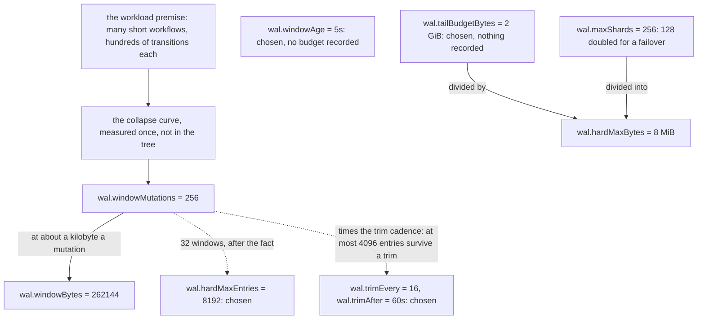

# Where the defaults came from

Nine numbers ship as defaults: three drain triggers, two trim triggers, two halves of the tail
bound and two node-level numbers. [Chapter 08](08-configuration.md#3-table-2--the-nine-dynamic-config-settings)
says what each bounds. This chapter says where each came from, so whoever moves one knows whether
they are crossing an argument or only a habit.

## The rule this chapter follows

Each shipped number is one of two kinds.

* *Derived*: it follows from a measurement, from another default, or from arithmetic the node
  asserts before it boots. Move it alone and the policy no longer adds up, or the node refuses to
  start.
* *Chosen*: a start value nothing has re-opened. The chapter says so and invents no reason, since
  an invented rationale reads as a constraint.

Some evidence is re-derivable arithmetic. The rest are *observations*, each measured once on the
research prototype this library was extracted from, on one workload against one store. They cannot
be re-run here, since the in-process backends (`wal/memwal`, `cold/memcold`) would measure only
themselves. The exceptions are the generated corpus's mean entry size and refusal rate, which a test
in this tree measures. An observation shows that a number had evidence, not what your deployment
will see.

## The premise under all of them

Every number below is a point on a curve drawn by the workload of [chapter 01](01-overview.md):
many thousands of short workflows, each moving through hundreds of state transitions and rewriting
the same mutable-state rows dozens of times. That profile is an assumption, backed by no named
installation, vendor figure or deployment measurement, and every benefit the layer claims scales
with it.

On the opposite shard, long-lived quiet workflows touched at most once per window, there is nothing
to merge. `fold.Stats.CollapseRatio` (mutations in over dirty workflows out) reports 1.00, which
looks like a pass rather than a warning. Such a deployment should re-derive the defaults.

## The drain triggers: 256 mutations and 256 KiB

`cycle.Defaults()` ships `Mutations: 256` and `Bytes: 256 << 10`, which the comment in
`cycle/cycle.go` calls the measured collapse knee: change either and re-measure.

The mutation trigger is the one default with a real curve behind it. A sweep of the window size
found that 128 mutations buys about 89% of the achievable collapse, 256 buys 99.6%, and above that
the curve is flat while the worst-case tail keeps growing. Nothing in this tree re-runs that curve,
and it is one workload's, since collapse depends on how often a workflow is re-touched inside a
window: a defensible start value, not one to inherit without looking.

The byte trigger restates it: 256 mutations at about a kilobyte each, rounded up. The generated
corpus averages 572 encoded bytes a mutation, so 256 of them come to about 143 KiB and the mutation
trigger fires first. The byte trigger is for 256 large mutations, which would otherwise become one
outsized transaction.

Under load neither size trigger usually fires: a window holding a shape `fold` cannot express is
drained on the spot (`fold.ErrRefused`), and that sets the pace. In
`TestAcceptanceFoldNoCluster`, at a configured window of 1024 and a hot set of 32 workflows, about
one mutation in a hundred is refused and drains average roughly 90 mutations. In the research
prototype, at a window of 256, every drain was a refusal drain and the size trigger never fired
inside a test. So a mutation trigger above the drain size refusals already impose (about 90 here) changes nothing.

## The age trigger: five seconds

`Age: 5 * time.Second` is a recovery-budget choice, not a measurement, and no budget is recorded.
Under load, refusals and the size triggers drain first; the age governs only the idle tail, what a
successor replays after a hard restart of a shard nobody was writing to.

Two recorded effects limit how far it can move:

* It is the re-ask cadence for a stalled applier. A cycle whose last drain had no readable outcome
  refuses its writers and readers, so no write arrives to bring a drain, and the age tick is the
  only clock left to re-ask the cold store. Raising the age lengthens the shortest possible stall.
* A run that samples the layer's counters right after its last writes sees a full window and no
  drain, so it must wait the age out. `waitForDrain` in `internal/verify/e2e` polls the layer's
  totals until a drain appears, for up to `drainWait`, 60 seconds.

## The trim cadence: 16 drains or 60 seconds

`TrimEvery: 16` and `TrimAfter: 60 * time.Second` are chosen; move them to trade trim
transactions against how much log survives for a post-mortem. The code records only a floor: at `TrimEvery: 1` every drain is followed by a `Log.Trim`, a
transaction per drain for no gain.

The pair decides how much log a post-mortem will find. Trim goes to the watermark a drain left, with
no safety lag, because recovery replays only entries above it. While trims succeed and none is in
flight when the cadence comes due, at most `TrimEvery × Mutations` entries survive, plus whatever
the tail holds: 16 × 256 = 4096 at the defaults, whether the shard has run a minute or a month. A
failed trim is retried at the next cadence and a cadence due while a trim is in flight is skipped,
so either leaves more behind, never less. The time trigger and storage pressure only shorten it: a
low-traffic shard trims at its first drain past 60 seconds, and pressure forces a trim outside the
cadence. A run that needs the whole log must raise both triggers, or `TrimAfter` trims it anyway and
the run fails against a layer that did nothing wrong.

## The per-shard tail bound: 8192 entries and 8 MiB

`HardMaxEntries: 8192` and `HardMaxBytes: 8 << 20` are invariant
[I10](02-concepts-and-invariants.md#i10-at-more-length)'s bound on one shard's tail, the
acknowledged entries not yet settled.

`hardMaxBytes` is arithmetic: the node's tail budget over the shards one node may own, 2 GiB / 256
= 8 MiB. It cannot be raised alone, because the product is asserted at start-up (below).

`hardMaxEntries` is chosen: no record size, replay time or measurement gives 8192. Each half happens
to be 32 windows of its own trigger (8192 = 32 × 256 mutations, 8 MiB = 32 × 256 KiB), so the
applier can fall 32 windows behind before the shard refuses writes, by which point it is a
cold-store incident rather than a burst. That ratio is a property of the defaults, not a documented
intent, and nothing enforces it: move a trigger without its bound and it silently changes.

### Why the bound counts entries as well as bytes

The comment on `Config.HardMaxEntries` gives the rule: entries alone do not bound bytes, and bytes
alone do not bound replay.

* Bytes bound memory. The tail lives in the history service's heap, and the server admits a 2 MB
  event blob (`limit.blobSize.error`) and 8 MB of mutable state per execution
  (`limit.mutableStateSize.error`). Four 2 MB mutations fill 8 MiB; an entries-only bound would
  admit 8192 of them, though a corpus entry averages 572 bytes and a 2 MB blob is over 3,500 times
  that (8 MB of mutable state, over 14,000 times).
* Entries bound recovery time. A successor must decode, fold and drain every acknowledged, unapplied
  entry of every shard it picks up, so recovery grows with the count, not the size. A bytes-only
  bound would admit a long tail of small mutations.

The refusal's `limit` tag says which unit tripped. [`cycle/decide.go`](../../cycle/decide.go) reads
`bytes` as an applier behind or a few very large entries (too much memory), and `entries` as an
applier simply behind (a failover would take too long). The refusal itself is
[chapter 05](05-write-path.md#4-failed-write--backpressure-i10)'s.

## The node budget: 256 shards and 2 GiB

`MaxShards: 256` and `TailBudgetBytes: 2 << 30` are the node's side of the same arithmetic.
`maxShards` is what one node may own at once, not the cluster's shard count: 128 in steady state,
doubled for a failover. The doubling is recorded; where 128 comes from is not. `tailBudgetBytes` is
chosen, and nothing records where 2 GiB came from. It is an absolute, not a fraction of RAM or a
measurement, so `hardMaxBytes` is exact arithmetic over a number nobody derived.

Figure: how the nine numbers depend on each other.


```mermaid
graph TD
  WL["the workload premise: many short workflows, hundreds of transitions each"]
  CURVE["the collapse curve, measured once, not in the tree"]
  WM["wal.windowMutations = 256"]
  WB["wal.windowBytes = 262144"]
  AGE["wal.windowAge = 5s: chosen, no budget recorded"]
  TB["wal.tailBudgetBytes = 2 GiB: chosen, nothing recorded"]
  MS["wal.maxShards = 256: 128 doubled for a failover"]
  HB["wal.hardMaxBytes = 8 MiB"]
  HE["wal.hardMaxEntries = 8192: chosen"]
  TR["wal.trimEvery = 16, wal.trimAfter = 60s: chosen"]

  WL --> CURVE
  CURVE --> WM
  WM -->|"at about a kilobyte a mutation"| WB
  TB -->|"divided by"| HB
  MS -->|"divided into"| HB
  WM -.->|"32 windows, after the fact"| HE
  WM -.->|"times the trim cadence: at most 4096 entries survive a trim"| TR
```

A solid edge is a derivation the tree records; a dotted edge is arithmetic that holds at the
defaults and derives neither end. `MS` has no incoming edge because its 128 is nowhere in the tree.

### What the start-up check does and does not promise

The three node-level numbers meet in one assertion:

```
hardMaxBytes × maxShards  ≤  tailBudgetBytes
```

`cycle.NewManager` runs `cycle.Config.CheckBudget` before returning, so `waltz.Compose` refuses a
bad policy before it makes any backend call itself; its caller has already opened the backends. At
the defaults the product fits exactly, 8388608 × 256 = 2147483648, so raising either factor without
the budget gives a node that refuses to start.
[Chapter 08](08-configuration.md#5-the-budget-refusal) owns that refusal.

All three factors are read once at start-up, so the check never vouches for a factor that changed
later. `hardMaxEntries` is read once too, because it and `hardMaxBytes` are two units of one bound,
and a node honouring each from a different edit would enforce a bound nobody wrote.

The check promises less than it may seem to:

* It bounds encoded bytes, not RSS. What is resident is decoded protos plus the accumulator's
  indices, so reading 2 GiB as a memory figure sizes a node wrong, by the multiplier in the next
  section.
* `maxShards` is a premise, not a limit. A node over its share is a cluster that just lost hosts,
  so it is not refused. It may exceed the budget, and I10 still bounds each shard.

## What the budget costs resident

The research prototype measured how much heap a byte of encoded budget costs. Its probe filled one
accumulator as a stuck applier leaves it (drained only when fold refuses, each drained batch held as
an unfinished apply holds it) and compared the live heap with a pass that discarded the same stream.
It needs no cluster, so it is the easiest prototype measurement to rebuild.

| workflow reuse | encoded | mutations | collapse in/out | resident bytes | resident per encoded byte |
|---:|---:|---:|---:|---:|---:|
| 0.0 | 262 KB | 426 | 1.03 | 2160088 | 8.22 |
| 0.0 | 1 MB | 1717 | 1.04 | 8559120 | 8.16 |
| 0.0 | 8 MB | 13726 | 1.05 | 68029576 | 8.11 |
| 0.8 | 262 KB | 451 | 1.12 | 2207256 | 8.40 |
| 0.8 | 1 MB | 1790 | 1.15 | 8699128 | 8.29 |
| 0.8 | 8 MB | 14285 | 1.14 | 69451960 | 8.28 |

The multiplier is about 8.2× across a 32× range of tail sizes at both locality settings (8.11 to
8.40). Locality makes no difference here because the probe caps no workflow pool, so a reuse of 0.8
collapses barely more than 0.0. Neither run had much to merge, so neither says what a strongly
collapsing tail would save.

So `hardMaxBytes` at 8 MiB is on the order of 68 MB resident per shard, and the 2 GiB node budget is
around 17 GB of live heap if every shard sat at its bound, which happens only with the appliers
stuck, the incident the bound exists to survive. The 17 GB was measured after 2 GiB was picked: a
consequence of the choice, not the constraint behind it.

## A small window costs more than it looks: the research prototype's 16

[Chapter 08's testing recipe](08-configuration.md#6c-a-small-window-for-testing) uses 16; this is
where 16 came from. No default is 16, but anyone driving upstream's functional suites
over waltz needs a small window to get drains inside a run, and the research prototype drove two of
them at 16.

It had measured and rejected 2. At a window of 2 a shard's loop spends most of its time inside a
drain transaction, and every write and read for that shard queues behind it. On a single emulated
node that pushed `TestSignalWorkflowTestSuite`, `TestAddTasksSuite` and `TestUserTimersTestSuite`
reproducibly past their own deadlines. All three are green at 256 and at 16.

Nothing records why 16 rather than another value, beyond its being green, giving several drains,
and being cheap. Only the rejection of 2 was measured, and only on one emulated single-node cluster.
What transfers is the shape. A window that
drains on nearly every write serialises a shard behind its own drains, and the symptom is someone
else's timing-sensitive suite going red, not anything this layer reports.

## Derived, chosen, and what that buys the reader

| number | value | where it came from | kind |
|---|---|---|---|
| `wal.windowMutations` | 256 | the knee of a collapse curve, measured once and not re-runnable in the tree | derived from an observation |
| `wal.windowBytes` | 262144 | the same knee converted at about a kilobyte a mutation | derived by conversion |
| `wal.windowAge` | 5s | a recovery budget nothing records | chosen |
| `wal.trimEvery` | 16 | a start value; only its floor is argued | chosen |
| `wal.trimAfter` | 1m0s | a start value | chosen |
| `wal.hardMaxEntries` | 8192 | nothing; it is 32 windows of the mutation trigger after the fact | chosen |
| `wal.hardMaxBytes` | 8388608 | `tailBudgetBytes ÷ maxShards` | derived, arithmetic |
| `wal.maxShards` | 256 | 128 in steady state, doubled for a failover; the 128 is not recorded | derived from an assumption |
| `wal.tailBudgetBytes` | 2147483648 | nothing | chosen |

A chosen number is not a defect: no derivation contradicts moving it on your own evidence, and the
five chosen numbers are where a real workload has the most to gain. Anyone adding a constant should
put its derivation in the code beside it.

## Summary

The nine defaults rest on an unproven workload premise: many short workflows rewriting the same rows.
Where it does not hold, the collapse ratio stays near 1.00 and the defaults should be re-derived.

Only the mutation trigger has a measured curve behind it, from the research prototype. The rest are
conversions, arithmetic over chosen numbers, or chosen outright. The start-up budget check is
enforced with no headroom; the 32-window and 4096-entry ratios hold only at the defaults. The
encoded budget costs about 8.2× its size in heap.

## Where this lives in the code

* [`../../cycle/cycle.go`](../../cycle/cycle.go) — `Config` and `Defaults()`: every number above
  with whatever justification the tree has, `CheckBudget`, and the rule that the budget counts
  encoded bytes.
* [`../../settings.go`](../../settings.go) — the nine numbers as dynamic-config settings, defaulting
  to `cycle.Defaults()` by reference, with the live/start-up split per setting.
* [`../../cycle/trim/trim.go`](../../cycle/trim/trim.go) — the cadence's two triggers, whichever
  trips first, and why the trim runs beside the loop rather than in it.
* [`../../internal/verify/acceptance/acceptance_fold_test.go`](../../internal/verify/acceptance/acceptance_fold_test.go)
  — the effective window: the refusal rate, the average drain, and the hot-set knob behind them.
* [`../../internal/verify/e2e/e2e_test.go`](../../internal/verify/e2e/e2e_test.go) — `waitForDrain`
  and `drainWait`: what a run over a real server has to allow the age trigger.
