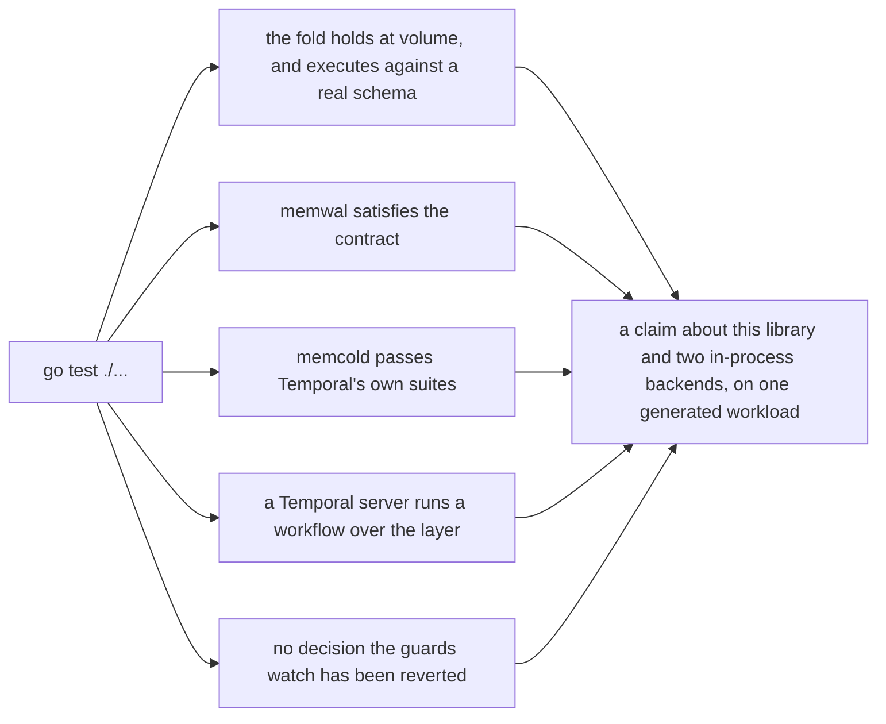

# The limits of the evidence

The fourteen preceding chapters describe mechanisms and the suites that judge them. This one answers a
different question: read together, what do the green targets actually assert, and what do they leave
open? It is for whoever has to decide whether the evidence covers the deployment in front of them,
and for whoever is about to file one of the gaps below as work.

**Everything here lives in one process's memory and dies with it.** That one sentence produces most
of this chapter, and it is a narrower boundary than it once was: waltz shipped no persistence at all
to begin with, so nothing could run against storage, and both seams now have an implementation —
`wal/memwal` for the log, `cold/memcold` for the cold store. The boundary moved rather than
dissolved. A suite can append, commit, boot a Temporal server and read rows back. No suite can
fsync, cross a network, wait on a quorum, hand a shard to another machine, or be killed. Every claim
that depends on storage outliving its process is still somebody else's to make.

## Which numbers survive a release

Every number in this book is one of two kinds, and the difference decides whether it may be printed
at all.

**The first kind is constants and test bounds.** They follow from the code as it stands, so a reader
re-derives them by opening the file rather than by trusting a terminal window somebody pasted into a
ticket. The shipped watermarks — 256 mutations, 256 KiB, 5 s, a trim every 16 drains or 60 s — are
of this kind, as are the per-shard bounds of 8192 entries and 8 MiB and the node budget of 256
shards and 2 GiB. All of them are `cycle.Defaults()`.

**The second kind is percentages, one run's counters, and bytes measured on one machine.** Without
the saved output, the exact command that produced it and the commit it ran at, such a number is a
historical observation about a machine at a moment — not a property of the revision the reader has
checked out. Printing it as though it were the first kind asserts something the document cannot
support.

The rule this repository follows is to publish only the first kind. Where a second-kind number is
carried anyway — the collapse knee behind the drain watermark, the resident cost of a byte of tail,
the rejection of a two-mutation window — it is attributed to **the research prototype this library
was extracted from**, every time, because that is the only honest form it has here.
[Chapter 14](14-where-the-defaults-came-from.md) is where each of them lives with its provenance.

Most of the gaps below are second-kind measurements nobody has made.

## Write amplification against the incumbent has never been measured

[Chapter 01](01-overview.md#what-one-write-costs-with-and-without-the-layer) states as a goal that
write amplification against the cold store falls: the rows a hot workflow rewrites N times are
written once per drain, not once per transition.

What is known is the **composition** of one write — one append, plus a share of one later apply
transaction. That is a structural fact, derived from what the code does. What is not known is the
**magnitude**. Two instruments come close and neither closes it:

* `fold.Stats.CollapseRatio` is mutations in over dirty workflows out.
  `TestAcceptanceFoldNoCluster` prints it beside the generator's own ratio. But read what that test
  *asserts*: the fold ratio is above 1.5 with the reuse knob on; the generator's ratio is exactly
  1.00 with the knob at zero; and the generator's ratio with the knob on is strictly above its value
  with the knob at zero. Those three assertions say the ratio moves with the knob. None of them
  measures a workload;
* the two I7 counters, `wal_dropped_tasks` and `wal_written_tasks`, would give a deployment the share
  of task rows a drain did not write **for its own traffic**.
  [Chapter 07](07-read-path.md#why-the-metric-is-two-counters-and-not-a-ratio) already says the share
  is a workload measurement rather than a constant of the implementation.

The direct measurement — **how many cold-store rows one state transition rewrites under the
incumbent, and by what factor that number falls under the layer** — does not exist anywhere, and it
cannot be taken here. It needs the incumbent a deployment actually runs, under that deployment's
workload, and an in-process database driven by a generated stream is neither of those. That is why
chapter 01's cost section is written without multipliers: it says what a write consists of and
refuses to say how much smaller the result is.

This is a limit rather than a bug: the structural claim holds without the number, and the book states
it as structural. Nothing is being withheld. A reader who takes "write amplification falls" for a
measured result has taken a derivation for an experiment.

## The shipped window has never been run against a store that has to plan

The drain's query used to be built by text concatenation, so its *structure* — not just its values —
grew with every row in the batch, and no compilation of it was ever cached. A window of 32 was
enough to put the drain into a compilation timeout. A timeout arrives ambiguous: the drain neither
committed nor provably did not, so the layer halted the shard rather than retry.
[Chapter 13](13-designs-that-were-rejected.md#a-folded-window-as-a-concatenation-of-the-stores-own-queries)
has that failure in full.

The shape that replaced it buys **constancy**: the query's shape is a function of which assertion
kinds and which delete families a batch carries, and not of how many rows it touches. That
constancy is a property of **the applier**, and a deployment's applier is its own code, so nothing
here can hold the property for one. [Chapter 11](11-verification.md#the-guards) names it as one of
the two guards a deployment rebuilds rather than inherits.

Half of this gap has closed, and it is worth being exact about which half. Drains at the shipped
window are executed somewhere: `TestBothSeamsRealNoServer` folds 6,000 mutations at
`cycle.Defaults()` into `cold/memcold`, one transaction per window, against Temporal's own schema
and statements. A merged request the schema will not take is therefore caught. What is still
untested is the thing the concatenation failure was about — **a window's transaction against a store
far enough away, and loaded enough, for its planning cost to matter.** An in-process SQLite database
compiles a statement in the time a map lookup takes; no run here has ever sent a 256-mutation drain
across a network to a store with a query planner under contention.

## The price of moving deferred work into the log is not measured

`AddHistoryTasks` and `RangeCompleteHistoryTasks` are two of the eight writes that become log
records, so task work travels the log like every mutable-state write. The operational consequence is
one sentence: **the same goroutine that drains is the one that writes task work and completes
ranges.** A queue processor's call therefore queues behind whatever the loop is doing, and if that is
a drain, the queue waits for the drain to finish.

[Chapter 05](05-write-path.md#2-the-drain-itself) states the general form of this for writes. The
queues are the callers most exposed to that serialisation, because they run on their own timers and
carry deadlines of their own rather than a caller's.

**The shape was known in advance and accepted deliberately; its price has not been measured.** It is
a design consequence with an empty measurement beside it, not a defect and not an oversight.
An operator meets the same interaction from the other side: when task drops climb, runbook
[(e)](09-operations.md#e-task-drops-are-climbing) reaches first for the incumbent's
`history.*ProcessorUpdateAckInterval`, and that knob changes how often a queue's call meets a drain.

## Nothing is claimed about latency

Whether the layer costs or saves latency is entirely a property of the pair a deployment chooses: the
log it appends to, and the store it would otherwise have committed to. If the two are the same class
of storage, the append costs about what the write it replaced cost, and the benefit is fewer and
smaller later writes to the cold store rather than a faster call —
[chapter 12](12-the-write-before-the-layer.md#what-follows-a-log-on-the-same-database-buys-no-latency)
argues that case. If the log is cheaper to append to than the store is to commit to, there is a
latency win, and **nothing here measures it**.

That is why `wal.Log` is a contract: the seam exists so the class of backend can change without an
invariant moving. What this repository can say about an implementation of it is exactly what
`waltest.RunContractSuite` says — that it satisfies the five guarantees — and that is a correctness
statement with no cost in it at all.

## The only log here is an in-memory one

`wal/memwal` is a real implementation and not a stub: it fences, it keeps seqnos gapless, it survives
a trim the way a durable log has to, and it passes the same eighteen contract cases any other
implementation runs. It is also **in one process's memory**, so:

* **no fsync, no network, no quorum has ever been in the path** of anything in this repository. Every
  timing property of every suite here is the timing of a map on one side of the layer and of an
  in-process SQLite database on the other;
* **no fence has ever had to reach another process.** That is the contract suite's own blind spot,
  stated at the instrument in
  [chapter 11](11-verification.md#the-blind-spot-stated-where-the-instrument-is), and `memwal` is
  the reason it cannot be closed here: one process is all there is.

A deployment's log is where the interesting failures live, and it is judged by
`waltest.RunContractSuite` plus a two-process failover test the deployment writes.

## The cold store is real, and it is in memory

`cold/memcold` is Temporal's own SQL persistence over a SQLite database in this process. It is not a
double: the 28 execution-store methods are upstream's, embedded, and Temporal's four exported
persistence suites judge them exactly as they judge a plugin. A folded window executes against that
schema, with those statements and those error classes, which is what the suites above it rest on.
`internal/verify/coldtest` sits beside it and is a double, for the suites that need a drain to be
refused or to fail ambiguously.

Two limits survive that, and the second is the sharpest in this chapter.

**The database dies with the process.** It has no file, no fsync and no second reader. So it can say
what a batch does to a schema and it cannot say anything about durability, recovery, or a store that
is still there after a kill.

**Nothing here says a folded batch leaves the cold store in the state mutation-by-mutation writing
would have left it.** The batches execute, so a merged request the schema rejects is caught. What is
not caught is a merged request the schema *accepts* and which is nevertheless not what the
sequential path would have produced. Catching that needs a differential oracle: one stream applied
twice, once sequentially and once folded, the two stores required to end identical. `memcold`
supplies one of the two stores; it cannot supply the argument, because a rule agreeing with its own
re-implementation is not evidence
([chapter 13](13-designs-that-were-rejected.md#a-unit-test-per-fold-rule) is why). The oracle stays
a deployment's to build, over the store it actually cares about.

Four places where the folded path knowingly answers differently from upstream's sequential path are
known and deliberate, and each is written down beside the code it is about:

| the difference | recorded in |
|---|---|
| upstream's `dbRecordVersion == 0` fallback, which compares `next_event_id` against the request's condition, has no analogue: a run assertion here is always `DBRecordVersion − 1` | `cold/memcold/rows.go` |
| a create's current-row assertion is compared against `current_executions.last_write_version`, where upstream's sequential path joins and compares `executions.last_write_version` | `cold/memcold/current.go` |
| a conflict-resolve's current row carries a reduced execution state, because that is what fold hands the applier | `fold/assert.go` |
| a row count other than one on an execution-row write is a condition failure here rather than upstream's `NotFound` | `cold/memcold/rows.go` |

Three of the four follow from the layer having already acknowledged the write: what fold checked
before the ack and what the drain asserts have to be the same question asked twice, so the fold's
shape reaches the store. A deployment's applier meets the same four questions.

## Event history stays outside the log

Event history is written by `AppendHistoryNodes` on the incumbent path, before the mutable-state
write, and never enters the layer. [Chapter 01](01-overview.md#what-this-is-not) lists that among
the things the layer deliberately is not. Read as a bound rather than as a statement of scope, it
says more: **a workflow that makes hundreds of state transitions still performs hundreds of history
writes by the old path, whatever the layer does with its mutable state.**

The fold can collapse the mutable-state half of the cost to one apply transaction per window. It
cannot touch the other half at all. So the benefit of the whole construction is bounded above by the
share of a deployment's cold-store writes that are mutable-state writes rather than history appends,
and a deployment dominated by event history has less to gain than a collapse ratio alone would
suggest.

No measurement removes this bound. It follows from the wrapper's method partition, which is a
decision rather than a gap.

## No partition between layer nodes is staged

**The layer's nodes do not talk to each other.** There is no gossip and no peer protocol; every
interaction between two owners of the same shard goes through the log and the epoch, and nothing
else. A partition between two layer nodes is therefore not a scenario that was left unstaged — it is
a scenario with **no channel to cut**. Whatever two owners would do to each other they do through
fencing.

What is unstaged, and could be staged by whoever has processes to kill, is everything on the other
side of the two seams: a failure of the log, a failure of the cold store, a split of either's
storage, a slow replica. Neither the harness that would stage those runs nor the judge that would
read one back is here; `internal/verify/checker` is one half of such a run's input and judges
nothing. The distinction matters when you read the table at the end of this chapter: the
node-to-node entry describes the shape of the design, and every other entry describes the reach of a
harness nobody has written.

## The saving on deferred work is not observable from outside

Invariant [I7](02-concepts-and-invariants.md#the-invariants) is the rule that makes a dropped task
row correct: a committed drain need not write task rows whose range a queue had already completed
past. **No judge outside the layer can assert that rule.** Not because the deletion is invisible —
the range deletion is `mutation.KindRangeCompleteTasks`, a log entry like any other, folded into the
window and restored by replay, so an outside observer sees it. What no observer sees is the
**drop**: a row the drain did not write exists nowhere. A reader of the log and
the cold store therefore finds the range record, finds no row, and cannot separate a correct drop
from a loss without reproducing the fold — which is exactly the thing such a judge may not import.

What holds the rule is therefore the mechanism's own tests: `fold/tasks_test.go`,
`fold/histtasks_test.go` and `cycle/tasks_test.go`, where the pagination, the ordering, the dedup and
the deletion rule are each pinned at their smallest. They run over `internal/verify/coldtasks`, a
model of a base store's two paginations. That is a real limit twice over — the saving is a row that
was never written, and the pagination it is judged against is a model rather than a store.

## Nothing cross-cluster

The unit is one shard's log with one writer, and the writer is made single by epoch fencing. There is
no multi-writer shard and no cross-cluster story. Upstream's cross-cluster and version-history suites
are out of scope and nothing here has ever replicated between clusters.

## What a green run means

Stated exactly, a green `go test ./...` says this and no more:

* the fold acceptance folded a hundred thousand generated mutations without losing one, and the
  windows collapsed at a ratio the control shows to be a function of the generator's knob;
* the same fold, at the shipped window, executed against Temporal's own schema and left the rows and
  the watermark the batches said it would — including when the shard's epoch moved under a running
  cycle, where it left exactly the drains that had committed and nothing after them;
* the contract suite says `memwal` satisfies the five guarantees, and would say the same of any
  implementation a deployment passes it;
* Temporal's own four persistence suites say `cold/memcold` is a store a server can be run on;
* a Temporal server, composed the production way, acquired its shards through the layer and
  completed a workflow over it — with a passthrough control arm that saw nothing;
* the guards say a set of decisions has not been reverted;
* the unit tests say each package does what its own rules say.

That is a claim about **this library and two backends that die with the process, on one generated
workload and one workflow**, and about nothing wider. In particular a green run is not, and cannot
be:

* a claim about storage that outlives a process — durability, recovery, or a fence reaching another
  machine;
* a claim about a deployment's own log or cold store, whichever pair it chooses;
* a claim that a composition over this library survives upstream's full functional coverage — the
  strongest available form of that is upstream's own suites against a real store, which
  [`patches/README.md`](../../patches/README.md) makes reachable and which nothing here runs;
* a performance claim of any kind.

## This is not a roadmap

A list of things that have not been demonstrated reads like a backlog, and it is not one. Nothing
above is a plan, and no entry carries an intention to close it. The entries divide into three kinds,
and telling them apart is the reader's job:

1. **closed by a measurement against a real deployment.** Someone runs the shipped window against
   their own store, or measures the incumbent's write amplification. These need a cluster and an
   afternoon, not a design;
2. **closed by work nobody has started.** A harness that kills processes and the judge that reads
   the record back; a differential oracle against a real store. These need a deployment first and
   then a project;
3. **not closable at all, because the entry describes the boundary of a decision that was taken.**
   Measuring them harder does not move them; they are what the design is.

Where this chapter can say which is which, it says so:

| limit | kind |
|---|---|
| the incumbent's write amplification is unmeasured | 1 — a measurement |
| the shipped window against a store far enough away to plan | 1 — a measurement |
| the price of deferred work waiting behind a drain | 1 for the number, 3 for the shape |
| nothing is claimed about latency | 1 for a given pair, 3 for the claim in general |
| the only log here is in memory | 2 — a real log and a two-process failover test |
| the cold store here dies with the process | 2 — a durable store, and a harness that kills something |
| the fold is unjudged against the sequential path | 2 — a differential oracle over a store worth caring about |
| no failure of the log or the store is staged | 2 — a harness with processes to kill |
| nothing cross-cluster | 2 — a project |
| no partition between layer nodes | 3 — the nodes speak only to the log and the store |
| event history stays outside the log | 3 — the wrapper's method partition |
| the saving on deferred work is unobservable from outside | 3 — I7's bound is not persisted |

Mixing the three is what turns an honest limits section into an apology. A reader who cannot tell
kind 3 from kind 1 reads a deliberate boundary as an unfinished task, and proposes closing something
that was chosen.

## Where this lives in the code

* [`../../internal/verify/checker/checker.go`](../../internal/verify/checker/checker.go) — the three outcome classes a
  driver can report, and why the third one — the call whose outcome nobody knows — has to exist.
* [`../../internal/verify/coldtest/coldtest.go`](../../internal/verify/coldtest/coldtest.go) — the double that
  interprets nothing, with the reason written at the top.
* [`../../cold/memcold/memcold.go`](../../cold/memcold/memcold.go) — the store that is not a double,
  what the embedding covers and what it does not;
  [`apply.go`](../../cold/memcold/apply.go) is the drain's transaction statement by statement, and
  [`rows.go`](../../cold/memcold/rows.go) and [`current.go`](../../cold/memcold/current.go) carry
  three of the four places the folded path knowingly answers differently from upstream's sequential
  path. The fourth is in [`../../fold/assert.go`](../../fold/assert.go).
* [`../../internal/verify/coldtasks/coldtasks.go`](../../internal/verify/coldtasks/coldtasks.go) — the two paginations
  it models, and the paragraph headed "what can make it a lie".
* [`../../wal/memwal/memwal.go`](../../wal/memwal/memwal.go) — the one log here: a map of shards
  under one mutex, and why its next seqno is state rather than derived from the rows around it.
* [`../../fold/fold.go`](../../fold/fold.go) — `Stats.CollapseRatio`, printed by every acceptance run
  and asserted only as a property of the generator's knob.
* [`../../walmetrics/walmetrics.go`](../../walmetrics/walmetrics.go) — `wal_dropped_tasks` and
  `wal_written_tasks`, both tagged by task category, the two counters a deployment measures its own
  saving with.
* [`../../wrapper/execution_store.go`](../../wrapper/execution_store.go) — the method
  partition: which calls become log records, and which stay on the incumbent path.
* [`../../cycle/cycle.go`](../../cycle/cycle.go) — `Defaults()`, the shipped watermarks
  and bounds every first-kind number above is drawn from.
* [`../../patches/README.md`](../../patches/README.md) — the evidence a composition can produce that
  this repository cannot, and the fifteen lines that make it reachable.

[Chapter 11](11-verification.md#the-levels-of-evidence) is where each instrument above is described
in full; [chapter 09](09-operations.md) is how to run one.
