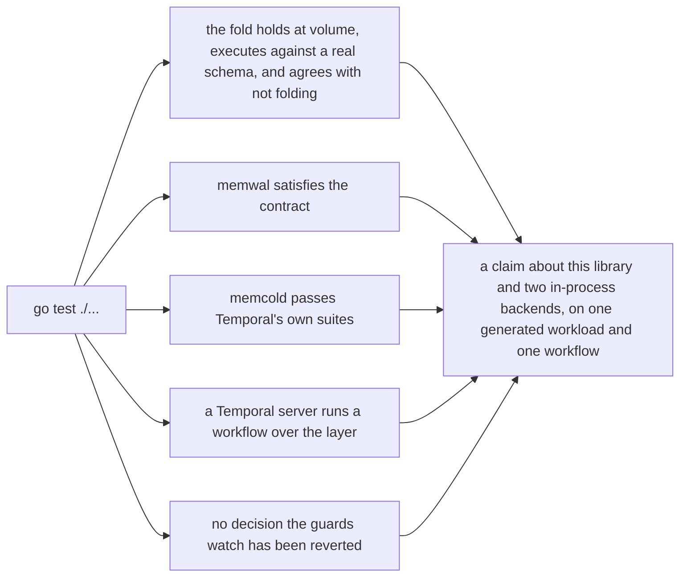

# The limits of the evidence

The earlier chapters describe the mechanisms and the suites that judge them. This one reads the green
targets together and asks what they assert and what they leave open. It is for anyone deciding
whether the evidence covers their deployment, and for anyone about to file one of the gaps below as
work.

Most of the chapter follows from one fact: everything here lives in one process's memory and dies
with it. Both seams have an implementation, `wal/memwal` for the log and `cold/memcold` for the cold
store, so a suite can append, commit, boot a Temporal server and read rows back. No suite can fsync an
acknowledged write, cross a network, wait on a quorum, hand a shard to another machine, or be killed.
Every claim that depends on storage outliving its process is somebody else's to make.

## Which numbers survive a release

Every number in this book is one of two kinds. Constants and test bounds follow from the code;
measurements (percentages, one run's counters, bytes on one machine) describe a machine at a moment.
This book prints only the first kind as fact. The
shipped triggers (256 mutations, 256 KiB, 5 s, a trim every 16 drains or 60 s), the per-shard bounds
of 8192 entries and 8 MiB and the node budget of 256 shards and 2 GiB are all `cycle.Defaults()`, and
a reader re-derives them by opening the file. A measurement describes the machine it was taken on,
not the revision checked out. Where one
is carried anyway (the collapse knee behind the drain trigger, the resident cost of a byte of tail,
the rejection of a two-mutation window), it is attributed to the research prototype this library was
extracted from, and [chapter 14](14-where-the-defaults-came-from.md) gives each one's provenance.

Most of the gaps below are measurements nobody has made.

## Write amplification against the incumbent has never been measured

[Chapter 01](01-overview.md#what-one-write-costs-with-and-without-the-layer) states as a goal that
write amplification against the cold store falls: the rows a hot workflow rewrites N times are
written once per drain, not once per transition.

We know the composition of one write: one append, plus a share of one later apply transaction. That
is derived from the code. We do not know the magnitude. Two instruments come close, and neither
measures it:

* The fold ratio, `foldrun.Run.CollapseRatio` (mutations folded in over merged requests out), is
  printed by `TestAcceptanceFoldNoCluster` beside the generator's own stream ratio. The test asserts
  three things about the generator's reuse knob (`mutgen.Config.WorkflowReuse`, the probability that
  a generated mutation touches an existing workflow rather than a new one): the fold ratio is above
  1.5 with the knob on, the generator's ratio is exactly
  1.00 with the knob at zero, and the generator's ratio with the knob on is strictly above its value
  at zero. Together they say the ratio moves with the knob. None of them measures a workload.
* The two I7 counters, `wal_dropped_tasks` and `wal_written_tasks`, give a deployment the share of
  task rows a drain did not write for its own traffic. (I7 lets a drain skip task rows a queue has
  already completed past, [chapter 02](02-concepts-and-invariants.md#the-invariants).) That share is a workload measurement, not a
  constant of the implementation
  ([chapter 07](07-read-path.md#why-the-metric-is-two-counters-and-not-a-ratio)).

The direct measurement is how many cold-store rows one state transition rewrites under the incumbent,
and by what factor that falls under the layer. It does not exist, and it cannot be taken here: it
needs the incumbent a deployment runs, under that deployment's workload. So chapter 01's cost section
says what a write consists of and gives no multipliers. The structural claim holds without the number,
and "write amplification falls" is a derivation, not a measured result.

## The shipped window has never been run against a store that has to plan

On the research prototype this library was extracted from, the drain's query was built by text
concatenation. Its structure, not just its values, grew with every row in the batch, and no
compilation of it was ever cached. A window of 32 put that drain into a compilation timeout. A timeout
is ambiguous (the drain neither committed nor provably did not), so the layer halted the shard rather
than retry. [Chapter
13](13-designs-that-were-rejected.md#a-folded-window-as-a-concatenation-of-the-stores-own-queries)
explains why that shape was refused.

Its replacement keeps the query's shape constant: the shape depends on which assertion kinds and
delete families a batch carries, not on how many rows it touches. That is a property of the applier,
and a deployment's applier is its own code, so nothing here can hold it for one.
[Chapter 11](11-verification.md#the-guards) lists it as one of the two guards a deployment rebuilds
rather than inherits.

Half of this gap is closed. `TestBothSeamsRealNoServer` folds 6,000 mutations at `cycle.Defaults()`
into `cold/memcold`, one transaction per window, against Temporal's own schema and statements, so a
merged request the schema will not take is caught. Still untested is what the concatenation failure
was about: a window's transaction against a store far enough away, and loaded enough, for planning
cost to matter. In-process SQLite compiles a statement in about the time of a map lookup. No run here
has sent a 256-mutation drain across a network to a store with a query planner under contention.

## The price of moving deferred work into the log is not measured

`AddHistoryTasks` and `RangeCompleteHistoryTasks` are two of the eight writes that become log
records, so task work travels the log like every mutable-state write. The consequence: the goroutine
that drains is the one that writes task work and completes ranges. A queue processor's call waits
behind whatever the loop is doing, and if that is a drain, it waits for the drain to finish.

[Chapter 05](05-write-path.md#2-the-drain-itself) states this for writes in general. The queues are
the most exposed callers, because they run on their own timers and carry their own deadlines.

This shape was known in advance and accepted; its price has not been measured. An operator meets the
same interaction from the other side: when task drops climb, runbook
[(e)](09-operations.md#e-task-drops-are-climbing) reaches first for the incumbent's
`history.*ProcessorUpdateAckInterval`, and that knob changes how often a queue's call meets a drain.

## Nothing is claimed about latency

Latency depends on the pair a deployment chooses: the log it appends to and the store it would
otherwise commit to. On the same class of storage the append costs about what the replaced write
cost, and the gain is fewer, smaller cold-store writes later
([chapter 12](12-the-write-before-the-layer.md#what-follows-a-log-on-the-same-database-buys-no-latency)).
A log cheaper than the store would win latency, and nothing here measures it.

`wal.Log` is a contract so that the class of backend can change without an invariant moving.
`waltest.RunContractSuite` says an implementation of `wal.Log` satisfies the five guarantees. That is
a correctness statement with no cost in it.

## The only log here is an in-memory one

`wal/memwal` is a real implementation, not a stub. It fences, keeps seqnos gapless, survives a trim
the way a durable log must, and passes the same twenty-one contract cases as any other implementation.
But it lives in one process's memory. So no fsync, network or quorum has ever been in the path of an
acknowledged write: every timing here is a map on one side and in-process SQLite on the other. And no
fence has ever had to reach another process.

A deployment's log is where the interesting failures live. It is judged against its own storage by
`waltest.RunContractSuite`, `waltest.CheckReopen` and `waltest.CheckRetention`, plus a two-process
failover test the deployment writes. `memwal` cannot pass `CheckReopen` (a map has nothing to reopen),
and only a deployment can spend `CheckRetention`'s window. [Chapter
11](11-verification.md#what-the-contract-suite-cannot-see) describes both checks and the
blind spots they cover.

## The cold store is real, and it is in memory

`cold/memcold` is Temporal's own SQL persistence over a SQLite database in this process. It is not a
double: the 28 execution-store methods are upstream's, embedded, and Temporal's four exported
persistence suites judge them as they judge a plugin. A folded window executes against that schema,
with those statements and those error classes. `internal/verify/coldtest` is the double, for suites
that need a drain to be refused or to fail ambiguously.

Two limits remain. First, the database dies with the process. It has no file, no fsync and no second
reader, so it says what a batch does to a schema and nothing about durability. The layer's own half
of recovery is covered: a superseded owner's tail, replayed by the successor, is held against an
uninterrupted run of the same stream over this store ([Chapter
11](11-verification.md#recovery-the-same-stream-a-different-set-of-windows)). What is missing is the
kill, not the replay.

Second, the oracle that says folding is transparent has both arms in `cold/memcold`.
`TestFoldingChangesNothingButTheNumberOfTransactions` drives one stream at the shipped window and at
a window of one mutation and diffs the two databases ([Chapter
11](11-verification.md#the-fold-against-not-folding)). It catches a merged request the schema accepts
but the sequential path would not have produced. A defect both arms share cancels, and nothing in the
comparison speaks for the schema, row layouts or condition failures of the store a deployment runs.
Rebuilding that comparison over its own store is the deployment's job, and it is what to build
instead of a unit test per fold rule
([chapter 13](13-designs-that-were-rejected.md#a-unit-test-per-fold-rule)).

The folded path knowingly answers differently from upstream's sequential path in three places, each
written down beside its code:

| the difference | recorded in |
|---|---|
| upstream's `dbRecordVersion == 0` fallback, which compares `next_event_id` against the request's condition, has no analogue: a run assertion here is always `DBRecordVersion − 1` | `cold/memcold/rows.go` |
| a create's current-row assertion is compared against `current_executions.last_write_version`, where upstream joins and compares `executions.last_write_version` | `cold/memcold/rows.go` (`lockCurrent`), with the reason at `applyCurrentRow` in `apply.go` |
| a row count other than one on an execution-row write is a condition failure here rather than upstream's `NotFound` | `cold/memcold/rows.go` |

All three follow from the write being acknowledged already. What fold checked before the ack and
what the drain asserts must be the same question, so the fold's shape reaches the store. The column
in the second row is the sharpest case: reading upstream's column would let the layer ack against one
value and refuse against another. A deployment's applier meets the same three questions.

A fourth entry, a conflict-resolve's current row carrying a reduced execution state, was once listed
here as deliberate. It did not follow from the ack, and it was a defect: `start_time` landed NULL and
`WorkflowIdReuseMinimalInterval` stopped firing for that workflow. [Chapter
13](13-designs-that-were-rejected.md#a-unit-test-per-fold-rule) tells that story.

## Where event history lands is the cold store's, and neither path is measured

An intercepted write's event batches always reach the layer. Where they land is the cold store's
choice. If its applier declares `cold.HistoryApplier`, they ride the record into the drain's
publication. If not, they go through the store below before the append. Neither path changes the
number of history rows. A workflow that makes hundreds of state transitions still writes hundreds of
history rows, whatever the layer does with its mutable state. History is append-only, so a window
holds those batches and has nothing to merge.

The fold collapses the mutable-state half of the cost to one apply transaction per window and cannot
touch the other half. So the benefit is bounded above by the share of a deployment's cold-store
writes that are mutable-state writes, and a deployment dominated by event history gains less than a
collapse ratio suggests. That bound is a decision, not a gap, and no measurement removes it.

The gap is the difference between the two paths. Carrying batches on the record saves a foreground
round trip per batch and lets a drain write a window's nodes at once. It also spends the record's byte
budget (the byte drain trigger, and the per-shard tail bound of I10,
[chapter 02](02-concepts-and-invariants.md#the-invariants)) on event blobs, so a window holds fewer mutations and drains sooner. No run here measures
either side of that trade. The shipped composition takes the batches (`cold/memcold` declares
`cold.HistoryApplier`), so every green target exercises that path. The corpus that
[chapter 14](14-where-the-defaults-came-from.md#the-drain-triggers-256-mutations-and-256-kib) uses to
check the byte trigger carries no event batches, so that trigger has never been checked against
records that hold history.

## No partition between layer nodes is staged

The layer's nodes do not talk to each other. There is no gossip and no peer protocol. Two owners of
the same shard interact only through the log and the epoch, so a partition between layer nodes has no
channel to cut. Whatever two owners would do to each other, they do through fencing.

The converse also holds. Two nodes are two `cycle.Manager`s over one log and one store, and a second
process adds an address space, not a schedule. So a two-owner interleaving can be staged here, and one
is: a node parked inside its applier while another takes the shard, replays its entry and drains over
it ([chapter 11](11-verification.md#what-is-not-claimed)). A second process would add a real transport
that hangs, a real kill, and storage that survives either.

What is unstaged is everything on the other side of the two seams: a failure of the log or the cold
store, a split of either's storage, a slow replica. Neither the harness that would stage those runs
nor the judge that would read one back is here; `internal/verify/checker` is one half of such a run's
input and judges nothing. In the table at the end of this chapter, the node-to-node entry describes
the design, while "no failure of the log or the store is staged" describes a harness nobody has
written.

## The saving on deferred work is not observable from outside

Invariant [I7](02-concepts-and-invariants.md#the-invariants) is the rule that makes a dropped task
row correct: a committed drain need not write task rows whose range a queue had already completed
past. No judge outside the layer can assert that rule. The range deletion itself is visible: it is
`mutation.KindRangeCompleteTasks`, a log entry like any other, folded into the window and restored by
replay. The drop is not. A row the drain did not write exists nowhere, so a reader of the log and the
cold store finds the range record, finds no row, and cannot tell a correct drop from a loss without
reproducing the fold, which such a judge may not import.

So the rule is held by the mechanism's own tests: `fold/tasks_test.go`, `fold/histtasks_test.go` and
`cycle/tasks_test.go` pin the pagination, the ordering, the dedup and the deletion rule each at its
smallest. The merged read in `cycle/tasks_test.go` runs over `internal/verify/coldtasks`, a model of a
base store's two paginations. The limit is twofold: the saving is a row never written, and the
pagination it is judged against is a model, not a store.

## Nothing cross-cluster

The unit is one shard's log with one writer, and the writer is made single by epoch fencing. There is
no multi-writer shard and no cross-cluster story. Upstream's cross-cluster and version-history suites
are out of scope and nothing here has ever replicated between clusters.

## What a green run means

A green `go test ./...` says this and no more:

* the fold acceptance folded a hundred thousand generated mutations without losing one, and the
  windows collapsed at a ratio the control shows to be a function of the generator's knob;
* the same fold, at the shipped window, executed against Temporal's own schema and left the rows and
  the watermark the batches said it would. When the shard's epoch moved under a running cycle, it
  left exactly the drains that had committed and nothing after them;
* the same stream, driven once folded at the shipped window and once at one mutation per
  transaction, left two databases holding identical rows: every run row, every current row, and the
  task IDs of all four task categories;
* a shard handed to successor after successor mid-window, each replaying the tail it inherited, left
  the database an uninterrupted run of the same stream leaves; and a node parked inside its applier
  while another took the shard was not told its write succeeded on the other's watermark;
* the contract suite says `memwal` satisfies the five guarantees, and would say the same of any
  implementation a deployment passes it;
* Temporal's own four persistence suites say `cold/memcold` is a store a server can be run on;
* a Temporal server, composed the production way, acquired its shards through the layer and
  completed a workflow over it, and a passthrough control arm saw nothing;
* the guards say a set of decisions has not been reverted;
* the unit tests say each package does what its own rules say.

The figure groups those claims and shows where they converge.

```mermaid
graph LR
  A["go test ./..."] --> A1["the fold holds at volume, executes against a real schema, and agrees with not folding"]
  A --> A2["memwal satisfies the contract"]
  A --> A5["memcold passes Temporal's own suites"]
  A --> A4["a Temporal server runs a workflow over the layer"]
  A --> A3["no decision the guards watch has been reverted"]
  A1 --> B["a claim about this library and two in-process backends, on one generated workload and one workflow"]
  A2 --> B
  A5 --> B
  A4 --> B
  A3 --> B
```

Every branch ends in the same place: a claim about this library and two backends that die with the
process, on one generated workload and one workflow. A green run is not, and cannot be:

* a claim about storage that outlives a process: durability, recovery, or a fence reaching another
  machine;
* a claim about a deployment's own log or cold store, whichever pair it chooses;
* a claim that a composition over this library survives upstream's full functional coverage. The
  strongest available form of that is upstream's own suites against a real store, which
  [`patches/README.md`](../../patches/README.md) makes reachable and which nothing here runs;
* a performance claim of any kind.

## This is not a roadmap

The limits in this chapter read like a backlog, and they are not one. No entry carries an intention to close it. The entries are of three
kinds:

1. Closed by a measurement against a real deployment: someone runs the shipped window against their
   own store, or measures the incumbent's write amplification. These need a cluster and an
   afternoon, not a design.
2. Closed by work nobody has started: a harness that kills processes and the judge that reads the
   record back, or the oracle rebuilt over the store a deployment runs. These need a deployment
   first and then a project.
3. Not closable, because the entry is the boundary of a decision that was taken. Measuring harder
   does not move it.

The table assigns each limit its kind:

| limit | kind |
|---|---|
| the incumbent's write amplification is unmeasured | 1 — a measurement |
| the shipped window against a store far enough away to plan | 1 — a measurement |
| the price of deferred work waiting behind a drain | 1 for the number, 3 for the shape |
| nothing is claimed about latency | 1 for a given pair, 3 for the claim in general |
| the only log here is in memory | 2 — a real log and a two-process failover test |
| the cold store here dies with the process | 2 — a durable store, and a harness that kills something |
| the fold is judged against the sequential path over one store only | 2 — the same oracle over the store a deployment runs |
| no failure of the log or the store is staged | 2 — a harness with processes to kill |
| nothing cross-cluster | 2 — a project |
| no partition between layer nodes | 3 — the nodes speak only to the log and the store |
| the number of history rows is untouched | 3 — history is append-only; there is nothing to fold |
| neither history path is measured against the other | 1 — a measurement |
| the saving on deferred work is unobservable from outside | 3 — a row a drain never wrote exists nowhere |

## Summary

Everything in this repository runs in one process's memory. Both seams have real implementations,
`memwal` and `memcold`, so the fold executes against Temporal's own schema, agrees with not folding,
survives handover and replay, and carries a Temporal server through a workflow. None of it fsyncs,
crosses a network or survives a kill.

The book prints only numbers derived from the code as fact; the few measurements it carries are
attributed to the research prototype. The measurements that would turn its structural
claims into magnitudes (write amplification against the incumbent, a window against a store that
must plan, the cost of task work waiting behind a drain, latency, the two history paths) have not
been made, and most cannot be made here.

Each limit is one of three kinds: a measurement a deployment can take, a project nobody has started,
or the boundary of a decision. The table in the last section says which, so a deliberate boundary is
not mistaken for unfinished work.

## Where this lives in the code

* [`../../internal/verify/checker/checker.go`](../../internal/verify/checker/checker.go) — the three outcome classes a
  driver can report, and why the third one — the call whose outcome nobody knows — has to exist.
* [`../../internal/verify/coldtest/coldtest.go`](../../internal/verify/coldtest/coldtest.go) — the double that
  interprets nothing, with the reason written at the top.
* [`../../cold/memcold/memcold.go`](../../cold/memcold/memcold.go) — the store that is not a double,
  what the embedding covers and what it does not;
  [`apply.go`](../../cold/memcold/apply.go) is the drain's transaction statement by statement, and
  [`rows.go`](../../cold/memcold/rows.go) carries the three places the folded path knowingly answers
  differently from upstream's sequential path, one of them with its reason in `apply.go`.
* [`../../internal/verify/coldtasks/coldtasks.go`](../../internal/verify/coldtasks/coldtasks.go) — the two paginations
  it models, and the paragraph headed "what can make it a lie".
* [`../../wal/memwal/memwal.go`](../../wal/memwal/memwal.go) — the one log here: a map of shards
  under one mutex, and why its next seqno is state rather than derived from the rows around it.
* [`../../internal/verify/foldrun/foldrun.go`](../../internal/verify/foldrun/foldrun.go) —
  `Run.CollapseRatio`, the fold ratio every acceptance run prints and asserts only as a property of
  the generator's knob.
* [`../../fold/fold.go`](../../fold/fold.go) — `Stats.CollapseRatio`, the layer's own counters, which
  the cycle reports as `wal_drained_mutations` and `wal_drained_workflows`.
* [`../../walmetrics/walmetrics.go`](../../walmetrics/walmetrics.go) — `wal_dropped_tasks` and
  `wal_written_tasks`, both tagged by task category, the two counters a deployment measures its own
  saving with.
* [`../../wrapper/execution_store.go`](../../wrapper/execution_store.go) — the method
  partition: which calls become log records, and which stay on the incumbent path.
* [`../../cycle/cycle.go`](../../cycle/cycle.go) — `Defaults()`, the shipped triggers
  and bounds every constant above is drawn from.
* [`../../patches/README.md`](../../patches/README.md) — the evidence a composition can produce that
  this repository cannot, and the fifteen lines that make it reachable.

[Chapter 11](11-verification.md#the-levels-of-evidence) describes each instrument in full, and
[chapter 09](09-operations.md) shows how to run one.
