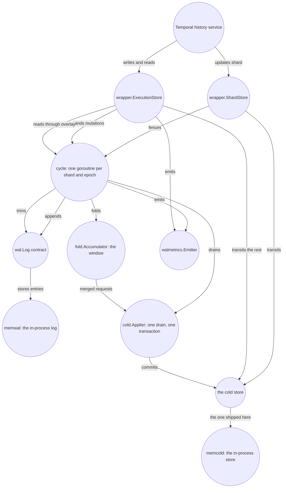

# The WAL Layer Handbook

Imagine a workflow that lives for ten seconds. In that time, Temporal may rewrite its mutable state
dozens of times, create and consume timers, and delete the task rows that represented them. Event
history remains essential and is stored immediately. The persistence store, however, also records
every intermediate mutable-state image and task row, even when it is superseded or deleted almost
at once.

waltz asks whether every intermediate form must reach the cold store separately. It places a durable
per-shard write-ahead log in front of a Temporal history shard's persistence store, acknowledges a
write once the log has it, and folds several logged mutations into one later transaction in the
shipped windowed configuration. That sounds like batching. It is also the easy part.

The hard part begins after acknowledgement and before that later transaction. The cold store is now
behind a truth the caller has already observed. Reads must combine two sources. A new shard owner
must recover work left by the old one, while two owners must never apply the same tail. The layer
must also refuse work before a bounded optimisation becomes an unbounded memory promise. This book
explains how those obligations follow from one early acknowledgement and which contracts preserve
them when processes and storage fail.

waltz is **not a persistence implementation**, and that is the shape of everything in this book. The
log is whatever satisfies `wal.Log`; the cold store is whatever satisfies `cold.Applier` and
`cold.Watermarker`. What waltz is, exactly, is everything between those two seams. Each seam has one
implementation here — `wal/memwal` and `cold/memcold`, the second being Temporal's own SQL
persistence over a database in this process — and neither is storage for anybody's data: they exist
so that everything above them, up to and including a running Temporal server, can be exercised
without installing anything. Both die with the process, and
[chapter 15](15-the-limits-of-the-evidence.md) is what that costs the evidence.

It is written for two people. One **operates** a Temporal cluster with this layer and needs to know
which knob changes what, what a counter means at three in the morning, and which alerts show fencing
working as intended. The other **changes** the layer and needs the invariants, seams and suites that
will judge the change. Everything here describes the tree as it stands: every identifier, default and
count named in these pages exists in the code, and every chapter ends with the files it draws from.

The book is in two parts. **Chapters 01–11 are the reference**: what the layer is made of, what each
seam guarantees, what happens on each path, which key to set and what each series counts. **Chapters
12–15 are the deep dives**: the reasoning the reference asserts and does not argue — what a write
cost before any of this existed, which designs were tried and refused, where each shipped default
came from, and what the green targets do not say. A reader who only has to run the thing never needs
them. A reader about to change something, or about to re-propose a design that was already refused,
does.

## Reading paths

**Read it as a book**

1. [01-overview.md](01-overview.md) — begin with one write and the new problems introduced by
   acknowledging it before the cold store changes.
2. [02-concepts-and-invariants.md](02-concepts-and-invariants.md) — name the states that now exist
   between the log and the cold store, and the invariants that constrain them.
3. [03-components.md](03-components.md) — see which packages own the states and operations just
   introduced.
4. [04-contracts.md](04-contracts.md) — inspect the boundaries that make those components
   replaceable and testable.
5. [05-write-path.md](05-write-path.md) — follow one mutation through the happy path and every point
   at which certainty can be lost.
6. [06-shard-lifecycle.md](06-shard-lifecycle.md) and [07-read-path.md](07-read-path.md) — change
   owners and read while acknowledged state still lives outside the cold store.
7. [08-configuration.md](08-configuration.md), [09-operations.md](09-operations.md) and
   [10-metrics.md](10-metrics.md) — choose the tradeoff, run it, and interpret its instruments.
8. [11-verification.md](11-verification.md) — finish with what the evidence does and does not prove.
9. Then the deep dives, in order: [12](12-the-write-before-the-layer.md) for the write this whole
   design is measured against, [13](13-designs-that-were-rejected.md) for the alternatives and the
   failures that refused them, [14](14-where-the-defaults-came-from.md) for where each number came
   from, and [15](15-the-limits-of-the-evidence.md) for the edge of the claim.

**I am operating this**

1. [09-operations.md](09-operations.md) — deployment, the start and stop order, rolling restarts,
   and the seven runbooks.
2. [08-configuration.md](08-configuration.md) — the two configuration surfaces and every key on
   them, with three ready-made configurations.
3. [10-metrics.md](10-metrics.md) — every series with its tags and units, the quantities to derive,
   and the shape each alert should take.
4. [06-shard-lifecycle.md](06-shard-lifecycle.md) — what a failover actually does, why a halt is
   two opposite things, and what a killed node leaves behind.

**I am changing this**

1. [01-overview.md](01-overview.md) — the shape of the whole thing, and what the word "mode"
   names.
2. [02-concepts-and-invariants.md](02-concepts-and-invariants.md) — the vocabulary the rest of the
   book is written in, and the eleven numbered invariants.
3. [03-components.md](03-components.md) — the packages, the import bans and their reasons, and who
   owns what at run time.
4. [04-contracts.md](04-contracts.md) — every seam's interface: what it guarantees, what it refuses,
   what the caller owes it.
5. [05-write-path.md](05-write-path.md) — one mutation end to end, with a diagram per failure class.
6. [07-read-path.md](07-read-path.md) — the overlay, the merged task page, and invariant I7.
7. [11-verification.md](11-verification.md) — which suites will judge the change, and what a green
   run does not mean.
8. [13-designs-that-were-rejected.md](13-designs-that-were-rejected.md) — **before proposing a
   change to ownership, the window, the reads or how the fold is judged**, the alternatives that
   were already refused and the failure that refused each one.

**I am about to change a default, or argue with a number**

1. [14-where-the-defaults-came-from.md](14-where-the-defaults-came-from.md) — every shipped
   constant, where it came from, and which ones are derived rather than simply chosen.
2. [08-configuration.md](08-configuration.md) — what the key does and which surface it sits on.
3. [12-the-write-before-the-layer.md](12-the-write-before-the-layer.md) — what one write cost with
   no layer present, which is the baseline every saving is relative to.
4. [15-the-limits-of-the-evidence.md](15-the-limits-of-the-evidence.md) — what has never been
   measured, so a number is not invented to fill the gap.

**I am debugging an incident**

1. [09-operations.md's decision tree](09-operations.md#4-writes-to-one-shard-are-failing--where-to-go)
   — start from the error the *caller* saw, not from the dashboard, and it routes you into one of
   [the seven runbooks](09-operations.md#5-runbooks) that follow it.
2. [10-metrics.md](10-metrics.md#3-the-reference-table) — what each series counts *exactly*; several
   count something narrower than their name suggests.
3. [06-shard-lifecycle.md](06-shard-lifecycle.md#5-halts-the-two-classes) — which of the two halt
   classes you are looking at, and which one nobody else picks up.

## The chapters

| file | title | what it answers |
|---|---|---|
| [01-overview.md](01-overview.md) | The layer at a glance | What waltz is, what one write costs with and without it, which packages it is made of, the two things "mode" means, and what the layer deliberately is not. |
| [02-concepts-and-invariants.md](02-concepts-and-invariants.md) | The geometry of an acknowledged write | Why the log needs three positions, how the tail differs from the window, every narrow term the book uses, and the eleven invariants with their enforcement and evidence. |
| [03-components.md](03-components.md) | Components: ownership, knowledge and calls | Why run-time calls and compile-time knowledge form different graphs, what each package owns, and which goroutine or mutex owns each mutable value. |
| [04-contracts.md](04-contracts.md) | Contracts at the failure boundaries | How ambiguous append, unknown drain outcome and stale ownership shape every seam, followed by the exact signatures, guarantees, refusals and caller obligations. |
| [05-write-path.md](05-write-path.md) | A write, end to end | What happens between `UpdateWorkflowExecution` and its return, in the happy path and in every failure path the code enumerates, ending in a table from what the caller saw to what the operator sees. |
| [06-shard-lifecycle.md](06-shard-lifecycle.md) | When an owner disappears | How fencing turns a new rangeID into a successor cycle, how it replays an inherited tail, why the two halt classes are opposites, and what a stopped node leaves behind. |
| [07-read-path.md](07-read-path.md) | Reading acknowledged state before it reaches the store | Why mutable state needs overlay, task pages need an ordered merge, which reads transit, and how invariant I7 prevents a queue from losing acknowledged work. |
| [08-configuration.md](08-configuration.md) | Choosing the operating envelope | How window benefit trades against replay and memory, where the two configuration surfaces divide, every exact key and default, the budget refusal, and three recipes. |
| [09-operations.md](09-operations.md) | Running, deploying and debugging it | Deployment, start and stop order, rolling restarts and failover, the tree that routes a symptom and the seven runbooks it routes into, and a closing appendix on local development and its traps. |
| [10-metrics.md](10-metrics.md) | Every series the layer emits | Every series with its type, unit, tag values and emission point; what each counts exactly; the quantities to derive rather than expect; the shape of each alert; and the in-process counters no scrape has. |
| [11-verification.md](11-verification.md) | How the layer is judged | The log's contract suite and its blind spot, the cold store's suites being Temporal's rather than ours, the fold acceptance and the control that makes its ratio a measurement, the run over both real seams, the Temporal server that boots in the test process, the witness, the checker, the guards, the doubles, the two house rules, and what is not claimed. |

### The deep dives

These four carry the reasoning the eleven above assert. Nothing in them is needed to run, configure
or debug the layer; all of it is needed to change it without re-deciding something that was already
decided.

| file | title | what it answers |
|---|---|---|
| [12-the-write-before-the-layer.md](12-the-write-before-the-layer.md) | What one write cost before the layer | What one state transition physically is against a well-built store — adjacent keys, one gated query, history first — what makes a transaction immediate rather than distributed, and why a log built on the same database cannot acknowledge sooner, which is what decided the goal. |
| [13-designs-that-were-rejected.md](13-designs-that-were-rejected.md) | The designs that were rejected | Every alternative that was tried in the argument and refused — a lease with a timer, two ownership tokens, a buffer inside the history service, a window concatenated from the store's own queries, four read designs, two ways of judging the fold — each with the concrete failure that refused it. |
| [14-where-the-defaults-came-from.md](14-where-the-defaults-came-from.md) | Where the defaults came from | Every shipped constant with its provenance: the watermarks, the trim cadence, the two tail bounds and the node budget, what the budget costs resident, and the closing distinction between a number that is derived and a number that is simply chosen. |
| [15-the-limits-of-the-evidence.md](15-the-limits-of-the-evidence.md) | The limits of the evidence | Read together, what a green run actually asserts: what has never been measured, what is never staged, what no external judge can express, what the two in-memory seams cost the evidence — and why the list is not a roadmap. |

## The system

This diagram is owned by [01-overview.md](01-overview.md#the-system-map), which is also where it is
explained; the copy here is verbatim so that the two cannot drift into disagreeing. Change it there
first.

## Conventions

* **Diagrams are mermaid**, in fenced code blocks tagged `mermaid`, so the source is reviewable in
  the Markdown and renders both on GitHub and in the built site. `npm run check` parses every block
  in every chapter and fails on one that will not render; `npm run build` writes the HTML edition
  into `site/`.
* **Links into the code are relative** — `../../wal/...` — and point at a file that
  exists, so they resolve from the Markdown, from the built page and from a checkout on disk. A
  chapter's closing "Where this lives in the code" is the list of files it was written from; when
  the prose and the file disagree, the file is right.
* **Links between chapters are checked, and their anchors are GitHub's.** `npm run check` resolves
  every link in every chapter — the file, and the heading an anchor names — and fails on one that
  does not, because renaming a heading otherwise breaks every link into it in silence. The slugs
  are GitHub's, spelled out in `slug.mjs` and used by the build too, so an anchor that works in one
  edition works in the other; note that where a heading contains an em dash, GitHub's slug has
  *two* hyphens where the spaces were.
* **Six chapters number their sections, and the rest do not.** 05 to 10 are the procedural ones —
  one write end to end, a shard's lifetime, a read, the knobs, the runbooks, the series — where a
  section is a step and "§4" is a useful handle that other chapters cite. The rest are argued rather
  than walked through, and their headings say what they are instead.
* **No ticket numbers.** History belongs in the commit message and the issue, which is where it is
  looked for. A number in these pages is a measurement or a default, never a citation.
* **Every identifier named here exists in the tree** — package, type, method, config key, metric
  series, test name. That is what makes a chapter checkable rather than plausible, and
  it is the property a fact-check of these pages verifies first.
* **Each chapter owns its subject.** Where another chapter needs the same mechanism it gets one
  sentence and a link rather than a second explanation, because two explanations are two things to
  keep true. The owners are: 02 the vocabulary and the invariants, 03 the packages, 04 the
  contracts, 05 the write path, 06 the shard lifecycle, 07 the reads, 08 the configuration, 09 the
  operations, 10 the metrics, 11 the verification, 12 the incumbent's write, 13 the refused
  designs, 14 the provenance of the defaults, and 15 the boundary of the claim.
* **A measurement is named with what produced it.** A number that cannot be reproduced from the tree
  — a percentage off one run, a byte count on one machine — is a historical observation and not a
  property of this revision. The two backends here are in this process and exist to exercise the
  layer, so no such number can be reproduced here in a form that would mean anything about a
  deployment; each one is therefore attributed to **the research prototype** waltz was extracted
  from, every time it appears. [Chapter 14](14-where-the-defaults-came-from.md) applies the rule to every
  shipped default and [chapter 15](15-the-limits-of-the-evidence.md) lists what stays unmeasured
  because of it.
