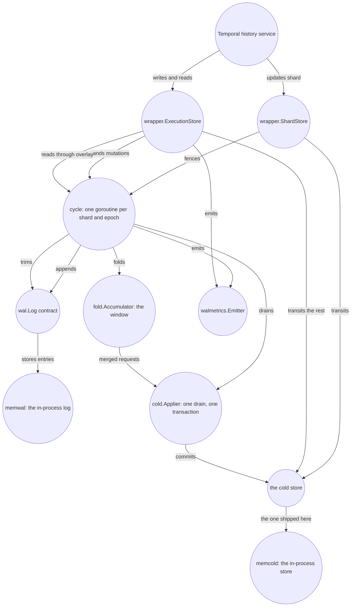

# The WAL Layer Handbook

Imagine a workflow that lives for ten seconds. In that time, Temporal may rewrite its mutable state
dozens of times, create and consume timers, and delete the task rows that represented them. The
event history it appends along the way has to be stored: a workflow replays against it, and no later
transition rewrites a batch already written. Every intermediate mutable-state image and every task
row is stored as well — including the images a later transition supersedes and the task rows deleted
moments after they were created.

waltz asks whether each of those intermediate forms has to reach the cold store as a write of its
own. It puts a durable per-shard write-ahead log in front of a Temporal history shard's cold store
and acknowledges a write as soon as the log holds it. In the shipped windowed configuration it then
folds many logged mutations into one later transaction against the store. That much sounds like
batching, and it is the easy part.

The hard part is the interval between the acknowledgement and that transaction. Throughout it the
cold store is behind: the caller has been told its write is durable, and the store does not have it
yet. The rest of the design follows from that gap. A read has to combine the store's rows with the
acknowledged mutations that have not reached them. A new shard owner has to apply the tail its
predecessor left behind, and the predecessor must never apply it as well. And the layer has to start
refusing writes before that unapplied tail outgrows what the node can hold. This book explains how
each of those obligations follows from the early acknowledgement, and which contracts hold them when
processes and storage fail.

waltz is **not a persistence implementation**, and that shapes every chapter here. The log is
whatever satisfies `wal.Log`; the cold store is whatever satisfies `cold.Store`. waltz is
everything between those two seams, and a deployment supplies both ends.
Each seam has exactly one shipped implementation in this tree: `wal/memwal`, the log in process
memory, and `cold/memcold`, Temporal's own SQL persistence over a SQLite database in the same
process. Neither is storage for anybody's data. They exist so that everything above them — up to
and including a running Temporal server — can be exercised without installing anything, and both
die with the process. [Chapter 15](15-the-limits-of-the-evidence.md) says what that costs the
evidence.

The book is written for two people. One **operates** a Temporal cluster with this layer and needs to
know which knob changes what, what a counter means at three in the morning, and which alerts show
fencing working as intended. The other **changes** the layer and needs the invariants, seams and
suites that will judge the change. Everything here describes the tree as it stands: every
identifier, default and count named in these pages exists in the code, and every chapter ends with
the files it draws from.

It is in two parts. **Chapters 01–11 are the reference**: what the layer is made of, what each seam
guarantees, what happens on each path, which key to set and what each series counts. **Chapters
12–15 are the deep dives**: the reasoning the reference states without arguing for it — what a write
cost before any of this existed, which designs were tried and refused, where each shipped default
came from, and what a green test run does not say. A reader who only has to run the thing never
needs them. A reader about to change something, or about to re-propose a design that was already
refused, does.

## Reading paths

**Read it as a book**

1. [01-overview.md](01-overview.md) — begin with one write, and with the problems that appear as
   soon as it is acknowledged before the cold store has changed.
2. [02-concepts-and-invariants.md](02-concepts-and-invariants.md) — name the states that now exist
   between the log and the cold store, and the invariants that constrain them.
3. [03-components.md](03-components.md) — see which packages own the states and operations just
   introduced.
4. [04-contracts.md](04-contracts.md) — inspect the boundaries that make those components
   replaceable and testable.
5. [05-write-path.md](05-write-path.md) — follow one mutation through the happy path and every point
   at which certainty can be lost.
6. [06-shard-lifecycle.md](06-shard-lifecycle.md) and [07-read-path.md](07-read-path.md) — what
   happens when the shard changes owners, and how a read is answered while acknowledged state still
   lives outside the cold store.
7. [08-configuration.md](08-configuration.md), [09-operations.md](09-operations.md) and
   [10-metrics.md](10-metrics.md) — choose the tradeoff, run it, and interpret its instruments.
8. [11-verification.md](11-verification.md) — finish with what the evidence does and does not prove.
9. Then the deep dives, in order: [12](12-the-write-before-the-layer.md) for the write this whole
   design is measured against, [13](13-designs-that-were-rejected.md) for the alternatives and the
   failures that refused them, [14](14-where-the-defaults-came-from.md) for where each shipped number
   came from, and [15](15-the-limits-of-the-evidence.md) for where the evidence stops.

**I am operating this**

1. [09-operations.md](09-operations.md) — deployment, the start and stop order, rolling restarts,
   and the seven runbooks.
2. [08-configuration.md](08-configuration.md) — the two configuration surfaces and every key on
   them, with three ready-made configurations.
3. [10-metrics.md](10-metrics.md) — every series with its tags and units, the quantities to derive,
   and the shape each alert should take.
4. [06-shard-lifecycle.md](06-shard-lifecycle.md) — what a failover actually does, why one halt
   class is fencing working as designed and the other is an incident, and what a killed node leaves
   behind.

**I am changing this**

1. [01-overview.md](01-overview.md) — the shape of the whole thing, and what the word "mode"
   names.
2. [02-concepts-and-invariants.md](02-concepts-and-invariants.md) — the vocabulary the rest of the
   book is written in, and the eleven numbered invariants.
3. [03-components.md](03-components.md) — the packages, the import bans and their reasons, and who
   owns what at run time.
4. [04-contracts.md](04-contracts.md) — every seam's interface: what it guarantees, what it refuses,
   what the caller owes it.
5. [05-write-path.md](05-write-path.md) — one mutation end to end, with a diagram per failure class.
6. [07-read-path.md](07-read-path.md) — the overlay, the merged task page, and invariant I7.
7. [11-verification.md](11-verification.md) — which suites will judge the change, and what a green
   run does not mean.
8. [13-designs-that-were-rejected.md](13-designs-that-were-rejected.md) — **read this before
   proposing a change to ownership, the window, the reads or how the fold is judged**: it holds the
   alternatives that were already refused, each with the failure that refused it.

**I am about to change a default, or argue with a number**

1. [14-where-the-defaults-came-from.md](14-where-the-defaults-came-from.md) — every shipped
   constant, where it came from, and which ones are derived rather than simply chosen.
2. [08-configuration.md](08-configuration.md) — what the key does and which surface it sits on.
3. [12-the-write-before-the-layer.md](12-the-write-before-the-layer.md) — what one write cost with
   no layer present, which is the baseline every saving is relative to.
4. [15-the-limits-of-the-evidence.md](15-the-limits-of-the-evidence.md) — what has never been
   measured, so that you do not invent a number to fill the gap.

**I am debugging an incident**

1. [09-operations.md's decision tree](09-operations.md#4-writes-to-one-shard-are-failing--where-to-go)
   — start from the error the *caller* saw, not from the dashboard. The tree routes you into one of
   [the seven runbooks](09-operations.md#5-runbooks) below it.
2. [10-metrics.md](10-metrics.md#3-the-reference-table) — what each series counts *exactly*; several
   count something narrower than their name suggests.
3. [06-shard-lifecycle.md](06-shard-lifecycle.md#5-halts-the-two-classes) — which of the two halt
   classes you are looking at, and which one nobody else picks up.

## The chapters

| file | title | what it answers |
|---|---|---|
| [01-overview.md](01-overview.md) | The layer at a glance | What waltz is, what one write costs with and without it, which packages it is made of, the two things "mode" means, and what the layer deliberately is not. |
| [02-concepts-and-invariants.md](02-concepts-and-invariants.md) | The geometry of an acknowledged write | Why the log needs three positions, how the tail differs from the window, every narrow term the book uses, and the eleven invariants with their enforcement and evidence. |
| [03-components.md](03-components.md) | Components: ownership, knowledge and calls | Why run-time calls and compile-time knowledge form different graphs, what each package owns, and which goroutine or mutex owns each mutable value. |
| [04-contracts.md](04-contracts.md) | Contracts at the failure boundaries | How three failures — an ambiguous append, an unknown drain outcome, a stale owner racing a current one — give every seam its shape, followed by the exact signatures, guarantees, refusals and caller obligations. |
| [05-write-path.md](05-write-path.md) | A write, end to end | What happens between `UpdateWorkflowExecution` and its return, in the happy path and in every failure path the code enumerates, ending in a table from what the caller saw to what the operator sees. |
| [06-shard-lifecycle.md](06-shard-lifecycle.md) | When an owner disappears | How fencing turns a new rangeID into a successor cycle, how it replays an inherited tail, why the two halt classes are opposites, and what a stopped node leaves behind. |
| [07-read-path.md](07-read-path.md) | Reading acknowledged state before it reaches the store | Why mutable state needs an overlay and task pages need an ordered merge, which reads transit to the store untouched, and how invariant I7 makes it legal for a drain to skip a task row whose range a caller has already completed. |
| [08-configuration.md](08-configuration.md) | Choosing the operating envelope | How window benefit trades against replay and memory, where the two configuration surfaces divide, every exact key and default, the budget refusal, and three recipes. |
| [09-operations.md](09-operations.md) | Running, deploying and debugging it | Deployment, start and stop order, rolling restarts and failover, the tree that routes a symptom and the seven runbooks it routes into, and a closing appendix on local development and its traps. |
| [10-metrics.md](10-metrics.md) | Every series the layer emits | Every series with its type, unit, tag values and emission point; what each counts exactly; the quantities to derive rather than expect; the shape of each alert; and the in-process counters no scrape has. |
| [11-verification.md](11-verification.md) | How the layer is judged | The log's contract suite and its blind spot; why the cold store's suites are Temporal's rather than ours; the fold acceptance and the control that makes its ratio a measurement; the run over both real seams; the Temporal server that boots in the test process; the witness, the checker, the guards and the doubles; the two house rules; and what is not claimed. |

### The deep dives

These four carry the reasoning behind the eleven chapters above. Nothing in them is needed to run,
configure or debug the layer; all of it is needed to change it without re-deciding something that
was already decided.

| file | title | what it answers |
|---|---|---|
| [12-the-write-before-the-layer.md](12-the-write-before-the-layer.md) | What one write cost before the layer | What one state transition physically is against a well-built store — adjacent keys, one gated query, history first — what makes a transaction immediate rather than distributed, and why a log built on that same database buys no latency — which is why the goal here is fewer writes rather than faster ones. |
| [13-designs-that-were-rejected.md](13-designs-that-were-rejected.md) | The designs that were rejected | Every alternative that was tried in the argument and refused — five designs for ownership, three for the window, four for the reads and two for how the fold is judged, among them a lease with a timer and a buffer inside the history service — each with the concrete failure that refused it. |
| [14-where-the-defaults-came-from.md](14-where-the-defaults-came-from.md) | Where the defaults came from | Every shipped constant with its provenance: the three drain triggers, the trim cadence, the two tail bounds and the node budget, what the budget costs resident, and the closing distinction between a number that is derived and a number that is simply chosen. |
| [15-the-limits-of-the-evidence.md](15-the-limits-of-the-evidence.md) | The limits of the evidence | What a green run actually asserts, once all of it is read together: what has never been measured, what is never staged, what no external judge can express, what the two in-memory seams cost the evidence, and why the list is not a roadmap. |

## The system

[Chapter 01](01-overview.md#the-system-map) owns this diagram and is where it is explained. The copy
here is verbatim, so change it there first and copy the result across; editing only this copy is how
the two start disagreeing.

## Conventions

* **Diagrams are mermaid**, in fenced code blocks tagged `mermaid`, so the source is reviewable in
  the Markdown and renders both on GitHub and in the built site. `npm run check` parses every block
  in every chapter and fails on one that will not render; `npm run build` writes the HTML edition
  into `site/`.
* **Links into the code are relative** — `../../wal/...` — and point at a file that
  exists, so they resolve from the Markdown, from the built page and from a checkout on disk. A
  chapter's closing "Where this lives in the code" is the list of files it was written from; when
  the prose and the file disagree, the file is right.
* **Links between chapters are checked, and their anchors are GitHub's.** `npm run check` resolves
  every link in every chapter — the file, and the heading an anchor names — and fails on one that
  does not, because renaming a heading otherwise breaks every link into it in silence. The slugs
  are GitHub's, spelled out in `slug.mjs` and used by the build too, so an anchor that works in one
  edition works in the other; note that where a heading contains an em dash, GitHub's slug has
  *two* hyphens where the spaces were.
* **Six chapters number their sections, and the rest do not.** 05 to 10 are the procedural ones —
  one write end to end, a shard's lifetime, a read, the knobs, the runbooks, the series — where a
  section is a step, "§4" is how such a chapter cites its own steps, and the number is what a link
  from another chapter lands on. The rest are arguments rather than procedures, so their headings
  name the claim instead of the step.
* **No ticket numbers.** History belongs in the commit message and the issue, which is where it is
  looked for. A number in these pages is a measurement or a default, never a citation.
* **Every identifier named here exists in the tree** — package, type, method, config key, metric
  series, test name. That is what makes a chapter checkable rather than plausible, and
  it is the property a fact-check of these pages verifies first.
* **Each chapter owns its subject.** Where another chapter needs the same mechanism it gets one
  sentence and a link rather than a second explanation, because two explanations are two things to
  keep true. The owners are: 01 the system map, 02 the vocabulary and the invariants, 03 the
  packages, 04 the contracts, 05 the write path, 06 the shard lifecycle, 07 the reads, 08 the
  configuration, 09 the operations, 10 the metrics, 11 the verification, 12 the incumbent's write,
  13 the refused designs, 14 the provenance of the defaults, and 15 the boundary of the claim.
* **A measurement is named with what produced it.** A number that cannot be reproduced from this
  tree — a percentage off one run, a byte count on one machine — is a historical observation rather
  than a property of this revision. Both shipped backends run in the layer's own process and exist
  to exercise it, so nothing measured over them would mean anything about a deployment. Every such
  number is therefore attributed, each time it appears, to **the research prototype** waltz was
  extracted from. [Chapter 14](14-where-the-defaults-came-from.md) applies the rule to every shipped
  default, and [chapter 15](15-the-limits-of-the-evidence.md) lists what stays unmeasured because of
  it.
